# Beyond安全区模块

<cite>
**本文档引用的文件**
- [Beyond.java](file://Beyond/src/main/java/com/pz/beyond/Beyond.java)
- [ZoneData.java](file://Beyond/src/main/java/com/pz/beyond/api/system/zone/ZoneData.java)
- [NodeData.java](file://Beyond/src/main/java/com/pz/beyond/api/system/node/NodeData.java)
- [Progress.java](file://Beyond/src/main/java/com/pz/beyond/api/system/progress/Progress.java)
- [NodeZone.java](file://Beyond/src/main/java/com/pz/beyond/api/system/zone/zones/NodeZone.java)
- [BeyondZoneInit.java](file://Beyond/src/main/java/com/pz/beyond/api/init/BeyondZoneInit.java)
- [BeyondNodeEventTypes.java](file://Beyond/src/main/java/com/pz/beyond/api/init/BeyondNodeEventTypes.java)
- [BeyondEncounters.java](file://Beyond/src/main/java/com/pz/beyond/api/init/BeyondEncounters.java)
- [BeyondZoneRuleInit.java](file://Beyond/src/main/java/com/pz/beyond/api/init/BeyondZoneRuleInit.java)
- [BeyondAttachInit.java](file://Beyond/src/main/java/com/pz/beyond/api/init/BeyondAttachInit.java)
- [IRuleContainer.java](file://Beyond/src/main/java/com/pz/beyond/api/system/zone/core/IRuleContainer.java)
- [IZonePosManager.java](file://Beyond/src/main/java/com/pz/beyond/api/system/zone/core/IZonePosManager.java)
- [AbstractZone.java](file://Beyond/src/main/java/com/pz/beyond/api/system/zone/AbstractZone.java)
- [LevelZoneData.java](file://Beyond/src/main/java/com/pz/beyond/api/system/zone/LevelZoneData.java)
- [SafeZone.java](file://Beyond/src/main/java/com/pz/beyond/api/system/zone/zones/SafeZone.java)
- [PlayerActiveZone.java](file://Beyond/src/main/java/com/pz/beyond/api/system/zone/zones/PlayerActiveZone.java)
- [PendingPlayerActiveZone.java](file://Beyond/src/main/java/com/pz/beyond/api/system/zone/zones/PendingPlayerActiveZone.java)
- [PlayerZoneData.java](file://Beyond/src/main/java/com/pz/beyond/api/system/zone/zones/PlayerZoneData.java)
- [NodeColor.java](file://Beyond/src/main/java/com/pz/beyond/api/system/node/NodeColor.java)
- [NodeState.java](file://Beyond/src/main/java/com/pz/beyond/api/system/node/NodeState.java)
- [NodeEventType.java](file://Beyond/src/main/java/com/pz/beyond/api/system/node/NodeEventType.java)
- [EncounterType.java](file://Beyond/src/main/java/com/pz/beyond/api/system/node/EncounterType.java)
- [Scene.java](file://Beyond/src/main/java/com/pz/beyond/api/system/progress/Scene.java)
- [ProgressType.java](file://Beyond/src/main/java/com/pz/beyond/api/system/progress/ProgressType.java)
- [ProgressState.java](file://Beyond/src/main/java/com/pz/beyond/api/system/progress/ProgressState.java)
- [ProgressManager.java](file://Beyond/src/main/java/com/pz/beyond/api/system/progress/core/IProgressManager.java)
- [BeyondData.java](file://Beyond/src/main/java/com/pz/beyond/api/system/BeyondData.java)
- [BeyondAPI.java](file://Beyond/src/main/java/com/pz/beyond/api/BeyondAPI.java)
- [ZoneEventHandle.java](file://Beyond/src/main/java/com/pz/beyond/api/event/handle/ZoneEventHandle.java)
- [PlayerChangeZoneEvent.java](file://Beyond/src/main/java/com/pz/beyond/api/event/custom/PlayerChangeZoneEvent.java)
- [AllSafeRule.java](file://Beyond/src/main/java/com/pz/beyond/rule/AllSafeRule.java)
- [AbstractRule.java](file://Beyond/src/main/java/com/pz/beyond/api/system/rule/AbstractRule.java)
- [IZoneRule.java](file://Beyond/src/main/java/com/pz/beyond/api/system/rule/IZoneRule.java)
- [RuleData.java](file://Beyond/src/main/java/com/pz/beyond/api/system/rule/RuleData.java)
- [Money.java](file://Beyond/src/main/java/com/pz/beyond/api/system/money/Money.java)
- [NodeBlock.java](file://Beyond/src/main/java/com/pz/beyond/api/system/node/block/NodeBlock.java)
- [RolledData.java](file://Beyond/src/main/java/com/pz/beyond/api/system/node/RolledData.java)
- [BossEvent.java](file://Beyond/src/main/java/com/pz/beyond/node/BossEvent.java)
- [ServerConfig.java](file://Beyond/src/main/java/com/pz/beyond/api/config/ServerConfig.java)
- [README.md](file://Beyond/README.md)
- [BeyondLevelData.java](file://Beyond/src/main/java/com/pz/beyond/api/system/BeyondLevelData.java)
- [BeyondPackInit.java](file://Beyond/src/main/java/com/pz/beyond/api/init/BeyondPackInit.java)
- [ProgressDefinition.java](file://Beyond/src/main/java/com/pz/beyond/api/system/definition/ProgressDefinition.java)
- [SceneDefinition.java](file://Beyond/src/main/java/com/pz/beyond/api/system/definition/SceneDefinition.java)
- [EncounterDefinition.java](file://Beyond/src/main/java/com/pz/beyond/api/system/definition/EncounterDefinition.java)
- [EventTask.java](file://Beyond/src/main/java/com/pz/beyond/api/system/definition/EventTask.java)
- [chapter1.json](file://Beyond/src/main/resources/data/beyond/progress/chapter1.json)
- [build.gradle](file://Beyond/build.gradle)
- [neoforge.mods.toml](file://Beyond/src/main/templates/META-INF/neoforge.mods.toml)
- [en_us.json](file://Beyond/src/main/resources/assets/beyond/lang/en_us.json)
- [zh_cn.json](file://Beyond/src/main/resources/assets/beyond/lang/zh_cn.json)
</cite>

## 更新摘要
**变更内容**
- 新增数据定义系统，引入配置驱动的关卡管理架构
- 新增Pack初始化系统，支持数据包驱动的内容加载
- 新增本地化支持，提供多语言文本资源
- 更新构建配置，从本地依赖管理迁移到GalaxyLib集成架构
- 新增BeyondLevelData维度级数据管理，支持关卡定义存储

## 目录
1. [简介](#简介)
2. [项目结构](#项目结构)
3. [核心组件](#核心组件)
4. [架构总览](#架构总览)
5. [详细组件分析](#详细组件分析)
6. [依赖关系分析](#依赖关系分析)
7. [性能考虑](#性能考虑)
8. [故障排除指南](#故障排除指南)
9. [结论](#结论)
10. [附录](#附录)

## 简介
Beyond安全区模块现已演变为完整的区域管理系统，从简单的安全区实现发展为支持多种区域类型、节点管理和进度追踪的综合平台。该系统围绕"区域-节点-进度"三层架构设计，提供灵活的区域管理能力和丰富的游戏体验。

**主要设计目标**：
- 多层次区域管理：支持安全区、节点区等多种区域类型
- 节点系统：基于节点的颜色、状态和事件类型构建复杂的探索体验
- 进度追踪：完整的游戏进程管理，支持多场景、多节点的进度控制
- 规则系统：可扩展的区域规则容器，支持动态规则绑定
- 与Biotech模块深度集成：通过区域系统支持基因相关的特殊区域
- **新增**：配置驱动的关卡管理，支持数据包定义的游戏内容
- **新增**：Pack初始化系统，提供标准化的数据包加载机制
- **新增**：本地化支持，确保多语言环境下的用户体验
- **新增**：GalaxyLib集成，实现模块间的共享基础设施

## 项目结构
Beyond模块采用全新的三层架构设计，分为系统层、数据层和事件层，并新增数据定义和Pack管理：

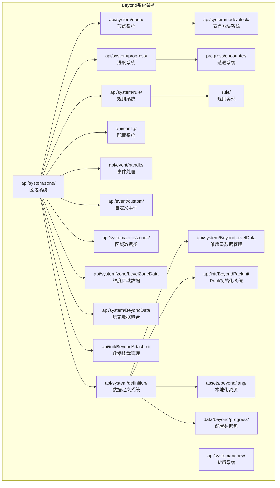

**图表来源**
- [Beyond.java:32-44](file://Beyond/src/main/java/com/pz/beyond/Beyond.java#L32-L44)
- [BeyondZoneInit.java](file://Beyond/src/main/java/com/pz/beyond/api/init/BeyondZoneInit.java)
- [BeyondNodeEventTypes.java](file://Beyond/src/main/java/com/pz/beyond/api/init/BeyondNodeEventTypes.java)
- [BeyondEncounters.java](file://Beyond/src/main/java/com/pz/beyond/api/init/BeyondEncounters.java)
- [ServerConfig.java:10-121](file://Beyond/src/main/java/com/pz/beyond/api/config/ServerConfig.java#L10-L121)
- [ZoneEventHandle.java:19-142](file://Beyond/src/main/java/com/pz/beyond/api/event/handle/ZoneEventHandle.java#L19-L142)
- [PlayerZoneData.java:25-166](file://Beyond/src/main/java/com/pz/beyond/api/system/zone/zones/PlayerZoneData.java#L25-L166)
- [BeyondLevelData.java:12-36](file://Beyond/src/main/java/com/pz/beyond/api/system/BeyondLevelData.java#L12-L36)
- [BeyondPackInit.java:1-5](file://Beyond/src/main/java/com/pz/beyond/api/init/BeyondPackInit.java#L1-L5)

## 核心组件

### 区域系统（Zone System）
- **ZoneData**：区域数据容器，支持规则绑定和区块管理
- **AbstractZone**：抽象区域基类，定义区域的基本行为
- **多种区域类型**：安全区、节点区等专用区域实现
- **区域规则容器**：支持动态规则绑定和管理
- **LevelZoneData**：维度区域数据管理，支持安全区初始化和区块管理

### 节点系统（Node System）
- **NodeData**：节点静态数据，包含颜色、状态和区块信息
- **NodeColor**：节点颜色系统，决定节点的视觉表现和功能
- **NodeState**：节点状态管理，支持锁定、解锁等状态转换
- **NodeEventType**：节点事件类型，定义节点触发的事件种类

### 进度系统（Progress System）
- **Progress**：游戏进度管理，支持多场景的进度追踪
- **Scene**：场景数据，定义游戏的不同阶段
- **ProgressType**：进度类型模板，定义游戏配置
- **ProgressState**：进度状态管理，跟踪游戏完成情况

### 规则系统（Rule System）
- **IRuleContainer**：规则容器接口，定义规则管理规范
- **RuleData**：规则数据模型，支持规则的序列化和传输
- **IZoneRule**：区域规则接口，定义规则的执行逻辑

### 配置系统（Config System）
- **ServerConfig**：服务器配置管理，提供安全区引导配置选项
- 支持村庄引导、出生点设置、玩家传送等功能配置

### 事件系统（Event System）
- **ZoneEventHandle**：区域事件处理器，管理区域相关的事件
- **PlayerChangeZoneEvent**：玩家区域变更事件，支持区域监听
- **自定义事件**：支持区域变更的事件通知机制

### 数据管理（Data Management）
- **BeyondData**：玩家数据聚合，管理所有Beyond相关数据
- **PlayerZoneData**：玩家区域数据，跟踪玩家当前所在区域
- **BeyondLevelData**：维度级数据管理，存储关卡定义和运行时数据
- **数据挂载**：通过NeoForge附件系统管理数据生命周期

### 数据定义系统（Data Definition System）
- **ProgressDefinition**：关卡数据定义，支持配置驱动的内容管理
- **SceneDefinition**：场景数据定义，支持权重随机选择机制
- **EncounterDefinition**：遭遇数据定义，管理事件任务列表
- **EventTask**：事件任务定义，支持节点事件组合

### Pack初始化系统（Pack Initialization System）
- **BeyondPackInit**：Pack初始化入口，提供标准化的数据包加载机制
- **配置数据包**：通过JSON文件定义游戏内容和规则
- **数据序列化**：支持Mojang序列化框架的Codec和StreamCodec

### 本地化系统（Localization System）
- **多语言支持**：提供英文和中文的文本资源
- **配置文本**：支持安全区传送等用户界面文本
- **资源管理**：通过assets目录管理本地化资源

**章节来源**
- [ZoneData.java:22-124](file://Beyond/src/main/java/com/pz/beyond/api/system/zone/ZoneData.java#L22-L124)
- [NodeData.java:13-89](file://Beyond/src/main/java/com/pz/beyond/api/system/node/NodeData.java#L13-L89)
- [Progress.java:18-155](file://Beyond/src/main/java/com/pz/beyond/api/system/progress/Progress.java#L18-L155)
- [IRuleContainer.java](file://Beyond/src/main/java/com/pz/beyond/api/system/zone/core/IRuleContainer.java)
- [RuleData.java](file://Beyond/src/main/java/com/pz/beyond/api/system/rule/RuleData.java)
- [ServerConfig.java:10-121](file://Beyond/src/main/java/com/pz/beyond/api/config/ServerConfig.java#L10-L121)
- [ZoneEventHandle.java:19-142](file://Beyond/src/main/java/com/pz/beyond/api/event/handle/ZoneEventHandle.java#L19-L142)
- [PlayerZoneData.java:25-166](file://Beyond/src/main/java/com/pz/beyond/api/system/zone/zones/PlayerZoneData.java#L25-L166)
- [BeyondData.java:21-152](file://Beyond/src/main/java/com/pz/beyond/api/system/BeyondData.java#L21-L152)
- [BeyondLevelData.java:12-36](file://Beyond/src/main/java/com/pz/beyond/api/system/BeyondLevelData.java#L12-L36)
- [ProgressDefinition.java:20-89](file://Beyond/src/main/java/com/pz/beyond/api/system/definition/ProgressDefinition.java#L20-L89)
- [SceneDefinition.java:17-129](file://Beyond/src/main/java/com/pz/beyond/api/system/definition/SceneDefinition.java#L17-L129)
- [EncounterDefinition.java:17-104](file://Beyond/src/main/java/com/pz/beyond/api/system/definition/EncounterDefinition.java#L17-L104)
- [EventTask.java:16-38](file://Beyond/src/main/java/com/pz/beyond/api/system/definition/EventTask.java#L16-L38)

## 架构总览
区域管理系统采用"模板-实例-数据"的三层架构模式，新增配置管理和事件处理层，并集成了GalaxyLib基础设施：

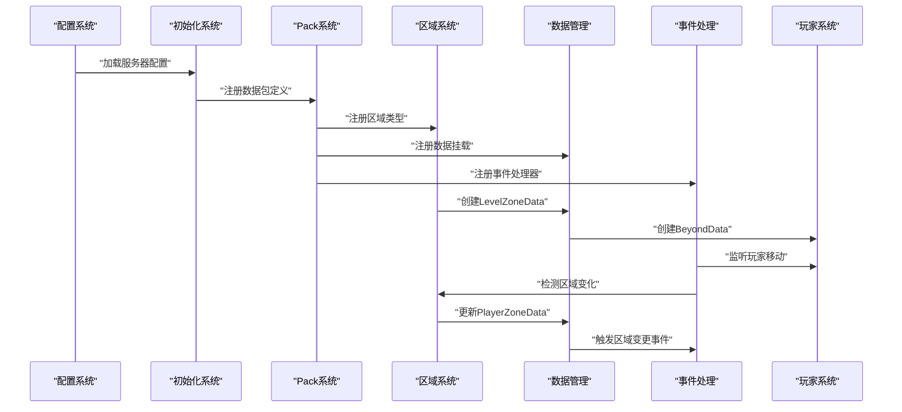

**图表来源**
- [ServerConfig.java:34-85](file://Beyond/src/main/java/com/pz/beyond/api/config/ServerConfig.java#L34-L85)
- [BeyondAttachInit.java:23-186](file://Beyond/src/main/java/com/pz/beyond/api/init/BeyondAttachInit.java#L23-L186)
- [BeyondPackInit.java:1-5](file://Beyond/src/main/java/com/pz/beyond/api/init/BeyondPackInit.java#L1-L5)
- [LevelZoneData.java:73-100](file://Beyond/src/main/java/com/pz/beyond/api/system/zone/LevelZoneData.java#L73-L100)
- [BeyondData.java:74-91](file://Beyond/src/main/java/com/pz/beyond/api/system/BeyondData.java#L74-L91)
- [ZoneEventHandle.java:46-103](file://Beyond/src/main/java/com/pz/beyond/api/event/handle/ZoneEventHandle.java#L46-L103)

## 详细组件分析

### 服务器配置系统（ServerConfig）
ServerConfig提供完整的服务器配置管理，专注于安全区引导功能：

**配置选项**：
- **enableVillageBootstrap**：启用村庄引导功能
- **setWorldSpawn**：设置世界出生点到村庄位置
- **teleportPlayersOnLoad**：初始化时传送在线玩家
- **villageSearchRadiusChunks**：村庄搜索半径（1-2048区块）
- **initialSafeZoneSizeChunks**：初始安全区大小（1-4096区块）
- **minVillageWrapSizeChunks**：最小安全区包裹大小（1-4096区块）

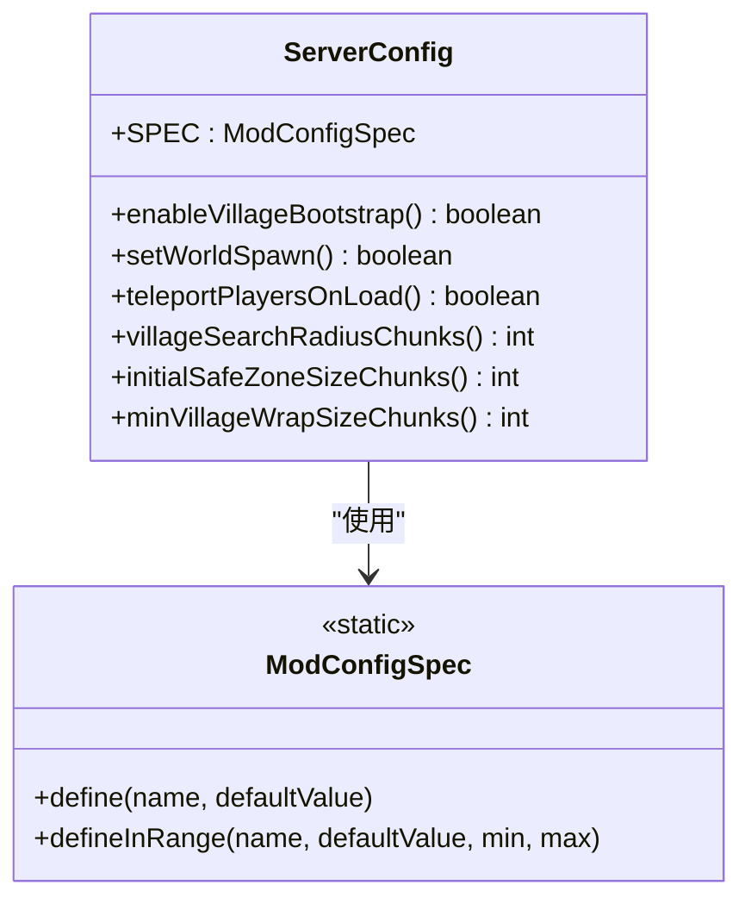

**图表来源**
- [ServerConfig.java:10-121](file://Beyond/src/main/java/com/pz/beyond/api/config/ServerConfig.java#L10-L121)

**章节来源**
- [ServerConfig.java:10-121](file://Beyond/src/main/java/com/pz/beyond/api/config/ServerConfig.java#L10-L121)

### 玩家区域数据管理（PlayerZoneData）
PlayerZoneData提供玩家区域状态的完整管理，支持区域检测和规则触发：

**核心功能**：
- **区域检测**：基于区块坐标检测玩家当前所在区域
- **规则触发**：自动触发区域变更相关的规则监听器
- **序列化支持**：支持NBT和网络传输的序列化机制
- **事件通知**：通过PlayerChangeZoneEvent通知区域变更

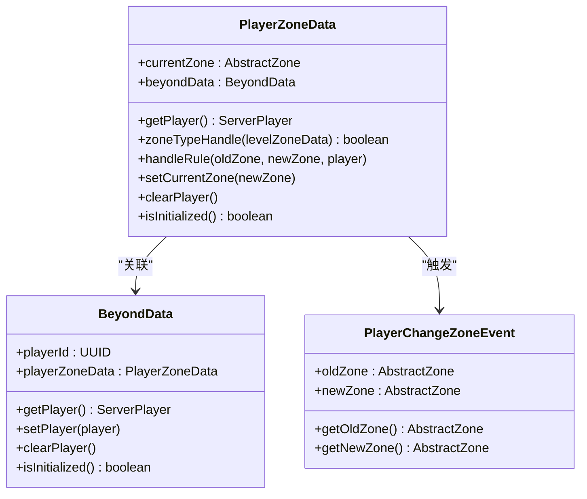

**图表来源**
- [PlayerZoneData.java:30-166](file://Beyond/src/main/java/com/pz/beyond/api/system/zone/zones/PlayerZoneData.java#L30-L166)
- [BeyondData.java:27-152](file://Beyond/src/main/java/com/pz/beyond/api/system/BeyondData.java#L27-L152)
- [PlayerChangeZoneEvent.java:12-30](file://Beyond/src/main/java/com/pz/beyond/api/event/custom/PlayerChangeZoneEvent.java#L12-L30)

**章节来源**
- [PlayerZoneData.java:25-166](file://Beyond/src/main/java/com/pz/beyond/api/system/zone/zones/PlayerZoneData.java#L25-L166)
- [BeyondData.java:21-152](file://Beyond/src/main/java/com/pz/beyond/api/system/BeyondData.java#L21-L152)
- [PlayerChangeZoneEvent.java:9-30](file://Beyond/src/main/java/com/pz/beyond/api/event/custom/PlayerChangeZoneEvent.java#L9-L30)

### 区域事件处理增强（ZoneEventHandle）
ZoneEventHandle增强了区域事件处理能力，提供更精确的事件管理和性能优化：

**事件处理机制**：
- **延迟初始化**：安全区初始化延迟5秒，避免世界加载早期结构查询不稳定
- **区块加载处理**：新区块加载时自动添加到PendingZone
- **玩家移动检测**：每4tick检测一次玩家区域变化，减少性能开销
- **多事件支持**：支持玩家登录、重生、传送等多种事件场景

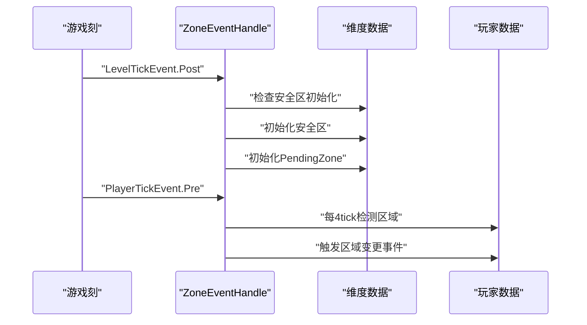

**图表来源**
- [ZoneEventHandle.java:46-103](file://Beyond/src/main/java/com/pz/beyond/api/event/handle/ZoneEventHandle.java#L46-L103)
- [ZoneEventHandle.java:108-139](file://Beyond/src/main/java/com/pz/beyond/api/event/handle/ZoneEventHandle.java#L108-L139)

**章节来源**
- [ZoneEventHandle.java:19-142](file://Beyond/src/main/java/com/pz/beyond/api/event/handle/ZoneEventHandle.java#L19-L142)

### 区域数据模型（ZoneData）
ZoneData是区域系统的核心数据容器，实现了IRuleContainer接口，提供完整的区域数据管理功能：

**核心特性**：
- **规则容器**：支持动态添加、移除和清理规则监听器
- **区块管理**：使用LongOpenHashSet管理区域覆盖的区块
- **序列化支持**：提供Codec和StreamCodec，支持NBT和网络传输
- **区域关联**：通过BeyondZoneInit管理区域类型和ID映射

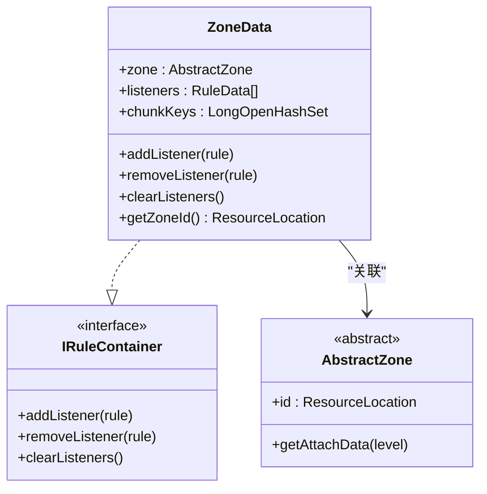

**图表来源**
- [ZoneData.java:22-124](file://Beyond/src/main/java/com/pz/beyond/api/system/zone/ZoneData.java#L22-L124)
- [IRuleContainer.java](file://Beyond/src/main/java/com/pz/beyond/api/system/zone/core/IRuleContainer.java)

**章节来源**
- [ZoneData.java:22-124](file://Beyond/src/main/java/com/pz/beyond/api/system/zone/ZoneData.java#L22-L124)

### 节点数据模型（NodeData）
NodeData提供节点的静态数据管理，支持节点的颜色、状态和位置信息：

**数据结构**：
- **NodeColor**：节点颜色，决定节点的功能和视觉表现
- **chunkKey**：区块键值，使用ChunkPos.toLong()格式存储
- **NodeState**：节点状态，默认为LOCKED状态

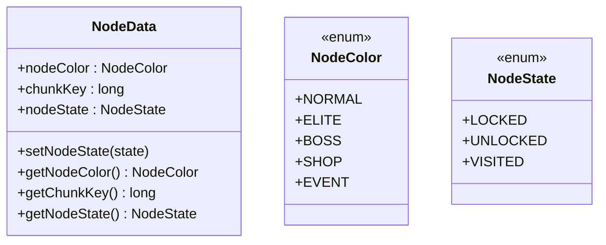

**图表来源**
- [NodeData.java:13-89](file://Beyond/src/main/java/com/pz/beyond/api/system/node/NodeData.java#L13-L89)
- [NodeColor.java](file://Beyond/src/main/java/com/pz/beyond/api/system/node/NodeColor.java)
- [NodeState.java](file://Beyond/src/main/java/com/pz/beyond/api/system/node/NodeState.java)

**章节来源**
- [NodeData.java:13-89](file://Beyond/src/main/java/com/pz/beyond/api/system/node/NodeData.java#L13-L89)

### 进度管理系统（Progress）
Progress系统提供完整的游戏进度管理，支持多场景的进度追踪和状态控制：

**核心功能**：
- **场景管理**：支持多个Scene的有序排列
- **进度追踪**：跟踪当前场景索引和完成状态
- **随机性支持**：提供Random源用于事件随机选择
- **进度推进**：支持场景间的自动推进

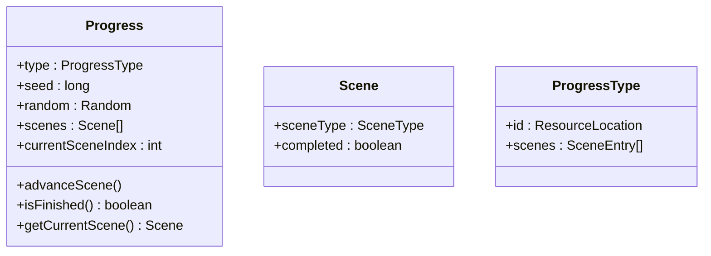

**图表来源**
- [Progress.java:18-155](file://Beyond/src/main/java/com/pz/beyond/api/system/progress/Progress.java#L18-L155)
- [Scene.java](file://Beyond/src/main/java/com/pz/beyond/api/system/progress/Scene.java)
- [ProgressType.java](file://Beyond/src/main/java/com/pz/beyond/api/system/progress/ProgressType.java)

**章节来源**
- [Progress.java:18-155](file://Beyond/src/main/java/com/pz/beyond/api/system/progress/Progress.java#L18-L155)

### 区域类型系统
系统支持多种区域类型，每种区域都有特定的功能和用途：

**主要区域类型**：
- **SafeZone**：安全区域，提供玩家保护
- **NodeZone**：节点区域，支持节点导航和探索
- **PlayerActiveZone**：玩家活跃区域，跟踪玩家活动
- **PendingPlayerActiveZone**：待激活玩家区域

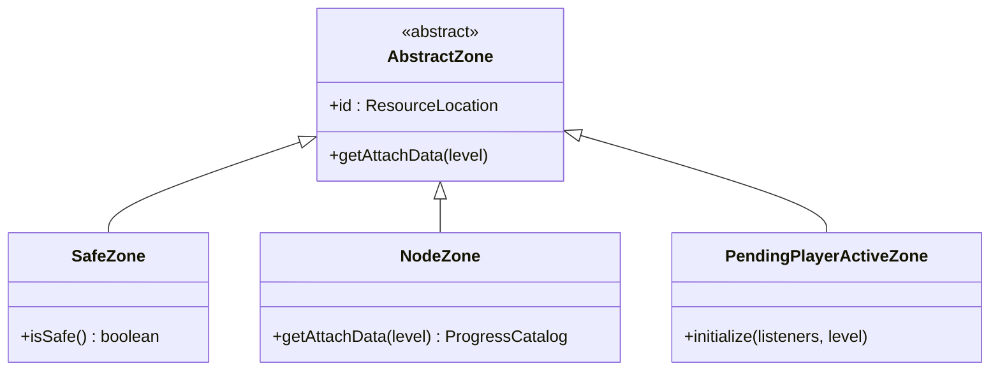

**图表来源**
- [AbstractZone.java](file://Beyond/src/main/java/com/pz/beyond/api/system/zone/AbstractZone.java)
- [SafeZone.java](file://Beyond/src/main/java/com/pz/beyond/api/system/zone/zones/SafeZone.java)
- [NodeZone.java](file://Beyond/src/main/java/com/pz/beyond/api/system/zone/zones/NodeZone.java)
- [PendingPlayerActiveZone.java](file://Beyond/src/main/java/com/pz/beyond/api/system/zone/zones/PendingPlayerActiveZone.java)

**章节来源**
- [AbstractZone.java](file://Beyond/src/main/java/com/pz/beyond/api/system/zone/AbstractZone.java)
- [SafeZone.java](file://Beyond/src/main/java/com/pz/beyond/api/system/zone/zones/SafeZone.java)
- [NodeZone.java](file://Beyond/src/main/java/com/pz/beyond/api/system/zone/zones/NodeZone.java)
- [PendingPlayerActiveZone.java](file://Beyond/src/main/java/com/pz/beyond/api/system/zone/zones/PendingPlayerActiveZone.java)

### 规则系统架构
规则系统提供灵活的区域规则管理，支持动态规则绑定和执行：

**规则接口体系**：
- **IZoneRule**：区域规则接口，定义规则的执行逻辑
- **AbstractRule**：抽象规则基类，提供通用规则功能
- **RuleData**：规则数据模型，支持规则的序列化和传输

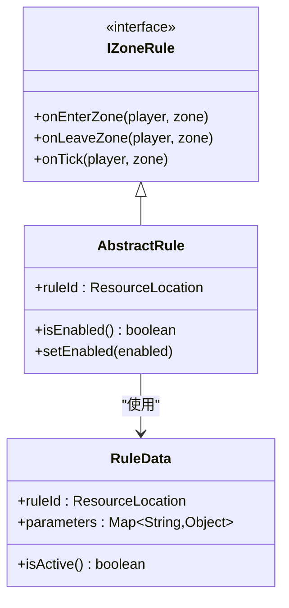

**图表来源**
- [IZoneRule.java](file://Beyond/src/main/java/com/pz/beyond/api/system/rule/IZoneRule.java)
- [AbstractRule.java](file://Beyond/src/main/java/com/pz/beyond/api/system/rule/AbstractRule.java)
- [RuleData.java](file://Beyond/src/main/java/com/pz/beyond/api/system/rule/RuleData.java)

**章节来源**
- [IZoneRule.java](file://Beyond/src/main/java/com/pz/beyond/api/system/rule/IZoneRule.java)
- [AbstractRule.java](file://Beyond/src/main/java/com/pz/beyond/api/system/rule/AbstractRule.java)
- [RuleData.java](file://Beyond/src/main/java/com/pz/beyond/api/system/rule/RuleData.java)

### 数据定义系统（Data Definition System）
数据定义系统提供配置驱动的内容管理，支持关卡、场景和遭遇的定义：

**核心组件**：
- **ProgressDefinition**：关卡定义，包含场景列表和遭遇映射
- **SceneDefinition**：场景定义，支持权重随机选择机制
- **EncounterDefinition**：遭遇定义，管理事件任务列表
- **EventTask**：事件任务定义，支持节点事件组合

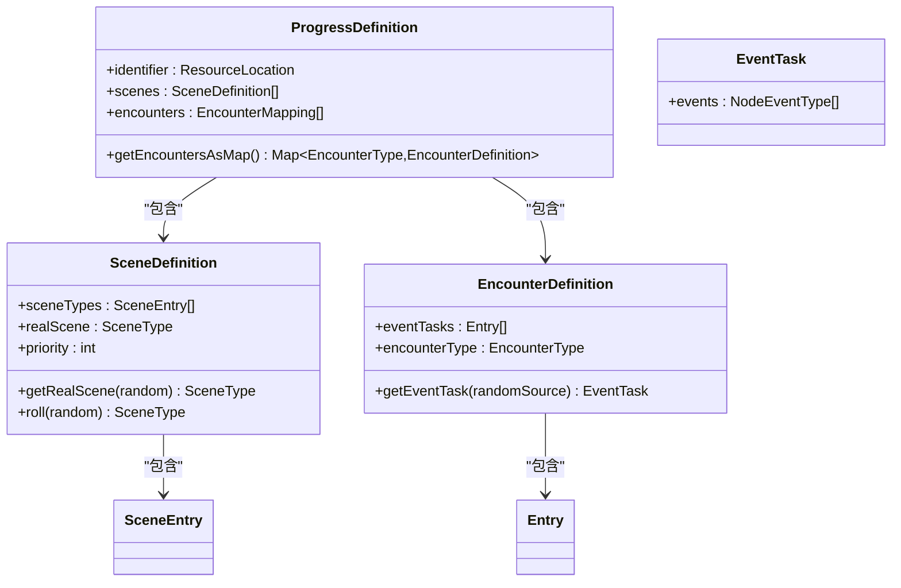

**图表来源**
- [ProgressDefinition.java:20-89](file://Beyond/src/main/java/com/pz/beyond/api/system/definition/ProgressDefinition.java#L20-L89)
- [SceneDefinition.java:17-129](file://Beyond/src/main/java/com/pz/beyond/api/system/definition/SceneDefinition.java#L17-L129)
- [EncounterDefinition.java:17-104](file://Beyond/src/main/java/com/pz/beyond/api/system/definition/EncounterDefinition.java#L17-L104)
- [EventTask.java:16-38](file://Beyond/src/main/java/com/pz/beyond/api/system/definition/EventTask.java#L16-L38)

**章节来源**
- [ProgressDefinition.java:20-89](file://Beyond/src/main/java/com/pz/beyond/api/system/definition/ProgressDefinition.java#L20-L89)
- [SceneDefinition.java:17-129](file://Beyond/src/main/java/com/pz/beyond/api/system/definition/SceneDefinition.java#L17-L129)
- [EncounterDefinition.java:17-104](file://Beyond/src/main/java/com/pz/beyond/api/system/definition/EncounterDefinition.java#L17-L104)
- [EventTask.java:16-38](file://Beyond/src/main/java/com/pz/beyond/api/system/definition/EventTask.java#L16-L38)

### Pack初始化系统（Pack Initialization System）
Pack初始化系统提供标准化的数据包加载机制，支持配置驱动的内容管理：

**核心功能**：
- **BeyondPackInit**：Pack初始化入口，提供统一的初始化接口
- **数据包注册**：支持关卡定义、场景配置和遭遇数据的注册
- **序列化支持**：提供Codec和StreamCodec支持数据包的序列化和传输
- **配置驱动**：通过JSON文件定义游戏内容，支持热重载

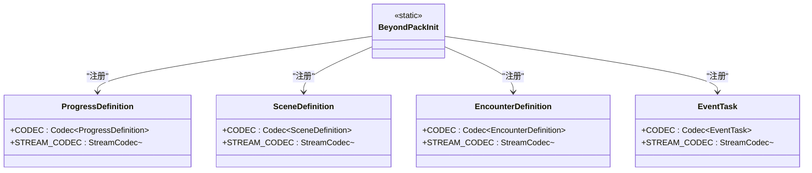

**图表来源**
- [BeyondPackInit.java:1-5](file://Beyond/src/main/java/com/pz/beyond/api/init/BeyondPackInit.java#L1-L5)
- [ProgressDefinition.java:36-52](file://Beyond/src/main/java/com/pz/beyond/api/system/definition/ProgressDefinition.java#L36-L52)
- [SceneDefinition.java:33-55](file://Beyond/src/main/java/com/pz/beyond/api/system/definition/SceneDefinition.java#L33-L55)
- [EncounterDefinition.java:31-49](file://Beyond/src/main/java/com/pz/beyond/api/system/definition/EncounterDefinition.java#L31-L49)
- [EventTask.java:26-36](file://Beyond/src/main/java/com/pz/beyond/api/system/definition/EventTask.java#L26-L36)

**章节来源**
- [BeyondPackInit.java:1-5](file://Beyond/src/main/java/com/pz/beyond/api/init/BeyondPackInit.java#L1-L5)
- [ProgressDefinition.java:36-52](file://Beyond/src/main/java/com/pz/beyond/api/system/definition/ProgressDefinition.java#L36-L52)
- [SceneDefinition.java:33-55](file://Beyond/src/main/java/com/pz/beyond/api/system/definition/SceneDefinition.java#L33-L55)
- [EncounterDefinition.java:31-49](file://Beyond/src/main/java/com/pz/beyond/api/system/definition/EncounterDefinition.java#L31-L49)
- [EventTask.java:26-36](file://Beyond/src/main/java/com/pz/beyond/api/system/definition/EventTask.java#L26-L36)

### 本地化系统（Localization System）
本地化系统提供多语言支持，确保不同语言环境下的用户体验：

**支持的语言**：
- **英文（en_us）**：标准英文界面文本
- **中文（zh_cn）**：简体中文界面文本
- **配置文本**：支持安全区传送等用户界面文本

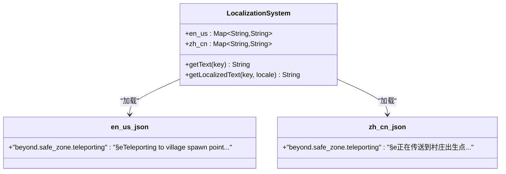

**图表来源**
- [en_us.json:1-7](file://Beyond/src/main/resources/assets/beyond/lang/en_us.json#L1-L7)
- [zh_cn.json:1-7](file://Beyond/src/main/resources/assets/beyond/lang/zh_cn.json#L1-L7)

**章节来源**
- [en_us.json:1-7](file://Beyond/src/main/resources/assets/beyond/lang/en_us.json#L1-L7)
- [zh_cn.json:1-7](file://Beyond/src/main/resources/assets/beyond/lang/zh_cn.json#L1-L7)

### 构建配置系统（Build Configuration System）
构建配置系统从本地依赖管理迁移到GalaxyLib集成架构：

**构建变更**：
- **依赖管理**：从本地依赖改为GalaxyLib集成
- **模块结构**：支持多模块开发和依赖管理
- **版本控制**：通过settings.gradle管理模块版本
- **打包配置**：支持Maven发布和本地仓库

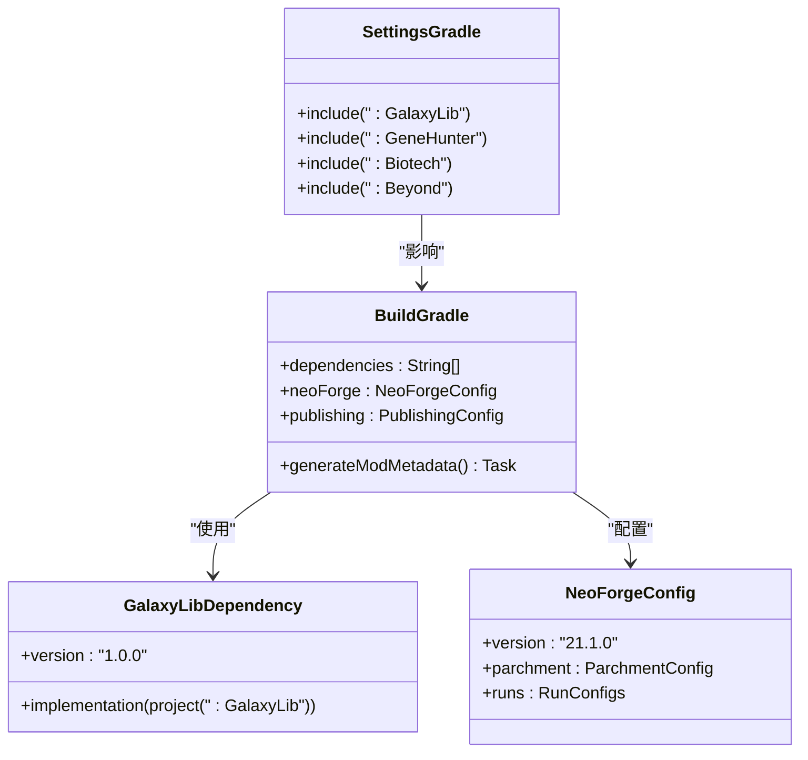

**图表来源**
- [build.gradle:64-67](file://Beyond/build.gradle#L64-L67)
- [build.gradle:19-57](file://Beyond/build.gradle#L19-L57)
- [settings.gradle:13-18](file://settings.gradle#L13-L18)

**章节来源**
- [build.gradle:64-67](file://Beyond/build.gradle#L64-L67)
- [build.gradle:19-57](file://Beyond/build.gradle#L19-L57)
- [settings.gradle:13-18](file://settings.gradle#L13-L18)

### 维度级数据管理（BeyondLevelData）
BeyondLevelData提供维度级的数据管理，支持关卡定义的存储和访问：

**核心功能**：
- **维度标识**：存储当前维度的ResourceKey
- **关卡定义**：管理ProgressDefinition的Map存储
- **运行时数据**：支持关卡运行时状态的存储
- **数据持久化**：通过维度数据实现数据持久化

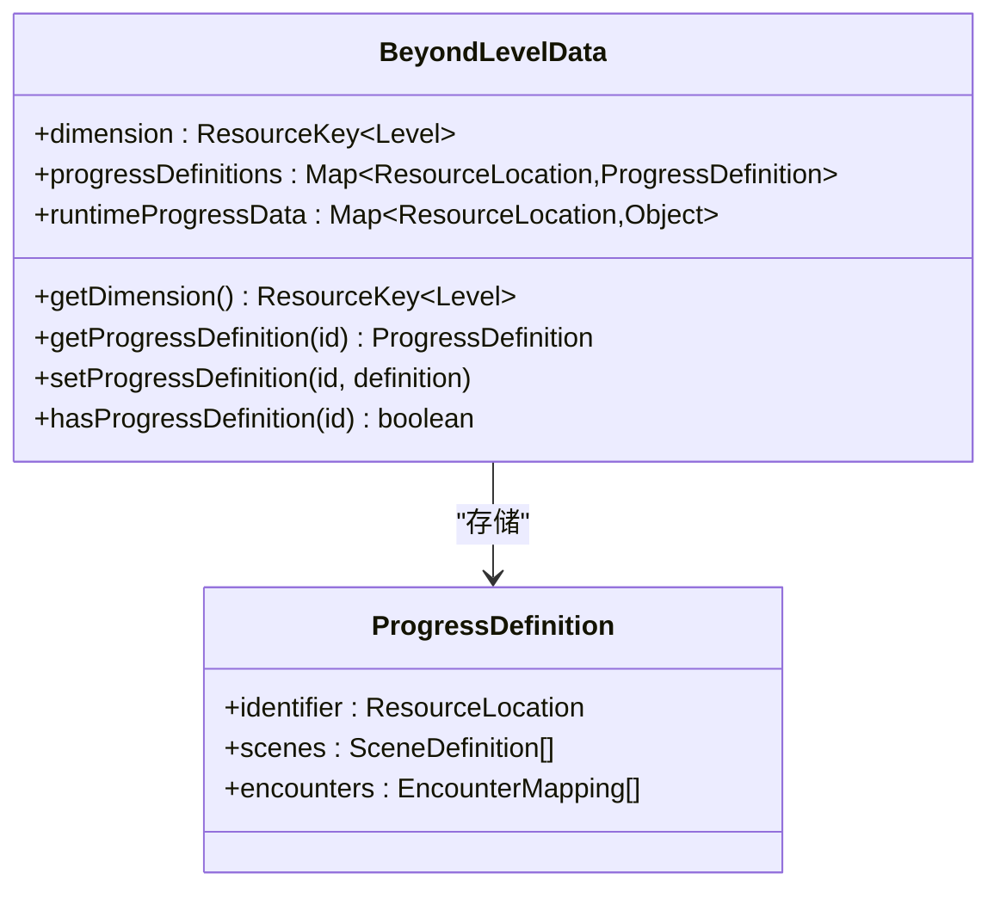

**图表来源**
- [BeyondLevelData.java:12-36](file://Beyond/src/main/java/com/pz/beyond/api/system/BeyondLevelData.java#L12-L36)
- [ProgressDefinition.java:20-89](file://Beyond/src/main/java/com/pz/beyond/api/system/definition/ProgressDefinition.java#L20-L89)

**章节来源**
- [BeyondLevelData.java:12-36](file://Beyond/src/main/java/com/pz/beyond/api/system/BeyondLevelData.java#L12-L36)
- [ProgressDefinition.java:20-89](file://Beyond/src/main/java/com/pz/beyond/api/system/definition/ProgressDefinition.java#L20-L89)

## 依赖关系分析
区域管理系统具有清晰的层次依赖关系，新增配置管理和事件处理层，并集成了GalaxyLib基础设施：

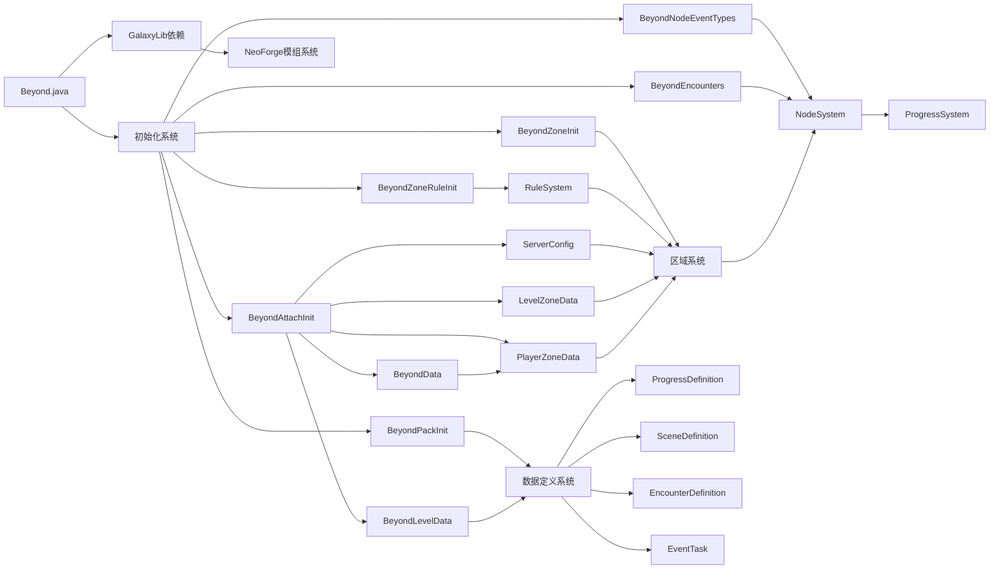

**图表来源**
- [Beyond.java:32-44](file://Beyond/src/main/java/com/pz/beyond/Beyond.java#L32-L44)
- [BeyondAttachInit.java:23-186](file://Beyond/src/main/java/com/pz/beyond/api/init/BeyondAttachInit.java#L23-L186)
- [ServerConfig.java:10-121](file://Beyond/src/main/java/com/pz/beyond/api/config/ServerConfig.java#L10-L121)
- [BeyondData.java:27-152](file://Beyond/src/main/java/com/pz/beyond/api/system/BeyondData.java#L27-L152)
- [LevelZoneData.java:31-309](file://Beyond/src/main/java/com/pz/beyond/api/system/zone/LevelZoneData.java#L31-L309)
- [PlayerZoneData.java:30-166](file://Beyond/src/main/java/com/pz/beyond/api/system/zone/zones/PlayerZoneData.java#L30-L166)
- [BeyondLevelData.java:12-36](file://Beyond/src/main/java/com/pz/beyond/api/system/BeyondLevelData.java#L12-L36)
- [BeyondPackInit.java:1-5](file://Beyond/src/main/java/com/pz/beyond/api/init/BeyondPackInit.java#L1-L5)
- [ProgressDefinition.java:20-89](file://Beyond/src/main/java/com/pz/beyond/api/system/definition/ProgressDefinition.java#L20-L89)
- [build.gradle:64-67](file://Beyond/build.gradle#L64-L67)

**章节来源**
- [Beyond.java:32-44](file://Beyond/src/main/java/com/pz/beyond/Beyond.java#L32-L44)

## 性能考虑
区域管理系统在设计时充分考虑了性能优化，新增配置管理和事件处理优化，并集成了GalaxyLib基础设施：

**内存优化**：
- 使用LongOpenHashSet存储区块键值，提供高效的查找性能
- 节点数据采用不可变设计，减少内存占用
- 规则数据支持延迟加载，避免不必要的初始化
- **新增**：PlayerZoneData使用延迟初始化，减少内存占用
- **新增**：数据定义采用Codec序列化，减少反射开销

**网络优化**：
- 提供StreamCodec支持高效网络传输
- 区域数据按需传输，避免全量同步
- 支持增量更新，只传输变更的数据
- **新增**：数据定义支持流式编码，减少网络负载
- **新增**：维度数据按维度隔离，避免跨维度数据传输

**计算优化**：
- 区域检测使用空间索引优化
- 节点状态检查采用缓存机制
- 规则执行采用事件驱动，避免轮询
- **新增**：玩家移动检测间隔优化，每4tick检测一次
- **新增**：安全区初始化延迟，避免早期结构查询不稳定
- **新增**：数据定义缓存，避免重复解析配置文件

**配置优化**：
- **新增**：ServerConfig提供配置项范围验证，防止无效配置
- **新增**：支持配置热更新，动态调整安全区行为
- **新增**：Pack初始化系统支持配置文件的热重载

**模块化优化**：
- **新增**：GalaxyLib集成提供共享基础设施，减少重复实现
- **新增**：模块间依赖管理，支持独立开发和测试
- **新增**：构建系统优化，支持并行编译和增量构建

## 故障排除指南
**区域系统常见问题**：

1. **区域类型未注册**
   - 检查BeyondZoneInit中的区域注册
   - 确认区域ID格式正确
   - 验证区域实现类的构造函数

2. **节点数据不生效**
   - 检查NodeData的chunkKey格式
   - 确认节点状态转换逻辑
   - 验证节点事件类型注册

3. **进度系统异常**
   - 检查ProgressType配置
   - 确认场景顺序正确
   - 验证随机种子生成

4. **规则系统问题**
   - 检查规则ID唯一性
   - 确认规则参数格式
   - 验证规则启用状态

5. **配置系统问题**
   - **新增**：检查ServerConfig配置文件格式
   - **新增**：验证配置项范围和默认值
   - **新增**：确认配置项名称拼写正确

6. **事件处理问题**
   - **新增**：检查ZoneEventHandle事件订阅
   - **新增**：验证事件处理间隔设置
   - **新增**：确认维度白名单配置

7. **数据管理问题**
   - **新增**：检查BeyondData数据挂载
   - **新增**：验证PlayerZoneData序列化
   - **新增**：确认数据生命周期管理

8. **数据定义问题**
   - **新增**：检查ProgressDefinition配置格式
   - **新增**：验证SceneDefinition权重总和
   - **新增**：确认EncounterDefinition事件任务

9. **Pack初始化问题**
   - **新增**：检查BeyondPackInit初始化顺序
   - **新增**：验证数据包注册完整性
   - **新增**：确认序列化Codec正确性

10. **本地化问题**
    - **新增**：检查JSON文件格式正确性
    - **新增**：验证语言包完整性
    - **新增**：确认文本键值存在

11. **构建配置问题**
    - **新增**：检查GalaxyLib依赖版本
    - **新增**：验证模块包含关系
    - **新增**：确认构建脚本语法

12. **维度数据问题**
    - **新增**：检查BeyondLevelData维度标识
    - **新增**：验证关卡定义存储
    - **新增**：确认运行时数据同步

**章节来源**
- [BeyondZoneInit.java](file://Beyond/src/main/java/com/pz/beyond/api/init/BeyondZoneInit.java)
- [NodeData.java:13-89](file://Beyond/src/main/java/com/pz/beyond/api/system/node/NodeData.java#L13-L89)
- [Progress.java:18-155](file://Beyond/src/main/java/com/pz/beyond/api/system/progress/Progress.java#L18-L155)
- [ServerConfig.java:34-85](file://Beyond/src/main/java/com/pz/beyond/api/config/ServerConfig.java#L34-L85)
- [ZoneEventHandle.java:46-103](file://Beyond/src/main/java/com/pz/beyond/api/event/handle/ZoneEventHandle.java#L46-L103)
- [BeyondData.java:74-91](file://Beyond/src/main/java/com/pz/beyond/api/system/BeyondData.java#L74-L91)
- [PlayerZoneData.java:94-112](file://Beyond/src/main/java/com/pz/beyond/api/system/zone/zones/PlayerZoneData.java#L94-L112)
- [ProgressDefinition.java:20-89](file://Beyond/src/main/java/com/pz/beyond/api/system/definition/ProgressDefinition.java#L20-L89)
- [BeyondPackInit.java:1-5](file://Beyond/src/main/java/com/pz/beyond/api/init/BeyondPackInit.java#L1-L5)
- [en_us.json:1-7](file://Beyond/src/main/resources/assets/beyond/lang/en_us.json#L1-L7)
- [zh_cn.json:1-7](file://Beyond/src/main/resources/assets/beyond/lang/zh_cn.json#L1-L7)
- [build.gradle:64-67](file://Beyond/build.gradle#L64-L67)
- [BeyondLevelData.java:12-36](file://Beyond/src/main/java/com/pz/beyond/api/system/BeyondLevelData.java#L12-L36)

## 结论
Beyond安全区模块的重构标志着从简单安全区功能向完整区域管理系统的重大升级。新的三层架构设计提供了强大的扩展性和灵活性，支持复杂的区域类型、节点管理和进度追踪功能。

**核心优势**：
- **模块化设计**：清晰的系统分层，便于维护和扩展
- **可扩展性**：支持新的区域类型和节点事件类型
- **性能优化**：针对大型世界进行了专门优化
- **与Biotech集成**：为基因系统提供专门的区域支持
- **配置管理**：提供灵活的服务器配置选项
- **事件处理**：增强的事件处理机制，支持多种场景
- **数据管理**：完善的玩家数据管理，支持区域状态跟踪
- **数据定义系统**：配置驱动的内容管理，支持关卡定义
- **Pack初始化系统**：标准化的数据包加载机制
- **本地化支持**：多语言文本资源管理
- **GalaxyLib集成**：共享基础设施，减少重复实现

**新增特性**：
- **ServerConfig配置系统**：提供安全区引导和初始化行为控制
- **增强的事件处理**：优化的区域事件处理机制
- **PlayerZoneData数据类**：完整的玩家区域状态管理
- **PlayerChangeZoneEvent事件**：支持区域变更监听
- **数据定义系统**：配置驱动的关卡管理架构
- **Pack初始化系统**：标准化的数据包加载机制
- **本地化系统**：多语言文本资源管理
- **构建配置系统**：GalaxyLib集成架构
- **维度级数据管理**：BeyondLevelData支持关卡定义存储

这一重构为后续的功能扩展奠定了坚实基础，特别是在与Biotech模块的深度集成方面展现了巨大的潜力。GalaxyLib的集成进一步提升了模块间的协作效率，为未来的功能扩展提供了更加稳固的技术基础。

## 附录

### 配置方法
**区域系统配置**：
- 通过BeyondZoneInit注册新的区域类型
- 在BeyondNodeEventTypes中注册节点事件类型
- 使用BeyondEncounters配置遭遇系统
- 通过BeyondZoneRuleInit管理区域规则

**配置系统配置**：
- **新增**：通过ServerConfig配置安全区引导行为
- **新增**：设置村庄搜索半径和安全区大小
- **新增**：配置玩家传送和出生点设置

**数据定义配置**：
- **新增**：通过ProgressDefinition定义关卡内容
- **新增**：使用SceneDefinition配置场景权重
- **新增**：通过EncounterDefinition配置遭遇事件
- **新增**：在chapter1.json中定义具体配置

**Pack初始化配置**：
- **新增**：通过BeyondPackInit注册数据包定义
- **新增**：配置数据包的序列化Codec
- **新增**：设置数据包的加载优先级

**本地化配置**：
- **新增**：在assets/beyond/lang目录添加语言文件
- **新增**：定义多语言文本键值对
- **新增**：验证文本资源的完整性

**章节来源**
- [BeyondZoneInit.java](file://Beyond/src/main/java/com/pz/beyond/api/init/BeyondZoneInit.java)
- [BeyondNodeEventTypes.java](file://Beyond/src/main/java/com/pz/beyond/api/init/BeyondNodeEventTypes.java)
- [BeyondEncounters.java](file://Beyond/src/main/java/com/pz/beyond/api/init/BeyondEncounters.java)
- [BeyondZoneRuleInit.java](file://Beyond/src/main/java/com/pz/beyond/api/init/BeyondZoneRuleInit.java)
- [ServerConfig.java:34-85](file://Beyond/src/main/java/com/pz/beyond/api/config/ServerConfig.java#L34-L85)
- [ProgressDefinition.java:20-89](file://Beyond/src/main/java/com/pz/beyond/api/system/definition/ProgressDefinition.java#L20-L89)
- [SceneDefinition.java:17-129](file://Beyond/src/main/java/com/pz/beyond/api/system/definition/SceneDefinition.java#L17-L129)
- [EncounterDefinition.java:17-104](file://Beyond/src/main/java/com/pz/beyond/api/system/definition/EncounterDefinition.java#L17-L104)
- [BeyondPackInit.java:1-5](file://Beyond/src/main/java/com/pz/beyond/api/init/BeyondPackInit.java#L1-L5)
- [en_us.json:1-7](file://Beyond/src/main/resources/assets/beyond/lang/en_us.json#L1-L7)
- [zh_cn.json:1-7](file://Beyond/src/main/resources/assets/beyond/lang/zh_cn.json#L1-L7)

### 扩展指南
**添加新的区域类型**：
1. 继承AbstractZone基类
2. 实现getAttachData方法
3. 在BeyondZoneInit中注册
4. 创建对应的ZoneData实例

**添加新的节点事件**：
1. 在NodeEventType中添加新类型
2. 实现对应的事件处理器
3. 配置事件参数
4. 测试事件触发逻辑

**新增配置选项**：
1. **新增**：在ServerConfig中添加新的配置项
2. **新增**：设置默认值和范围验证
3. **新增**：提供配置访问方法
4. **新增**：测试配置加载和应用

**新增事件处理**：
1. **新增**：在ZoneEventHandle中添加新的事件处理方法
2. **新增**：注册事件订阅
3. **新增**：实现事件处理逻辑
4. **新增**：测试事件响应

**新增数据定义**：
1. **新增**：创建新的数据定义类继承自RecordCodecBuilder
2. **新增**：实现Codec和StreamCodec序列化
3. **新增**：在JSON配置文件中添加对应定义
4. **新增**：测试数据加载和序列化

**新增Pack初始化**：
1. **新增**：在BeyondPackInit中注册新的数据包
2. **新增**：实现Pack初始化逻辑
3. **新增**：配置数据包的加载顺序
4. **新增**：测试Pack初始化流程

**新增本地化支持**：
1. **新增**：在assets/beyond/lang目录添加新语言文件
2. **新增**：定义缺失的文本键值
3. **新增**：验证本地化资源的完整性
4. **新增**：测试多语言切换功能

**新增构建配置**：
1. **新增**：在build.gradle中添加新的依赖
2. **新增**：配置模块间的依赖关系
3. **新增**：设置版本号和发布配置
4. **新增**：测试构建流程

**章节来源**
- [AbstractZone.java](file://Beyond/src/main/java/com/pz/beyond/api/system/zone/AbstractZone.java)
- [NodeEventType.java](file://Beyond/src/main/java/com/pz/beyond/api/system/node/NodeEventType.java)
- [BeyondZoneInit.java](file://Beyond/src/main/java/com/pz/beyond/api/init/BeyondZoneInit.java)
- [ServerConfig.java:10-121](file://Beyond/src/main/java/com/pz/beyond/api/config/ServerConfig.java#L10-L121)
- [ZoneEventHandle.java:19-142](file://Beyond/src/main/java/com/pz/beyond/api/event/handle/ZoneEventHandle.java#L19-L142)
- [ProgressDefinition.java:20-89](file://Beyond/src/main/java/com/pz/beyond/api/system/definition/ProgressDefinition.java#L20-L89)
- [BeyondPackInit.java:1-5](file://Beyond/src/main/java/com/pz/beyond/api/init/BeyondPackInit.java#L1-L5)
- [en_us.json:1-7](file://Beyond/src/main/resources/assets/beyond/lang/en_us.json#L1-L7)
- [build.gradle:64-67](file://Beyond/build.gradle#L64-L67)