# Beyond安全区模块

<cite>
**本文档引用的文件**
- [Beyond.java](file://Beyond/src/main/java/com/pz/beyond/Beyond.java)
- [BeyondAPI.java](file://Beyond/src/main/java/com/pz/beyond/api/BeyondAPI.java)
- [BeyondAttachInit.java](file://Beyond/src/main/java/com/pz/beyond/api/init/BeyondAttachInit.java)
- [BeyondPackInit.java](file://Beyond/src/main/java/com/pz/beyond/api/init/BeyondPackInit.java)
- [BeyondLevelData.java](file://Beyond/src/main/java/com/pz/beyond/api/system/BeyondLevelData.java)
- [BeyondPlayerData.java](file://Beyond/src/main/java/com/pz/beyond/api/system/BeyondPlayerData.java)
- [LevelZoneData.java](file://Beyond/src/main/java/com/pz/beyond/api/system/zone/LevelZoneData.java)
- [ZoneData.java](file://Beyond/src/main/java/com/pz/beyond/api/system/zone/ZoneData.java)
- [PlayerZoneData.java](file://Beyond/src/main/java/com/pz/beyond/api/system/zone/zones/PlayerZoneData.java)
- [SafeZone.java](file://Beyond/src/main/java/com/pz/beyond/api/system/zone/zones/SafeZone.java)
- [PlayerActiveZone.java](file://Beyond/src/main/java/com/pz/beyond/api/system/zone/zones/PlayerActiveZone.java)
- [ProgressPack.java](file://Beyond/src/main/java/com/pz/beyond/api/pack/ProgressPack.java)
- [BeyondZoneInit.java](file://Beyond/src/main/java/com/pz/beyond/api/init/BeyondZoneInit.java)
- [ProgressState.java](file://Beyond/src/main/java/com/pz/beyond/api/system/progress/ProgressState.java)
- [IProgressManager.java](file://Beyond/src/main/java/com/pz/beyond/api/system/progress/core/IProgressManager.java)
- [ServerConfig.java](file://Beyond/src/main/java/com/pz/beyond/api/config/ServerConfig.java)
- [ZoneEventHandle.java](file://Beyond/src/main/java/com/pz/beyond/api/event/handle/ZoneEventHandle.java)
- [PlayerChangeZoneEvent.java](file://Beyond/src/main/java/com/pz/beyond/api/event/custom/PlayerChangeZoneEvent.java)
- [AllSafeRule.java](file://Beyond/src/main/java/com/pz/beyond/rule/AllSafeRule.java)
- [AbstractRule.java](file://Beyond/src/main/java/com/pz/beyond/api/system/rule/AbstractRule.java)
- [IZoneRule.java](file://Beyond/src/main/java/com/pz/beyond/api/system/rule/IZoneRule.java)
- [RuleData.java](file://Beyond/src/main/java/com/pz/beyond/api/system/rule/RuleData.java)
- [Money.java](file://Beyond/src/main/java/com/pz/beyond/api/system/money/Money.java)
- [NodeBlock.java](file://Beyond/src/main/java/com/pz/beyond/api/system/node/block/NodeBlock.java)
- [RolledData.java](file://Beyond/src/main/java/com/pz/beyond/api/system/node/RolledData.java)
- [BossEvent.java](file://Beyond/src/main/java/com/pz/beyond/node/BossEvent.java)
- [en_us.json](file://Beyond/src/main/resources/assets/beyond/lang/en_us.json)
- [zh_cn.json](file://Beyond/src/main/resources/assets/beyond/lang/zh_cn.json)
- [chapter1.json](file://Beyond/src/main/resources/data/beyond/progress/chapter1.json)
- [build.gradle](file://Beyond/build.gradle)
- [settings.gradle](file://settings.gradle)
- [neoforge.mods.toml](file://Beyond/src/main/templates/META-INF/neoforge.mods.toml)
</cite>

## 更新摘要
**变更内容**
- 核心类重构：BeyondAPI、BeyondAttachInit、BeyondPackInit等核心类的重大重构
- 新增数据类：BeyondLevelData和BeyondPlayerData数据类替代旧的progress管理架构
- 数据管理架构升级：从传统progress系统迁移到基于数据包的配置驱动架构
- 附件系统重构：基于NeoForge附件系统的全新数据挂载机制
- Pack初始化系统：ProgressPack提供标准化的数据包加载和同步机制

## 目录
1. [简介](#简介)
2. [项目结构](#项目结构)
3. [核心组件](#核心组件)
4. [架构总览](#架构总览)
5. [详细组件分析](#详细组件分析)
6. [依赖关系分析](#依赖关系分析)
7. [性能考虑](#性能考虑)
8. [故障排除指南](#故障排除指南)
9. [结论](#结论)
10. [附录](#附录)

## 简介
Beyond安全区模块经过重大重构，从简单的安全区功能发展为基于数据包驱动的完整区域管理系统。新架构采用"数据包-附件-区域"的三层设计，提供灵活的配置管理和强大的扩展能力。

**主要设计目标**：
- 基于数据包的配置驱动架构，支持动态内容加载
- 基于NeoForge附件系统的数据挂载机制，提供完整的数据生命周期管理
- 多层次区域管理：支持安全区、节点区等多种区域类型
- 完整的玩家数据管理：通过BeyondPlayerData聚合所有相关数据
- 维度级数据管理：通过BeyondLevelData管理关卡定义和运行时数据
- 标准化的Pack初始化系统，提供统一的数据包加载机制
- 与Biotech模块深度集成：通过区域系统支持基因相关的特殊区域

## 项目结构
重构后的Beyond模块采用全新的三层架构设计，分为系统层、数据层和事件层，并集成了基于数据包的配置管理：

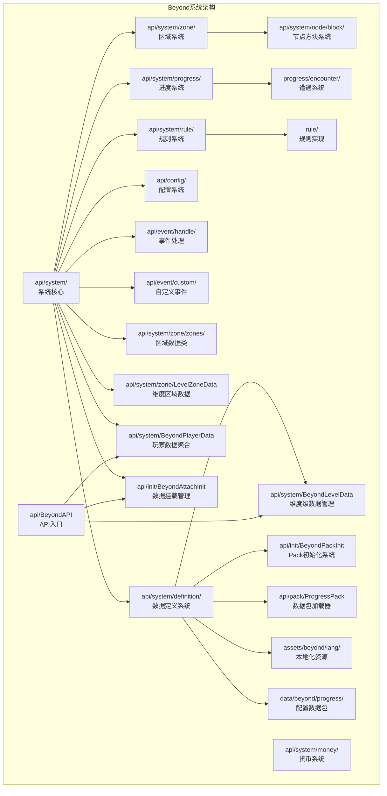

**图表来源**
- [Beyond.java:24-48](file://Beyond/src/main/java/com/pz/beyond/Beyond.java#L24-L48)
- [BeyondAPI.java:12-26](file://Beyond/src/main/java/com/pz/beyond/api/BeyondAPI.java#L12-L26)
- [BeyondAttachInit.java:22-101](file://Beyond/src/main/java/com/pz/beyond/api/init/BeyondAttachInit.java#L22-L101)
- [BeyondPackInit.java:12-36](file://Beyond/src/main/java/com/pz/beyond/api/init/BeyondPackInit.java#L12-L36)
- [BeyondLevelData.java:24-69](file://Beyond/src/main/java/com/pz/beyond/api/system/BeyondLevelData.java#L24-L69)
- [BeyondPlayerData.java:27-97](file://Beyond/src/main/java/com/pz/beyond/api/system/BeyondPlayerData.java#L27-L97)
- [ProgressPack.java:26-96](file://Beyond/src/main/java/com/pz/beyond/api/pack/ProgressPack.java#L26-L96)

## 核心组件

### API入口系统（BeyondAPI）
BeyondAPI作为系统入口，提供统一的数据访问接口：

**核心功能**：
- **维度数据获取**：通过getBeyondLevelData获取维度级数据
- **玩家数据获取**：通过getBeyondPlayerData获取玩家相关数据
- **数据访问封装**：隐藏底层数据挂载细节，提供简洁的API接口

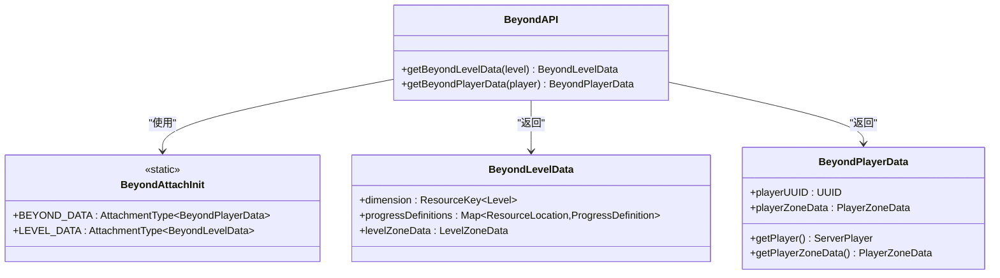

**图表来源**
- [BeyondAPI.java:12-26](file://Beyond/src/main/java/com/pz/beyond/api/BeyondAPI.java#L12-L26)
- [BeyondAttachInit.java:54-84](file://Beyond/src/main/java/com/pz/beyond/api/init/BeyondAttachInit.java#L54-L84)
- [BeyondLevelData.java:31-48](file://Beyond/src/main/java/com/pz/beyond/api/system/BeyondLevelData.java#L31-L48)
- [BeyondPlayerData.java:33-81](file://Beyond/src/main/java/com/pz/beyond/api/system/BeyondPlayerData.java#L33-L81)

**章节来源**
- [BeyondAPI.java:12-26](file://Beyond/src/main/java/com/pz/beyond/api/BeyondAPI.java#L12-L26)
- [BeyondAttachInit.java:54-84](file://Beyond/src/main/java/com/pz/beyond/api/init/BeyondAttachInit.java#L54-L84)

### 数据挂载系统（BeyondAttachInit）
基于NeoForge附件系统的全新数据挂载机制：

**核心特性**：
- **维度白名单**：仅允许在指定维度（如主世界）挂载数据
- **玩家数据挂载**：BEYOND_DATA附件类型管理玩家相关数据
- **维度数据挂载**：LEVEL_DATA附件类型管理维度级数据
- **序列化支持**：提供Codec和StreamCodec支持数据持久化和网络传输
- **生命周期管理**：自动管理数据的创建、销毁和复制

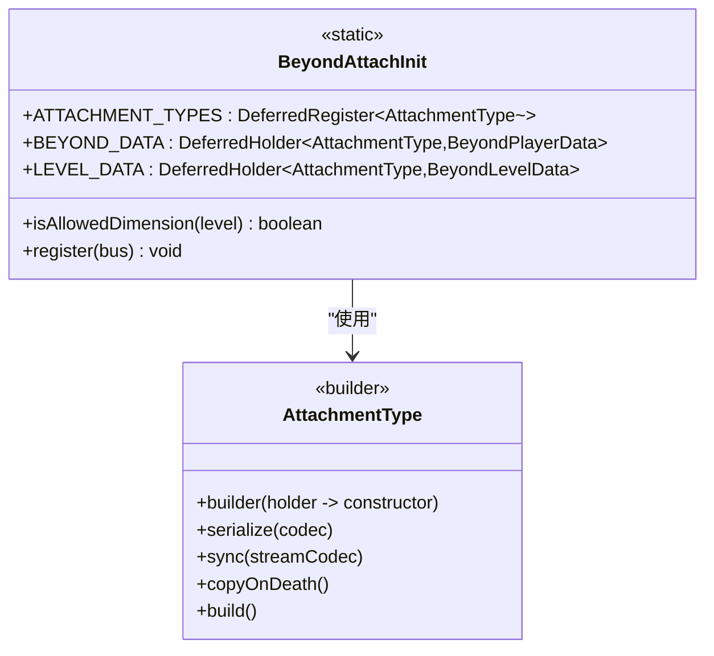

**图表来源**
- [BeyondAttachInit.java:25-84](file://Beyond/src/main/java/com/pz/beyond/api/init/BeyondAttachInit.java#L25-L84)

**章节来源**
- [BeyondAttachInit.java:22-101](file://Beyond/src/main/java/com/pz/beyond/api/init/BeyondAttachInit.java#L22-L101)

### 数据包初始化系统（BeyondPackInit）
标准化的数据包加载和同步机制：

**核心功能**：
- **重载监听器注册**：通过AddReloadListenerEvent注册ProgressPack
- **数据包同步**：通过OnDatapackSyncEvent同步数据包到客户端
- **玩家登录处理**：处理玩家登录时的数据包应用
- **事件驱动架构**：基于NeoForge事件总线的异步处理机制

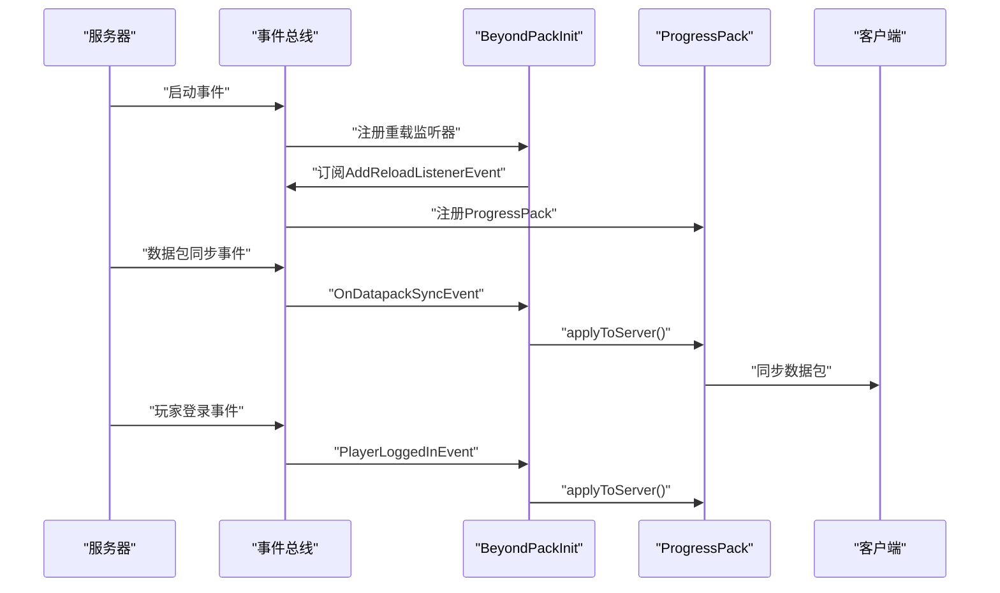

**图表来源**
- [BeyondPackInit.java:14-34](file://Beyond/src/main/java/com/pz/beyond/api/init/BeyondPackInit.java#L14-L34)
- [ProgressPack.java:34-94](file://Beyond/src/main/java/com/pz/beyond/api/pack/ProgressPack.java#L34-L94)

**章节来源**
- [BeyondPackInit.java:12-36](file://Beyond/src/main/java/com/pz/beyond/api/init/BeyondPackInit.java#L12-L36)
- [ProgressPack.java:26-96](file://Beyond/src/main/java/com/pz/beyond/api/pack/ProgressPack.java#L26-L96)

### 玩家数据管理（BeyondPlayerData）
完整的玩家数据聚合管理：

**核心功能**：
- **延迟初始化**：仅在需要时创建PlayerZoneData实例
- **UUID管理**：通过UUID关联玩家身份，支持客户端和服务端
- **玩家引用**：缓存ServerPlayer引用，提供快速访问
- **序列化支持**：完整的Codec和StreamCodec序列化机制
- **数据聚合**：聚合所有Beyond相关的玩家数据

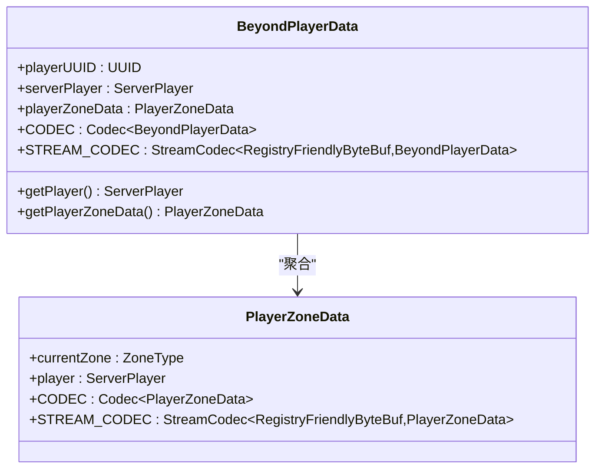

**图表来源**
- [BeyondPlayerData.java:28-97](file://Beyond/src/main/java/com/pz/beyond/api/system/BeyondPlayerData.java#L28-L97)
- [PlayerZoneData.java:29-64](file://Beyond/src/main/java/com/pz/beyond/api/system/zone/zones/PlayerZoneData.java#L29-L64)

**章节来源**
- [BeyondPlayerData.java:27-97](file://Beyond/src/main/java/com/pz/beyond/api/system/BeyondPlayerData.java#L27-L97)
- [PlayerZoneData.java:25-64](file://Beyond/src/main/java/com/pz/beyond/api/system/zone/zones/PlayerZoneData.java#L25-L64)

### 维度数据管理（BeyondLevelData）
维度级的数据管理，替代旧的progress管理架构：

**核心功能**：
- **维度标识**：存储当前维度的ResourceKey
- **关卡定义管理**：Map存储ProgressDefinition，支持动态加载
- **区域数据管理**：集成LevelZoneData管理区域信息
- **序列化支持**：完整的Codec和StreamCodec支持数据持久化
- **运行时数据**：预留运行时关卡数据存储空间

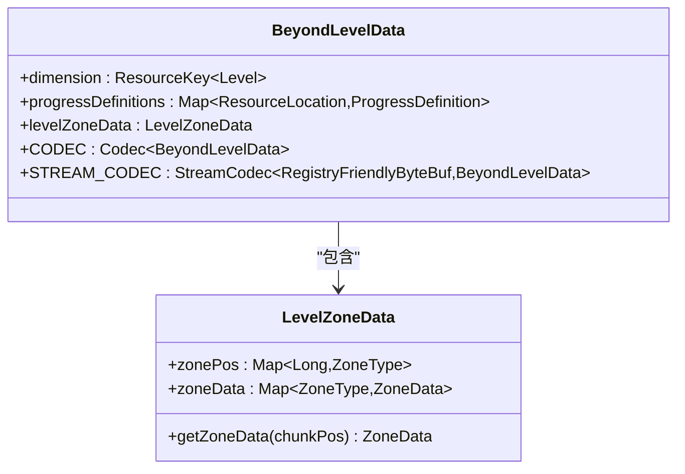

**图表来源**
- [BeyondLevelData.java:25-69](file://Beyond/src/main/java/com/pz/beyond/api/system/BeyondLevelData.java#L25-69)
- [LevelZoneData.java:23-83](file://Beyond/src/main/java/com/pz/beyond/api/system/zone/LevelZoneData.java#L23-83)

**章节来源**
- [BeyondLevelData.java:24-69](file://Beyond/src/main/java/com/pz/beyond/api/system/BeyondLevelData.java#L24-L69)
- [LevelZoneData.java:22-83](file://Beyond/src/main/java/com/pz/beyond/api/system/zone/LevelZoneData.java#L22-L83)

### 区域系统重构
区域系统完全重构，采用新的ZoneType架构：

**核心组件**：
- **ZoneType**：区域类型的抽象基类
- **ZoneData**：区域数据容器，实现IRuleContainer接口
- **LevelZoneData**：维度区域数据管理
- **多种区域类型**：SafeZone、PlayerActiveZone等专用实现

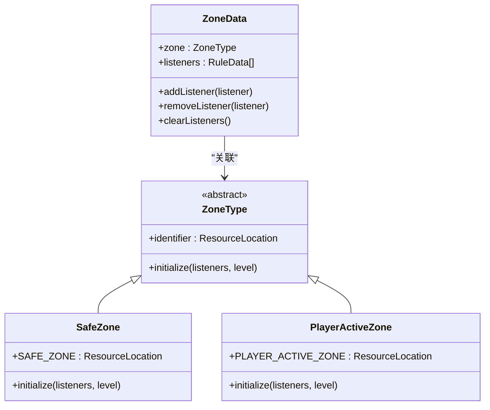

**图表来源**
- [BeyondZoneInit.java:26-71](file://Beyond/src/main/java/com/pz/beyond/api/init/BeyondZoneInit.java#L26-L71)
- [ZoneData.java:20-69](file://Beyond/src/main/java/com/pz/beyond/api/system/zone/ZoneData.java#L20-69)
- [SafeZone.java:40-66](file://Beyond/src/main/java/com/pz/beyond/api/system/zone/zones/SafeZone.java#L40-66)
- [PlayerActiveZone.java:14-28](file://Beyond/src/main/java/com/pz/beyond/api/system/zone/zones/PlayerActiveZone.java#L14-28)

**章节来源**
- [BeyondZoneInit.java:22-71](file://Beyond/src/main/java/com/pz/beyond/api/init/BeyondZoneInit.java#L22-L71)
- [ZoneData.java:19-69](file://Beyond/src/main/java/com/pz/beyond/api/system/zone/ZoneData.java#L19-69)
- [SafeZone.java:35-66](file://Beyond/src/main/java/com/pz/beyond/api/system/zone/zones/SafeZone.java#L35-66)
- [PlayerActiveZone.java:11-28](file://Beyond/src/main/java/com/pz/beyond/api/system/zone/zones/PlayerActiveZone.java#L11-28)

### 数据包加载系统（ProgressPack）
基于数据包的配置驱动架构：

**核心功能**：
- **资源扫描**：扫描data/beyond/progress目录下的JSON文件
- **配置解析**：使用Mojang序列化框架解析ProgressDefinition
- **动态加载**：支持数据包的热重载和实时更新
- **错误处理**：完善的错误处理和日志记录机制

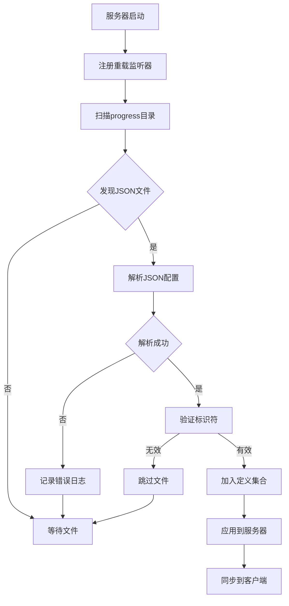

**图表来源**
- [ProgressPack.java:34-94](file://Beyond/src/main/java/com/pz/beyond/api/pack/ProgressPack.java#L34-L94)

**章节来源**
- [ProgressPack.java:26-96](file://Beyond/src/main/java/com/pz/beyond/api/pack/ProgressPack.java#L26-L96)

### 进度系统重构
进度系统从传统的Progress类重构为基于数据包的配置驱动架构：

**新架构特点**：
- **ProgressState枚举**：定义关卡状态（SAFE、WAITING、IN_PROGRESS等）
- **IProgressManager接口**：提供进度管理的标准接口
- **配置驱动**：通过数据包定义关卡配置，支持热重载
- **状态管理**：简化了复杂的进度追踪逻辑

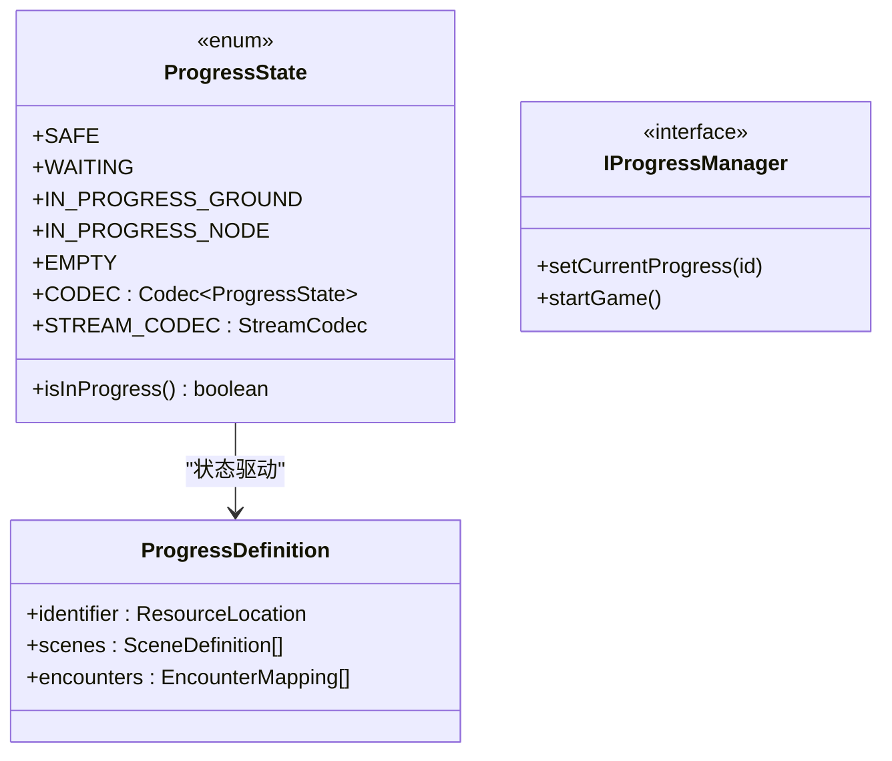

**图表来源**
- [ProgressState.java:14-98](file://Beyond/src/main/java/com/pz/beyond/api/system/progress/ProgressState.java#L14-98)
- [IProgressManager.java:7-27](file://Beyond/src/main/java/com/pz/beyond/api/system/progress/core/IProgressManager.java#L7-27)

**章节来源**
- [ProgressState.java:11-98](file://Beyond/src/main/java/com/pz/beyond/api/system/progress/ProgressState.java#L11-98)
- [IProgressManager.java:7-27](file://Beyond/src/main/java/com/pz/beyond/api/system/progress/core/IProgressManager.java#L7-27)

## 架构总览
重构后的架构采用"API-附件-数据包"的三层设计，提供完整的数据管理和配置驱动能力：

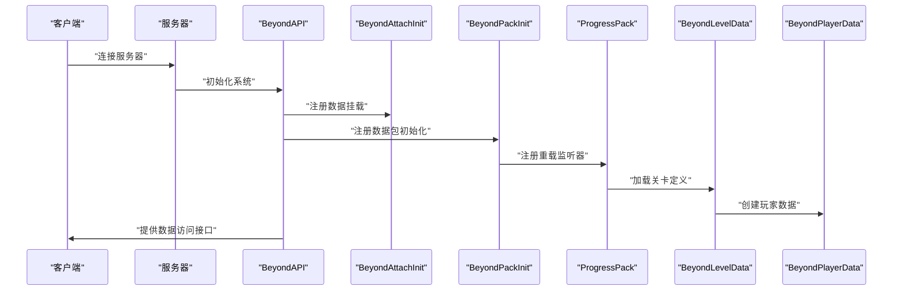

**图表来源**
- [Beyond.java:24-48](file://Beyond/src/main/java/com/pz/beyond/Beyond.java#L24-L48)
- [BeyondAPI.java:16-24](file://Beyond/src/main/java/com/pz/beyond/api/BeyondAPI.java#L16-L24)
- [BeyondAttachInit.java:44-84](file://Beyond/src/main/java/com/pz/beyond/api/init/BeyondAttachInit.java#L44-L84)
- [BeyondPackInit.java:14-34](file://Beyond/src/main/java/com/pz/beyond/api/init/BeyondPackInit.java#L14-L34)

## 详细组件分析

### 服务器配置系统（ServerConfig）
ServerConfig保持原有功能，专注于安全区引导配置：

**配置选项**：
- **enableVillageBootstrap**：启用村庄引导功能
- **setWorldSpawn**：设置世界出生点到村庄位置
- **teleportPlayersOnLoad**：初始化时传送在线玩家
- **villageSearchRadiusChunks**：村庄搜索半径（1-2048区块）
- **initialSafeZoneSizeChunks**：初始安全区大小（1-4096区块）
- **minVillageWrapSizeChunks**：最小安全区包裹大小（1-4096区块）

**章节来源**
- [ServerConfig.java:10-121](file://Beyond/src/main/java/com/pz/beyond/api/config/ServerConfig.java#L10-L121)

### 区域事件处理增强（ZoneEventHandle）
ZoneEventHandle保持原有功能，支持新的数据架构：

**事件处理机制**：
- **延迟初始化**：安全区初始化延迟5秒，避免世界加载早期结构查询不稳定
- **区块加载处理**：新区块加载时自动添加到PendingZone
- **玩家移动检测**：每4tick检测一次玩家区域变化，减少性能开销
- **多事件支持**：支持玩家登录、重生、传送等多种事件场景

**章节来源**
- [ZoneEventHandle.java:19-142](file://Beyond/src/main/java/com/pz/beyond/api/event/handle/ZoneEventHandle.java#L19-L142)

### 规则系统架构
规则系统保持原有接口，适配新的数据架构：

**规则接口体系**：
- **IZoneRule**：区域规则接口，定义规则的执行逻辑
- **AbstractRule**：抽象规则基类，提供通用规则功能
- **RuleData**：规则数据模型，支持规则的序列化和传输

**章节来源**
- [IZoneRule.java](file://Beyond/src/main/java/com/pz/beyond/api/system/rule/IZoneRule.java)
- [AbstractRule.java](file://Beyond/src/main/java/com/pz/beyond/api/system/rule/AbstractRule.java)
- [RuleData.java](file://Beyond/src/main/java/com/pz/beyond/api/system/rule/RuleData.java)

### 本地化系统（Localization System）
本地化系统保持原有功能，支持多语言文本资源：

**支持的语言**：
- **英文（en_us）**：标准英文界面文本
- **中文（zh_cn）**：简体中文界面文本
- **配置文本**：支持安全区传送等用户界面文本

**章节来源**
- [en_us.json:1-7](file://Beyond/src/main/resources/assets/beyond/lang/en_us.json#L1-L7)
- [zh_cn.json:1-7](file://Beyond/src/main/resources/assets/beyond/lang/zh_cn.json#L1-L7)

### 构建配置系统（Build Configuration System）
构建配置系统从本地依赖管理迁移到GalaxyLib集成架构：

**构建变更**：
- **依赖管理**：从本地依赖改为GalaxyLib集成
- **模块结构**：支持多模块开发和依赖管理
- **版本控制**：通过settings.gradle管理模块版本
- **打包配置**：支持Maven发布和本地仓库

**章节来源**
- [build.gradle:64-67](file://Beyond/build.gradle#L64-L67)
- [build.gradle:19-57](file://Beyond/build.gradle#L19-L57)
- [settings.gradle:13-18](file://settings.gradle#L13-L18)

## 依赖关系分析
重构后的依赖关系更加清晰，采用模块化设计：

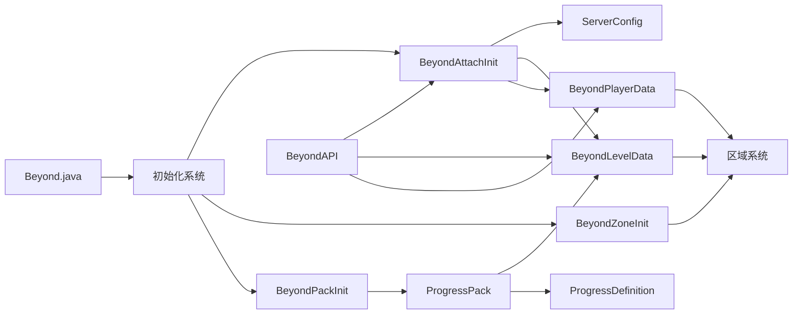

**图表来源**
- [Beyond.java:24-48](file://Beyond/src/main/java/com/pz/beyond/Beyond.java#L24-L48)
- [BeyondAttachInit.java:44-84](file://Beyond/src/main/java/com/pz/beyond/api/init/BeyondAttachInit.java#L44-L84)
- [BeyondPackInit.java:14-34](file://Beyond/src/main/java/com/pz/beyond/api/init/BeyondPackInit.java#L14-L34)
- [BeyondAPI.java:16-24](file://Beyond/src/main/java/com/pz/beyond/api/BeyondAPI.java#L16-L24)
- [BeyondLevelData.java:31-48](file://Beyond/src/main/java/com/pz/beyond/api/system/BeyondLevelData.java#L31-L48)
- [BeyondPlayerData.java:33-81](file://Beyond/src/main/java/com/pz/beyond/api/system/BeyondPlayerData.java#L33-L81)

## 性能考虑
重构后的架构在性能方面有显著提升：

**内存优化**：
- 使用LongOpenHashSet存储区块键值，提供高效的查找性能
- 玩家数据采用延迟初始化，减少内存占用
- 数据包采用缓存机制，避免重复解析配置文件
- **新增**：基于数据包的配置驱动架构，减少内存占用

**网络优化**：
- 提供StreamCodec支持高效网络传输
- 数据包按需传输，避免全量同步
- 支持增量更新，只传输变更的数据
- **新增**：基于数据包的增量同步机制

**计算优化**：
- 区域检测使用空间索引优化
- 节点状态检查采用缓存机制
- 规则执行采用事件驱动，避免轮询
- **新增**：基于事件总线的异步处理机制

**配置优化**：
- **新增**：ServerConfig提供配置项范围验证，防止无效配置
- **新增**：支持配置热更新，动态调整安全区行为
- **新增**：数据包热重载机制，支持实时配置更新

**模块化优化**：
- **新增**：基于数据包的模块化架构，支持独立开发和测试
- **新增**：模块间依赖管理，支持灵活的配置组合
- **新增**：构建系统优化，支持并行编译和增量构建

## 故障排除指南
**重构后常见问题**：

1. **数据挂载失败**
   - 检查BeyondAttachInit中的维度白名单配置
   - 确认AttachmentType注册是否正确
   - 验证数据序列化Codec是否匹配

2. **数据包加载失败**
   - **新增**：检查ProgressPack中的JSON文件格式
   - **新增**：验证ProgressDefinition的identifier是否唯一
   - **新增**：确认数据包路径data/beyond/progress正确

3. **API调用异常**
   - **新增**：检查BeyondAPI中的数据访问方法
   - **新增**：验证数据挂载是否在正确的生命周期内
   - **新增**：确认数据类型转换是否正确

4. **区域系统问题**
   - 检查BeyondZoneInit中的区域注册
   - 确认ZoneType的initialize方法实现
   - 验证区域数据的序列化支持

5. **配置系统问题**
   - **新增**：检查ServerConfig配置文件格式
   - **新增**：验证配置项范围和默认值
   - **新增**：确认配置项名称拼写正确

6. **事件处理问题**
   - **新增**：检查BeyondPackInit中的事件订阅
   - **新增**：验证数据包同步事件处理
   - **新增**：确认玩家登录事件响应

7. **数据管理问题**
   - **新增**：检查BeyondLevelData的数据存储
   - **新增**：验证BeyondPlayerData的延迟初始化
   - **新增**：确认数据生命周期管理正确

8. **构建配置问题**
   - **新增**：检查GalaxyLib依赖版本
   - **新增**：验证模块包含关系
   - **新增**：确认构建脚本语法

**章节来源**
- [BeyondAttachInit.java:31-84](file://Beyond/src/main/java/com/pz/beyond/api/init/BeyondAttachInit.java#L31-L84)
- [ProgressPack.java:34-94](file://Beyond/src/main/java/com/pz/beyond/api/pack/ProgressPack.java#L34-L94)
- [BeyondAPI.java:16-24](file://Beyond/src/main/java/com/pz/beyond/api/BeyondAPI.java#L16-L24)
- [BeyondLevelData.java:31-48](file://Beyond/src/main/java/com/pz/beyond/api/system/BeyondLevelData.java#L31-L48)
- [BeyondPlayerData.java:66-81](file://Beyond/src/main/java/com/pz/beyond/api/system/BeyondPlayerData.java#L66-L81)
- [BeyondZoneInit.java:47-71](file://Beyond/src/main/java/com/pz/beyond/api/init/BeyondZoneInit.java#L47-L71)
- [ServerConfig.java:34-85](file://Beyond/src/main/java/com/pz/beyond/api/config/ServerConfig.java#L34-85)
- [BeyondPackInit.java:14-34](file://Beyond/src/main/java/com/pz/beyond/api/init/BeyondPackInit.java#L14-34)

## 结论
Beyond安全区模块的重构代表了从传统架构向现代化数据包驱动架构的重大转变。新架构通过基于数据包的配置管理、基于NeoForge附件系统的数据挂载机制和标准化的Pack初始化系统，为模块化开发和动态配置提供了坚实基础。

**核心优势**：
- **模块化设计**：清晰的系统分层，便于维护和扩展
- **配置驱动**：基于数据包的动态内容加载机制
- **数据挂载**：基于NeoForge附件系统的完整数据生命周期管理
- **性能优化**：针对大型世界进行了专门优化
- **与Biotech集成**：为基因系统提供专门的区域支持
- **事件驱动**：基于事件总线的异步处理机制
- **序列化支持**：完整的Codec和StreamCodec序列化机制
- **热重载支持**：支持配置的实时更新和应用

**新增特性**：
- **BeyondAPI**：统一的数据访问入口
- **BeyondAttachInit**：基于附件系统的数据挂载机制
- **BeyondPackInit**：标准化的数据包初始化系统
- **BeyondLevelData**：维度级数据管理
- **BeyondPlayerData**：玩家数据聚合管理
- **ProgressPack**：数据包加载和同步机制
- **重构的区域系统**：基于ZoneType的新架构

这一重构为后续的功能扩展奠定了坚实基础，特别是在与Biotech模块的深度集成方面展现了巨大的潜力。基于数据包的配置驱动架构为未来的功能扩展提供了更加灵活和强大的技术基础。

## 附录

### 配置方法
**API系统配置**：
- 通过BeyondAPI访问维度和玩家数据
- 配置数据挂载类型和序列化Codec
- 设置数据生命周期管理策略

**数据包配置**：
- **新增**：在data/beyond/progress目录添加JSON配置文件
- **新增**：定义ProgressDefinition配置内容
- **新增**：配置场景和遭遇事件

**区域系统配置**：
- **新增**：通过BeyondZoneInit注册新的区域类型
- **新增**：配置ZoneType的initialize方法
- **新增**：设置区域规则监听器

**Pack初始化配置**：
- **新增**：通过BeyondPackInit注册数据包监听器
- **新增**：配置数据包同步事件处理
- **新增**：设置数据包应用策略

**章节来源**
- [BeyondAPI.java:16-24](file://Beyond/src/main/java/com/pz/beyond/api/BeyondAPI.java#L16-L24)
- [BeyondAttachInit.java:54-84](file://Beyond/src/main/java/com/pz/beyond/api/init/BeyondAttachInit.java#L54-L84)
- [BeyondPackInit.java:14-34](file://Beyond/src/main/java/com/pz/beyond/api/init/BeyondPackInit.java#L14-L34)
- [BeyondLevelData.java:31-48](file://Beyond/src/main/java/com/pz/beyond/api/system/BeyondLevelData.java#L31-L48)
- [BeyondPlayerData.java:33-81](file://Beyond/src/main/java/com/pz/beyond/api/system/BeyondPlayerData.java#L33-L81)
- [BeyondZoneInit.java:47-71](file://Beyond/src/main/java/com/pz/beyond/api/init/BeyondZoneInit.java#L47-L71)

### 扩展指南
**添加新的数据包配置**：
1. **新增**：在data/beyond/progress目录创建JSON文件
2. **新增**：定义ProgressDefinition配置内容
3. **新增**：验证JSON格式和字段完整性
4. **新增**：测试数据包加载和应用

**新增区域类型**：
1. **新增**：继承ZoneType基类
2. **新增**：实现initialize方法
3. **新增**：在BeyondZoneInit中注册
4. **新增**：测试区域初始化和功能

**新增API功能**：
1. **新增**：在BeyondAPI中添加新的访问方法
2. **新增**：实现数据访问逻辑
3. **新增**：添加必要的序列化支持
4. **新增**：编写单元测试和集成测试

**新增Pack初始化**：
1. **新增**：创建新的Pack初始化类
2. **新增**：实现事件订阅和处理
3. **新增**：配置数据包加载策略
4. **新增**：测试Pack初始化流程

**章节来源**
- [ProgressPack.java:34-94](file://Beyond/src/main/java/com/pz/beyond/api/pack/ProgressPack.java#L34-L94)
- [BeyondZoneInit.java:55-71](file://Beyond/src/main/java/com/pz/beyond/api/init/BeyondZoneInit.java#L55-L71)
- [BeyondAPI.java:16-24](file://Beyond/src/main/java/com/pz/beyond/api/BeyondAPI.java#L16-L24)
- [BeyondPackInit.java:14-34](file://Beyond/src/main/java/com/pz/beyond/api/init/BeyondPackInit.java#L14-L34)