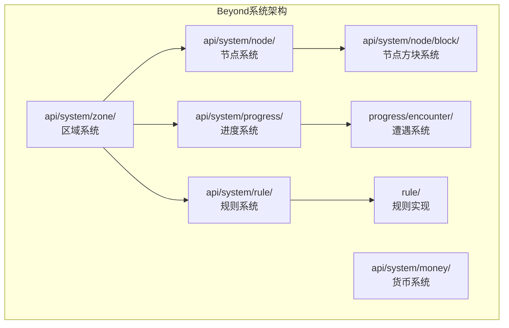
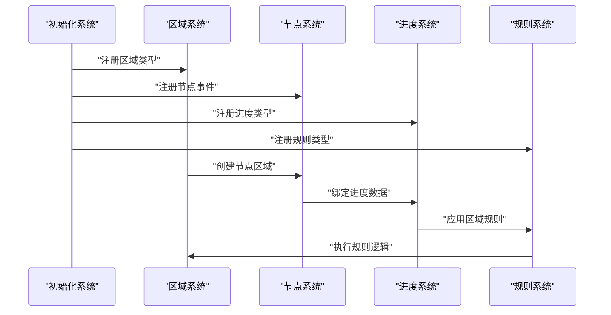
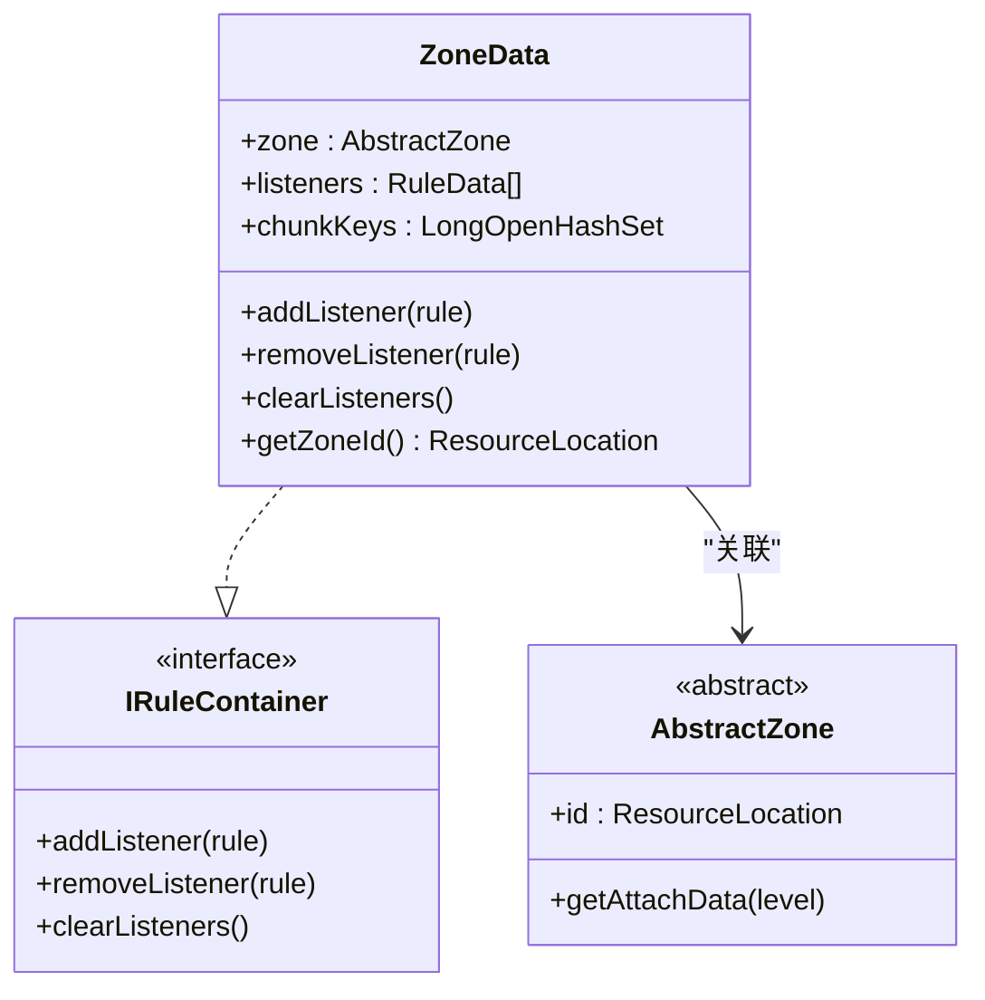
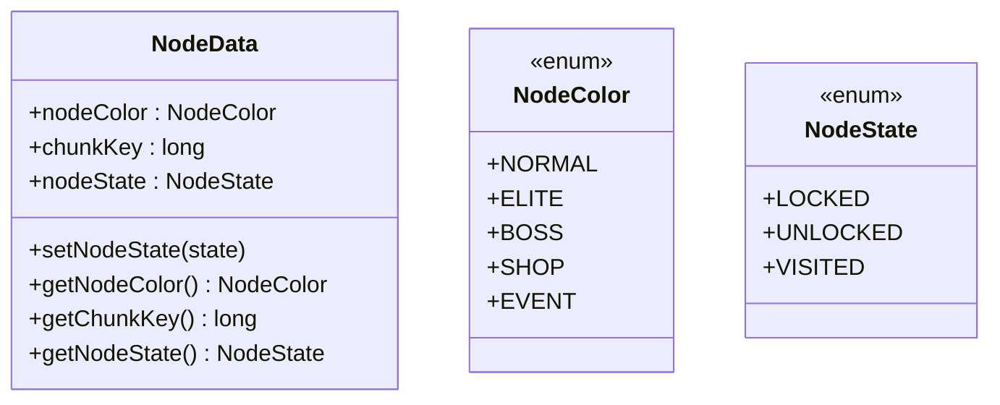
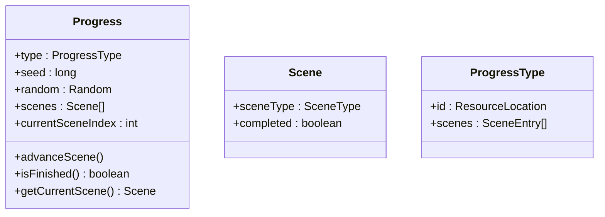
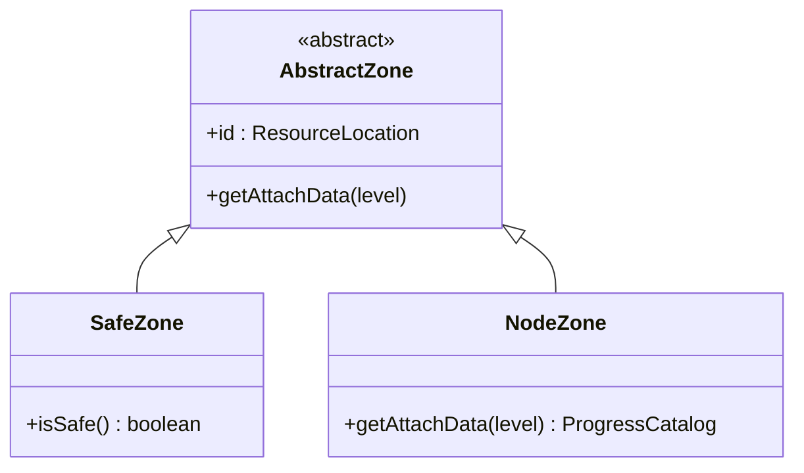
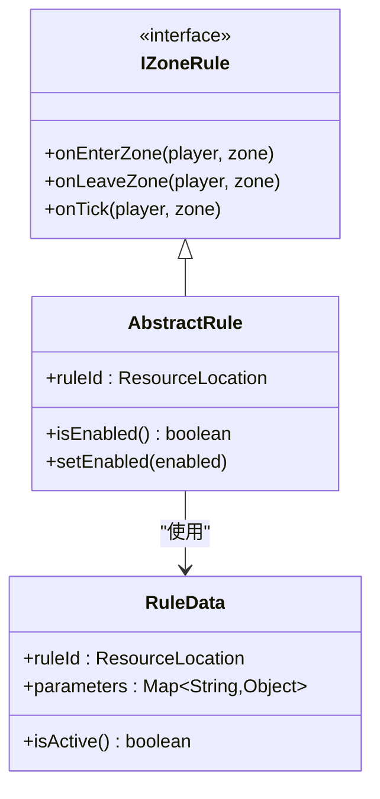
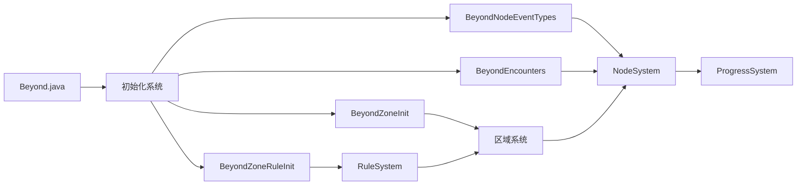

# Beyond安全区模块

<cite>
**本文档引用的文件**
- [Beyond.java](file://Beyond/src/main/java/com/pz/beyond/Beyond.java)
- [ZoneData.java](file://Beyond/src/main/java/com/pz/beyond/api/system/zone/ZoneData.java)
- [NodeData.java](file://Beyond/src/main/java/com/pz/beyond/api/system/node/NodeData.java)
- [Progress.java](file://Beyond/src/main/java/com/pz/beyond/api/system/progress/Progress.java)
- [NodeZone.java](file://Beyond/src/main/java/com/pz/beyond/api/system/zone/zones/NodeZone.java)
- [BeyondZoneInit.java](file://Beyond/src/main/java/com/pz/beyond/api/init/BeyondZoneInit.java)
- [BeyondNodeEventTypes.java](file://Beyond/src/main/java/com/pz/beyond/api/init/BeyondNodeEventTypes.java)
- [BeyondEncounters.java](file://Beyond/src/main/java/com/pz/beyond/api/init/BeyondEncounters.java)
- [BeyondZoneRuleInit.java](file://Beyond/src/main/java/com/pz/beyond/api/init/BeyondZoneRuleInit.java)
- [BeyondAttachInit.java](file://Beyond/src/main/java/com/pz/beyond/api/init/BeyondAttachInit.java)
- [IRuleContainer.java](file://Beyond/src/main/java/com/pz/beyond/api/system/zone/core/IRuleContainer.java)
- [IZonePosManager.java](file://Beyond/src/main/java/com/pz/beyond/api/system/zone/core/IZonePosManager.java)
- [AbstractZone.java](file://Beyond/src/main/java/com/pz/beyond/api/system/zone/AbstractZone.java)
- [LevelZoneData.java](file://Beyond/src/main/java/com/pz/beyond/api/system/zone/LevelZoneData.java)
- [SafeZone.java](file://Beyond/src/main/java/com/pz/beyond/api/system/zone/zones/SafeZone.java)
- [PlayerActiveZone.java](file://Beyond/src/main/java/com/pz/beyond/api/system/zone/zones/PlayerActiveZone.java)
- [PendingPlayerActiveZone.java](file://Beyond/src/main/java/com/pz/beyond/api/system/zone/zones/PendingPlayerActiveZone.java)
- [NodeColor.java](file://Beyond/src/main/java/com/pz/beyond/api/system/node/NodeColor.java)
- [NodeState.java](file://Beyond/src/main/java/com/pz/beyond/api/system/node/NodeState.java)
- [NodeEventType.java](file://Beyond/src/main/java/com/pz/beyond/api/system/node/NodeEventType.java)
- [EncounterType.java](file://Beyond/src/main/java/com/pz/beyond/api/system/node/EncounterType.java)
- [Scene.java](file://Beyond/src/main/java/com/pz/beyond/api/system/progress/Scene.java)
- [ProgressType.java](file://Beyond/src/main/java/com/pz/beyond/api/system/progress/ProgressType.java)
- [ProgressState.java](file://Beyond/src/main/java/com/pz/beyond/api/system/progress/ProgressState.java)
- [ProgressManager.java](file://Beyond/src/main/java/com/pz/beyond/api/system/progress/core/IProgressManager.java)
- [BeyondData.java](file://Beyond/src/main/java/com/pz/beyond/api/system/BeyondData.java)
- [BeyondAPI.java](file://Beyond/src/main/java/com/pz/beyond/api/BeyondAPI.java)
- [ZoneEventHandle.java](file://Beyond/src/main/java/com/pz/beyond/api/event/handle/ZoneEventHandle.java)
- [AllSafeRule.java](file://Beyond/src/main/java/com/pz/beyond/rule/AllSafeRule.java)
- [AbstractRule.java](file://Beyond/src/main/java/com/pz/beyond/api/system/rule/AbstractRule.java)
- [IZoneRule.java](file://Beyond/src/main/java/com/pz/beyond/api/system/rule/IZoneRule.java)
- [RuleData.java](file://Beyond/src/main/java/com/pz/beyond/api/system/rule/RuleData.java)
- [Money.java](file://Beyond/src/main/java/com/pz/beyond/api/system/money/Money.java)
- [NodeBlock.java](file://Beyond/src/main/java/com/pz/beyond/api/system/node/block/NodeBlock.java)
- [RolledData.java](file://Beyond/src/main/java/com/pz/beyond/api/system/node/RolledData.java)
- [BossEvent.java](file://Beyond/src/main/java/com/pz/beyond/node/BossEvent.java)
- [README.md](file://Beyond/README.md)
</cite>

## 目录
1. [简介](#简介)
2. [项目结构](#项目结构)
3. [核心组件](#核心组件)
4. [架构总览](#架构总览)
5. [详细组件分析](#详细组件分析)
6. [依赖关系分析](#依赖关系分析)
7. [性能考虑](#性能考虑)
8. [故障排除指南](#故障排除指南)
9. [结论](#结论)
10. [附录](#附录)

## 简介
Beyond安全区模块现已演变为完整的区域管理系统，从简单的安全区实现发展为支持多种区域类型、节点管理和进度追踪的综合平台。该系统围绕"区域-节点-进度"三层架构设计，提供灵活的区域管理能力和丰富的游戏体验。

**主要设计目标**：
- 多层次区域管理：支持安全区、节点区等多种区域类型
- 节点系统：基于节点的颜色、状态和事件类型构建复杂的探索体验
- 进度追踪：完整的游戏进程管理，支持多场景、多节点的进度控制
- 规则系统：可扩展的区域规则容器，支持动态规则绑定
- 与Biotech模块深度集成：通过区域系统支持基因相关的特殊区域

## 项目结构
Beyond模块采用全新的三层架构设计，分为系统层、数据层和事件层：

**图表来源**
- [Beyond.java:32-44](file://Beyond/src/main/java/com/pz/beyond/Beyond.java#L32-L44)
- [BeyondZoneInit.java](file://Beyond/src/main/java/com/pz/beyond/api/init/BeyondZoneInit.java)
- [BeyondNodeEventTypes.java](file://Beyond/src/main/java/com/pz/beyond/api/init/BeyondNodeEventTypes.java)
- [BeyondEncounters.java](file://Beyond/src/main/java/com/pz/beyond/api/init/BeyondEncounters.java)

## 核心组件

### 区域系统（Zone System）
- **ZoneData**：区域数据容器，支持规则绑定和区块管理
- **AbstractZone**：抽象区域基类，定义区域的基本行为
- **多种区域类型**：安全区、节点区等专用区域实现
- **区域规则容器**：支持动态规则绑定和管理

### 节点系统（Node System）
- **NodeData**：节点静态数据，包含颜色、状态和区块信息
- **NodeColor**：节点颜色系统，决定节点的视觉表现和功能
- **NodeState**：节点状态管理，支持锁定、解锁等状态转换
- **NodeEventType**：节点事件类型，定义节点触发的事件种类

### 进度系统（Progress System）
- **Progress**：游戏进度管理，支持多场景的进度追踪
- **Scene**：场景数据，定义游戏的不同阶段
- **ProgressType**：进度类型模板，定义游戏配置
- **ProgressState**：进度状态管理，跟踪游戏完成情况

### 规则系统（Rule System）
- **IRuleContainer**：规则容器接口，定义规则管理规范
- **RuleData**：规则数据模型，支持规则的序列化和传输
- **IZoneRule**：区域规则接口，定义规则的执行逻辑

**章节来源**
- [ZoneData.java:22-124](file://Beyond/src/main/java/com/pz/beyond/api/system/zone/ZoneData.java#L22-L124)
- [NodeData.java:13-89](file://Beyond/src/main/java/com/pz/beyond/api/system/node/NodeData.java#L13-L89)
- [Progress.java:18-155](file://Beyond/src/main/java/com/pz/beyond/api/system/progress/Progress.java#L18-L155)
- [IRuleContainer.java](file://Beyond/src/main/java/com/pz/beyond/api/system/zone/core/IRuleContainer.java)
- [RuleData.java](file://Beyond/src/main/java/com/pz/beyond/api/system/rule/RuleData.java)

## 架构总览
区域管理系统采用"模板-实例-数据"的三层架构模式：

**图表来源**
- [Beyond.java:32-44](file://Beyond/src/main/java/com/pz/beyond/Beyond.java#L32-L44)
- [BeyondZoneInit.java](file://Beyond/src/main/java/com/pz/beyond/api/init/BeyondZoneInit.java)
- [BeyondNodeEventTypes.java](file://Beyond/src/main/java/com/pz/beyond/api/init/BeyondNodeEventTypes.java)
- [BeyondEncounters.java](file://Beyond/src/main/java/com/pz/beyond/api/init/BeyondEncounters.java)

## 详细组件分析

### 区域数据模型（ZoneData）
ZoneData是区域系统的核心数据容器，实现了IRuleContainer接口，提供完整的区域数据管理功能：

**核心特性**：
- **规则容器**：支持动态添加、移除和清理规则监听器
- **区块管理**：使用LongOpenHashSet管理区域覆盖的区块
- **序列化支持**：提供Codec和StreamCodec，支持NBT和网络传输
- **区域关联**：通过BeyondZoneInit管理区域类型和ID映射

**图表来源**
- [ZoneData.java:22-124](file://Beyond/src/main/java/com/pz/beyond/api/system/zone/ZoneData.java#L22-L124)
- [IRuleContainer.java](file://Beyond/src/main/java/com/pz/beyond/api/system/zone/core/IRuleContainer.java)

**章节来源**
- [ZoneData.java:22-124](file://Beyond/src/main/java/com/pz/beyond/api/system/zone/ZoneData.java#L22-L124)

### 节点数据模型（NodeData）
NodeData提供节点的静态数据管理，支持节点的颜色、状态和位置信息：

**数据结构**：
- **NodeColor**：节点颜色，决定节点的功能和视觉表现
- **chunkKey**：区块键值，使用ChunkPos.toLong()格式存储
- **NodeState**：节点状态，默认为LOCKED状态

**图表来源**
- [NodeData.java:13-89](file://Beyond/src/main/java/com/pz/beyond/api/system/node/NodeData.java#L13-L89)
- [NodeColor.java](file://Beyond/src/main/java/com/pz/beyond/api/system/node/NodeColor.java)
- [NodeState.java](file://Beyond/src/main/java/com/pz/beyond/api/system/node/NodeState.java)

**章节来源**
- [NodeData.java:13-89](file://Beyond/src/main/java/com/pz/beyond/api/system/node/NodeData.java#L13-L89)

### 进度管理系统（Progress）
Progress系统提供完整的游戏进度管理，支持多场景的进度追踪和状态控制：

**核心功能**：
- **场景管理**：支持多个Scene的有序排列
- **进度追踪**：跟踪当前场景索引和完成状态
- **随机性支持**：提供Random源用于事件随机选择
- **进度推进**：支持场景间的自动推进

**图表来源**
- [Progress.java:18-155](file://Beyond/src/main/java/com/pz/beyond/api/system/progress/Progress.java#L18-L155)
- [Scene.java](file://Beyond/src/main/java/com/pz/beyond/api/system/progress/Scene.java)
- [ProgressType.java](file://Beyond/src/main/java/com/pz/beyond/api/system/progress/ProgressType.java)

**章节来源**
- [Progress.java:18-155](file://Beyond/src/main/java/com/pz/beyond/api/system/progress/Progress.java#L18-L155)

### 区域类型系统
系统支持多种区域类型，每种区域都有特定的功能和用途：

**主要区域类型**：
- **SafeZone**：安全区域，提供玩家保护
- **NodeZone**：节点区域，支持节点导航和探索
- **PlayerActiveZone**：玩家活跃区域，跟踪玩家活动
- **PendingPlayerActiveZone**：待激活玩家区域

**图表来源**
- [AbstractZone.java](file://Beyond/src/main/java/com/pz/beyond/api/system/zone/AbstractZone.java)
- [SafeZone.java](file://Beyond/src/main/java/com/pz/beyond/api/system/zone/zones/SafeZone.java)
- [NodeZone.java](file://Beyond/src/main/java/com/pz/beyond/api/system/zone/zones/NodeZone.java)

**章节来源**
- [AbstractZone.java](file://Beyond/src/main/java/com/pz/beyond/api/system/zone/AbstractZone.java)
- [SafeZone.java](file://Beyond/src/main/java/com/pz/beyond/api/system/zone/zones/SafeZone.java)
- [NodeZone.java](file://Beyond/src/main/java/com/pz/beyond/api/system/zone/zones/NodeZone.java)

### 规则系统架构
规则系统提供灵活的区域规则管理，支持动态规则绑定和执行：

**规则接口体系**：
- **IZoneRule**：区域规则接口，定义规则的执行逻辑
- **AbstractRule**：抽象规则基类，提供通用规则功能
- **RuleData**：规则数据模型，支持规则的序列化和传输

**图表来源**
- [IZoneRule.java](file://Beyond/src/main/java/com/pz/beyond/api/system/rule/IZoneRule.java)
- [AbstractRule.java](file://Beyond/src/main/java/com/pz/beyond/api/system/rule/AbstractRule.java)
- [RuleData.java](file://Beyond/src/main/java/com/pz/beyond/api/system/rule/RuleData.java)

**章节来源**
- [IZoneRule.java](file://Beyond/src/main/java/com/pz/beyond/api/system/rule/IZoneRule.java)
- [AbstractRule.java](file://Beyond/src/main/java/com/pz/beyond/api/system/rule/AbstractRule.java)
- [RuleData.java](file://Beyond/src/main/java/com/pz/beyond/api/system/rule/RuleData.java)

## 依赖关系分析
区域管理系统具有清晰的层次依赖关系：

**图表来源**
- [Beyond.java:32-44](file://Beyond/src/main/java/com/pz/beyond/Beyond.java#L32-L44)
- [BeyondZoneInit.java](file://Beyond/src/main/java/com/pz/beyond/api/init/BeyondZoneInit.java)
- [BeyondNodeEventTypes.java](file://Beyond/src/main/java/com/pz/beyond/api/init/BeyondNodeEventTypes.java)
- [BeyondEncounters.java](file://Beyond/src/main/java/com/pz/beyond/api/init/BeyondEncounters.java)
- [BeyondZoneRuleInit.java](file://Beyond/src/main/java/com/pz/beyond/api/init/BeyondZoneRuleInit.java)

**章节来源**
- [Beyond.java:32-44](file://Beyond/src/main/java/com/pz/beyond/Beyond.java#L32-L44)

## 性能考虑
区域管理系统在设计时充分考虑了性能优化：

**内存优化**：
- 使用LongOpenHashSet存储区块键值，提供高效的查找性能
- 节点数据采用不可变设计，减少内存占用
- 规则数据支持延迟加载，避免不必要的初始化

**网络优化**：
- 提供StreamCodec支持高效网络传输
- 区域数据按需传输，避免全量同步
- 支持增量更新，只传输变更的数据

**计算优化**：
- 区域检测使用空间索引优化
- 节点状态检查采用缓存机制
- 规则执行采用事件驱动，避免轮询

## 故障排除指南
**区域系统常见问题**：

1. **区域类型未注册**
   - 检查BeyondZoneInit中的区域注册
   - 确认区域ID格式正确
   - 验证区域实现类的构造函数

2. **节点数据不生效**
   - 检查NodeData的chunkKey格式
   - 确认节点状态转换逻辑
   - 验证节点事件类型注册

3. **进度系统异常**
   - 检查ProgressType配置
   - 确认场景顺序正确
   - 验证随机种子生成

4. **规则系统问题**
   - 检查规则ID唯一性
   - 确认规则参数格式
   - 验证规则启用状态

**章节来源**
- [BeyondZoneInit.java](file://Beyond/src/main/java/com/pz/beyond/api/init/BeyondZoneInit.java)
- [NodeData.java:13-89](file://Beyond/src/main/java/com/pz/beyond/api/system/node/NodeData.java#L13-L89)
- [Progress.java:18-155](file://Beyond/src/main/java/com/pz/beyond/api/system/progress/Progress.java#L18-L155)

## 结论
Beyond安全区模块的重构标志着从简单安全区功能向完整区域管理系统的重大升级。新的三层架构设计提供了强大的扩展性和灵活性，支持复杂的区域类型、节点管理和进度追踪功能。

**核心优势**：
- **模块化设计**：清晰的系统分层，便于维护和扩展
- **可扩展性**：支持新的区域类型和节点事件类型
- **性能优化**：针对大型世界进行了专门优化
- **与Biotech集成**：为基因系统提供专门的区域支持

这一重构为后续的功能扩展奠定了坚实基础，特别是在与Biotech模块的深度集成方面展现了巨大的潜力。

## 附录

### 配置方法
**区域系统配置**：
- 通过BeyondZoneInit注册新的区域类型
- 在BeyondNodeEventTypes中注册节点事件类型
- 使用BeyondEncounters配置遭遇系统
- 通过BeyondZoneRuleInit管理区域规则

**章节来源**
- [BeyondZoneInit.java](file://Beyond/src/main/java/com/pz/beyond/api/init/BeyondZoneInit.java)
- [BeyondNodeEventTypes.java](file://Beyond/src/main/java/com/pz/beyond/api/init/BeyondNodeEventTypes.java)
- [BeyondEncounters.java](file://Beyond/src/main/java/com/pz/beyond/api/init/BeyondEncounters.java)
- [BeyondZoneRuleInit.java](file://Beyond/src/main/java/com/pz/beyond/api/init/BeyondZoneRuleInit.java)

### 扩展指南
**添加新的区域类型**：
1. 继承AbstractZone基类
2. 实现getAttachData方法
3. 在BeyondZoneInit中注册
4. 创建对应的ZoneData实例

**添加新的节点事件**：
1. 在NodeEventType中添加新类型
2. 实现对应的事件处理器
3. 配置事件参数
4. 测试事件触发逻辑

**章节来源**
- [AbstractZone.java](file://Beyond/src/main/java/com/pz/beyond/api/system/zone/AbstractZone.java)
- [NodeEventType.java](file://Beyond/src/main/java/com/pz/beyond/api/system/node/NodeEventType.java)
- [BeyondZoneInit.java](file://Beyond/src/main/java/com/pz/beyond/api/init/BeyondZoneInit.java)