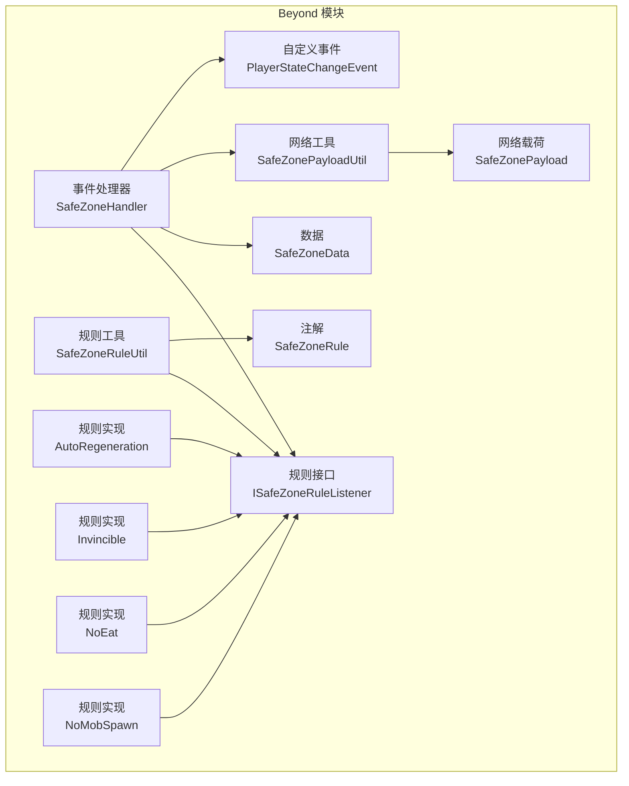
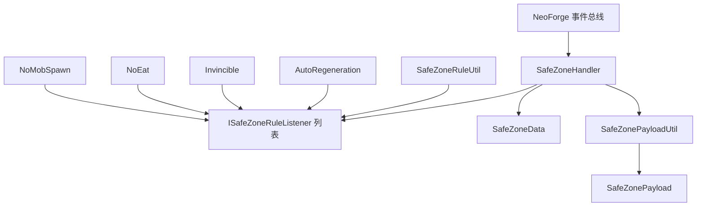
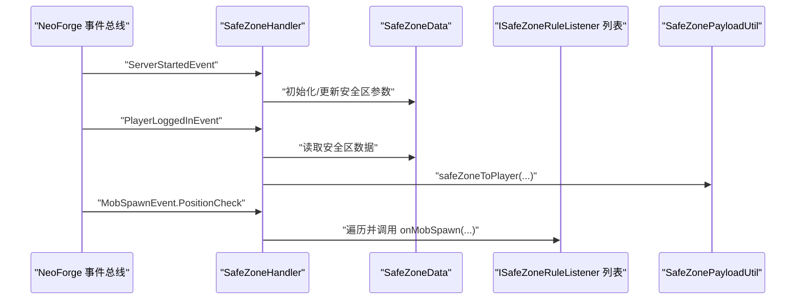
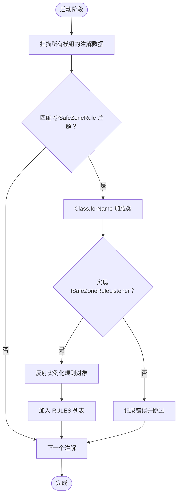
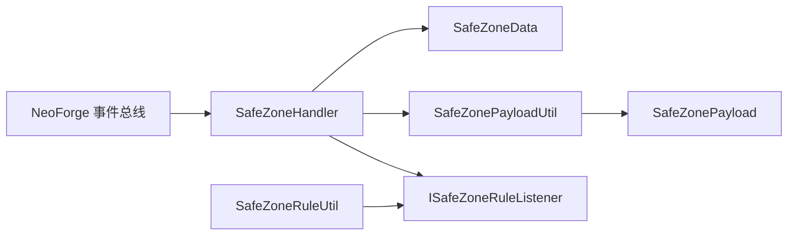

# 事件处理系统

<cite>
**本文引用的文件**
- [SafeZoneHandler.java](file://Beyond/src/main/java/com/pz/beyond/event/SafeZoneHandler.java)
- [SafeZoneRuleUtil.java](file://Beyond/src/main/java/com/pz/beyond/util/SafeZoneRuleUtil.java)
- [SafeZoneRule.java](file://Beyond/src/main/java/com/pz/beyond/safeZoneRule/SafeZoneRule.java)
- [ISafeZoneRuleListener.java](file://Beyond/src/main/java/com/pz/beyond/safeZoneRule/ISafeZoneRuleListener.java)
- [SafeZoneData.java](file://Beyond/src/main/java/com/pz/beyond/data/SafeZoneData.java)
- [PlayerStateChangeEvent.java](file://Beyond/src/main/java/com/pz/beyond/event/custom/PlayerStateChangeEvent.java)
- [SafeZonePayloadUtil.java](file://Beyond/src/main/java/com/pz/beyond/util/SafeZonePayloadUtil.java)
- [SafeZonePayload.java](file://Beyond/src/main/java/com/pz/beyond/network/SafeZonePayload.java)
- [AutoRegeneration.java](file://Beyond/src/main/java/com/pz/beyond/safeZoneRule/impl/AutoRegeneration.java)
- [Invincible.java](file://Beyond/src/main/java/com/pz/beyond/safeZoneRule/impl/Invincible.java)
- [NoEat.java](file://Beyond/src/main/java/com/pz/beyond/safeZoneRule/impl/NoEat.java)
- [NoMobSpawn.java](file://Beyond/src/main/java/com/pz/beyond/safeZoneRule/impl/NoMobSpawn.java)
</cite>

## 目录
1. [简介](#简介)
2. [项目结构](#项目结构)
3. [核心组件](#核心组件)
4. [架构总览](#架构总览)
5. [组件详解](#组件详解)
6. [依赖关系分析](#依赖关系分析)
7. [性能考量](#性能考量)
8. [故障排查指南](#故障排查指南)
9. [结论](#结论)
10. [附录](#附录)

## 简介
本文件系统性阐述 Beyond 模块中的事件处理体系，重点围绕 SafeZoneHandler 事件处理器的注册、分发与执行机制，以及与 NeoForge 事件总线的集成方式；同时说明事件优先级策略、异常捕获与错误恢复、动态注册与扩展点、性能优化与并发安全、日志与监控建议等。此外，文档还涵盖 SafeZoneRuleUtil 工具类的自动发现与装配能力，以及多种安全区规则的实现示例。

## 项目结构
事件处理相关代码主要位于 Beyond 模块的以下包内：
- com.pz.beyond.event：事件处理器与自定义事件
- com.pz.beyond.safeZoneRule：安全区规则接口与注解、具体规则实现
- com.pz.beyond.util：工具类（规则自动装配、网络载荷工具）
- com.pz.beyond.data：持久化数据（安全区中心、半径等）
- com.pz.beyond.network：自定义网络载荷类型

图表来源
- [SafeZoneHandler.java:35-76](file://Beyond/src/main/java/com/pz/beyond/event/SafeZoneHandler.java#L35-L76)
- [SafeZoneRuleUtil.java:11-53](file://Beyond/src/main/java/com/pz/beyond/util/SafeZoneRuleUtil.java#L11-L53)
- [ISafeZoneRuleListener.java:13-41](file://Beyond/src/main/java/com/pz/beyond/safeZoneRule/ISafeZoneRuleListener.java#L13-L41)
- [SafeZoneData.java:16-100](file://Beyond/src/main/java/com/pz/beyond/data/SafeZoneData.java#L16-L100)
- [SafeZonePayloadUtil.java:9-31](file://Beyond/src/main/java/com/pz/beyond/util/SafeZonePayloadUtil.java#L9-L31)
- [SafeZonePayload.java:10-30](file://Beyond/src/main/java/com/pz/beyond/network/SafeZonePayload.java#L10-L30)
- [SafeZoneRule.java:8-11](file://Beyond/src/main/java/com/pz/beyond/safeZoneRule/SafeZoneRule.java#L8-L11)
- [AutoRegeneration.java:7-17](file://Beyond/src/main/java/com/pz/beyond/safeZoneRule/impl/AutoRegeneration.java#L7-L17)
- [Invincible.java:10-22](file://Beyond/src/main/java/com/pz/beyond/safeZoneRule/impl/Invincible.java#L10-L22)
- [NoEat.java:10-22](file://Beyond/src/main/java/com/pz/beyond/safeZoneRule/impl/NoEat.java#L10-L22)
- [NoMobSpawn.java:12-28](file://Beyond/src/main/java/com/pz/beyond/safeZoneRule/impl/NoMobSpawn.java#L12-L28)

章节来源
- [SafeZoneHandler.java:35-76](file://Beyond/src/main/java/com/pz/beyond/event/SafeZoneHandler.java#L35-L76)
- [SafeZoneRuleUtil.java:11-53](file://Beyond/src/main/java/com/pz/beyond/util/SafeZoneRuleUtil.java#L11-L53)

## 核心组件
- SafeZoneHandler：NeoForge 事件总线上的事件处理器，负责服务器启动、玩家登录、怪物生成等事件的响应，并将安全区规则委托给 ISafeZoneRuleListener 列表统一处理。
- SafeZoneRuleUtil：在启动阶段扫描所有已加载模组，基于 SafeZoneRule 注解自动发现并实例化实现了 ISafeZoneRuleListener 的规则类，形成可插拔的规则集合。
- ISafeZoneRuleListener：安全区规则监听器接口，定义了 tick、伤害、怪物生成等回调钩子。
- SafeZoneData：安全区的持久化数据（中心坐标、半径、是否首次初始化），提供范围判断与广播更新能力。
- SafeZonePayload/SafeZonePayloadUtil：自定义网络载荷与广播工具，用于向客户端推送安全区参数。
- 自定义事件 PlayerStateChangeEvent：表示玩家状态变更的事件，支持取消。
- 规则实现样例：AutoRegeneration、Invincible、NoEat、NoMobSpawn 展示了不同维度的安全区效果。

章节来源
- [SafeZoneHandler.java:35-76](file://Beyond/src/main/java/com/pz/beyond/event/SafeZoneHandler.java#L35-L76)
- [SafeZoneRuleUtil.java:11-53](file://Beyond/src/main/java/com/pz/beyond/util/SafeZoneRuleUtil.java#L11-L53)
- [ISafeZoneRuleListener.java:13-41](file://Beyond/src/main/java/com/pz/beyond/safeZoneRule/ISafeZoneRuleListener.java#L13-L41)
- [SafeZoneData.java:16-100](file://Beyond/src/main/java/com/pz/beyond/data/SafeZoneData.java#L16-L100)
- [SafeZonePayloadUtil.java:9-31](file://Beyond/src/main/java/com/pz/beyond/util/SafeZonePayloadUtil.java#L9-L31)
- [SafeZonePayload.java:10-30](file://Beyond/src/main/java/com/pz/beyond/network/SafeZonePayload.java#L10-L30)
- [PlayerStateChangeEvent.java:15-69](file://Beyond/src/main/java/com/pz/beyond/event/custom/PlayerStateChangeEvent.java#L15-L69)
- [AutoRegeneration.java:7-17](file://Beyond/src/main/java/com/pz/beyond/safeZoneRule/impl/AutoRegeneration.java#L7-L17)
- [Invincible.java:10-22](file://Beyond/src/main/java/com/pz/beyond/safeZoneRule/impl/Invincible.java#L10-L22)
- [NoEat.java:10-22](file://Beyond/src/main/java/com/pz/beyond/safeZoneRule/impl/NoEat.java#L10-L22)
- [NoMobSpawn.java:12-28](file://Beyond/src/main/java/com/pz/beyond/safeZoneRule/impl/NoMobSpawn.java#L12-L28)

## 架构总览
下图展示了事件处理器、规则工具、数据与网络层之间的交互关系：

图表来源
- [SafeZoneHandler.java:35-76](file://Beyond/src/main/java/com/pz/beyond/event/SafeZoneHandler.java#L35-L76)
- [SafeZoneRuleUtil.java:11-53](file://Beyond/src/main/java/com/pz/beyond/util/SafeZoneRuleUtil.java#L11-L53)
- [ISafeZoneRuleListener.java:13-41](file://Beyond/src/main/java/com/pz/beyond/safeZoneRule/ISafeZoneRuleListener.java#L13-L41)
- [SafeZoneData.java:16-100](file://Beyond/src/main/java/com/pz/beyond/data/SafeZoneData.java#L16-L100)
- [SafeZonePayloadUtil.java:9-31](file://Beyond/src/main/java/com/pz/beyond/util/SafeZonePayloadUtil.java#L9-L31)
- [SafeZonePayload.java:10-30](file://Beyond/src/main/java/com/pz/beyond/network/SafeZonePayload.java#L10-L30)
- [AutoRegeneration.java:7-17](file://Beyond/src/main/java/com/pz/beyond/safeZoneRule/impl/AutoRegeneration.java#L7-L17)
- [Invincible.java:10-22](file://Beyond/src/main/java/com/pz/beyond/safeZoneRule/impl/Invincible.java#L10-L22)
- [NoEat.java:10-22](file://Beyond/src/main/java/com/pz/beyond/safeZoneRule/impl/NoEat.java#L10-L22)
- [NoMobSpawn.java:12-28](file://Beyond/src/main/java/com/pz/beyond/safeZoneRule/impl/NoMobSpawn.java#L12-L28)

## 组件详解

### SafeZoneHandler：事件处理器
- 注册方式：使用 @EventBusSubscriber 标注类，NeoForge 在加载阶段自动注册其中带有 @SubscribeEvent 的静态方法为事件监听器。
- 事件分发：
  - 服务器启动：初始化安全区中心与半径，仅在首次启动时设置默认值。
  - 玩家登录：向新玩家同步当前安全区参数。
  - 怪物生成：遍历所有已加载的 ISafeZoneRuleListener，逐个执行 onMobSpawn 回调。
- 执行顺序：由于使用 @EventBusSubscriber 且未指定优先级，事件回调的执行顺序由 NeoForge 决定；如需严格顺序，可在规则内部自行排序或引入优先级策略。

图表来源
- [SafeZoneHandler.java:43-75](file://Beyond/src/main/java/com/pz/beyond/event/SafeZoneHandler.java#L43-L75)
- [SafeZoneData.java:16-100](file://Beyond/src/main/java/com/pz/beyond/data/SafeZoneData.java#L16-L100)
- [SafeZonePayloadUtil.java:9-31](file://Beyond/src/main/java/com/pz/beyond/util/SafeZonePayloadUtil.java#L9-L31)
- [ISafeZoneRuleListener.java:13-41](file://Beyond/src/main/java/com/pz/beyond/safeZoneRule/ISafeZoneRuleListener.java#L13-L41)

章节来源
- [SafeZoneHandler.java:35-76](file://Beyond/src/main/java/com/pz/beyond/event/SafeZoneHandler.java#L35-L76)

### SafeZoneRuleUtil：规则自动装配与工具
- 自动发现：在启动阶段扫描所有已加载模组的注解数据，匹配 SafeZoneRule 注解，通过反射实例化实现 ISafeZoneRuleListener 的类，并加入运行时列表。
- 异常处理：在反射实例化过程中捕获异常并输出错误信息，避免因单个规则导致整个系统崩溃。
- 动态注册：通过注解驱动的发现机制，无需手动维护规则清单，即可实现规则的动态注册与扩展。

图表来源
- [SafeZoneRuleUtil.java:11-53](file://Beyond/src/main/java/com/pz/beyond/util/SafeZoneRuleUtil.java#L11-L53)
- [SafeZoneRule.java:8-11](file://Beyond/src/main/java/com/pz/beyond/safeZoneRule/SafeZoneRule.java#L8-L11)
- [ISafeZoneRuleListener.java:13-41](file://Beyond/src/main/java/com/pz/beyond/safeZoneRule/ISafeZoneRuleListener.java#L13-L41)

章节来源
- [SafeZoneRuleUtil.java:11-53](file://Beyond/src/main/java/com/pz/beyond/util/SafeZoneRuleUtil.java#L11-L53)

### ISafeZoneRuleListener：规则接口与上下文
- 钩子方法：
  - onSafeZoneTick/outSideSafeZoneTick：分别在安全区内与安全区外每 tick 触发。
  - invincible：在伤害事件前拦截，实现无敌效果。
  - onMobSpawn：在怪物生成位置检查阶段生效，可阻止特定类型的生物在安全区内生成。
- 上下文：SafeZoneContext 携带当前玩家信息，便于规则按玩家状态进行判定。

章节来源
- [ISafeZoneRuleListener.java:13-41](file://Beyond/src/main/java/com/pz/beyond/safeZoneRule/ISafeZoneRuleListener.java#L13-L41)

### SafeZoneData：安全区数据模型
- 字段：中心坐标（X、Z）、半径、是否首次初始化。
- 方法：范围判断、中心更新、半径调整、NBT 序列化与反序列化。
- 广播：当安全区参数变化时，通过 SafeZonePayloadUtil 向所有在线玩家广播最新参数。

章节来源
- [SafeZoneData.java:16-100](file://Beyond/src/main/java/com/pz/beyond/data/SafeZoneData.java#L16-L100)

### SafeZonePayload/SafeZonePayloadUtil：网络载荷与广播
- SafeZonePayload：自定义网络载荷，包含安全区中心与半径，提供类型标识与流编解码。
- SafeZonePayloadUtil：封装单播与广播逻辑，使用 PacketDistributor 将安全区参数推送给目标玩家或整张维度内的所有玩家。

章节来源
- [SafeZonePayload.java:10-30](file://Beyond/src/main/java/com/pz/beyond/network/SafeZonePayload.java#L10-L30)
- [SafeZonePayloadUtil.java:9-31](file://Beyond/src/main/java/com/pz/beyond/util/SafeZonePayloadUtil.java#L9-L31)

### 自定义事件：PlayerStateChangeEvent
- 类型：继承 Event 并实现 ICancellableEvent，允许外部取消事件。
- 字段：玩家实体、变更前状态、变更后状态。
- 使用场景：作为安全区内外状态切换的信号源，可与其他模块协作实现联动效果。

章节来源
- [PlayerStateChangeEvent.java:15-69](file://Beyond/src/main/java/com/pz/beyond/event/custom/PlayerStateChangeEvent.java#L15-L69)

### 规则实现示例
- AutoRegeneration：在安全区内以固定节律恢复生命值。
- Invincible：在安全区内将伤害降至零。
- NoEat：在安全区内强制维持满饥饿与饱和度。
- NoMobSpawn：阻止特定标签的生物在安全区内生成。

章节来源
- [AutoRegeneration.java:7-17](file://Beyond/src/main/java/com/pz/beyond/safeZoneRule/impl/AutoRegeneration.java#L7-L17)
- [Invincible.java:10-22](file://Beyond/src/main/java/com/pz/beyond/safeZoneRule/impl/Invincible.java#L10-L22)
- [NoEat.java:10-22](file://Beyond/src/main/java/com/pz/beyond/safeZoneRule/impl/NoEat.java#L10-L22)
- [NoMobSpawn.java:12-28](file://Beyond/src/main/java/com/pz/beyond/safeZoneRule/impl/NoMobSpawn.java#L12-L28)

## 依赖关系分析
- SafeZoneHandler 依赖：
  - NeoForge 事件类型：ServerStartedEvent、PlayerEvent.PlayerLoggedInEvent、MobSpawnEvent.PositionCheck 等
  - 数据与网络：SafeZoneData、SafeZonePayloadUtil
  - 规则集合：通过 SafeZoneRuleUtil.getRULES() 获取
- SafeZoneRuleUtil 依赖：
  - NeoForge SPI：ModList、ModFileScanData
  - 反射：Class.forName、构造函数调用
- ISafeZoneRuleListener 为规则契约，具体实现通过注解自动装配
- SafeZonePayloadUtil 依赖 PacketDistributor 实现广播

图表来源
- [SafeZoneHandler.java:35-76](file://Beyond/src/main/java/com/pz/beyond/event/SafeZoneHandler.java#L35-L76)
- [SafeZoneRuleUtil.java:11-53](file://Beyond/src/main/java/com/pz/beyond/util/SafeZoneRuleUtil.java#L11-L53)
- [SafeZonePayloadUtil.java:9-31](file://Beyond/src/main/java/com/pz/beyond/util/SafeZonePayloadUtil.java#L9-L31)
- [SafeZonePayload.java:10-30](file://Beyond/src/main/java/com/pz/beyond/network/SafeZonePayload.java#L10-L30)

章节来源
- [SafeZoneHandler.java:35-76](file://Beyond/src/main/java/com/pz/beyond/event/SafeZoneHandler.java#L35-L76)
- [SafeZoneRuleUtil.java:11-53](file://Beyond/src/main/java/com/pz/beyond/util/SafeZoneRuleUtil.java#L11-L53)
- [SafeZonePayloadUtil.java:9-31](file://Beyond/src/main/java/com/pz/beyond/util/SafeZonePayloadUtil.java#L9-L31)

## 性能考量
- 事件回调频率与开销
  - SafeZoneHandler 中的事件回调多为轻量操作（读取数据、遍历规则、网络发送），但需注意 onMobSpawn 在高频生成场景下的循环成本。
- 规则遍历优化
  - 建议在 SafeZoneRuleUtil 中对 RULES 列表进行缓存与不可变化管理，避免重复扫描与频繁扩容。
  - 对于 tick 相关规则，可采用按需过滤（例如仅对处于安全区内的玩家触发 onSafeZoneTick）减少无效计算。
- 网络广播
  - SafeZonePayloadUtil 使用维度级广播，建议在参数未变化时避免重复发送，或引入差量更新策略。
- 并发与线程安全
  - NeoForge 事件回调通常发生在服务端主线程，规则实现应避免阻塞操作；若涉及 I/O 或复杂计算，建议异步化或延迟执行。
  - SafeZoneData 的 setDirty() 与 NBT 序列化由 Minecraft/NFG 机制保证一致性，规则侧应避免直接修改共享状态。
- 内存管理
  - 规则对象通过反射实例化，生命周期交由工具类管理；建议在规则中避免持有长生命周期的大型对象引用。
  - 网络载荷为不可变记录类型，GC 压力较小。

[本节为通用性能建议，不直接分析具体文件]

## 故障排查指南
- 规则未生效
  - 检查规则类是否使用 @SafeZoneRule 注解并正确实现 ISafeZoneRuleListener。
  - 确认 SafeZoneRuleUtil.initAutoRules() 是否在启动阶段被调用。
- 事件未触发
  - 确认 SafeZoneHandler 使用 @EventBusSubscriber 注解并在正确的包路径下。
  - 检查事件类型与回调签名是否匹配（如 MobSpawnEvent.PositionCheck）。
- 网络不同步
  - 检查 SafeZonePayloadUtil.safeZoneToPlayer(...) 与 SafeZonePayloadUtil.SafeZoneToAll(...) 的调用时机与参数。
  - 确认客户端已正确注册自定义包类型并能解析 SafeZonePayload。
- 异常与错误恢复
  - SafeZoneRuleUtil 在反射实例化失败时会打印错误日志并跳过该规则，不影响其他规则加载。
  - 建议在规则回调中增加 try-catch 包裹，防止个别规则异常影响整体逻辑。

章节来源
- [SafeZoneRuleUtil.java:11-53](file://Beyond/src/main/java/com/pz/beyond/util/SafeZoneRuleUtil.java#L11-L53)
- [SafeZoneHandler.java:35-76](file://Beyond/src/main/java/com/pz/beyond/event/SafeZoneHandler.java#L35-L76)
- [SafeZonePayloadUtil.java:9-31](file://Beyond/src/main/java/com/pz/beyond/util/SafeZonePayloadUtil.java#L9-L31)

## 结论
本事件处理系统以 SafeZoneHandler 为核心，结合 SafeZoneRuleUtil 的注解驱动自动装配机制，实现了对多种安全区规则的统一管理与扩展。通过 NeoForge 事件总线与自定义网络载荷，系统能够在服务器启动、玩家登录与怪物生成等关键节点进行精确干预，并将安全区参数实时同步至客户端。建议在实际部署中关注事件回调频率、网络广播策略与规则实现的健壮性，以获得稳定高效的运行表现。

[本节为总结性内容，不直接分析具体文件]

## 附录

### 事件优先级与控制流
- 优先级设置
  - 当前实现未显式设置优先级，回调顺序由 NeoForge 决定。若需严格顺序，可在规则内部自行排序或引入自定义优先级字段。
- 控制流要点
  - onServerStartedEvent：仅在首次启动时初始化安全区。
  - onPlayerLoggedIn：登录即刻同步安全区参数。
  - onMobSpawnEvent：遍历 RULES 并逐一执行 onMobSpawn，任一规则可影响生成结果。

章节来源
- [SafeZoneHandler.java:43-75](file://Beyond/src/main/java/com/pz/beyond/event/SafeZoneHandler.java#L43-L75)

### 事件订阅、取消订阅与动态注册
- 订阅与取消订阅
  - 使用 @EventBusSubscriber 与 @SubscribeEvent 自动注册与注销，无需手动订阅/取消订阅。
- 动态注册
  - SafeZoneRuleUtil 提供运行时动态发现与实例化，适用于热插拔扩展。

章节来源
- [SafeZoneHandler.java:35-36](file://Beyond/src/main/java/com/pz/beyond/event/SafeZoneHandler.java#L35-L36)
- [SafeZoneRuleUtil.java:11-53](file://Beyond/src/main/java/com/pz/beyond/util/SafeZoneRuleUtil.java#L11-L53)

### 日志记录、调试支持与监控指标
- 日志记录
  - SafeZoneRuleUtil 在实例化失败时输出错误日志，便于定位问题规则。
- 调试支持
  - SafeZoneData 提供范围判断与参数访问，便于在断点处观察安全区状态。
  - PlayerStateChangeEvent 支持取消，可用于调试状态切换链路。
- 监控指标
  - 建议在规则回调中埋点统计执行耗时与命中率，结合服务端日志或外部监控系统进行聚合分析。

章节来源
- [SafeZoneRuleUtil.java:41-44](file://Beyond/src/main/java/com/pz/beyond/util/SafeZoneRuleUtil.java#L41-L44)
- [SafeZoneData.java:48-57](file://Beyond/src/main/java/com/pz/beyond/data/SafeZoneData.java#L48-L57)
- [PlayerStateChangeEvent.java:15-69](file://Beyond/src/main/java/com/pz/beyond/event/custom/PlayerStateChangeEvent.java#L15-L69)