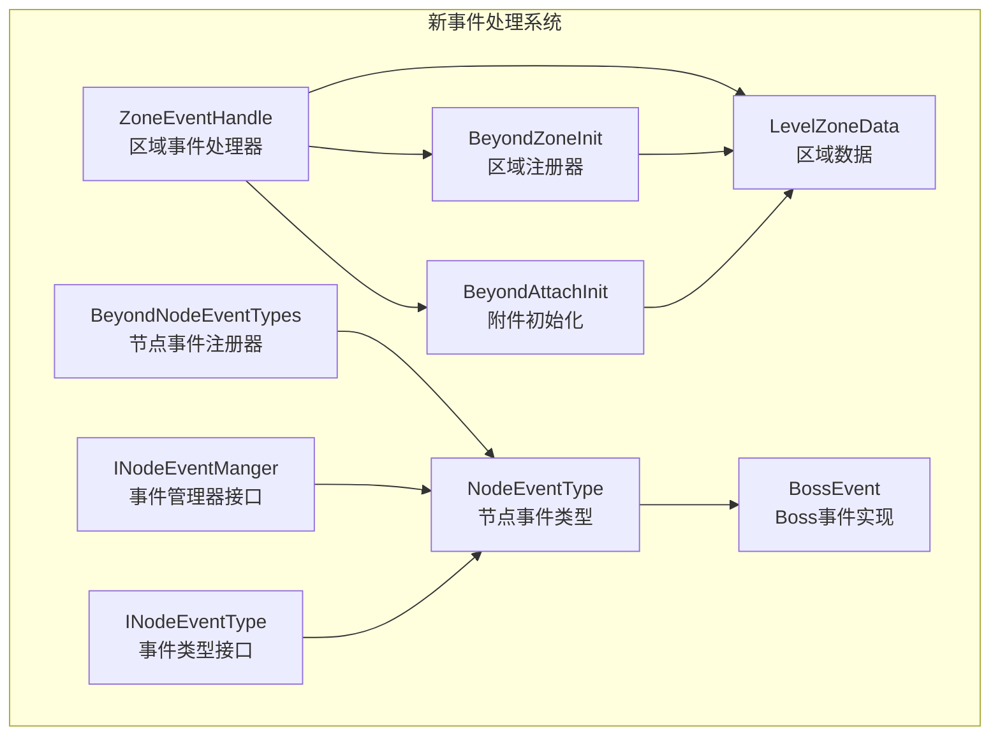
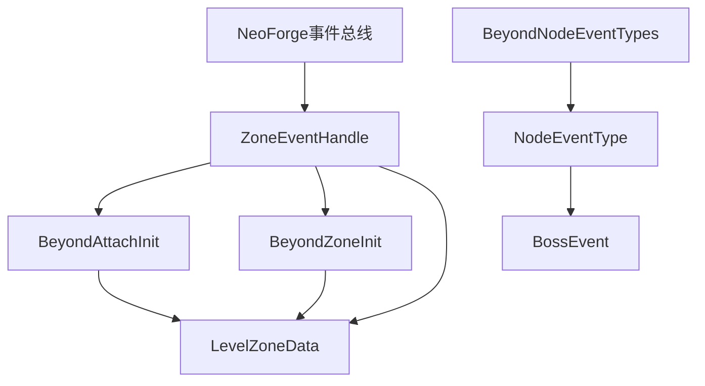
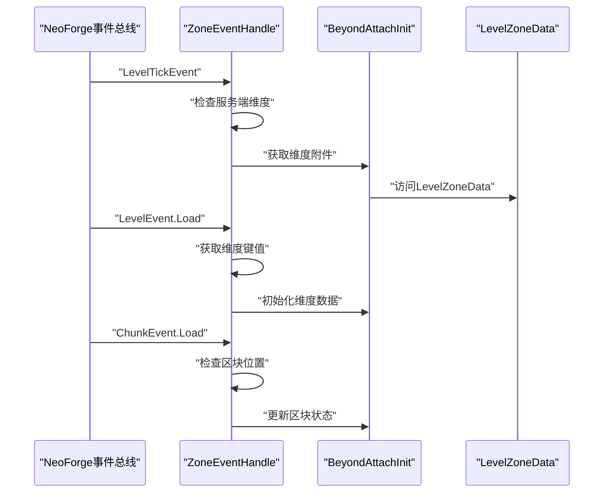
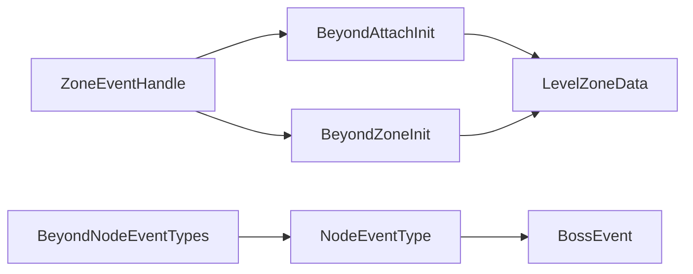

# 事件处理系统

<cite>
**本文引用的文件**
- [ZoneEventHandle.java](file://Beyond/src/main/java/com/pz/beyond/api/event/handle/ZoneEventHandle.java)
- [BeyondAttachInit.java](file://Beyond/src/main/java/com/pz/beyond/api/init/BeyondAttachInit.java)
- [BeyondZoneInit.java](file://Beyond/src/main/java/com/pz/beyond/api/init/BeyondZoneInit.java)
- [BeyondNodeEventTypes.java](file://Beyond/src/main/java/com/pz/beyond/api/init/BeyondNodeEventTypes.java)
- [BeyondEncounters.java](file://Beyond/src/main/java/com/pz/beyond/api/init/BeyondEncounters.java)
- [LevelZoneData.java](file://Beyond/src/main/java/com/pz/beyond/api/system/zone/LevelZoneData.java)
- [NodeEventType.java](file://Beyond/src/main/java/com/pz/beyond/api/system/node/core/NodeEventType.java)
- [INodeEventType.java](file://Beyond/src/main/java/com/pz/beyond/api/system/node/core/INodeEventType.java)
- [INodeEventManger.java](file://Beyond/src/main/java/com/pz/beyond/api/system/node/core/INodeEventManger.java)
- [BossEvent.java](file://Beyond/src/main/java/com/pz/beyond/node/BossEvent.java)
</cite>

## 更新摘要
**所做更改**
- 完全重写了事件处理系统架构，移除了旧的SafeZoneHandler、PlayerStateHandler等组件
- 新增ZoneEventHandle作为核心事件处理器，替代原有事件处理机制
- 引入基于注册表的区域系统和节点事件系统
- 更新了数据挂载机制，使用NeoForge附件系统替代传统网络载荷
- 新增节点事件类型注册和管理机制

## 目录
1. [简介](#简介)
2. [项目结构](#项目结构)
3. [核心组件](#核心组件)
4. [架构总览](#架构总览)
5. [组件详解](#组件详解)
6. [依赖关系分析](#依赖关系分析)
7. [性能考量](#性能考量)
8. [故障排查指南](#故障排查指南)
9. [结论](#结论)
10. [附录](#附录)

## 简介
本文档全面阐述Beyond模块中重构后的事件处理系统。新系统以ZoneEventHandle为核心，采用基于注册表的区域管理和节点事件机制，结合NeoForge附件系统实现数据持久化。系统通过事件总线监听维度加载、区块加载和等级滴答等关键事件，为安全区、节点区域和遭遇系统提供统一的事件处理框架。文档详细说明了新架构的设计理念、组件职责、交互流程以及性能优化策略。

## 项目结构
新事件处理系统主要位于以下包内：
- com.pz.beyond.api.event.handle：事件处理器（ZoneEventHandle）
- com.pz.beyond.api.init：注册初始化器（BeyondAttachInit、BeyondZoneInit等）
- com.pz.beyond.api.system.zone：区域系统（LevelZoneData、AbstractZone等）
- com.pz.beyond.api.system.node：节点事件系统（NodeEventType、BossEvent等）
- com.pz.beyond.api.system.progress：进度管理系统

**图表来源**
- [ZoneEventHandle.java:13-42](file://Beyond/src/main/java/com/pz/beyond/api/event/handle/ZoneEventHandle.java#L13-L42)
- [BeyondAttachInit.java:17-78](file://Beyond/src/main/java/com/pz/beyond/api/init/BeyondAttachInit.java#L17-L78)
- [BeyondZoneInit.java:19-63](file://Beyond/src/main/java/com/pz/beyond/api/init/BeyondZoneInit.java#L19-L63)
- [BeyondNodeEventTypes.java:19-49](file://Beyond/src/main/java/com/pz/beyond/api/init/BeyondNodeEventTypes.java#L19-L49)

**章节来源**
- [ZoneEventHandle.java:13-42](file://Beyond/src/main/java/com/pz/beyond/api/event/handle/ZoneEventHandle.java#L13-L42)
- [BeyondAttachInit.java:17-78](file://Beyond/src/main/java/com/pz/beyond/api/init/BeyondAttachInit.java#L17-L78)
- [BeyondZoneInit.java:19-63](file://Beyond/src/main/java/com/pz/beyond/api/init/BeyondZoneInit.java#L19-L63)
- [BeyondNodeEventTypes.java:19-49](file://Beyond/src/main/java/com/pz/beyond/api/init/BeyondNodeEventTypes.java#L19-L49)

## 核心组件
- **ZoneEventHandle**：新的事件处理器，监听维度加载、区块加载和等级滴答事件，负责区域系统的初始化和管理
- **BeyondAttachInit**：附件系统初始化器，使用NeoForge附件机制为维度挂载LevelZoneData等数据
- **BeyondZoneInit**：区域注册器，管理AbstractZone及其子类的注册和获取
- **BeyondNodeEventTypes**：节点事件类型注册器，提供BossEvent等节点事件的注册和管理
- **LevelZoneData**：区域数据容器，存储每个维度的区域配置和状态
- **NodeEventType**：节点事件抽象基类，定义节点事件的通用行为和接口
- **BossEvent**：Boss节点事件的具体实现

**章节来源**
- [ZoneEventHandle.java:13-42](file://Beyond/src/main/java/com/pz/beyond/api/event/handle/ZoneEventHandle.java#L13-L42)
- [BeyondAttachInit.java:17-78](file://Beyond/src/main/java/com/pz/beyond/api/init/BeyondAttachInit.java#L17-L78)
- [BeyondZoneInit.java:19-63](file://Beyond/src/main/java/com/pz/beyond/api/init/BeyondZoneInit.java#L19-L63)
- [BeyondNodeEventTypes.java:19-49](file://Beyond/src/main/java/com/pz/beyond/api/init/BeyondNodeEventTypes.java#L19-L49)
- [LevelZoneData.java:33-71](file://Beyond/src/main/java/com/pz/beyond/api/system/zone/LevelZoneData.java#L33-L71)

## 架构总览
新架构采用事件驱动和注册表驱动相结合的设计模式：

**图表来源**
- [ZoneEventHandle.java:13-42](file://Beyond/src/main/java/com/pz/beyond/api/event/handle/ZoneEventHandle.java#L13-L42)
- [BeyondAttachInit.java:17-78](file://Beyond/src/main/java/com/pz/beyond/api/init/BeyondAttachInit.java#L17-L78)
- [BeyondZoneInit.java:19-63](file://Beyond/src/main/java/com/pz/beyond/api/init/BeyondZoneInit.java#L19-L63)
- [BeyondNodeEventTypes.java:19-49](file://Beyond/src/main/java/com/pz/beyond/api/init/BeyondNodeEventTypes.java#L19-L49)

## 组件详解

### ZoneEventHandle：新的事件处理器
ZoneEventHandle是新事件处理系统的核心，负责监听和处理各种游戏事件：

- **事件监听**：
  - `onLevelTick`：监听等级滴答事件，处理区域系统的定时任务
  - `onLevelLoad`：监听维度加载事件，初始化该维度的区域数据
  - `onChunkLoad`：监听区块加载事件，处理区块级别的区域逻辑

- **处理逻辑**：
  - 所有事件都首先检查是否为服务端维度，客户端维度直接返回
  - 根据事件类型调用相应的区域管理逻辑
  - 通过NeoForge附件系统访问和修改维度数据

**图表来源**
- [ZoneEventHandle.java:17-41](file://Beyond/src/main/java/com/pz/beyond/api/event/handle/ZoneEventHandle.java#L17-L41)
- [BeyondAttachInit.java:49-60](file://Beyond/src/main/java/com/pz/beyond/api/init/BeyondAttachInit.java#L49-L60)

**章节来源**
- [ZoneEventHandle.java:13-42](file://Beyond/src/main/java/com/pz/beyond/api/event/handle/ZoneEventHandle.java#L13-L42)

### BeyondAttachInit：附件系统初始化
BeyondAttachInit使用NeoForge的附件系统为维度挂载持久化数据：

- **附件类型**：
  - `PROGRESS_CATALOG`：进度目录数据，挂载在Level上
  - `LEVEL_ZONE_DATA`：区域数据，挂载在Level上

- **数据序列化**：
  - 使用CODEC进行服务端序列化
  - 使用STREAM_CODEC进行网络同步
  - 支持数据复制和死亡继承

- **维度白名单**：
  - 限制只有主世界等特定维度可以挂载数据
  - 提供维度合法性检查方法

**章节来源**
- [BeyondAttachInit.java:17-78](file://Beyond/src/main/java/com/pz/beyond/api/init/BeyondAttachInit.java#L17-L78)

### BeyondZoneInit：区域注册系统
BeyondZoneInit提供区域类型的注册和管理功能：

- **注册表构建**：
  - 创建ZoneRegistry并注册AbstractZone类型
  - 提供区域注册器DeferredRegister

- **预定义区域**：
  - `SAFE_ZONE`：安全区域
  - `PLAYER_ACTIVE_ZONE`：玩家活跃区域
  - `PENDING_PLAYER_ACTIVE_ZONE`：待激活玩家区域
  - `NODE_ZONE`：节点区域

- **区域获取**：
  - 通过ID获取区域实例
  - 提供空区域占位符机制

**章节来源**
- [BeyondZoneInit.java:19-63](file://Beyond/src/main/java/com/pz/beyond/api/init/BeyondZoneInit.java#L19-L63)

### BeyondNodeEventTypes：节点事件系统
节点事件系统提供可扩展的事件类型注册机制：

- **注册表管理**：
  - 创建NodeEventType注册表
  - 提供DeferredRegister进行事件类型注册

- **事件类型**：
  - `EMPTY`：空事件类型，提供默认实现
  - `BOSS_EVENT`：Boss事件类型

- **事件管理**：
  - 提供事件类型获取方法
  - 支持事件类型的注册和查找

**章节来源**
- [BeyondNodeEventTypes.java:19-49](file://Beyond/src/main/java/com/pz/beyond/api/init/BeyondNodeEventTypes.java#L19-L49)

### LevelZoneData：区域数据容器
LevelZoneData是区域系统的核心数据结构：

- **数据结构**：
  - 存储维度键值和区域数据列表
  - 支持区域数据的序列化和网络传输

- **编码支持**：
  - 实现StreamCodec接口，支持快速序列化
  - 提供CODEC和STREAM_CODEC两种编码方式

- **功能预留**：
  - 预留区域监听器和安全区添加方法
  - 为未来功能扩展提供接口

**章节来源**
- [LevelZoneData.java:33-71](file://Beyond/src/main/java/com/pz/beyond/api/system/zone/LevelZoneData.java#L33-L71)

### NodeEventType：节点事件抽象基类
NodeEventType定义了节点事件的通用接口和行为：

- **核心接口**：
  - `cast(Context context)`：执行事件的主要逻辑
  - `canNextEvent(Context context)`：判断是否可以进行下一个事件

- **上下文管理**：
  - 通过Context传递事件执行所需的环境信息
  - 支持事件状态的查询和控制

**章节来源**
- [NodeEventType.java](file://Beyond/src/main/java/com/pz/beyond/api/system/node/core/NodeEventType.java)

## 依赖关系分析
新事件处理系统具有清晰的层次结构和依赖关系：

- **ZoneEventHandle**依赖：
  - NeoForge事件类型：LevelTickEvent、LevelEvent.Load、ChunkEvent.Load
  - 附件系统：BeyondAttachInit提供的维度数据访问
  - 区域系统：BeyondZoneInit的区域注册和获取

- **BeyondAttachInit**依赖：
  - NeoForge附件系统：AttachmentType、DeferredRegister
  - 服务端维度：ServerLevel检查和数据初始化

- **BeyondZoneInit**依赖：
  - NeoForge注册系统：RegistryBuilder、DeferredRegister
  - 区域类型：AbstractZone及其子类

- **BeyondNodeEventTypes**依赖：
  - NeoForge注册系统：NodeEventType注册表
  - 事件实现：BossEvent等具体事件类型

**图表来源**
- [ZoneEventHandle.java:13-42](file://Beyond/src/main/java/com/pz/beyond/api/event/handle/ZoneEventHandle.java#L13-L42)
- [BeyondAttachInit.java:17-78](file://Beyond/src/main/java/com/pz/beyond/api/init/BeyondAttachInit.java#L17-L78)
- [BeyondZoneInit.java:19-63](file://Beyond/src/main/java/com/pz/beyond/api/init/BeyondZoneInit.java#L19-L63)
- [BeyondNodeEventTypes.java:19-49](file://Beyond/src/main/java/com/pz/beyond/api/init/BeyondNodeEventTypes.java#L19-L49)

## 性能考量
新架构在性能方面进行了多项优化：

- **事件处理优化**：
  - ZoneEventHandle只处理服务端维度事件，避免客户端性能开销
  - 事件处理逻辑简洁，主要负责数据访问和状态更新

- **数据访问优化**：
  - 使用NeoForge附件系统，数据访问通过类型安全的API进行
  - 支持数据的增量更新和懒加载机制

- **内存管理**：
  - 附件数据随维度生命周期自动管理
  - 支持数据复制和死亡继承，减少数据重建开销

- **网络优化**：
  - 使用StreamCodec进行高效序列化
  - 支持按需同步，避免不必要的网络传输

- **并发安全**：
  - NeoForge事件总线保证事件处理的线程安全性
  - 附件系统提供类型安全的数据访问

## 故障排查指南
针对新事件处理系统的常见问题：

- **事件未触发**：
  - 检查ZoneEventHandle是否正确注册到事件总线
  - 确认事件类型是否为服务端维度事件
  - 验证事件监听方法的签名是否正确

- **区域数据访问失败**：
  - 检查维度是否在允许的维度白名单中
  - 确认附件系统是否正确初始化
  - 验证LevelZoneData的序列化和反序列化

- **节点事件不工作**：
  - 检查节点事件类型是否正确注册
  - 确认事件实现类是否正确继承NodeEventType
  - 验证事件上下文的传递和处理

- **性能问题**：
  - 监控事件处理的执行时间
  - 检查是否有过多的维度或区块事件
  - 优化事件处理逻辑，避免阻塞操作

**章节来源**
- [ZoneEventHandle.java:13-42](file://Beyond/src/main/java/com/pz/beyond/api/event/handle/ZoneEventHandle.java#L13-L42)
- [BeyondAttachInit.java:65-67](file://Beyond/src/main/java/com/pz/beyond/api/init/BeyondAttachInit.java#L65-L67)

## 结论
新事件处理系统通过ZoneEventHandle、附件系统和注册表机制的有机结合，实现了更加灵活和可扩展的事件处理框架。系统采用服务端优先的设计理念，通过NeoForge附件系统提供类型安全的数据持久化，结合注册表驱动的区域和节点事件管理，为Beyond模块提供了强大的基础设施支持。新架构在保持高性能的同时，为未来的功能扩展和模块化发展奠定了坚实基础。

## 附录

### 事件处理流程
新系统的标准事件处理流程：

1. **事件触发**：NeoForge事件总线触发相应事件
2. **ZoneEventHandle接收**：ZoneEventHandle根据事件类型处理
3. **数据访问**：通过BeyondAttachInit访问维度附件数据
4. **业务处理**：执行相应的区域或节点事件逻辑
5. **状态更新**：更新LevelZoneData等数据状态
6. **网络同步**：通过StreamCodec进行数据同步

### 注册和初始化流程
- **模块初始化**：Beyond.newRegister()注册所有初始化器
- **注册表创建**：各初始化器创建对应的注册表
- **事件监听**：ZoneEventHandle自动注册到事件总线
- **数据挂载**：维度加载时自动挂载附件数据

### 扩展开发指南
- **自定义区域类型**：继承AbstractZone并注册到BeyondZoneInit
- **自定义节点事件**：实现NodeEventType并注册到BeyondNodeEventTypes
- **自定义事件处理器**：创建新的@EventBusSubscriber处理器类
- **数据扩展**：通过附件系统扩展新的维度数据类型

**章节来源**
- [Beyond.java:32-44](file://Beyond/src/main/java/com/pz/beyond/Beyond.java#L32-L44)
- [BeyondAttachInit.java:74-76](file://Beyond/src/main/java/com/pz/beyond/api/init/BeyondAttachInit.java#L74-L76)
- [BeyondZoneInit.java:44-46](file://Beyond/src/main/java/com/pz/beyond/api/init/BeyondZoneInit.java#L44-L46)