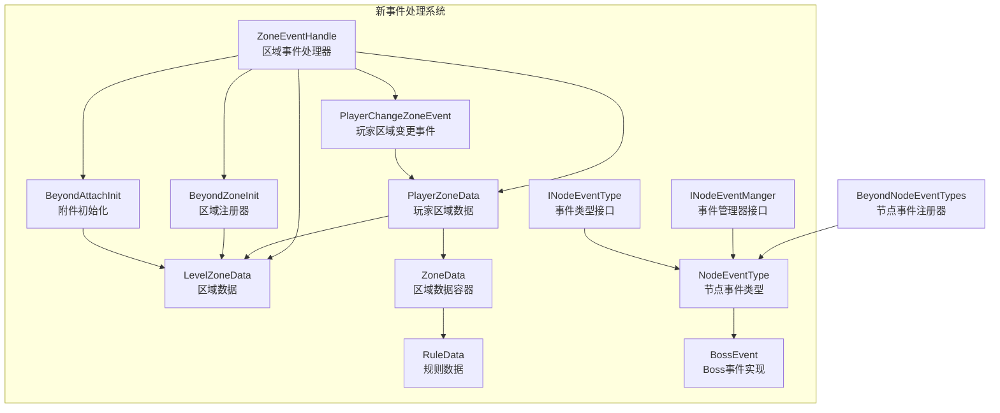
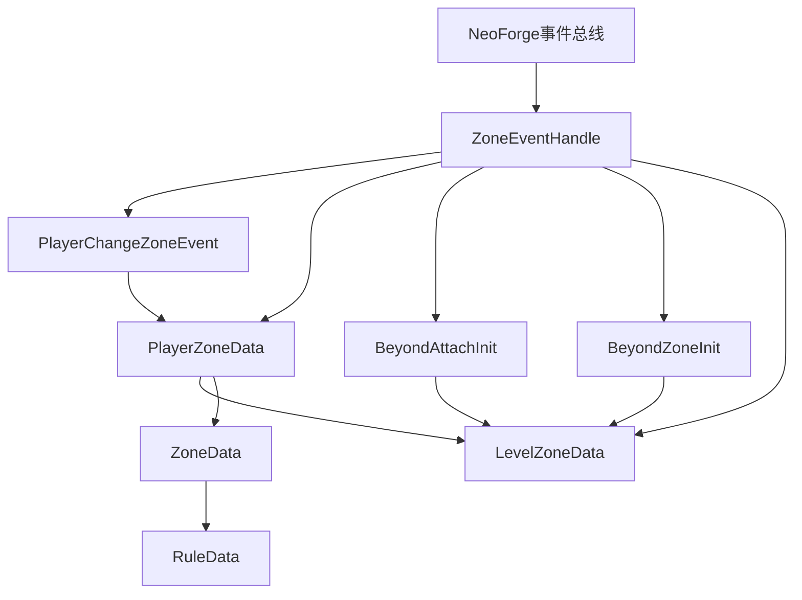
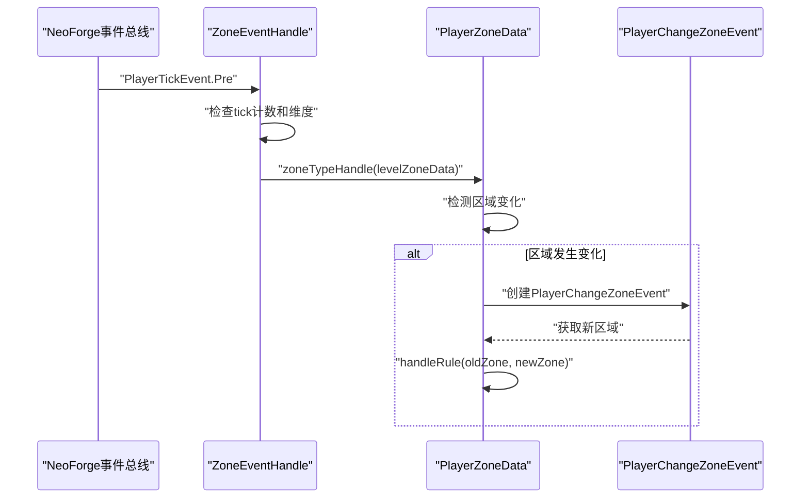
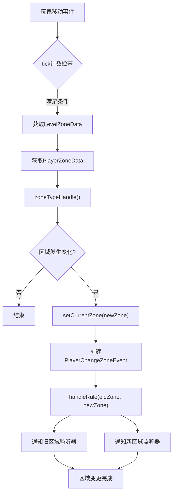

# 事件处理系统

<cite>
**本文引用的文件**
- [ZoneEventHandle.java](file://Beyond/src/main/java/com/pz/beyond/api/event/handle/ZoneEventHandle.java)
- [PlayerChangeZoneEvent.java](file://Beyond/src/main/java/com/pz/beyond/api/event/custom/PlayerChangeZoneEvent.java)
- [PlayerZoneData.java](file://Beyond/src/main/java/com/pz/beyond/api/system/zone/zones/PlayerZoneData.java)
- [BeyondAttachInit.java](file://Beyond/src/main/java/com/pz/beyond/api/init/BeyondAttachInit.java)
- [BeyondZoneInit.java](file://Beyond/src/main/java/com/pz/beyond/api/init/BeyondZoneInit.java)
- [BeyondNodeEventTypes.java](file://Beyond/src/main/java/com/pz/beyond/api/init/BeyondNodeEventTypes.java)
- [BeyondEncounters.java](file://Beyond/src/main/java/com/pz/beyond/api/init/BeyondEncounters.java)
- [LevelZoneData.java](file://Beyond/src/main/java/com/pz/beyond/api/system/zone/LevelZoneData.java)
- [NodeEventType.java](file://Beyond/src/main/java/com/pz/beyond/api/system/node/core/NodeEventType.java)
- [INodeEventType.java](file://Beyond/src/main/java/com/pz/beyond/api/system/node/core/INodeEventType.java)
- [INodeEventManger.java](file://Beyond/src/main/java/com/pz/beyond/api/system/node/core/INodeEventManger.java)
- [BossEvent.java](file://Beyond/src/main/java/com/pz/beyond/node/BossEvent.java)
- [ZoneData.java](file://Beyond/src/main/java/com/pz/beyond/api/system/zone/ZoneData.java)
- [RuleData.java](file://Beyond/src/main/java/com/pz/beyond/api/system/rule/RuleData.java)
</cite>

## 更新摘要
**所做更改**
- ZoneEventHandle大幅增强，新增PlayerMove、PlayerClone、PlayerTeleport事件处理机制
- 新增PlayerChangeZoneEvent自定义事件，提供区域变更的完整生命周期通知
- 改进PlayerZoneData的区域变更处理，实现更精确的事件触发和规则执行
- 优化区域检测频率，通过PLAYER_ZONE_CHECK_INTERVAL参数控制每4tick检测一次
- 增强事件处理的性能优化和内存管理机制

## 目录
1. [简介](#简介)
2. [项目结构](#项目结构)
3. [核心组件](#核心组件)
4. [架构总览](#架构总览)
5. [组件详解](#组件详解)
6. [事件处理机制](#事件处理机制)
7. [自定义事件系统](#自定义事件系统)
8. [性能优化策略](#性能优化策略)
9. [故障排查指南](#故障排查指南)
10. [结论](#结论)
11. [附录](#附录)

## 简介
本文档全面阐述Beyond模块中重构后的事件处理系统。新系统以ZoneEventHandle为核心，采用基于注册表的区域管理和节点事件机制，结合NeoForge附件系统实现数据持久化。系统通过事件总线监听维度加载、区块加载、玩家移动、玩家传送和玩家克隆等关键事件，为安全区、节点区域和遭遇系统提供统一的事件处理框架。文档详细说明了新架构的设计理念、组件职责、交互流程以及性能优化策略。

## 项目结构
新事件处理系统主要位于以下包内：
- com.pz.beyond.api.event.handle：事件处理器（ZoneEventHandle）
- com.pz.beyond.api.event.custom：自定义事件（PlayerChangeZoneEvent）
- com.pz.beyond.api.system.zone.zones：区域数据管理（PlayerZoneData）
- com.pz.beyond.api.init：注册初始化器（BeyondAttachInit、BeyondZoneInit等）
- com.pz.beyond.api.system.zone：区域系统（LevelZoneData、AbstractZone等）
- com.pz.beyond.api.system.node：节点事件系统（NodeEventType、BossEvent等）
- com.pz.beyond.api.system.progress：进度管理系统



**图表来源**
- [ZoneEventHandle.java:24-141](file://Beyond/src/main/java/com/pz/beyond/api/event/handle/ZoneEventHandle.java#L24-L141)
- [PlayerChangeZoneEvent.java:12-29](file://Beyond/src/main/java/com/pz/beyond/api/event/custom/PlayerChangeZoneEvent.java#L12-L29)
- [PlayerZoneData.java:28-165](file://Beyond/src/main/java/com/pz/beyond/api/system/zone/zones/PlayerZoneData.java#L28-L165)
- [BeyondAttachInit.java:17-78](file://Beyond/src/main/java/com/pz/beyond/api/init/BeyondAttachInit.java#L17-L78)
- [BeyondZoneInit.java:19-63](file://Beyond/src/main/java/com/pz/beyond/api/init/BeyondZoneInit.java#L19-L63)
- [LevelZoneData.java:31-309](file://Beyond/src/main/java/com/pz/beyond/api/system/zone/LevelZoneData.java#L31-L309)
- [ZoneData.java:22-140](file://Beyond/src/main/java/com/pz/beyond/api/system/zone/ZoneData.java#L22-L140)
- [RuleData.java:16-69](file://Beyond/src/main/java/com/pz/beyond/api/system/rule/RuleData.java#L16-L69)

**章节来源**
- [ZoneEventHandle.java:24-141](file://Beyond/src/main/java/com/pz/beyond/api/event/handle/ZoneEventHandle.java#L24-L141)
- [PlayerChangeZoneEvent.java:12-29](file://Beyond/src/main/java/com/pz/beyond/api/event/custom/PlayerChangeZoneEvent.java#L12-L29)
- [PlayerZoneData.java:28-165](file://Beyond/src/main/java/com/pz/beyond/api/system/zone/zones/PlayerZoneData.java#L28-L165)

## 核心组件
- **ZoneEventHandle**：新的事件处理器，监听维度加载、区块加载、玩家移动、玩家传送和玩家克隆事件，负责区域系统的初始化和管理
- **PlayerChangeZoneEvent**：自定义事件，提供玩家区域变更的完整生命周期通知，包含旧区域和新区域信息
- **PlayerZoneData**：玩家当前所在区域的数据管理，负责区域检测、变更处理和规则触发
- **BeyondAttachInit**：附件系统初始化器，使用NeoForge附件机制为维度挂载LevelZoneData等数据
- **BeyondZoneInit**：区域注册器，管理AbstractZone及其子类的注册和获取
- **BeyondNodeEventTypes**：节点事件类型注册器，提供BossEvent等节点事件的注册和管理
- **LevelZoneData**：区域数据容器，存储每个维度的区域配置和状态
- **ZoneData**：区域数据容器，管理区域的监听器、区块键和初始化状态
- **RuleData**：规则数据容器，封装AbstractRule和规则等级信息
- **NodeEventType**：节点事件抽象基类，定义节点事件的通用行为和接口
- **BossEvent**：Boss节点事件的具体实现

**章节来源**
- [ZoneEventHandle.java:24-141](file://Beyond/src/main/java/com/pz/beyond/api/event/handle/ZoneEventHandle.java#L24-L141)
- [PlayerChangeZoneEvent.java:12-29](file://Beyond/src/main/java/com/pz/beyond/api/event/custom/PlayerChangeZoneEvent.java#L12-L29)
- [PlayerZoneData.java:28-165](file://Beyond/src/main/java/com/pz/beyond/api/system/zone/zones/PlayerZoneData.java#L28-L165)
- [BeyondAttachInit.java:17-78](file://Beyond/src/main/java/com/pz/beyond/api/init/BeyondAttachInit.java#L17-L78)
- [BeyondZoneInit.java:19-63](file://Beyond/src/main/java/com/pz/beyond/api/init/BeyondZoneInit.java#L19-L63)
- [LevelZoneData.java:31-309](file://Beyond/src/main/java/com/pz/beyond/api/system/zone/LevelZoneData.java#L31-L309)
- [ZoneData.java:22-140](file://Beyond/src/main/java/com/pz/beyond/api/system/zone/ZoneData.java#L22-L140)
- [RuleData.java:16-69](file://Beyond/src/main/java/com/pz/beyond/api/system/rule/RuleData.java#L16-L69)

## 架构总览
新架构采用事件驱动和注册表驱动相结合的设计模式，通过多层事件处理实现复杂的区域管理：



**图表来源**
- [ZoneEventHandle.java:24-141](file://Beyond/src/main/java/com/pz/beyond/api/event/handle/ZoneEventHandle.java#L24-L141)
- [PlayerChangeZoneEvent.java:12-29](file://Beyond/src/main/java/com/pz/beyond/api/event/custom/PlayerChangeZoneEvent.java#L12-L29)
- [PlayerZoneData.java:28-165](file://Beyond/src/main/java/com/pz/beyond/api/system/zone/zones/PlayerZoneData.java#L28-L165)
- [BeyondAttachInit.java:17-78](file://Beyond/src/main/java/com/pz/beyond/api/init/BeyondAttachInit.java#L17-L78)
- [BeyondZoneInit.java:19-63](file://Beyond/src/main/java/com/pz/beyond/api/init/BeyondZoneInit.java#L19-L63)
- [LevelZoneData.java:31-309](file://Beyond/src/main/java/com/pz/beyond/api/system/zone/LevelZoneData.java#L31-L309)
- [ZoneData.java:22-140](file://Beyond/src/main/java/com/pz/beyond/api/system/zone/ZoneData.java#L22-L140)
- [RuleData.java:16-69](file://Beyond/src/main/java/com/pz/beyond/api/system/rule/RuleData.java#L16-L69)

## 组件详解

### ZoneEventHandle：增强的事件处理器
ZoneEventHandle是新事件处理系统的核心，经过大幅增强，现在支持多种事件类型：

- **事件监听**：
  - `onLevelLoad`：监听维度加载事件，延迟初始化安全区
  - `onLevelTick`：监听等级滴答事件，处理区域系统的定时任务
  - `onChunkLoad`：监听区块加载事件，将新区块添加到PendingZone
  - `onPlayerMove`：监听玩家移动事件，每4tick检测一次区域变化
  - `onPlayerClone`：监听玩家克隆事件，重生后立即检测区域
  - `onPlayerTeleport`：监听玩家传送事件，传送后立即检测区域

- **性能优化**：
  - 使用PLAYER_ZONE_CHECK_INTERVAL常量控制检测频率
  - 仅处理服务端维度事件，避免客户端性能开销
  - 通过事件类型过滤减少不必要的处理



**图表来源**
- [ZoneEventHandle.java:87-103](file://Beyond/src/main/java/com/pz/beyond/api/event/handle/ZoneEventHandle.java#L87-L103)
- [PlayerZoneData.java:94-112](file://Beyond/src/main/java/com/pz/beyond/api/system/zone/zones/PlayerZoneData.java#L94-L112)
- [PlayerChangeZoneEvent.java:12-29](file://Beyond/src/main/java/com/pz/beyond/api/event/custom/PlayerChangeZoneEvent.java#L12-L29)

**章节来源**
- [ZoneEventHandle.java:24-141](file://Beyond/src/main/java/com/pz/beyond/api/event/handle/ZoneEventHandle.java#L24-L141)

### PlayerChangeZoneEvent：自定义区域变更事件
PlayerChangeZoneEvent是新增的自定义事件，提供区域变更的完整生命周期通知：

- **事件特性**：
  - 仅在服务端触发
  - 表示玩家通过多种方式（传送、步行、死亡）通过区域边界
  - 无法取消，也无法改变结果
  - 包含旧区域和新区域的完整信息

- **事件用途**：
  - 为其他模组提供区域变更的监听点
  - 支持区域变更的插件式扩展
  - 提供区域变更的审计和日志记录

**章节来源**
- [PlayerChangeZoneEvent.java:12-29](file://Beyond/src/main/java/com/pz/beyond/api/event/custom/PlayerChangeZoneEvent.java#L12-L29)

### PlayerZoneData：增强的区域数据管理
PlayerZoneData经过改进，现在提供更精确的区域变更处理：

- **区域检测**：
  - `zoneTypeHandle()`：检测并更新玩家当前所在的区域
  - 基于区块坐标确定区域类型
  - 返回布尔值指示区域是否发生变化

- **区域变更处理**：
  - `setCurrentZone()`：设置新区域并触发完整流程
  - 创建PlayerChangeZoneEvent事件
  - 调用handleRule()触发区域规则
  - 支持旧区域和新区域的分别处理

- **性能优化**：
  - 使用PLAYER_ZONE_CHECK_INTERVAL控制检测频率
  - 缓存玩家引用以减少数据访问开销
  - 懒加载机制避免不必要的初始化

**章节来源**
- [PlayerZoneData.java:28-165](file://Beyond/src/main/java/com/pz/beyond/api/system/zone/zones/PlayerZoneData.java#L28-L165)

### BeyondAttachInit：附件系统初始化
BeyondAttachInit使用NeoForge的附件系统为维度挂载持久化数据：

- **附件类型**：
  - `PROGRESS_CATALOG`：进度目录数据，挂载在Level上
  - `LEVEL_ZONE_DATA`：区域数据，挂载在Level上

- **数据序列化**：
  - 使用CODEC进行服务端序列化
  - 使用STREAM_CODEC进行网络同步
  - 支持数据复制和死亡继承

- **维度白名单**：
  - 限制只有主世界等特定维度可以挂载数据
  - 提供维度合法性检查方法

**章节来源**
- [BeyondAttachInit.java:17-78](file://Beyond/src/main/java/com/pz/beyond/api/init/BeyondAttachInit.java#L17-L78)

### BeyondZoneInit：区域注册系统
BeyondZoneInit提供区域类型的注册和管理功能：

- **注册表构建**：
  - 创建ZoneRegistry并注册AbstractZone类型
  - 提供区域注册器DeferredRegister

- **预定义区域**：
  - `SAFE_ZONE`：安全区域
  - `PLAYER_ACTIVE_ZONE`：玩家活跃区域
  - `PENDING_PLAYER_ACTIVE_ZONE`：待激活玩家区域
  - `NODE_ZONE`：节点区域

- **区域获取**：
  - 通过ID获取区域实例
  - 提供空区域占位符机制

**章节来源**
- [BeyondZoneInit.java:19-63](file://Beyond/src/main/java/com/pz/beyond/api/init/BeyondZoneInit.java#L19-L63)

### BeyondNodeEventTypes：节点事件系统
节点事件系统提供可扩展的事件类型注册机制：

- **注册表管理**：
  - 创建NodeEventType注册表
  - 提供DeferredRegister进行事件类型注册

- **事件类型**：
  - `EMPTY`：空事件类型，提供默认实现
  - `BOSS_EVENT`：Boss事件类型

- **事件管理**：
  - 提供事件类型获取方法
  - 支持事件类型的注册和查找

**章节来源**
- [BeyondNodeEventTypes.java:19-49](file://Beyond/src/main/java/com/pz/beyond/api/init/BeyondNodeEventTypes.java#L19-L49)

### LevelZoneData：区域数据容器
LevelZoneData是区域系统的核心数据结构，经过增强支持更复杂的区域管理：

- **数据结构**：
  - 存储维度键值和区域数据列表
  - 支持区域数据的序列化和网络传输

- **编码支持**：
  - 实现StreamCodec接口，支持快速序列化
  - 提供CODEC和STREAM_CODEC两种编码方式

- **区域管理**：
  - `initializeSafeZoneIfNeeded()`：初始化安全区
  - `initializePendingZone()`：初始化待激活区域
  - `addChunkToPendingZone()`：添加区块到待激活区域
  - `getZoneByChunkKey()`：根据区块键查找区域

- **功能预留**：
  - 预留区域监听器和安全区添加方法
  - 为未来功能扩展提供接口

**章节来源**
- [LevelZoneData.java:31-309](file://Beyond/src/main/java/com/pz/beyond/api/system/zone/LevelZoneData.java#L31-L309)

### ZoneData：区域数据容器
ZoneData管理单个区域的所有相关数据：

- **数据结构**：
  - `zone`：区域实例
  - `listeners`：规则监听器列表
  - `chunkKeys`：包含该区域的区块键集合
  - `initialized`：初始化状态标志

- **编码支持**：
  - 实现Codec和StreamCodec接口
  - 支持序列化和网络传输

- **监听器管理**：
  - `addListener()`：添加规则监听器
  - `removeListener()`：移除规则监听器
  - `clearListeners()`：清空所有监听器

**章节来源**
- [ZoneData.java:22-140](file://Beyond/src/main/java/com/pz/beyond/api/system/zone/ZoneData.java#L22-L140)

### RuleData：规则数据容器
RuleData封装规则实例和规则等级信息：

- **数据结构**：
  - `rule`：AbstractRule实例
  - `ruleLevel`：规则等级

- **编码支持**：
  - 实现Codec和StreamCodec接口
  - 支持序列化和网络传输

- **规则管理**：
  - `addLevel()`：增加规则等级
  - `setLevel()`：设置规则等级
  - `getRule()`：根据ID获取规则实例

**章节来源**
- [RuleData.java:16-69](file://Beyond/src/main/java/com/pz/beyond/api/system/rule/RuleData.java#L16-L69)

### NodeEventType：节点事件抽象基类
NodeEventType定义了节点事件的通用接口和行为：

- **核心接口**：
  - `cast(Context context)`：执行事件的主要逻辑
  - `canNextEvent(Context context)`：判断是否可以进行下一个事件

- **上下文管理**：
  - 通过Context传递事件执行所需的环境信息
  - 支持事件状态的查询和控制

**章节来源**
- [NodeEventType.java](file://Beyond/src/main/java/com/pz/beyond/api/system/node/core/NodeEventType.java)

## 事件处理机制

### 区域检测流程
新系统的区域检测流程经过优化，提供高效的区域变更检测：



**图表来源**
- [ZoneEventHandle.java:87-103](file://Beyond/src/main/java/com/pz/beyond/api/event/handle/ZoneEventHandle.java#L87-L103)
- [PlayerZoneData.java:94-150](file://Beyond/src/main/java/com/pz/beyond/api/system/zone/zones/PlayerZoneData.java#L94-L150)

### 区域变更规则处理
区域变更规则处理机制提供灵活的事件响应能力：

- **旧区域通知**：当玩家离开区域时，通知该区域的监听器
- **新区域通知**：当玩家进入新区域时，通知该区域的监听器
- **监听器遍历**：遍历ZoneData中的所有RuleData监听器
- **规则执行**：调用listener.getRule().playerChangeZone()执行规则

**章节来源**
- [PlayerZoneData.java:118-141](file://Beyond/src/main/java/com/pz/beyond/api/system/zone/zones/PlayerZoneData.java#L118-L141)

### 事件优先级和执行顺序
系统通过合理的事件处理顺序确保区域变更的正确性：

1. **维度检查**：首先验证事件发生在服务端维度
2. **数据访问**：通过BeyondAttachInit访问维度附件数据
3. **区域检测**：执行zoneTypeHandle()检测区域变化
4. **事件创建**：创建PlayerChangeZoneEvent事件
5. **规则触发**：调用handleRule()触发区域规则
6. **状态更新**：更新PlayerZoneData的currentZone

**章节来源**
- [ZoneEventHandle.java:46-103](file://Beyond/src/main/java/com/pz/beyond/api/event/handle/ZoneEventHandle.java#L46-L103)

## 自定义事件系统

### PlayerChangeZoneEvent设计
PlayerChangeZoneEvent是系统中最重要的自定义事件，提供完整的区域变更生命周期：

- **事件继承**：继承PlayerEvent，确保与NeoForge事件系统的兼容性
- **数据封装**：封装oldZone和newZone两个AbstractZone实例
- **不可变性**：事件字段为final，确保事件数据的完整性
- **服务端专用**：仅在服务端触发，避免客户端事件处理

### 事件触发时机
PlayerChangeZoneEvent在以下时机被触发：

- **区域检测**：当zoneTypeHandle()检测到区域变化时
- **玩家传送**：onPlayerTeleport()事件处理中
- **玩家克隆**：onPlayerClone()事件处理中
- **玩家移动**：onPlayerMove()事件处理中（每4tick）

### 事件监听和处理
其他模组可以通过以下方式监听PlayerChangeZoneEvent：

```java
@SubscribeEvent
public void onPlayerChangeZone(PlayerChangeZoneEvent event) {
    AbstractZone<?> oldZone = event.getOldZone();
    AbstractZone<?> newZone = event.getNewZone();
    ServerPlayer player = event.getEntity();
    
    // 处理区域变更逻辑
    handleZoneChange(player, oldZone, newZone);
}
```

**章节来源**
- [PlayerChangeZoneEvent.java:12-29](file://Beyond/src/main/java/com/pz/beyond/api/event/custom/PlayerChangeZoneEvent.java#L12-L29)
- [PlayerZoneData.java:144-150](file://Beyond/src/main/java/com/pz/beyond/api/system/zone/zones/PlayerZoneData.java#L144-L150)

## 性能优化策略

### 检测频率控制
系统通过PLAYER_ZONE_CHECK_INTERVAL常量控制区域检测频率：

- **默认间隔**：4 ticks（约0.2秒）
- **性能平衡**：在响应速度和性能之间取得平衡
- **可配置性**：可通过修改常量调整检测频率

### 事件过滤优化
ZoneEventHandle实施多层次的事件过滤：

- **维度过滤**：仅处理ServerLevel实例
- **类型过滤**：检查事件实体类型
- **条件过滤**：基于tick计数和区域状态的条件检查

### 内存管理优化
系统采用多种内存管理策略：

- **数据缓存**：PlayerZoneData缓存玩家引用
- **懒加载**：区域数据按需初始化
- **资源清理**：提供clearPlayer()方法清理玩家引用

### 网络同步优化
LevelZoneData支持高效的网络同步：

- **StreamCodec**：使用StreamCodec进行快速序列化
- **增量更新**：支持区域数据的增量更新
- **按需同步**：避免不必要的网络传输

**章节来源**
- [ZoneEventHandle.java:31-37](file://Beyond/src/main/java/com/pz/beyond/api/event/handle/ZoneEventHandle.java#L31-L37)
- [PlayerZoneData.java:79-85](file://Beyond/src/main/java/com/pz/beyond/api/system/zone/zones/PlayerZoneData.java#L79-L85)

## 故障排查指南

### 事件未触发问题
- **检查事件注册**：确认ZoneEventHandle是否正确注册到事件总线
- **验证事件类型**：确保事件类型为服务端维度事件
- **检查tick计数**：确认PLAYER_ZONE_CHECK_INTERVAL设置正确
- **验证维度白名单**：检查维度是否在允许的范围内

### 区域数据访问失败
- **检查维度合法性**：确认维度在允许的维度白名单中
- **验证附件初始化**：确认BeyondAttachInit正确初始化
- **检查LevelZoneData序列化**：验证数据的序列化和反序列化
- **监控日志输出**：查看系统日志中的调试信息

### 区域变更不生效
- **检查区域检测**：确认zoneTypeHandle()正常工作
- **验证PlayerChangeZoneEvent**：确认事件正确创建和触发
- **检查规则监听器**：验证ZoneData中的监听器配置
- **测试区域边界**：确认玩家确实跨越了区域边界

### 性能问题诊断
- **监控事件处理时间**：使用性能分析工具监控事件处理
- **检查检测频率**：确认PLAYER_ZONE_CHECK_INTERVAL设置合理
- **分析内存使用**：监控PlayerZoneData的内存占用
- **优化规则处理**：检查自定义规则的性能影响

**章节来源**
- [ZoneEventHandle.java:24-141](file://Beyond/src/main/java/com/pz/beyond/api/event/handle/ZoneEventHandle.java#L24-L141)
- [BeyondAttachInit.java:65-67](file://Beyond/src/main/java/com/pz/beyond/api/init/BeyondAttachInit.java#L65-L67)

## 结论
新事件处理系统通过ZoneEventHandle、PlayerChangeZoneEvent、PlayerZoneData等组件的有机结合，实现了更加灵活、高效和可扩展的事件处理框架。系统采用服务端优先的设计理念，通过NeoForge附件系统提供类型安全的数据持久化，结合注册表驱动的区域和节点事件管理，为Beyond模块提供了强大的基础设施支持。

新增的PlayerChangeZoneEvent自定义事件为其他模组提供了丰富的扩展点，而ZoneEventHandle的增强功能确保了系统的高性能运行。通过合理的事件处理顺序、性能优化策略和内存管理机制，新架构在保持高性能的同时，为未来的功能扩展和模块化发展奠定了坚实基础。

## 附录

### 事件处理流程
新系统的标准事件处理流程：

1. **事件触发**：NeoForge事件总线触发相应事件
2. **ZoneEventHandle接收**：ZoneEventHandle根据事件类型处理
3. **数据访问**：通过BeyondAttachInit访问维度附件数据
4. **区域检测**：执行zoneTypeHandle()检测区域变化
5. **事件创建**：创建PlayerChangeZoneEvent事件
6. **规则触发**：调用handleRule()触发区域规则
7. **状态更新**：更新PlayerZoneData等数据状态
8. **网络同步**：通过StreamCodec进行数据同步

### 注册和初始化流程
- **模块初始化**：Beyond.newRegister()注册所有初始化器
- **注册表创建**：各初始化器创建对应的注册表
- **事件监听**：ZoneEventHandle自动注册到事件总线
- **数据挂载**：维度加载时自动挂载附件数据
- **区域初始化**：安全区和待激活区域的延迟初始化

### 扩展开发指南
- **自定义区域类型**：继承AbstractZone并注册到BeyondZoneInit
- **自定义节点事件**：实现NodeEventType并注册到BeyondNodeEventTypes
- **自定义事件处理器**：创建新的@EventBusSubscriber处理器类
- **自定义规则**：实现AbstractRule并注册到BeyondZoneRuleInit
- **自定义区域变更监听**：监听PlayerChangeZoneEvent事件

### 性能监控指标
- **事件处理时间**：监控各类事件的处理耗时
- **区域检测频率**：统计每tick的区域检测次数
- **内存使用情况**：监控PlayerZoneData的内存占用
- **网络带宽使用**：统计LevelZoneData的网络传输量
- **规则执行性能**：监控自定义规则的执行效率

**章节来源**
- [Beyond.java:32-44](file://Beyond/src/main/java/com/pz/beyond/Beyond.java#L32-L44)
- [BeyondAttachInit.java:74-76](file://Beyond/src/main/java/com/pz/beyond/api/init/BeyondAttachInit.java#L74-L76)
- [BeyondZoneInit.java:44-46](file://Beyond/src/main/java/com/pz/beyond/api/init/BeyondZoneInit.java#L44-L46)