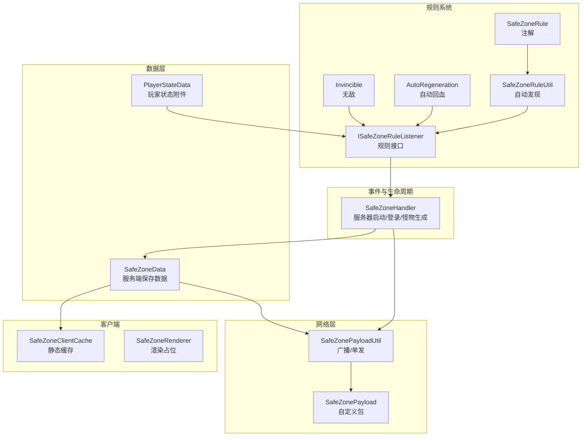
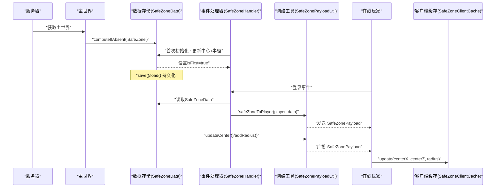
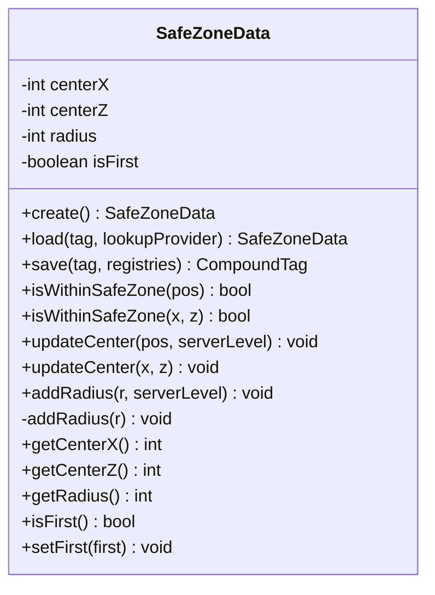
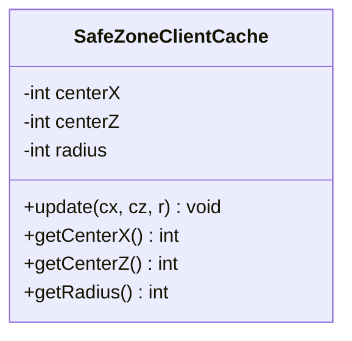
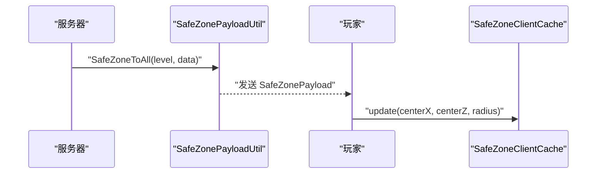
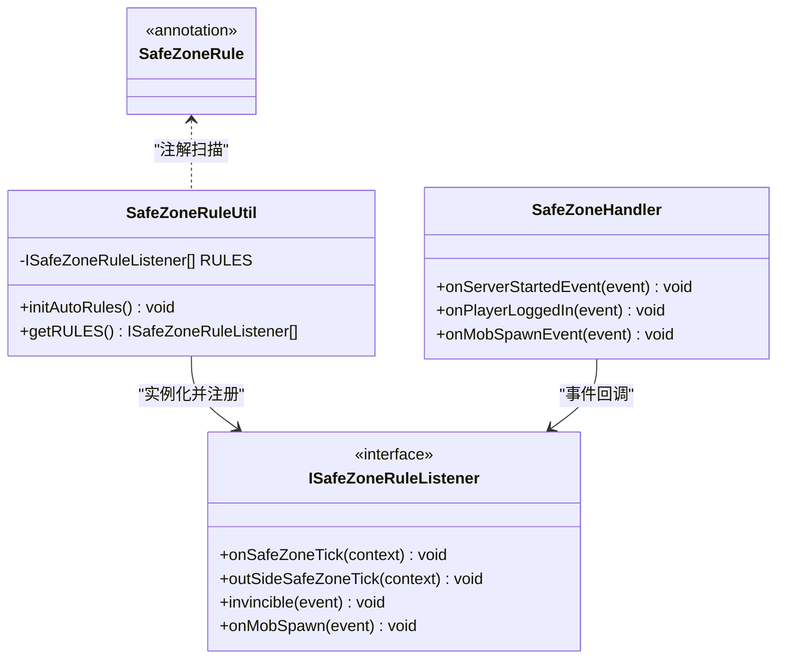
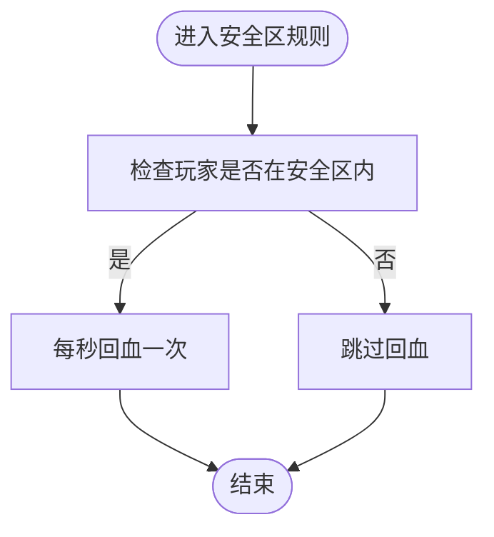
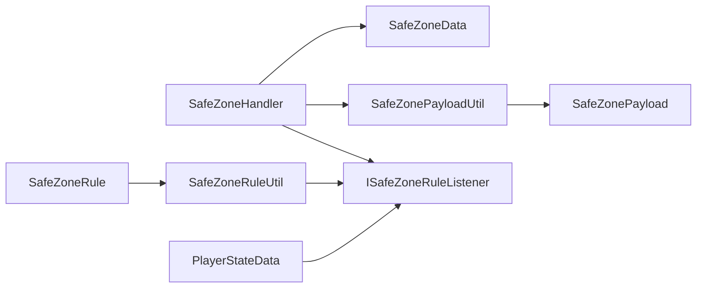

# 安全区数据模型

<cite>
**本文引用的文件**
- [SafeZoneData.java](file://Beyond/src/main/java/com/pz/beyond/data/SafeZoneData.java)
- [SafeZoneClientCache.java](file://Beyond/src/main/java/com/pz/beyond/data/SafeZoneClientCache.java)
- [SafeZonePayload.java](file://Beyond/src/main/java/com/pz/beyond/network/SafeZonePayload.java)
- [SafeZoneHandler.java](file://Beyond/src/main/java/com/pz/beyond/event/SafeZoneHandler.java)
- [SafeZonePayloadUtil.java](file://Beyond/src/main/java/com/pz/beyond/util/SafeZonePayloadUtil.java)
- [SafeZoneRenderer.java](file://Beyond/src/main/java/com/pz/beyond/renderer/SafeZoneRenderer.java)
- [ISafeZoneRuleListener.java](file://Beyond/src/main/java/com/pz/beyond/safeZoneRule/ISafeZoneRuleListener.java)
- [SafeZoneRuleUtil.java](file://Beyond/src/main/java/com/pz/beyond/util/SafeZoneRuleUtil.java)
- [SafeZoneRule.java](file://Beyond/src/main/java/com/pz/beyond/safeZoneRule/SafeZoneRule.java)
- [AutoRegeneration.java](file://Beyond/src/main/java/com/pz/beyond/safeZoneRule/impl/AutoRegeneration.java)
- [Invincible.java](file://Beyond/src/main/java/com/pz/beyond/safeZoneRule/impl/Invincible.java)
- [PlayerStateData.java](file://Beyond/src/main/java/com/pz/beyond/data/PlayerStateData.java)
- [ModAttachments.java](file://Beyond/src/main/java/com/pz/beyond/registry/ModAttachments.java)
</cite>

## 目录
1. [简介](#简介)
2. [项目结构](#项目结构)
3. [核心组件](#核心组件)
4. [架构总览](#架构总览)
5. [详细组件分析](#详细组件分析)
6. [依赖分析](#依赖分析)
7. [性能考虑](#性能考虑)
8. [故障排查指南](#故障排查指南)
9. [结论](#结论)
10. [附录](#附录)

## 简介
本文件系统性阐述“安全区数据模型”的设计与实现，覆盖以下主题：
- SafeZoneData 数据结构的设计、字段语义与几何定义
- 安全区的参数配置与验证机制
- SafeZoneClientCache 客户端缓存的目的与同步策略
- 序列化、反序列化与网络传输格式
- 安全区创建、修改、删除的操作接口与使用示例
- 数据一致性、缓存失效与性能优化
- 数据迁移、版本兼容与错误恢复方案

## 项目结构
围绕安全区功能的相关模块分布如下：
- 数据层：SafeZoneData（服务端持久化）、PlayerStateData（玩家状态附件）
- 网络层：SafeZonePayload（自定义包类型）、SafeZonePayloadUtil（广播/单发）
- 事件与生命周期：SafeZoneHandler（服务器启动、登录、怪物生成等事件）
- 规则系统：ISafeZoneRuleListener 接口及 SafeZoneRule 注解、SafeZoneRuleUtil 自动发现
- 客户端缓存：SafeZoneClientCache（静态缓存）
- 渲染占位：SafeZoneRenderer（预留）

图表来源
- [SafeZoneData.java:16-100](file://Beyond/src/main/java/com/pz/beyond/data/SafeZoneData.java#L16-L100)
- [SafeZoneClientCache.java:6-29](file://Beyond/src/main/java/com/pz/beyond/data/SafeZoneClientCache.java#L6-L29)
- [SafeZonePayload.java:10-30](file://Beyond/src/main/java/com/pz/beyond/network/SafeZonePayload.java#L10-L30)
- [SafeZonePayloadUtil.java:9-31](file://Beyond/src/main/java/com/pz/beyond/util/SafeZonePayloadUtil.java#L9-L31)
- [SafeZoneHandler.java:36-76](file://Beyond/src/main/java/com/pz/beyond/event/SafeZoneHandler.java#L36-L76)
- [ISafeZoneRuleListener.java:13-41](file://Beyond/src/main/java/com/pz/beyond/safeZoneRule/ISafeZoneRuleListener.java#L13-L41)
- [SafeZoneRuleUtil.java:11-53](file://Beyond/src/main/java/com/pz/beyond/util/SafeZoneRuleUtil.java#L11-L53)
- [SafeZoneRule.java:8-11](file://Beyond/src/main/java/com/pz/beyond/safeZoneRule/SafeZoneRule.java#L8-L11)
- [AutoRegeneration.java:7-17](file://Beyond/src/main/java/com/pz/beyond/safeZoneRule/impl/AutoRegeneration.java#L7-L17)
- [Invincible.java:10-22](file://Beyond/src/main/java/com/pz/beyond/safeZoneRule/impl/Invincible.java#L10-L22)
- [PlayerStateData.java:13-64](file://Beyond/src/main/java/com/pz/beyond/data/PlayerStateData.java#L13-L64)
- [ModAttachments.java:11-21](file://Beyond/src/main/java/com/pz/beyond/registry/ModAttachments.java#L11-L21)
- [SafeZoneRenderer.java:3-5](file://Beyond/src/main/java/com/pz/beyond/renderer/SafeZoneRenderer.java#L3-L5)

章节来源
- [SafeZoneData.java:16-100](file://Beyond/src/main/java/com/pz/beyond/data/SafeZoneData.java#L16-L100)
- [SafeZoneHandler.java:36-76](file://Beyond/src/main/java/com/pz/beyond/event/SafeZoneHandler.java#L36-L76)

## 核心组件
- SafeZoneData：服务端持久化的安全区中心坐标与半径，提供几何判断、更新中心、增减半径、序列化/反序列化与脏标记。
- SafeZoneClientCache：客户端静态缓存，提供读写方法以供渲染或UI使用。
- SafeZonePayload：自定义网络包，携带中心与半径三元组，定义类型与流编解码。
- SafeZonePayloadUtil：封装单发与广播逻辑，基于 PacketDistributor 实现。
- SafeZoneHandler：在服务器启动时初始化默认安全区，在玩家登录时推送数据包；同时转发怪物生成事件给规则系统。
- ISafeZoneRuleListener：安全区规则监听接口，定义 tick、伤害、怪物生成等钩子。
- SafeZoneRuleUtil：通过扫描已加载模组的注解自动发现并实例化规则实现。
- PlayerStateData 与 ModAttachments：为玩家附加状态（在安全区内/在游戏内），用于规则判定。

章节来源
- [SafeZoneData.java:16-100](file://Beyond/src/main/java/com/pz/beyond/data/SafeZoneData.java#L16-L100)
- [SafeZoneClientCache.java:6-29](file://Beyond/src/main/java/com/pz/beyond/data/SafeZoneClientCache.java#L6-L29)
- [SafeZonePayload.java:10-30](file://Beyond/src/main/java/com/pz/beyond/network/SafeZonePayload.java#L10-L30)
- [SafeZonePayloadUtil.java:9-31](file://Beyond/src/main/java/com/pz/beyond/util/SafeZonePayloadUtil.java#L9-L31)
- [SafeZoneHandler.java:36-76](file://Beyond/src/main/java/com/pz/beyond/event/SafeZoneHandler.java#L36-L76)
- [ISafeZoneRuleListener.java:13-41](file://Beyond/src/main/java/com/pz/beyond/safeZoneRule/ISafeZoneRuleListener.java#L13-L41)
- [SafeZoneRuleUtil.java:11-53](file://Beyond/src/main/java/com/pz/beyond/util/SafeZoneRuleUtil.java#L11-L53)
- [PlayerStateData.java:13-64](file://Beyond/src/main/java/com/pz/beyond/data/PlayerStateData.java#L13-L64)
- [ModAttachments.java:11-21](file://Beyond/src/main/java/com/pz/beyond/registry/ModAttachments.java#L11-L21)

## 架构总览
下图展示从服务器启动到客户端渲染的关键交互路径，以及规则系统的扩展点。

图表来源
- [SafeZoneHandler.java:44-52](file://Beyond/src/main/java/com/pz/beyond/event/SafeZoneHandler.java#L44-L52)
- [SafeZoneHandler.java:61-68](file://Beyond/src/main/java/com/pz/beyond/event/SafeZoneHandler.java#L61-L68)
- [SafeZonePayloadUtil.java:16-30](file://Beyond/src/main/java/com/pz/beyond/util/SafeZonePayloadUtil.java#L16-L30)
- [SafeZoneData.java:60-79](file://Beyond/src/main/java/com/pz/beyond/data/SafeZoneData.java#L60-L79)
- [SafeZoneClientCache.java:12-16](file://Beyond/src/main/java/com/pz/beyond/data/SafeZoneClientCache.java#L12-L16)

## 详细组件分析

### SafeZoneData 数据结构与几何定义
- 字段与语义
  - centerX、centerZ：安全区中心点的整数坐标（以方格为单位）
  - radius：安全区半径（正方形范围的半边长）
  - isFirst：是否已完成初始化标记
- 几何定义
  - 正方形范围：以中心为基准，沿 x/z 轴各延伸 radius 单位，形成闭区间矩形区域
  - 包含判断：对任意点 (x,z)，若 |x - centerX| ≤ radius 且 |z - centerZ| ≤ radius，则认为在安全区内
- 参数配置与验证
  - 增减半径时，保证半径非负（最小为 0）
  - 中心更新与半径变更均会标记数据为“脏”，触发保存
- 序列化/反序列化
  - 使用 NBT 格式保存/加载：键名为 "centerX"、"centerZ"、"radius"、"isFirst"
  - 作为 Minecraft SavedData 存储于世界数据中，键为 "SafeZone"
- 网络传输
  - 通过 SafeZonePayloadUtil 将当前数据打包为 SafeZonePayload 广播或单发
- 操作接口与使用示例
  - 创建/初始化：在服务器启动事件中读取或创建数据，并设置默认中心与半径
  - 修改中心：updateCenter(x, z) 后广播
  - 修改半径：addRadius(r) 后广播
  - 删除/重置：可将半径置零或移除数据键（需配合世界数据管理）

图表来源
- [SafeZoneData.java:16-100](file://Beyond/src/main/java/com/pz/beyond/data/SafeZoneData.java#L16-L100)

章节来源
- [SafeZoneData.java:16-100](file://Beyond/src/main/java/com/pz/beyond/data/SafeZoneData.java#L16-L100)

### SafeZoneClientCache 客户端缓存
- 设计目的
  - 提供客户端侧的轻量级静态缓存，避免频繁访问网络或重复解析
  - 支持渲染与UI逻辑直接查询安全区参数
- 同步策略
  - 由 SafeZonePayloadUtil 发送 SafeZonePayload 后，客户端调用 SafeZoneClientCache.update(...) 更新缓存
  - 缓存不参与持久化，仅在内存中存在
- 读写接口
  - update(cx, cz, r)：批量更新
  - getCenterX/getCenterZ/getRadius：读取当前值

图表来源
- [SafeZoneClientCache.java:6-29](file://Beyond/src/main/java/com/pz/beyond/data/SafeZoneClientCache.java#L6-L29)

章节来源
- [SafeZoneClientCache.java:6-29](file://Beyond/src/main/java/com/pz/beyond/data/SafeZoneClientCache.java#L6-L29)

### 网络传输与序列化
- SafeZonePayload
  - 类型：CustomPacketPayload
  - 字段：centerX、centerZ、radius（均为 int）
  - 编解码：StreamCodec 使用 composite + ByteBufCodecs.INT
- SafeZonePayloadUtil
  - 单发：safeZoneToPlayer(player, data) 直接发送给指定玩家
  - 广播：SafeZoneToAll(level, data) 对维度内所有玩家广播
- 序列化/反序列化
  - 服务端：SavedData.save/load 使用 NBT
  - 客户端：通过 SafeZonePayload 解析后更新 SafeZoneClientCache

图表来源
- [SafeZonePayload.java:10-30](file://Beyond/src/main/java/com/pz/beyond/network/SafeZonePayload.java#L10-L30)
- [SafeZonePayloadUtil.java:16-30](file://Beyond/src/main/java/com/pz/beyond/util/SafeZonePayloadUtil.java#L16-L30)

章节来源
- [SafeZonePayload.java:10-30](file://Beyond/src/main/java/com/pz/beyond/network/SafeZonePayload.java#L10-L30)
- [SafeZonePayloadUtil.java:9-31](file://Beyond/src/main/java/com/pz/beyond/util/SafeZonePayloadUtil.java#L9-L31)

### 安全区规则系统与事件集成
- 规则接口与注解
  - ISafeZoneRuleListener：定义 onSafeZoneTick、outSideSafeZoneTick、invincible、onMobSpawn 等钩子
  - SafeZoneRule：规则实现的注解，用于自动发现
- 自动发现机制
  - SafeZoneRuleUtil 遍历 ModList 的扫描数据，筛选带 @SafeZoneRule 的类，反射实例化并注册
- 事件集成
  - SafeZoneHandler 在服务器启动时初始化安全区数据
  - SafeZoneHandler 在玩家登录时推送数据包
  - SafeZoneHandler 在怪物生成事件中遍历规则并回调

图表来源
- [ISafeZoneRuleListener.java:13-41](file://Beyond/src/main/java/com/pz/beyond/safeZoneRule/ISafeZoneRuleListener.java#L13-L41)
- [SafeZoneRuleUtil.java:11-53](file://Beyond/src/main/java/com/pz/beyond/util/SafeZoneRuleUtil.java#L11-L53)
- [SafeZoneRule.java:8-11](file://Beyond/src/main/java/com/pz/beyond/safeZoneRule/SafeZoneRule.java#L8-L11)
- [SafeZoneHandler.java:36-76](file://Beyond/src/main/java/com/pz/beyond/event/SafeZoneHandler.java#L36-L76)

章节来源
- [ISafeZoneRuleListener.java:13-41](file://Beyond/src/main/java/com/pz/beyond/safeZoneRule/ISafeZoneRuleListener.java#L13-L41)
- [SafeZoneRuleUtil.java:11-53](file://Beyond/src/main/java/com/pz/beyond/util/SafeZoneRuleUtil.java#L11-L53)
- [SafeZoneRule.java:8-11](file://Beyond/src/main/java/com/pz/beyond/safeZoneRule/SafeZoneRule.java#L8-L11)
- [SafeZoneHandler.java:36-76](file://Beyond/src/main/java/com/pz/beyond/event/SafeZoneHandler.java#L36-L76)

### 具体规则示例
- AutoRegeneration：每秒对处于安全区内的玩家进行一次治疗
- Invincible：在安全区内，将玩家受到的伤害置零（通过 LivingDamageEvent.Pre）

图表来源
- [AutoRegeneration.java:7-17](file://Beyond/src/main/java/com/pz/beyond/safeZoneRule/impl/AutoRegeneration.java#L7-L17)
- [Invincible.java:10-22](file://Beyond/src/main/java/com/pz/beyond/safeZoneRule/impl/Invincible.java#L10-L22)

章节来源
- [AutoRegeneration.java:7-17](file://Beyond/src/main/java/com/pz/beyond/safeZoneRule/impl/AutoRegeneration.java#L7-L17)
- [Invincible.java:10-22](file://Beyond/src/main/java/com/pz/beyond/safeZoneRule/impl/Invincible.java#L10-L22)

### 安全区创建、修改与删除操作接口
- 创建/初始化
  - 服务器启动事件中读取或创建 SafeZoneData，设置默认中心与半径，并标记 isFirst
- 修改中心
  - updateCenter(x, z) 更新中心并广播
- 修改半径
  - addRadius(r) 增减半径并广播（半径非负）
- 删除/重置
  - 可将半径置零或移除世界数据键（需结合世界数据管理）

章节来源
- [SafeZoneHandler.java:44-52](file://Beyond/src/main/java/com/pz/beyond/event/SafeZoneHandler.java#L44-L52)
- [SafeZoneData.java:60-79](file://Beyond/src/main/java/com/pz/beyond/data/SafeZoneData.java#L60-L79)

## 依赖分析
- 组件耦合
  - SafeZoneHandler 依赖 SafeZoneData、SafeZonePayloadUtil、PacketDistributor
  - SafeZonePayloadUtil 依赖 SafeZonePayload 与 PacketDistributor
  - 规则系统通过注解与反射解耦，SafeZoneRuleUtil 动态装配
- 外部依赖
  - Minecraft/NeoForge 的 SavedData、CustomPacketPayload、StreamCodec、PacketDistributor
  - PlayerStateData 通过 ModAttachments 作为玩家附件进行状态传递

图表来源
- [SafeZoneHandler.java:36-76](file://Beyond/src/main/java/com/pz/beyond/event/SafeZoneHandler.java#L36-L76)
- [SafeZonePayloadUtil.java:9-31](file://Beyond/src/main/java/com/pz/beyond/util/SafeZonePayloadUtil.java#L9-L31)
- [SafeZonePayload.java:10-30](file://Beyond/src/main/java/com/pz/beyond/network/SafeZonePayload.java#L10-L30)
- [ISafeZoneRuleListener.java:13-41](file://Beyond/src/main/java/com/pz/beyond/safeZoneRule/ISafeZoneRuleListener.java#L13-L41)
- [SafeZoneRuleUtil.java:11-53](file://Beyond/src/main/java/com/pz/beyond/util/SafeZoneRuleUtil.java#L11-L53)
- [SafeZoneRule.java:8-11](file://Beyond/src/main/java/com/pz/beyond/safeZoneRule/SafeZoneRule.java#L8-L11)
- [PlayerStateData.java:13-64](file://Beyond/src/main/java/com/pz/beyond/data/PlayerStateData.java#L13-L64)

章节来源
- [SafeZoneHandler.java:36-76](file://Beyond/src/main/java/com/pz/beyond/event/SafeZoneHandler.java#L36-L76)
- [SafeZonePayloadUtil.java:9-31](file://Beyond/src/main/java/com/pz/beyond/util/SafeZonePayloadUtil.java#L9-L31)
- [SafeZonePayload.java:10-30](file://Beyond/src/main/java/com/pz/beyond/network/SafeZonePayload.java#L10-L30)
- [ISafeZoneRuleListener.java:13-41](file://Beyond/src/main/java/com/pz/beyond/safeZoneRule/ISafeZoneRuleListener.java#L13-L41)
- [SafeZoneRuleUtil.java:11-53](file://Beyond/src/main/java/com/pz/beyond/util/SafeZoneRuleUtil.java#L11-L53)
- [SafeZoneRule.java:8-11](file://Beyond/src/main/java/com/pz/beyond/safeZoneRule/SafeZoneRule.java#L8-L11)
- [PlayerStateData.java:13-64](file://Beyond/src/main/java/com/pz/beyond/data/PlayerStateData.java#L13-L64)

## 性能考虑
- 传输开销
  - SafeZonePayload 仅包含三个 int，体积小，适合高频广播
  - 使用 PacketDistributor.sendToPlayersInDimension 进行维度级广播，避免逐玩家发送
- 计算复杂度
  - isWithinSafeZone 为 O(1) 判断，基于绝对差值比较
- 内存占用
  - SafeZoneClientCache 为静态缓存，占用极低
  - SafeZoneData 仅保存必要字段，NBT 序列化开销可控
- 事件驱动
  - 仅在中心或半径变化时广播，减少无效网络流量

## 故障排查指南
- 安全区未生效
  - 检查服务器启动事件是否正确初始化 SafeZoneData
  - 确认 isFirst 标记与默认中心/半径设置
- 玩家未收到数据包
  - 检查 onPlayerLoggedIn 是否触发
  - 确认 PacketDistributor 发送目标维度正确
- 半径异常
  - 检查 addRadius 的调用路径，确认半径非负
- 规则未执行
  - 检查 @SafeZoneRule 注解是否正确标注
  - 确认 SafeZoneRuleUtil.initAutoRules 已在启动阶段调用

章节来源
- [SafeZoneHandler.java:44-52](file://Beyond/src/main/java/com/pz/beyond/event/SafeZoneHandler.java#L44-L52)
- [SafeZoneHandler.java:61-68](file://Beyond/src/main/java/com/pz/beyond/event/SafeZoneHandler.java#L61-L68)
- [SafeZonePayloadUtil.java:26-30](file://Beyond/src/main/java/com/pz/beyond/util/SafeZonePayloadUtil.java#L26-L30)
- [SafeZoneData.java:76-79](file://Beyond/src/main/java/com/pz/beyond/data/SafeZoneData.java#L76-L79)
- [SafeZoneRuleUtil.java:13-48](file://Beyond/src/main/java/com/pz/beyond/util/SafeZoneRuleUtil.java#L13-L48)

## 结论
本数据模型以简洁的正方形安全区为核心，通过 SavedData 持久化、自定义网络包广播与客户端静态缓存，实现了高效的跨端同步。规则系统通过注解与反射实现插件化扩展，满足多样化玩法需求。整体设计在性能、可维护性与可扩展性之间取得良好平衡。

## 附录

### 数据一致性与缓存失效
- 一致性
  - SafeZoneData 采用 SavedData 机制持久化，每次修改后 setDirty 触发保存
  - 服务器启动时读取/初始化，保证全局一致
- 缓存失效
  - 客户端通过 SafeZonePayload 更新 SafeZoneClientCache
  - 服务器端仅在中心或半径变化时广播，避免冗余更新

章节来源
- [SafeZoneData.java:40-46](file://Beyond/src/main/java/com/pz/beyond/data/SafeZoneData.java#L40-L46)
- [SafeZoneData.java:60-79](file://Beyond/src/main/java/com/pz/beyond/data/SafeZoneData.java#L60-L79)
- [SafeZonePayloadUtil.java:26-30](file://Beyond/src/main/java/com/pz/beyond/util/SafeZonePayloadUtil.java#L26-L30)

### 版本兼容与迁移
- NBT 字段
  - 保持 "centerX"、"centerZ"、"radius"、"isFirst" 键名不变，便于旧存档兼容
- 规则扩展
  - 新增规则通过 @SafeZoneRule 注解自动发现，无需修改核心逻辑
- 网络协议
  - SafeZonePayload 字段顺序与类型稳定，建议未来新增字段时采用可选字段策略并保留 StreamCodec 兼容性

章节来源
- [SafeZoneData.java:30-37](file://Beyond/src/main/java/com/pz/beyond/data/SafeZoneData.java#L30-L37)
- [SafeZonePayload.java:10-30](file://Beyond/src/main/java/com/pz/beyond/network/SafeZonePayload.java#L10-L30)
- [SafeZoneRuleUtil.java:13-48](file://Beyond/src/main/java/com/pz/beyond/util/SafeZoneRuleUtil.java#L13-L48)

### 错误恢复
- 初始化失败
  - 若 SafeZoneData 读取失败，服务器启动事件中重新创建并设置默认值
- 网络异常
  - 广播失败不影响服务端状态，客户端可等待下次推送或重连后接收
- 规则异常
  - SafeZoneRuleUtil 使用 try-catch 防护，记录错误日志但不中断启动流程

章节来源
- [SafeZoneHandler.java:44-52](file://Beyond/src/main/java/com/pz/beyond/event/SafeZoneHandler.java#L44-L52)
- [SafeZoneRuleUtil.java:41-44](file://Beyond/src/main/java/com/pz/beyond/util/SafeZoneRuleUtil.java#L41-L44)