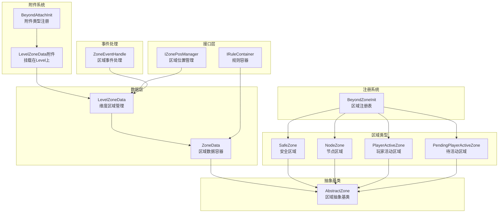
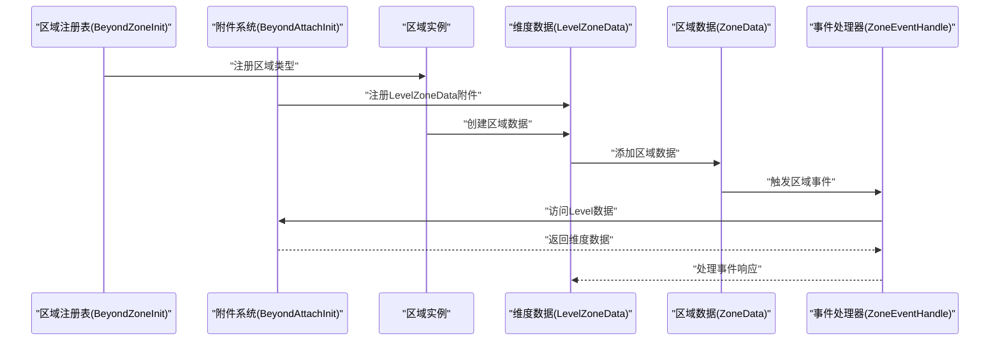
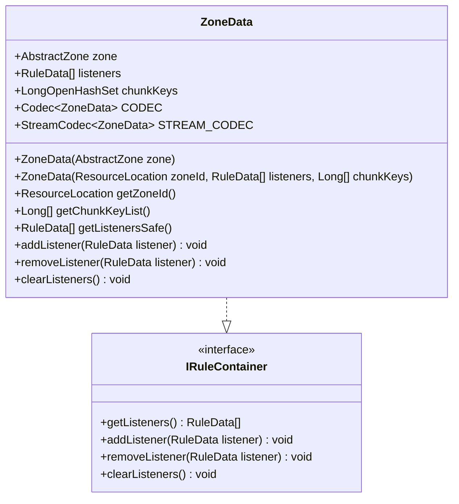
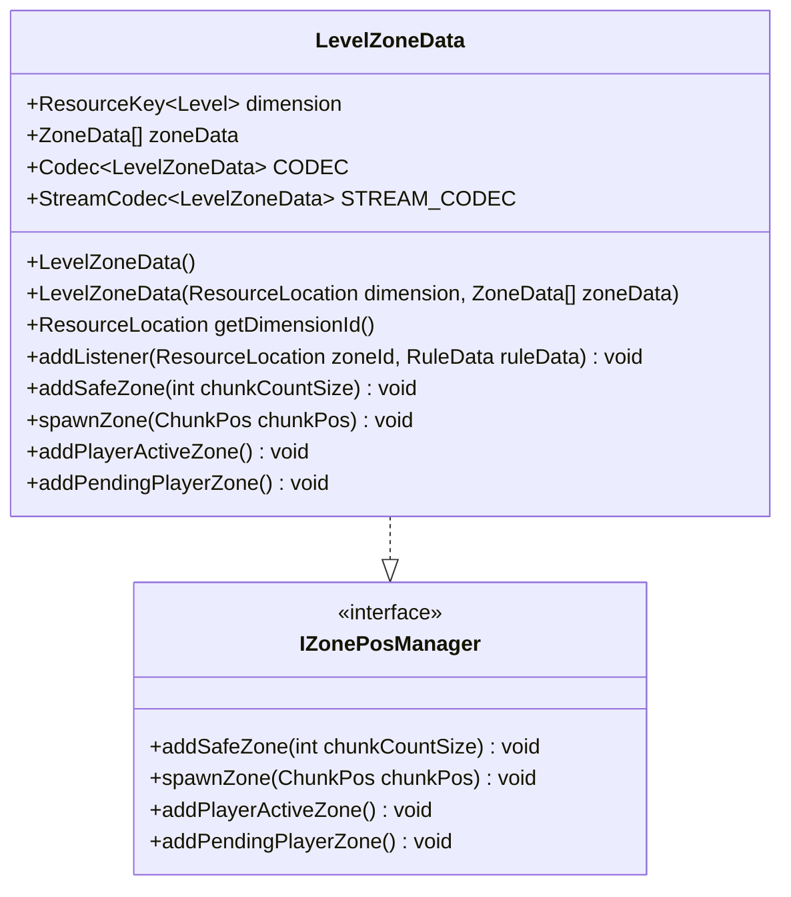
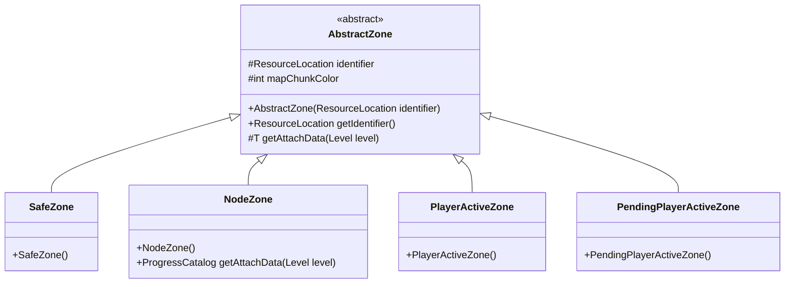
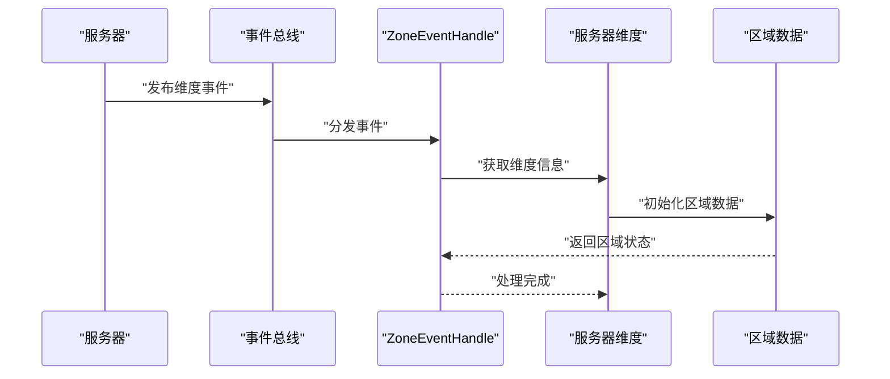
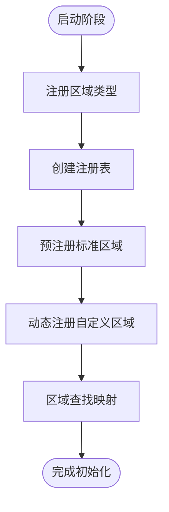
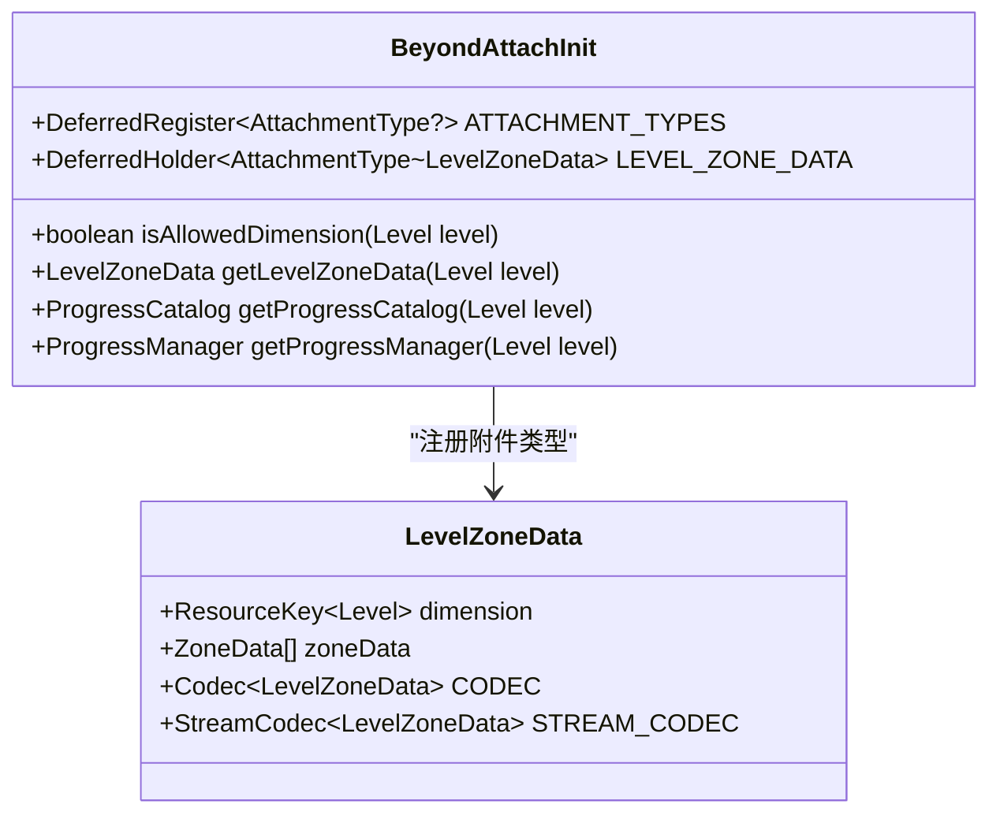
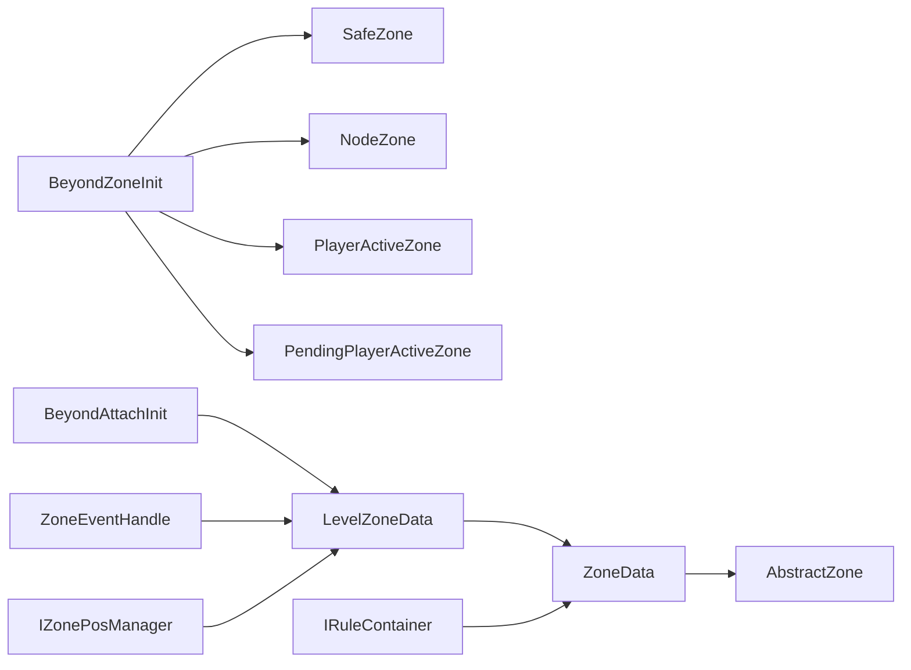

# 安全区数据模型

<cite>
**本文档引用的文件**
- [ZoneData.java](file://Beyond/src/main/java/com/pz/beyond/api/system/zone/ZoneData.java)
- [LevelZoneData.java](file://Beyond/src/main/java/com/pz/beyond/api/system/zone/LevelZoneData.java)
- [SafeZone.java](file://Beyond/src/main/java/com/pz/beyond/api/system/zone/zones/SafeZone.java)
- [AbstractZone.java](file://Beyond/src/main/java/com/pz/beyond/api/system/zone/AbstractZone.java)
- [BeyondZoneInit.java](file://Beyond/src/main/java/com/pz/beyond/api/init/BeyondZoneInit.java)
- [BeyondAttachInit.java](file://Beyond/src/main/java/com/pz/beyond/api/init/BeyondAttachInit.java)
- [IZonePosManager.java](file://Beyond/src/main/java/com/pz/beyond/api/system/zone/core/IZonePosManager.java)
- [IRuleContainer.java](file://Beyond/src/main/java/com/pz/beyond/api/system/zone/core/IRuleContainer.java)
- [ZoneEventHandle.java](file://Beyond/src/main/java/com/pz/beyond/api/event/handle/ZoneEventHandle.java)
- [NodeZone.java](file://Beyond/src/main/java/com/pz/beyond/api/system/zone/zones/NodeZone.java)
- [PendingPlayerActiveZone.java](file://Beyond/src/main/java/com/pz/beyond/api/system/zone/zones/PendingPlayerActiveZone.java)
- [PlayerActiveZone.java](file://Beyond/src/main/java/com/pz/beyond/api/system/zone/zones/PlayerActiveZone.java)
</cite>

## 更新摘要
**所做更改**
- 新增NeoForged附件框架集成，替代旧的SaveLevelData系统
- 更新区域数据持久化机制，采用LevelZoneData附件类型
- 重构区域注册系统，使用现代NeoForged注册表API
- 增强序列化能力，支持更灵活的网络传输格式
- 更新区域事件处理系统，集成附件数据访问

## 目录
1. [简介](#简介)
2. [项目结构](#项目结构)
3. [核心组件](#核心组件)
4. [架构总览](#架构总览)
5. [详细组件分析](#详细组件分析)
6. [附件系统集成](#附件系统集成)
7. [依赖分析](#依赖分析)
8. [性能考虑](#性能考虑)
9. [故障排查指南](#故障排查指南)
10. [结论](#结论)
11. [附录](#附录)

## 简介
本文档系统性阐述"区域数据模型"的新架构设计与实现，重点反映Applied Changes中的重大改进：
- **附件系统集成**：采用NeoForged现代附件框架替代旧的SaveLevelData系统
- **节点数据重组**：重新设计区域数据结构，支持更灵活的节点数据管理
- **增强序列化能力**：提供更强大的序列化和网络传输机制
- **现代化注册系统**：使用NeoForged注册表API构建区域注册表

涵盖以下主题：
- ZoneData 和 LevelZoneData 数据结构的设计、字段语义与区域管理
- 多种区域类型的几何定义、参数配置和验证机制
- 附件驱动的区域数据持久化和访问机制
- 序列化、反序列化与网络传输格式
- 区域创建、修改、删除的操作接口与使用示例
- 数据一致性、缓存失效与性能优化
- 数据迁移、版本兼容与错误恢复方案

## 项目结构
围绕新区域管理系统的核心模块分布如下：
- **数据层**：ZoneData（区域数据容器）、LevelZoneData（维度区域管理）
- **附件系统**：BeyondAttachInit（附件类型注册）、LevelZoneData附件
- **区域类型**：SafeZone、NodeZone、PlayerActiveZone、PendingPlayerActiveZone
- **注册系统**：BeyondZoneInit（区域注册表，基于NeoForged）
- **接口层**：IZonePosManager（区域位置管理）、IRuleContainer（规则容器）
- **事件处理**：ZoneEventHandle（区域事件监听）
- **抽象基类**：AbstractZone（区域抽象基类）

**图表来源**
- [ZoneData.java:21-124](file://Beyond/src/main/java/com/pz/beyond/api/system/zone/ZoneData.java#L21-L124)
- [LevelZoneData.java:23-87](file://Beyond/src/main/java/com/pz/beyond/api/system/zone/LevelZoneData.java#L23-L87)
- [BeyondAttachInit.java:18-63](file://Beyond/src/main/java/com/pz/beyond/api/init/BeyondAttachInit.java#L18-L63)
- [SafeZone.java:10-18](file://Beyond/src/main/java/com/pz/beyond/api/system/zone/zones/SafeZone.java#L10-L18)
- [BeyondZoneInit.java:19-64](file://Beyond/src/main/java/com/pz/beyond/api/init/BeyondZoneInit.java#L19-L64)
- [IZonePosManager.java:5-39](file://Beyond/src/main/java/com/pz/beyond/api/system/zone/core/IZonePosManager.java#L5-L39)
- [IRuleContainer.java:7-16](file://Beyond/src/main/java/com/pz/beyond/api/system/zone/core/IRuleContainer.java#L7-L16)
- [ZoneEventHandle.java:14-43](file://Beyond/src/main/java/com/pz/beyond/api/event/handle/ZoneEventHandle.java#L14-L43)
- [AbstractZone.java:15-42](file://Beyond/src/main/java/com/pz/beyond/api/system/zone/AbstractZone.java#L15-L42)

**章节来源**
- [ZoneData.java:21-124](file://Beyond/src/main/java/com/pz/beyond/api/system/zone/ZoneData.java#L21-L124)
- [LevelZoneData.java:23-87](file://Beyond/src/main/java/com/pz/beyond/api/system/zone/LevelZoneData.java#L23-L87)
- [BeyondAttachInit.java:18-63](file://Beyond/src/main/java/com/pz/beyond/api/init/BeyondAttachInit.java#L18-L63)
- [BeyondZoneInit.java:19-64](file://Beyond/src/main/java/com/pz/beyond/api/init/BeyondZoneInit.java#L19-L64)

## 核心组件
- **ZoneData**：区域数据容器，封装区域对象、规则监听器列表和区块键集合，支持Mojang序列化和StreamCodec网络传输
- **LevelZoneData**：维度区域管理器，管理特定维度内的所有区域数据，通过NeoForged附件系统持久化
- **BeyondAttachInit**：附件系统初始化器，注册LevelZoneData附件类型，提供维度数据访问接口
- **SafeZone**：安全区域实现，继承AbstractZone，标识符为"safe_zone"
- **BeyondZoneInit**：区域注册系统，基于NeoForged注册表API，提供区域注册表和查找机制
- **IZonePosManager**：区域位置管理接口，定义区域操作方法
- **IRuleContainer**：规则容器接口，管理区域规则监听器
- **ZoneEventHandle**：区域事件处理器，监听维度加载、区块加载等事件

**章节来源**
- [ZoneData.java:21-124](file://Beyond/src/main/java/com/pz/beyond/api/system/zone/ZoneData.java#L21-L124)
- [LevelZoneData.java:23-87](file://Beyond/src/main/java/com/pz/beyond/api/system/zone/LevelZoneData.java#L23-L87)
- [BeyondAttachInit.java:18-63](file://Beyond/src/main/java/com/pz/beyond/api/init/BeyondAttachInit.java#L18-L63)
- [SafeZone.java:10-18](file://Beyond/src/main/java/com/pz/beyond/api/system/zone/zones/SafeZone.java#L10-L18)
- [BeyondZoneInit.java:19-64](file://Beyond/src/main/java/com/pz/beyond/api/init/BeyondZoneInit.java#L19-L64)
- [IZonePosManager.java:5-39](file://Beyond/src/main/java/com/pz/beyond/api/system/zone/core/IZonePosManager.java#L5-L39)
- [IRuleContainer.java:7-16](file://Beyond/src/main/java/com/pz/beyond/api/system/zone/core/IRuleContainer.java#L7-L16)
- [ZoneEventHandle.java:14-43](file://Beyond/src/main/java/com/pz/beyond/api/event/handle/ZoneEventHandle.java#L14-L43)

## 架构总览
下图展示新区域管理系统的完整架构，从区域注册到事件处理的关键交互路径，重点体现附件系统的集成。

**图表来源**
- [BeyondZoneInit.java:40-64](file://Beyond/src/main/java/com/pz/beyond/api/init/BeyondZoneInit.java#L40-L64)
- [BeyondAttachInit.java:50-61](file://Beyond/src/main/java/com/pz/beyond/api/init/BeyondAttachInit.java#L50-L61)
- [LevelZoneData.java:42-55](file://Beyond/src/main/java/com/pz/beyond/api/system/zone/LevelZoneData.java#L42-L55)
- [ZoneData.java:77-93](file://Beyond/src/main/java/com/pz/beyond/api/system/zone/ZoneData.java#L77-L93)
- [ZoneEventHandle.java:17-41](file://Beyond/src/main/java/com/pz/beyond/api/event/handle/ZoneEventHandle.java#L17-L41)

## 详细组件分析

### ZoneData 数据结构与区域管理
- **字段与语义**
  - `zone`：AbstractZone实例，表示具体的区域类型
  - `listeners`：RuleData列表，存储区域规则监听器
  - `chunkKeys`：LongOpenHashSet，存储区块键集合
- **序列化机制**
  - 使用RecordCodecBuilder创建Mojang序列化Codec
  - 支持zoneId、listeners、chunkKeys字段的序列化
  - 提供StreamCodec用于网络传输编码，包含自定义AbstractZone序列化
- **规则容器功能**
  - 实现IRuleContainer接口
  - 提供addListener、removeListener、clearListeners方法
- **区域标识管理**
  - getZoneId()方法通过BeyondZoneInit.getZoneId()返回ResourceLocation标识符
  - 通过BeyondZoneInit.getZoneById()进行区域查找

**图表来源**
- [ZoneData.java:21-124](file://Beyond/src/main/java/com/pz/beyond/api/system/zone/ZoneData.java#L21-L124)
- [IRuleContainer.java:7-16](file://Beyond/src/main/java/com/pz/beyond/api/system/zone/core/IRuleContainer.java#L7-L16)

**章节来源**
- [ZoneData.java:21-124](file://Beyond/src/main/java/com/pz/beyond/api/system/zone/ZoneData.java#L21-L124)
- [IRuleContainer.java:7-16](file://Beyond/src/main/java/com/pz/beyond/api/system/zone/core/IRuleContainer.java#L7-L16)

### LevelZoneData 维度区域管理
- **字段与语义**
  - `dimension`：ResourceKey<Level>，表示维度标识
  - `zoneData`：List<ZoneData>，存储该维度的所有区域数据
- **序列化机制**
  - 使用RecordCodecBuilder创建维度序列化Codec
  - 支持dimension和zone_data字段的序列化
  - 提供StreamCodec用于网络传输编码
- **接口实现**
  - 实现IZonePosManager接口
  - 当前方法为占位实现，预留区域操作功能
- **维度管理**
  - 提供dimensionId的ResourceLocation转换
  - 支持区域数据的添加和管理

**图表来源**
- [LevelZoneData.java:23-87](file://Beyond/src/main/java/com/pz/beyond/api/system/zone/LevelZoneData.java#L23-L87)
- [IZonePosManager.java:5-39](file://Beyond/src/main/java/com/pz/beyond/api/system/zone/core/IZonePosManager.java#L5-L39)

**章节来源**
- [LevelZoneData.java:23-87](file://Beyond/src/main/java/com/pz/beyond/api/system/zone/LevelZoneData.java#L23-L87)
- [IZonePosManager.java:5-39](file://Beyond/src/main/java/com/pz/beyond/api/system/zone/core/IZonePosManager.java#L5-L39)

### 区域类型系统
- **AbstractZone 抽象基类**
  - 提供ResourceLocation identifier标识符
  - 定义mapChunkColor默认颜色值
  - 提供getIdentifier()方法
  - 支持泛型T的附加数据类型
- **具体区域实现**
  - SafeZone：安全区域，标识符为"safe_zone"
  - NodeZone：节点区域，关联进度目录数据
  - PlayerActiveZone：玩家活动区域
  - PendingPlayerActiveZone：待活动区域
- **区域注册系统**
  - BeyondZoneInit提供区域注册表
  - 支持区域注册、查找和ID映射
  - 提供EMPTY空区域常量

**图表来源**
- [AbstractZone.java:15-42](file://Beyond/src/main/java/com/pz/beyond/api/system/zone/AbstractZone.java#L15-L42)
- [SafeZone.java:10-18](file://Beyond/src/main/java/com/pz/beyond/api/system/zone/zones/SafeZone.java#L10-L18)
- [NodeZone.java:13-26](file://Beyond/src/main/java/com/pz/beyond/api/system/zone/zones/NodeZone.java#L13-L26)
- [PlayerActiveZone.java:1](file://Beyond/src/main/java/com/pz/beyond/api/system/zone/zones/PlayerActiveZone.java#L1-L100)
- [PendingPlayerActiveZone.java:10-18](file://Beyond/src/main/java/com/pz/beyond/api/system/zone/zones/PendingPlayerActiveZone.java#L10-L18)

**章节来源**
- [AbstractZone.java:15-42](file://Beyond/src/main/java/com/pz/beyond/api/system/zone/AbstractZone.java#L15-L42)
- [SafeZone.java:10-18](file://Beyond/src/main/java/com/pz/beyond/api/system/zone/zones/SafeZone.java#L10-L18)
- [NodeZone.java:13-26](file://Beyond/src/main/java/com/pz/beyond/api/system/zone/zones/NodeZone.java#L13-L26)
- [BeyondZoneInit.java:19-64](file://Beyond/src/main/java/com/pz/beyond/api/init/BeyondZoneInit.java#L19-L64)

### 区域事件处理系统
- **ZoneEventHandle 事件处理器**
  - 监听LevelTickEvent、LevelEvent.Load、ChunkEvent.Load事件
  - 仅处理服务器端维度事件
  - 提供区域数据初始化和更新的事件处理框架
- **事件处理流程**
  - 维度加载时触发区域初始化
  - 区块加载时触发区域数据更新
  - 每个维度tick时进行区域状态检查

**图表来源**
- [ZoneEventHandle.java:14-43](file://Beyond/src/main/java/com/pz/beyond/api/event/handle/ZoneEventHandle.java#L14-L43)

**章节来源**
- [ZoneEventHandle.java:14-43](file://Beyond/src/main/java/com/pz/beyond/api/event/handle/ZoneEventHandle.java#L14-L43)

### 区域注册与初始化机制
- **BeyondZoneInit 注册系统**
  - 创建基于ResourceKey的Registry<AbstractZone>
  - 使用RegistryBuilder创建NeoForged注册表
  - 提供SAFE_ZONE、PLAYER_ACTIVE_ZONE等预注册区域
  - 支持动态区域注册registerZone()方法
  - 提供getZoneById()和getZoneId()查找映射
- **区域注册流程**
  - 使用DeferredRegister进行延迟注册
  - 通过NewRegistryEvent注册到Forge注册表系统
  - 支持区域ID到实例的双向映射

**图表来源**
- [BeyondZoneInit.java:40-64](file://Beyond/src/main/java/com/pz/beyond/api/init/BeyondZoneInit.java#L40-L64)

**章节来源**
- [BeyondZoneInit.java:19-64](file://Beyond/src/main/java/com/pz/beyond/api/init/BeyondZoneInit.java#L19-L64)

## 附件系统集成

### LevelZoneData附件类型
- **附件注册**
  - 通过BeyondAttachInit.register()注册LevelZoneData附件类型
  - 使用AttachmentType.builder()创建附件类型
  - 支持serialize()和sync()方法配置序列化和网络同步
- **维度白名单**
  - 仅允许指定维度（如主世界）挂载LevelZoneData附件
  - 通过isAllowedDimension()方法验证维度权限
- **数据访问接口**
  - getLevelZoneData()提供LevelZoneData数据访问
  - 自动处理非允许维度的null返回
  - 集成到NeoForged附件系统，支持数据持久化

**图表来源**
- [BeyondAttachInit.java:18-63](file://Beyond/src/main/java/com/pz/beyond/api/init/BeyondAttachInit.java#L18-L63)
- [LevelZoneData.java:23-87](file://Beyond/src/main/java/com/pz/beyond/api/system/zone/LevelZoneData.java#L23-L87)

**章节来源**
- [BeyondAttachInit.java:18-63](file://Beyond/src/main/java/com/pz/beyond/api/init/BeyondAttachInit.java#L18-L63)
- [LevelZoneData.java:23-87](file://Beyond/src/main/java/com/pz/beyond/api/system/zone/LevelZoneData.java#L23-L87)

### 附件数据持久化
- **序列化配置**
  - LevelZoneData.CODEC用于Mojang序列化框架
  - LevelZoneData.STREAM_CODEC用于网络传输编码
  - 支持完整的数据持久化和网络同步
- **维度数据管理**
  - 按维度隔离区域数据，避免跨维度数据污染
  - 支持多维度同时运行的区域管理
  - 自动处理维度切换时的数据迁移

**章节来源**
- [BeyondAttachInit.java:50-61](file://Beyond/src/main/java/com/pz/beyond/api/init/BeyondAttachInit.java#L50-L61)
- [LevelZoneData.java:29-40](file://Beyond/src/main/java/com/pz/beyond/api/system/zone/LevelZoneData.java#L29-L40)

## 依赖分析
- **组件耦合**
  - ZoneData依赖AbstractZone和RuleData
  - LevelZoneData依赖ZoneData和维度系统
  - BeyondZoneInit提供区域注册和查找服务
  - BeyondAttachInit提供附件类型注册和数据访问
  - ZoneEventHandle依赖事件系统和区域数据
- **外部依赖**
  - Mojang序列化框架（Codec、StreamCodec）
  - NeoForged注册系统（DeferredRegister、RegistryBuilder）
  - NeoForged附件系统（AttachmentType、RegistryFriendlyByteBuf）
  - FastUtil集合库（LongOpenHashSet）

**图表来源**
- [BeyondZoneInit.java:28-50](file://Beyond/src/main/java/com/pz/beyond/api/init/BeyondZoneInit.java#L28-L50)
- [BeyondAttachInit.java:50-61](file://Beyond/src/main/java/com/pz/beyond/api/init/BeyondAttachInit.java#L50-L61)
- [ZoneData.java:28-30](file://Beyond/src/main/java/com/pz/beyond/api/system/zone/ZoneData.java#L28-L30)
- [LevelZoneData.java:42-44](file://Beyond/src/main/java/com/pz/beyond/api/system/zone/LevelZoneData.java#L42-L44)
- [ZoneEventHandle.java:17-41](file://Beyond/src/main/java/com/pz/beyond/api/event/handle/ZoneEventHandle.java#L17-L41)

**章节来源**
- [BeyondZoneInit.java:28-50](file://Beyond/src/main/java/com/pz/beyond/api/init/BeyondZoneInit.java#L28-L50)
- [BeyondAttachInit.java:50-61](file://Beyond/src/main/java/com/pz/beyond/api/init/BeyondAttachInit.java#L50-L61)
- [ZoneData.java:28-30](file://Beyond/src/main/java/com/pz/beyond/api/system/zone/ZoneData.java#L28-L30)
- [LevelZoneData.java:42-44](file://Beyond/src/main/java/com/pz/beyond/api/system/zone/LevelZoneData.java#L42-L44)
- [ZoneEventHandle.java:17-41](file://Beyond/src/main/java/com/pz/beyond/api/event/handle/ZoneEventHandle.java#L17-L41)

## 性能考虑
- **序列化优化**
  - 使用RecordCodecBuilder提供高效的Mojang序列化
  - StreamCodec用于网络传输的二进制编码
  - LongOpenHashSet提供高性能的区块键存储
- **附件系统优势**
  - NeoForged附件系统提供更好的性能和内存管理
  - 自动处理数据生命周期和内存回收
  - 支持增量更新和懒加载机制
- **内存管理**
  - ZoneData使用volatile关键字确保多线程安全
  - chunkKeys使用FastUtil集合减少内存开销
  - 懒加载模式支持区域数据的按需初始化
- **事件处理**
  - 事件处理器仅在服务器端运行，避免客户端开销
  - 区域事件按维度隔离，减少不必要的事件传播
- **扩展性**
  - 泛型设计支持不同类型的区域数据
  - 接口分离提供良好的可扩展性

## 故障排查指南
- **区域注册失败**
  - 检查BeyondZoneInit的注册表创建和事件处理
  - 确认区域ID唯一性和ResourceLocation格式
  - 验证NeoForged注册表系统的正确初始化
- **附件系统问题**
  - 检查BeyondAttachInit的附件类型注册
  - 确认维度白名单配置正确
  - 验证LevelZoneData附件的serialize和sync配置
- **区域数据序列化错误**
  - 验证Codec和StreamCodec的字段映射
  - 检查RuleData的序列化兼容性
  - 确认AbstractZone的自定义序列化实现
- **事件处理异常**
  - 确认ZoneEventHandle的@EventBusSubscriber注解
  - 检查服务器维度的事件订阅状态
  - 验证附件数据的正确访问
- **区域查找失败**
  - 验证getZoneById()方法的ID映射
  - 检查EMPTY区域的回退机制
  - 确认区域注册表的正确初始化

**章节来源**
- [BeyondZoneInit.java:40-64](file://Beyond/src/main/java/com/pz/beyond/api/init/BeyondZoneInit.java#L40-L64)
- [BeyondAttachInit.java:50-61](file://Beyond/src/main/java/com/pz/beyond/api/init/BeyondAttachInit.java#L50-L61)
- [ZoneData.java:32-75](file://Beyond/src/main/java/com/pz/beyond/api/system/zone/ZoneData.java#L32-L75)
- [ZoneEventHandle.java:17-41](file://Beyond/src/main/java/com/pz/beyond/api/event/handle/ZoneEventHandle.java#L17-L41)

## 结论
新区域数据模型以ZoneData和LevelZoneData为核心，通过NeoForged附件系统实现了高度模块化的区域管理架构。该系统相比原有架构在多个方面都有显著改进：

**主要改进**：
- **现代化架构**：采用NeoForged附件框架替代旧的SaveLevelData系统
- **增强性能**：附件系统提供更好的内存管理和性能优化
- **简化API**：通过附件系统自动处理数据持久化和访问
- **扩展性强**：基于NeoForged注册表API，支持动态区域注册

**技术优势**：
- 附件系统集成提供自动化的数据持久化机制
- NeoForged注册表API提供更好的类型安全和性能
- 增强的序列化能力支持复杂的网络传输需求
- 更好的错误处理和回退机制

相比原有SafeZoneData模型，新架构在扩展性、性能、可维护性和现代化程度方面都有显著提升，为游戏中的区域功能提供了更加稳健和高效的基础设施。

## 附录

### 数据一致性与缓存失效
- **一致性保证**
  - ZoneData使用Mojang序列化确保数据持久化一致性
  - LevelZoneData通过附件系统提供维度级别的数据隔离
  - BeyondZoneInit维护区域ID到实例的强一致性映射
  - NeoForged附件系统确保数据的原子性和一致性
- **缓存策略**
  - 区域实例缓存在注册表中，避免重复创建
  - 区域数据按维度缓存，支持快速查找
  - 附件数据自动缓存，减少重复访问开销
  - 事件处理器缓存维度状态，减少重复计算

**章节来源**
- [ZoneData.java:32-75](file://Beyond/src/main/java/com/pz/beyond/api/system/zone/ZoneData.java#L32-L75)
- [LevelZoneData.java:29-40](file://Beyond/src/main/java/com/pz/beyond/api/system/zone/LevelZoneData.java#L29-L40)
- [BeyondZoneInit.java:52-62](file://Beyond/src/main/java/com/pz/beyond/api/init/BeyondZoneInit.java#L52-L62)
- [BeyondAttachInit.java:50-61](file://Beyond/src/main/java/com/pz/beyond/api/init/BeyondAttachInit.java#L50-L61)

### 版本兼容与迁移
- **序列化兼容**
  - 保持ZoneData和LevelZoneData的字段名称稳定
  - StreamCodec提供向后兼容的网络协议
  - Codec支持版本演进的数据格式
  - 附件系统提供向后兼容的数据迁移路径
- **区域类型扩展**
  - 通过BeyondZoneInit.registerZone()支持动态区域注册
  - AbstractZone基类支持新的区域类型继承
  - IRuleContainer接口提供规则系统的扩展点
- **迁移路径**
  - SafeZoneData到ZoneData的字段映射
  - SaveLevelData到LevelZoneData的附件迁移
  - 事件处理系统的升级路径
  - 注册表系统的NeoForged迁移

**章节来源**
- [ZoneData.java:32-75](file://Beyond/src/main/java/com/pz/beyond/api/system/zone/ZoneData.java#L32-L75)
- [LevelZoneData.java:29-40](file://Beyond/src/main/java/com/pz/beyond/api/system/zone/LevelZoneData.java#L29-L40)
- [BeyondZoneInit.java:48-50](file://Beyond/src/main/java/com/pz/beyond/api/init/BeyondZoneInit.java#L48-L50)
- [BeyondAttachInit.java:50-61](file://Beyond/src/main/java/com/pz/beyond/api/init/BeyondAttachInit.java#L50-L61)

### 错误恢复
- **注册失败恢复**
  - BeyondZoneInit提供EMPTY区域作为回退选项
  - 区域查找失败时自动使用EMPTY区域
  - 注册表重建支持系统重启后的数据恢复
  - NeoForged注册表系统的自动恢复机制
- **附件系统错误**
  - 附件类型注册失败时的回退处理
  - 数据访问异常的自动重试机制
  - 维度权限检查的错误处理
- **数据序列化错误**
  - Codec提供字段缺失的默认值处理
  - StreamCodec支持部分字段的兼容性处理
  - 序列化异常时提供详细的错误信息
- **事件处理异常**
  - ZoneEventHandle使用try-catch防护
  - 事件处理失败不影响其他维度的正常运行
  - 异常日志记录支持问题诊断和修复
  - 附件数据访问的异常处理

**章节来源**
- [BeyondZoneInit.java:52-58](file://Beyond/src/main/java/com/pz/beyond/api/init/BeyondZoneInit.java#L52-L58)
- [BeyondAttachInit.java:89-118](file://Beyond/src/main/java/com/pz/beyond/api/init/BeyondAttachInit.java#L89-L118)
- [ZoneData.java:32-75](file://Beyond/src/main/java/com/pz/beyond/api/system/zone/ZoneData.java#L32-L75)
- [ZoneEventHandle.java:17-41](file://Beyond/src/main/java/com/pz/beyond/api/event/handle/ZoneEventHandle.java#L17-L41)