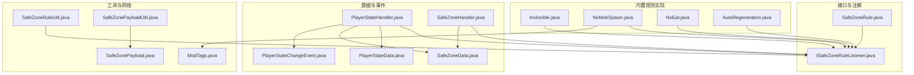
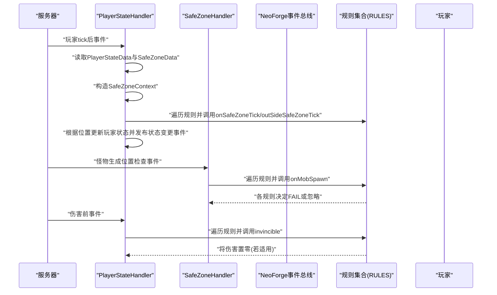
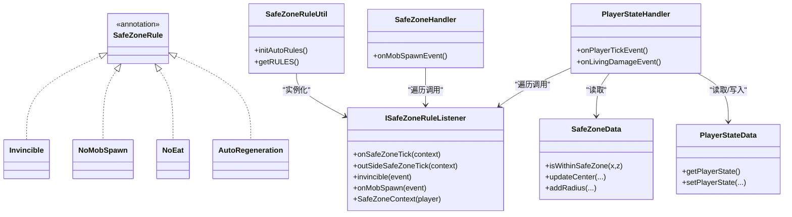
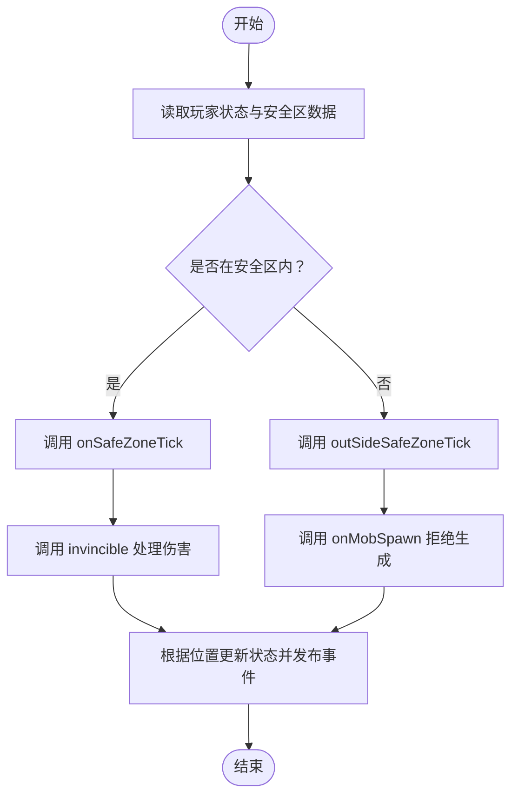

# 安全区规则系统

<cite>
**本文引用的文件**
- [ISafeZoneRuleListener.java](file://Beyond/src/main/java/com/pz/beyond/safeZoneRule/ISafeZoneRuleListener.java)
- [SafeZoneRule.java](file://Beyond/src/main/java/com/pz/beyond/safeZoneRule/SafeZoneRule.java)
- [Invincible.java](file://Beyond/src/main/java/com/pz/beyond/safeZoneRule/impl/Invincible.java)
- [NoMobSpawn.java](file://Beyond/src/main/java/com/pz/beyond/safeZoneRule/impl/NoMobSpawn.java)
- [NoEat.java](file://Beyond/src/main/java/com/pz/beyond/safeZoneRule/impl/NoEat.java)
- [AutoRegeneration.java](file://Beyond/src/main/java/com/pz/beyond/safeZoneRule/impl/AutoRegeneration.java)
- [PlayerStateData.java](file://Beyond/src/main/java/com/pz/beyond/data/PlayerStateData.java)
- [SafeZoneData.java](file://Beyond/src/main/java/com/pz/beyond/data/SafeZoneData.java)
- [SafeZoneHandler.java](file://Beyond/src/main/java/com/pz/beyond/event/SafeZoneHandler.java)
- [PlayerStateHandler.java](file://Beyond/src/main/java/com/pz/beyond/event/PlayerStateHandler.java)
- [PlayerStateChangeEvent.java](file://Beyond/src/main/java/com/pz/beyond/event/custom/PlayerStateChangeEvent.java)
- [ModTags.java](file://Beyond/src/main/java/com/pz/beyond/registry/ModTags.java)
- [SafeZoneRuleUtil.java](file://Beyond/src/main/java/com/pz/beyond/util/SafeZoneRuleUtil.java)
- [SafeZonePayload.java](file://Beyond/src/main/java/com/pz/beyond/network/SafeZonePayload.java)
- [SafeZonePayloadUtil.java](file://Beyond/src/main/java/com/pz/beyond/util/SafeZonePayloadUtil.java)
</cite>

## 目录
1. [简介](#简介)
2. [项目结构](#项目结构)
3. [核心组件](#核心组件)
4. [架构总览](#架构总览)
5. [详细组件分析](#详细组件分析)
6. [依赖分析](#依赖分析)
7. [性能考虑](#性能考虑)
8. [故障排查指南](#故障排查指南)
9. [结论](#结论)
10. [附录](#附录)

## 简介
本文件系统性阐述“安全区规则系统”的设计与实现，重点包括：
- ISafeZoneRuleListener 接口的设计理念与事件回调机制
- 四大内置规则的工作原理、触发条件与效果实现：无敌（Invincible）、禁止怪物生成（NoMobSpawn）、禁止进食（NoEat）、自动恢复（AutoRegeneration）
- SafeZoneContext 上下文的作用与传递机制
- 自定义安全区规则的开发指南与最佳实践
- 规则优先级、冲突处理与性能优化建议

## 项目结构
安全区规则系统位于 Beyond 模块中，采用“事件驱动 + 规则插件化”的架构：
- 接口层：ISafeZoneRuleListener 定义规则回调契约
- 注解层：@SafeZoneRule 用于自动发现与注册规则实现
- 实现层：四大内置规则分别处理伤害、怪物生成、玩家状态下的定时效果等
- 数据层：SafeZoneData、PlayerStateData 存储安全区几何信息与玩家状态
- 事件层：PlayerStateHandler、SafeZoneHandler 负责事件订阅与规则调度
- 工具层：SafeZoneRuleUtil 提供基于注解扫描的自动装配；SafeZonePayloadUtil 负责网络同步
- 网络层：SafeZonePayload 传输安全区参数

图表来源
- [ISafeZoneRuleListener.java:1-42](file://Beyond/src/main/java/com/pz/beyond/safeZoneRule/ISafeZoneRuleListener.java#L1-L42)
- [SafeZoneRule.java:1-12](file://Beyond/src/main/java/com/pz/beyond/safeZoneRule/SafeZoneRule.java#L1-L12)
- [Invincible.java:1-23](file://Beyond/src/main/java/com/pz/beyond/safeZoneRule/impl/Invincible.java#L1-L23)
- [NoMobSpawn.java:1-29](file://Beyond/src/main/java/com/pz/beyond/safeZoneRule/impl/NoMobSpawn.java#L1-L29)
- [NoEat.java:1-23](file://Beyond/src/main/java/com/pz/beyond/safeZoneRule/impl/NoEat.java#L1-L23)
- [AutoRegeneration.java:1-18](file://Beyond/src/main/java/com/pz/beyond/safeZoneRule/impl/AutoRegeneration.java#L1-L18)
- [PlayerStateData.java:1-65](file://Beyond/src/main/java/com/pz/beyond/data/PlayerStateData.java#L1-L65)
- [SafeZoneData.java:1-101](file://Beyond/src/main/java/com/pz/beyond/data/SafeZoneData.java#L1-L101)
- [PlayerStateHandler.java:1-80](file://Beyond/src/main/java/com/pz/beyond/event/PlayerStateHandler.java#L1-L80)
- [SafeZoneHandler.java:1-77](file://Beyond/src/main/java/com/pz/beyond/event/SafeZoneHandler.java#L1-L77)
- [PlayerStateChangeEvent.java:1-70](file://Beyond/src/main/java/com/pz/beyond/event/custom/PlayerStateChangeEvent.java#L1-L70)
- [SafeZoneRuleUtil.java:1-54](file://Beyond/src/main/java/com/pz/beyond/util/SafeZoneRuleUtil.java#L1-L54)
- [SafeZonePayloadUtil.java:1-32](file://Beyond/src/main/java/com/pz/beyond/util/SafeZonePayloadUtil.java#L1-L32)
- [SafeZonePayload.java:1-31](file://Beyond/src/main/java/com/pz/beyond/network/SafeZonePayload.java#L1-L31)
- [ModTags.java:1-17](file://Beyond/src/main/java/com/pz/beyond/registry/ModTags.java#L1-L17)

章节来源
- [ISafeZoneRuleListener.java:1-42](file://Beyond/src/main/java/com/pz/beyond/safeZoneRule/ISafeZoneRuleListener.java#L1-L42)
- [SafeZoneRule.java:1-12](file://Beyond/src/main/java/com/pz/beyond/safeZoneRule/SafeZoneRule.java#L1-L12)
- [PlayerStateHandler.java:1-80](file://Beyond/src/main/java/com/pz/beyond/event/PlayerStateHandler.java#L1-L80)
- [SafeZoneHandler.java:1-77](file://Beyond/src/main/java/com/pz/beyond/event/SafeZoneHandler.java#L1-L77)
- [SafeZoneRuleUtil.java:1-54](file://Beyond/src/main/java/com/pz/beyond/util/SafeZoneRuleUtil.java#L1-L54)

## 核心组件
- ISafeZoneRuleListener：定义安全区规则的统一回调接口，默认方法覆盖 tick、伤害、怪物生成等事件，便于按需实现
- SafeZoneRule：规则实现的注解，配合 SafeZoneRuleUtil 的扫描机制实现自动装配
- SafeZoneContext：轻量级上下文记录，封装当前处理的 ServerPlayer，用于 tick 类规则的统一传参
- PlayerStateData：记录玩家所处状态（在安全区内/在游戏内），驱动规则的激活与切换
- SafeZoneData：保存安全区中心坐标与半径，提供点是否在安全区内的判定
- SafeZoneRuleUtil：基于 NeoForge 扫描 SPI 的注解发现与实例化，构建规则列表
- SafeZoneHandler、PlayerStateHandler：事件订阅者，负责将规则应用到对应事件流
- SafeZonePayload/SafeZonePayloadUtil：网络协议与广播工具，向客户端同步安全区参数

章节来源
- [ISafeZoneRuleListener.java:13-42](file://Beyond/src/main/java/com/pz/beyond/safeZoneRule/ISafeZoneRuleListener.java#L13-L42)
- [SafeZoneRule.java:8-12](file://Beyond/src/main/java/com/pz/beyond/safeZoneRule/SafeZoneRule.java#L8-L12)
- [PlayerStateData.java:13-65](file://Beyond/src/main/java/com/pz/beyond/data/PlayerStateData.java#L13-L65)
- [SafeZoneData.java:16-101](file://Beyond/src/main/java/com/pz/beyond/data/SafeZoneData.java#L16-L101)
- [SafeZoneRuleUtil.java:11-54](file://Beyond/src/main/java/com/pz/beyond/util/SafeZoneRuleUtil.java#L11-L54)
- [SafeZoneHandler.java:35-77](file://Beyond/src/main/java/com/pz/beyond/event/SafeZoneHandler.java#L35-L77)
- [PlayerStateHandler.java:21-80](file://Beyond/src/main/java/com/pz/beyond/event/PlayerStateHandler.java#L21-L80)
- [SafeZonePayloadUtil.java:9-32](file://Beyond/src/main/java/com/pz/beyond/util/SafeZonePayloadUtil.java#L9-L32)
- [SafeZonePayload.java:10-31](file://Beyond/src/main/java/com/pz/beyond/network/SafeZonePayload.java#L10-L31)

## 架构总览
系统以事件为驱动，围绕 PlayerStateData 与 SafeZoneData 两个关键数据进行状态判断与规则分发。规则通过注解自动发现，集中由事件处理器统一调度。

图表来源
- [PlayerStateHandler.java:26-77](file://Beyond/src/main/java/com/pz/beyond/event/PlayerStateHandler.java#L26-L77)
- [SafeZoneHandler.java:70-76](file://Beyond/src/main/java/com/pz/beyond/event/SafeZoneHandler.java#L70-L76)
- [SafeZoneRuleUtil.java:50-52](file://Beyond/src/main/java/com/pz/beyond/util/SafeZoneRuleUtil.java#L50-L52)
- [ISafeZoneRuleListener.java:19-37](file://Beyond/src/main/java/com/pz/beyond/safeZoneRule/ISafeZoneRuleListener.java#L19-L37)

## 详细组件分析

### ISafeZoneRuleListener 接口与 SafeZoneContext
- 设计要点
  - 默认方法提供空实现，避免实现类必须覆盖全部方法
  - 提供 onSafeZoneTick/outSideSafeZoneTick 两类 tick 回调，分别在“在安全区内/在安全区外”时触发
  - 提供 invincible 与 onMobSpawn 两大事件回调，分别处理伤害与怪物生成
  - SafeZoneContext 仅携带 ServerPlayer，保证规则实现对上下文的最小依赖
- 事件流
  - PlayerStateHandler 在每 tick 后根据 PlayerStateData 决定调用哪一类 tick 方法，并传入 SafeZoneContext
  - SafeZoneHandler 在怪物生成事件上遍历规则并调用 onMobSpawn
  - PlayerStateHandler 在伤害事件上遍历规则并调用 invincible

章节来源
- [ISafeZoneRuleListener.java:13-42](file://Beyond/src/main/java/com/pz/beyond/safeZoneRule/ISafeZoneRuleListener.java#L13-L42)
- [PlayerStateHandler.java:26-46](file://Beyond/src/main/java/com/pz/beyond/event/PlayerStateHandler.java#L26-L46)
- [SafeZoneHandler.java:70-76](file://Beyond/src/main/java/com/pz/beyond/event/SafeZoneHandler.java#L70-L76)

### 内置规则一：无敌（Invincible）
- 工作原理
  - 在伤害前事件中，若实体是 ServerPlayer 且其状态为“在安全区内”，则将新伤害设为 0
- 触发条件
  - 实体为玩家；玩家处于 INSIDE_SAFETY_ZONE 状态
- 效果实现
  - 通过修改 LivingDamageEvent.Pre 的新伤害值达到免伤
- 性能与冲突
  - 事件粒度细，开销低；与其他规则并行，互不干扰

章节来源
- [Invincible.java:10-23](file://Beyond/src/main/java/com/pz/beyond/safeZoneRule/impl/Invincible.java#L10-L23)
- [PlayerStateHandler.java:71-77](file://Beyond/src/main/java/com/pz/beyond/event/PlayerStateHandler.java#L71-L77)
- [PlayerStateData.java:46-61](file://Beyond/src/main/java/com/pz/beyond/data/PlayerStateData.java#L46-L61)

### 内置规则二：禁止怪物生成（NoMobSpawn）
- 工作原理
  - 在怪物生成位置检查事件中，读取全局 SafeZoneData，若实体类型被标记为不可在安全区生成，则当坐标在安全区内时拒绝生成
- 触发条件
  - 事件类型为 PositionCheck；实体类型属于 ModTags.NO_SAFE_ZONE_SPAWN 标签
- 效果实现
  - 设置 MobSpawnEvent.PositionCheck.Result.FAIL，阻止生成
- 性能与冲突
  - 仅在生成事件触发，成本极低；与其它规则并行，互不影响

章节来源
- [NoMobSpawn.java:12-29](file://Beyond/src/main/java/com/pz/beyond/safeZoneRule/impl/NoMobSpawn.java#L12-L29)
- [ModTags.java:9-17](file://Beyond/src/main/java/com/pz/beyond/registry/ModTags.java#L9-L17)
- [SafeZoneHandler.java:70-76](file://Beyond/src/main/java/com/pz/beyond/event/SafeZoneHandler.java#L70-L76)
- [SafeZoneData.java:49-57](file://Beyond/src/main/java/com/pz/beyond/data/SafeZoneData.java#L49-L57)

### 内置规则三：禁止进食（NoEat）
- 工作原理
  - 在安全区内 tick 中，每秒（20 tick）重置玩家食物等级与饱和度至最大值
- 触发条件
  - 玩家处于 INSIDE_SAFETY_ZONE 状态
- 效果实现
  - 直接操作 FoodData，维持玩家饥饿与饱和上限
- 性能与冲突
  - 每秒一次，开销很小；与自动恢复规则可叠加

章节来源
- [NoEat.java:10-23](file://Beyond/src/main/java/com/pz/beyond/safeZoneRule/impl/NoEat.java#L10-L23)
- [PlayerStateHandler.java:39-45](file://Beyond/src/main/java/com/pz/beyond/event/PlayerStateHandler.java#L39-L45)

### 内置规则四：自动恢复（AutoRegeneration）
- 工作原理
  - 在安全区内 tick 中，每秒（20 tick）对玩家进行少量治疗
- 触发条件
  - 玩家处于 INSIDE_SAFETY_ZONE 状态
- 效果实现
  - 调用玩家的 heal 方法进行恢复
- 性能与冲突
  - 每秒一次，开销很小；与禁止进食规则可叠加

章节来源
- [AutoRegeneration.java:7-18](file://Beyond/src/main/java/com/pz/beyond/safeZoneRule/impl/AutoRegeneration.java#L7-L18)
- [PlayerStateHandler.java:39-45](file://Beyond/src/main/java/com/pz/beyond/event/PlayerStateHandler.java#L39-L45)

### SafeZoneContext 上下文与传递机制
- 作用
  - 作为 onSafeZoneTick/outSideSafeZoneTick 的统一参数载体，当前实现仅包含 ServerPlayer
- 传递路径
  - PlayerStateHandler 在每 tick 后构造 SafeZoneContext，并依据玩家状态选择调用 onSafeZoneTick 或 outSideSafeZoneTick
- 设计建议
  - 若未来需要扩展上下文（如安全区数据、时间戳等），可在保持向后兼容的前提下增加字段

章节来源
- [ISafeZoneRuleListener.java:39-39](file://Beyond/src/main/java/com/pz/beyond/safeZoneRule/ISafeZoneRuleListener.java#L39-L39)
- [PlayerStateHandler.java:34-45](file://Beyond/src/main/java/com/pz/beyond/event/PlayerStateHandler.java#L34-L45)

### 状态切换与事件广播
- 状态判定
  - 基于 SafeZoneData 的 isWithinSafeZone 判定玩家当前位置是否在安全区内
- 状态切换
  - 当从“在游戏内”进入“在安全区内”或反之，更新 PlayerStateData 并发布 PlayerStateChangeEvent
- 事件用途
  - 允许其他模块监听状态变化，执行额外逻辑（如 UI 提示、音效等）

章节来源
- [PlayerStateHandler.java:52-66](file://Beyond/src/main/java/com/pz/beyond/event/PlayerStateHandler.java#L52-L66)
- [PlayerStateData.java:46-61](file://Beyond/src/main/java/com/pz/beyond/data/PlayerStateData.java#L46-L61)
- [SafeZoneData.java:49-57](file://Beyond/src/main/java/com/pz/beyond/data/SafeZoneData.java#L49-L57)
- [PlayerStateChangeEvent.java:15-70](file://Beyond/src/main/java/com/pz/beyond/event/custom/PlayerStateChangeEvent.java#L15-L70)

### 规则优先级、冲突处理与调度顺序
- 调度顺序
  - SafeZoneHandler 与 PlayerStateHandler 在事件中对 RULES 列表进行线性遍历，依次调用对应回调
- 优先级与冲突
  - 当前未定义显式优先级；由于规则均为副作用型（如设置伤害为 0、拒绝生成），同一事件中多个规则可能同时生效
  - 建议：若未来引入竞争性规则（如多个规则对同一事件产生相反影响），应在规则内部约定冲突解决策略或引入显式优先级排序
- 最佳实践
  - 规则实现应尽量幂等、无副作用或具备可逆性
  - 对于可能相互抵消的效果，建议在规则内部合并或在事件回调中统一裁决

章节来源
- [SafeZoneHandler.java:70-76](file://Beyond/src/main/java/com/pz/beyond/event/SafeZoneHandler.java#L70-L76)
- [PlayerStateHandler.java:39-45](file://Beyond/src/main/java/com/pz/beyond/event/PlayerStateHandler.java#L39-L45)
- [SafeZoneRuleUtil.java:50-52](file://Beyond/src/main/java/com/pz/beyond/util/SafeZoneRuleUtil.java#L50-L52)

### 自定义安全区规则开发指南与最佳实践
- 开发步骤
  - 新建类实现 ISafeZoneRuleListener，并使用 @SafeZoneRule 注解
  - 在需要的回调中实现业务逻辑（如 onSafeZoneTick、invincible、onMobSpawn）
  - 确保规则对事件参数的访问与修改符合预期（如仅对 ServerPlayer 生效）
- 最佳实践
  - 使用默认方法提供空实现，按需覆盖所需回调
  - 在 tick 回调中注意频率控制（如每 20 tick），避免高频操作
  - 在事件回调中避免阻塞或长时间计算，保持响应性
  - 如需跨模块共享状态，通过数据类与事件总线协作，而非直接耦合
- 调试与验证
  - 通过日志输出确认规则被自动发现与实例化
  - 在 PlayerStateHandler 的状态切换处观察事件广播行为

章节来源
- [ISafeZoneRuleListener.java:13-42](file://Beyond/src/main/java/com/pz/beyond/safeZoneRule/ISafeZoneRuleListener.java#L13-L42)
- [SafeZoneRule.java:8-12](file://Beyond/src/main/java/com/pz/beyond/safeZoneRule/SafeZoneRule.java#L8-L12)
- [SafeZoneRuleUtil.java:13-48](file://Beyond/src/main/java/com/pz/beyond/util/SafeZoneRuleUtil.java#L13-L48)

## 依赖分析
- 规则发现与装配
  - SafeZoneRuleUtil 通过扫描所有模组的注解数据，筛选 @SafeZoneRule 类并实例化，形成 RULES 列表
- 事件订阅与分发
  - PlayerStateHandler 订阅 PlayerTickEvent 与 LivingDamageEvent，按状态分派 tick 与伤害处理
  - SafeZoneHandler 订阅 MobSpawnEvent.PositionCheck，统一调用规则的 onMobSpawn
- 数据与网络
  - SafeZoneData 保存安全区几何信息；SafeZonePayloadUtil/SafeZonePayload 负责广播与单发同步

图表来源
- [ISafeZoneRuleListener.java:13-42](file://Beyond/src/main/java/com/pz/beyond/safeZoneRule/ISafeZoneRuleListener.java#L13-L42)
- [SafeZoneRule.java:8-12](file://Beyond/src/main/java/com/pz/beyond/safeZoneRule/SafeZoneRule.java#L8-L12)
- [Invincible.java:10-23](file://Beyond/src/main/java/com/pz/beyond/safeZoneRule/impl/Invincible.java#L10-L23)
- [NoMobSpawn.java:12-29](file://Beyond/src/main/java/com/pz/beyond/safeZoneRule/impl/NoMobSpawn.java#L12-L29)
- [NoEat.java:10-23](file://Beyond/src/main/java/com/pz/beyond/safeZoneRule/impl/NoEat.java#L10-L23)
- [AutoRegeneration.java:7-18](file://Beyond/src/main/java/com/pz/beyond/safeZoneRule/impl/AutoRegeneration.java#L7-L18)
- [SafeZoneRuleUtil.java:11-54](file://Beyond/src/main/java/com/pz/beyond/util/SafeZoneRuleUtil.java#L11-L54)
- [PlayerStateHandler.java:21-80](file://Beyond/src/main/java/com/pz/beyond/event/PlayerStateHandler.java#L21-L80)
- [SafeZoneHandler.java:35-77](file://Beyond/src/main/java/com/pz/beyond/event/SafeZoneHandler.java#L35-L77)
- [SafeZoneData.java:16-101](file://Beyond/src/main/java/com/pz/beyond/data/SafeZoneData.java#L16-L101)
- [PlayerStateData.java:13-65](file://Beyond/src/main/java/com/pz/beyond/data/PlayerStateData.java#L13-L65)

## 性能考虑
- 事件频率控制
  - tick 类规则按 20 tick 一次，避免高频操作
  - 伤害与怪物生成事件本身频率较低，规则处理应保持轻量
- 规则数量与遍历
  - RULES 列表为线性遍历，规则数量增长会线性增加每次事件的处理时间
  - 建议限制规则数量或在规则内部快速分支（如按实体类型/状态过滤）
- I/O 与网络
  - SafeZoneData 的读取与 SafeZonePayload 的广播为必要开销，建议仅在数据变更时触发广播
- 并发与线程
  - 所有事件均在服务端主线程处理，避免在规则中执行阻塞操作

[本节为通用性能建议，无需特定文件来源]

## 故障排查指南
- 规则未生效
  - 检查类是否标注 @SafeZoneRule 且实现 ISafeZoneRuleListener
  - 确认 SafeZoneRuleUtil.initAutoRules 是否被调用并成功实例化
- 无敌规则无效
  - 确认玩家状态为 INSIDE_SAFETY_ZONE；检查 LivingDamageEvent.Pre 的实体类型
- 禁止怪物生成无效
  - 确认实体类型已添加到 ModTags.NO_SAFE_ZONE_SPAWN 标签
  - 检查 SafeZoneData 的 isWithinSafeZone 判定结果
- 自动恢复/禁止进食异常
  - 确认玩家处于 INSIDE_SAFETY_ZONE 状态；检查 tick 计数与频率

章节来源
- [SafeZoneRuleUtil.java:13-48](file://Beyond/src/main/java/com/pz/beyond/util/SafeZoneRuleUtil.java#L13-L48)
- [Invincible.java:14-20](file://Beyond/src/main/java/com/pz/beyond/safeZoneRule/impl/Invincible.java#L14-L20)
- [NoMobSpawn.java:16-26](file://Beyond/src/main/java/com/pz/beyond/safeZoneRule/impl/NoMobSpawn.java#L16-L26)
- [PlayerStateData.java:46-61](file://Beyond/src/main/java/com/pz/beyond/data/PlayerStateData.java#L46-L61)
- [SafeZoneData.java:49-57](file://Beyond/src/main/java/com/pz/beyond/data/SafeZoneData.java#L49-L57)

## 结论
安全区规则系统通过清晰的接口抽象、事件驱动与注解自动装配，实现了可扩展的安全区玩法。四大内置规则覆盖了免伤、禁怪、生存辅助等常见需求；通过 SafeZoneContext 与 PlayerStateData 的配合，规则能够在正确的时间、针对正确的对象生效。建议在扩展自定义规则时遵循幂等、轻量与可测试的原则，并关注事件频率与规则数量对性能的影响。

[本节为总结性内容，无需特定文件来源]

## 附录

### 关键流程图：状态切换与规则调度

图表来源
- [PlayerStateHandler.java:26-77](file://Beyond/src/main/java/com/pz/beyond/event/PlayerStateHandler.java#L26-L77)
- [SafeZoneHandler.java:70-76](file://Beyond/src/main/java/com/pz/beyond/event/SafeZoneHandler.java#L70-L76)