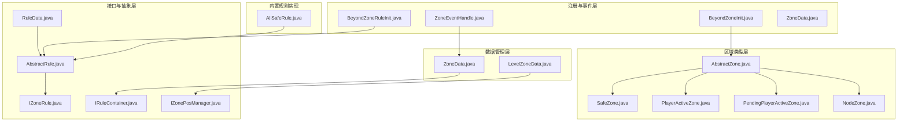
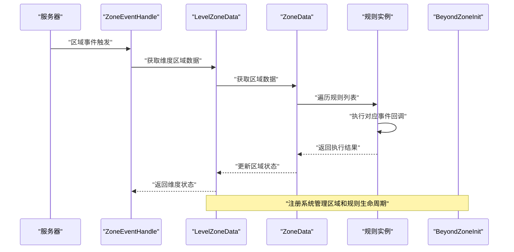
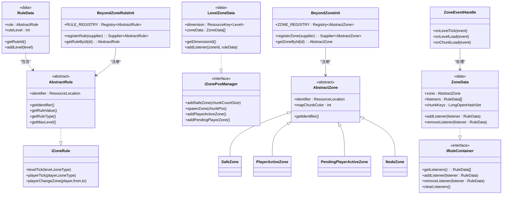
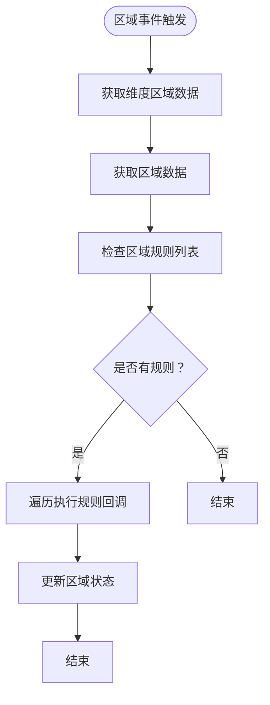

# 安全区规则系统

<cite>
**本文引用的文件**
- [IZoneRule.java](file://Beyond/src/main/java/com/pz/beyond/api/system/rule/IZoneRule.java)
- [AbstractRule.java](file://Beyond/src/main/java/com/pz/beyond/api/system/rule/AbstractRule.java)
- [RuleData.java](file://Beyond/src/main/java/com/pz/beyond/api/system/rule/RuleData.java)
- [IRuleContainer.java](file://Beyond/src/main/java/com/pz/beyond/api/system/zone/core/IRuleContainer.java)
- [AbstractZone.java](file://Beyond/src/main/java/com/pz/beyond/api/system/zone/AbstractZone.java)
- [ZoneData.java](file://Beyond/src/main/java/com/pz/beyond/api/system/zone/ZoneData.java)
- [LevelZoneData.java](file://Beyond/src/main/java/com/pz/beyond/api/system/zone/LevelZoneData.java)
- [SafeZone.java](file://Beyond/src/main/java/com/pz/beyond/api/system/zone/zones/SafeZone.java)
- [PlayerActiveZone.java](file://Beyond/src/main/java/com/pz/beyond/api/system/zone/zones/PlayerActiveZone.java)
- [PendingPlayerActiveZone.java](file://Beyond/src/main/java/com/pz/beyond/api/system/zone/zones/PendingPlayerActiveZone.java)
- [NodeZone.java](file://Beyond/src/main/java/com/pz/beyond/api/system/zone/zones/NodeZone.java)
- [BeyondZoneInit.java](file://Beyond/src/main/java/com/pz/beyond/api/init/BeyondZoneInit.java)
- [BeyondZoneRuleInit.java](file://Beyond/src/main/java/com/pz/beyond/api/init/BeyondZoneRuleInit.java)
- [ZoneEventHandle.java](file://Beyond/src/main/java/com/pz/beyond/api/event/handle/ZoneEventHandle.java)
- [AllSafeRule.java](file://Beyond/src/main/java/com/pz/beyond/rule/AllSafeRule.java)
</cite>

## 更新摘要
**所做更改**
- 新增 LevelZoneData 层以支持维度级区域数据管理
- 更新区域类型系统以支持更灵活的区域类型管理
- 增强序列化和网络传输机制，支持完整的区域数据持久化
- 完善区域位置管理接口 IZonePosManager 的实现框架
- 更新事件处理机制以支持维度级和区块级的区域管理

## 目录
1. [简介](#简介)
2. [项目结构](#项目结构)
3. [核心组件](#核心组件)
4. [架构总览](#架构总览)
5. [详细组件分析](#详细组件分析)
6. [依赖分析](#依赖分析)
7. [性能考虑](#性能考虑)
8. [故障排查指南](#故障排查指南)
9. [结论](#结论)
10. [附录](#附录)

## 简介
本文档系统性阐述"区域规则系统"的全新设计与实现，重点包括：
- IZoneRule 接口的设计理念与事件回调机制
- 完整的区域管理系统架构：区域类型、规则容器、事件处理
- 四大内置规则的工作原理、触发条件与效果实现：全安全规则（AllSafeRule）
- 区域上下文的作用与传递机制
- 自定义区域规则的开发指南与最佳实践
- 规则优先级、冲突处理与性能优化建议
- **新增**：维度级区域数据管理与序列化机制

**重要更新**：系统已从简单的安全区概念演进为完整的区域管理系统，支持多种区域类型和复杂的规则组合，并集成了维度级数据管理和序列化机制。

## 项目结构
区域规则系统位于 Beyond 模块中，采用"事件驱动 + 区域类型 + 规则容器 + 维度管理"的完整架构：
- 接口层：IZoneRule 定义区域规则的统一回调接口
- 抽象层：AbstractRule 提供规则基类和类型系统
- 数据层：RuleData 和 ZoneData 封装规则配置和区域数据，新增 LevelZoneData 支持维度级管理
- 区域层：AbstractZone 及其子类定义不同类型的区域
- 注册层：BeyondZoneInit 和 BeyondZoneRuleInit 管理注册系统
- 事件层：ZoneEventHandle 负责区域事件的订阅与处理
- 容器层：IRuleContainer 提供规则的存储和管理接口
- 位置管理层：IZonePosManager 定义区域位置管理的接口规范

**图表来源**
- [IZoneRule.java:1-37](file://Beyond/src/main/java/com/pz/beyond/api/system/rule/IZoneRule.java#L1-L37)
- [AbstractRule.java:1-56](file://Beyond/src/main/java/com/pz/beyond/api/system/rule/AbstractRule.java#L1-L56)
- [RuleData.java:1-69](file://Beyond/src/main/java/com/pz/beyond/api/system/rule/RuleData.java#L1-L69)
- [IRuleContainer.java:1-16](file://Beyond/src/main/java/com/pz/beyond/api/system/zone/core/IRuleContainer.java#L1-L16)
- [AbstractZone.java:1-42](file://Beyond/src/main/java/com/pz/beyond/api/system/zone/AbstractZone.java#L1-L42)
- [ZoneData.java:1-124](file://Beyond/src/main/java/com/pz/beyond/api/system/zone/ZoneData.java#L1-L124)
- [LevelZoneData.java:1-87](file://Beyond/src/main/java/com/pz/beyond/api/system/zone/LevelZoneData.java#L1-L87)
- [SafeZone.java:1-18](file://Beyond/src/main/java/com/pz/beyond/api/system/zone/zones/SafeZone.java#L1-L18)
- [PlayerActiveZone.java:1-18](file://Beyond/src/main/java/com/pz/beyond/api/system/zone/zones/PlayerActiveZone.java#L1-L18)
- [PendingPlayerActiveZone.java:1-18](file://Beyond/src/main/java/com/pz/beyond/api/system/zone/zones/PendingPlayerActiveZone.java#L1-L18)
- [NodeZone.java:1-26](file://Beyond/src/main/java/com/pz/beyond/api/system/zone/zones/NodeZone.java#L1-L26)
- [BeyondZoneInit.java:1-64](file://Beyond/src/main/java/com/pz/beyond/api/init/BeyondZoneInit.java#L1-L64)
- [BeyondZoneRuleInit.java:1-75](file://Beyond/src/main/java/com/pz/beyond/api/init/BeyondZoneRuleInit.java#L1-L75)
- [ZoneEventHandle.java:1-43](file://Beyond/src/main/java/com/pz/beyond/api/event/handle/ZoneEventHandle.java#L1-L43)
- [AllSafeRule.java:1-35](file://Beyond/src/main/java/com/pz/beyond/rule/AllSafeRule.java#L1-L35)

## 核心组件
- **IZoneRule**：定义区域规则的统一回调接口，提供 levelTick、playerTick、playerChangeZone 三大核心事件
- **AbstractRule**：规则基类，提供标识符管理和规则类型枚举（Good、Bad、Natural）
- **RuleData**：规则数据封装，包含规则实例和等级信息，支持序列化和网络传输
- **IRuleContainer**：规则容器接口，定义规则的增删改查操作
- **AbstractZone**：区域基类，提供区域标识符和地图颜色等基础功能
- **ZoneData**：区域数据类，实现 IRuleContainer 接口，管理区域内的规则列表和区块键
- **LevelZoneData**：维度级区域数据管理，支持整个维度的区域数据持久化和网络传输
- **区域类型系统**：支持安全区、玩家活动区、节点区等多种区域类型
- **注册系统**：BeyondZoneInit 和 BeyondZoneRuleInit 分别管理区域和规则的注册
- **事件处理**：ZoneEventHandle 订阅并处理区域相关的游戏事件
- **位置管理**：IZonePosManager 定义区域位置管理的接口规范

**章节来源**
- [IZoneRule.java:8-36](file://Beyond/src/main/java/com/pz/beyond/api/system/rule/IZoneRule.java#L8-L36)
- [AbstractRule.java:8-56](file://Beyond/src/main/java/com/pz/beyond/api/system/rule/AbstractRule.java#L8-L56)
- [RuleData.java:16-68](file://Beyond/src/main/java/com/pz/beyond/api/system/rule/RuleData.java#L16-L68)
- [IRuleContainer.java:7-15](file://Beyond/src/main/java/com/pz/beyond/api/system/zone/core/IRuleContainer.java#L7-L15)
- [AbstractZone.java:15-41](file://Beyond/src/main/java/com/pz/beyond/api/system/zone/AbstractZone.java#L15-L41)
- [ZoneData.java:22-123](file://Beyond/src/main/java/com/pz/beyond/api/system/zone/ZoneData.java#L22-L123)
- [LevelZoneData.java:24-86](file://Beyond/src/main/java/com/pz/beyond/api/system/zone/LevelZoneData.java#L24-L86)
- [BeyondZoneInit.java:19-63](file://Beyond/src/main/java/com/pz/beyond/api/init/BeyondZoneInit.java#L19-L63)
- [BeyondZoneRuleInit.java:16-74](file://Beyond/src/main/java/com/pz/beyond/api/init/BeyondZoneRuleInit.java#L16-L74)
- [ZoneEventHandle.java:14-42](file://Beyond/src/main/java/com/pz/beyond/api/event/handle/ZoneEventHandle.java#L14-L42)

## 架构总览
系统采用完整的区域管理架构，围绕多种区域类型和规则容器进行设计。新增的 LevelZoneData 支持维度级区域数据管理，ZoneData 实现 IRuleContainer 接口，支持动态添加和移除规则，通过注册系统实现规则的生命周期管理。

**图表来源**
- [ZoneEventHandle.java:17-41](file://Beyond/src/main/java/com/pz/beyond/api/event/handle/ZoneEventHandle.java#L17-L41)
- [LevelZoneData.java:24-86](file://Beyond/src/main/java/com/pz/beyond/api/system/zone/LevelZoneData.java#L24-L86)
- [ZoneData.java:110-119](file://Beyond/src/main/java/com/pz/beyond/api/system/zone/ZoneData.java#L110-L119)
- [IZoneRule.java:16-33](file://Beyond/src/main/java/com/pz/beyond/api/system/rule/IZoneRule.java#L16-L33)
- [BeyondZoneInit.java:40-62](file://Beyond/src/main/java/com/pz/beyond/api/init/BeyondZoneInit.java#L40-L62)

## 详细组件分析

### IZoneRule 接口与事件机制
- **设计要点**
  - 提供三个核心事件回调：levelTick（区域级别 tick）、playerTick（玩家级别 tick）、playerChangeZone（区域切换）
  - 所有方法均为默认方法，便于按需实现特定功能
  - 支持区域类型参数，允许规则根据不同的区域类型执行差异化逻辑
- **事件流**
  - ZoneEventHandle 订阅游戏事件，根据事件类型调用相应的规则回调
  - 区域数据类 ZoneData 维护规则列表，按顺序执行规则逻辑

**章节来源**
- [IZoneRule.java:8-36](file://Beyond/src/main/java/com/pz/beyond/api/system/rule/IZoneRule.java#L8-L36)
- [ZoneEventHandle.java:17-41](file://Beyond/src/main/java/com/pz/beyond/api/event/handle/ZoneEventHandle.java#L17-L41)

### 规则系统架构
- **AbstractRule 基类**
  - 提供规则标识符管理，确保规则的唯一性和可识别性
  - 定义规则类型枚举：Good（有益）、Bad（诅咒）、Natural（自然）
  - 支持规则等级系统，便于规则强度的调节
- **RuleData 数据封装**
  - 包含规则实例和等级信息，支持序列化和网络传输
  - 提供规则 ID 获取和等级管理功能
  - 实现编码器和流编解码器，支持数据持久化

**章节来源**
- [AbstractRule.java:8-56](file://Beyond/src/main/java/com/pz/beyond/api/system/rule/AbstractRule.java#L8-L56)
- [RuleData.java:16-68](file://Beyond/src/main/java/com/pz/beyond/api/system/rule/RuleData.java#L16-L68)

### 区域管理系统
- **AbstractZone 基类**
  - 提供区域标识符和地图颜色等基础功能
  - 支持区域附加数据的扩展机制
  - 定义区域的基本属性和行为框架
- **区域类型系统**
  - **SafeZone**：安全区域，提供保护和恢复效果
  - **PlayerActiveZone**：玩家活动区域，支持玩家探索和交互
  - **PendingPlayerActiveZone**：待活动区域，用于玩家计策和准备
  - **NodeZone**：节点区域，与进度系统集成，支持特殊功能

**章节来源**
- [AbstractZone.java:15-41](file://Beyond/src/main/java/com/pz/beyond/api/system/zone/AbstractZone.java#L15-L41)
- [SafeZone.java:10-17](file://Beyond/src/main/java/com/pz/beyond/api/system/zone/zones/SafeZone.java#L10-L17)
- [PlayerActiveZone.java:10-17](file://Beyond/src/main/java/com/pz/beyond/api/system/zone/zones/PlayerActiveZone.java#L10-L17)
- [PendingPlayerActiveZone.java:10-17](file://Beyond/src/main/java/com/pz/beyond/api/system/zone/zones/PendingPlayerActiveZone.java#L10-L17)
- [NodeZone.java:13-25](file://Beyond/src/main/java/com/pz/beyond/api/system/zone/zones/NodeZone.java#L13-L25)

### 规则容器与数据管理
- **IRuleContainer 接口**
  - 定义规则列表的增删改查操作
  - 提供规则管理的标准接口
- **ZoneData 实现**
  - 实现 IRuleContainer 接口，管理区域内的规则列表
  - 维护区块键集合，支持区域的地理范围管理
  - 提供规则序列化和网络同步支持
  - 支持完整的 Mojang 序列化和流编解码机制
- **LevelZoneData 实现**
  - 管理整个维度的区域数据列表
  - 支持维度级的区域数据持久化
  - 提供区域位置管理的接口框架
- **注册系统**
  - BeyondZoneInit 管理区域注册，支持动态注册新区域类型
  - BeyondZoneRuleInit 管理规则注册，支持规则的生命周期管理

**章节来源**
- [IRuleContainer.java:7-15](file://Beyond/src/main/java/com/pz/beyond/api/system/zone/core/IRuleContainer.java#L7-L15)
- [ZoneData.java:22-123](file://Beyond/src/main/java/com/pz/beyond/api/system/zone/ZoneData.java#L22-L123)
- [LevelZoneData.java:24-86](file://Beyond/src/main/java/com/pz/beyond/api/system/zone/LevelZoneData.java#L24-L86)
- [BeyondZoneInit.java:23-62](file://Beyond/src/main/java/com/pz/beyond/api/init/BeyondZoneInit.java#L23-L62)
- [BeyondZoneRuleInit.java:20-71](file://Beyond/src/main/java/com/pz/beyond/api/init/BeyondZoneRuleInit.java#L20-L71)

### 事件处理机制
- **ZoneEventHandle**
  - 订阅 LevelTickEvent、LevelEvent、ChunkEvent 等区域相关事件
  - 提供区域级别的事件处理框架
  - 支持区域加载、卸载和状态变化的处理
- **事件传播**
  - 事件触发时，系统自动查找对应的区域数据
  - 遍历区域内的规则列表，执行相应的回调逻辑
  - 支持规则间的协调和冲突处理

**章节来源**
- [ZoneEventHandle.java:14-42](file://Beyond/src/main/java/com/pz/beyond/api/event/handle/ZoneEventHandle.java#L14-L42)

### 内置规则实现：全安全规则（AllSafeRule）
- **工作原理**
  - 作为示例规则展示规则系统的使用方式
  - 实现 IZoneRule 接口，在玩家进入安全区域时提供保护效果
- **触发条件**
  - 玩家进入安全区域时触发 playerChangeZone 事件
  - 区域级别 tick 事件定期执行保护逻辑
- **效果实现**
  - 提供基础的保护机制示例
  - 展示规则等级系统和类型管理的使用

**章节来源**
- [AllSafeRule.java:1-35](file://Beyond/src/main/java/com/pz/beyond/rule/AllSafeRule.java#L1-L35)
- [IZoneRule.java:24-33](file://Beyond/src/main/java/com/pz/beyond/api/system/rule/IZoneRule.java#L24-L33)

### 自定义区域规则开发指南与最佳实践
- **开发步骤**
  - 创建新的规则类继承 AbstractRule，实现 IZoneRule 接口
  - 在构造函数中设置规则标识符和基本属性
  - 实现所需的事件回调方法（levelTick、playerTick、playerChangeZone）
  - 通过 BeyondZoneRuleInit.registerRule 注册规则
- **最佳实践**
  - 使用规则类型枚举合理分类规则效果
  - 实现规则等级系统，支持规则强度的渐进式增强
  - 在事件回调中避免阻塞操作，保持响应性
  - 提供适当的错误处理和边界检查
- **调试与验证**
  - 通过日志输出确认规则注册和事件触发
  - 使用规则等级系统测试不同强度的效果
  - 验证区域切换时的规则状态变化

**章节来源**
- [AbstractRule.java:18-28](file://Beyond/src/main/java/com/pz/beyond/api/system/rule/AbstractRule.java#L18-L28)
- [BeyondZoneRuleInit.java:45-59](file://Beyond/src/main/java/com/pz/beyond/api/init/BeyondZoneRuleInit.java#L45-L59)
- [IZoneRule.java:16-33](file://Beyond/src/main/java/com/pz/beyond/api/system/rule/IZoneRule.java#L16-L33)

### 维度级区域数据管理
- **LevelZoneData 设计**
  - 管理整个维度的区域数据列表，支持维度级的区域数据持久化
  - 提供维度标识符管理和区域数据的序列化支持
  - 支持区域位置管理的接口框架，为未来功能扩展预留空间
- **序列化机制**
  - 实现完整的 Mojang 序列化支持，包括 Codec 和 StreamCodec
  - 支持网络传输的流编解码器，确保客户端和服务器的数据一致性
- **接口框架**
  - 定义 IZonePosManager 接口，提供区域位置管理的标准方法
  - 支持安全区、玩家活动区、待活动区等不同类型区域的管理

**章节来源**
- [LevelZoneData.java:24-86](file://Beyond/src/main/java/com/pz/beyond/api/system/zone/LevelZoneData.java#L24-L86)
- [ZoneData.java:32-75](file://Beyond/src/main/java/com/pz/beyond/api/system/zone/ZoneData.java#L32-L75)

## 依赖分析
- **规则发现与装配**
  - BeyondZoneRuleInit 通过注册系统管理规则的生命周期
  - RuleData 提供规则实例的创建和管理
- **事件订阅与分发**
  - ZoneEventHandle 订阅游戏事件，按区域类型分派规则处理
  - ZoneData 维护规则列表，支持动态规则管理
- **区域注册与管理**
  - BeyondZoneInit 管理区域类型的注册和检索
  - 区域数据类支持区域的序列化和网络同步
- **维度级数据管理**
  - LevelZoneData 提供维度级区域数据的管理框架
  - 支持完整的序列化和网络传输机制

**图表来源**
- [IZoneRule.java:8-36](file://Beyond/src/main/java/com/pz/beyond/api/system/rule/IZoneRule.java#L8-L36)
- [AbstractRule.java:8-56](file://Beyond/src/main/java/com/pz/beyond/api/system/rule/AbstractRule.java#L8-L56)
- [RuleData.java:16-68](file://Beyond/src/main/java/com/pz/beyond/api/system/rule/RuleData.java#L16-L68)
- [IRuleContainer.java:7-15](file://Beyond/src/main/java/com/pz/beyond/api/system/zone/core/IRuleContainer.java#L7-L15)
- [AbstractZone.java:15-41](file://Beyond/src/main/java/com/pz/beyond/api/system/zone/AbstractZone.java#L15-L41)
- [ZoneData.java:22-123](file://Beyond/src/main/java/com/pz/beyond/api/system/zone/ZoneData.java#L22-L123)
- [LevelZoneData.java:24-86](file://Beyond/src/main/java/com/pz/beyond/api/system/zone/LevelZoneData.java#L24-L86)
- [BeyondZoneInit.java:19-63](file://Beyond/src/main/java/com/pz/beyond/api/init/BeyondZoneInit.java#L19-L63)
- [BeyondZoneRuleInit.java:16-74](file://Beyond/src/main/java/com/pz/beyond/api/init/BeyondZoneRuleInit.java#L16-L74)
- [ZoneEventHandle.java:14-42](file://Beyond/src/main/java/com/pz/beyond/api/event/handle/ZoneEventHandle.java#L14-L42)

## 性能考虑
- **事件频率控制**
  - 区域级别 tick 事件按游戏节奏执行，避免过度频繁的规则检查
  - 玩家级别 tick 事件仅在玩家处于活跃区域时触发
- **规则数量与遍历**
  - ZoneData 维护规则列表，支持高效的规则查找和执行
  - 规则数量增长会影响事件处理时间，建议合理控制规则数量
- **内存管理**
  - RuleData 支持规则实例的复用和管理
  - 区域数据的序列化和网络传输经过优化
- **维度级数据管理**
  - LevelZoneData 支持维度级数据缓存，减少重复计算
  - 序列化机制经过优化，支持高效的数据传输
- **并发与线程**
  - 所有区域事件在服务器主线程处理，避免线程安全问题

## 故障排查指南
- **规则未生效**
  - 检查规则是否通过 BeyondZoneRuleInit 正确注册
  - 确认规则标识符和区域类型匹配
  - 验证规则等级设置是否正确
- **区域切换异常**
  - 检查区域注册是否正常完成
  - 确认区域数据的序列化和反序列化
  - 验证区域事件处理逻辑
- **维度级数据问题**
  - 检查 LevelZoneData 的序列化和网络传输
  - 验证维度标识符的正确性
  - 确认区域数据的完整性
- **性能问题**
  - 监控规则执行时间和事件触发频率
  - 检查规则数量和复杂度
  - 优化规则逻辑和数据访问

**章节来源**
- [BeyondZoneRuleInit.java:45-59](file://Beyond/src/main/java/com/pz/beyond/api/init/BeyondZoneRuleInit.java#L45-L59)
- [BeyondZoneInit.java:52-62](file://Beyond/src/main/java/com/pz/beyond/api/init/BeyondZoneInit.java#L52-L62)
- [ZoneData.java:110-119](file://Beyond/src/main/java/com/pz/beyond/api/system/zone/ZoneData.java#L110-L119)
- [LevelZoneData.java:24-86](file://Beyond/src/main/java/com/pz/beyond/api/system/zone/LevelZoneData.java#L24-L86)

## 结论
区域规则系统通过完整的架构设计，实现了从简单安全区到复杂区域管理系统的演进。新的系统支持多种区域类型、灵活的规则容器和强大的事件处理机制。通过 IZoneRule 接口和 AbstractRule 基类，系统提供了统一的规则开发框架。ZoneData 和 IRuleContainer 接口确保了规则的有效管理和执行。新增的 LevelZoneData 支持维度级区域数据管理，增强了系统的可扩展性和性能。建议在开发自定义规则时遵循类型分类、等级管理和事件处理的最佳实践，关注性能优化和错误处理，构建稳定可靠的区域规则系统。

## 附录

### 关键流程图：区域事件处理与规则执行

**图表来源**
- [ZoneEventHandle.java:17-41](file://Beyond/src/main/java/com/pz/beyond/api/event/handle/ZoneEventHandle.java#L17-L41)
- [LevelZoneData.java:24-86](file://Beyond/src/main/java/com/pz/beyond/api/system/zone/LevelZoneData.java#L24-L86)
- [ZoneData.java:110-119](file://Beyond/src/main/java/com/pz/beyond/api/system/zone/ZoneData.java#L110-L119)
- [IZoneRule.java:16-33](file://Beyond/src/main/java/com/pz/beyond/api/system/rule/IZoneRule.java#L16-L33)