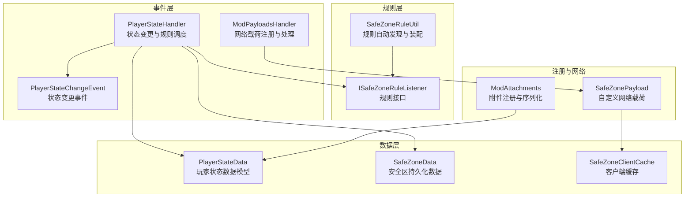
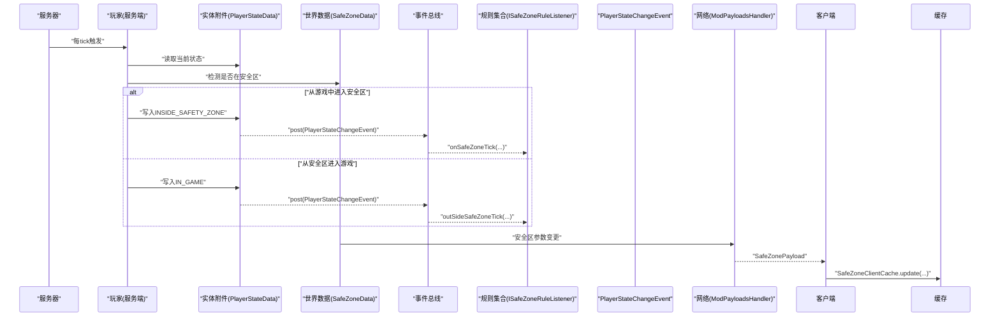
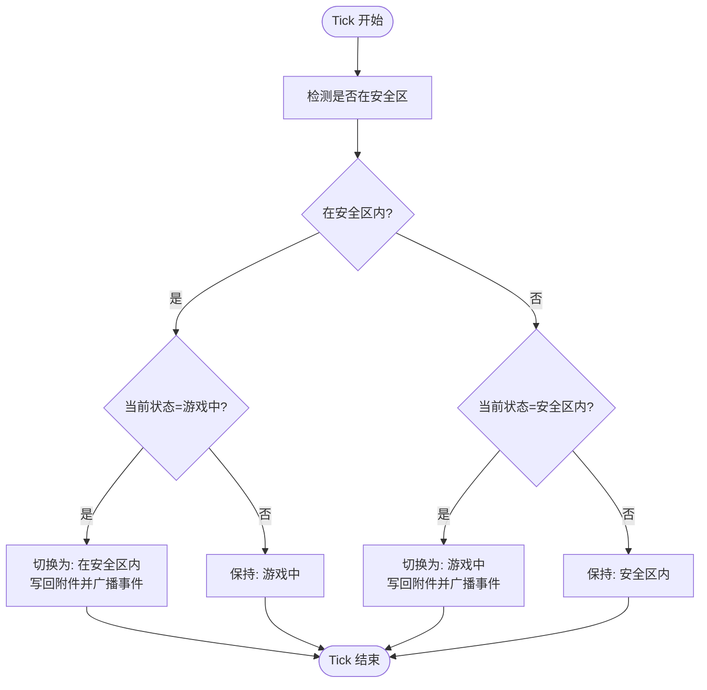
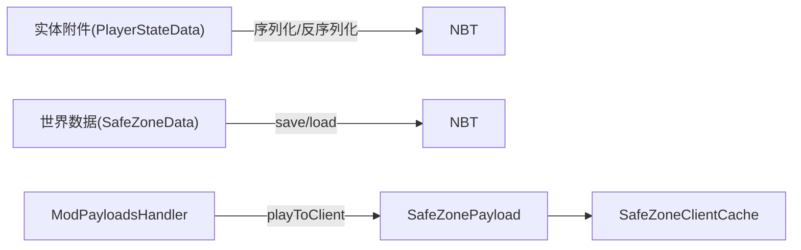
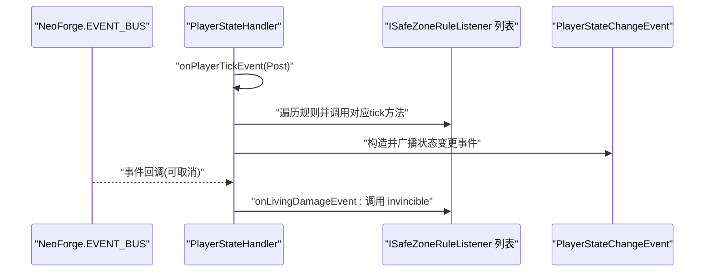
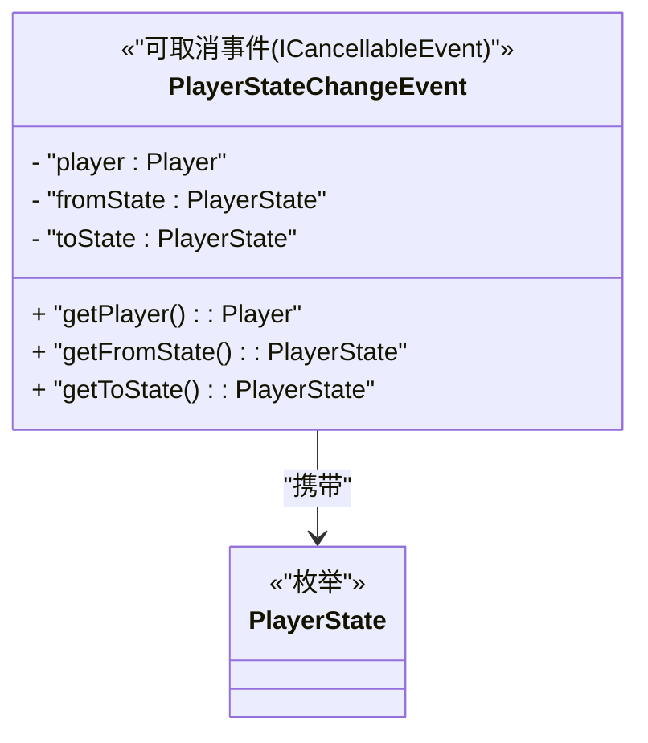
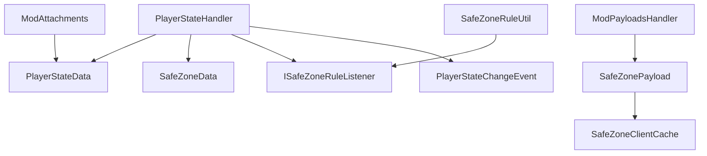

# 玩家状态管理

<cite>
**本文引用的文件**
- [PlayerStateData.java](file://Beyond/src/main/java/com/pz/beyond/data/PlayerStateData.java)
- [PlayerStateHandler.java](file://Beyond/src/main/java/com/pz/beyond/event/PlayerStateHandler.java)
- [PlayerStateChangeEvent.java](file://Beyond/src/main/java/com/pz/beyond/event/custom/PlayerStateChangeEvent.java)
- [ModAttachments.java](file://Beyond/src/main/java/com/pz/beyond/registry/ModAttachments.java)
- [SafeZoneData.java](file://Beyond/src/main/java/com/pz/beyond/data/SafeZoneData.java)
- [ISafeZoneRuleListener.java](file://Beyond/src/main/java/com/pz/beyond/safeZoneRule/ISafeZoneRuleListener.java)
- [SafeZoneRuleUtil.java](file://Beyond/src/main/java/com/pz/beyond/util/SafeZoneRuleUtil.java)
- [SafeZonePayload.java](file://Beyond/src/main/java/com/pz/beyond/network/SafeZonePayload.java)
- [SafeZoneClientCache.java](file://Beyond/src/main/java/com/pz/beyond/data/SafeZoneClientCache.java)
- [ModPayloadsHandler.java](file://Beyond/src/main/java/com/pz/beyond/event/ModPayloadsHandler.java)
</cite>

## 目录
1. [简介](#简介)
2. [项目结构](#项目结构)
3. [核心组件](#核心组件)
4. [架构总览](#架构总览)
5. [组件详解](#组件详解)
6. [依赖关系分析](#依赖关系分析)
7. [性能与并发](#性能与并发)
8. [故障排查指南](#故障排查指南)
9. [结论](#结论)
10. [附录](#附录)

## 简介
本文件系统性阐述“玩家状态管理”模块的设计与实现，重点覆盖以下方面：
- PlayerStateData 数据模型的设计与序列化/反序列化机制
- 玩家状态的生命周期、状态转换逻辑与持久化策略
- PlayerStateHandler 事件处理器的实现细节与事件传播机制
- PlayerStateChangeEvent 自定义事件的设计目的与使用场景
- 玩家状态的查询、修改与监听方法与示例
- 状态变更对游戏体验的影响与性能考量
- 状态同步、并发控制与错误处理的最佳实践

## 项目结构
围绕玩家状态管理的相关代码主要位于 Beyond 模块中，采用按功能域分层组织：
- 数据层：PlayerStateData、SafeZoneData、SafeZoneClientCache
- 事件层：PlayerStateHandler、PlayerStateChangeEvent、ModPayloadsHandler
- 规则层：ISafeZoneRuleListener、SafeZoneRuleUtil、若干具体规则实现
- 注册与网络：ModAttachments、SafeZonePayload



图表来源
- [PlayerStateData.java:13-65](file://Beyond/src/main/java/com/pz/beyond/data/PlayerStateData.java#L13-L65)
- [PlayerStateHandler.java:21-80](file://Beyond/src/main/java/com/pz/beyond/event/PlayerStateHandler.java#L21-L80)
- [PlayerStateChangeEvent.java:15-70](file://Beyond/src/main/java/com/pz/beyond/event/custom/PlayerStateChangeEvent.java#L15-L70)
- [ModAttachments.java:11-22](file://Beyond/src/main/java/com/pz/beyond/registry/ModAttachments.java#L11-L22)
- [SafeZoneData.java:16-101](file://Beyond/src/main/java/com/pz/beyond/data/SafeZoneData.java#L16-L101)
- [ISafeZoneRuleListener.java:13-42](file://Beyond/src/main/java/com/pz/beyond/safeZoneRule/ISafeZoneRuleListener.java#L13-L42)
- [SafeZoneRuleUtil.java:11-54](file://Beyond/src/main/java/com/pz/beyond/util/SafeZoneRuleUtil.java#L11-L54)
- [SafeZonePayload.java:10-31](file://Beyond/src/main/java/com/pz/beyond/network/SafeZonePayload.java#L10-L31)
- [SafeZoneClientCache.java:6-30](file://Beyond/src/main/java/com/pz/beyond/data/SafeZoneClientCache.java#L6-L30)
- [ModPayloadsHandler.java:11-35](file://Beyond/src/main/java/com/pz/beyond/event/ModPayloadsHandler.java#L11-L35)

章节来源
- [PlayerStateData.java:13-65](file://Beyond/src/main/java/com/pz/beyond/data/PlayerStateData.java#L13-L65)
- [PlayerStateHandler.java:21-80](file://Beyond/src/main/java/com/pz/beyond/event/PlayerStateHandler.java#L21-L80)
- [ModAttachments.java:11-22](file://Beyond/src/main/java/com/pz/beyond/registry/ModAttachments.java#L11-L22)
- [SafeZoneData.java:16-101](file://Beyond/src/main/java/com/pz/beyond/data/SafeZoneData.java#L16-L101)
- [ISafeZoneRuleListener.java:13-42](file://Beyond/src/main/java/com/pz/beyond/safeZoneRule/ISafeZoneRuleListener.java#L13-L42)
- [SafeZoneRuleUtil.java:11-54](file://Beyond/src/main/java/com/pz/beyond/util/SafeZoneRuleUtil.java#L11-L54)
- [SafeZonePayload.java:10-31](file://Beyond/src/main/java/com/pz/beyond/network/SafeZonePayload.java#L10-L31)
- [SafeZoneClientCache.java:6-30](file://Beyond/src/main/java/com/pz/beyond/data/SafeZoneClientCache.java#L6-L30)
- [ModPayloadsHandler.java:11-35](file://Beyond/src/main/java/com/pz/beyond/event/ModPayloadsHandler.java#L11-L35)

## 核心组件
- PlayerStateData：封装玩家状态枚举与 Mojang 序列化编解码器，支持在实体附件上持久化与跨死亡保留。
- PlayerStateHandler：基于 Forge/NFG 事件总线的处理器，负责每 tick 的状态判定、规则执行与事件广播。
- PlayerStateChangeEvent：自定义事件，携带变更前后状态，支持取消，便于外部模块响应状态变化。
- ModAttachments：注册玩家状态附件类型，绑定序列化器与复制策略（死亡继承）。
- SafeZoneData：世界级安全区数据，提供区域判断与持久化能力，并向客户端推送网络包。
- ISafeZoneRuleListener：安全区规则接口，统一暴露 tick、伤害、怪物生成等钩子。
- SafeZoneRuleUtil：通过模组扫描自动发现并装配标注了特定注解的规则实现。
- SafeZonePayload 与 ModPayloadsHandler：自定义网络协议载荷与注册器，用于将安全区参数推送给客户端。
- SafeZoneClientCache：客户端侧缓存，供渲染或 UI 使用。

章节来源
- [PlayerStateData.java:13-65](file://Beyond/src/main/java/com/pz/beyond/data/PlayerStateData.java#L13-L65)
- [PlayerStateHandler.java:21-80](file://Beyond/src/main/java/com/pz/beyond/event/PlayerStateHandler.java#L21-L80)
- [PlayerStateChangeEvent.java:15-70](file://Beyond/src/main/java/com/pz/beyond/event/custom/PlayerStateChangeEvent.java#L15-L70)
- [ModAttachments.java:11-22](file://Beyond/src/main/java/com/pz/beyond/registry/ModAttachments.java#L11-L22)
- [SafeZoneData.java:16-101](file://Beyond/src/main/java/com/pz/beyond/data/SafeZoneData.java#L16-L101)
- [ISafeZoneRuleListener.java:13-42](file://Beyond/src/main/java/com/pz/beyond/safeZoneRule/ISafeZoneRuleListener.java#L13-L42)
- [SafeZoneRuleUtil.java:11-54](file://Beyond/src/main/java/com/pz/beyond/util/SafeZoneRuleUtil.java#L11-L54)
- [SafeZonePayload.java:10-31](file://Beyond/src/main/java/com/pz/beyond/network/SafeZonePayload.java#L10-L31)
- [SafeZoneClientCache.java:6-30](file://Beyond/src/main/java/com/pz/beyond/data/SafeZoneClientCache.java#L6-L30)
- [ModPayloadsHandler.java:11-35](file://Beyond/src/main/java/com/pz/beyond/event/ModPayloadsHandler.java#L11-L35)

## 架构总览
玩家状态管理由“事件驱动 + 规则插件 + 附件持久化 + 网络同步”构成的闭环体系：
- 事件驱动：每 tick 检查玩家是否仍在安全区，触发状态变更与规则执行。
- 规则插件：通过注解自动发现并装配规则，集中处理安全区内/外的不同行为。
- 附件持久化：将玩家状态附加到实体附件，支持序列化与死亡继承。
- 网络同步：服务端更新安全区参数后，通过自定义包推送到客户端缓存。



图表来源
- [PlayerStateHandler.java:26-66](file://Beyond/src/main/java/com/pz/beyond/event/PlayerStateHandler.java#L26-L66)
- [PlayerStateChangeEvent.java:15-70](file://Beyond/src/main/java/com/pz/beyond/event/custom/PlayerStateChangeEvent.java#L15-L70)
- [ISafeZoneRuleListener.java:19-37](file://Beyond/src/main/java/com/pz/beyond/safeZoneRule/ISafeZoneRuleListener.java#L19-L37)
- [SafeZoneData.java:53-79](file://Beyond/src/main/java/com/pz/beyond/data/SafeZoneData.java#L53-L79)
- [ModPayloadsHandler.java:14-32](file://Beyond/src/main/java/com/pz/beyond/event/ModPayloadsHandler.java#L14-L32)
- [SafeZonePayload.java:10-31](file://Beyond/src/main/java/com/pz/beyond/network/SafeZonePayload.java#L10-L31)
- [SafeZoneClientCache.java:12-28](file://Beyond/src/main/java/com/pz/beyond/data/SafeZoneClientCache.java#L12-L28)

## 组件详解

### PlayerStateData 数据模型与存储机制
- 设计要点
  - 单一字段：保存当前玩家状态枚举。
  - 枚举：包含“在安全区内”和“在游戏中”两种状态，具备序列化名称映射。
  - 编解码器：使用 Mojang 序列化框架为 PlayerStateData 与 PlayerState 提供编解码器，确保 NBT/网络传输稳定。
- 存储与访问
  - 通过实体附件持有者接口读写，结合 ModAttachments 注册的附件类型进行序列化与持久化。
  - 死亡时自动复制，保证状态在重生后延续。
- 查询与修改
  - 提供 getter/setter 访问状态；外部模块通过实体附件直接读取或设置新值。

```mermaid
classDiagram
class PlayerStateData {
- "playerState : PlayerState"
+ "getPlayerState() : PlayerState"
+ "setPlayerState(state) : void"
<<"记录式数据模型">>
}
class PlayerState {
<<"StringRepresentable 枚举">>
"INSIDE_SAFETY_ZONE"
"IN_GAME"
"CODEC : Codec<PlayerState>"
}
class Codec_PlayerStateData {
<<"RecordCodecBuilder">>
}
PlayerStateData --> PlayerState : "持有"
Codec_PlayerStateData --> PlayerStateData : "编解码"
```

图表来源
- [PlayerStateData.java:13-65](file://Beyond/src/main/java/com/pz/beyond/data/PlayerStateData.java#L13-L65)

章节来源
- [PlayerStateData.java:13-65](file://Beyond/src/main/java/com/pz/beyond/data/PlayerStateData.java#L13-L65)
- [ModAttachments.java:16-20](file://Beyond/src/main/java/com/pz/beyond/registry/ModAttachments.java#L16-L20)

### 玩家状态生命周期与转换逻辑
- 生命周期阶段
  - 初始化：实体出生时由附件默认值决定初始状态。
  - 运行期：每 tick 基于安全区判定进行状态切换。
  - 结束：死亡时状态随附件复制，重生后延续。
- 转换条件
  - 若玩家在安全区内且当前状态为“游戏中”，则切换为“在安全区内”。
  - 若玩家不在安全区内且当前状态为“在安全区内”，则切换为“游戏中”。
- 并发与一致性
  - 状态变更发生在服务端玩家 tick 事件之后，避免与渲染/客户端逻辑竞态。
  - 通过事件总线广播变更，确保规则与监听器顺序执行。



图表来源
- [PlayerStateHandler.java:52-65](file://Beyond/src/main/java/com/pz/beyond/event/PlayerStateHandler.java#L52-L65)
- [SafeZoneData.java:49-57](file://Beyond/src/main/java/com/pz/beyond/data/SafeZoneData.java#L49-L57)

章节来源
- [PlayerStateHandler.java:26-66](file://Beyond/src/main/java/com/pz/beyond/event/PlayerStateHandler.java#L26-L66)
- [SafeZoneData.java:49-57](file://Beyond/src/main/java/com/pz/beyond/data/SafeZoneData.java#L49-L57)

### 持久化策略
- 实体附件持久化
  - PlayerStateData 作为实体附件，使用注册的编解码器进行序列化，随实体保存。
  - copyOnDeath 保证玩家重生后状态延续。
- 世界数据持久化
  - SafeZoneData 保存安全区中心与半径，写入 NBT 并标记脏位，随世界保存。
- 网络同步
  - 服务端在安全区参数变更时，通过自定义包发送给客户端，客户端更新本地缓存。



图表来源
- [ModAttachments.java:16-20](file://Beyond/src/main/java/com/pz/beyond/registry/ModAttachments.java#L16-L20)
- [SafeZoneData.java:30-46](file://Beyond/src/main/java/com/pz/beyond/data/SafeZoneData.java#L30-L46)
- [SafeZonePayload.java:10-31](file://Beyond/src/main/java/com/pz/beyond/network/SafeZonePayload.java#L10-L31)
- [SafeZoneClientCache.java:12-28](file://Beyond/src/main/java/com/pz/beyond/data/SafeZoneClientCache.java#L12-L28)
- [ModPayloadsHandler.java:14-32](file://Beyond/src/main/java/com/pz/beyond/event/ModPayloadsHandler.java#L14-L32)

章节来源
- [ModAttachments.java:16-20](file://Beyond/src/main/java/com/pz/beyond/registry/ModAttachments.java#L16-L20)
- [SafeZoneData.java:30-46](file://Beyond/src/main/java/com/pz/beyond/data/SafeZoneData.java#L30-L46)
- [SafeZonePayload.java:10-31](file://Beyond/src/main/java/com/pz/beyond/network/SafeZonePayload.java#L10-L31)
- [SafeZoneClientCache.java:12-28](file://Beyond/src/main/java/com/pz/beyond/data/SafeZoneClientCache.java#L12-L28)
- [ModPayloadsHandler.java:14-32](file://Beyond/src/main/java/com/pz/beyond/event/ModPayloadsHandler.java#L14-L32)

### PlayerStateHandler 事件处理器
- 功能职责
  - 订阅玩家 tick 后事件，读取实体附件中的当前状态与世界安全区数据。
  - 执行安全区规则：根据当前状态分别调用 onSafeZoneTick 或 outSideSafeZoneTick。
  - 判定并执行状态切换，写回附件并广播 PlayerStateChangeEvent。
  - 订阅伤害前事件，统一调用规则的 invincible 处理。
- 事件传播
  - 使用 NeoForge.EVENT_BUS.post 广播 PlayerStateChangeEvent，监听器可取消事件以阻止后续处理。



图表来源
- [PlayerStateHandler.java:26-77](file://Beyond/src/main/java/com/pz/beyond/event/PlayerStateHandler.java#L26-L77)
- [ISafeZoneRuleListener.java:19-31](file://Beyond/src/main/java/com/pz/beyond/safeZoneRule/ISafeZoneRuleListener.java#L19-L31)
- [PlayerStateChangeEvent.java:15-70](file://Beyond/src/main/java/com/pz/beyond/event/custom/PlayerStateChangeEvent.java#L15-L70)

章节来源
- [PlayerStateHandler.java:21-80](file://Beyond/src/main/java/com/pz/beyond/event/PlayerStateHandler.java#L21-L80)
- [ISafeZoneRuleListener.java:13-42](file://Beyond/src/main/java/com/pz/beyond/safeZoneRule/ISafeZoneRuleListener.java#L13-L42)
- [PlayerStateChangeEvent.java:15-70](file://Beyond/src/main/java/com/pz/beyond/event/custom/PlayerStateChangeEvent.java#L15-L70)

### PlayerStateChangeEvent 自定义事件
- 设计目的
  - 明确记录状态变更的“谁”、“从哪来”、“到哪去”，便于模块间解耦协作。
  - 支持取消，允许监听器在变更生效前阻断流程。
- 使用场景
  - UI 提示与音效联动
  - 技能/效果的激活/禁用
  - 日志与统计
  - 其他模组的扩展接入点



图表来源
- [PlayerStateChangeEvent.java:15-70](file://Beyond/src/main/java/com/pz/beyond/event/custom/PlayerStateChangeEvent.java#L15-L70)

章节来源
- [PlayerStateChangeEvent.java:15-70](file://Beyond/src/main/java/com/pz/beyond/event/custom/PlayerStateChangeEvent.java#L15-L70)

### 状态查询、修改与监听
- 查询
  - 服务端：通过实体附件读取 PlayerStateData，再获取当前状态。
  - 客户端：通过 SafeZoneClientCache 读取最近一次服务端推送的安全区参数。
- 修改
  - 服务端：直接设置 PlayerStateData 的状态并写回附件，随后广播事件。
  - 客户端：仅更新缓存，不直接修改服务端状态。
- 监听
  - 订阅 PlayerStateChangeEvent，可在事件回调中执行业务逻辑。
  - 订阅规则接口（如 onSafeZoneTick/outSideSafeZoneTick），在 tick 中被动响应。

章节来源
- [PlayerStateData.java:31-37](file://Beyond/src/main/java/com/pz/beyond/data/PlayerStateData.java#L31-L37)
- [SafeZoneClientCache.java:12-28](file://Beyond/src/main/java/com/pz/beyond/data/SafeZoneClientCache.java#L12-L28)
- [PlayerStateHandler.java:52-65](file://Beyond/src/main/java/com/pz/beyond/event/PlayerStateHandler.java#L52-L65)
- [ISafeZoneRuleListener.java:19-25](file://Beyond/src/main/java/com/pz/beyond/safeZoneRule/ISafeZoneRuleListener.java#L19-L25)

### 状态同步、并发控制与错误处理
- 状态同步
  - 服务端在安全区参数变更时，通过自定义包推送至客户端，客户端更新缓存。
  - 客户端处理在主线程队列中执行，避免 UI 与网络线程竞争。
- 并发控制
  - 玩家 tick 事件在服务端单线程执行，避免多线程同时写入状态。
  - 事件总线为同步广播，监听器可取消事件以阻断后续处理。
- 错误处理
  - 规则自动发现使用 try/catch，失败时输出错误日志但不影响其他规则加载。
  - 网络处理通过 enqueueWork 确保在主任务线程执行，避免跨线程访问问题。

章节来源
- [SafeZoneData.java:60-79](file://Beyond/src/main/java/com/pz/beyond/data/SafeZoneData.java#L60-L79)
- [ModPayloadsHandler.java:27-31](file://Beyond/src/main/java/com/pz/beyond/event/ModPayloadsHandler.java#L27-L31)
- [SafeZoneRuleUtil.java:41-44](file://Beyond/src/main/java/com/pz/beyond/util/SafeZoneRuleUtil.java#L41-L44)

## 依赖关系分析
- 组件耦合
  - PlayerStateHandler 依赖 PlayerStateData、SafeZoneData、ISafeZoneRuleListener、PlayerStateChangeEvent。
  - ModAttachments 为 PlayerStateData 提供序列化与复制策略。
  - SafeZoneRuleUtil 通过注解扫描装配规则，降低硬编码耦合。
  - ModPayloadsHandler 与 SafeZonePayload/SafeZoneClientCache 形成网络同步链路。
- 外部依赖
  - NeoForge 事件总线、实体附件系统、自定义网络协议。
  - Mojang 序列化编解码器。



图表来源
- [PlayerStateHandler.java:21-80](file://Beyond/src/main/java/com/pz/beyond/event/PlayerStateHandler.java#L21-L80)
- [ModAttachments.java:11-22](file://Beyond/src/main/java/com/pz/beyond/registry/ModAttachments.java#L11-L22)
- [SafeZoneRuleUtil.java:11-54](file://Beyond/src/main/java/com/pz/beyond/util/SafeZoneRuleUtil.java#L11-L54)
- [ModPayloadsHandler.java:11-35](file://Beyond/src/main/java/com/pz/beyond/event/ModPayloadsHandler.java#L11-L35)

章节来源
- [PlayerStateHandler.java:21-80](file://Beyond/src/main/java/com/pz/beyond/event/PlayerStateHandler.java#L21-L80)
- [ModAttachments.java:11-22](file://Beyond/src/main/java/com/pz/beyond/registry/ModAttachments.java#L11-L22)
- [SafeZoneRuleUtil.java:11-54](file://Beyond/src/main/java/com/pz/beyond/util/SafeZoneRuleUtil.java#L11-L54)
- [ModPayloadsHandler.java:11-35](file://Beyond/src/main/java/com/pz/beyond/event/ModPayloadsHandler.java#L11-L35)

## 性能与并发
- Tick 成本
  - 每 tick 仅做一次区域判定与状态比较，复杂度 O(1)，开销极低。
  - 规则遍历在状态变更时执行，避免每 tick 重复计算。
- 内存与序列化
  - PlayerStateData 为轻量数据模型，序列化开销小。
  - SafeZoneData 仅保存中心与半径，内存占用低。
- 网络带宽
  - 自定义包仅包含三个整数，传输开销小；仅在参数变更时推送。
- 并发安全
  - 服务端事件与附件操作在单线程执行；网络处理在主线程队列中执行，避免竞态。

## 故障排查指南
- 症状：状态不切换
  - 检查 SafeZoneData 是否正确保存/加载，确认 isWithinSafeZone 判定逻辑。
  - 确认 PlayerStateHandler 的 tick 事件是否触发。
- 症状：规则无效
  - 检查 SafeZoneRule 注解是否正确标注，SafeZoneRuleUtil 是否成功扫描并实例化。
- 症状：客户端显示异常
  - 检查 ModPayloadsHandler 的注册与网络版本号，确认客户端缓存是否更新。
- 症状：事件未被监听
  - 确认监听器是否订阅了正确的事件类型与频道，以及事件是否被取消。

章节来源
- [SafeZoneData.java:30-46](file://Beyond/src/main/java/com/pz/beyond/data/SafeZoneData.java#L30-L46)
- [PlayerStateHandler.java:26-66](file://Beyond/src/main/java/com/pz/beyond/event/PlayerStateHandler.java#L26-L66)
- [SafeZoneRuleUtil.java:13-48](file://Beyond/src/main/java/com/pz/beyond/util/SafeZoneRuleUtil.java#L13-L48)
- [ModPayloadsHandler.java:14-32](file://Beyond/src/main/java/com/pz/beyond/event/ModPayloadsHandler.java#L14-L32)

## 结论
该玩家状态管理系统以“事件驱动 + 规则插件 + 附件持久化 + 网络同步”为核心，实现了低耦合、高扩展、易维护的状态管理方案。PlayerStateData 与 ModAttachments 提供稳定的持久化基础；PlayerStateHandler 与 PlayerStateChangeEvent 构建清晰的变更流程；ISafeZoneRuleListener 与 SafeZoneRuleUtil 支撑灵活的规则扩展；SafeZoneData/SafeZonePayload/SafeZoneClientCache 确保服务端与客户端的一致性。整体设计兼顾性能与可维护性，适合在大型模组生态中复用与扩展。

## 附录
- 最佳实践清单
  - 使用 PlayerStateChangeEvent 进行跨模块解耦通知。
  - 将耗时逻辑放入规则的 tick 回调中，避免阻塞事件总线。
  - 仅在网络参数变更时推送包，减少带宽压力。
  - 在规则实现中谨慎处理异常，避免影响其他规则执行。
  - 客户端仅读取 SafeZoneClientCache，不直接修改服务端状态。