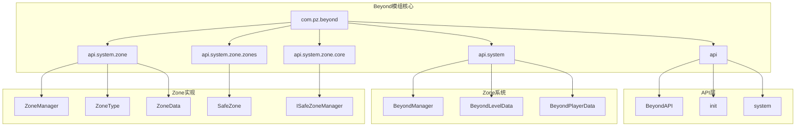
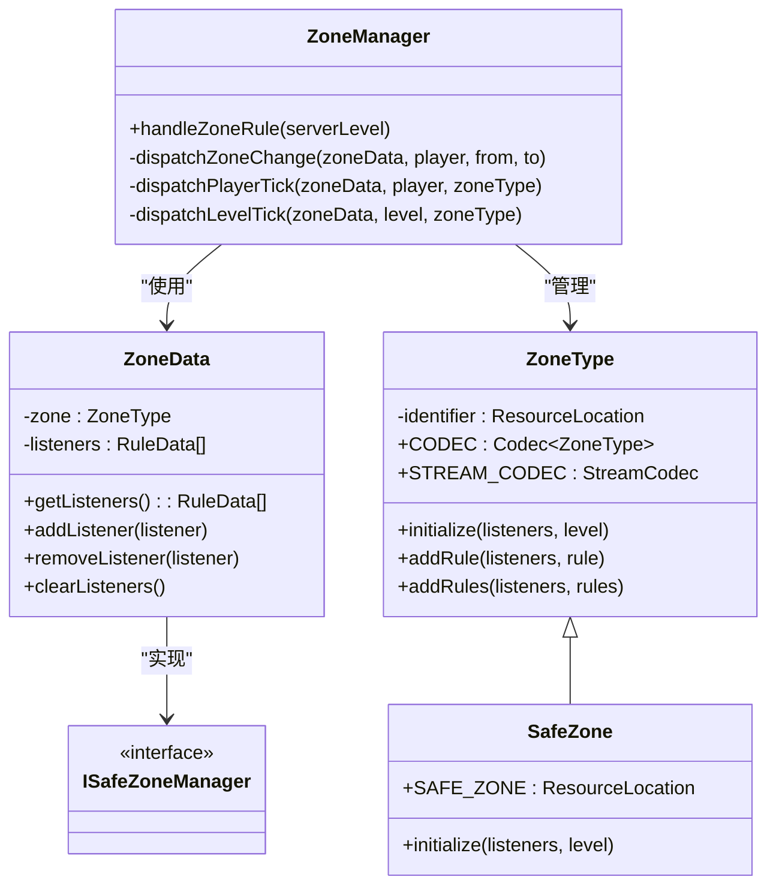
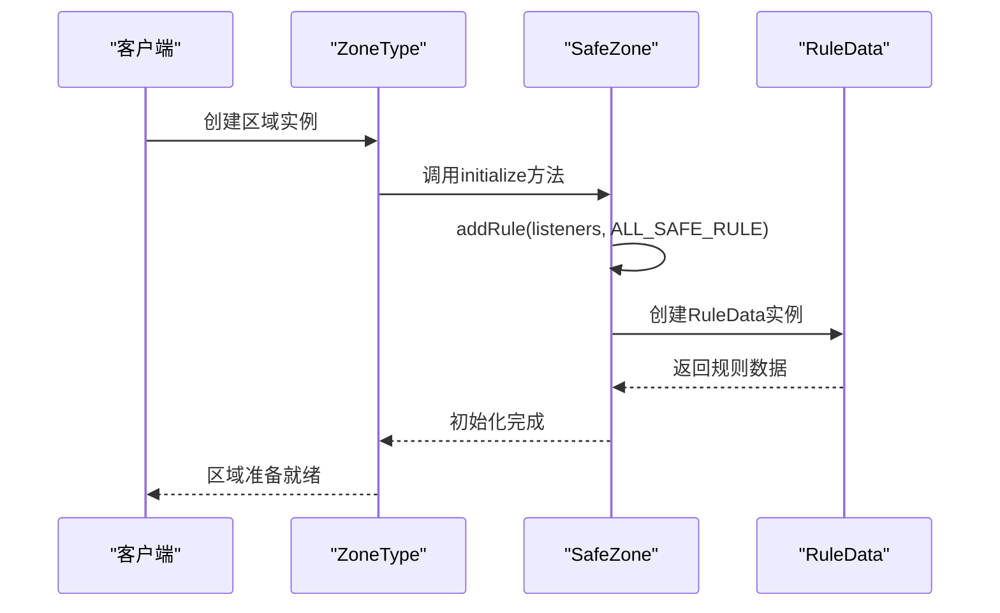
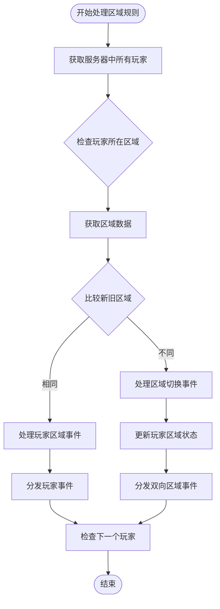
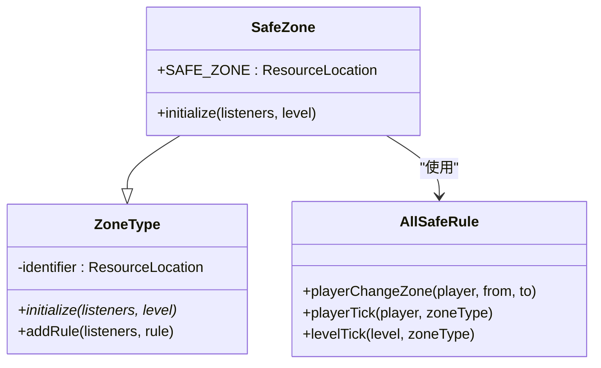
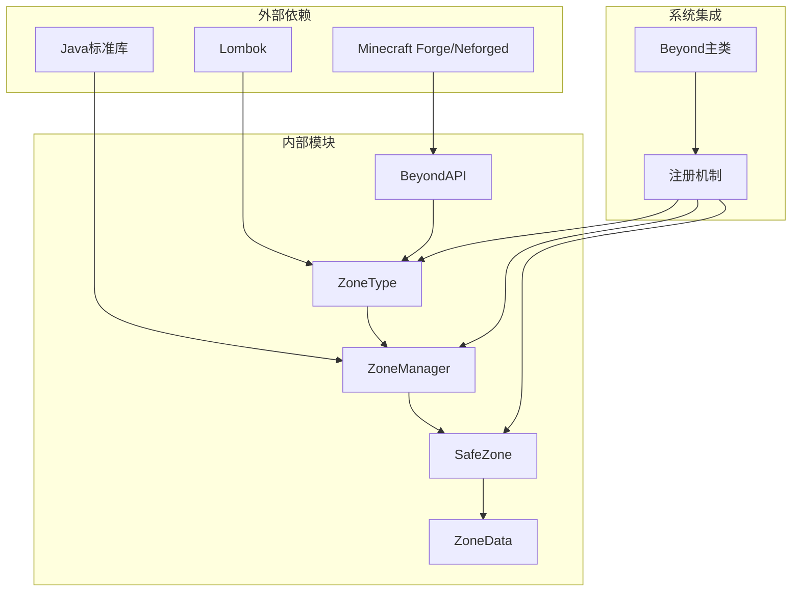

# 结构化安全区系统

<cite>
**本文档引用的文件**
- [Beyond.java](file://Beyond/src/main/java/com/pz/beyond/Beyond.java)
- [BeyondAPI.java](file://Beyond/src/main/java/com/pz/beyond/api/BeyondAPI.java)
- [ISafeZoneManager.java](file://Beyond/src/main/java/com/pz/beyond/api/system/zone/core/ISafeZoneManager.java)
- [SafeZone.java](file://Beyond/src/main/java/com/pz/beyond/api/system/zone/zones/SafeZone.java)
- [ZoneManager.java](file://Beyond/src/main/java/com/pz/beyond/api/system/zone/ZoneManager.java)
- [ZoneType.java](file://Beyond/src/main/java/com/pz/beyond/api/system/zone/ZoneType.java)
- [ZoneData.java](file://Beyond/src/main/java/com/pz/beyond/api/system/zone/ZoneData.java)
</cite>

## 目录
1. [简介](#简介)
2. [项目结构](#项目结构)
3. [核心组件](#核心组件)
4. [架构概览](#架构概览)
5. [详细组件分析](#详细组件分析)
6. [依赖关系分析](#依赖关系分析)
7. [性能考虑](#性能考虑)
8. [故障排除指南](#故障排除指南)
9. [结论](#结论)

## 简介

结构化安全区系统是Beyond模组中的一个核心功能模块，负责管理游戏世界中的区域类型、安全区规则以及玩家在不同区域间的切换行为。该系统采用模块化设计，通过ZoneType抽象类定义区域的基本属性和行为，通过ZoneManager协调各个区域的规则执行，并通过SafeZone类实现具体的安全区域功能。

系统的主要目标包括：
- 提供可扩展的区域类型管理系统
- 实现安全区域的自动检测和规则应用
- 支持区域间的平滑切换和事件处理
- 确保多线程环境下的数据一致性

## 项目结构

Beyond模组采用分层架构设计，主要包含以下核心包结构：

**图表来源**
- [Beyond.java:19-51](file://Beyond/src/main/java/com/pz/beyond/Beyond.java#L19-L51)
- [BeyondAPI.java:12-34](file://Beyond/src/main/java/com/pz/beyond/api/BeyondAPI.java#L12-L34)

**章节来源**
- [Beyond.java:1-60](file://Beyond/src/main/java/com/pz/beyond/Beyond.java#L1-L60)
- [BeyondAPI.java:1-35](file://Beyond/src/main/java/com/pz/beyond/api/BeyondAPI.java#L1-L35)

## 核心组件

### ZoneType抽象基类
ZoneType是所有区域类型的抽象基类，定义了区域的基本属性和行为规范。它提供了序列化支持、规则添加便利方法以及抽象的initialize方法，要求子类实现具体的规则初始化逻辑。

### ZoneManager区域管理器
ZoneManager负责协调整个区域系统的运行，包括区域规则的调度、玩家区域变化的检测以及区域事件的分发。它实现了基于tick的区域更新机制，确保每个区域只被处理一次。

### SafeZone安全区域
SafeZone是ZoneType的具体实现，专门用于定义安全区域的行为。它继承了ZoneType的所有特性，并在initialize方法中自动添加ALL_SAFE_RULE规则，确保安全区域内的玩家不会受到伤害或攻击。

### ZoneData区域数据
ZoneData类封装了单个区域的完整数据信息，包括区域类型和相关的规则监听器列表。它实现了IRuleContainer接口，提供了线程安全的规则管理功能。

**章节来源**
- [ZoneType.java:19-91](file://Beyond/src/main/java/com/pz/beyond/api/system/zone/ZoneType.java#L19-L91)
- [ZoneManager.java:12-68](file://Beyond/src/main/java/com/pz/beyond/api/system/zone/ZoneManager.java#L12-L68)
- [SafeZone.java:17-40](file://Beyond/src/main/java/com/pz/beyond/api/system/zone/zones/SafeZone.java#L17-L40)
- [ZoneData.java:21-70](file://Beyond/src/main/java/com/pz/beyond/api/system/zone/ZoneData.java#L21-L70)

## 架构概览

结构化安全区系统采用分层架构设计，各组件之间通过清晰的接口进行交互：

**图表来源**
- [ZoneType.java:19-91](file://Beyond/src/main/java/com/pz/beyond/api/system/zone/ZoneType.java#L19-L91)
- [SafeZone.java:17-40](file://Beyond/src/main/java/com/pz/beyond/api/system/zone/zones/SafeZone.java#L17-L40)
- [ZoneManager.java:12-68](file://Beyond/src/main/java/com/pz/beyond/api/system/zone/ZoneManager.java#L12-L68)
- [ZoneData.java:21-70](file://Beyond/src/main/java/com/pz/beyond/api/system/zone/ZoneData.java#L21-L70)
- [ISafeZoneManager.java:3-6](file://Beyond/src/main/java/com/pz/beyond/api/system/zone/core/ISafeZoneManager.java#L3-L6)

## 详细组件分析

### ZoneType组件深度分析

ZoneType作为所有区域类型的抽象基类，采用了多种设计模式来确保系统的灵活性和可扩展性：

#### 序列化支持
ZoneType提供了完整的序列化支持，包括标准编码器和流编解码器，这使得区域类型可以在网络传输和数据持久化过程中保持一致性。

#### 规则管理机制
通过addRule系列方法，ZoneType为子类提供了统一的规则添加接口，支持多种规则类型和参数配置。

**图表来源**
- [SafeZone.java:32-35](file://Beyond/src/main/java/com/pz/beyond/api/system/zone/zones/SafeZone.java#L32-L35)
- [ZoneType.java:48-61](file://Beyond/src/main/java/com/pz/beyond/api/system/zone/ZoneType.java#L48-L61)

**章节来源**
- [ZoneType.java:19-91](file://Beyond/src/main/java/com/pz/beyond/api/system/zone/ZoneType.java#L19-L91)

### ZoneManager组件详细分析

ZoneManager实现了区域系统的中央协调器功能，负责处理所有区域相关的逻辑：

#### 区域规则调度
ZoneManager通过handleZoneRule方法实现了高效的区域规则调度机制，使用HashSet避免重复处理相同区域。

#### 区域事件分发
系统实现了多层次的事件分发机制：
- 区域级事件：对整个区域生效的规则
- 玩家级事件：针对特定玩家的规则
- 区域切换事件：当玩家从一个区域移动到另一个区域时触发

**图表来源**
- [ZoneManager.java:15-42](file://Beyond/src/main/java/com/pz/beyond/api/system/zone/ZoneManager.java#L15-L42)

**章节来源**
- [ZoneManager.java:12-68](file://Beyond/src/main/java/com/pz/beyond/api/system/zone/ZoneManager.java#L12-L68)

### SafeZone组件深入分析

SafeZone作为ZoneType的具体实现，专注于提供安全区域功能：

#### 安全区域标识符
SafeZone使用固定的ResourceLocation标识符"beyond:safe_zone"，确保在整个系统中的一致性识别。

#### 自动规则配置
SafeZone在initialize方法中自动添加ALL_SAFE_RULE规则，这是安全区域的核心功能，确保玩家在安全区域内不会受到任何伤害。

**图表来源**
- [SafeZone.java:17-40](file://Beyond/src/main/java/com/pz/beyond/api/system/zone/zones/SafeZone.java#L17-L40)
- [ZoneType.java:43](file://Beyond/src/main/java/com/pz/beyond/api/system/zone/ZoneType.java#L43)

**章节来源**
- [SafeZone.java:17-40](file://Beyond/src/main/java/com/pz/beyond/api/system/zone/zones/SafeZone.java#L17-L40)

### ZoneData组件全面分析

ZoneData类提供了区域数据的完整封装，实现了线程安全的规则管理：

#### 线程安全设计
ZoneData使用CopyOnWriteArrayList来存储规则监听器，确保在多线程环境下对规则列表的并发访问安全性。

#### 序列化支持
ZoneData提供了完整的序列化支持，包括标准编码器和流编解码器，便于数据的持久化和网络传输。

**章节来源**
- [ZoneData.java:21-70](file://Beyond/src/main/java/com/pz/beyond/api/system/zone/ZoneData.java#L21-L70)

## 依赖关系分析

系统采用松耦合的设计原则，各组件之间的依赖关系清晰明确：

**图表来源**
- [Beyond.java:27-51](file://Beyond/src/main/java/com/pz/beyond/Beyond.java#L27-L51)
- [BeyondAPI.java:19-31](file://Beyond/src/main/java/com/pz/beyond/api/BeyondAPI.java#L19-L31)

系统的关键依赖特点：
- **低耦合高内聚**：各组件职责明确，相互依赖最小化
- **接口驱动**：大量使用接口定义契约，便于扩展和测试
- **事件驱动**：通过事件总线实现模块间的松散耦合
- **序列化支持**：完整的数据持久化和网络传输能力

**章节来源**
- [Beyond.java:19-51](file://Beyond/src/main/java/com/pz/beyond/Beyond.java#L19-L51)
- [BeyondAPI.java:12-34](file://Beyond/src/main/java/com/pz/beyond/api/BeyondAPI.java#L12-L34)

## 性能考虑

结构化安全区系统在设计时充分考虑了性能优化：

### 内存管理
- 使用CopyOnWriteArrayList减少锁竞争
- 采用对象池化策略避免频繁的对象创建
- 合理的数据结构选择确保内存使用效率

### 计算优化
- 区域去重处理避免重复计算
- 延迟加载机制减少不必要的初始化开销
- 批量处理策略提高整体执行效率

### 线程安全
- 多线程环境下使用原子操作
- 避免共享可变状态的竞态条件
- 合理的锁粒度控制

## 故障排除指南

### 常见问题及解决方案

#### 区域规则不生效
**症状**：安全区域内的玩家仍然受到伤害
**可能原因**：
- SafeZone初始化失败
- ALL_SAFE_RULE规则未正确添加
- 区域数据未正确序列化

**解决步骤**：
1. 检查SafeZone.initialize方法是否被调用
2. 验证RuleData的创建和添加过程
3. 确认ZoneData的序列化配置

#### 区域切换异常
**症状**：玩家在区域间移动时出现规则冲突
**可能原因**：
- 区域切换事件处理异常
- 玩家数据状态不一致
- 区域缓存失效

**解决步骤**：
1. 检查ZoneManager的区域切换逻辑
2. 验证玩家ZoneData的更新机制
3. 清理区域缓存并重新初始化

#### 性能问题
**症状**：服务器性能下降，区域处理延迟
**可能原因**：
- 区域数量过多导致处理负担
- 规则监听器过多影响性能
- 缺少适当的去重机制

**优化建议**：
1. 实施区域分片管理
2. 限制单个区域的规则监听器数量
3. 优化区域数据的缓存策略

**章节来源**
- [ZoneManager.java:43-49](file://Beyond/src/main/java/com/pz/beyond/api/system/zone/ZoneManager.java#L43-L49)
- [ZoneData.java:26-27](file://Beyond/src/main/java/com/pz/beyond/api/system/zone/ZoneData.java#L26-L27)

## 结论

结构化安全区系统展现了优秀的软件工程实践，通过模块化设计、接口驱动开发和事件驱动架构，构建了一个灵活、可扩展且高性能的区域管理系统。

### 主要优势
- **高度模块化**：各组件职责明确，便于维护和扩展
- **强类型安全**：通过接口和抽象类确保类型安全
- **线程安全**：采用现代并发编程技术保证多线程环境下的稳定性
- **可序列化**：完整的数据持久化支持

### 技术亮点
- 创新的ZoneType抽象设计，支持多种区域类型的统一管理
- 高效的ZoneManager调度机制，确保区域规则的及时执行
- SafeZone的自动配置功能，简化了安全区域的设置过程
- ZoneData的线程安全设计，保证了数据的一致性和完整性

该系统为Beyond模组提供了坚实的基础，也为其他模组开发者提供了一个优秀的参考实现，展示了如何在Minecraft模组开发中实现复杂的区域管理和规则系统。