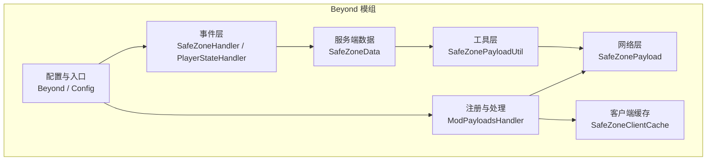
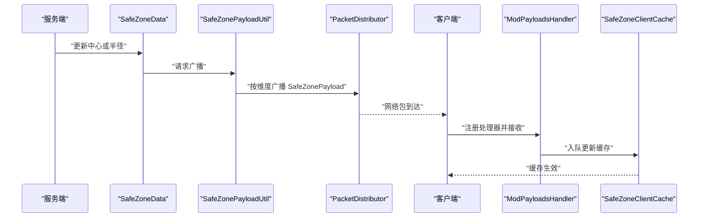
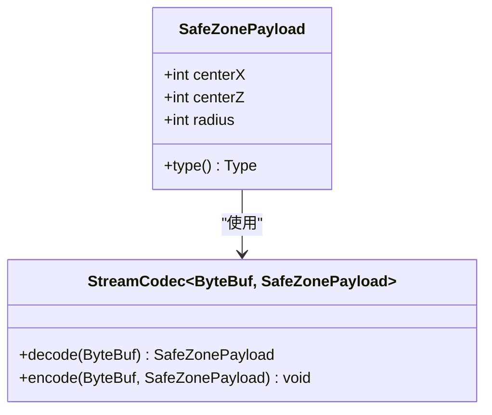
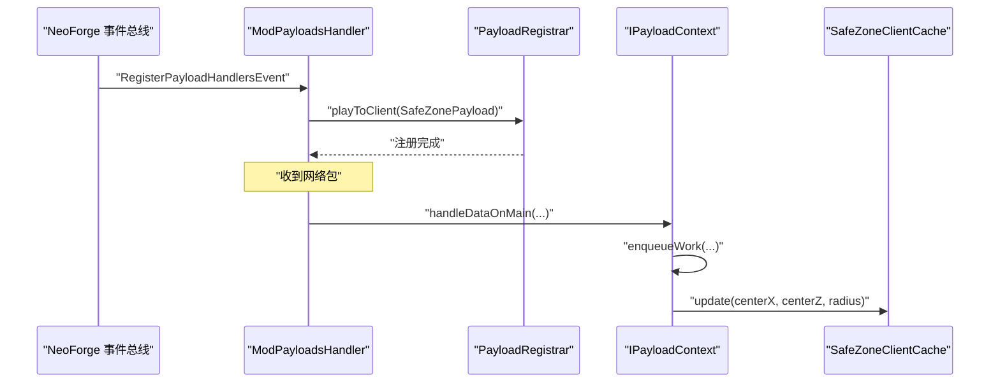
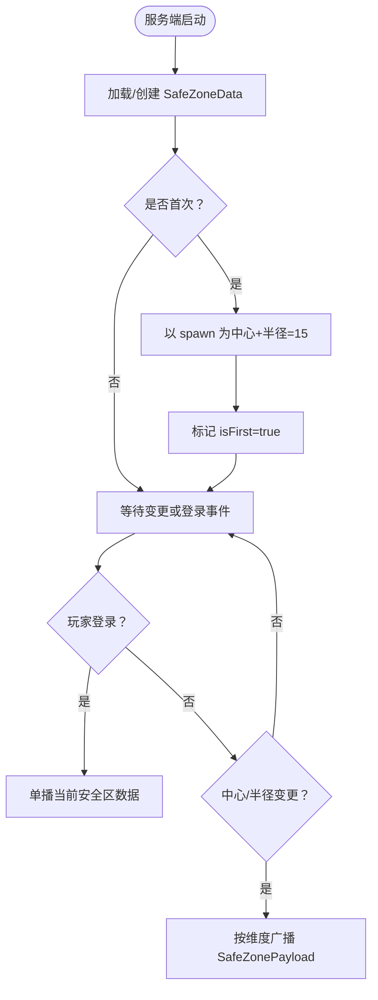
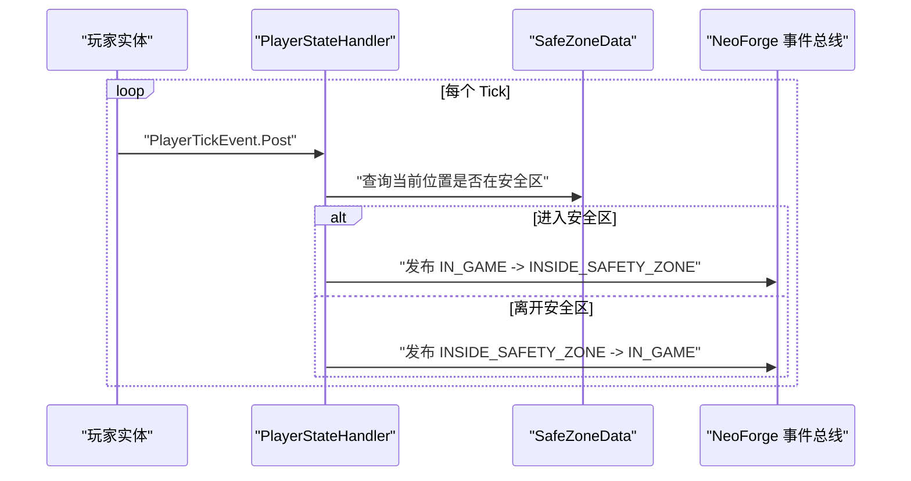
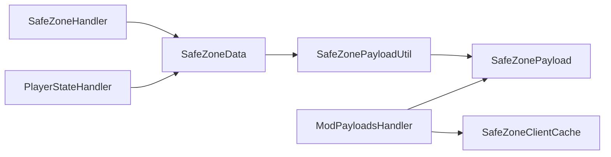

# 网络同步机制

<cite>
**本文引用的文件**
- [SafeZonePayload.java](file://Beyond/src/main/java/com/pz/beyond/network/SafeZonePayload.java)
- [ModPayloadsHandler.java](file://Beyond/src/main/java/com/pz/beyond/event/ModPayloadsHandler.java)
- [SafeZoneData.java](file://Beyond/src/main/java/com/pz/beyond/data/SafeZoneData.java)
- [SafeZoneClientCache.java](file://Beyond/src/main/java/com/pz/beyond/data/SafeZoneClientCache.java)
- [SafeZonePayloadUtil.java](file://Beyond/src/main/java/com/pz/beyond/util/SafeZonePayloadUtil.java)
- [SafeZoneHandler.java](file://Beyond/src/main/java/com/pz/beyond/event/SafeZoneHandler.java)
- [PlayerStateHandler.java](file://Beyond/src/main/java/com/pz/beyond/event/PlayerStateHandler.java)
- [Beyond.java](file://Beyond/src/main/java/com/pz/beyond/Beyond.java)
- [Config.java](file://Beyond/src/main/java/com/pz/beyond/Config.java)
- [beyond.mixins.json](file://Beyond/src/main/resources/beyond.mixins.json)
</cite>

## 目录
1. [引言](#引言)
2. [项目结构](#项目结构)
3. [核心组件](#核心组件)
4. [架构总览](#架构总览)
5. [详细组件分析](#详细组件分析)
6. [依赖分析](#依赖分析)
7. [性能考虑](#性能考虑)
8. [故障排查指南](#故障排查指南)
9. [结论](#结论)
10. [附录](#附录)

## 引言
本文件聚焦于“Beyond”模组中的网络同步机制，围绕安全区（Safe Zone）数据的客户端-服务器同步展开，系统性阐述以下内容：
- SafeZonePayload 自定义网络包的设计与实现
- 客户端-服务器间的安全区数据同步流程与协议设计
- ModPayloadsHandler 消息处理器的注册与处理逻辑
- 网络包的序列化、压缩与传输优化策略
- 安全区事件的实时同步、延迟补偿与重连处理机制
- 性能监控、带宽控制与错误恢复方案
- 网络安全、防作弊与数据完整性验证的实现细节

## 项目结构
本项目采用模块化组织，网络相关代码集中在 Beyond 模组中，主要涉及网络包定义、消息处理器注册、服务端数据存储与广播、客户端缓存与处理等模块。

图表来源
- [SafeZonePayload.java:1-31](file://Beyond/src/main/java/com/pz/beyond/network/SafeZonePayload.java#L1-L31)
- [ModPayloadsHandler.java:1-35](file://Beyond/src/main/java/com/pz/beyond/event/ModPayloadsHandler.java#L1-L35)
- [SafeZoneData.java:1-101](file://Beyond/src/main/java/com/pz/beyond/data/SafeZoneData.java#L1-L101)
- [SafeZonePayloadUtil.java:1-32](file://Beyond/src/main/java/com/pz/beyond/util/SafeZonePayloadUtil.java#L1-L32)
- [SafeZoneHandler.java:1-77](file://Beyond/src/main/java/com/pz/beyond/event/SafeZoneHandler.java#L1-L77)
- [PlayerStateHandler.java:1-80](file://Beyond/src/main/java/com/pz/beyond/event/PlayerStateHandler.java#L1-L80)
- [SafeZoneClientCache.java:1-30](file://Beyond/src/main/java/com/pz/beyond/data/SafeZoneClientCache.java#L1-L30)
- [Beyond.java:1-79](file://Beyond/src/main/java/com/pz/beyond/Beyond.java#L1-L79)
- [Config.java:1-20](file://Beyond/src/main/java/com/pz/beyond/Config.java#L1-L20)

章节来源
- [Beyond.java:1-79](file://Beyond/src/main/java/com/pz/beyond/Beyond.java#L1-L79)
- [Config.java:1-20](file://Beyond/src/main/java/com/pz/beyond/Config.java#L1-L20)
- [beyond.mixins.json:1-17](file://Beyond/src/main/resources/beyond.mixins.json#L1-L17)

## 核心组件
- 自定义网络包 SafeZonePayload：承载安全区中心坐标与半径的最小必要字段，使用流编解码器进行高效序列化。
- 消息处理器 ModPayloadsHandler：在游戏生命周期中注册 Play-to-Client 协议，绑定类型、编解码器与客户端处理回调。
- 服务端数据 SafeZoneData：保存安全区中心与半径，并提供更新接口；变更后通过工具类广播至所有在线玩家。
- 工具类 SafeZonePayloadUtil：封装单播与广播发送逻辑，基于维度的 PacketDistributor 实现按世界分发。
- 客户端缓存 SafeZoneClientCache：静态缓存当前安全区参数，供渲染与判定使用。
- 事件层 SafeZoneHandler 与 PlayerStateHandler：前者负责服务端启动时初始化安全区并为新玩家单播；后者在 Tick 中根据位置判断玩家状态并触发规则。
- 配置与入口 Beyond/Config：注册附件、初始化规则、加载配置。

章节来源
- [SafeZonePayload.java:10-30](file://Beyond/src/main/java/com/pz/beyond/network/SafeZonePayload.java#L10-L30)
- [ModPayloadsHandler.java:14-32](file://Beyond/src/main/java/com/pz/beyond/event/ModPayloadsHandler.java#L14-L32)
- [SafeZoneData.java:16-79](file://Beyond/src/main/java/com/pz/beyond/data/SafeZoneData.java#L16-L79)
- [SafeZonePayloadUtil.java:9-31](file://Beyond/src/main/java/com/pz/beyond/util/SafeZonePayloadUtil.java#L9-L31)
- [SafeZoneClientCache.java:6-28](file://Beyond/src/main/java/com/pz/beyond/data/SafeZoneClientCache.java#L6-L28)
- [SafeZoneHandler.java:44-68](file://Beyond/src/main/java/com/pz/beyond/event/SafeZoneHandler.java#L44-L68)
- [PlayerStateHandler.java:26-66](file://Beyond/src/main/java/com/pz/beyond/event/PlayerStateHandler.java#L26-L66)
- [Beyond.java:46-65](file://Beyond/src/main/java/com/pz/beyond/Beyond.java#L46-L65)
- [Config.java:6-17](file://Beyond/src/main/java/com/pz/beyond/Config.java#L6-L17)

## 架构总览
下图展示了从服务端数据变更到客户端缓存更新的完整链路，以及事件驱动的初始化与状态切换流程。

图表来源
- [SafeZoneData.java:60-74](file://Beyond/src/main/java/com/pz/beyond/data/SafeZoneData.java#L60-L74)
- [SafeZonePayloadUtil.java:26-30](file://Beyond/src/main/java/com/pz/beyond/util/SafeZonePayloadUtil.java#L26-L30)
- [ModPayloadsHandler.java:14-32](file://Beyond/src/main/java/com/pz/beyond/event/ModPayloadsHandler.java#L14-L32)
- [SafeZoneClientCache.java:12-16](file://Beyond/src/main/java/com/pz/beyond/data/SafeZoneClientCache.java#L12-L16)

## 详细组件分析

### SafeZonePayload 自定义网络包
- 设计要点
  - 字段精简：仅包含中心 X、中心 Z、半径三个整型字段，满足方形安全区判定需求。
  - 类型标识：使用 ResourceLocation 命名空间与 ID 组合生成唯一 TYPE，避免冲突。
  - 流编解码：采用复合 StreamCodec，按 INT 顺序编码/解码，保证跨版本兼容与高性能。
- 序列化与传输
  - 使用 ByteBufCodecs.INT 进行二进制序列化，紧凑且可预测大小。
  - 未见显式压缩逻辑，建议在高频率更新场景下结合带宽控制策略。
- 可扩展性
  - 若需携带时间戳或校验值，可在保持 TYPE 不变的前提下扩展字段，但需确保客户端/服务端一致升级。

图表来源
- [SafeZonePayload.java:10-30](file://Beyond/src/main/java/com/pz/beyond/network/SafeZonePayload.java#L10-L30)

章节来源
- [SafeZonePayload.java:10-30](file://Beyond/src/main/java/com/pz/beyond/network/SafeZonePayload.java#L10-L30)

### ModPayloadsHandler 消息处理器注册与处理
- 注册流程
  - 在 RegisterPayloadHandlersEvent 中注册 Play-to-Client 协议，版本号字符串为 "1"。
  - 绑定 SafeZonePayload.TYPE 与 STREAM_CODEC，并指定客户端处理回调。
- 客户端处理
  - 回调在主线程上下文执行，通过 enqueueWork 将缓存更新操作入队，避免线程安全问题。
  - 更新 SafeZoneClientCache 的中心与半径，供渲染与判定使用。

图表来源
- [ModPayloadsHandler.java:14-32](file://Beyond/src/main/java/com/pz/beyond/event/ModPayloadsHandler.java#L14-L32)

章节来源
- [ModPayloadsHandler.java:14-32](file://Beyond/src/main/java/com/pz/beyond/event/ModPayloadsHandler.java#L14-L32)

### 安全区数据同步流程与协议设计
- 初始化与重连
  - 服务端启动时读取/创建 SafeZoneData，若首次则以主生点为中心并设置半径，随后标记 isFirst。
  - 新玩家登录时，服务端主动单播一次当前安全区数据，确保客户端即时可用。
- 变更广播
  - 任何中心或半径变更都会触发 setDirty 并通过 SafeZonePayloadUtil 广播至当前维度的所有玩家。
- 协议版本
  - 注册阶段使用版本号 "1"，便于未来协议演进与向后兼容。

图表来源
- [SafeZoneHandler.java:44-68](file://Beyond/src/main/java/com/pz/beyond/event/SafeZoneHandler.java#L44-L68)
- [SafeZoneData.java:60-74](file://Beyond/src/main/java/com/pz/beyond/data/SafeZoneData.java#L60-L74)
- [SafeZonePayloadUtil.java:26-30](file://Beyond/src/main/java/com/pz/beyond/util/SafeZonePayloadUtil.java#L26-L30)

章节来源
- [SafeZoneHandler.java:44-68](file://Beyond/src/main/java/com/pz/beyond/event/SafeZoneHandler.java#L44-L68)
- [SafeZoneData.java:16-79](file://Beyond/src/main/java/com/pz/beyond/data/SafeZoneData.java#L16-L79)
- [SafeZonePayloadUtil.java:9-31](file://Beyond/src/main/java/com/pz/beyond/util/SafeZonePayloadUtil.java#L9-L31)

### 客户端-服务器交互与状态同步
- 状态判定与事件
  - 每个玩家 Tick，检查其位置是否在安全区内，维护 PlayerStateData 并发布状态切换事件。
  - 规则监听器根据状态执行相应逻辑（如免伤、外部生效等）。
- 同步时机
  - 登录即单播一次，确保客户端立即获得最新数据。
  - 服务端变更后广播，客户端异步入队更新，避免 UI 抖动。

图表来源
- [PlayerStateHandler.java:26-66](file://Beyond/src/main/java/com/pz/beyond/event/PlayerStateHandler.java#L26-L66)
- [SafeZoneData.java:48-57](file://Beyond/src/main/java/com/pz/beyond/data/SafeZoneData.java#L48-L57)

章节来源
- [PlayerStateHandler.java:26-77](file://Beyond/src/main/java/com/pz/beyond/event/PlayerStateHandler.java#L26-L77)
- [SafeZoneData.java:48-57](file://Beyond/src/main/java/com/pz/beyond/data/SafeZoneData.java#L48-L57)

### 序列化、压缩与传输优化策略
- 序列化
  - 使用 StreamCodec.composite 与 ByteBufCodecs.INT，字段顺序固定，解析快速且稳定。
- 压缩
  - 未发现显式压缩实现；对于频繁更新场景，建议：
    - 合并更新：在服务端聚合一段时间内的变更，批量发送。
    - 差量更新：仅发送变化字段或阈值触发。
    - 带宽节流：限制每玩家每秒最大包数与字节数。
- 传输
  - 使用 PacketDistributor.sendToPlayersInDimension 按维度广播，减少无关玩家的网络负载。
  - 建议：在高密度服务器上可考虑按距离裁剪目标玩家列表，进一步降低广播成本。

章节来源
- [SafeZonePayload.java:21-29](file://Beyond/src/main/java/com/pz/beyond/network/SafeZonePayload.java#L21-L29)
- [SafeZonePayloadUtil.java:26-30](file://Beyond/src/main/java/com/pz/beyond/util/SafeZonePayloadUtil.java#L26-L30)

### 实时同步、延迟补偿与重连处理
- 实时性
  - 变更即刻广播，客户端入队更新，响应迅速。
- 延迟补偿
  - 当前实现未包含时间戳或插值补偿；若需要，可在 SafeZonePayload 扩展字段并引入客户端本地时钟校准。
- 重连处理
  - 登录事件中单播一次，确保断线重连后客户端立即获得最新状态。
  - 建议：在客户端侧增加幂等更新与去抖动，避免重复更新导致的闪烁。

章节来源
- [SafeZoneHandler.java:60-68](file://Beyond/src/main/java/com/pz/beyond/event/SafeZoneHandler.java#L60-L68)
- [ModPayloadsHandler.java:27-31](file://Beyond/src/main/java/com/pz/beyond/event/ModPayloadsHandler.java#L27-L31)

### 性能监控、带宽控制与错误恢复
- 性能监控
  - 建议统计每维度每秒包数、字节数与平均延迟，结合日志输出或指标系统。
- 带宽控制
  - 限制广播频率与合并更新；对高频区域可采用分片广播或按玩家距离裁剪。
- 错误恢复
  - 客户端处理失败时记录错误并回退到上次有效缓存；服务端对异常包忽略并继续运行。

[本节为通用指导，不直接分析具体文件]

### 网络安全、防作弊与数据完整性
- 数据完整性
  - 使用固定字段顺序与紧凑类型，降低解析歧义；建议在后续版本引入校验和或签名。
- 防作弊
  - 服务端始终作为权威源，客户端仅用于展示；所有业务判定应在服务端完成。
  - 对异常包（如超大半径、非法坐标）进行严格校验与丢弃。
- 认证与加密
  - 当前未见专用认证/加密实现；若需，可结合服务器端口令或 TLS 层增强。

[本节为通用指导，不直接分析具体文件]

## 依赖分析
- 组件耦合
  - SafeZoneData 与 SafeZonePayloadUtil 松耦合，通过数据对象传递；广播路径清晰。
  - ModPayloadsHandler 仅依赖 TYPE 与 STREAM_CODEC，职责单一。
  - 客户端缓存 SafeZoneClientCache 与事件层解耦，便于独立演进。
- 外部依赖
  - NeoForge 事件总线与网络框架；Netty ByteBuf 用于底层缓冲。
- 潜在风险
  - 若广播过于频繁，可能造成网络拥塞；建议引入合并与限速策略。

图表来源
- [SafeZoneData.java:60-74](file://Beyond/src/main/java/com/pz/beyond/data/SafeZoneData.java#L60-L74)
- [SafeZonePayloadUtil.java:26-30](file://Beyond/src/main/java/com/pz/beyond/util/SafeZonePayloadUtil.java#L26-L30)
- [SafeZonePayload.java:10-30](file://Beyond/src/main/java/com/pz/beyond/network/SafeZonePayload.java#L10-L30)
- [ModPayloadsHandler.java:14-32](file://Beyond/src/main/java/com/pz/beyond/event/ModPayloadsHandler.java#L14-L32)
- [SafeZoneClientCache.java:6-28](file://Beyond/src/main/java/com/pz/beyond/data/SafeZoneClientCache.java#L6-L28)
- [SafeZoneHandler.java:44-68](file://Beyond/src/main/java/com/pz/beyond/event/SafeZoneHandler.java#L44-L68)
- [PlayerStateHandler.java:26-66](file://Beyond/src/main/java/com/pz/beyond/event/PlayerStateHandler.java#L26-L66)

章节来源
- [SafeZoneData.java:16-79](file://Beyond/src/main/java/com/pz/beyond/data/SafeZoneData.java#L16-L79)
- [SafeZonePayloadUtil.java:9-31](file://Beyond/src/main/java/com/pz/beyond/util/SafeZonePayloadUtil.java#L9-L31)
- [SafeZonePayload.java:10-30](file://Beyond/src/main/java/com/pz/beyond/network/SafeZonePayload.java#L10-L30)
- [ModPayloadsHandler.java:14-32](file://Beyond/src/main/java/com/pz/beyond/event/ModPayloadsHandler.java#L14-L32)
- [SafeZoneClientCache.java:6-28](file://Beyond/src/main/java/com/pz/beyond/data/SafeZoneClientCache.java#L6-L28)
- [SafeZoneHandler.java:44-68](file://Beyond/src/main/java/com/pz/beyond/event/SafeZoneHandler.java#L44-L68)
- [PlayerStateHandler.java:26-66](file://Beyond/src/main/java/com/pz/beyond/event/PlayerStateHandler.java#L26-L66)

## 性能考虑
- 包体大小
  - 三个 INT 字段，单包约 12 字节，开销极低。
- 广播范围
  - 按维度广播，避免跨维度无效流量；建议在大型世界中按区块或距离裁剪。
- 更新频率
  - 高频变更建议合并与节流，避免网络风暴。
- 客户端渲染
  - 渲染器目前为空实现，建议在渲染层使用缓存与去抖动，减少 UI 抖动。

[本节提供一般性建议，不直接分析具体文件]

## 故障排查指南
- 客户端未显示安全区
  - 检查登录事件是否触发单播；确认 ModPayloadsHandler 是否正确注册。
- 数据不同步
  - 确认 SafeZoneData 的 setDirty 是否被调用；检查广播是否成功发送。
- 包解析异常
  - 核对字段顺序与类型；确保客户端/服务端版本一致。
- 性能问题
  - 监控每维度包量与字节数；评估是否需要合并更新或限速。

章节来源
- [SafeZoneHandler.java:60-68](file://Beyond/src/main/java/com/pz/beyond/event/SafeZoneHandler.java#L60-L68)
- [ModPayloadsHandler.java:14-32](file://Beyond/src/main/java/com/pz/beyond/event/ModPayloadsHandler.java#L14-L32)
- [SafeZonePayloadUtil.java:26-30](file://Beyond/src/main/java/com/pz/beyond/util/SafeZonePayloadUtil.java#L26-L30)

## 结论
本网络同步机制以最小包体与明确协议实现了安全区数据的可靠同步。通过事件驱动的初始化、登录单播与按维度广播，确保了客户端的即时可用与低延迟更新。建议在未来版本中引入带宽控制、差量更新与数据完整性校验，以进一步提升稳定性与安全性。

## 附录
- 版本与配置
  - 配置规范已预留构建入口，当前为空配置。
  - 混淆与注入配置文件存在，但未包含具体 mixin 内容。

章节来源
- [Config.java:6-17](file://Beyond/src/main/java/com/pz/beyond/Config.java#L6-L17)
- [beyond.mixins.json:1-17](file://Beyond/src/main/resources/beyond.mixins.json#L1-L17)