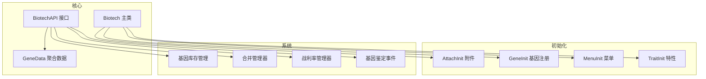
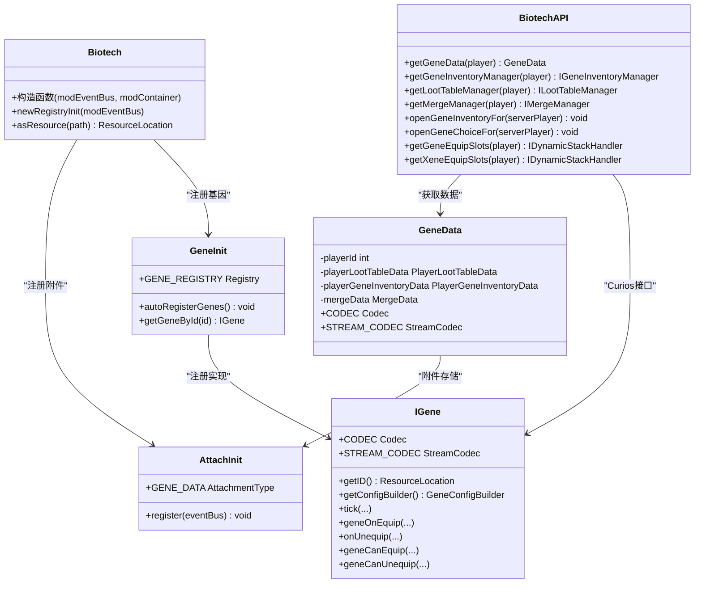
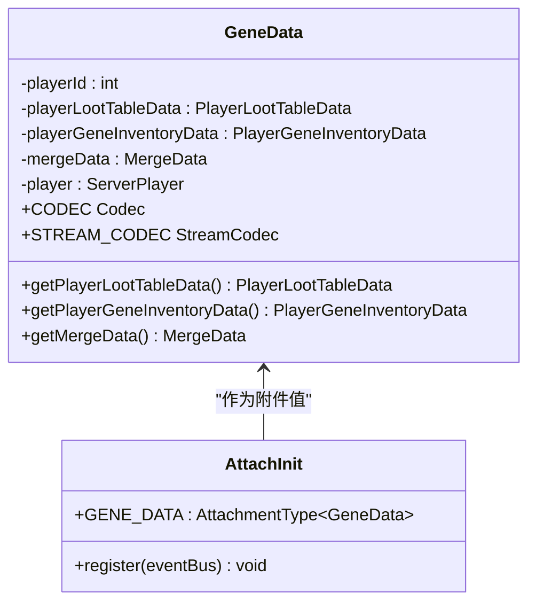
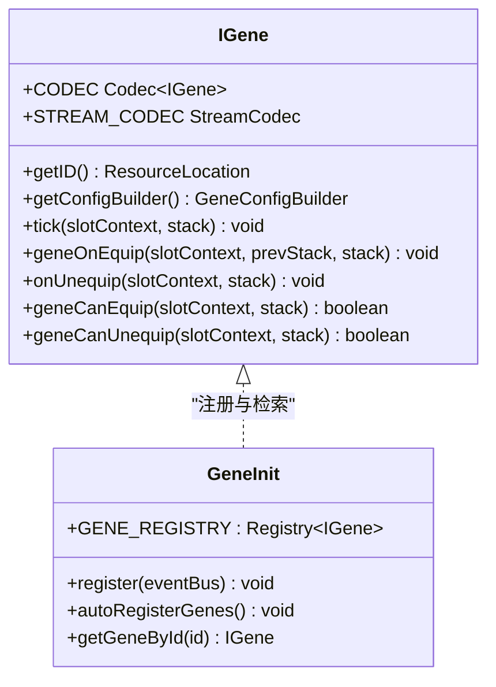
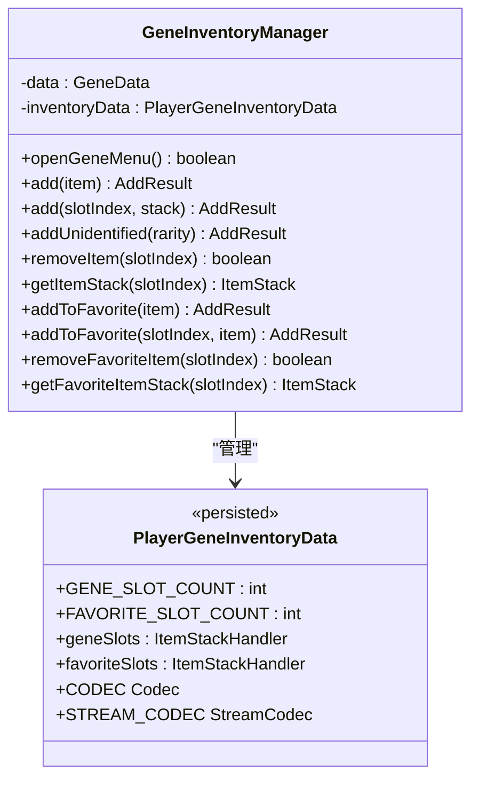
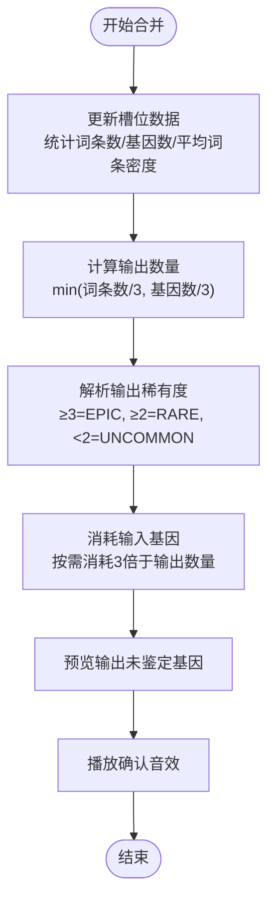
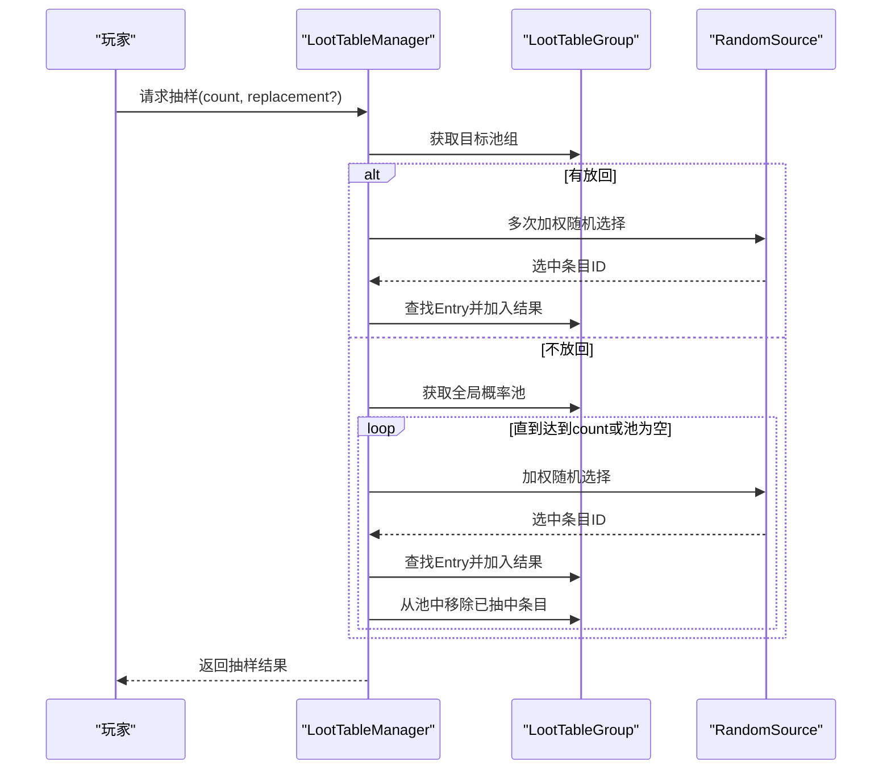
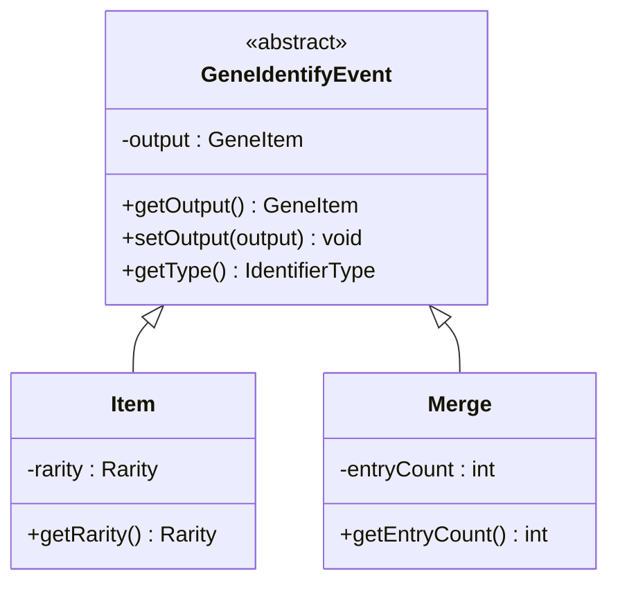
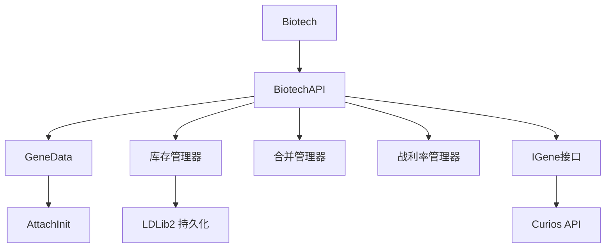

# Biotech基因科技模块

<cite>
**本文档引用的文件**
- [Biotech.java](file://Biotech/src/main/java/org/biotech/Biotech.java)
- [BiotechAPI.java](file://Biotech/src/main/java/org/biotech/api/BiotechAPI.java)
- [GeneData.java](file://Biotech/src/main/java/org/biotech/api/GeneData.java)
- [AttachInit.java](file://Biotech/src/main/java/org/biotech/api/init/AttachInit.java)
- [GeneInit.java](file://Biotech/src/main/java/org/biotech/api/init/GeneInit.java)
- [IGene.java](file://Biotech/src/main/java/org/biotech/api/system/gene/core/IGene.java)
- [GeneInventoryManager.java](file://Biotech/src/main/java/org/biotech/api/system/gene/inventory/GeneInventoryManager.java)
- [PlayerGeneInventoryData.java](file://Biotech/src/main/java/org/biotech/api/system/gene/inventory/PlayerGeneInventoryData.java)
- [MergeManager.java](file://Biotech/src/main/java/org/biotech/api/system/merge/MergeManager.java)
- [LootTableManager.java](file://Biotech/src/main/java/org/biotech/api/system/loot/LootTableManager.java)
- [GeneIdentifyEvent.java](file://Biotech/src/main/java/org/biotech/api/event/custom/GeneIdentifyEvent.java)
</cite>

## 目录
1. [简介](#简介)
2. [项目结构](#项目结构)
3. [核心组件](#核心组件)
4. [架构总览](#架构总览)
5. [详细组件分析](#详细组件分析)
6. [依赖关系分析](#依赖关系分析)
7. [性能考虑](#性能考虑)
8. [故障排除指南](#故障排除指南)
9. [结论](#结论)
10. [附录](#附录)

## 简介
本文件为Biotech基因科技模块的综合技术文档，面向开发者与模组集成者，系统阐述基因科技系统的设计理念、架构与实现细节。内容涵盖基因数据模型、基因库存管理、未鉴定基因系统、基因合并算法、BiotechAPI接口设计、核心数据结构与业务逻辑、初始化流程、事件处理机制、网络通信协议以及与其他模块的交互方式与数据交换格式。文档同时提供使用示例与扩展指南，帮助读者快速理解并安全地扩展该系统。

## 项目结构
Biotech模块采用分层与功能域结合的组织方式：
- 核心入口与初始化：Biotech主类负责注册基因、附件、菜单、能力等，并加载服务器配置。
- API层：对外暴露BiotechAPI，提供统一访问入口；内部定义GeneData聚合数据与序列化编解码。
- 系统子模块：基因系统、库存系统、合并系统、战利率系统、事件系统等。
- 初始化子系统：AttachInit（附件）、GeneInit（基因注册）、MenuInit（菜单）、TraitInit（特性）等。
- 容器与UI：容器、菜单与客户端渲染装饰器。
- 网络通信：合并包（MergePacket）等。

图表来源
- [Biotech.java:16-73](file://Biotech/src/main/java/org/biotech/Biotech.java#L16-L73)
- [BiotechAPI.java:18-92](file://Biotech/src/main/java/org/biotech/api/BiotechAPI.java#L18-L92)
- [AttachInit.java:12-34](file://Biotech/src/main/java/org/biotech/api/init/AttachInit.java#L12-L34)
- [GeneInit.java:21-107](file://Biotech/src/main/java/org/biotech/api/init/GeneInit.java#L21-L107)

章节来源
- [Biotech.java:16-73](file://Biotech/src/main/java/org/biotech/Biotech.java#L16-L73)

## 核心组件
本节概述模块的关键组件及其职责：
- Biotech主类：负责注册与初始化，绑定事件总线，注册配置与各类初始化器。
- BiotechAPI：对外提供统一接口，包括获取玩家基因数据、打开界面、Curios槽位访问等。
- GeneData：聚合玩家的基因相关数据（战利率、库存、合并），支持延迟初始化与网络编解码。
- 附件系统：通过AttachInit注册GeneData附件，实现玩家数据的生命周期管理与网络同步。
- 基因注册系统：通过GeneInit注册IGene类型，支持代码注册与自动扫描注册。
- 系统管理器：库存管理器、合并管理器、战利率管理器分别处理不同业务域。
- 事件系统：提供基因鉴定事件，支持监听器修改输出结果。

章节来源
- [BiotechAPI.java:18-92](file://Biotech/src/main/java/org/biotech/api/BiotechAPI.java#L18-L92)
- [GeneData.java:14-101](file://Biotech/src/main/java/org/biotech/api/GeneData.java#L14-L101)
- [AttachInit.java:12-34](file://Biotech/src/main/java/org/biotech/api/init/AttachInit.java#L12-L34)
- [GeneInit.java:21-107](file://Biotech/src/main/java/org/biotech/api/init/GeneInit.java#L21-L107)

## 架构总览
下图展示Biotech模块的核心架构与组件交互：

图表来源
- [Biotech.java:16-73](file://Biotech/src/main/java/org/biotech/Biotech.java#L16-L73)
- [BiotechAPI.java:18-92](file://Biotech/src/main/java/org/biotech/api/BiotechAPI.java#L18-L92)
- [GeneData.java:14-101](file://Biotech/src/main/java/org/biotech/api/GeneData.java#L14-L101)
- [AttachInit.java:12-34](file://Biotech/src/main/java/org/biotech/api/init/AttachInit.java#L12-L34)
- [GeneInit.java:21-107](file://Biotech/src/main/java/org/biotech/api/init/GeneInit.java#L21-L107)
- [IGene.java:15-91](file://Biotech/src/main/java/org/biotech/api/system/gene/core/IGene.java#L15-L91)

## 详细组件分析

### 基因数据模型与附件系统
- GeneData作为聚合根，包含战利率、库存与合并三部分数据，均支持延迟初始化，避免不必要的内存占用。
- 通过AttachInit注册的附件类型，实现对每个玩家的独立数据实例化与序列化，支持服务端到客户端的网络同步。
- 编解码器使用RecordCodecBuilder与StreamCodec组合，保证序列化与网络传输的稳定性与一致性。

图表来源
- [GeneData.java:14-101](file://Biotech/src/main/java/org/biotech/api/GeneData.java#L14-L101)
- [AttachInit.java:12-34](file://Biotech/src/main/java/org/biotech/api/init/AttachInit.java#L12-L34)

章节来源
- [GeneData.java:14-101](file://Biotech/src/main/java/org/biotech/api/GeneData.java#L14-L101)
- [AttachInit.java:12-34](file://Biotech/src/main/java/org/biotech/api/init/AttachInit.java#L12-L34)

### 基因注册与Curios接口
- IGene接口继承Curios的ICurioItem，提供装备/卸下/可装备判定等钩子，便于与Curios生态无缝集成。
- GeneInit负责注册IGene类型，支持代码注册与自动扫描注册，提供按ID检索与空基因占位。
- IGene定义了基于ResourceLocation的编解码器，支持网络传输时的空值处理。

图表来源
- [IGene.java:15-91](file://Biotech/src/main/java/org/biotech/api/system/gene/core/IGene.java#L15-L91)
- [GeneInit.java:21-107](file://Biotech/src/main/java/org/biotech/api/init/GeneInit.java#L21-L107)

章节来源
- [IGene.java:15-91](file://Biotech/src/main/java/org/biotech/api/system/gene/core/IGene.java#L15-L91)
- [GeneInit.java:21-107](file://Biotech/src/main/java/org/biotech/api/init/GeneInit.java#L21-L107)

### 基因库存管理
- GeneInventoryManager提供对玩家基因库存的增删改查与收藏管理，支持指定槽位或自动分配空槽位。
- PlayerGeneInventoryData定义了固定页数与每页槽位数的库存布局，使用LDLib2的IPersistedSerializable简化持久化与网络编解码。
- 库存槽位仅接受IGeneItem类型，确保数据一致性。

图表来源
- [GeneInventoryManager.java:15-186](file://Biotech/src/main/java/org/biotech/api/system/gene/inventory/GeneInventoryManager.java#L15-L186)
- [PlayerGeneInventoryData.java:16-72](file://Biotech/src/main/java/org/biotech/api/system/gene/inventory/PlayerGeneInventoryData.java#L16-L72)

章节来源
- [GeneInventoryManager.java:15-186](file://Biotech/src/main/java/org/biotech/api/system/gene/inventory/GeneInventoryManager.java#L15-L186)
- [PlayerGeneInventoryData.java:16-72](file://Biotech/src/main/java/org/biotech/api/system/gene/inventory/PlayerGeneInventoryData.java#L16-L72)

### 未鉴定基因系统与合并算法
- 合并管理器根据输入槽位中基因的词条总数与平均词条密度，计算输出未鉴定基因的数量与稀有度。
- 合并规则：每3个词条或3个输入基因才产生1个输出；稀有度阈值分别为≥3与≥2；Epic必定双词条，Rare高概率双词条，Uncommon低概率双词条。
- 合并过程会消耗对应数量的输入基因，更新缓存并预览输出，最终发放未鉴定基因。

图表来源
- [MergeManager.java:15-207](file://Biotech/src/main/java/org/biotech/api/system/merge/MergeManager.java#L15-L207)

章节来源
- [MergeManager.java:15-207](file://Biotech/src/main/java/org/biotech/api/system/merge/MergeManager.java#L15-L207)

### 战利率系统与数据交换
- LootTableManager负责管理玩家的战利率表组，支持合并数据包中的战利率表、权重调整、有放回/不放回抽样。
- 提供修改器接口以动态调整池权重，支持按名称批量设置权重。
- 抽样采用加权随机算法，支持不放回策略以避免重复抽取。

图表来源
- [LootTableManager.java:21-190](file://Biotech/src/main/java/org/biotech/api/system/loot/LootTableManager.java#L21-L190)

章节来源
- [LootTableManager.java:21-190](file://Biotech/src/main/java/org/biotech/api/system/loot/LootTableManager.java#L21-L190)

### 事件处理机制
- GeneIdentifyEvent抽象事件，定义两种子类型：Item（输入稀有度）与Merge（输入词条数量）。
- 事件不可取消，但监听器可修改输出结果，便于在不同场景下定制化产出。

图表来源
- [GeneIdentifyEvent.java:16-108](file://Biotech/src/main/java/org/biotech/api/event/custom/GeneIdentifyEvent.java#L16-L108)

章节来源
- [GeneIdentifyEvent.java:16-108](file://Biotech/src/main/java/org/biotech/api/event/custom/GeneIdentifyEvent.java#L16-L108)

### 初始化流程与网络通信
- Biotech主类在构造函数中完成注册项初始化、服务器配置注册与Curios属性事件显式订阅。
- BiotechAPI提供打开他人基因界面的方法，内部通过能力接口打开菜单。
- IGene定义了基于ResourceLocation的编解码器与网络StreamCodec，支持空值与占位符处理，确保网络传输稳定。

章节来源
- [Biotech.java:23-61](file://Biotech/src/main/java/org/biotech/Biotech.java#L23-L61)
- [BiotechAPI.java:47-90](file://Biotech/src/main/java/org/biotech/api/BiotechAPI.java#L47-L90)
- [IGene.java:67-87](file://Biotech/src/main/java/org/biotech/api/system/gene/core/IGene.java#L67-L87)

## 依赖关系分析
- 组件耦合与内聚：BiotechAPI作为门面，将各子系统能力暴露给外部；GeneData作为聚合根，集中管理子系统数据，降低跨模块耦合。
- 外部依赖：Curios API用于装备槽位与属性修饰；LDLib2用于持久化与编解码；NeoForge事件总线与附件系统用于生命周期管理。
- 潜在循环依赖：当前结构通过门面与聚合根避免直接循环依赖，建议新增模块时遵循“向上依赖”原则。

图表来源
- [Biotech.java:16-73](file://Biotech/src/main/java/org/biotech/Biotech.java#L16-L73)
- [BiotechAPI.java:18-92](file://Biotech/src/main/java/org/biotech/api/BiotechAPI.java#L18-L92)
- [AttachInit.java:12-34](file://Biotech/src/main/java/org/biotech/api/init/AttachInit.java#L12-L34)
- [IGene.java:12-14](file://Biotech/src/main/java/org/biotech/api/system/gene/core/IGene.java#L12-L14)

## 性能考虑
- 延迟初始化：GeneData的三类子数据均采用延迟初始化，减少空闲玩家的内存占用。
- 编解码优化：使用RecordCodecBuilder与StreamCodec，配合LDLib2的持久化框架，提升序列化/反序列化效率。
- 合并计算缓存：MergeManager在槽位变化时缓存词条数、平均词条密度与输出数量，避免重复计算。
- 抽样算法：加权随机采用累积概率法，时间复杂度O(n)，适合中小规模池大小；若池过大可考虑前缀和优化。

## 故障排除指南
- 合并无输出：检查输入槽位是否满足“至少3个词条或3个基因”的条件；确认平均词条密度是否达到稀有度阈值。
- 库存无法放入：确认目标槽位是否为空且属于IGeneItem类型；检查页码与布局是否正确。
- Curios槽位不可用：确认Curios插件已正确安装且槽位ID与注册一致；通过BiotechAPI提供的方法进行访问。
- 附件数据未同步：检查附件注册与序列化编解码是否正确；确认服务端与客户端版本一致。

章节来源
- [MergeManager.java:107-157](file://Biotech/src/main/java/org/biotech/api/system/merge/MergeManager.java#L107-L157)
- [PlayerGeneInventoryData.java:57-68](file://Biotech/src/main/java/org/biotech/api/system/gene/inventory/PlayerGeneInventoryData.java#L57-L68)
- [BiotechAPI.java:75-90](file://Biotech/src/main/java/org/biotech/api/BiotechAPI.java#L75-L90)
- [AttachInit.java:19-31](file://Biotech/src/main/java/org/biotech/api/init/AttachInit.java#L19-L31)

## 结论
Biotech基因科技模块以清晰的分层架构与强内聚的子系统实现了完整的基因科技体验：从数据模型到UI交互，从库存管理到合并算法，再到战利率系统与事件机制，均体现了模块化的工程实践。通过BiotechAPI统一对外接口与编解码协议，模块具备良好的扩展性与兼容性，适合进一步拓展新基因、新特性与新玩法。

## 附录

### 使用示例与扩展指南
- 获取玩家基因数据：通过BiotechAPI.getGeneData(player)获取GeneData实例，随后访问库存、战利率与合并数据。
- 打开他人基因界面：使用BiotechAPI.openGeneInventoryFor(serverPlayer)打开目标玩家的基因库存界面。
- 自动注册基因：在实现类上添加@AutoInit注解，系统启动时将自动扫描并注册。
- 动态调整战利率：使用LootTableManager.modify(...)修改池权重，或通过setWeightByName批量调整。
- 扩展基因类型：实现IGene接口并注册到GeneInit，即可参与Curios生态与合并系统。

章节来源
- [BiotechAPI.java:27-60](file://Biotech/src/main/java/org/biotech/api/BiotechAPI.java#L27-L60)
- [GeneInit.java:72-80](file://Biotech/src/main/java/org/biotech/api/init/GeneInit.java#L72-L80)
- [LootTableManager.java:45-52](file://Biotech/src/main/java/org/biotech/api/system/loot/LootTableManager.java#L45-L52)