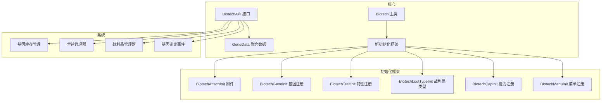
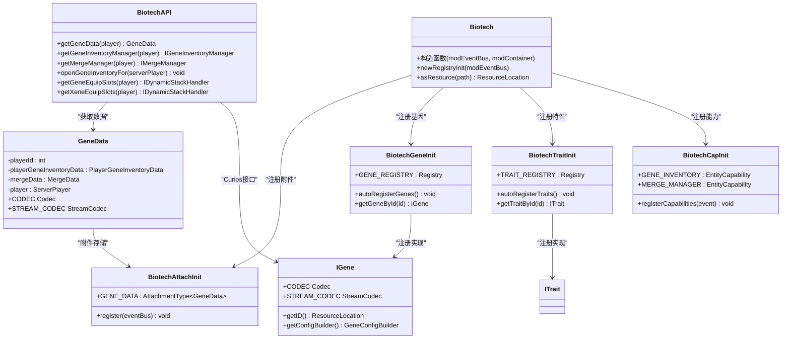
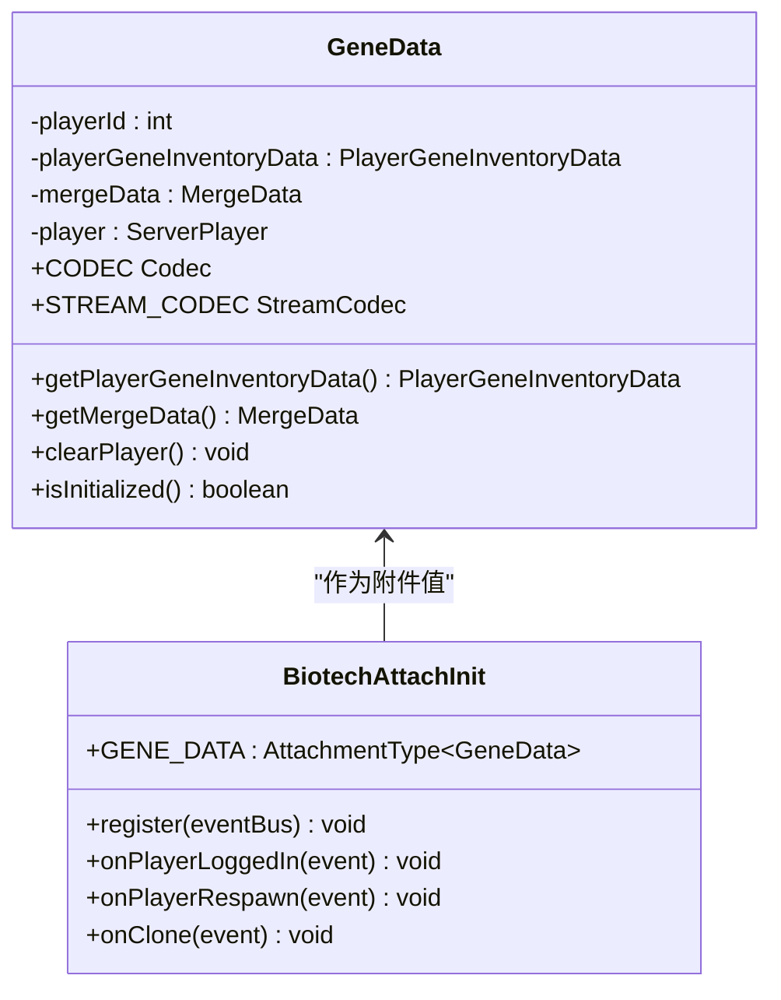
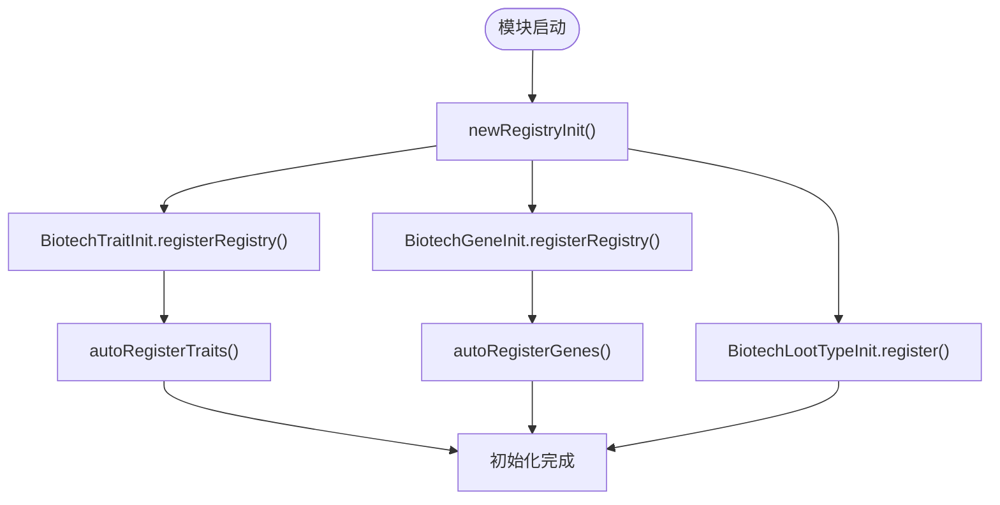
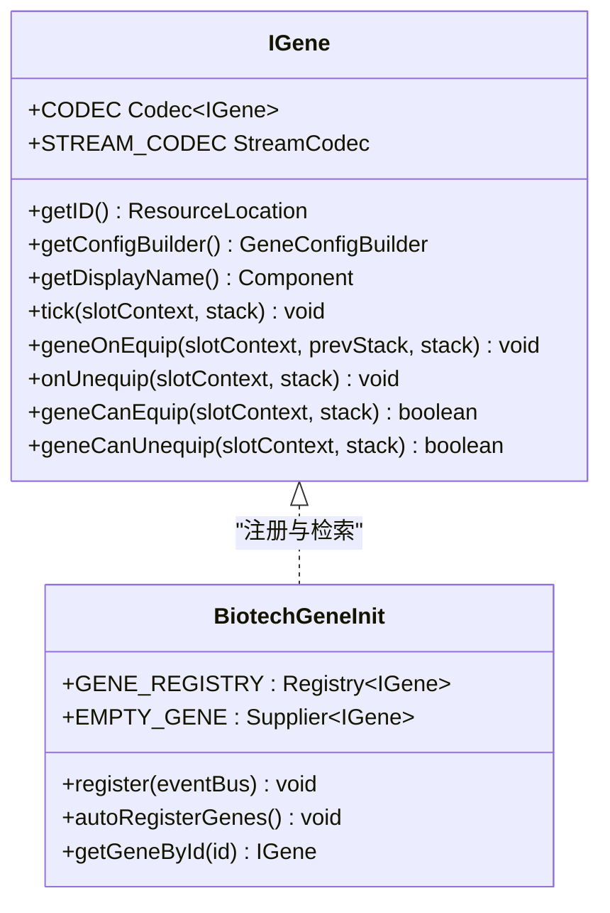
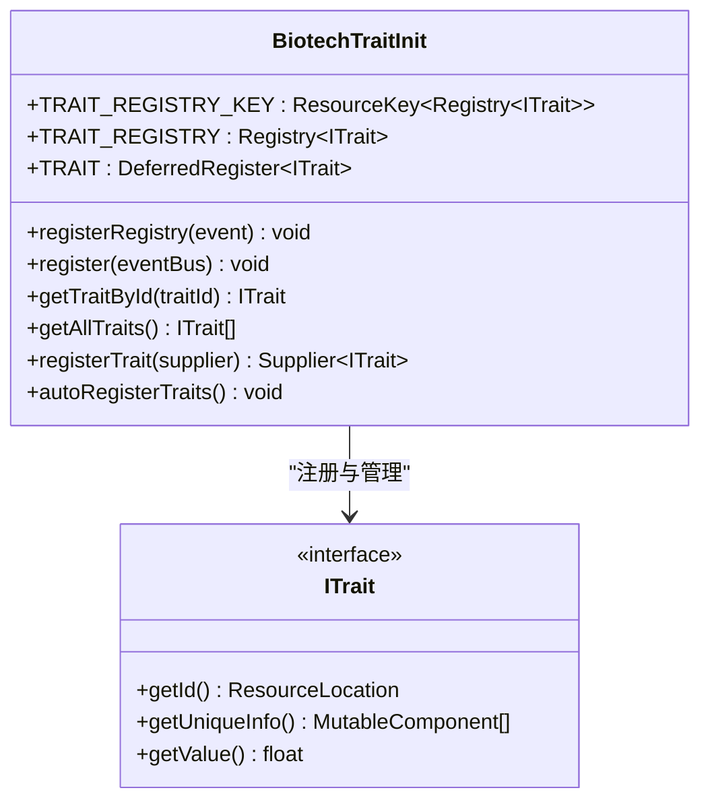
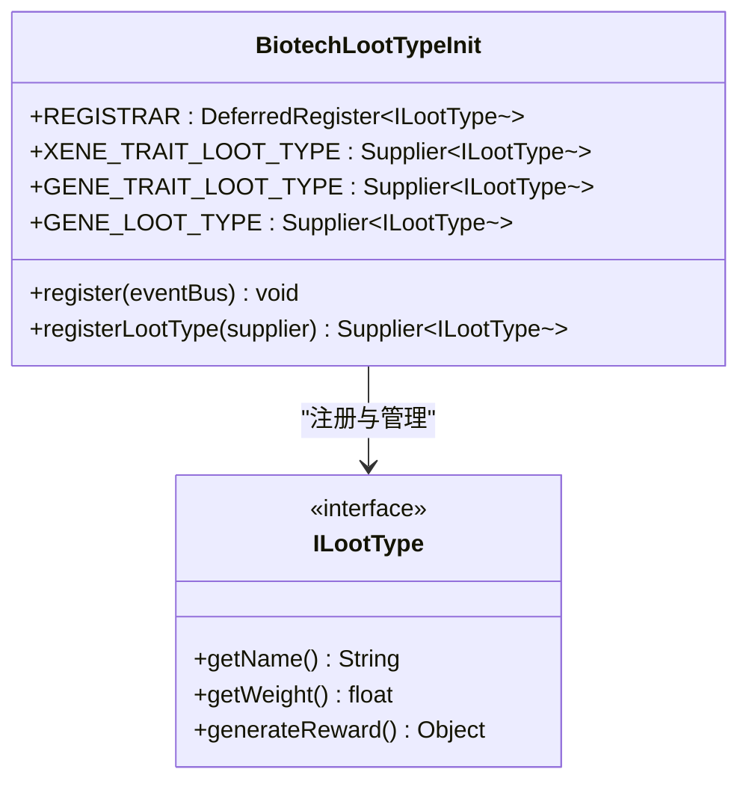
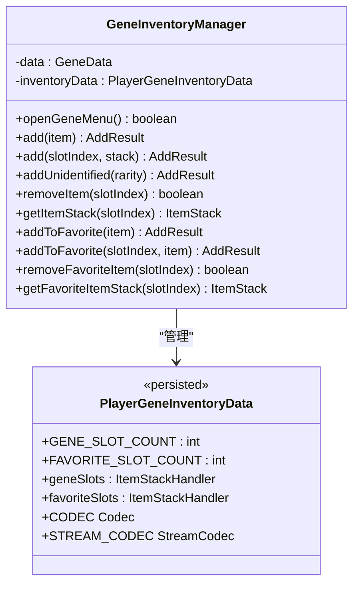
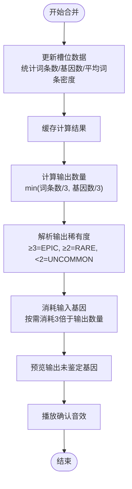
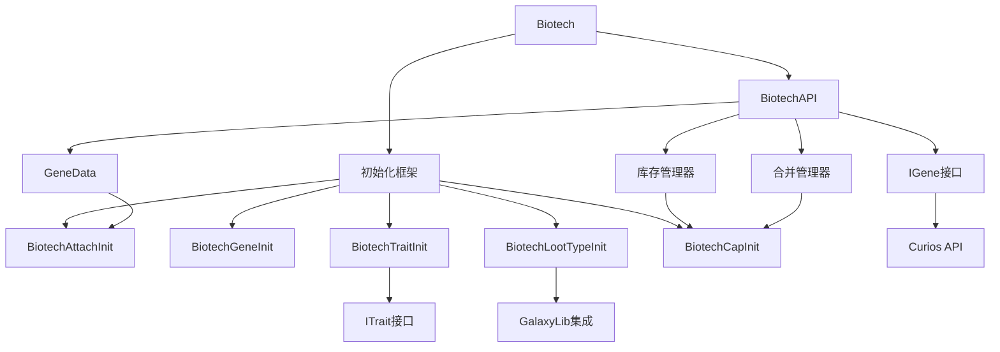

# Biotech基因科技模块

<cite>
**本文档引用的文件**
- [Biotech.java](file://Biotech/src/main/java/org/biotech/Biotech.java)
- [BiotechAPI.java](file://Biotech/src/main/java/org/biotech/api/BiotechAPI.java)
- [GeneData.java](file://Biotech/src/main/java/org/biotech/api/system/GeneData.java)
- [BiotechAttachInit.java](file://Biotech/src/main/java/org/biotech/api/init/BiotechAttachInit.java)
- [BiotechTraitInit.java](file://Biotech/src/main/java/org/biotech/api/init/BiotechTraitInit.java)
- [BiotechGeneInit.java](file://Biotech/src/main/java/org/biotech/api/init/BiotechGeneInit.java)
- [BiotechLootTypeInit.java](file://Biotech/src/main/java/org/biotech/api/init/BiotechLootTypeInit.java)
- [BiotechCapInit.java](file://Biotech/src/main/java/org/biotech/api/init/BiotechCapInit.java)
- [BiotechMenuInit.java](file://Biotech/src/main/java/org/biotech/api/init/BiotechMenuInit.java)
- [IGene.java](file://Biotech/src/main/java/org/biotech/api/system/gene/core/IGene.java)
- [GeneInventoryManager.java](file://Biotech/src/main/java/org/biotech/api/system/gene/inventory/GeneInventoryManager.java)
- [MergeManager.java](file://Biotech/src/main/java/org/biotech/api/system/merge/MergeManager.java)
</cite>

## 目录
1. [简介](#简介)
2. [项目结构](#项目结构)
3. [核心组件](#核心组件)
4. [架构总览](#架构总览)
5. [详细组件分析](#详细组件分析)
6. [依赖关系分析](#依赖关系分析)
7. [性能考虑](#性能考虑)
8. [故障排除指南](#故障排除指南)
9. [结论](#结论)
10. [附录](#附录)

## 简介
本文件为Biotech基因科技模块的综合技术文档，面向开发者与模组集成者，系统阐述基因科技系统的设计理念、架构与实现细节。内容涵盖基因数据模型、基因库存管理、未鉴定基因系统、基因合并算法、BiotechAPI接口设计、核心数据结构与业务逻辑、初始化流程、事件处理机制、网络通信协议以及与其他模块的交互方式与数据交换格式。文档同时提供使用示例与扩展指南，帮助读者快速理解并安全地扩展该系统。

**更新** 本版本反映了Biotech模块的重大重构，包括新的初始化框架（Biotech*Init类）、特性系统增强、战利品系统迁移等重要改进。

## 项目结构
Biotech模块采用分层与功能域结合的组织方式，经过重构后形成了更加清晰的初始化框架：
- 核心入口与初始化：Biotech主类负责注册基因、附件、菜单、能力等，并加载服务器配置。
- API层：对外暴露BiotechAPI，提供统一访问入口；内部定义GeneData聚合数据与序列化编解码。
- 系统子模块：基因系统、库存系统、合并系统、特性系统、战利品系统等。
- 新的初始化框架：Biotech*Init系列类提供模块化的初始化管理。
- 容器与UI：容器、菜单与客户端渲染装饰器。
- 网络通信：合并包（MergePacket）等。

**图表来源**
- [Biotech.java:22-61](file://Biotech/src/main/java/org/biotech/Biotech.java#L22-L61)
- [BiotechAttachInit.java:19-35](file://Biotech/src/main/java/org/biotech/api/init/BiotechAttachInit.java#L19-L35)
- [BiotechGeneInit.java:30-32](file://Biotech/src/main/java/org/biotech/api/init/BiotechGeneInit.java#L30-L32)
- [BiotechTraitInit.java:30-32](file://Biotech/src/main/java/org/biotech/api/init/BiotechTraitInit.java#L30-L32)
- [BiotechLootTypeInit.java:24-26](file://Biotech/src/main/java/org/biotech/api/init/BiotechLootTypeInit.java#L24-L26)
- [BiotechCapInit.java:36-50](file://Biotech/src/main/java/org/biotech/api/init/BiotechCapInit.java#L36-L50)
- [BiotechMenuInit.java:30-32](file://Biotech/src/main/java/org/biotech/api/init/BiotechMenuInit.java#L30-L32)

**章节来源**
- [Biotech.java:22-61](file://Biotech/src/main/java/org/biotech/Biotech.java#L22-L61)

## 核心组件
本节概述模块的关键组件及其职责，重点介绍重构后的初始化框架：
- Biotech主类：负责注册与初始化，绑定事件总线，注册配置与各类初始化器。
- 新的初始化框架：Biotech*Init系列类提供模块化的初始化管理，包括附件、基因、特性、战利品类型、能力、菜单等。
- BiotechAPI：对外提供统一接口，包括获取玩家基因数据、打开界面、Curios槽位访问等。
- GeneData：聚合玩家的基因相关数据（库存、合并），支持延迟初始化与网络编解码。
- 附件系统：通过BiotechAttachInit注册GeneData附件，实现玩家数据的生命周期管理与网络同步。
- 基因注册系统：通过BiotechGeneInit注册IGene类型，支持代码注册与自动扫描注册。
- 特性系统：通过BiotechTraitInit注册ITrait类型，提供增强的特性管理能力。
- 战利品系统：通过BiotechLootTypeInit注册战利品类型，与GalaxyLib系统集成。
- 系统管理器：库存管理器、合并管理器分别处理不同业务域。
- 能力系统：通过BiotechCapInit注册实体能力，提供IGeneInventoryManager和IMergeManager。

**更新** 重构后的初始化框架提供了更好的模块化和扩展性，支持自动注册和延迟初始化。

**章节来源**
- [BiotechAPI.java:19-77](file://Biotech/src/main/java/org/biotech/api/BiotechAPI.java#L19-L77)
- [GeneData.java:17-98](file://Biotech/src/main/java/org/biotech/api/system/GeneData.java#L17-L98)
- [BiotechAttachInit.java:17-35](file://Biotech/src/main/java/org/biotech/api/init/BiotechAttachInit.java#L17-L35)
- [BiotechGeneInit.java:21-106](file://Biotech/src/main/java/org/biotech/api/init/BiotechGeneInit.java#L21-L106)
- [BiotechTraitInit.java:19-103](file://Biotech/src/main/java/org/biotech/api/init/BiotechTraitInit.java#L19-L103)
- [BiotechLootTypeInit.java:17-44](file://Biotech/src/main/java/org/biotech/api/init/BiotechLootTypeInit.java#L17-L44)
- [BiotechCapInit.java:18-51](file://Biotech/src/main/java/org/biotech/api/init/BiotechCapInit.java#L18-L51)

## 架构总览
下图展示Biotech模块重构后的核心架构与组件交互：

**图表来源**
- [Biotech.java:22-61](file://Biotech/src/main/java/org/biotech/Biotech.java#L22-L61)
- [BiotechAPI.java:25-77](file://Biotech/src/main/java/org/biotech/api/BiotechAPI.java#L25-L77)
- [GeneData.java:39-51](file://Biotech/src/main/java/org/biotech/api/system/GeneData.java#L39-L51)
- [BiotechAttachInit.java:23-35](file://Biotech/src/main/java/org/biotech/api/init/BiotechAttachInit.java#L23-L35)
- [BiotechGeneInit.java:22-26](file://Biotech/src/main/java/org/biotech/api/init/BiotechGeneInit.java#L22-L26)
- [BiotechTraitInit.java:20-24](file://Biotech/src/main/java/org/biotech/api/init/BiotechTraitInit.java#L20-L24)
- [IGene.java:15-91](file://Biotech/src/main/java/org/biotech/api/system/gene/core/IGene.java#L15-L91)
- [BiotechCapInit.java:23-33](file://Biotech/src/main/java/org/biotech/api/init/BiotechCapInit.java#L23-L33)

## 详细组件分析

### 基因数据模型与附件系统
- GeneData作为聚合根，包含库存与合并两部分数据，均支持延迟初始化，避免不必要的内存占用。
- 通过BiotechAttachInit注册的附件类型，实现对每个玩家的独立数据实例化与序列化，支持服务端到客户端的网络同步。
- 编解码器使用RecordCodecBuilder与StreamCodec组合，保证序列化与网络传输的稳定性与一致性。
- 新增玩家引用管理，在玩家登录、重生、克隆时自动设置玩家对象，支持数据清理。

**图表来源**
- [GeneData.java:39-51](file://Biotech/src/main/java/org/biotech/api/system/GeneData.java#L39-L51)
- [BiotechAttachInit.java:23-35](file://Biotech/src/main/java/org/biotech/api/init/BiotechAttachInit.java#L23-L35)
- [BiotechAttachInit.java:39-75](file://Biotech/src/main/java/org/biotech/api/init/BiotechAttachInit.java#L39-L75)

**章节来源**
- [GeneData.java:39-51](file://Biotech/src/main/java/org/biotech/api/system/GeneData.java#L39-L51)
- [BiotechAttachInit.java:39-75](file://Biotech/src/main/java/org/biotech/api/init/BiotechAttachInit.java#L39-L75)

### 新的初始化框架与模块化设计
- Biotech主类重构了初始化流程，引入newRegistryInit方法专门处理注册项初始化。
- 新的初始化框架采用Biotech*Init系列类，每个类负责特定领域的初始化工作。
- 支持注册表事件监听，确保注册顺序的正确性。
- 自动注册功能：通过ModPluginFinder扫描带有@AutoInit注解的类，实现零配置注册。

**图表来源**
- [Biotech.java:48-61](file://Biotech/src/main/java/org/biotech/Biotech.java#L48-L61)
- [BiotechTraitInit.java:82-93](file://Biotech/src/main/java/org/biotech/api/init/BiotechTraitInit.java#L82-L93)
- [BiotechGeneInit.java:72-80](file://Biotech/src/main/java/org/biotech/api/init/BiotechGeneInit.java#L72-L80)

**章节来源**
- [Biotech.java:48-61](file://Biotech/src/main/java/org/biotech/Biotech.java#L48-L61)
- [BiotechTraitInit.java:82-93](file://Biotech/src/main/java/org/biotech/api/init/BiotechTraitInit.java#L82-L93)
- [BiotechGeneInit.java:72-80](file://Biotech/src/main/java/org/biotech/api/init/BiotechGeneInit.java#L72-L80)

### 基因注册与Curios接口
- IGene接口继承Curios的ICurioItem，提供装备/卸下/可装备判定等钩子，便于与Curios生态无缝集成。
- BiotechGeneInit负责注册IGene类型，支持代码注册与自动扫描注册，提供按ID检索与空基因占位。
- IGene定义了基于ResourceLocation的编解码器，支持网络传输时的空值处理。
- 新增getGeneById方法，支持代码基因和数据包基因的统一检索。

**图表来源**
- [IGene.java:15-91](file://Biotech/src/main/java/org/biotech/api/system/gene/core/IGene.java#L15-L91)
- [BiotechGeneInit.java:22-26](file://Biotech/src/main/java/org/biotech/api/init/BiotechGeneInit.java#L22-L26)
- [BiotechGeneInit.java:97-104](file://Biotech/src/main/java/org/biotech/api/init/BiotechGeneInit.java#L97-L104)

**章节来源**
- [IGene.java:15-91](file://Biotech/src/main/java/org/biotech/api/system/gene/core/IGene.java#L15-L91)
- [BiotechGeneInit.java:97-104](file://Biotech/src/main/java/org/biotech/api/init/BiotechGeneInit.java#L97-L104)

### 特性系统增强
- BiotechTraitInit提供新的特性注册系统，支持自定义ITrait类型的注册与管理。
- 通过RegistryBuilder创建专用的特性注册表，避免与其他注册表冲突。
- 支持空特性占位符，确保在特性缺失时的容错处理。
- 提供getAllTraits()方法，方便获取所有已注册的特性列表。

**图表来源**
- [BiotechTraitInit.java:20-24](file://Biotech/src/main/java/org/biotech/api/init/BiotechTraitInit.java#L20-L24)
- [BiotechTraitInit.java:50-58](file://Biotech/src/main/java/org/biotech/api/init/BiotechTraitInit.java#L50-L58)
- [BiotechTraitInit.java:70-76](file://Biotech/src/main/java/org/biotech/api/init/BiotechTraitInit.java#L70-L76)

**章节来源**
- [BiotechTraitInit.java:20-24](file://Biotech/src/main/java/org/biotech/api/init/BiotechTraitInit.java#L20-L24)
- [BiotechTraitInit.java:50-58](file://Biotech/src/main/java/org/biotech/api/init/BiotechTraitInit.java#L50-L58)

### 战利品系统迁移
- BiotechLootTypeInit提供战利品类型注册功能，与GalaxyLib系统集成。
- 使用共享的战利品类型注册表ID，避免类加载问题。
- 支持多种战利品类型：XeneTraitLootType、GeneTraitLootType、GeneLootType。
- 通过DeferredRegister实现延迟注册，确保注册表可用性。

**图表来源**
- [BiotechLootTypeInit.java:22-26](file://Biotech/src/main/java/org/biotech/api/init/BiotechLootTypeInit.java#L22-L26)
- [BiotechLootTypeInit.java:31-42](file://Biotech/src/main/java/org/biotech/api/init/BiotechLootTypeInit.java#L31-L42)

**章节来源**
- [BiotechLootTypeInit.java:22-26](file://Biotech/src/main/java/org/biotech/api/init/BiotechLootTypeInit.java#L22-L26)
- [BiotechLootTypeInit.java:31-42](file://Biotech/src/main/java/org/biotech/api/init/BiotechLootTypeInit.java#L31-L42)

### 基因库存管理
- GeneInventoryManager提供对玩家基因库存的增删改查与收藏管理，支持指定槽位或自动分配空槽位。
- PlayerGeneInventoryData定义了固定页数与每页槽位数的库存布局，使用LDLib2的IPersistedSerializable简化持久化与网络编解码。
- 库存槽位仅接受IGeneItem类型，确保数据一致性。
- 新增收藏功能，支持用户标记重要的基因物品。

**图表来源**
- [GeneInventoryManager.java:16-184](file://Biotech/src/main/java/org/biotech/api/system/gene/inventory/GeneInventoryManager.java#L16-L184)

**章节来源**
- [GeneInventoryManager.java:16-184](file://Biotech/src/main/java/org/biotech/api/system/gene/inventory/GeneInventoryManager.java#L16-L184)

### 未鉴定基因系统与合并算法
- 合并管理器根据输入槽位中基因的词条总数与平均词条密度，计算输出未鉴定基因的数量与稀有度。
- 合并规则：每3个词条或3个输入基因才产生1个输出；稀有度阈值分别为≥3与≥2；Epic必定双词条，Rare高概率双词条，Uncommon低概率双词条。
- 合并过程会消耗对应数量的输入基因，更新缓存并预览输出，最终发放未鉴定基因。
- 新增槽位数据缓存机制，避免重复计算。

**图表来源**
- [MergeManager.java:37-75](file://Biotech/src/main/java/org/biotech/api/system/merge/MergeManager.java#L37-L75)
- [MergeManager.java:105-155](file://Biotech/src/main/java/org/biotech/api/system/merge/MergeManager.java#L105-L155)

**章节来源**
- [MergeManager.java:37-75](file://Biotech/src/main/java/org/biotech/api/system/merge/MergeManager.java#L37-L75)
- [MergeManager.java:105-155](file://Biotech/src/main/java/org/biotech/api/system/merge/MergeManager.java#L105-L155)

### 能力系统与事件处理机制
- BiotechCapInit通过NeoForge的能力系统注册IGeneInventoryManager和IMergeManager。
- 支持实体能力注册，为玩家提供基因库存管理和合并功能。
- 新增PlayerTraitHandle事件处理器，显式注册Curios属性事件监听。
- 通过EntityCapability.createVoid创建无上下文的能力类型。

**章节来源**
- [BiotechCapInit.java:23-50](file://Biotech/src/main/java/org/biotech/api/init/BiotechCapInit.java#L23-L50)
- [Biotech.java:35-36](file://Biotech/src/main/java/org/biotech/Biotech.java#L35-L36)

### 初始化流程与网络通信
- Biotech主类在构造函数中完成注册项初始化、服务器配置注册与Curios属性事件显式订阅。
- BiotechAPI提供打开他人基因界面的方法，内部通过能力接口打开菜单。
- IGene定义了基于ResourceLocation的编解码器与网络StreamCodec，支持空值与占位符处理，确保网络传输稳定。
- 新的初始化框架支持延迟注册和事件驱动的注册顺序控制。

**章节来源**
- [Biotech.java:22-61](file://Biotech/src/main/java/org/biotech/Biotech.java#L22-L61)
- [BiotechAPI.java:25-77](file://Biotech/src/main/java/org/biotech/api/BiotechAPI.java#L25-L77)
- [IGene.java:67-91](file://Biotech/src/main/java/org/biotech/api/system/gene/core/IGene.java#L67-L91)

## 依赖关系分析
- 组件耦合与内聚：BiotechAPI作为门面，将各子系统能力暴露给外部；GeneData作为聚合根，集中管理子系统数据，降低跨模块耦合。
- 新的初始化框架：Biotech*Init系列类提供模块化的依赖注入，通过事件总线协调注册顺序。
- 外部依赖：Curios API用于装备槽位与属性修饰；LDLib2用于持久化与编解码；NeoForge事件总线与附件系统用于生命周期管理。
- 模块间协作：BiotechLootTypeInit与GalaxyLib系统集成，提供共享的战利品类型注册表。
- 潜在循环依赖：重构后的架构通过门面与聚合根避免直接循环依赖，新的初始化框架通过事件驱动模式进一步降低耦合。

**图表来源**
- [Biotech.java:22-61](file://Biotech/src/main/java/org/biotech/Biotech.java#L22-L61)
- [BiotechAPI.java:25-77](file://Biotech/src/main/java/org/biotech/api/BiotechAPI.java#L25-L77)
- [BiotechAttachInit.java:23-35](file://Biotech/src/main/java/org/biotech/api/init/BiotechAttachInit.java#L23-L35)
- [BiotechGeneInit.java:22-26](file://Biotech/src/main/java/org/biotech/api/init/BiotechGeneInit.java#L22-L26)
- [BiotechTraitInit.java:20-24](file://Biotech/src/main/java/org/biotech/api/init/BiotechTraitInit.java#L20-L24)
- [BiotechLootTypeInit.java:22-26](file://Biotech/src/main/java/org/biotech/api/init/BiotechLootTypeInit.java#L22-L26)
- [BiotechCapInit.java:23-33](file://Biotech/src/main/java/org/biotech/api/init/BiotechCapInit.java#L23-L33)

## 性能考虑
- 延迟初始化：GeneData的库存与合并数据均采用延迟初始化，减少空闲玩家的内存占用。
- 编解码优化：使用RecordCodecBuilder与StreamCodec，配合LDLib2的持久化框架，提升序列化/反序列化效率。
- 合并计算缓存：MergeManager在槽位变化时缓存词条数、平均词条密度与输出数量，避免重复计算。
- 自动注册优化：通过ModPluginFinder扫描注解类，只在需要时进行反射扫描，减少启动时间。
- 事件驱动注册：新的初始化框架通过事件总线协调注册顺序，避免阻塞主线程。
- 空特性处理：BiotechTraitInit提供空特性占位符，确保在特性缺失时的快速失败而非异常。

**更新** 重构后的架构在性能方面有显著改进，特别是初始化阶段的延迟注册和事件驱动机制。

## 故障排除指南
- 合并无输出：检查输入槽位是否满足"至少3个词条或3个基因"的条件；确认平均词条密度是否达到稀有度阈值。
- 库存无法放入：确认目标槽位是否为空且属于IGeneItem类型；检查页码与布局是否正确。
- Curios槽位不可用：确认Curios插件已正确安装且槽位ID与注册一致；通过BiotechAPI提供的方法进行访问。
- 附件数据未同步：检查BiotechAttachInit的注册与序列化编解码是否正确；确认服务端与客户端版本一致。
- 特性注册失败：检查@AutoInit注解是否正确配置；确认ModPluginFinder能够扫描到目标类。
- 基因注册异常：确认IGene实现类的getID()方法返回有效的ResourceLocation；检查BiotechGeneInit的注册表状态。
- 战利品类型缺失：检查BiotechLootTypeInit的注册是否在GalaxyLib注册之后执行。
- 能力获取失败：确认BiotechCapInit的注册事件是否被正确触发；检查EntityCapability的创建参数。

**更新** 新的故障排除指南涵盖了重构后特有的问题，如初始化框架相关的故障。

**章节来源**
- [MergeManager.java:105-155](file://Biotech/src/main/java/org/biotech/api/system/merge/MergeManager.java#L105-L155)
- [BiotechAttachInit.java:39-75](file://Biotech/src/main/java/org/biotech/api/init/BiotechAttachInit.java#L39-L75)
- [BiotechTraitInit.java:52-58](file://Biotech/src/main/java/org/biotech/api/init/BiotechTraitInit.java#L52-L58)
- [BiotechGeneInit.java:97-104](file://Biotech/src/main/java/org/biotech/api/init/BiotechGeneInit.java#L97-L104)
- [BiotechLootTypeInit.java:24-26](file://Biotech/src/main/java/org/biotech/api/init/BiotechLootTypeInit.java#L24-L26)
- [BiotechCapInit.java:36-50](file://Biotech/src/main/java/org/biotech/api/init/BiotechCapInit.java#L36-L50)

## 结论
Biotech基因科技模块经过重大重构后，形成了更加清晰、模块化和可扩展的架构。新的初始化框架（Biotech*Init系列类）提供了更好的模块分离和事件驱动的注册机制，特性系统得到增强支持自定义ITrait类型，战利品系统成功迁移到GalaxyLib生态。通过BiotechAPI统一对外接口与编解码协议，模块具备了更强的扩展性与兼容性，适合进一步拓展新基因、新特性与新玩法。重构后的架构在性能、可维护性和开发体验方面都有显著提升。

**更新** 本次重构标志着Biotech模块从原型设计向成熟架构的重要转变，为未来的功能扩展奠定了坚实基础。

## 附录

### 使用示例与扩展指南
- 获取玩家基因数据：通过BiotechAPI.getGeneData(player)获取GeneData实例，随后访问库存与合并数据。
- 打开他人基因界面：使用BiotechAPI.openGeneInventoryFor(serverPlayer)打开目标玩家的基因库存界面。
- 自动注册基因：在实现类上添加@AutoInit注解，系统启动时将自动扫描并注册。
- 自动注册特性：在ITrait实现类上添加@AutoInit注解，支持特性系统的自动发现。
- 动态调整战利率：使用BiotechLootTypeInit注册的战利品类型进行权重调整。
- 扩展基因类型：实现IGene接口并注册到BiotechGeneInit，即可参与Curios生态与合并系统。
- 扩展特性类型：实现ITrait接口并注册到BiotechTraitInit，支持自定义特性系统。
- 自定义初始化：通过继承Biotech*Init基类或使用事件监听器扩展初始化流程。

**更新** 新的扩展指南涵盖了重构后新增的功能和初始化框架的使用方法。

**章节来源**
- [BiotechAPI.java:25-77](file://Biotech/src/main/java/org/biotech/api/BiotechAPI.java#L25-L77)
- [BiotechTraitInit.java:82-93](file://Biotech/src/main/java/org/biotech/api/init/BiotechTraitInit.java#L82-L93)
- [BiotechGeneInit.java:72-80](file://Biotech/src/main/java/org/biotech/api/init/BiotechGeneInit.java#L72-L80)
- [BiotechLootTypeInit.java:31-42](file://Biotech/src/main/java/org/biotech/api/init/BiotechLootTypeInit.java#L31-L42)