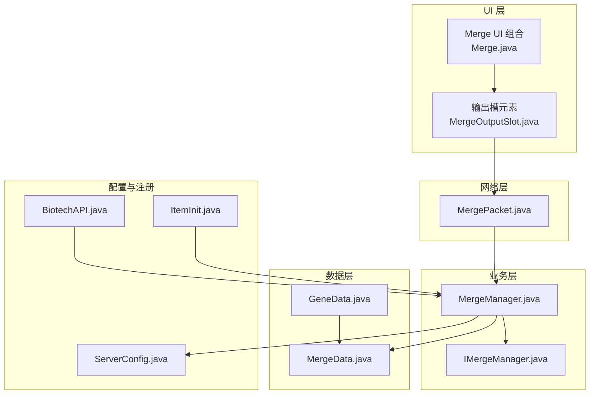
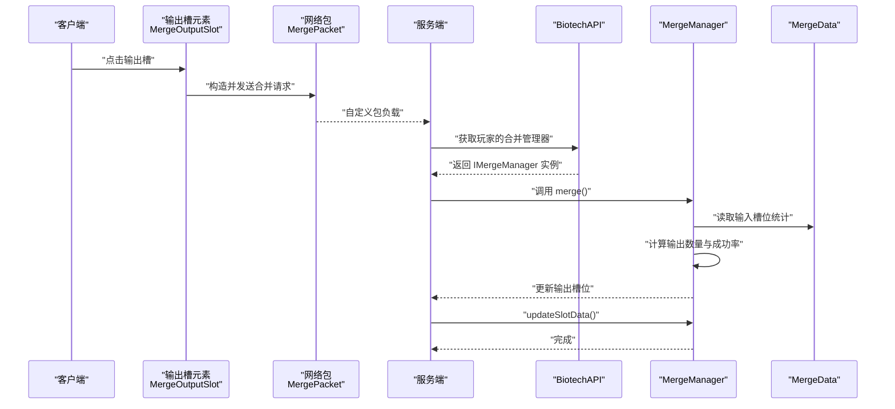
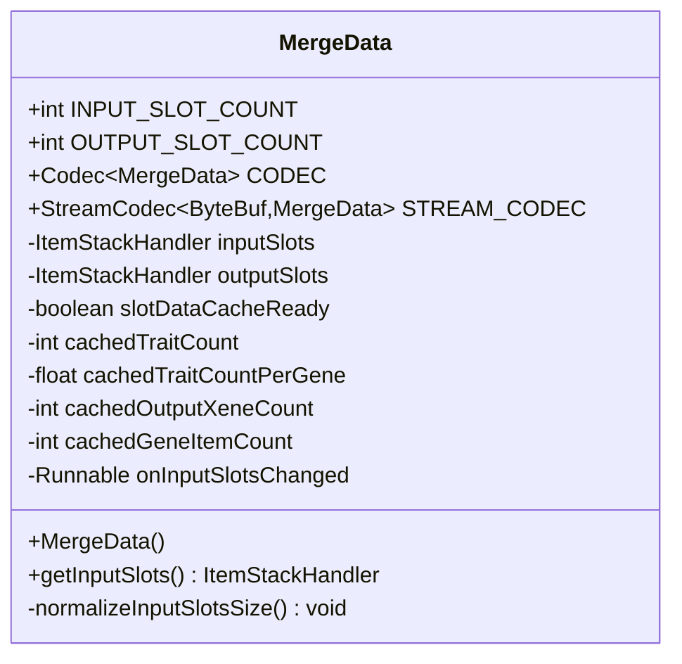
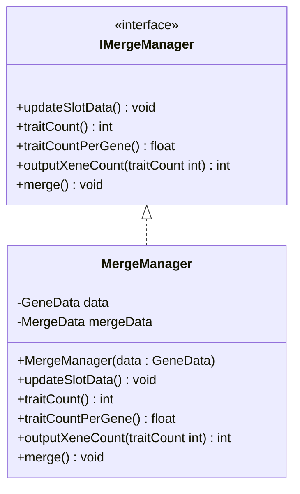
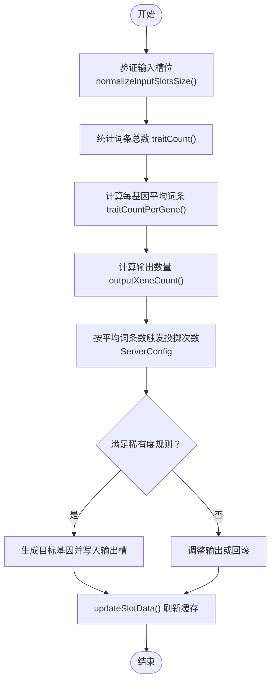
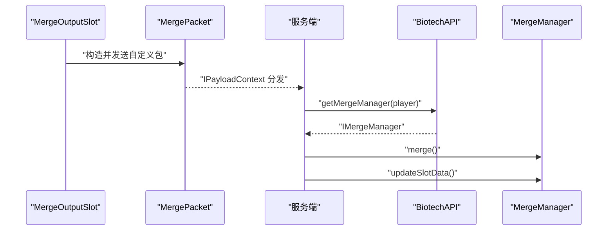
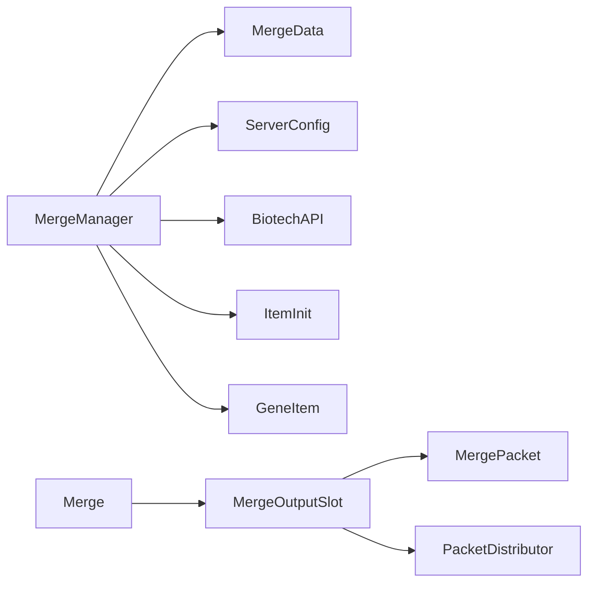

# 基因合并系统

<cite>
**本文引用的文件**
- [MergeData.java](file://Biotech/src/main/java/org/biotech/api/system/merge/MergeData.java)
- [IMergeManager.java](file://Biotech/src/main/java/org/biotech/api/system/merge/core/IMergeManager.java)
- [MergeManager.java](file://Biotech/src/main/java/org/biotech/api/system/merge/MergeManager.java)
- [MergePacket.java](file://Biotech/src/main/java/org/biotech/network/MergePacket.java)
- [Merge.java](file://Biotech/src/main/java/org/biotech/ui/gene_inventroy/group/Merge.java)
- [MergeOutputSlot.java](file://Biotech/src/main/java/org/biotech/ui/gene_inventroy/element/merge/MergeOutputSlot.java)
- [GeneData.java](file://Biotech/src/main/java/org/biotech/api/GeneData.java)
- [ServerConfig.java](file://Biotech/src/main/java/org/biotech/api/config/ServerConfig.java)
- [BiotechAPI.java](file://Biotech/src/main/java/org/biotech/api/BiotechAPI.java)
- [IGene.java](file://Biotech/src/main/java/org/biotech/api/system/gene/core/IGene.java)
- [ITraitProvider.java](file://Biotech/src/main/java/org/biotech/api/system/trait/core/ITraitProvider.java)
- [IUnidentifiedGeneItem.java](file://Biotech/src/main/java/org/biotech/api/system/gene/core/IUnidentifiedGeneItem.java)
- [GeneItem.java](file://Biotech/src/main/java/org/biotech/item/GeneItem.java)
- [ItemInit.java](file://Biotech/src/main/java/org/biotech/api/init/ItemInit.java)
- [PacketDistributor.java](file://Biotech/src/main/java/org/biotech/ui/gene_inventroy/element/merge/MergeOutputSlot.java)
</cite>

## 目录
1. [简介](#简介)
2. [项目结构](#项目结构)
3. [核心组件](#核心组件)
4. [架构总览](#架构总览)
5. [详细组件分析](#详细组件分析)
6. [依赖关系分析](#依赖关系分析)
7. [性能考量](#性能考量)
8. [故障排查指南](#故障排查指南)
9. [结论](#结论)
10. [附录](#附录)

## 简介
本文件面向“基因合并系统”的综合技术文档，围绕以下目标展开：
- 深入解析 MergeManager 的合并算法与 MergeData 的数据结构设计
- 解释 IMergeManager 接口的实现原理与合并规则配置机制
- 说明 MergePacket 网络包的传输协议与客户端-服务器同步机制
- 提供从输入验证、成功率计算、结果生成到错误处理的完整流程示例
- 覆盖合并配方定义、成功率公式与特殊效果的实现细节
- 给出性能优化建议与并发安全注意事项

## 项目结构
基因合并系统位于 Biotech 模块中，主要涉及以下层次：
- 数据层：MergeData（持久化槽位与缓存）、GeneData（玩家级基因数据聚合）
- 业务层：IMergeManager 接口与 MergeManager 实现（合并规则、统计与执行）
- 网络层：MergePacket（客户端请求、服务端处理）
- UI 层：Merge UI 组合与输出槽元素，负责触发合并请求
- 配置层：ServerConfig（影响不同稀有度下的词条投掷次数）

**图表来源**
- [Merge.java:1-42](file://Biotech/src/main/java/org/biotech/ui/gene_inventroy/group/Merge.java#L1-L42)
- [MergeOutputSlot.java:1-34](file://Biotech/src/main/java/org/biotech/ui/gene_inventroy/element/merge/MergeOutputSlot.java#L1-L34)
- [MergePacket.java:1-34](file://Biotech/src/main/java/org/biotech/network/MergePacket.java#L1-L34)
- [IMergeManager.java:1-51](file://Biotech/src/main/java/org/biotech/api/system/merge/core/IMergeManager.java#L1-L51)
- [MergeManager.java:1-43](file://Biotech/src/main/java/org/biotech/api/system/merge/MergeManager.java#L1-L43)
- [MergeData.java:1-85](file://Biotech/src/main/java/org/biotech/api/system/merge/MergeData.java#L1-L85)
- [GeneData.java:57-62](file://Biotech/src/main/java/org/biotech/api/GeneData.java#L57-L62)
- [ServerConfig.java](file://Biotech/src/main/java/org/biotech/api/config/ServerConfig.java)
- [BiotechAPI.java](file://Biotech/src/main/java/org/biotech/api/BiotechAPI.java)
- [ItemInit.java](file://Biotech/src/main/java/org/biotech/api/init/ItemInit.java)

**章节来源**
- [Merge.java:1-42](file://Biotech/src/main/java/org/biotech/ui/gene_inventroy/group/Merge.java#L1-L42)
- [MergeOutputSlot.java:1-34](file://Biotech/src/main/java/org/biotech/ui/gene_inventroy/element/merge/MergeOutputSlot.java#L1-L34)
- [MergePacket.java:1-34](file://Biotech/src/main/java/org/biotech/network/MergePacket.java#L1-L34)
- [IMergeManager.java:1-51](file://Biotech/src/main/java/org/biotech/api/system/merge/core/IMergeManager.java#L1-L51)
- [MergeManager.java:1-43](file://Biotech/src/main/java/org/biotech/api/system/merge/MergeManager.java#L1-L43)
- [MergeData.java:1-85](file://Biotech/src/main/java/org/biotech/api/system/merge/MergeData.java#L1-L85)
- [GeneData.java:57-62](file://Biotech/src/main/java/org/biotech/api/GeneData.java#L57-L62)
- [ServerConfig.java](file://Biotech/src/main/java/org/biotech/api/config/ServerConfig.java)
- [BiotechAPI.java](file://Biotech/src/main/java/org/biotech/api/BiotechAPI.java)
- [ItemInit.java](file://Biotech/src/main/java/org/biotech/api/init/ItemInit.java)

## 核心组件
- MergeData：封装输入/输出槽位、运行时缓存与槽位变更回调；支持序列化与网络编解码
- IMergeManager：定义合并统计与执行的契约（traitCount、traitCountPerGene、outputXeneCount、merge）
- MergeManager：实现合并逻辑，维护输入槽位统计与输出计算，并与配置联动
- MergePacket：客户端向服务端发送合并请求的网络载荷
- UI 元素：MergeOutputSlot 触发网络请求，Merge UI 组合组织界面布局
- 配置与注册：ServerConfig 提供不同稀有度下的词条投掷次数；BiotechAPI 提供合并管理器访问入口

**章节来源**
- [MergeData.java:1-85](file://Biotech/src/main/java/org/biotech/api/system/merge/MergeData.java#L1-L85)
- [IMergeManager.java:1-51](file://Biotech/src/main/java/org/biotech/api/system/merge/core/IMergeManager.java#L1-L51)
- [MergeManager.java:1-43](file://Biotech/src/main/java/org/biotech/api/system/merge/MergeManager.java#L1-L43)
- [MergePacket.java:1-34](file://Biotech/src/main/java/org/biotech/network/MergePacket.java#L1-L34)
- [MergeOutputSlot.java:1-34](file://Biotech/src/main/java/org/biotech/ui/gene_inventroy/element/merge/MergeOutputSlot.java#L1-L34)
- [Merge.java:1-42](file://Biotech/src/main/java/org/biotech/ui/gene_inventroy/group/Merge.java#L1-L42)
- [ServerConfig.java](file://Biotech/src/main/java/org/biotech/api/config/ServerConfig.java)
- [BiotechAPI.java](file://Biotech/src/main/java/org/biotech/api/BiotechAPI.java)

## 架构总览
下图展示从 UI 到网络再到业务层的调用链路与职责分工。

**图表来源**
- [MergeOutputSlot.java:1-34](file://Biotech/src/main/java/org/biotech/ui/gene_inventroy/element/merge/MergeOutputSlot.java#L1-L34)
- [MergePacket.java:1-34](file://Biotech/src/main/java/org/biotech/network/MergePacket.java#L1-L34)
- [BiotechAPI.java](file://Biotech/src/main/java/org/biotech/api/BiotechAPI.java)
- [IMergeManager.java:1-51](file://Biotech/src/main/java/org/biotech/api/system/merge/core/IMergeManager.java#L1-L51)
- [MergeManager.java:1-43](file://Biotech/src/main/java/org/biotech/api/system/merge/MergeManager.java#L1-L43)
- [MergeData.java:1-85](file://Biotech/src/main/java/org/biotech/api/system/merge/MergeData.java#L1-L85)

## 详细组件分析

### MergeData 数据结构设计
- 槽位常量：INPUT_SLOT_COUNT=9，OUTPUT_SLOT_COUNT=1
- 编解码：通过 Codec 与 StreamCodec 支持持久化与网络传输
- 运行时缓存：slotDataCacheReady、cachedTraitCount、cachedTraitCountPerGene、cachedOutputXeneCount、cachedGeneItemCount
- 输入槽规范化：normalizeInputSlotsSize 在尺寸不匹配时重建并迁移内容，同时触发 onInputSlotsChanged 回调
- 序列化：使用低拖 lib 的持久化注解与解析器

**图表来源**
- [MergeData.java:1-85](file://Biotech/src/main/java/org/biotech/api/system/merge/MergeData.java#L1-L85)

**章节来源**
- [MergeData.java:1-85](file://Biotech/src/main/java/org/biotech/api/system/merge/MergeData.java#L1-L85)

### IMergeManager 接口与实现原理
- 接口职责：
  - updateSlotData：在输入槽位变化时统一刷新统计与缓存
  - traitCount/traitCountPerGene：统计词条总数与每基因平均词条数
  - outputXeneCount：基于词条总数计算输出数量（固定 3 个合成 1 个）
  - merge：执行合并，依据平均词条数触发不同稀有度的词条投掷次数（由 ServerConfig 驱动）
- 实现要点：
  - 通过 GeneData 获取 MergeData 并绑定输入槽变更回调
  - 在 merge 执行前后分别调用 updateSlotData 以保证状态一致

**图表来源**
- [IMergeManager.java:1-51](file://Biotech/src/main/java/org/biotech/api/system/merge/core/IMergeManager.java#L1-L51)
- [MergeManager.java:1-43](file://Biotech/src/main/java/org/biotech/api/system/merge/MergeManager.java#L1-L43)

**章节来源**
- [IMergeManager.java:1-51](file://Biotech/src/main/java/org/biotech/api/system/merge/core/IMergeManager.java#L1-L51)
- [MergeManager.java:1-43](file://Biotech/src/main/java/org/biotech/api/system/merge/MergeManager.java#L1-L43)

### 合并算法与成功率计算
- 输入验证：
  - 通过 MergeData.getInputSlots() 获取输入槽位集合
  - normalizeInputSlotsSize 确保槽位数量与常量一致
- 统计计算：
  - traitCount：遍历输入槽位统计词条总数
  - traitCountPerGene：词条总数除以有效基因数量（由实现内部逻辑决定）
  - outputXeneCount：按固定比例（例如 3:1）计算输出数量
- 成功率与特殊效果：
  - 平均词条数决定触发不同稀有度的词条投掷次数（由 ServerConfig 提供）
  - 不同稀有度的输出规则：Epic 必定双词条；Rare 更高概率双词条；Uncommon 极小概率双词条；Common 不会有双词条
- 结果生成：
  - 执行 merge 后更新输出槽位，并调用 updateSlotData 刷新缓存

**图表来源**
- [MergeManager.java:1-43](file://Biotech/src/main/java/org/biotech/api/system/merge/MergeManager.java#L1-L43)
- [IMergeManager.java:1-51](file://Biotech/src/main/java/org/biotech/api/system/merge/core/IMergeManager.java#L1-L51)
- [ServerConfig.java](file://Biotech/src/main/java/org/biotech/api/config/ServerConfig.java)

**章节来源**
- [MergeManager.java:1-43](file://Biotech/src/main/java/org/biotech/api/system/merge/MergeManager.java#L1-L43)
- [IMergeManager.java:1-51](file://Biotech/src/main/java/org/biotech/api/system/merge/core/IMergeManager.java#L1-L51)

### 网络包与客户端-服务器同步机制
- 客户端触发：
  - MergeOutputSlot 在用户点击输出槽时构造并发送 MergePacket
  - 使用 PacketDistributor 发送自定义包负载
- 服务端处理：
  - MergePacket.handle 在服务端线程中执行
  - 通过 BiotechAPI 获取玩家的合并管理器实例
  - 调用 manager.merge() 与 manager.updateSlotData() 完成同步与状态更新

**图表来源**
- [MergeOutputSlot.java:1-34](file://Biotech/src/main/java/org/biotech/ui/gene_inventroy/element/merge/MergeOutputSlot.java#L1-L34)
- [MergePacket.java:1-34](file://Biotech/src/main/java/org/biotech/network/MergePacket.java#L1-L34)
- [BiotechAPI.java](file://Biotech/src/main/java/org/biotech/api/BiotechAPI.java)
- [IMergeManager.java:1-51](file://Biotech/src/main/java/org/biotech/api/system/merge/core/IMergeManager.java#L1-L51)
- [MergeManager.java:1-43](file://Biotech/src/main/java/org/biotech/api/system/merge/MergeManager.java#L1-L43)

**章节来源**
- [MergeOutputSlot.java:1-34](file://Biotech/src/main/java/org/biotech/ui/gene_inventroy/element/merge/MergeOutputSlot.java#L1-L34)
- [MergePacket.java:1-34](file://Biotech/src/main/java/org/biotech/network/MergePacket.java#L1-L34)
- [MergeManager.java:1-43](file://Biotech/src/main/java/org/biotech/api/system/merge/MergeManager.java#L1-L43)

### 合并配方定义、成功率公式与特殊效果
- 合并配方：
  - 输入：多个未识别基因（最多 9 个）
  - 输出：按固定比例（如 3:1）产出已识别基因
- 成功率与稀有度：
  - 平均词条数越高，越可能产出高稀有度基因
  - 不同稀有度的双词条概率不同（Epic 必定双词条；Rare 更高概率；Uncommon 极小概率；Common 不会）
- 特殊效果：
  - ServerConfig 控制不同稀有度下的词条投掷次数
  - 合并过程可结合 ITraitProvider 与 IGene 接口扩展词条与基因行为

**章节来源**
- [IMergeManager.java:1-51](file://Biotech/src/main/java/org/biotech/api/system/merge/core/IMergeManager.java#L1-L51)
- [MergeManager.java:1-43](file://Biotech/src/main/java/org/biotech/api/system/merge/MergeManager.java#L1-L43)
- [ServerConfig.java](file://Biotech/src/main/java/org/biotech/api/config/ServerConfig.java)
- [ITraitProvider.java](file://Biotech/src/main/java/org/biotech/api/system/trait/core/ITraitProvider.java)
- [IGene.java](file://Biotech/src/main/java/org/biotech/api/system/gene/core/IGene.java)

## 依赖关系分析
- MergeManager 依赖：
  - MergeData（输入/输出槽与缓存）
  - ServerConfig（稀有度相关投掷次数）
  - BiotechAPI（获取玩家合并管理器）
  - ItemInit/GeneItem（产物与材料项）
- UI 与网络：
  - MergeOutputSlot 依赖 MergePacket 与 PacketDistributor
  - Merge UI 组合负责布局与交互

**图表来源**
- [MergeManager.java:1-43](file://Biotech/src/main/java/org/biotech/api/system/merge/MergeManager.java#L1-L43)
- [MergeData.java:1-85](file://Biotech/src/main/java/org/biotech/api/system/merge/MergeData.java#L1-L85)
- [MergeOutputSlot.java:1-34](file://Biotech/src/main/java/org/biotech/ui/gene_inventroy/element/merge/MergeOutputSlot.java#L1-L34)
- [MergePacket.java:1-34](file://Biotech/src/main/java/org/biotech/network/MergePacket.java#L1-L34)
- [Merge.java:1-42](file://Biotech/src/main/java/org/biotech/ui/gene_inventroy/group/Merge.java#L1-L42)
- [ServerConfig.java](file://Biotech/src/main/java/org/biotech/api/config/ServerConfig.java)
- [BiotechAPI.java](file://Biotech/src/main/java/org/biotech/api/BiotechAPI.java)
- [ItemInit.java](file://Biotech/src/main/java/org/biotech/api/init/ItemInit.java)
- [GeneItem.java](file://Biotech/src/main/java/org/biotech/item/GeneItem.java)

**章节来源**
- [MergeManager.java:1-43](file://Biotech/src/main/java/org/biotech/api/system/merge/MergeManager.java#L1-L43)
- [MergeData.java:1-85](file://Biotech/src/main/java/org/biotech/api/system/merge/MergeData.java#L1-L85)
- [MergeOutputSlot.java:1-34](file://Biotech/src/main/java/org/biotech/ui/gene_inventroy/element/merge/MergeOutputSlot.java#L1-L34)
- [MergePacket.java:1-34](file://Biotech/src/main/java/org/biotech/network/MergePacket.java#L1-L34)
- [Merge.java:1-42](file://Biotech/src/main/java/org/biotech/ui/gene_inventroy/group/Merge.java#L1-L42)
- [ServerConfig.java](file://Biotech/src/main/java/org/biotech/api/config/ServerConfig.java)
- [BiotechAPI.java](file://Biotech/src/main/java/org/biotech/api/BiotechAPI.java)
- [ItemInit.java](file://Biotech/src/main/java/org/biotech/api/init/ItemInit.java)
- [GeneItem.java](file://Biotech/src/main/java/org/biotech/item/GeneItem.java)

## 性能考量
- 缓存策略：
  - MergeData 内置运行时缓存字段，避免重复遍历输入槽位
  - updateSlotData 统一刷新，降低 UI 与业务层的重复计算
- 序列化与网络：
  - 使用 Codec 与 StreamCodec 进行高效编解码，减少序列化开销
  - MergePacket 采用空载荷（unit codec），最小化网络传输体积
- 并发与线程：
  - 服务端处理在 enqueueWork 中执行，避免主线程阻塞
  - 输入槽变更回调在必要时触发，避免不必要的重算
- UI 交互：
  - 输出槽点击即发送请求，减少本地状态与服务端状态的不一致窗口

**章节来源**
- [MergeData.java:1-85](file://Biotech/src/main/java/org/biotech/api/system/merge/MergeData.java#L1-L85)
- [MergePacket.java:1-34](file://Biotech/src/main/java/org/biotech/network/MergePacket.java#L1-L34)
- [MergeManager.java:1-43](file://Biotech/src/main/java/org/biotech/api/system/merge/MergeManager.java#L1-L43)

## 故障排查指南
- 合并无效或无输出：
  - 检查输入槽位是否正确设置（槽位数量与内容）
  - 确认 updateSlotData 是否被调用以刷新缓存
- 稀有度不符合预期：
  - 核对平均词条数计算逻辑与 ServerConfig 的投掷次数配置
- 网络不同步：
  - 确认 MergePacket 已正确注册与分发
  - 检查服务端 handle 流程是否成功获取合并管理器并执行 merge/updateSlotData
- UI 无响应：
  - 检查 MergeOutputSlot 的点击事件与 PacketDistributor 调用

**章节来源**
- [MergePacket.java:1-34](file://Biotech/src/main/java/org/biotech/network/MergePacket.java#L1-L34)
- [MergeManager.java:1-43](file://Biotech/src/main/java/org/biotech/api/system/merge/MergeManager.java#L1-L43)
- [MergeOutputSlot.java:1-34](file://Biotech/src/main/java/org/biotech/ui/gene_inventroy/element/merge/MergeOutputSlot.java#L1-L34)

## 结论
基因合并系统通过清晰的分层设计实现了稳定的客户端-服务器同步：UI 层负责交互与请求发送，网络层承载轻量负载，业务层集中处理合并规则与统计，数据层提供持久化与缓存能力。通过 ServerConfig 与接口契约，系统具备良好的可配置性与扩展性，能够满足不同稀有度与成功率需求。

## 附录
- 关键流程示例（步骤化）：
  1) 用户在 UI 中选择输入基因并放置于输入槽
  2) 输入槽变更触发 updateSlotData，统计 traitCount 与 traitCountPerGene
  3) 用户点击输出槽，UI 发送 MergePacket 至服务端
  4) 服务端获取合并管理器并执行 merge，依据平均词条数与配置决定投掷次数
  5) 更新输出槽位并再次调用 updateSlotData 刷新缓存
  6) 客户端 UI 自动同步最新状态

**章节来源**
- [Merge.java:1-42](file://Biotech/src/main/java/org/biotech/ui/gene_inventroy/group/Merge.java#L1-L42)
- [MergeOutputSlot.java:1-34](file://Biotech/src/main/java/org/biotech/ui/gene_inventroy/element/merge/MergeOutputSlot.java#L1-L34)
- [MergePacket.java:1-34](file://Biotech/src/main/java/org/biotech/network/MergePacket.java#L1-L34)
- [MergeManager.java:1-43](file://Biotech/src/main/java/org/biotech/api/system/merge/MergeManager.java#L1-L43)
- [IMergeManager.java:1-51](file://Biotech/src/main/java/org/biotech/api/system/merge/core/IMergeManager.java#L1-L51)
- [MergeData.java:1-85](file://Biotech/src/main/java/org/biotech/api/system/merge/MergeData.java#L1-L85)
- [ServerConfig.java](file://Biotech/src/main/java/org/biotech/api/config/ServerConfig.java)