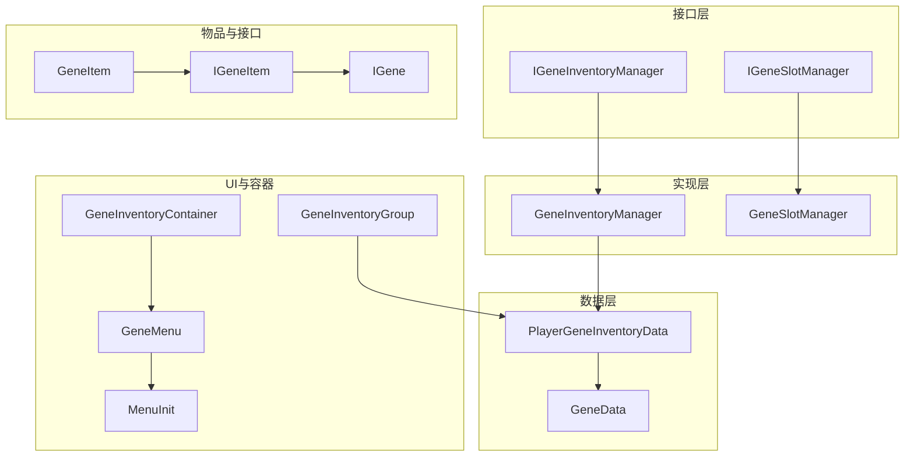
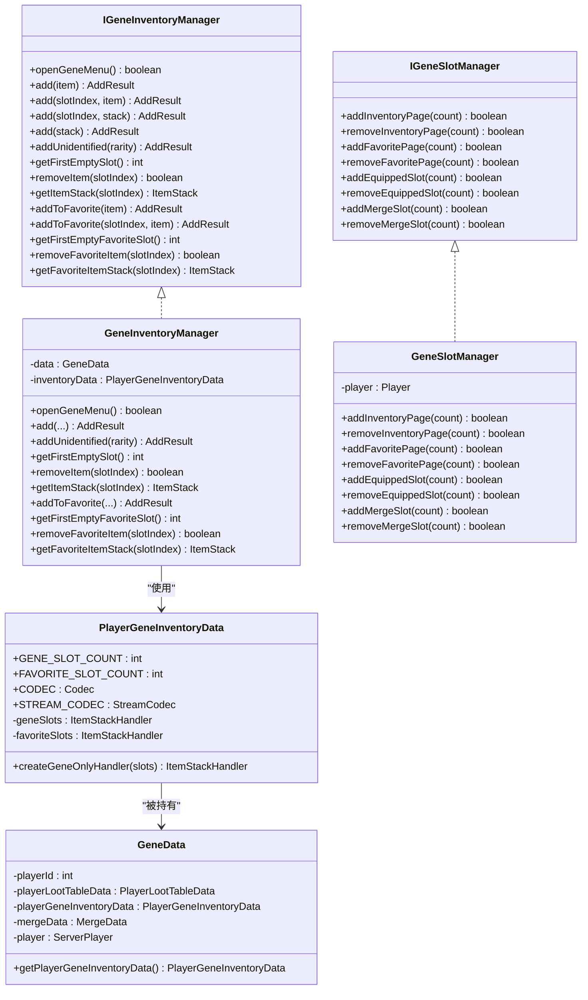
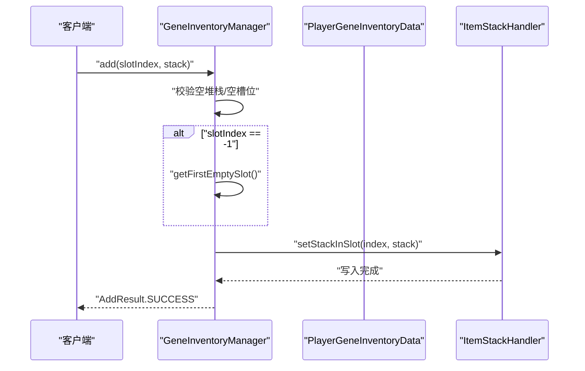
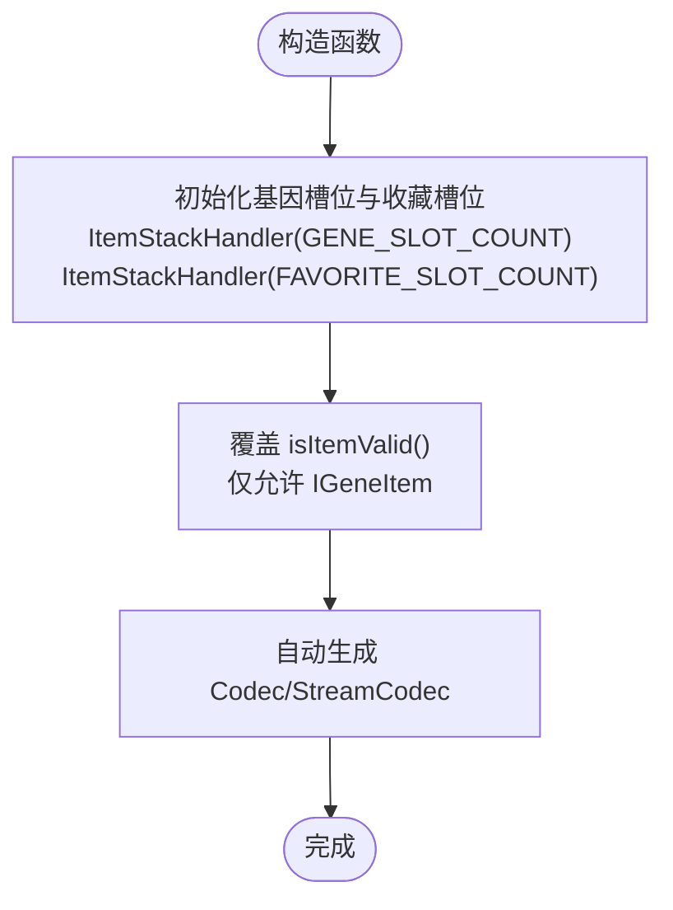
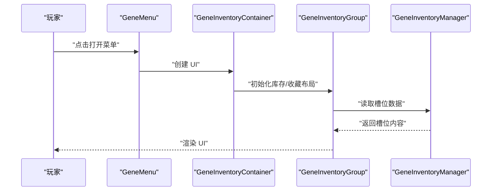
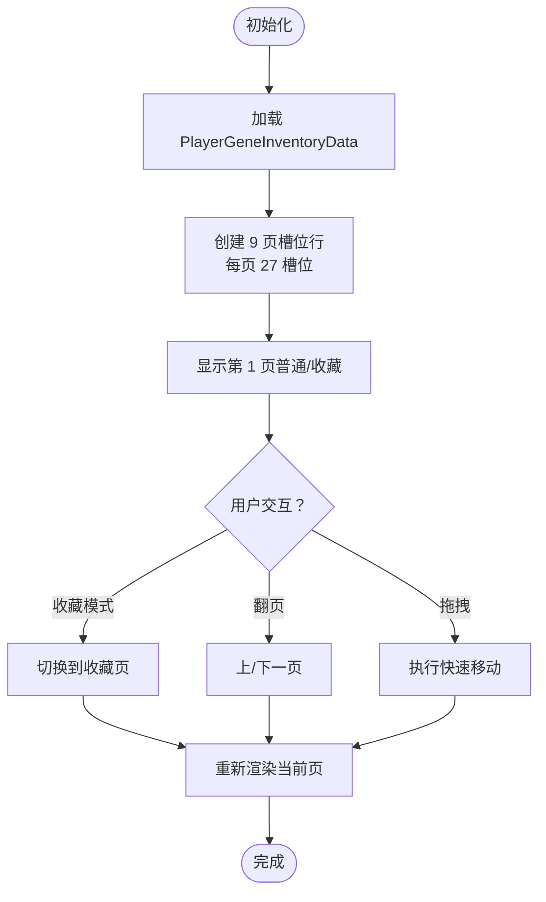
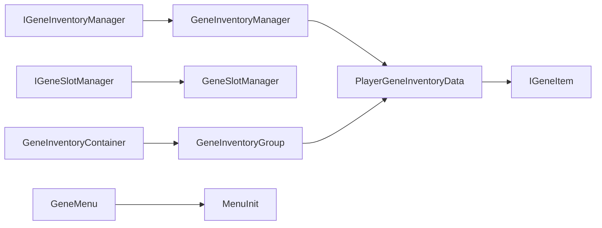

# 基因库存管理系统

<cite>
**本文档引用的文件**
- [IGeneInventoryManager.java](file://Biotech/src/main/java/org/biotech/api/system/gene/core/manager/IGeneInventoryManager.java)
- [IGeneSlotManager.java](file://Biotech/src/main/java/org/biotech/api/system/gene/core/manager/IGeneSlotManager.java)
- [PlayerGeneInventoryData.java](file://Biotech/src/main/java/org/biotech/api/system/gene/inventory/PlayerGeneInventoryData.java)
- [GeneInventoryManager.java](file://Biotech/src/main/java/org/biotech/api/system/gene/inventory/GeneInventoryManager.java)
- [GeneSlotManager.java](file://Biotech/src/main/java/org/biotech/api/system/gene/inventory/GeneSlotManager.java)
- [GeneItem.java](file://Biotech/src/main/java/org/biotech/item/GeneItem.java)
- [IGene.java](file://Biotech/src/main/java/org/biotech/api/system/gene/core/IGene.java)
- [IGeneItem.java](file://Biotech/src/main/java/org/biotech/api/system/gene/core/IGeneItem.java)
- [GeneMenu.java](file://Biotech/src/main/java/org/biotech/container/GeneMenu.java)
- [MenuInit.java](file://Biotech/src/main/java/org/biotech/api/init/MenuInit.java)
- [GeneInventoryContainer.java](file://Biotech/src/main/java/org/biotech/container/GeneInventoryContainer.java)
- [GeneInventoryGroup.java](file://Biotech/src/main/java/org/biotech/ui/gene_inventroy/group/GeneInventoryGroup.java)
- [GeneData.java](file://Biotech/src/main/java/org/biotech/api/GeneData.java)
</cite>

## 目录
1. [简介](#简介)
2. [项目结构](#项目结构)
3. [核心组件](#核心组件)
4. [架构总览](#架构总览)
5. [详细组件分析](#详细组件分析)
6. [依赖关系分析](#依赖关系分析)
7. [性能考虑](#性能考虑)
8. [故障排除指南](#故障排除指南)
9. [结论](#结论)
10. [附录](#附录)

## 简介
本文件面向基因库存管理系统，围绕以下目标展开：  
- 深入解析 IGeneInventoryManager 接口的设计与实现，涵盖增删改查、槽位管理与收藏夹功能  
- 解释 PlayerGeneInventoryData 数据结构及其持久化机制  
- 详解 GeneInventoryManager 与 GeneSlotManager 的实现原理与使用方式  
- 提供库存容量限制、排序规则与搜索功能的实现细节  
- 给出实际操作流程图与性能优化建议  

本系统以接口驱动设计，结合 UI 容器与持久化框架，形成“接口定义 + 管理器实现 + UI 渲染 + 数据持久化”的完整闭环。

## 项目结构
系统主要位于 Biotech 模块中，核心文件分布如下：
- 接口层：IGeneInventoryManager、IGeneSlotManager
- 管理器实现：GeneInventoryManager、GeneSlotManager
- 数据模型：PlayerGeneInventoryData、GeneData
- 物品与基因接口：GeneItem、IGene、IGeneItem
- UI 容器与菜单：GeneInventoryContainer、GeneMenu、MenuInit
- UI 布局：GeneInventoryGroup 及其子元素

**图表来源**
- [IGeneInventoryManager.java:12-132](file://Biotech/src/main/java/org/biotech/api/system/gene/core/manager/IGeneInventoryManager.java#L12-L132)
- [IGeneSlotManager.java:6-35](file://Biotech/src/main/java/org/biotech/api/system/gene/core/manager/IGeneSlotManager.java#L6-L35)
- [GeneInventoryManager.java:18-26](file://Biotech/src/main/java/org/biotech/api/system/gene/inventory/GeneInventoryManager.java#L18-L26)
- [PlayerGeneInventoryData.java:21-55](file://Biotech/src/main/java/org/biotech/api/system/gene/inventory/PlayerGeneInventoryData.java#L21-L55)
- [GeneItem.java:31-38](file://Biotech/src/main/java/org/biotech/item/GeneItem.java#L31-L38)
- [IGene.java:15-15](file://Biotech/src/main/java/org/biotech/api/system/gene/core/IGene.java#L15-L15)
- [IGeneItem.java:5-7](file://Biotech/src/main/java/org/biotech/api/system/gene/core/IGeneItem.java#L5-L7)
- [GeneInventoryContainer.java:23-82](file://Biotech/src/main/java/org/biotech/container/GeneInventoryContainer.java#L23-L82)
- [GeneMenu.java:13-25](file://Biotech/src/main/java/org/biotech/container/GeneMenu.java#L13-L25)
- [MenuInit.java:47-57](file://Biotech/src/main/java/org/biotech/api/init/MenuInit.java#L47-L57)
- [GeneInventoryGroup.java:48-136](file://Biotech/src/main/java/org/biotech/ui/gene_inventroy/group/GeneInventoryGroup.java#L48-L136)

**章节来源**
- [IGeneInventoryManager.java:12-132](file://Biotech/src/main/java/org/biotech/api/system/gene/core/manager/IGeneInventoryManager.java#L12-L132)
- [IGeneSlotManager.java:6-35](file://Biotech/src/main/java/org/biotech/api/system/gene/core/manager/IGeneSlotManager.java#L6-L35)
- [PlayerGeneInventoryData.java:16-71](file://Biotech/src/main/java/org/biotech/api/system/gene/inventory/PlayerGeneInventoryData.java#L16-L71)
- [GeneInventoryManager.java:18-186](file://Biotech/src/main/java/org/biotech/api/system/gene/inventory/GeneInventoryManager.java#L18-L186)
- [GeneSlotManager.java:6-53](file://Biotech/src/main/java/org/biotech/api/system/gene/inventory/GeneSlotManager.java#L6-L53)
- [GeneItem.java:31-209](file://Biotech/src/main/java/org/biotech/item/GeneItem.java#L31-L209)
- [IGene.java:15-91](file://Biotech/src/main/java/org/biotech/api/system/gene/core/IGene.java#L15-L91)
- [IGeneItem.java:5-7](file://Biotech/src/main/java/org/biotech/api/system/gene/core/IGeneItem.java#L5-L7)
- [GeneInventoryContainer.java:23-97](file://Biotech/src/main/java/org/biotech/container/GeneInventoryContainer.java#L23-L97)
- [GeneMenu.java:13-189](file://Biotech/src/main/java/org/biotech/container/GeneMenu.java#L13-L189)
- [MenuInit.java:47-57](file://Biotech/src/main/java/org/biotech/api/init/MenuInit.java#L47-L57)
- [GeneInventoryGroup.java:48-637](file://Biotech/src/main/java/org/biotech/ui/gene_inventroy/group/GeneInventoryGroup.java#L48-L637)

## 核心组件
本节聚焦于接口与实现类，解释职责划分与交互关系。

- IGeneInventoryManager：定义基因库存的增删改查、收藏夹操作与添加结果枚举
- GeneInventoryManager：实现 IGeneInventoryManager，负责打开菜单、添加/删除/查询基因槽位、收藏夹操作
- IGeneSlotManager：定义动态扩展/收缩库存页、收藏页、装备槽与合成槽位的能力
- GeneSlotManager：当前占位实现，预留扩展点
- PlayerGeneInventoryData：封装基因槽位与收藏槽位的数据结构，提供只接受 IGeneItem 的校验
- GeneData：聚合玩家基因相关数据（延迟初始化），提供序列化支持

**章节来源**
- [IGeneInventoryManager.java:12-132](file://Biotech/src/main/java/org/biotech/api/system/gene/core/manager/IGeneInventoryManager.java#L12-L132)
- [GeneInventoryManager.java:18-186](file://Biotech/src/main/java/org/biotech/api/system/gene/inventory/GeneInventoryManager.java#L18-L186)
- [IGeneSlotManager.java:6-35](file://Biotech/src/main/java/org/biotech/api/system/gene/core/manager/IGeneSlotManager.java#L6-L35)
- [GeneSlotManager.java:6-53](file://Biotech/src/main/java/org/biotech/api/system/gene/inventory/GeneSlotManager.java#L6-L53)
- [PlayerGeneInventoryData.java:21-71](file://Biotech/src/main/java/org/biotech/api/system/gene/inventory/PlayerGeneInventoryData.java#L21-L71)
- [GeneData.java:18-75](file://Biotech/src/main/java/org/biotech/api/GeneData.java#L18-L75)

## 架构总览
系统采用“接口 + 实现 + 数据 + UI”的分层架构：
- 接口层定义能力边界（库存、槽位）
- 实现层承载业务逻辑（添加、删除、查询、收藏）
- 数据层负责持久化与类型约束（只允许 IGeneItem）
- UI 层负责展示与交互（容器、菜单、布局）

**图表来源**
- [IGeneInventoryManager.java:12-132](file://Biotech/src/main/java/org/biotech/api/system/gene/core/manager/IGeneInventoryManager.java#L12-L132)
- [GeneInventoryManager.java:18-26](file://Biotech/src/main/java/org/biotech/api/system/gene/inventory/GeneInventoryManager.java#L18-L26)
- [IGeneSlotManager.java:6-35](file://Biotech/src/main/java/org/biotech/api/system/gene/core/manager/IGeneSlotManager.java#L6-L35)
- [GeneSlotManager.java:6-11](file://Biotech/src/main/java/org/biotech/api/system/gene/inventory/GeneSlotManager.java#L6-L11)
- [PlayerGeneInventoryData.java:21-71](file://Biotech/src/main/java/org/biotech/api/system/gene/inventory/PlayerGeneInventoryData.java#L21-L71)
- [GeneData.java:18-55](file://Biotech/src/main/java/org/biotech/api/GeneData.java#L18-L55)

## 详细组件分析

### IGeneInventoryManager 接口与实现
- 能力范围
  - 打开基因菜单：openGeneMenu()
  - 基础增删改查：add、removeItem、getItemStack、getFirstEmptySlot
  - 收藏夹：addToFavorite、removeFavoriteItem、getFavoriteItemStack、getFirstEmptyFavoriteSlot
  - 添加结果枚举：SUCCESS、FULL、EMPTY_ITEM、NO_SPACE、INVALID_TYPE，并提供崩溃报告能力
- 实现要点
  - 自动寻空：slotIndex=-1 时调用 getFirstEmptySlot
  - 类型校验：通过 PlayerGeneInventoryData 的 ItemStackHandler 限定只接受 IGeneItem
  - 异常兜底：捕获异常返回 INVALID_TYPE，避免崩溃传播
  - 未鉴定基因添加：预留 addUnidentified，当前返回 SUCCESS（具体生成逻辑待配置）

**图表来源**
- [GeneInventoryManager.java:59-80](file://Biotech/src/main/java/org/biotech/api/system/gene/inventory/GeneInventoryManager.java#L59-L80)
- [PlayerGeneInventoryData.java:60-68](file://Biotech/src/main/java/org/biotech/api/system/gene/inventory/PlayerGeneInventoryData.java#L60-L68)

**章节来源**
- [IGeneInventoryManager.java:12-132](file://Biotech/src/main/java/org/biotech/api/system/gene/core/manager/IGeneInventoryManager.java#L12-L132)
- [GeneInventoryManager.java:45-124](file://Biotech/src/main/java/org/biotech/api/system/gene/inventory/GeneInventoryManager.java#L45-L124)

### PlayerGeneInventoryData 数据结构与持久化
- 结构组成
  - 常量：总页数、每页行数、每行槽位数、每页槽位数、总槽位数
  - 字段：基因槽位 ItemStackHandler、收藏槽位 ItemStackHandler
  - 校验：重载 isItemValid，仅允许 IGeneItem
- 持久化
  - 使用 LDLib2 的 PersistedParser 自动生成 Codec 与 StreamCodec
  - 通过 @Persisted 注解标注字段，简化序列化/反序列化
- 作用
  - 作为 GeneInventoryManager 的数据源，提供统一的槽位访问与类型约束

**图表来源**
- [PlayerGeneInventoryData.java:52-68](file://Biotech/src/main/java/org/biotech/api/system/gene/inventory/PlayerGeneInventoryData.java#L52-L68)
- [IGeneItem.java:5-7](file://Biotech/src/main/java/org/biotech/api/system/gene/core/IGeneItem.java#L5-L7)

**章节来源**
- [PlayerGeneInventoryData.java:16-71](file://Biotech/src/main/java/org/biotech/api/system/gene/inventory/PlayerGeneInventoryData.java#L16-L71)
- [IGeneItem.java:5-7](file://Biotech/src/main/java/org/biotech/api/system/gene/core/IGeneItem.java#L5-L7)

### GeneInventoryManager 实现原理与使用
- 打开菜单：通过 MenuInit 注册的 GENE_MENU，创建 GeneMenu 并交给 SimpleMenuProvider 打开
- 添加基因：支持直接传入 GeneItem 或 ItemStack；-1 表示自动找空槽
- 删除与查询：基于索引访问 ItemStackHandler
- 收藏夹：与普通库存相同的槽位管理策略，但使用独立的 favoriteSlots

**图表来源**
- [GeneMenu.java:23-25](file://Biotech/src/main/java/org/biotech/container/GeneMenu.java#L23-L25)
- [MenuInit.java:54-57](file://Biotech/src/main/java/org/biotech/api/init/MenuInit.java#L54-L57)
- [GeneInventoryContainer.java:29-82](file://Biotech/src/main/java/org/biotech/container/GeneInventoryContainer.java#L29-L82)
- [GeneInventoryGroup.java:139-148](file://Biotech/src/main/java/org/biotech/ui/gene_inventroy/group/GeneInventoryGroup.java#L139-L148)
- [GeneInventoryManager.java:28-39](file://Biotech/src/main/java/org/biotech/api/system/gene/inventory/GeneInventoryManager.java#L28-L39)

**章节来源**
- [GeneInventoryManager.java:18-186](file://Biotech/src/main/java/org/biotech/api/system/gene/inventory/GeneInventoryManager.java#L18-L186)
- [GeneMenu.java:13-189](file://Biotech/src/main/java/org/biotech/container/GeneMenu.java#L13-L189)
- [MenuInit.java:47-57](file://Biotech/src/main/java/org/biotech/api/init/MenuInit.java#L47-L57)
- [GeneInventoryContainer.java:23-97](file://Biotech/src/main/java/org/biotech/container/GeneInventoryContainer.java#L23-L97)
- [GeneInventoryGroup.java:48-136](file://Biotech/src/main/java/org/biotech/ui/gene_inventroy/group/GeneInventoryGroup.java#L48-L136)

### IGeneSlotManager 与 GeneSlotManager
- 能力范围：动态增减库存页、收藏页、装备槽与合成槽
- 当前实现：全部返回 false，预留扩展点
- 设计意图：未来可通过配置或玩家等级动态扩容

**章节来源**
- [IGeneSlotManager.java:6-35](file://Biotech/src/main/java/org/biotech/api/system/gene/core/manager/IGeneSlotManager.java#L6-L35)
- [GeneSlotManager.java:6-53](file://Biotech/src/main/java/org/biotech/api/system/gene/inventory/GeneSlotManager.java#L6-L53)

### UI 布局与交互（GeneInventoryGroup）
- 布局组织：纵向堆叠，包含槽位容器与功能区（收藏按钮、翻页控件）
- 分页机制：每页 3 行 × 9 列 = 27 槽位，共 9 页；支持普通与收藏两套独立页码
- 渲染细节：绘制槽位背景、悬停高亮、物品图标与词条数量徽章
- 事件处理：切换收藏模式、翻页、快速移动逻辑由 GeneMenu 控制

**图表来源**
- [GeneInventoryGroup.java:139-194](file://Biotech/src/main/java/org/biotech/ui/gene_inventroy/group/GeneInventoryGroup.java#L139-L194)
- [GeneMenu.java:27-148](file://Biotech/src/main/java/org/biotech/container/GeneMenu.java#L27-L148)

**章节来源**
- [GeneInventoryGroup.java:48-637](file://Biotech/src/main/java/org/biotech/ui/gene_inventroy/group/GeneInventoryGroup.java#L48-L637)
- [GeneMenu.java:13-189](file://Biotech/src/main/java/org/biotech/container/GeneMenu.java#L13-L189)

### 物品与基因接口（GeneItem、IGene、IGeneItem）
- GeneItem：继承 Item，实现 IGeneItem 与 ITraitProvider，提供名称样式、提示信息、装备生命周期回调
- IGene：扩展 ICurioItem，提供 ID、配置构建器、显示名、tick、装备/卸下回调、网络编解码
- IGeneItem：继承 IGeneLike 与 ICurioItem，作为基因物品的统一接口

**章节来源**
- [GeneItem.java:31-209](file://Biotech/src/main/java/org/biotech/item/GeneItem.java#L31-L209)
- [IGene.java:15-91](file://Biotech/src/main/java/org/biotech/api/system/gene/core/IGene.java#L15-L91)
- [IGeneItem.java:5-7](file://Biotech/src/main/java/org/biotech/api/system/gene/core/IGeneItem.java#L5-L7)

## 依赖关系分析
- 接口与实现
  - IGeneInventoryManager → GeneInventoryManager
  - IGeneSlotManager → GeneSlotManager
- 数据依赖
  - GeneInventoryManager → PlayerGeneInventoryData（通过 GeneData 获取）
  - PlayerGeneInventoryData → IGeneItem（类型约束）
- UI 依赖
  - GeneInventoryContainer → GeneInventoryGroup
  - GeneMenu → MenuInit（注册菜单）
  - GeneInventoryGroup → PlayerGeneInventoryData（读取槽位）

**图表来源**
- [IGeneInventoryManager.java:12-132](file://Biotech/src/main/java/org/biotech/api/system/gene/core/manager/IGeneInventoryManager.java#L12-L132)
- [GeneInventoryManager.java:18-26](file://Biotech/src/main/java/org/biotech/api/system/gene/inventory/GeneInventoryManager.java#L18-L26)
- [IGeneSlotManager.java:6-35](file://Biotech/src/main/java/org/biotech/api/system/gene/core/manager/IGeneSlotManager.java#L6-L35)
- [GeneSlotManager.java:6-11](file://Biotech/src/main/java/org/biotech/api/system/gene/inventory/GeneSlotManager.java#L6-L11)
- [PlayerGeneInventoryData.java:38-41](file://Biotech/src/main/java/org/biotech/api/system/gene/inventory/PlayerGeneInventoryData.java#L38-L41)
- [IGeneItem.java:5-7](file://Biotech/src/main/java/org/biotech/api/system/gene/core/IGeneItem.java#L5-L7)
- [GeneInventoryContainer.java:23-82](file://Biotech/src/main/java/org/biotech/container/GeneInventoryContainer.java#L23-L82)
- [GeneMenu.java:13-25](file://Biotech/src/main/java/org/biotech/container/GeneMenu.java#L13-L25)
- [MenuInit.java:47-57](file://Biotech/src/main/java/org/biotech/api/init/MenuInit.java#L47-L57)
- [GeneInventoryGroup.java:139-148](file://Biotech/src/main/java/org/biotech/ui/gene_inventroy/group/GeneInventoryGroup.java#L139-L148)

**章节来源**
- [GeneInventoryManager.java:18-26](file://Biotech/src/main/java/org/biotech/api/system/gene/inventory/GeneInventoryManager.java#L18-L26)
- [PlayerGeneInventoryData.java:38-41](file://Biotech/src/main/java/org/biotech/api/system/gene/inventory/PlayerGeneInventoryData.java#L38-L41)
- [GeneInventoryContainer.java:23-82](file://Biotech/src/main/java/org/biotech/container/GeneInventoryContainer.java#L23-L82)
- [GeneMenu.java:13-25](file://Biotech/src/main/java/org/biotech/container/GeneMenu.java#L13-L25)
- [MenuInit.java:47-57](file://Biotech/src/main/java/org/biotech/api/init/MenuInit.java#L47-L57)
- [GeneInventoryGroup.java:139-148](file://Biotech/src/main/java/org/biotech/ui/gene_inventroy/group/GeneInventoryGroup.java#L139-L148)

## 性能考虑
- 时间复杂度
  - 寻找第一个空槽：O(n)，n 为对应槽位总数（243）。若频繁操作，可引入“空槽位集合”或“位图”优化
  - 写入/读取：O(1)，基于数组索引
- 空间复杂度
  - 槽位数组：O(n)，n 为总槽位数（243×2）
- 优化建议
  - 空槽位缓存：维护一个“可用槽位列表”，插入/删除时更新，降低 getFirstEmptySlot 的扫描成本
  - 批量操作：提供批量添加/删除接口，减少 UI 刷新与网络同步次数
  - UI 渲染：仅在当前页渲染槽位，隐藏页不绘制，减少 GPU 开销
  - 类型校验：ItemStackHandler 的 isItemValid 已在底层保证，无需额外校验
  - 序列化：利用 PersistedParser 自动生成的编解码器，避免手写序列化带来的性能与一致性问题

[本节为通用性能讨论，不直接分析具体文件]

## 故障排除指南
- 常见错误与处理
  - EMPTY_ITEM：传入空物品或空 ItemStack，返回 EMPTY_ITEM
  - FULL：无可用槽位，返回 FULL
  - NO_SPACE：指定索引越界或不可用，返回 NO_SPACE
  - INVALID_TYPE：类型不符合 IGeneItem，返回 INVALID_TYPE
  - 崩溃报告：AddResult 提供 createCrashReport 与 throwCrash，便于定位问题
- 定位步骤
  - 检查传入的 GeneItem 是否有效（非空）
  - 检查槽位索引是否在 [0, 总槽位数) 范围内
  - 检查 PlayerGeneInventoryData 的 ItemStackHandler 是否正确初始化
  - 若出现异常，使用 AddResult.throwCrash 输出详细上下文

**章节来源**
- [IGeneInventoryManager.java:79-130](file://Biotech/src/main/java/org/biotech/api/system/gene/core/manager/IGeneInventoryManager.java#L79-L130)
- [GeneInventoryManager.java:51-79](file://Biotech/src/main/java/org/biotech/api/system/gene/inventory/GeneInventoryManager.java#L51-L79)

## 结论
本系统通过清晰的接口与实现分离、严格的类型约束与完善的持久化机制，提供了稳定可靠的基因库存管理能力。当前实现已覆盖基本的增删改查与收藏夹功能，UI 层具备良好的可扩展性。未来可在以下方面进一步增强：
- 动态槽位管理：实现 IGeneSlotManager 的扩展能力
- 排序与搜索：在 UI 层增加排序规则与搜索过滤
- 性能优化：引入空槽位缓存与批量操作
- 未鉴定基因生成：完善 addUnidentified 的具体逻辑

[本节为总结性内容，不直接分析具体文件]

## 附录

### 实际操作流程示例（路径指引）
- 打开基因菜单
  - [openGeneMenu() 调用链:28-39](file://Biotech/src/main/java/org/biotech/api/system/gene/inventory/GeneInventoryManager.java#L28-L39)
  - [菜单注册与创建:54-57](file://Biotech/src/main/java/org/biotech/api/init/MenuInit.java#L54-L57)
- 添加基因到库存
  - [add(...) 方法实现:59-80](file://Biotech/src/main/java/org/biotech/api/system/gene/inventory/GeneInventoryManager.java#L59-L80)
  - [自动寻空槽:65-67](file://Biotech/src/main/java/org/biotech/api/system/gene/inventory/GeneInventoryManager.java#L65-L67)
- 添加基因到收藏夹
  - [addToFavorite(...) 方法实现:134-157](file://Biotech/src/main/java/org/biotech/api/system/gene/inventory/GeneInventoryManager.java#L134-L157)
- 删除与查询
  - [removeItem/getItemStack:110-124](file://Biotech/src/main/java/org/biotech/api/system/gene/inventory/GeneInventoryManager.java#L110-L124)
  - [removeFavoriteItem/getFavoriteItemStack:170-184](file://Biotech/src/main/java/org/biotech/api/system/gene/inventory/GeneInventoryManager.java#L170-L184)

### 库存容量限制与布局
- 每页：3 行 × 9 列 = 27 槽位
- 总页数：9 页
- 总槽位：243 个（普通与收藏各 243）
- 类型限制：仅 IGeneItem 可放入

**章节来源**
- [PlayerGeneInventoryData.java:23-31](file://Biotech/src/main/java/org/biotech/api/system/gene/inventory/PlayerGeneInventoryData.java#L23-L31)
- [PlayerGeneInventoryData.java:60-68](file://Biotech/src/main/java/org/biotech/api/system/gene/inventory/PlayerGeneInventoryData.java#L60-L68)

### 排序规则与搜索功能
- 排序规则：当前未实现排序逻辑，建议在 UI 层增加按“词条数量/稀有度/名称”等维度的排序
- 搜索功能：建议在 UI 层增加输入框，对槽位内容进行关键词匹配（基于 GeneItem 的显示名与词条）

[本节为概念性建议，不直接分析具体文件]