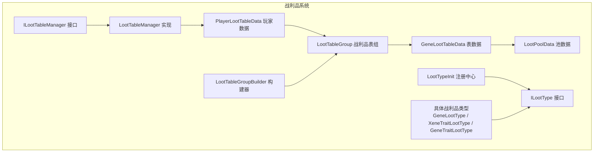
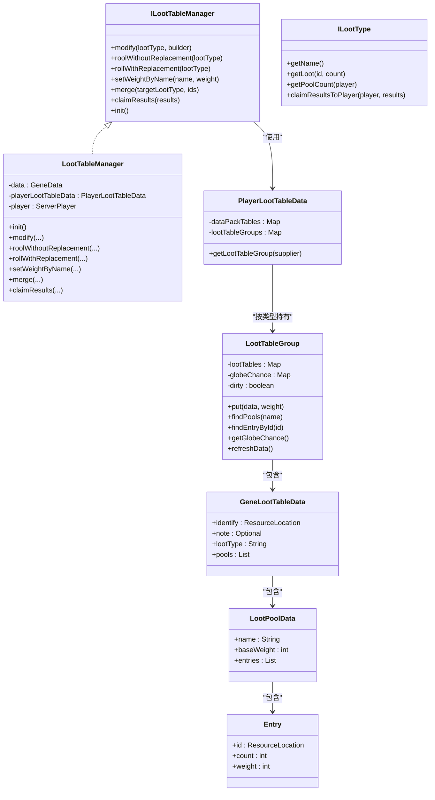
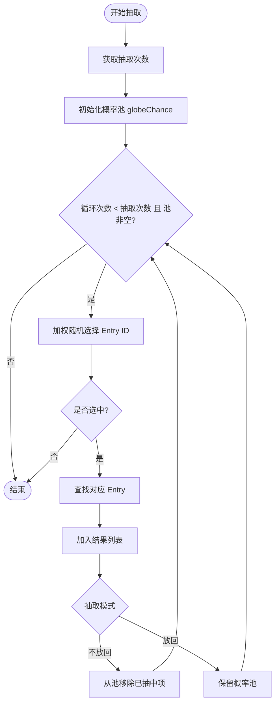
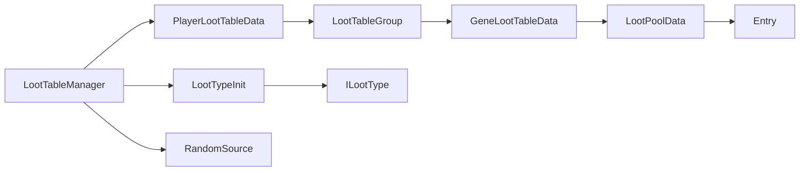
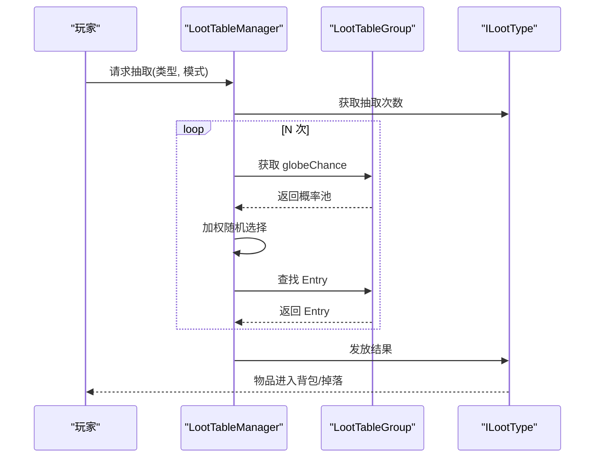

# 战利品系统

<cite>
**本文引用的文件**
- [LootTableManager.java](file://Biotech/src/main/java/org/biotech/api/system/loot/LootTableManager.java)
- [ILootTableManager.java](file://Biotech/src/main/java/org/biotech/api/system/loot/core/ILootTableManager.java)
- [ILootType.java](file://Biotech/src/main/java/org/biotech/api/system/loot/core/ILootType.java)
- [GeneLootTableData.java](file://Biotech/src/main/java/org/biotech/api/system/loot/data/GeneLootTableData.java)
- [LootPoolData.java](file://Biotech/src/main/java/org/biotech/api/system/loot/data/LootPoolData.java)
- [LootTableGroup.java](file://Biotech/src/main/java/org/biotech/api/system/loot/data/LootTableGroup.java)
- [LootTableGroupBuilder.java](file://Biotech/src/main/java/org/biotech/api/system/loot/data/LootTableGroupBuilder.java)
- [PlayerLootTableData.java](file://Biotech/src/main/java/org/biotech/api/system/loot/PlayerLootTableData.java)
- [LootTypeInit.java](file://Biotech/src/main/java/org/biotech/api/init/LootTypeInit.java)
- [GeneLootType.java](file://Biotech/src/main/java/org/biotech/loot/GeneLootType.java)
- [XeneTraitLootType.java](file://Biotech/src/main/java/org/biotech/loot/XeneTraitLootType.java)
- [GeneTraitLootType.java](file://Biotech/src/main/java/org/biotech/loot/GeneTraitLootType.java)
</cite>

## 目录
1. [简介](#简介)
2. [项目结构](#项目结构)
3. [核心组件](#核心组件)
4. [架构总览](#架构总览)
5. [详细组件分析](#详细组件分析)
6. [依赖关系分析](#依赖关系分析)
7. [性能考量](#性能考量)
8. [故障排查指南](#故障排查指南)
9. [结论](#结论)
10. [附录](#附录)

## 简介
本文件系统性阐述战利品系统的整体设计与实现，重点覆盖以下方面：
- 战利品表管理器与接口：LootTableManager 与 ILootTableManager 的职责划分与交互方式
- 数据模型：GeneLootTableData、LootPoolData、LootTableGroup 及其概率缓存机制
- 战利品类型：ILootType 接口及具体实现（如 GeneLootType、XeneTraitLootType、GeneTraitLootType）
- 抽取流程：不放回与放回两种模式的加权随机算法
- 配置与使用：如何创建与合并战利品表、批量调整权重、发放战利品
- 自定义指南与性能优化建议

## 项目结构
战利品系统位于 Biotech 模块下，采用“按功能域分层”的组织方式：
- 接口与管理器：位于 system/loot/core 与 system/loot
- 数据模型：位于 system/loot/data
- 战利品类型：位于 loot 包
- 注册中心：位于 api/init

图表来源
- [ILootTableManager.java:1-77](file://Biotech/src/main/java/org/biotech/api/system/loot/core/ILootTableManager.java#L1-L77)
- [LootTableManager.java:21-190](file://Biotech/src/main/java/org/biotech/api/system/loot/LootTableManager.java#L21-L190)
- [PlayerLootTableData.java:20-88](file://Biotech/src/main/java/org/biotech/api/system/loot/PlayerLootTableData.java#L20-L88)
- [LootTableGroup.java:17-384](file://Biotech/src/main/java/org/biotech/api/system/loot/data/LootTableGroup.java#L17-L384)
- [LootPoolData.java:24-81](file://Biotech/src/main/java/org/biotech/api/system/loot/data/LootPoolData.java#L24-L81)
- [GeneLootTableData.java:25-53](file://Biotech/src/main/java/org/biotech/api/system/loot/data/GeneLootTableData.java#L25-L53)
- [LootTableGroupBuilder.java:25-262](file://Biotech/src/main/java/org/biotech/api/system/loot/data/LootTableGroupBuilder.java#L25-L262)
- [LootTypeInit.java:19-78](file://Biotech/src/main/java/org/biotech/api/init/LootTypeInit.java#L19-L78)
- [GeneLootType.java:12-37](file://Biotech/src/main/java/org/biotech/loot/GeneLootType.java#L12-L37)
- [XeneTraitLootType.java:19-69](file://Biotech/src/main/java/org/biotech/loot/XeneTraitLootType.java#L19-L69)
- [GeneTraitLootType.java:17-75](file://Biotech/src/main/java/org/biotech/loot/GeneTraitLootType.java#L17-L75)

章节来源
- [LootTableManager.java:21-190](file://Biotech/src/main/java/org/biotech/api/system/loot/LootTableManager.java#L21-L190)
- [LootTableGroup.java:17-384](file://Biotech/src/main/java/org/biotech/api/system/loot/data/LootTableGroup.java#L17-L384)

## 核心组件
- ILootTableManager：定义战利品表管理器的统一接口，包括修改、抽取、合并、权重设置与结果发放等能力
- LootTableManager：ILootTableManager 的实现，负责实际的抽取逻辑、权重计算与结果发放
- ILootType：抽象各类战利品类型（如物品、词条、基因等），定义获取战利品对象与发放策略
- PlayerLootTableData：玩家维度的战利品数据容器，维护按类型分组的 LootTableGroup
- LootTableGroup：多张战利品表的组合与概率缓存，提供查询、修改与概率刷新能力
- 数据模型：GeneLootTableData、LootPoolData、LootPoolData.Entry 描述 JSON 结构与序列化

章节来源
- [ILootTableManager.java:14-77](file://Biotech/src/main/java/org/biotech/api/system/loot/core/ILootTableManager.java#L14-L77)
- [LootTableManager.java:21-190](file://Biotech/src/main/java/org/biotech/api/system/loot/LootTableManager.java#L21-L190)
- [ILootType.java:9-85](file://Biotech/src/main/java/org/biotech/api/system/loot/core/ILootType.java#L9-L85)
- [PlayerLootTableData.java:20-88](file://Biotech/src/main/java/org/biotech/api/system/loot/PlayerLootTableData.java#L20-L88)
- [LootTableGroup.java:17-384](file://Biotech/src/main/java/org/biotech/api/system/loot/data/LootTableGroup.java#L17-L384)
- [LootPoolData.java:24-81](file://Biotech/src/main/java/org/biotech/api/system/loot/data/LootPoolData.java#L24-L81)
- [GeneLootTableData.java:25-53](file://Biotech/src/main/java/org/biotech/api/system/loot/data/GeneLootTableData.java#L25-L53)

## 架构总览
战利品系统围绕“类型-表-池-条目”四层结构展开，通过权重与概率计算实现公平且可控的随机掉落。

图表来源
- [ILootTableManager.java:14-77](file://Biotech/src/main/java/org/biotech/api/system/loot/core/ILootTableManager.java#L14-L77)
- [LootTableManager.java:21-190](file://Biotech/src/main/java/org/biotech/api/system/loot/LootTableManager.java#L21-L190)
- [PlayerLootTableData.java:20-88](file://Biotech/src/main/java/org/biotech/api/system/loot/PlayerLootTableData.java#L20-L88)
- [LootTableGroup.java:17-384](file://Biotech/src/main/java/org/biotech/api/system/loot/data/LootTableGroup.java#L17-L384)
- [LootPoolData.java:24-81](file://Biotech/src/main/java/org/biotech/api/system/loot/data/LootPoolData.java#L24-L81)
- [GeneLootTableData.java:25-53](file://Biotech/src/main/java/org/biotech/api/system/loot/data/GeneLootTableData.java#L25-L53)

## 详细组件分析

### 战利品表管理器与接口
- 职责分离：ILootTableManager 定义契约，LootTableManager 实现具体逻辑
- 初始化：在初始化阶段将基础战利品表合并到对应类型组中
- 抽取模式：
  - 不放回：每次抽取后从全局概率池移除，避免重复
  - 放回：每次抽取后保留概率池，允许重复抽取
- 结果发放：委托 ILootType 的 claimResultsToPlayer，默认将物品加入玩家背包或掉落至地面

章节来源
- [ILootTableManager.java:14-77](file://Biotech/src/main/java/org/biotech/api/system/loot/core/ILootTableManager.java#L14-L77)
- [LootTableManager.java:34-138](file://Biotech/src/main/java/org/biotech/api/system/loot/LootTableManager.java#L34-L138)

### 数据模型与概率缓存
- GeneLootTableData：描述单张战利品表的 JSON 结构，包含 identify、note、loot_type、pools
- LootPoolData：描述池名称、基础权重与条目集合
- LootTableGroup：
  - 维护多张表与全局概率缓存 globeChance（Entry ID -> 最终概率）
  - 通过三层概率相乘计算最终概率：表概率 × 池概率 × 条目概率
  - dirty 标记控制缓存刷新，避免重复计算
- 查询与修改：
  - findPools(name) 支持同名池聚合
  - findEntryById(id) 支持跨表/跨池定位条目
  - Builder API 支持链式查找与修改

章节来源
- [GeneLootTableData.java:25-53](file://Biotech/src/main/java/org/biotech/api/system/loot/data/GeneLootTableData.java#L25-L53)
- [LootPoolData.java:24-81](file://Biotech/src/main/java/org/biotech/api/system/loot/data/LootPoolData.java#L24-L81)
- [LootTableGroup.java:17-384](file://Biotech/src/main/java/org/biotech/api/system/loot/data/LootTableGroup.java#L17-L384)
- [LootTableGroupBuilder.java:25-262](file://Biotech/src/main/java/org/biotech/api/system/loot/data/LootTableGroupBuilder.java#L25-L262)

### 抽取流程与加权随机算法
- 加权随机选择：基于 globeChance 概率池，累计权重后按随机值命中区间
- 不放回与放回：
  - 不放回：命中后从概率池移除，确保唯一性
  - 放回：保持概率池不变，允许重复命中
- 抽取次数：根据属性值拆分为整数部分（固定次数）与小数部分（额外概率），保证至少一次抽取

图表来源
- [LootTableManager.java:54-112](file://Biotech/src/main/java/org/biotech/api/system/loot/LootTableManager.java#L54-L112)
- [LootTableManager.java:149-167](file://Biotech/src/main/java/org/biotech/api/system/loot/LootTableManager.java#L149-L167)
- [ILootType.java:69-82](file://Biotech/src/main/java/org/biotech/api/system/loot/core/ILootType.java#L69-L82)

章节来源
- [LootTableManager.java:54-112](file://Biotech/src/main/java/org/biotech/api/system/loot/LootTableManager.java#L54-L112)
- [ILootType.java:21-82](file://Biotech/src/main/java/org/biotech/api/system/loot/core/ILootType.java#L21-L82)

### 战利品类型与发放策略
- ILootType：定义 getName、getLoot、getPoolCount、claimResultsToPlayer 等
- 具体类型：
  - GeneLootType：返回基因物品堆叠（GeneItem）
  - XeneTraitLootType：收集词条并封装为 XeneItem，放入“xene_equip_slot”槽位
  - GeneTraitLootType：收集词条封装为 GeneItem 并加入基因背包，返回添加结果与统计信息
- 发放策略：默认将物品加入玩家背包；若背包已满则掉落至玩家位置

章节来源
- [ILootType.java:9-85](file://Biotech/src/main/java/org/biotech/api/system/loot/core/ILootType.java#L9-L85)
- [GeneLootType.java:12-37](file://Biotech/src/main/java/org/biotech/loot/GeneLootType.java#L12-L37)
- [XeneTraitLootType.java:19-69](file://Biotech/src/main/java/org/biotech/loot/XeneTraitLootType.java#L19-L69)
- [GeneTraitLootType.java:17-75](file://Biotech/src/main/java/org/biotech/loot/GeneTraitLootType.java#L17-L75)

### 战利品包与配置方法
- 战利品包（LootPack）：用于在数据包中提供 GeneLootTableData，包含多张表与池
- 配置步骤：
  - 在数据包中定义 JSON 文件，字段对应 GeneLootTableData
  - 通过 PlayerLootTableData 的 dataPackTables 加载
  - 使用 LootTableManager.init 或 merge 将数据包中的表合并到目标类型组
- 权重与池名：
  - 通过 setWeightByName 批量调整同名池的基础权重
  - 通过 Builder API 精细定位表/池/条目进行修改

章节来源
- [PlayerLootTableData.java:20-88](file://Biotech/src/main/java/org/biotech/api/system/loot/PlayerLootTableData.java#L20-L88)
- [LootTableManager.java:34-41](file://Biotech/src/main/java/org/biotech/api/system/loot/LootTableManager.java#L34-L41)
- [LootTableManager.java:124-133](file://Biotech/src/main/java/org/biotech/api/system/loot/LootTableManager.java#L124-L133)
- [LootTableGroup.java:95-100](file://Biotech/src/main/java/org/biotech/api/system/loot/data/LootTableGroup.java#L95-L100)
- [LootTableGroupBuilder.java:47-88](file://Biotech/src/main/java/org/biotech/api/system/loot/data/LootTableGroupBuilder.java#L47-L88)

### 自定义战利品表创建指南
- 定义 JSON：
  - identify：表唯一标识
  - note：注释（可选）
  - loot_type：战利品类型字符串
  - pools：池数组，每项包含 name、base_weight、entries
- 加载与合并：
  - 将 JSON 放入数据包资源路径
  - 在初始化时调用 merge，将指定 identify 的表合并到目标类型组
- 调整权重：
  - 使用 setWeightByName 按池名批量调整
  - 使用 Builder API 精细修改表/池/条目权重与数量

章节来源
- [GeneLootTableData.java:25-53](file://Biotech/src/main/java/org/biotech/api/system/loot/data/GeneLootTableData.java#L25-L53)
- [LootPoolData.java:24-81](file://Biotech/src/main/java/org/biotech/api/system/loot/data/LootPoolData.java#L24-L81)
- [LootTableManager.java:115-133](file://Biotech/src/main/java/org/biotech/api/system/loot/LootTableManager.java#L115-L133)
- [LootTableGroupBuilder.java:47-262](file://Biotech/src/main/java/org/biotech/api/system/loot/data/LootTableGroupBuilder.java#L47-L262)

## 依赖关系分析
- 组件耦合：
  - LootTableManager 依赖 PlayerLootTableData、LootTypeInit、ILootType、LootPoolData
  - PlayerLootTableData 依赖 LootTypeInit 与 LootTableGroup
  - LootTableGroup 依赖 GeneLootTableData、LootPoolData、LootPoolData.Entry
- 外部依赖：
  - 使用 ResourceLocation 作为键值
  - 使用 RandomSource 进行加权随机
  - 通过注册中心（LootTypeInit）管理 ILootType 实例

图表来源
- [LootTableManager.java:21-190](file://Biotech/src/main/java/org/biotech/api/system/loot/LootTableManager.java#L21-L190)
- [PlayerLootTableData.java:20-88](file://Biotech/src/main/java/org/biotech/api/system/loot/PlayerLootTableData.java#L20-L88)
- [LootTableGroup.java:17-384](file://Biotech/src/main/java/org/biotech/api/system/loot/data/LootTableGroup.java#L17-L384)
- [LootPoolData.java:24-81](file://Biotech/src/main/java/org/biotech/api/system/loot/data/LootPoolData.java#L24-L81)
- [LootTypeInit.java:19-78](file://Biotech/src/main/java/org/biotech/api/init/LootTypeInit.java#L19-L78)

章节来源
- [LootTableManager.java:21-190](file://Biotech/src/main/java/org/biotech/api/system/loot/LootTableManager.java#L21-L190)
- [LootTypeInit.java:19-78](file://Biotech/src/main/java/org/biotech/api/init/LootTypeInit.java#L19-L78)

## 性能考量
- 概率缓存与惰性刷新：
  - 通过 globeChance 缓存最终概率，减少重复计算
  - dirty 标记触发刷新，避免每次访问都重新计算
- 时间复杂度：
  - 概率计算：O(T×P×E)，T 为表数，P 为池数，E 为条目数
  - 抽取：单次抽取 O(E)，N 次抽取 O(N×E)
- 建议：
  - 合理设置池与条目数量，避免过深嵌套
  - 使用 setWeightByName 批量调整权重，减少逐条修改
  - 在初始化阶段完成合并与修改，运行期仅做抽取与发放

[本节为通用性能建议，无需特定文件引用]

## 故障排查指南
- 抽取结果为空：
  - 检查目标类型组是否正确合并了数据包表
  - 确认 globeChance 是否为空（可能由于权重总和为 0）
- 权重无效：
  - 确认 setWeightByName 的池名与 JSON 中一致
  - 使用 Builder API 精确修改池与条目权重
- 发放异常：
  - 检查 ILootType 的 claimResultsToPlayer 实现（如 XeneTraitLootType、GeneTraitLootType）
  - 确认 Curios 槽位可用性与背包空间

章节来源
- [LootTableManager.java:115-133](file://Biotech/src/main/java/org/biotech/api/system/loot/LootTableManager.java#L115-L133)
- [LootTableGroup.java:346-381](file://Biotech/src/main/java/org/biotech/api/system/loot/data/LootTableGroup.java#L346-L381)
- [XeneTraitLootType.java:37-65](file://Biotech/src/main/java/org/biotech/loot/XeneTraitLootType.java#L37-L65)
- [GeneTraitLootType.java:35-67](file://Biotech/src/main/java/org/biotech/loot/GeneTraitLootType.java#L35-L67)

## 结论
本战利品系统以清晰的层次化设计实现了灵活的掉落配置与高效的随机抽取。通过 ILootTableManager 与 ILootType 的解耦、LootTableGroup 的概率缓存与 Builder API 的链式修改，开发者可以便捷地定制各类战利品表，并在运行期高效地进行抽取与发放。配合数据包机制与注册中心，系统具备良好的扩展性与可维护性。

[本节为总结性内容，无需特定文件引用]

## 附录
- 关键流程时序：玩家发起抽取 → 管理器计算抽取次数 → 选择条目 → 结果发放

图表来源
- [LootTableManager.java:54-112](file://Biotech/src/main/java/org/biotech/api/system/loot/LootTableManager.java#L54-L112)
- [ILootType.java:33-46](file://Biotech/src/main/java/org/biotech/api/system/loot/core/ILootType.java#L33-L46)
- [LootTableGroup.java:52-68](file://Biotech/src/main/java/org/biotech/api/system/loot/data/LootTableGroup.java#L52-L68)