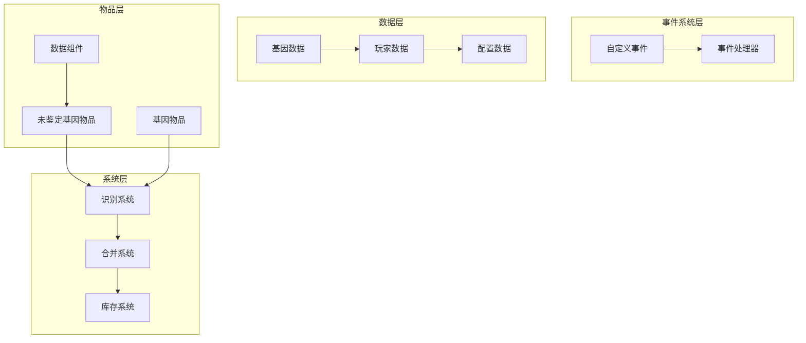
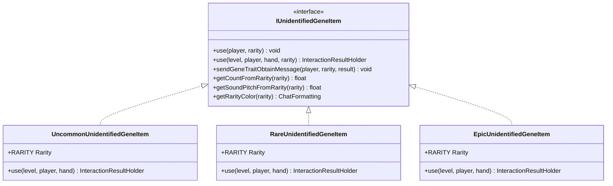
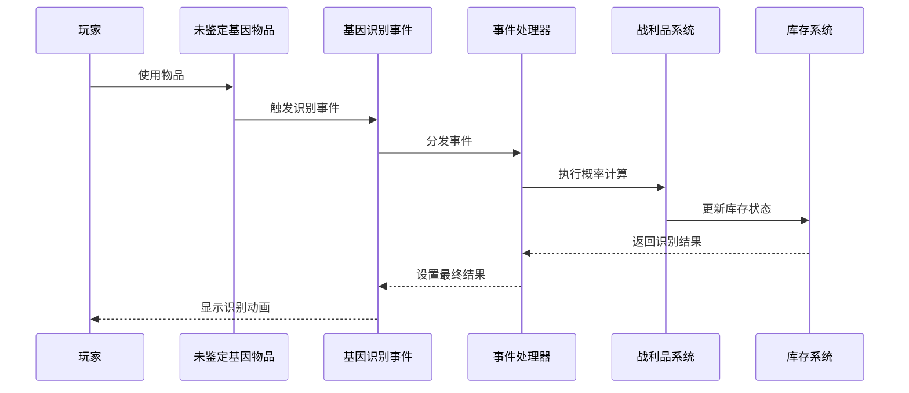
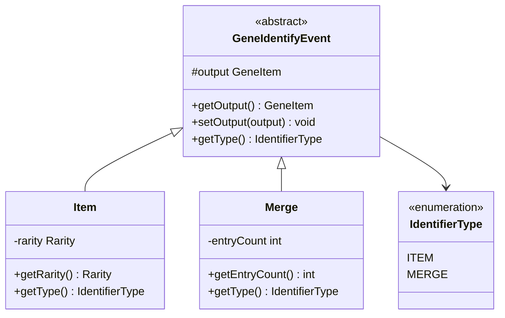
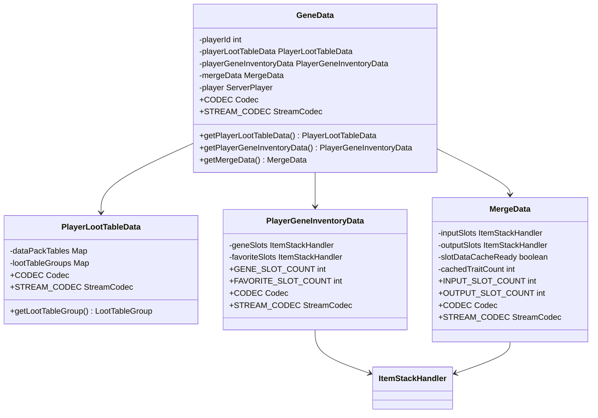
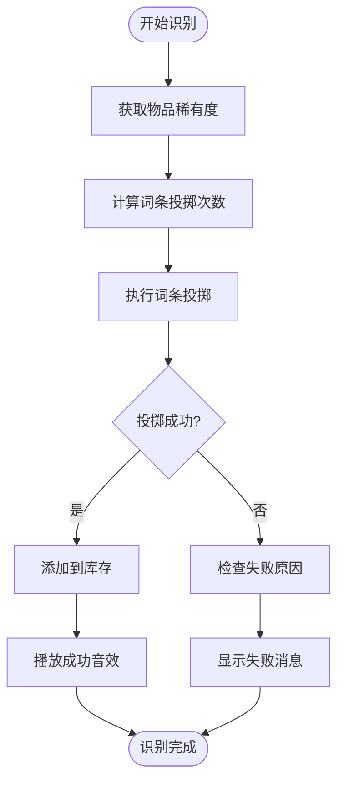
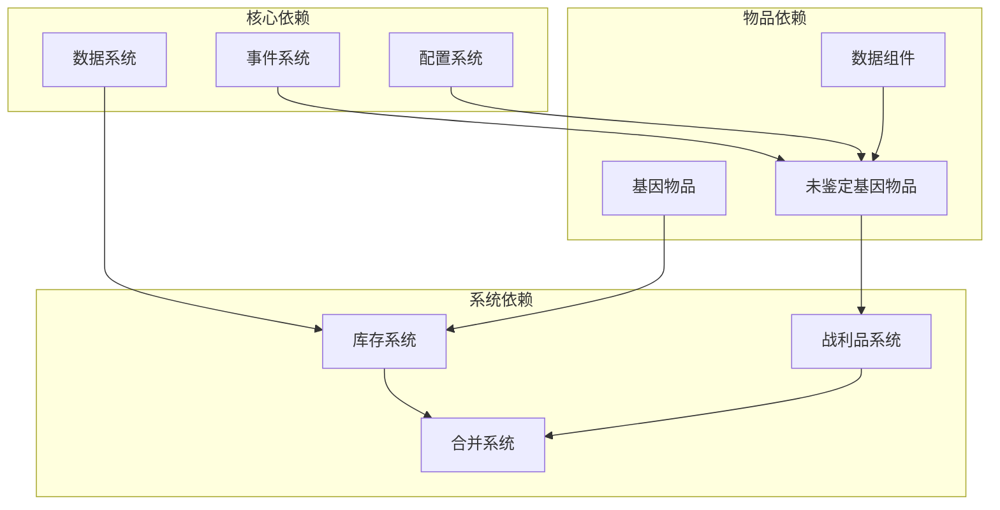

# 未鉴定基因识别系统

<cite>
**本文档引用的文件**
- [GeneIdentifyEvent.java](file://Biotech/src/main/java/org/biotech/api/event/custom/GeneIdentifyEvent.java)
- [IUnidentifiedGeneItem.java](file://Biotech/src/main/java/org/biotech/api/system/gene/core/IUnidentifiedGeneItem.java)
- [UncommonUnidentifiedGeneItem.java](file://Biotech/src/main/java/org/biotech/item/UncommonUnidentifiedGeneItem.java)
- [RareUnidentifiedGeneItem.java](file://Biotech/src/main/java/org/biotech/item/RareUnidentifiedGeneItem.java)
- [EpicUnidentifiedGeneItem.java](file://Biotech/src/main/java/org/biotech/item/EpicUnidentifiedGeneItem.java)
- [GeneRarity.java](file://Biotech/src/main/java/org/biotech/api/system/gene/core/GeneRarity.java)
- [ServerConfig.java](file://Biotech/src/main/java/org/biotech/api/config/ServerConfig.java)
- [GeneData.java](file://Biotech/src/main/java/org/biotech/api/GeneData.java)
- [AttachInit.java](file://Biotech/src/main/java/org/biotech/api/init/AttachInit.java)
- [DataComponentInit.java](file://Biotech/src/main/java/org/biotech/api/init/DataComponentInit.java)
- [PlayerGeneInventoryData.java](file://Biotech/src/main/java/org/biotech/api/system/gene/inventory/PlayerGeneInventoryData.java)
- [PlayerLootTableData.java](file://Biotech/src/main/java/org/biotech/api/system/loot/PlayerLootTableData.java)
- [MergeData.java](file://Biotech/src/main/java/org/biotech/api/system/merge/MergeData.java)
- [GeneDataHandle.java](file://Biotech/src/main/java/org/biotech/api/event/handle/GeneDataHandle.java)
</cite>

## 目录
1. [简介](#简介)
2. [项目结构](#项目结构)
3. [核心组件](#核心组件)
4. [架构概览](#架构概览)
5. [详细组件分析](#详细组件分析)
6. [依赖关系分析](#依赖关系分析)
7. [性能考虑](#性能考虑)
8. [故障排除指南](#故障排除指南)
9. [结论](#结论)

## 简介

未鉴定基因识别系统是一个基于Minecraft Forge框架构建的复杂基因管理系统，专门用于处理基因物品的识别、合并和属性分配。该系统实现了完整的基因识别机制，包括稀有度分级（普通、罕见、稀有、史诗）和对应的识别算法。

系统的核心设计目标是为玩家提供一个沉浸式的基因收集和管理体验，通过多种识别方式（物品识别和合并识别）来获得不同品质的基因物品。每个识别过程都经过精心设计的概率计算和冷却时间管理，确保游戏平衡性和可玩性。

## 项目结构

生物技术模块采用分层架构设计，主要包含以下核心层次：

**图表来源**
- [GeneIdentifyEvent.java:1-108](file://Biotech/src/main/java/org/biotech/api/event/custom/GeneIdentifyEvent.java#L1-L108)
- [GeneData.java:1-101](file://Biotech/src/main/java/org/biotech/api/GeneData.java#L1-L101)
- [IUnidentifiedGeneItem.java:1-138](file://Biotech/src/main/java/org/biotech/api/system/gene/core/IUnidentifiedGeneItem.java#L1-L138)

**章节来源**
- [GeneIdentifyEvent.java:1-108](file://Biotech/src/main/java/org/biotech/api/event/custom/GeneIdentifyEvent.java#L1-L108)
- [GeneData.java:1-101](file://Biotech/src/main/java/org/biotech/api/GeneData.java#L1-L101)

## 核心组件

### 稀有度分级系统

系统实现了四层稀有度分级体系，每种稀有度都有其独特的识别特性和概率参数：

| 稀有度 | 数值权重 | 稀有度等级 | 双词条概率 | 音调系数 |
|--------|----------|------------|------------|----------|
| 普通 | 1 | UNCOMMON | 低 | 1.7F |
| 罕见 | 2 | RARE | 中等 | 1.8F |
| 稀有 | 3 | EPIC | 高 | 1.9F |

稀有度系统通过`GeneRarity`枚举类实现，该类提供了从自定义稀有度到Minecraft稀有度的双向映射功能。

**章节来源**
- [GeneRarity.java:1-48](file://Biotech/src/main/java/org/biotech/api/system/gene/core/GeneRarity.java#L1-L48)
- [ServerConfig.java:1-49](file://Biotech/src/main/java/org/biotech/api/config/ServerConfig.java#L1-L49)

### 未鉴定基因物品系统

系统包含三种不同稀有度的未鉴定基因物品，每种物品都实现了统一的识别接口：

**图表来源**
- [IUnidentifiedGeneItem.java:1-138](file://Biotech/src/main/java/org/biotech/api/system/gene/core/IUnidentifiedGeneItem.java#L1-L138)
- [UncommonUnidentifiedGeneItem.java:1-31](file://Biotech/src/main/java/org/biotech/item/UncommonUnidentifiedGeneItem.java#L1-L31)
- [RareUnidentifiedGeneItem.java:1-32](file://Biotech/src/main/java/org/biotech/item/RareUnidentifiedGeneItem.java#L1-L32)
- [EpicUnidentifiedGeneItem.java:1-31](file://Biotech/src/main/java/org/biotech/item/EpicUnidentifiedGeneItem.java#L1-L31)

**章节来源**
- [UncommonUnidentifiedGeneItem.java:1-31](file://Biotech/src/main/java/org/biotech/item/UncommonUnidentifiedGeneItem.java#L1-L31)
- [RareUnidentifiedGeneItem.java:1-32](file://Biotech/src/main/java/org/biotech/item/RareUnidentifiedGeneItem.java#L1-L32)
- [EpicUnidentifiedGeneItem.java:1-31](file://Biotech/src/main/java/org/biotech/item/EpicUnidentifiedGeneItem.java#L1-L31)

## 架构概览

系统采用事件驱动架构，通过自定义事件机制实现松耦合的组件交互：

**图表来源**
- [GeneIdentifyEvent.java:1-108](file://Biotech/src/main/java/org/biotech/api/event/custom/GeneIdentifyEvent.java#L1-L108)
- [IUnidentifiedGeneItem.java:1-138](file://Biotech/src/main/java/org/biotech/api/system/gene/core/IUnidentifiedGeneItem.java#L1-L138)

## 详细组件分析

### 基因识别事件系统

基因识别事件系统是整个识别机制的核心，它提供了统一的事件接口和灵活的结果处理能力：

**图表来源**
- [GeneIdentifyEvent.java:1-108](file://Biotech/src/main/java/org/biotech/api/event/custom/GeneIdentifyEvent.java#L1-L108)

事件系统的关键特性包括：

1. **不可取消性**：识别事件一旦触发就不能被取消，确保识别过程的完整性
2. **结果可修改**：事件监听器可以修改识别结果，提供灵活的扩展机制
3. **类型区分**：支持物品识别和合并识别两种不同的识别模式

**章节来源**
- [GeneIdentifyEvent.java:1-108](file://Biotech/src/main/java/org/biotech/api/event/custom/GeneIdentifyEvent.java#L1-L108)

### 数据处理逻辑

基因数据处理系统通过`GeneData`类实现，该类聚合了所有与基因相关的数据：

**图表来源**
- [GeneData.java:1-101](file://Biotech/src/main/java/org/biotech/api/GeneData.java#L1-L101)
- [PlayerLootTableData.java:1-88](file://Biotech/src/main/java/org/biotech/api/system/loot/PlayerLootTableData.java#L1-L88)
- [PlayerGeneInventoryData.java:1-72](file://Biotech/src/main/java/org/biotech/api/system/gene/inventory/PlayerGeneInventoryData.java#L1-L72)
- [MergeData.java:1-114](file://Biotech/src/main/java/org/biotech/api/system/merge/MergeData.java#L1-L114)

**章节来源**
- [GeneData.java:1-101](file://Biotech/src/main/java/org/biotech/api/GeneData.java#L1-L101)
- [PlayerLootTableData.java:1-88](file://Biotech/src/main/java/org/biotech/api/system/loot/PlayerLootTableData.java#L1-L88)
- [PlayerGeneInventoryData.java:1-72](file://Biotech/src/main/java/org/biotech/api/system/gene/inventory/PlayerGeneInventoryData.java#L1-L72)
- [MergeData.java:1-114](file://Biotech/src/main/java/org/biotech/api/system/merge/MergeData.java#L1-L114)

### 识别概率计算机制

识别概率计算是系统的核心算法，基于稀有度和词条数量进行动态调整：

**图表来源**
- [IUnidentifiedGeneItem.java:26-46](file://Biotech/src/main/java/org/biotech/api/system/gene/core/IUnidentifiedGeneItem.java#L26-L46)
- [ServerConfig.java:37-47](file://Biotech/src/main/java/org/biotech/api/config/ServerConfig.java#L37-L47)

识别过程的关键参数包括：

1. **词条投掷次数**：根据稀有度动态调整，普通1.1次、罕见1.5次、稀有2.1次
2. **音调系数**：影响识别动画的音效音调，稀有度越高音调越高
3. **颜色编码**：不同稀有度对应不同的聊天消息颜色

**章节来源**
- [IUnidentifiedGeneItem.java:98-126](file://Biotech/src/main/java/org/biotech/api/system/gene/core/IUnidentifiedGeneItem.java#L98-L126)
- [ServerConfig.java:15-32](file://Biotech/src/main/java/org/biotech/api/config/ServerConfig.java#L15-L32)

### 冷却时间管理

系统通过配置文件实现冷却时间管理，确保识别行为的平衡性：

| 配置项 | 默认值 | 最小值 | 最大值 | 描述 |
|--------|--------|--------|--------|------|
| uncommon_gene_trait_roll_count | 1.1 | 0.0 | 100.0 | 普通物品词条投掷次数 |
| rare_gene_trait_roll_count | 1.5 | 0.0 | 100.0 | 罕见物品词条投掷次数 |
| epic_gene_trait_roll_count | 2.1 | 0.0 | 100.0 | 稀有物品词条投掷次数 |

冷却时间的实现依赖于Minecraft的属性系统，通过设置`GENE_TRAIT_ROLL_COUNT`属性来控制每次识别的词条数量。

**章节来源**
- [ServerConfig.java:15-32](file://Biotech/src/main/java/org/biotech/api/config/ServerConfig.java#L15-L32)

## 依赖关系分析

系统采用模块化设计，各组件之间的依赖关系清晰明确：

**图表来源**
- [AttachInit.java:1-34](file://Biotech/src/main/java/org/biotech/api/init/AttachInit.java#L1-L34)
- [DataComponentInit.java:1-47](file://Biotech/src/main/java/org/biotech/api/init/DataComponentInit.java#L1-L47)

**章节来源**
- [AttachInit.java:19-31](file://Biotech/src/main/java/org/biotech/api/init/AttachInit.java#L19-L31)
- [DataComponentInit.java:32-44](file://Biotech/src/main/java/org/biotech/api/init/DataComponentInit.java#L32-L44)

## 性能考虑

系统在设计时充分考虑了性能优化，主要体现在以下几个方面：

1. **延迟初始化**：所有基因相关数据采用延迟初始化策略，避免不必要的内存占用
2. **缓存机制**：合并数据中实现了运行时缓存，减少频繁计算的开销
3. **网络同步优化**：使用高效的序列化机制，最小化网络传输数据量
4. **事件处理优化**：通过事件总线实现异步处理，避免阻塞主线程

## 故障排除指南

### 常见问题及解决方案

1. **识别失败问题**
   - 检查玩家基因库存是否已满
   - 确认识别物品的稀有度配置正确
   - 验证战利品表数据是否正常加载

2. **数据丢失问题**
   - 检查基因数据附件是否正确注册
   - 确认数据序列化配置是否正确
   - 验证玩家重生或死亡后的数据继承

3. **性能问题**
   - 监控事件处理的执行时间
   - 检查缓存机制是否正常工作
   - 优化大型合并操作的处理逻辑

**章节来源**
- [GeneDataHandle.java:1-40](file://Biotech/src/main/java/org/biotech/api/event/handle/GeneDataHandle.java#L1-L40)

## 结论

未鉴定基因识别系统是一个设计精良的基因管理模块，通过事件驱动架构实现了高度模块化的组件交互。系统不仅提供了完整的识别机制，还具备良好的扩展性和性能表现。

该系统的主要优势包括：

1. **清晰的架构设计**：分层架构确保了代码的可维护性和可扩展性
2. **灵活的事件系统**：支持多种识别模式和结果定制
3. **完善的配置管理**：通过配置文件实现参数的动态调整
4. **优秀的性能表现**：采用多种优化策略确保系统高效运行

未来可以考虑的改进方向包括：增加更多的识别模式、优化用户界面体验、增强数据分析功能等。