# 核心系统架构

<cite>
**本文引用的文件**
- [Biotech.java](file://Biotech/src/main/java/org/biotech/Biotech.java)
- [BiotechAPI.java](file://Biotech/src/main/java/org/biotech/api/BiotechAPI.java)
- [GeneData.java](file://Biotech/src/main/java/org/biotech/api/GeneData.java)
- [ServerConfig.java](file://Biotech/src/main/java/org/biotech/api/config/ServerConfig.java)
- [AttachInit.java](file://Biotech/src/main/java/org/biotech/api/init/AttachInit.java)
- [CapInit.java](file://Biotech/src/main/java/org/biotech/api/init/CapInit.java)
- [IGene.java](file://Biotech/src/main/java/org/biotech/api/system/gene/core/IGene.java)
- [GeneRegistryHolder.java](file://Biotech/src/main/java/org/biotech/api/system/gene/GeneRegistryHolder.java)
- [PlayerGeneInventoryData.java](file://Biotech/src/main/java/org/biotech/api/system/gene/inventory/PlayerGeneInventoryData.java)
- [GeneInventoryManager.java](file://Biotech/src/main/java/org/biotech/api/system/gene/inventory/GeneInventoryManager.java)
- [LootTableManager.java](file://Biotech/src/main/java/org/biotech/api/system/loot/LootTableManager.java)
- [MergeManager.java](file://Biotech/src/main/java/org/biotech/api/system/merge/MergeManager.java)
- [ChoiceManager.java](file://Biotech/src/main/java/org/biotech/api/system/choice/ChoiceManager.java)
</cite>

## 目录
1. [引言](#引言)
2. [项目结构](#项目结构)
3. [核心组件](#核心组件)
4. [架构总览](#架构总览)
5. [详细组件分析](#详细组件分析)
6. [依赖分析](#依赖分析)
7. [性能考虑](#性能考虑)
8. [故障排查指南](#故障排查指南)
9. [结论](#结论)
10. [附录](#附录)

## 引言
本文件面向Biotech模块的核心系统架构，围绕BiotechAPI接口设计与实现、基因数据模型、服务器配置管理以及模块初始化流程进行系统性阐述。文档同时解释Biotech主类的架构设计（事件总线注册、配置管理与模块依赖）、基因数据结构的设计理念与数据访问模式，并提供核心接口的使用示例与最佳实践，覆盖模块间协作机制与扩展点设计。

## 项目结构
Biotech模块采用按功能域分层的组织方式，核心入口为Mod主类，负责注册事件总线、配置与各类初始化器；API层提供对外统一接口；系统层包含基因、战利书、合并与选择等子系统；数据层以附件与能力为核心承载基因相关状态。

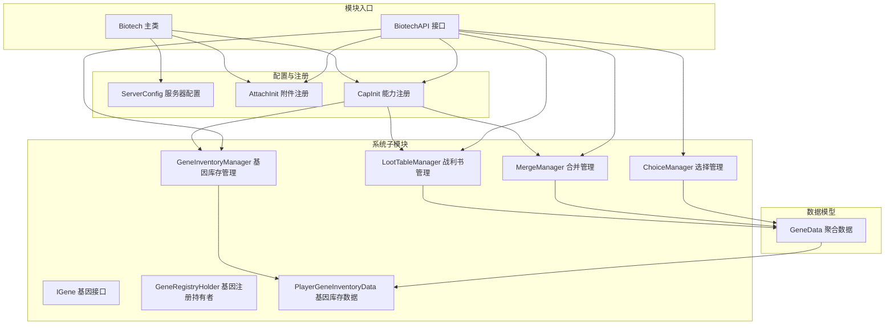

图表来源
- [Biotech.java:16-72](file://Biotech/src/main/java/org/biotech/Biotech.java#L16-L72)
- [BiotechAPI.java:21-92](file://Biotech/src/main/java/org/biotech/api/BiotechAPI.java#L21-L92)
- [AttachInit.java:12-33](file://Biotech/src/main/java/org/biotech/api/init/AttachInit.java#L12-L33)
- [CapInit.java:17-61](file://Biotech/src/main/java/org/biotech/api/init/CapInit.java#L17-L61)
- [ServerConfig.java:5-48](file://Biotech/src/main/java/org/biotech/api/config/ServerConfig.java#L5-L48)
- [IGene.java:15-91](file://Biotech/src/main/java/org/biotech/api/system/gene/core/IGene.java#L15-L91)
- [PlayerGeneInventoryData.java:20-72](file://Biotech/src/main/java/org/biotech/api/system/gene/inventory/PlayerGeneInventoryData.java#L20-L72)
- [GeneInventoryManager.java:18-186](file://Biotech/src/main/java/org/biotech/api/system/gene/inventory/GeneInventoryManager.java#L18-L186)
- [LootTableManager.java:21-190](file://Biotech/src/main/java/org/biotech/api/system/loot/LootTableManager.java#L21-L190)
- [MergeManager.java:24-207](file://Biotech/src/main/java/org/biotech/api/system/merge/MergeManager.java#L24-L207)
- [ChoiceManager.java:16-68](file://Biotech/src/main/java/org/biotech/api/system/choice/ChoiceManager.java#L16-L68)
- [GeneData.java:17-101](file://Biotech/src/main/java/org/biotech/api/GeneData.java#L17-L101)

章节来源
- [Biotech.java:16-72](file://Biotech/src/main/java/org/biotech/Biotech.java#L16-L72)
- [BiotechAPI.java:21-92](file://Biotech/src/main/java/org/biotech/api/BiotechAPI.java#L21-L92)

## 核心组件
- Biotech主类：负责模块生命周期内的事件总线注册、配置注册与初始化器调度，确保注册表、附件、能力与菜单等在正确时机完成注册。
- BiotechAPI：对外统一入口，提供获取玩家基因数据、打开UI、访问库存/战利书/合并/选择管理器的能力，以及Curios装备槽访问。
- GeneData：聚合型数据容器，延迟初始化玩家的战利书、基因库存与合并相关数据，提供序列化编解码支持。
- ServerConfig：服务器配置规范，定义未鉴定基因的属性投掷倍率等参数，便于运行时调整。
- AttachInit：注册玩家附件类型，将GeneData绑定到玩家实体，支持序列化与死亡继承。
- CapInit：注册实体能力，将LootTableManager、GeneInventoryManager、MergeManager注入到玩家实体上，供API层统一访问。
- IGene与GeneRegistryHolder：定义基因抽象接口与注册持有者，支撑基因注册、序列化与网络同步。
- PlayerGeneInventoryData与GeneInventoryManager：定义基因库存槽位与收藏槽位，提供增删查与UI交互。
- LootTableManager：基于战利书组的加权随机抽取，支持不放回与放回两种策略，支持权重修改与表合并。
- MergeManager：基于输入基因词条数与平均词条密度计算输出Xenogene数量与稀有度，执行消耗与产出。
- ChoiceManager：基于属性值控制可选择次数，驱动战利书抽取并进入选择界面。

章节来源
- [Biotech.java:23-61](file://Biotech/src/main/java/org/biotech/Biotech.java#L23-L61)
- [BiotechAPI.java:27-90](file://Biotech/src/main/java/org/biotech/api/BiotechAPI.java#L27-L90)
- [GeneData.java:43-99](file://Biotech/src/main/java/org/biotech/api/GeneData.java#L43-L99)
- [ServerConfig.java:37-47](file://Biotech/src/main/java/org/biotech/api/config/ServerConfig.java#L37-L47)
- [AttachInit.java:19-31](file://Biotech/src/main/java/org/biotech/api/init/AttachInit.java#L19-L31)
- [CapInit.java:21-58](file://Biotech/src/main/java/org/biotech/api/init/CapInit.java#L21-L58)
- [IGene.java:15-91](file://Biotech/src/main/java/org/biotech/api/system/gene/core/IGene.java#L15-L91)
- [PlayerGeneInventoryData.java:52-71](file://Biotech/src/main/java/org/biotech/api/system/gene/inventory/PlayerGeneInventoryData.java#L52-L71)
- [GeneInventoryManager.java:46-184](file://Biotech/src/main/java/org/biotech/api/system/gene/inventory/GeneInventoryManager.java#L46-L184)
- [LootTableManager.java:34-187](file://Biotech/src/main/java/org/biotech/api/system/loot/LootTableManager.java#L34-L187)
- [MergeManager.java:36-206](file://Biotech/src/main/java/org/biotech/api/system/merge/MergeManager.java#L36-L206)
- [ChoiceManager.java:25-64](file://Biotech/src/main/java/org/biotech/api/system/choice/ChoiceManager.java#L25-L64)

## 架构总览
下图展示Biotech模块的高层架构与关键交互路径：主类负责注册与初始化；API层作为门面；附件与能力分别承载持久化数据与行为管理；各系统子模块围绕数据模型协同工作。

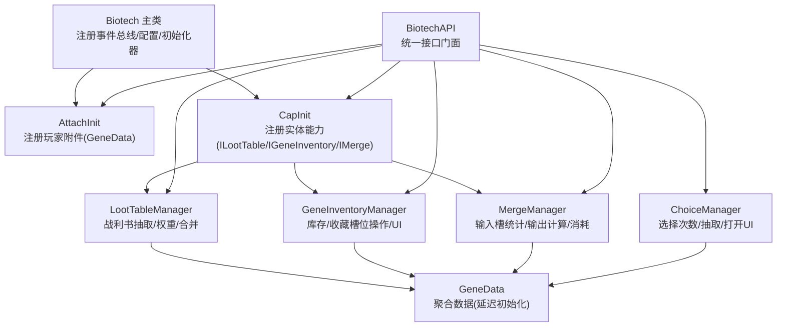

图表来源
- [Biotech.java:23-61](file://Biotech/src/main/java/org/biotech/Biotech.java#L23-L61)
- [BiotechAPI.java:27-90](file://Biotech/src/main/java/org/biotech/api/BiotechAPI.java#L27-L90)
- [AttachInit.java:19-31](file://Biotech/src/main/java/org/biotech/api/init/AttachInit.java#L19-L31)
- [CapInit.java:40-58](file://Biotech/src/main/java/org/biotech/api/init/CapInit.java#L40-L58)
- [LootTableManager.java:27-32](file://Biotech/src/main/java/org/biotech/api/system/loot/LootTableManager.java#L27-L32)
- [GeneInventoryManager.java:23-26](file://Biotech/src/main/java/org/biotech/api/system/gene/inventory/GeneInventoryManager.java#L23-L26)
- [MergeManager.java:29-32](file://Biotech/src/main/java/org/biotech/api/system/merge/MergeManager.java#L29-L32)
- [ChoiceManager.java:20-22](file://Biotech/src/main/java/org/biotech/api/system/choice/ChoiceManager.java#L20-L22)

## 详细组件分析

### Biotech主类与模块初始化
- 事件总线注册：在构造函数中注册注册表、数据组件、物品、附魔、属性、菜单等初始化器，并显式监听Curios属性变更事件，保证注解订阅失效时仍能触发。
- 服务器配置：通过Mod容器注册服务器配置规范，使运行时参数生效。
- 注册表初始化：通过事件总线监听注册Trait、Gene、LootType等注册表，确保注册顺序与一致性。

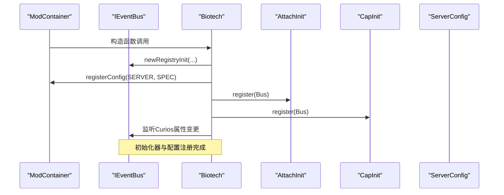

图表来源
- [Biotech.java:23-61](file://Biotech/src/main/java/org/biotech/Biotech.java#L23-L61)
- [AttachInit.java:15-17](file://Biotech/src/main/java/org/biotech/api/init/AttachInit.java#L15-L17)
- [CapInit.java:39-58](file://Biotech/src/main/java/org/biotech/api/init/CapInit.java#L39-L58)
- [ServerConfig.java:9-31](file://Biotech/src/main/java/org/biotech/api/config/ServerConfig.java#L9-L31)

章节来源
- [Biotech.java:23-61](file://Biotech/src/main/java/org/biotech/Biotech.java#L23-L61)

### BiotechAPI接口设计与实现原理
- 数据访问：通过玩家实体获取附件中的GeneData，或通过能力获取库存、战利书、合并与选择管理器。
- UI交互：提供打开他人基因库存与基因选择界面的方法，记录日志以便追踪。
- Curios集成：通过CuriosApi获取指定槽位的堆栈处理器，支持基因与Xenogene装备槽。

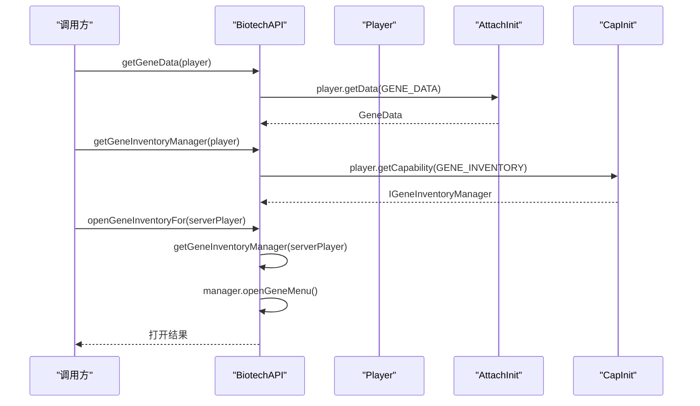

图表来源
- [BiotechAPI.java:27-56](file://Biotech/src/main/java/org/biotech/api/BiotechAPI.java#L27-L56)
- [AttachInit.java:19-31](file://Biotech/src/main/java/org/biotech/api/init/AttachInit.java#L19-L31)
- [CapInit.java:48-52](file://Biotech/src/main/java/org/biotech/api/init/CapInit.java#L48-L52)

章节来源
- [BiotechAPI.java:27-90](file://Biotech/src/main/java/org/biotech/api/BiotechAPI.java#L27-L90)

### 基因数据模型与数据访问模式
- 聚合数据：GeneData聚合玩家的战利书、基因库存与合并数据，采用延迟初始化避免不必要的内存占用。
- 序列化：提供Codec与StreamCodec，确保数据在网络传输与存档中的一致性与可恢复性。
- 附件绑定：通过AttachInit将GeneData注册为玩家附件，支持复制至死亡后与序列化同步。

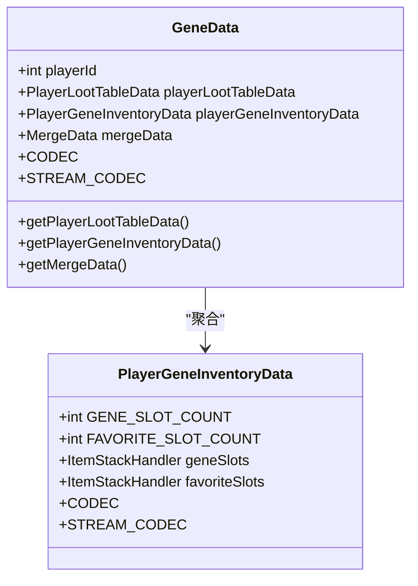

图表来源
- [GeneData.java:18-99](file://Biotech/src/main/java/org/biotech/api/GeneData.java#L18-L99)
- [PlayerGeneInventoryData.java:21-71](file://Biotech/src/main/java/org/biotech/api/system/gene/inventory/PlayerGeneInventoryData.java#L21-L71)

章节来源
- [GeneData.java:43-99](file://Biotech/src/main/java/org/biotech/api/GeneData.java#L43-L99)
- [PlayerGeneInventoryData.java:33-71](file://Biotech/src/main/java/org/biotech/api/system/gene/inventory/PlayerGeneInventoryData.java#L33-L71)

### 基因接口与注册体系
- IGene接口：扩展Curios的ICurioItem，提供显示名、装备/卸下回调、可装备性判断与tick等钩子；定义基于ResourceLocation的序列化与网络同步。
- 注册持有者：通过Supplier持有IGene实例，生成GeneInstance，便于注册与检索。

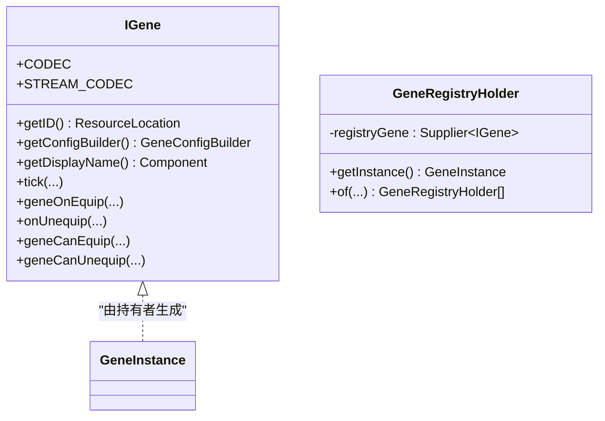

图表来源
- [IGene.java:15-91](file://Biotech/src/main/java/org/biotech/api/system/gene/core/IGene.java#L15-L91)
- [GeneRegistryHolder.java:10-24](file://Biotech/src/main/java/org/biotech/api/system/gene/GeneRegistryHolder.java#L10-L24)

章节来源
- [IGene.java:15-91](file://Biotech/src/main/java/org/biotech/api/system/gene/core/IGene.java#L15-L91)
- [GeneRegistryHolder.java:13-19](file://Biotech/src/main/java/org/biotech/api/system/gene/GeneRegistryHolder.java#L13-L19)

### 基因库存系统
- 数据结构：PlayerGeneInventoryData定义243个基因槽位与243个收藏槽位，仅允许IGeneItem类型，使用ItemStackHandler管理。
- 管理器：GeneInventoryManager提供添加、删除、查询、收藏等功能，支持自动定位空槽与批量操作。

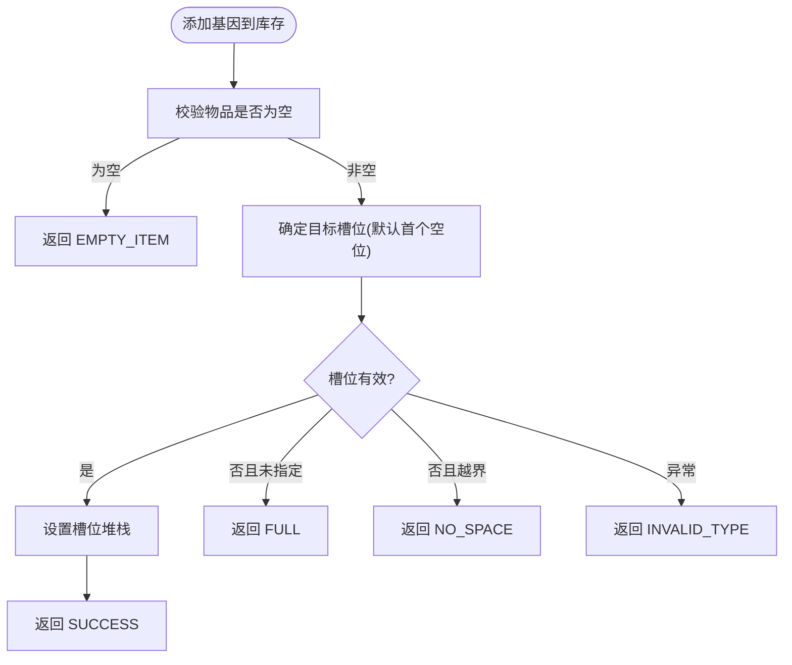

图表来源
- [GeneInventoryManager.java:46-80](file://Biotech/src/main/java/org/biotech/api/system/gene/inventory/GeneInventoryManager.java#L46-L80)
- [PlayerGeneInventoryData.java:60-68](file://Biotech/src/main/java/org/biotech/api/system/gene/inventory/PlayerGeneInventoryData.java#L60-L68)

章节来源
- [PlayerGeneInventoryData.java:28-71](file://Biotech/src/main/java/org/biotech/api/system/gene/inventory/PlayerGeneInventoryData.java#L28-L71)
- [GeneInventoryManager.java:46-184](file://Biotech/src/main/java/org/biotech/api/system/gene/inventory/GeneInventoryManager.java#L46-L184)

### 战利书系统
- 初始化：LootTableManager在初始化阶段合并基础战利书表，支持后续动态修改。
- 抽取算法：roolWithoutReplacement与rollWithReplacement分别实现不放回与放回的加权随机抽取，内部维护概率池并迭代选择。
- 权重与合并：支持按名称调整权重、合并多个战利书表，便于内容包扩展。

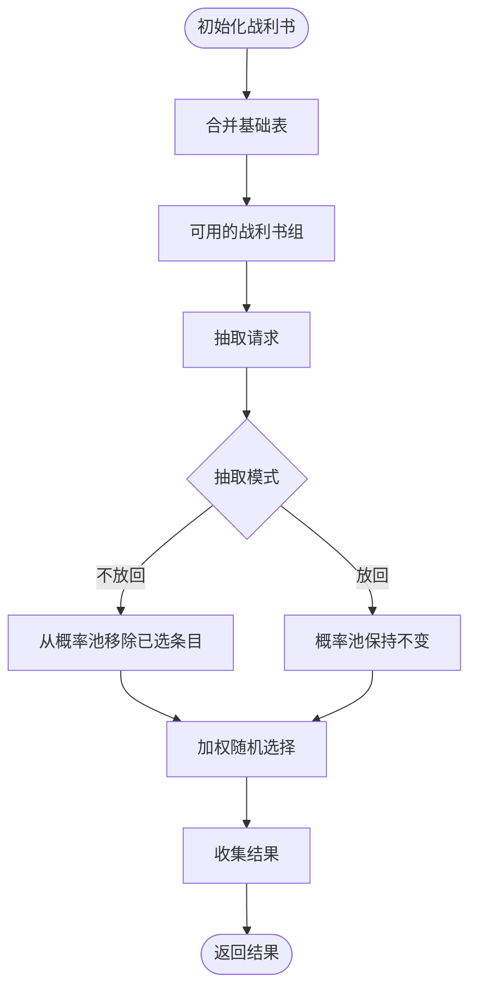

图表来源
- [LootTableManager.java:34-41](file://Biotech/src/main/java/org/biotech/api/system/loot/LootTableManager.java#L34-L41)
- [LootTableManager.java:55-112](file://Biotech/src/main/java/org/biotech/api/system/loot/LootTableManager.java#L55-L112)
- [LootTableManager.java:115-133](file://Biotech/src/main/java/org/biotech/api/system/loot/LootTableManager.java#L115-L133)

章节来源
- [LootTableManager.java:34-187](file://Biotech/src/main/java/org/biotech/api/system/loot/LootTableManager.java#L34-L187)

### 合并系统
- 输入统计：当输入槽变化时，统计总词条数、每基因平均词条数、输入基因数量，并缓存结果。
- 输出计算：依据平均词条密度决定输出稀有度（Epic/Rare/Uncommon），并计算输出数量上限（受输入基因数量限制）。
- 产出发放：消耗对应数量的输入基因，按稀有度生成未鉴定基因，播放确认音效。

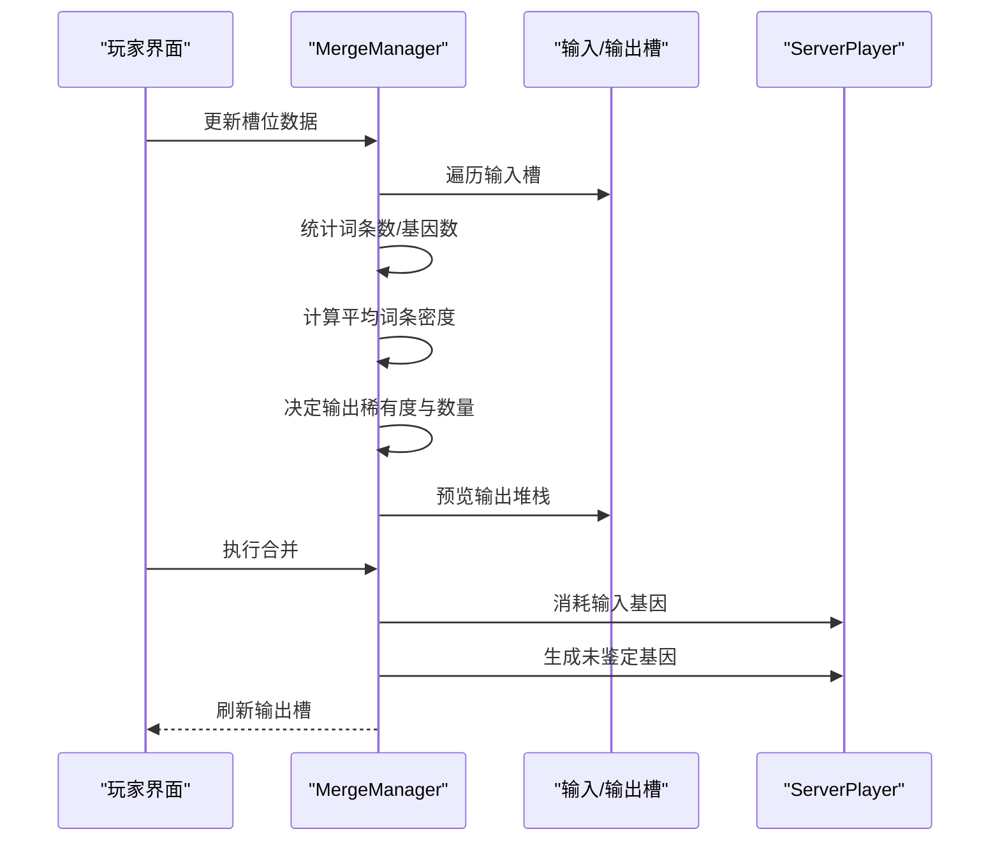

图表来源
- [MergeManager.java:36-77](file://Biotech/src/main/java/org/biotech/api/system/merge/MergeManager.java#L36-L77)
- [MergeManager.java:107-157](file://Biotech/src/main/java/org/biotech/api/system/merge/MergeManager.java#L107-L157)

章节来源
- [MergeManager.java:36-206](file://Biotech/src/main/java/org/biotech/api/system/merge/MergeManager.java#L36-L206)

### 选择系统
- 选择次数：基于玩家属性值控制每次可进行的选择次数。
- 抽取与展示：调用战利书管理器进行不放回抽取，将候选结果放入选择容器，打开选择UI。

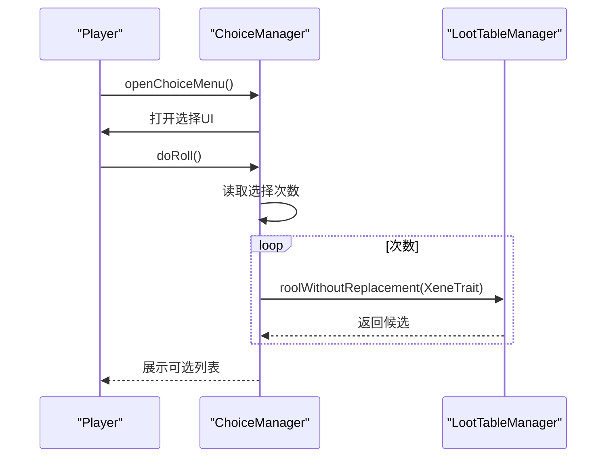

图表来源
- [ChoiceManager.java:25-64](file://Biotech/src/main/java/org/biotech/api/system/choice/ChoiceManager.java#L25-L64)
- [LootTableManager.java:55-83](file://Biotech/src/main/java/org/biotech/api/system/loot/LootTableManager.java#L55-L83)

章节来源
- [ChoiceManager.java:25-64](file://Biotech/src/main/java/org/biotech/api/system/choice/ChoiceManager.java#L25-L64)

### 服务器配置管理
- 配置项：定义不同稀有度未鉴定基因的属性投掷倍率，范围约束在0.0–100.0之间。
- 使用方式：通过ServerConfig静态方法读取当前配置值，影响相关系统的行为（如战利书抽取的词条数量）。

章节来源
- [ServerConfig.java:15-32](file://Biotech/src/main/java/org/biotech/api/config/ServerConfig.java#L15-L32)
- [ServerConfig.java:37-47](file://Biotech/src/main/java/org/biotech/api/config/ServerConfig.java#L37-L47)

## 依赖分析
- 模块内聚与耦合：BiotechAPI作为门面，低耦合地依赖AttachInit与CapInit；各系统子模块通过API间接依赖数据模型。
- 外部依赖：Curios用于装备槽位；NeoForge注册与能力系统；LDLib2用于数据持久化与序列化。
- 循环依赖：未发现直接循环依赖；初始化顺序通过事件总线与注册表监听保障。

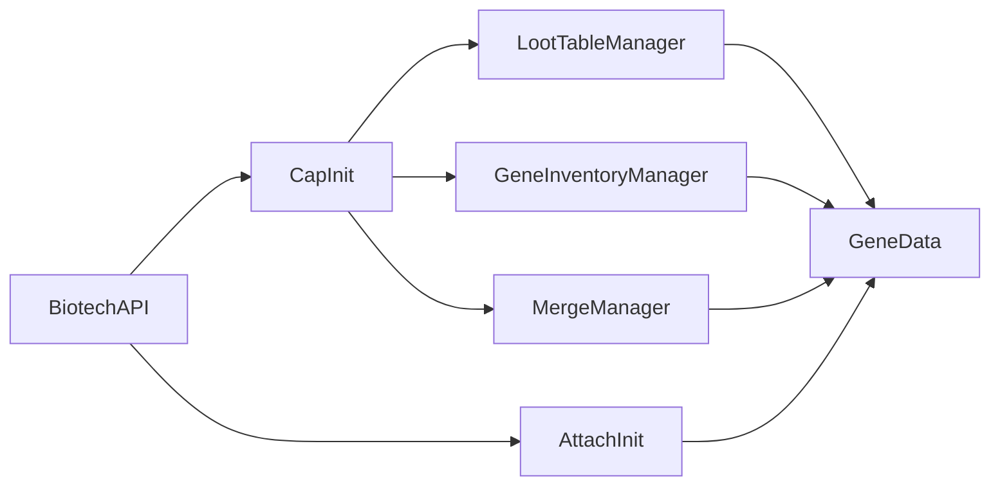

图表来源
- [BiotechAPI.java:27-90](file://Biotech/src/main/java/org/biotech/api/BiotechAPI.java#L27-L90)
- [AttachInit.java:19-31](file://Biotech/src/main/java/org/biotech/api/init/AttachInit.java#L19-L31)
- [CapInit.java:40-58](file://Biotech/src/main/java/org/biotech/api/init/CapInit.java#L40-L58)
- [LootTableManager.java:27-32](file://Biotech/src/main/java/org/biotech/api/system/loot/LootTableManager.java#L27-L32)
- [GeneInventoryManager.java:23-26](file://Biotech/src/main/java/org/biotech/api/system/gene/inventory/GeneInventoryManager.java#L23-L26)
- [MergeManager.java:29-32](file://Biotech/src/main/java/org/biotech/api/system/merge/MergeManager.java#L29-L32)

章节来源
- [BiotechAPI.java:27-90](file://Biotech/src/main/java/org/biotech/api/BiotechAPI.java#L27-L90)
- [CapInit.java:40-58](file://Biotech/src/main/java/org/biotech/api/init/CapInit.java#L40-L58)

## 性能考虑
- 延迟初始化：GeneData与各子数据均采用延迟初始化，减少空闲玩家的内存占用。
- 序列化优化：使用Codec与StreamCodec，避免冗余字段与重复解析，提升网络传输效率。
- 槽位验证：ItemStackHandler在写入前进行类型校验，降低无效操作带来的异常开销。
- 抽取算法：加权随机选择使用概率池与累计概率，避免多次遍历导致的复杂度膨胀。
- 合并缓存：合并系统缓存槽位统计数据，避免重复计算；输出数量受输入基因数量限制，防止无限产出。

## 故障排查指南
- UI无法打开：检查是否为ServerPlayer且能力是否成功注册；查看API日志输出。
- 附件数据缺失：确认AttachInit是否在事件总线上注册，序列化/反序列化是否正常。
- 战利书不生效：检查是否已初始化基础表，权重是否被错误修改或合并失败。
- 合并无产出：确认输入槽中有足够基因数量与词条数，平均词条密度是否达到阈值。
- Curios槽位为空：确认Curios插件加载与槽位ID一致，API返回的处理器是否为null。

章节来源
- [BiotechAPI.java:47-70](file://Biotech/src/main/java/org/biotech/api/BiotechAPI.java#L47-L70)
- [AttachInit.java:19-31](file://Biotech/src/main/java/org/biotech/api/init/AttachInit.java#L19-L31)
- [LootTableManager.java:34-41](file://Biotech/src/main/java/org/biotech/api/system/loot/LootTableManager.java#L34-L41)
- [MergeManager.java:107-157](file://Biotech/src/main/java/org/biotech/api/system/merge/MergeManager.java#L107-L157)

## 结论
Biotech模块通过清晰的分层架构与职责分离，实现了基因系统的高扩展性与可维护性。Biotech主类承担初始化与注册职责，BiotechAPI提供统一门面，附件与能力分别承载数据与行为，系统子模块围绕数据模型协同工作。该设计既满足了当前功能需求，也为未来扩展（如新基因、新战利书表、新合成规则）提供了稳定的基础。

## 附录
- 最佳实践
  - 在事件总线监听中注册注册表，确保顺序与一致性。
  - 使用延迟初始化与序列化编解码，平衡性能与可恢复性。
  - 将UI交互与业务逻辑分离，通过API门面暴露能力。
  - 通过权重与合并机制扩展内容，避免硬编码。
- 使用示例（步骤级）
  - 获取玩家基因数据：调用API的getGeneData方法。
  - 打开基因库存：调用openGeneInventoryFor并传入目标玩家。
  - 进行基因选择：调用getChoiceManager并打开选择UI，随后doRoll抽取候选。
  - 合并基因：更新输入槽，调用merge执行产出，注意平均词条密度与输入数量限制。