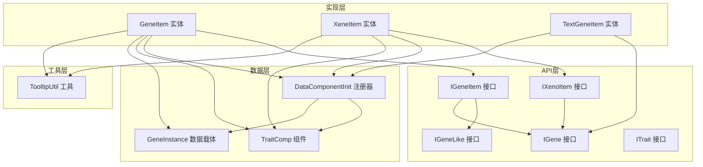
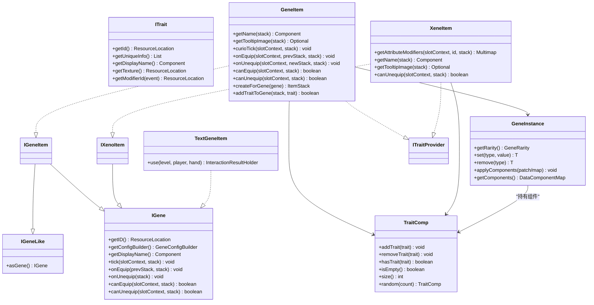
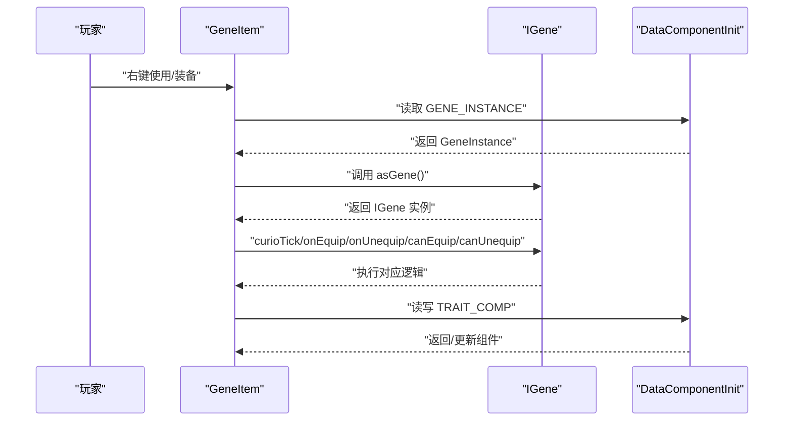
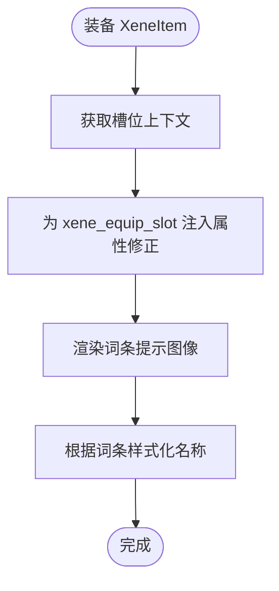
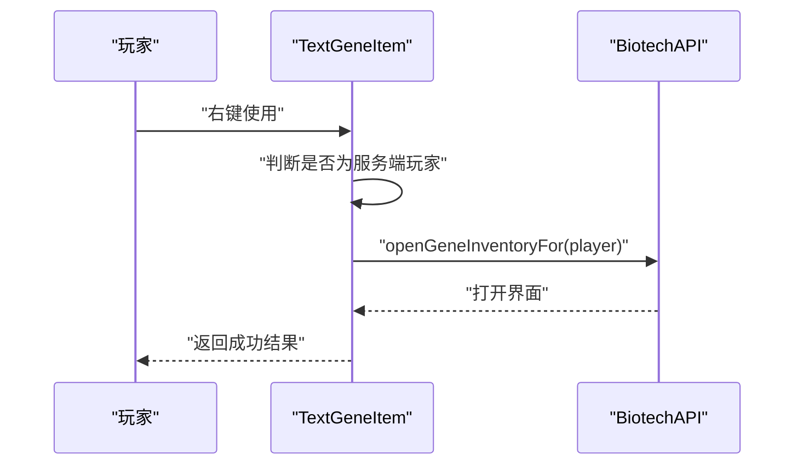
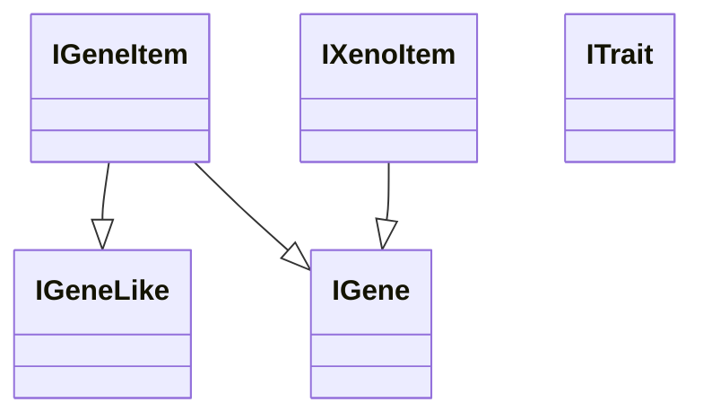
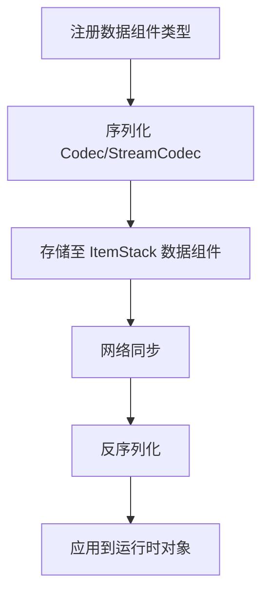
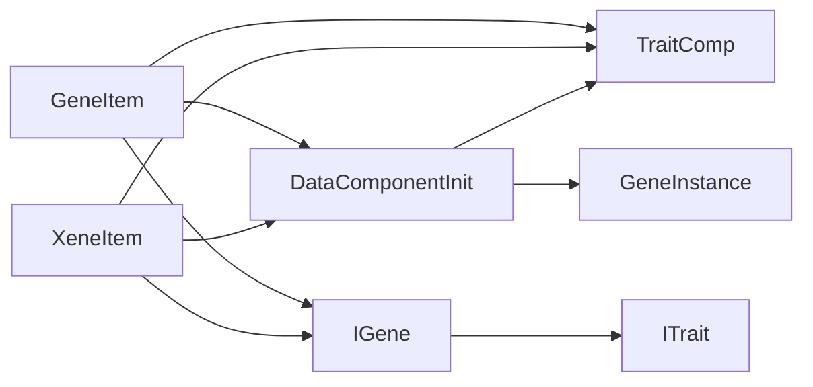

# 物品系统设计

<cite>
**本文引用的文件**
- [IGeneItem.java](file://Biotech/src/main/java/org/biotech/api/system/gene/core/IGeneItem.java)
- [IXenoItem.java](file://Biotech/src/main/java/org/biotech/api/system/gene/core/IXenoItem.java)
- [IGene.java](file://Biotech/src/main/java/org/biotech/api/system/gene/core/IGene.java)
- [IGeneLike.java](file://Biotech/src/main/java/org/biotech/api/system/gene/core/IGeneLike.java)
- [ITrait.java](file://Biotech/src/main/java/org/biotech/api/system/trait/core/ITrait.java)
- [GeneItem.java](file://Biotech/src/main/java/org/biotech/item/GeneItem.java)
- [XeneItem.java](file://Biotech/src/main/java/org/biotech/item/XeneItem.java)
- [TextGeneItem.java](file://Biotech/src/main/java/org/biotech/item/TextGeneItem.java)
- [DataComponentInit.java](file://Biotech/src/main/java/org/biotech/api/init/DataComponentInit.java)
- [TraitComp.java](file://Biotech/src/main/java/org/biotech/component/TraitComp.java)
- [GeneInstance.java](file://Biotech/src/main/java/org/biotech/api/system/gene/GeneInstance.java)
- [TooltipUtil.java](file://Biotech/src/main/java/org/biotech/api/util/TooltipUtil.java)
</cite>

## 目录
1. [简介](#简介)
2. [项目结构](#项目结构)
3. [核心组件](#核心组件)
4. [架构总览](#架构总览)
5. [详细组件分析](#详细组件分析)
6. [依赖关系分析](#依赖关系分析)
7. [性能考量](#性能考量)
8. [故障排查指南](#故障排查指南)
9. [结论](#结论)
10. [附录](#附录)

## 简介
本文件系统性阐述“基因猎人”子模块中的物品系统设计，重点围绕三类核心物品：基因物品（IGeneItem）、异种物品（IXenoItem）与文本基因物品（TextGeneItem）。文档将深入解析接口设计理念、继承关系、属性定义、数据组件集成与NBT数据存储机制，并给出注册、属性配置与外观定制的实现示例。同时覆盖国际化支持、材质贴图与3D模型配置、行为自定义扩展以及兼容性处理方案。

## 项目结构
本项目采用按功能域分层的组织方式：API层定义通用接口与数据契约；实现层提供具体物品与组件；初始化层负责注册与资源加载；客户端层负责渲染与UI；数据层负责数据组件与序列化。

图表来源
- [IGeneLike.java:1-6](file://Biotech/src/main/java/org/biotech/api/system/gene/core/IGeneLike.java#L1-L6)
- [IGene.java:1-91](file://Biotech/src/main/java/org/biotech/api/system/gene/core/IGene.java#L1-L91)
- [IGeneItem.java:1-8](file://Biotech/src/main/java/org/biotech/api/system/gene/core/IGeneItem.java#L1-L8)
- [IXenoItem.java:1-13](file://Biotech/src/main/java/org/biotech/api/system/gene/core/IXenoItem.java#L1-L13)
- [ITrait.java:1-108](file://Biotech/src/main/java/org/biotech/api/system/trait/core/ITrait.java#L1-L108)
- [GeneItem.java:1-209](file://Biotech/src/main/java/org/biotech/item/GeneItem.java#L1-L209)
- [XeneItem.java:1-83](file://Biotech/src/main/java/org/biotech/item/XeneItem.java#L1-L83)
- [TextGeneItem.java:1-38](file://Biotech/src/main/java/org/biotech/item/TextGeneItem.java#L1-L38)
- [DataComponentInit.java:1-47](file://Biotech/src/main/java/org/biotech/api/init/DataComponentInit.java#L1-L47)
- [TraitComp.java:1-102](file://Biotech/src/main/java/org/biotech/component/TraitComp.java#L1-L102)
- [GeneInstance.java:1-119](file://Biotech/src/main/java/org/biotech/api/system/gene/GeneInstance.java#L1-L119)
- [TooltipUtil.java:1-106](file://Biotech/src/main/java/org/biotech/api/util/TooltipUtil.java#L1-L106)

章节来源
- [IGeneItem.java:1-8](file://Biotech/src/main/java/org/biotech/api/system/gene/core/IGeneItem.java#L1-L8)
- [IXenoItem.java:1-13](file://Biotech/src/main/java/org/biotech/api/system/gene/core/IXenoItem.java#L1-L13)
- [IGene.java:1-91](file://Biotech/src/main/java/org/biotech/api/system/gene/core/IGene.java#L1-L91)
- [ITrait.java:1-108](file://Biotech/src/main/java/org/biotech/api/system/trait/core/ITrait.java#L1-L108)
- [DataComponentInit.java:1-47](file://Biotech/src/main/java/org/biotech/api/init/DataComponentInit.java#L1-L47)

## 核心组件
- IGeneLike：统一“可视为基因”的对象能力，提供转换为IGene的能力，作为IGeneItem与IXenoItem的共同上层接口。
- IGene：基因实体接口，定义基因的标识、配置构建器、显示名、生命周期回调（tick/equip/unequip/canEquip/canUnequip），并提供序列化编解码器用于网络同步。
- IGeneItem：基因物品接口，继承IGeneLike与Curios的ICurioItem，表示可装备到饰品栏的基因物品。
- IXenoItem：异种物品接口，继承Curios的ICurioItem，表示异种天赋类物品。
- ITrait：词条接口，定义词条的唯一ID、描述文本、显示名、贴图、修饰符ID生成策略及序列化编解码器。
- GeneItem：具体实现，承载IGene实例与Trait组件，实现Curios生命周期回调、名称样式化、属性抑制与提示图像渲染。
- XeneItem：具体实现，动态为槽位增加属性修正，屏蔽默认属性提示，提供词条读取与名称样式化。
- TextGeneItem：文本型基因物品，右键打开基因界面，携带示例数据组件。
- DataComponentInit：数据组件注册器，集中注册TraitComp、GeneInstance与示例组件，提供持久化与网络同步配置。
- TraitComp：多词条组件，支持添加、移除、判空、大小统计与随机生成，提供Codec与StreamCodec。
- GeneInstance：基因实例容器，封装IGene与数据组件补丁，提供序列化、计数与组件操作。
- TooltipUtil：工具类，提供词条提示构建、Curios槽位提示抑制、纹理选择等辅助能力。

章节来源
- [IGeneLike.java:1-6](file://Biotech/src/main/java/org/biotech/api/system/gene/core/IGeneLike.java#L1-L6)
- [IGene.java:15-91](file://Biotech/src/main/java/org/biotech/api/system/gene/core/IGene.java#L15-L91)
- [IGeneItem.java:5-7](file://Biotech/src/main/java/org/biotech/api/system/gene/core/IGeneItem.java#L5-L7)
- [IXenoItem.java:9-12](file://Biotech/src/main/java/org/biotech/api/system/gene/core/IXenoItem.java#L9-L12)
- [ITrait.java:18-108](file://Biotech/src/main/java/org/biotech/api/system/trait/core/ITrait.java#L18-L108)
- [GeneItem.java:31-209](file://Biotech/src/main/java/org/biotech/item/GeneItem.java#L31-L209)
- [XeneItem.java:26-83](file://Biotech/src/main/java/org/biotech/item/XeneItem.java#L26-L83)
- [TextGeneItem.java:20-38](file://Biotech/src/main/java/org/biotech/item/TextGeneItem.java#L20-L38)
- [DataComponentInit.java:14-47](file://Biotech/src/main/java/org/biotech/api/init/DataComponentInit.java#L14-L47)
- [TraitComp.java:18-102](file://Biotech/src/main/java/org/biotech/component/TraitComp.java#L18-L102)
- [GeneInstance.java:19-119](file://Biotech/src/main/java/org/biotech/api/system/gene/GeneInstance.java#L19-L119)
- [TooltipUtil.java:18-106](file://Biotech/src/main/java/org/biotech/api/util/TooltipUtil.java#L18-L106)

## 架构总览
物品系统以“接口契约 + 数据组件 + Curios 装备能力 + 客户端提示渲染”为核心，形成清晰的分层与职责分离：

图表来源
- [IGeneLike.java:1-6](file://Biotech/src/main/java/org/biotech/api/system/gene/core/IGeneLike.java#L1-L6)
- [IGene.java:1-91](file://Biotech/src/main/java/org/biotech/api/system/gene/core/IGene.java#L1-L91)
- [IGeneItem.java:1-8](file://Biotech/src/main/java/org/biotech/api/system/gene/core/IGeneItem.java#L1-L8)
- [IXenoItem.java:1-13](file://Biotech/src/main/java/org/biotech/api/system/gene/core/IXenoItem.java#L1-L13)
- [ITrait.java:1-108](file://Biotech/src/main/java/org/biotech/api/system/trait/core/ITrait.java#L1-L108)
- [GeneItem.java:1-209](file://Biotech/src/main/java/org/biotech/item/GeneItem.java#L1-L209)
- [XeneItem.java:1-83](file://Biotech/src/main/java/org/biotech/item/XeneItem.java#L1-L83)
- [TextGeneItem.java:1-38](file://Biotech/src/main/java/org/biotech/item/TextGeneItem.java#L1-L38)
- [TraitComp.java:1-102](file://Biotech/src/main/java/org/biotech/component/TraitComp.java#L1-L102)
- [GeneInstance.java:1-119](file://Biotech/src/main/java/org/biotech/api/system/gene/GeneInstance.java#L1-L119)

## 详细组件分析

### 基因物品（IGeneItem 与 GeneItem）
- 设计理念
  - 将“基因”抽象为可装备实体，通过Curios系统实现槽位穿戴与生命周期管理。
  - 使用数据组件承载基因与词条，确保跨版本与网络同步的稳定性。
- 关键实现
  - 构造函数设置最大堆叠为1，并预置空的基因实例数据组件。
  - 名称样式化：优先使用基因显示名，若为空则回退到词条首项或默认名称。
  - 提示图像：仅通过自定义TraitTooltipComponent渲染词条详情，避免冗余提示。
  - 生命周期委托：将Curios回调委托给内部IGene实例，保证行为一致性。
  - 属性抑制：屏蔽Curios默认属性提示，避免与自定义提示冲突。
  - 工具方法：提供基于基因创建物品栈与向物品添加词条的静态方法。
- 数据组件集成
  - GENE_INSTANCE：封装IGene与组件补丁，支持序列化与网络同步。
  - TRAIT_COMP：多词条集合，支持去重、随机生成与网络传输。
- NBT数据存储机制
  - 通过DataComponentType注册与持久化，结合Codec与StreamCodec完成序列化与网络同步。
  - PatchedDataComponentMap与DataComponentPatch用于增量更新与高效传输。

图表来源
- [GeneItem.java:31-209](file://Biotech/src/main/java/org/biotech/item/GeneItem.java#L31-L209)
- [IGene.java:15-91](file://Biotech/src/main/java/org/biotech/api/system/gene/core/IGene.java#L15-L91)
- [DataComponentInit.java:14-47](file://Biotech/src/main/java/org/biotech/api/init/DataComponentInit.java#L14-L47)
- [GeneInstance.java:19-119](file://Biotech/src/main/java/org/biotech/api/system/gene/GeneInstance.java#L19-L119)
- [TraitComp.java:18-102](file://Biotech/src/main/java/org/biotech/component/TraitComp.java#L18-L102)

章节来源
- [GeneItem.java:31-209](file://Biotech/src/main/java/org/biotech/item/GeneItem.java#L31-L209)
- [IGene.java:15-91](file://Biotech/src/main/java/org/biotech/api/system/gene/core/IGene.java#L15-L91)
- [DataComponentInit.java:14-47](file://Biotech/src/main/java/org/biotech/api/init/DataComponentInit.java#L14-L47)
- [GeneInstance.java:19-119](file://Biotech/src/main/java/org/biotech/api/system/gene/GeneInstance.java#L19-L119)
- [TraitComp.java:18-102](file://Biotech/src/main/java/org/biotech/component/TraitComp.java#L18-L102)

### 异种物品（IXenoItem 与 XeneItem）
- 设计理念
  - 异种物品作为“局内天赋”存在，强调动态属性修正与槽位扩展。
  - 通过Curios事件动态注入槽位修正，增强角色能力。
- 关键实现
  - 动态属性修正：在槽位上下文中为xene_equip_slot类型增加数值修正。
  - 提示控制：屏蔽默认属性提示，使用自定义TraitTooltipComponent渲染词条。
  - 名称样式化：根据词条风格化显示名称。
  - 卸下策略：明确允许卸下，避免卡槽问题。
- 数据组件集成
  - 直接读取TRAIT_COMP进行词条渲染与名称样式化。
- NBT数据存储机制
  - 通过DataComponentInit注册的TRAIT_COMP实现持久化与网络同步。

图表来源
- [XeneItem.java:26-83](file://Biotech/src/main/java/org/biotech/item/XeneItem.java#L26-L83)
- [DataComponentInit.java:14-47](file://Biotech/src/main/java/org/biotech/api/init/DataComponentInit.java#L14-L47)
- [TooltipUtil.java:18-106](file://Biotech/src/main/java/org/biotech/api/util/TooltipUtil.java#L18-L106)

章节来源
- [XeneItem.java:26-83](file://Biotech/src/main/java/org/biotech/item/XeneItem.java#L26-L83)
- [DataComponentInit.java:14-47](file://Biotech/src/main/java/org/biotech/api/init/DataComponentInit.java#L14-L47)
- [TooltipUtil.java:18-106](file://Biotech/src/main/java/org/biotech/api/util/TooltipUtil.java#L18-L106)

### 文本基因物品（TextGeneItem）
- 设计理念
  - 以“文本型”存在，不参与属性修正，主要提供交互入口（右键打开基因界面）。
- 关键实现
  - 构造函数设置稀有度与示例数据组件。
  - 右键使用时仅在服务端打开界面，避免客户端重复触发。
- 数据组件集成
  - 示例组件EXAMPLE用于演示数据组件注册与使用。
- NBT数据存储机制
  - 通过DataComponentInit注册的EXAMPLE实现持久化与网络同步。

图表来源
- [TextGeneItem.java:20-38](file://Biotech/src/main/java/org/biotech/item/TextGeneItem.java#L20-L38)

章节来源
- [TextGeneItem.java:20-38](file://Biotech/src/main/java/org/biotech/item/TextGeneItem.java#L20-L38)
- [DataComponentInit.java:14-47](file://Biotech/src/main/java/org/biotech/api/init/DataComponentInit.java#L14-L47)

### 接口设计与继承关系
- IGeneLike：统一“可视为基因”的对象能力，便于在不同上下文中进行类型转换。
- IGene：基因实体的核心接口，提供生命周期回调、显示名与序列化编解码器。
- IGeneItem：面向可装备基因物品的接口，继承IGene与Curios能力。
- IXenoItem：面向异种物品的接口，继承Curios能力，强调动态属性修正。
- ITrait：词条接口，提供唯一ID、描述文本、显示名、贴图与修饰符ID生成策略。

图表来源
- [IGeneLike.java:1-6](file://Biotech/src/main/java/org/biotech/api/system/gene/core/IGeneLike.java#L1-L6)
- [IGene.java:1-91](file://Biotech/src/main/java/org/biotech/api/system/gene/core/IGene.java#L1-L91)
- [IGeneItem.java:1-8](file://Biotech/src/main/java/org/biotech/api/system/gene/core/IGeneItem.java#L1-L8)
- [IXenoItem.java:1-13](file://Biotech/src/main/java/org/biotech/api/system/gene/core/IXenoItem.java#L1-L13)
- [ITrait.java:1-108](file://Biotech/src/main/java/org/biotech/api/system/trait/core/ITrait.java#L1-L108)

章节来源
- [IGeneLike.java:1-6](file://Biotech/src/main/java/org/biotech/api/system/gene/core/IGeneLike.java#L1-L6)
- [IGene.java:15-91](file://Biotech/src/main/java/org/biotech/api/system/gene/core/IGene.java#L15-L91)
- [IGeneItem.java:5-7](file://Biotech/src/main/java/org/biotech/api/system/gene/core/IGeneItem.java#L5-L7)
- [IXenoItem.java:9-12](file://Biotech/src/main/java/org/biotech/api/system/gene/core/IXenoItem.java#L9-L12)
- [ITrait.java:18-108](file://Biotech/src/main/java/org/biotech/api/system/trait/core/ITrait.java#L18-L108)

### 数据组件与NBT存储机制
- DataComponentInit：集中注册数据组件类型，提供持久化与网络同步配置。
- TraitComp：多词条组件，支持Codec与StreamCodec，便于序列化与网络传输。
- GeneInstance：封装IGene与组件补丁，提供序列化、计数与组件操作，支持空实例常量优化。
- NBT存储：通过DataComponentType与Patch机制实现高效持久化与增量更新。

图表来源
- [DataComponentInit.java:14-47](file://Biotech/src/main/java/org/biotech/api/init/DataComponentInit.java#L14-L47)
- [TraitComp.java:88-100](file://Biotech/src/main/java/org/biotech/component/TraitComp.java#L88-L100)
- [GeneInstance.java:34-75](file://Biotech/src/main/java/org/biotech/api/system/gene/GeneInstance.java#L34-L75)

章节来源
- [DataComponentInit.java:14-47](file://Biotech/src/main/java/org/biotech/api/init/DataComponentInit.java#L14-L47)
- [TraitComp.java:88-102](file://Biotech/src/main/java/org/biotech/component/TraitComp.java#L88-L102)
- [GeneInstance.java:34-119](file://Biotech/src/main/java/org/biotech/api/system/gene/GeneInstance.java#L34-L119)

### 国际化支持、材质贴图与3D模型配置
- 国际化支持
  - 显示名通过翻译键生成，遵循“名称.后缀”的命名规范，确保多语言环境一致展示。
  - 提示文本通过Component.translatable与占位符实现本地化。
- 材质贴图
  - ITrait提供getTexture默认贴图，可被具体词条覆盖；TooltipUtil支持从词条选择主贴图。
- 3D模型配置
  - 项目资源目录包含多种物品模型文件，用于定义3D模型与纹理映射，配合客户端渲染器实现外观定制。

章节来源
- [IGene.java:20-22](file://Biotech/src/main/java/org/biotech/api/system/gene/core/IGene.java#L20-L22)
- [ITrait.java:47-49](file://Biotech/src/main/java/org/biotech/api/system/trait/core/ITrait.java#L47-L49)
- [TooltipUtil.java:88-104](file://Biotech/src/main/java/org/biotech/api/util/TooltipUtil.java#L88-L104)

### 行为自定义扩展与兼容性处理
- 行为扩展
  - IGene接口提供默认空实现的生命周期回调，便于子类按需覆写。
  - ITrait提供修饰符ID生成策略，避免不同槽位与词条之间的冲突。
- 兼容性处理
  - IGeneItem与IXenoItem均继承Curios的ICurioItem，确保与Curios生态兼容。
  - TooltipUtil提供槽位提示抑制与提示组件构建，提升兼容性与可维护性。

章节来源
- [IGene.java:26-65](file://Biotech/src/main/java/org/biotech/api/system/gene/core/IGene.java#L26-L65)
- [ITrait.java:55-63](file://Biotech/src/main/java/org/biotech/api/system/trait/core/ITrait.java#L55-L63)
- [TooltipUtil.java:72-86](file://Biotech/src/main/java/org/biotech/api/util/TooltipUtil.java#L72-L86)

## 依赖关系分析
- 组件耦合
  - GeneItem与XeneItem强依赖DataComponentInit与TraitComp，弱依赖IGene与ITrait。
  - IGene与ITrait通过注册器与编码器实现松耦合的序列化与网络同步。
- 外部依赖
  - Curios API用于装备槽位与属性修正。
  - Minecraft DataComponents用于数据持久化与网络同步。
- 循环依赖
  - 未发现直接循环依赖；接口契约与实现分离良好。

图表来源
- [GeneItem.java:1-209](file://Biotech/src/main/java/org/biotech/item/GeneItem.java#L1-L209)
- [XeneItem.java:1-83](file://Biotech/src/main/java/org/biotech/item/XeneItem.java#L1-L83)
- [DataComponentInit.java:14-47](file://Biotech/src/main/java/org/biotech/api/init/DataComponentInit.java#L14-L47)
- [TraitComp.java:1-102](file://Biotech/src/main/java/org/biotech/component/TraitComp.java#L1-L102)
- [GeneInstance.java:1-119](file://Biotech/src/main/java/org/biotech/api/system/gene/GeneInstance.java#L1-L119)
- [IGene.java:1-91](file://Biotech/src/main/java/org/biotech/api/system/gene/core/IGene.java#L1-L91)
- [ITrait.java:1-108](file://Biotech/src/main/java/org/biotech/api/system/trait/core/ITrait.java#L1-L108)

章节来源
- [GeneItem.java:1-209](file://Biotech/src/main/java/org/biotech/item/GeneItem.java#L1-L209)
- [XeneItem.java:1-83](file://Biotech/src/main/java/org/biotech/item/XeneItem.java#L1-L83)
- [DataComponentInit.java:14-47](file://Biotech/src/main/java/org/biotech/api/init/DataComponentInit.java#L14-L47)
- [TraitComp.java:1-102](file://Biotech/src/main/java/org/biotech/component/TraitComp.java#L1-L102)
- [GeneInstance.java:1-119](file://Biotech/src/main/java/org/biotech/api/system/gene/GeneInstance.java#L1-L119)
- [IGene.java:1-91](file://Biotech/src/main/java/org/biotech/api/system/gene/core/IGene.java#L1-L91)
- [ITrait.java:1-108](file://Biotech/src/main/java/org/biotech/api/system/trait/core/ITrait.java#L1-L108)

## 性能考量
- 序列化与网络同步
  - 使用StreamCodec与Patch机制减少传输开销，提高同步效率。
- 组件访问
  - 通过DataComponentMap与PatchedDataComponentMap实现增量更新，避免全量复制。
- 提示渲染
  - 仅在需要时渲染TraitTooltipComponent，减少客户端绘制压力。
- 稀有度与名称样式
  - 基于词条与基因的稀有度动态设置，避免重复计算。

## 故障排查指南
- 无法显示词条提示
  - 检查TraitComp是否为空或已正确写入数据组件。
  - 确认TooltipUtil.buildTraitTooltipComponent返回非空组件。
- 装备异常或卡槽
  - 检查IGeneItem/IXenoItem的canEquip/canUnequip实现，确保在无效状态下的安全卸下。
- 名称样式异常
  - 确认getName逻辑与styleNameByTraits调用顺序，优先使用基因或词条显示名。
- 属性提示冲突
  - 确保suppressCuriosSlotTypeTooltip被正确调用，避免默认属性提示覆盖。

章节来源
- [TooltipUtil.java:72-86](file://Biotech/src/main/java/org/biotech/api/util/TooltipUtil.java#L72-L86)
- [GeneItem.java:130-141](file://Biotech/src/main/java/org/biotech/item/GeneItem.java#L130-L141)
- [XeneItem.java:78-81](file://Biotech/src/main/java/org/biotech/item/XeneItem.java#L78-L81)

## 结论
本物品系统通过清晰的接口契约、稳定的数据组件与高效的序列化机制，实现了基因与异种物品的可扩展、可定制与高兼容性。接口层抽象出通用能力，实现层聚焦具体行为，数据层保障持久化与网络同步，工具层提供提示与渲染支持。该设计既满足当前需求，也为未来扩展提供了良好的基础。

## 附录
- 物品注册与属性配置示例路径
  - [DataComponentInit.java:14-47](file://Biotech/src/main/java/org/biotech/api/init/DataComponentInit.java#L14-L47)
  - [GeneItem.java:33-38](file://Biotech/src/main/java/org/biotech/item/GeneItem.java#L33-L38)
  - [XeneItem.java:30-32](file://Biotech/src/main/java/org/biotech/item/XeneItem.java#L30-L32)
  - [TextGeneItem.java:22-26](file://Biotech/src/main/java/org/biotech/item/TextGeneItem.java#L22-L26)
- 外观定制与国际化
  - [IGene.java:20-22](file://Biotech/src/main/java/org/biotech/api/system/gene/core/IGene.java#L20-L22)
  - [ITrait.java:42-44](file://Biotech/src/main/java/org/biotech/api/system/trait/core/ITrait.java#L42-L44)
  - [TooltipUtil.java:28-67](file://Biotech/src/main/java/org/biotech/api/util/TooltipUtil.java#L28-L67)
- 行为自定义与兼容性
  - [IGene.java:26-65](file://Biotech/src/main/java/org/biotech/api/system/gene/core/IGene.java#L26-L65)
  - [ITrait.java:55-63](file://Biotech/src/main/java/org/biotech/api/system/trait/core/ITrait.java#L55-L63)
  - [GeneItem.java:98-141](file://Biotech/src/main/java/org/biotech/item/GeneItem.java#L98-L141)
  - [XeneItem.java:35-42](file://Biotech/src/main/java/org/biotech/item/XeneItem.java#L35-L42)