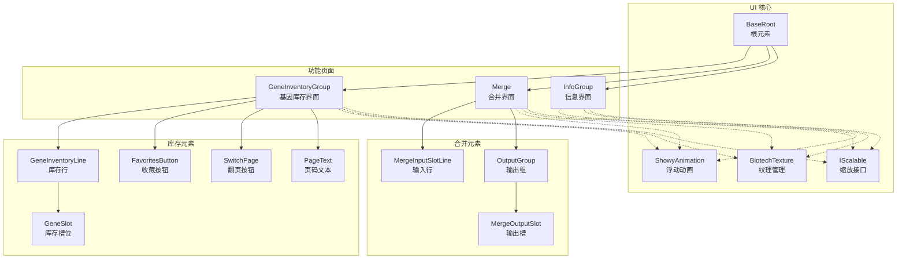
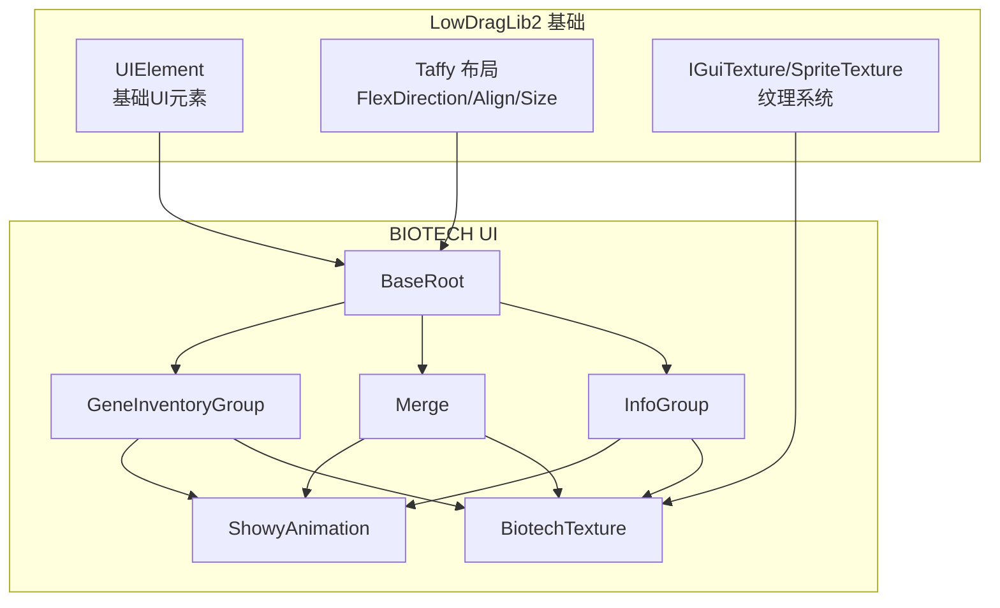
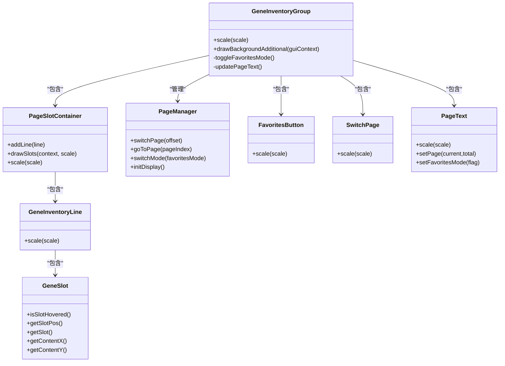
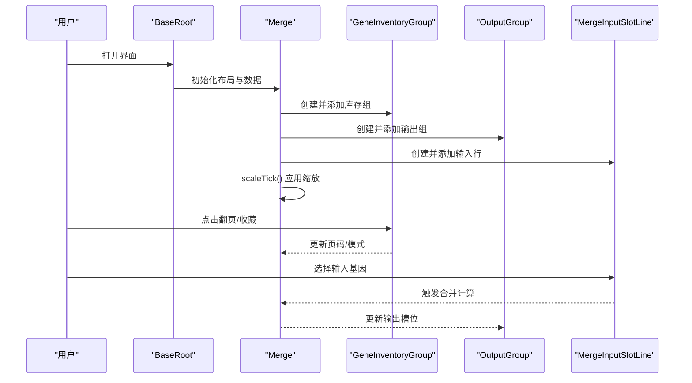
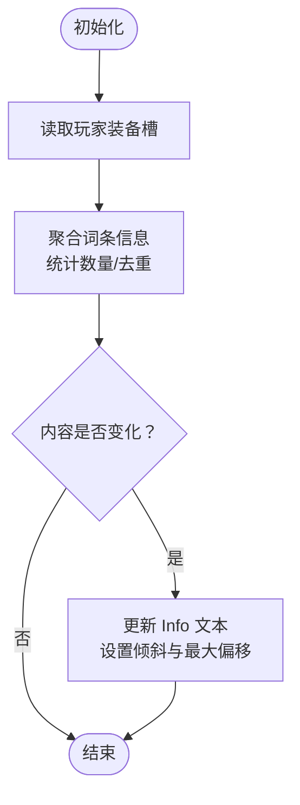
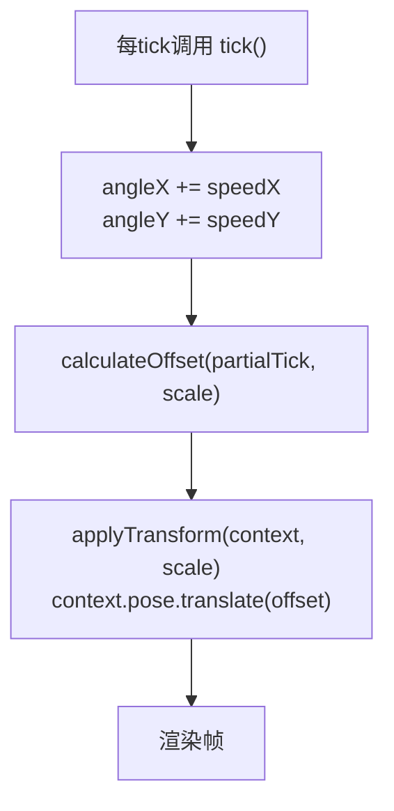
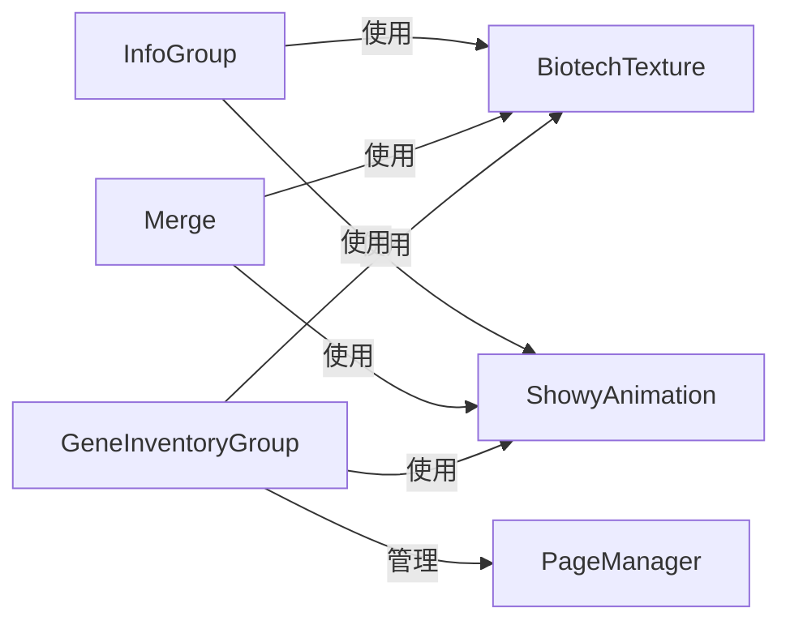

# 用户界面系统

<cite>
**本文引用的文件**
- [BiotechTexture.java](file://Biotech/src/main/java/org/biotech/ui/BiotechTexture.java)
- [IScalable.java](file://Biotech/src/main/java/org/biotech/ui/IScalable.java)
- [ShowyAnimation.java](file://Biotech/src/main/java/org/biotech/ui/animation/ShowyAnimation.java)
- [AnimationManager.java](file://Biotech/src/main/java/org/biotech/ui/animation/AnimationManager.java)
- [BaseRoot.java](file://Biotech/src/main/java/org/biotech/ui/gene_inventroy/element/BaseRoot.java)
- [GeneInventoryGroup.java](file://Biotech/src/main/java/org/biotech/ui/gene_inventroy/group/GeneInventoryGroup.java)
- [Merge.java](file://Biotech/src/main/java/org/biotech/ui/gene_inventroy/group/Merge.java)
- [InfoGroup.java](file://Biotech/src/main/java/org/biotech/ui/gene_inventroy/group/InfoGroup.java)
- [FavoritesButton.java](file://Biotech/src/main/java/org/biotech/ui/gene_inventroy/element/inventory/FavoritesButton.java)
- [GeneInventoryLine.java](file://Biotech/src/main/java/org/biotech/ui/gene_inventroy/element/inventory/GeneInventoryLine.java)
- [GeneSlot.java](file://Biotech/src/main/java/org/biotech/ui/gene_inventroy/element/inventory/GeneSlot.java)
- [SwitchPage.java](file://Biotech/src/main/java/org/biotech/ui/gene_inventroy/element/inventory/SwitchPage.java)
- [PageText.java](file://Biotech/src/main/java/org/biotech/ui/gene_inventroy/element/inventory/PageText.java)
- [MergeInputSlotLine.java](file://Biotech/src/main/java/org/biotech/ui/gene_inventroy/element/merge/MergeInputSlotLine.java)
- [MergeOutputSlot.java](file://Biotech/src/main/java/org/biotech/ui/gene_inventroy/element/merge/MergeOutputSlot.java)
- [OutputGroup.java](file://Biotech/src/main/java/org/biotech/ui/gene_inventroy/element/merge/OutputGroup.java)
- [Info.java](file://Biotech/src/main/java/org/biotech/ui/gene_inventroy/element/Info.java)
- [ToggleButton.java](file://Biotech/src/main/java/org/biotech/ui/gene_inventroy/element/ToggleButton.java)
- [DNA.java](file://Biotech/src/main/java/org/biotech/ui/gene_inventroy/element/DNA.java)
- [EquipGeneSlot.java](file://Biotech/src/main/java/org/biotech/ui/gene_inventroy/element/EquipGeneSlot.java)
- [EquipDNAGroup.java](file://Biotech/src/main/java/org/biotech/ui/gene_inventroy/group/EquipDNAGroup.java)
- [GeneBackGround.java](file://Biotech/src/main/java/org/biotech/ui/gene_inventroy/element/GeneBackGround.java)
- [ElementGroup.java](file://Biotech/src/main/java/org/biotech/ui/gene_inventroy/group/ElementGroup.java)
- [Inventory.java](file://Biotech/src/main/java/org/biotech/ui/gene_inventroy/group/Inventory.java)
</cite>

## 目录
1. [简介](#简介)
2. [项目结构](#项目结构)
3. [核心组件](#核心组件)
4. [架构总览](#架构总览)
5. [详细组件分析](#详细组件分析)
6. [依赖分析](#依赖分析)
7. [性能考虑](#性能考虑)
8. [故障排查指南](#故障排查指南)
9. [结论](#结论)
10. [附录](#附录)

## 简介
本文件面向基于 LowDragLib2 的用户界面系统，系统性阐述基于 LowDragLib2 的 UI 架构设计与实现，重点覆盖以下方面：
- BaseRoot 根元素与 UI 组件的组织结构
- 基因库存界面、合并界面与设置界面的实现原理
- ShowyAnimation 动画系统的使用与自定义动画创建方法
- UI 布局设计、样式定制与响应式适配的实现示例
- BiotechTexture 纹理管理与 IScalable 缩放接口
- 界面交互逻辑、性能优化与用户体验最佳实践

## 项目结构
本项目 UI 层位于 Biotech 模块的 org.biotech.ui 包下，采用“按功能分层 + 组件化”的组织方式：
- ui/texture 与 ui/animation：纹理与动画基础设施
- ui/gene_inventroy/element 与 ui/gene_inventroy/group：UI 元素与组合容器
- ui/gene_inventroy/element/inventory 与 ui/gene_inventroy/element/merge：具体功能元素（库存、合并）
- ui/gene_inventroy/group：功能页面容器（库存、合并、信息等）

图表来源
- [BaseRoot.java](file://Biotech/src/main/java/org/biotech/ui/gene_inventroy/element/BaseRoot.java)
- [IScalable.java](file://Biotech/src/main/java/org/biotech/ui/IScalable.java)
- [BiotechTexture.java](file://Biotech/src/main/java/org/biotech/ui/BiotechTexture.java)
- [ShowyAnimation.java](file://Biotech/src/main/java/org/biotech/ui/animation/ShowyAnimation.java)
- [GeneInventoryGroup.java](file://Biotech/src/main/java/org/biotech/ui/gene_inventroy/group/GeneInventoryGroup.java)
- [Merge.java](file://Biotech/src/main/java/org/biotech/ui/gene_inventroy/group/Merge.java)
- [InfoGroup.java](file://Biotech/src/main/java/org/biotech/ui/gene_inventroy/group/InfoGroup.java)
- [GeneInventoryLine.java](file://Biotech/src/main/java/org/biotech/ui/gene_inventroy/element/inventory/GeneInventoryLine.java)
- [GeneSlot.java](file://Biotech/src/main/java/org/biotech/ui/gene_inventroy/element/inventory/GeneSlot.java)
- [FavoritesButton.java](file://Biotech/src/main/java/org/biotech/ui/gene_inventroy/element/inventory/FavoritesButton.java)
- [SwitchPage.java](file://Biotech/src/main/java/org/biotech/ui/gene_inventroy/element/inventory/SwitchPage.java)
- [PageText.java](file://Biotech/src/main/java/org/biotech/ui/gene_inventroy/element/inventory/PageText.java)
- [MergeInputSlotLine.java](file://Biotech/src/main/java/org/biotech/ui/gene_inventroy/element/merge/MergeInputSlotLine.java)
- [MergeOutputSlot.java](file://Biotech/src/main/java/org/biotech/ui/gene_inventroy/element/merge/MergeOutputSlot.java)
- [OutputGroup.java](file://Biotech/src/main/java/org/biotech/ui/gene_inventroy/element/merge/OutputGroup.java)

章节来源
- [BaseRoot.java](file://Biotech/src/main/java/org/biotech/ui/gene_inventroy/element/BaseRoot.java)
- [IScalable.java](file://Biotech/src/main/java/org/biotech/ui/IScalable.java)
- [BiotechTexture.java](file://Biotech/src/main/java/org/biotech/ui/BiotechTexture.java)
- [ShowyAnimation.java](file://Biotech/src/main/java/org/biotech/ui/animation/ShowyAnimation.java)

## 核心组件
- BaseRoot：所有功能页面的根容器，负责统一的缩放、布局与事件处理入口
- IScalable：统一的缩放接口，要求所有可缩放组件实现 scale(scaleFactor) 方法
- BiotechTexture：集中管理 UI 纹理资源与九宫格切片，提供可复用的背景与装饰纹理
- ShowyAnimation：浮动动画实现，支持独立控制 X/Y 轴的速度、相位与幅度，适用于强调元素的视觉反馈

章节来源
- [BaseRoot.java](file://Biotech/src/main/java/org/biotech/ui/gene_inventroy/element/BaseRoot.java)
- [IScalable.java](file://Biotech/src/main/java/org/biotech/ui/IScalable.java)
- [BiotechTexture.java](file://Biotech/src/main/java/org/biotech/ui/BiotechTexture.java)
- [ShowyAnimation.java](file://Biotech/src/main/java/org/biotech/ui/animation/ShowyAnimation.java)

## 架构总览
UI 架构以 LowDragLib2 的 UIElement 为基础，结合 Taffy 布局引擎实现响应式布局；通过 BaseRoot 抽象出统一的页面容器，再由功能组（如 GeneInventoryGroup、Merge、InfoGroup）承载具体业务。

图表来源
- [BaseRoot.java](file://Biotech/src/main/java/org/biotech/ui/gene_inventroy/element/BaseRoot.java)
- [GeneInventoryGroup.java](file://Biotech/src/main/java/org/biotech/ui/gene_inventroy/group/GeneInventoryGroup.java)
- [Merge.java](file://Biotech/src/main/java/org/biotech/ui/gene_inventroy/group/Merge.java)
- [InfoGroup.java](file://Biotech/src/main/java/org/biotech/ui/gene_inventroy/group/InfoGroup.java)
- [ShowyAnimation.java](file://Biotech/src/main/java/org/biotech/ui/animation/ShowyAnimation.java)
- [BiotechTexture.java](file://Biotech/src/main/java/org/biotech/ui/BiotechTexture.java)

## 详细组件分析

### 基因库存界面（GeneInventoryGroup）
- 功能概述：支持多页库存展示、阶梯式行偏移、收藏模式与翻页控制
- 关键特性：
  - 多页容器：PageSlotContainer 以绝对定位封装每页内容，通过 PageManager 控制显示与切换
  - 翻页与收藏：双模式独立页码，点击左右翻页按钮或收藏按钮切换
  - 悬停绘制：在 drawBackgroundAdditional 中统一绘制未悬停槽位背景与悬停高亮
  - 字体徽章：根据词条数量绘制罗马数字徽章，提升信息密度
- 布局与缩放：继承 IScalable，scale() 统一缩放尺寸与内边距，子元素递归缩放

图表来源
- [GeneInventoryGroup.java](file://Biotech/src/main/java/org/biotech/ui/gene_inventroy/group/GeneInventoryGroup.java)
- [GeneInventoryLine.java](file://Biotech/src/main/java/org/biotech/ui/gene_inventroy/element/inventory/GeneInventoryLine.java)
- [GeneSlot.java](file://Biotech/src/main/java/org/biotech/ui/gene_inventroy/element/inventory/GeneSlot.java)
- [FavoritesButton.java](file://Biotech/src/main/java/org/biotech/ui/gene_inventroy/element/inventory/FavoritesButton.java)
- [SwitchPage.java](file://Biotech/src/main/java/org/biotech/ui/gene_inventroy/element/inventory/SwitchPage.java)
- [PageText.java](file://Biotech/src/main/java/org/biotech/ui/gene_inventroy/element/inventory/PageText.java)

章节来源
- [GeneInventoryGroup.java](file://Biotech/src/main/java/org/biotech/ui/gene_inventroy/group/GeneInventoryGroup.java)

### 合并界面（Merge）
- 功能概述：上方嵌入基因库存，下方为工作区，包含输出组与输入行
- 关键特性：
  - 分层布局：COLUMN_REVERSE 方向，顶部库存、底部工作区
  - 输入输出：输入行（MergeInputSlotLine）与输出组（OutputGroup）分别承载合并输入与输出
  - 缩放同步：scaleTick() 中统一应用缩放到子组件，保证整体一致性
- 与库存界面的关系：共享 BiotechTexture 与 ShowyAnimation，增强视觉统一性

图表来源
- [Merge.java](file://Biotech/src/main/java/org/biotech/ui/gene_inventroy/group/Merge.java)
- [GeneInventoryGroup.java](file://Biotech/src/main/java/org/biotech/ui/gene_inventroy/group/GeneInventoryGroup.java)
- [OutputGroup.java](file://Biotech/src/main/java/org/biotech/ui/gene_inventroy/element/merge/OutputGroup.java)
- [MergeInputSlotLine.java](file://Biotech/src/main/java/org/biotech/ui/gene_inventroy/element/merge/MergeInputSlotLine.java)

章节来源
- [Merge.java](file://Biotech/src/main/java/org/biotech/ui/gene_inventroy/group/Merge.java)

### 信息界面（InfoGroup）
- 功能概述：展示装备基因的汇总词条信息，支持倾斜与滚动文本
- 关键特性：
  - 汇总构建：遍历 Curios 装备槽，聚合相同词条并统计数量
  - 倾斜布局：通过 calculatePaddingLeft(angle) 计算左右图像的内边距差，形成倾斜视觉
  - 实时刷新：监听 UIEvents.TICK，对比快照避免重复重建
- 与库存/合并界面的关系：同样继承 IScalable，统一缩放与样式

图表来源
- [InfoGroup.java](file://Biotech/src/main/java/org/biotech/ui/gene_inventroy/group/InfoGroup.java)

章节来源
- [InfoGroup.java](file://Biotech/src/main/java/org/biotech/ui/gene_inventroy/group/InfoGroup.java)

### ShowyAnimation 动画系统
- 功能概述：为 UI 元素提供正弦波浮动动画，支持独立控制 X/Y 轴速度、相位与幅度
- 关键特性：
  - 参数化：构造函数支持默认与自定义幅度、速度范围，随机相位确保自然抖动感
  - 插值：calculateOffset(partialTick, scale) 结合部分刻度进行平滑插值
  - 应用：applyTransform 将偏移应用到 GUIContext.pose，实现元素级变换
- 使用建议：适用于按钮、图标、标题等需要轻微动态反馈的元素

图表来源
- [ShowyAnimation.java](file://Biotech/src/main/java/org/biotech/ui/animation/ShowyAnimation.java)

章节来源
- [ShowyAnimation.java](file://Biotech/src/main/java/org/biotech/ui/animation/ShowyAnimation.java)

### BiotechTexture 纹理管理
- 功能概述：集中定义 UI 纹理资源路径与九宫格切片，提供可复用的背景与装饰纹理
- 关键特性：
  - 资源路径：统一管理背景图与主 UI 纹理图集路径
  - 九宫格切片：通过 setSprite 与 setBorder 定义可拉伸区域，CLAMP 包装模式保证边缘不重复
  - 动画纹理：提供气泡序列帧纹理路径，便于配合动画系统使用

章节来源
- [BiotechTexture.java](file://Biotech/src/main/java/org/biotech/ui/BiotechTexture.java)

### IScalable 缩放接口
- 功能概述：统一缩放协议，要求组件在 scale(scaleFactor) 中更新自身尺寸与子元素布局
- 关键特性：
  - 递归缩放：父组件在 scale() 中遍历子元素并调用其 scale()
  - 布局联动：同时调整 width/height/padding 等布局属性，保证视觉比例一致

章节来源
- [IScalable.java](file://Biotech/src/main/java/org/biotech/ui/IScalable.java)

### 设置界面（概念性说明）
- 设计原则：设置界面通常采用横向分组 + 列表项 + 开关/滑条的组合布局
- 推荐实现：
  - 使用 UIElement + Taffy 布局实现响应式网格
  - 通过 IScalable 统一缩放字体与间距
  - 使用 BiotechTexture 提供一致的背景与开关纹理
  - 通过事件系统绑定设置变更回调，避免频繁重绘

[本节为概念性内容，不直接分析具体文件]

## 依赖分析
- 组件耦合：
  - GeneInventoryGroup 与 Merge 共享 BiotechTexture 与 ShowyAnimation，降低重复实现
  - PageManager 作为内部类被 GeneInventoryGroup 管理，避免外部耦合
- 外部依赖：
  - LowDragLib2 的 UIElement、GUIContext、IGuiTexture
  - Taffy 的 FlexDirection、Align 等布局属性
  - NeoForge 的 IItemHandlerModifiable 与数据组件

图表来源
- [GeneInventoryGroup.java](file://Biotech/src/main/java/org/biotech/ui/gene_inventroy/group/GeneInventoryGroup.java)
- [Merge.java](file://Biotech/src/main/java/org/biotech/ui/gene_inventroy/group/Merge.java)
- [InfoGroup.java](file://Biotech/src/main/java/org/biotech/ui/gene_inventroy/group/InfoGroup.java)
- [BiotechTexture.java](file://Biotech/src/main/java/org/biotech/ui/BiotechTexture.java)
- [ShowyAnimation.java](file://Biotech/src/main/java/org/biotech/ui/animation/ShowyAnimation.java)

章节来源
- [GeneInventoryGroup.java](file://Biotech/src/main/java/org/biotech/ui/gene_inventroy/group/GeneInventoryGroup.java)
- [Merge.java](file://Biotech/src/main/java/org/biotech/ui/gene_inventroy/group/Merge.java)
- [InfoGroup.java](file://Biotech/src/main/java/org/biotech/ui/gene_inventroy/group/InfoGroup.java)

## 性能考虑
- 渲染优化：
  - 在 GeneInventoryGroup 的 drawBackgroundAdditional 中仅绘制非悬停槽位背景，减少无效绘制
  - 使用缓存策略（内容快照）避免 InfoGroup 每 tick 重建文本
- 布局优化：
  - 使用 Taffy 布局的 flex 属性，避免手动计算绝对坐标
  - 通过 IScalable 统一缩放，减少重复布局计算
- 动画优化：
  - ShowyAnimation 仅在需要时启用，避免对大量元素同时应用动画
  - 使用部分刻度插值，保证动画流畅性的同时降低抖动

[本节提供通用指导，不直接分析具体文件]

## 故障排查指南
- 界面不显示或显示异常：
  - 检查 PageManager 的页码状态与 setVisible 调用链
  - 确认 scale() 是否正确应用到所有子元素
- 纹理错位或拉伸异常：
  - 核对 BiotechTexture 的 setSprite 与 setBorder 参数
  - 确认九宫格切片与实际纹理坐标一致
- 动画不生效：
  - 确认动画对象已注册到渲染流程并在每 tick 调用 tick()
  - 检查 applyTransform 是否正确应用到 GUIContext.pose

章节来源
- [GeneInventoryGroup.java](file://Biotech/src/main/java/org/biotech/ui/gene_inventroy/group/GeneInventoryGroup.java)
- [BiotechTexture.java](file://Biotech/src/main/java/org/biotech/ui/BiotechTexture.java)
- [ShowyAnimation.java](file://Biotech/src/main/java/org/biotech/ui/animation/ShowyAnimation.java)

## 结论
本 UI 系统以 LowDragLib2 为基础，通过 BaseRoot、IScalable、BiotechTexture 与 ShowyAnimation 形成统一的基础设施，结合功能组（库存、合并、信息）实现模块化与可扩展的界面体系。通过合理的布局、纹理与动画策略，系统在保证视觉一致性的同时兼顾了性能与可维护性。

[本节为总结性内容，不直接分析具体文件]

## 附录
- 自定义动画创建步骤：
  1. 实现 IBaseAnimation 接口，定义 tick() 与 animation() 方法
  2. 在 animation() 中调用 applyTransform，将变换应用到 GUIContext.pose
  3. 在 UIElement 的渲染阶段注册动画对象并确保每 tick 调用
- 响应式适配建议：
  - 使用 Taffy 的 FlexDirection/Align/Size 属性，避免硬编码尺寸
  - 通过 IScalable 在 scale() 中统一调整布局参数
  - 对于复杂布局，优先使用相对单位（百分比）而非固定像素

[本节为通用指导，不直接分析具体文件]