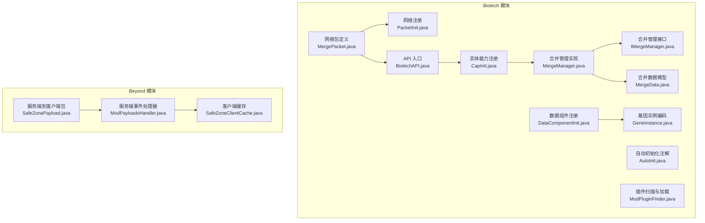
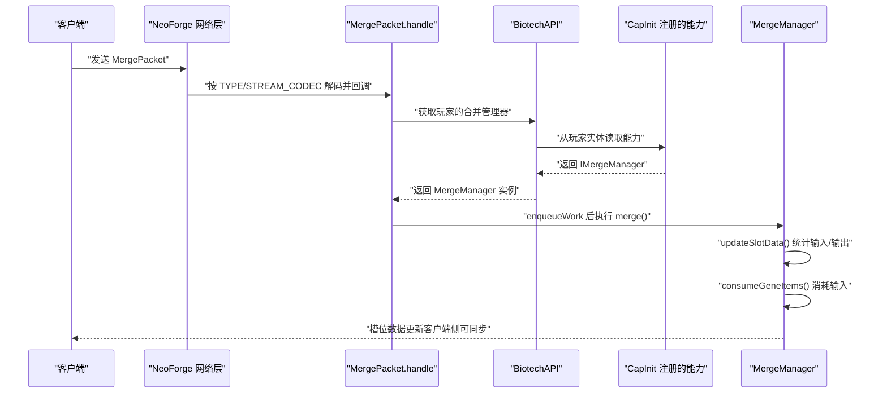
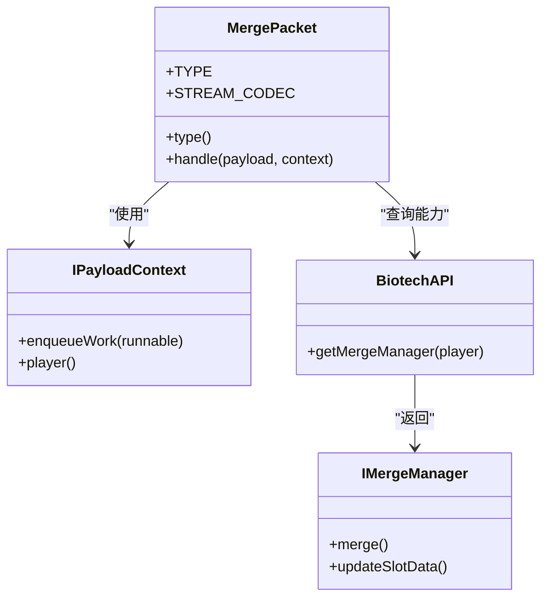
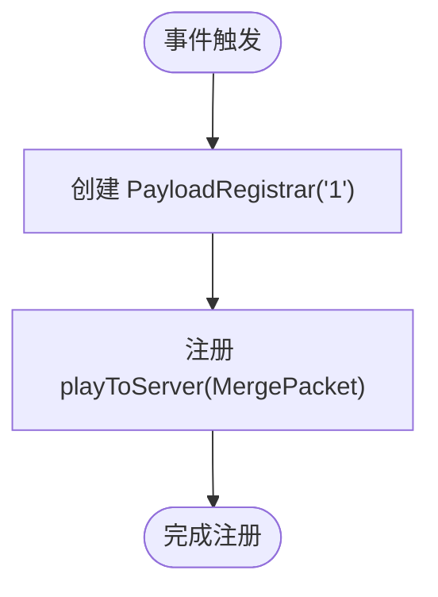
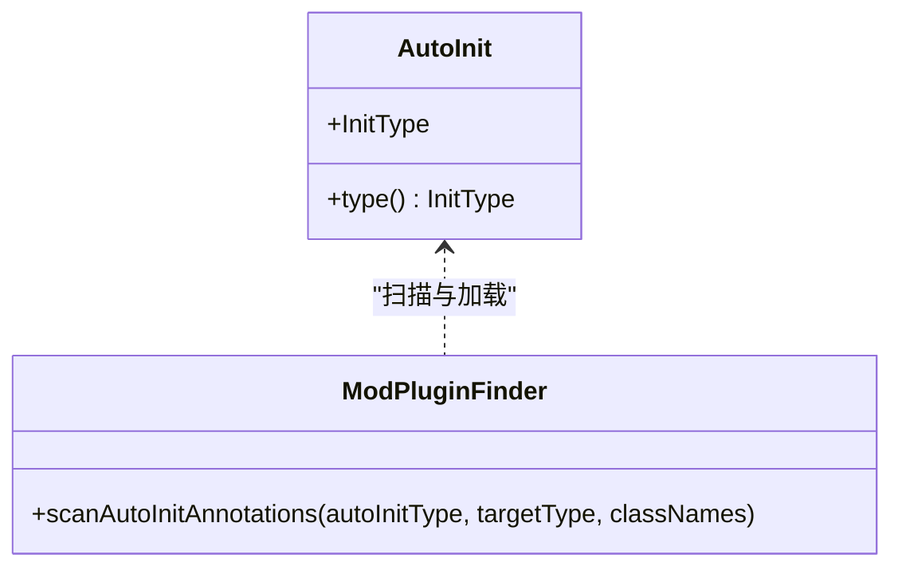
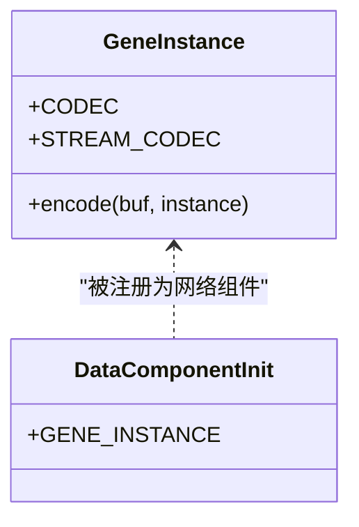
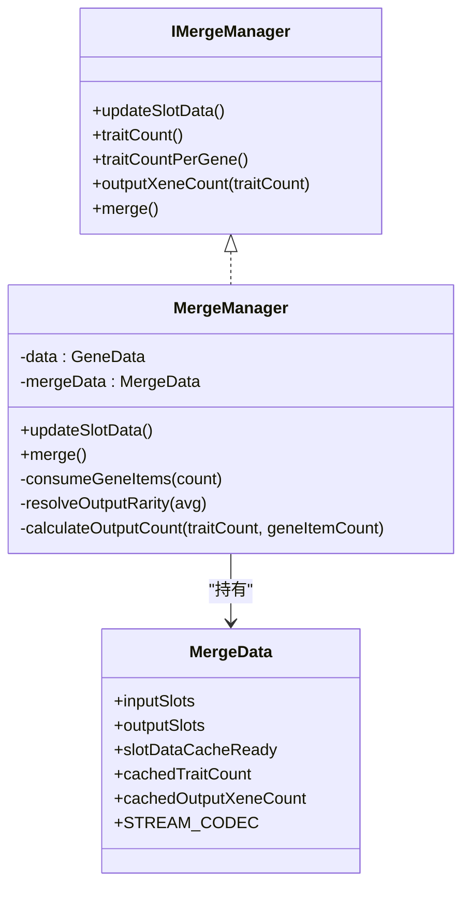
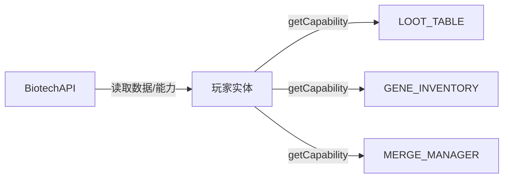
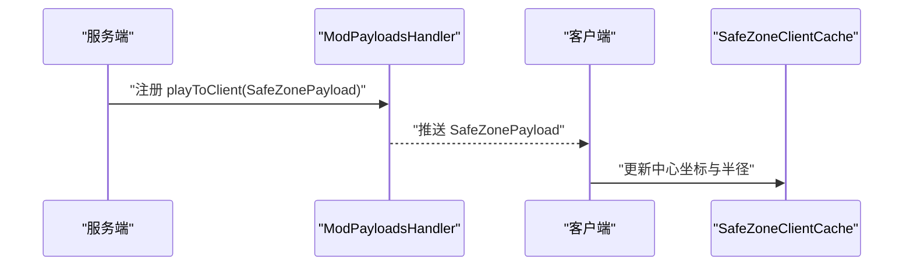
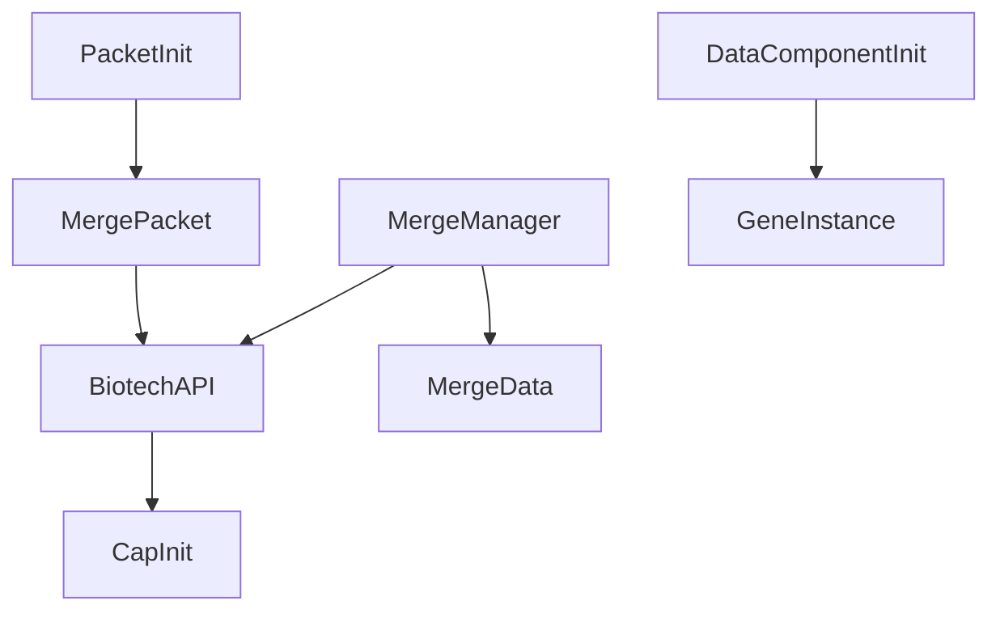

# 网络通信协议

<cite>
**本文引用的文件**
- [MergePacket.java](file://Biotech/src/main/java/org/biotech/network/MergePacket.java)
- [PacketInit.java](file://Biotech/src/main/java/org/biotech/api/init/PacketInit.java)
- [AutoInit.java](file://Biotech/src/main/java/org/biotech/api/util/AutoInit.java)
- [ModPluginFinder.java](file://Biotech/src/main/java/org/biotech/api/util/ModPluginFinder.java)
- [BiotechAPI.java](file://Biotech/src/main/java/org/biotech/api/BiotechAPI.java)
- [CapInit.java](file://Biotech/src/main/java/org/biotech/api/init/CapInit.java)
- [IMergeManager.java](file://Biotech/src/main/java/org/biotech/api/system/merge/core/IMergeManager.java)
- [MergeManager.java](file://Biotech/src/main/java/org/biotech/api/system/merge/MergeManager.java)
- [MergeData.java](file://Biotech/src/main/java/org/biotech/api/system/merge/MergeData.java)
- [DataComponentInit.java](file://Biotech/src/main/java/org/biotech/api/init/DataComponentInit.java)
- [GeneInstance.java](file://Biotech/src/main/java/org/biotech/api/system/gene/GeneInstance.java)
- [ModPayloadsHandler.java](file://Beyond/src/main/java/com/pz/beyond/event/ModPayloadsHandler.java)
- [SafeZonePayload.java](file://Beyond/src/main/java/com/pz/beyond/network/SafeZonePayload.java)
- [SafeZoneClientCache.java](file://Beyond/src/main/java/com/pz/beyond/data/SafeZoneClientCache.java)
</cite>

## 目录
1. [引言](#引言)
2. [项目结构](#项目结构)
3. [核心组件](#核心组件)
4. [架构总览](#架构总览)
5. [详细组件分析](#详细组件分析)
6. [依赖分析](#依赖分析)
7. [性能考量](#性能考量)
8. [故障排查指南](#故障排查指南)
9. [结论](#结论)
10. [附录](#附录)

## 引言
本文件面向网络通信协议与数据序列化机制，聚焦以下主题：
- MergePacket 合并包的传输协议与数据序列化
- PacketInit 的网络包注册与初始化流程
- AutoInit 自动初始化系统在网络通信中的作用与实现原理
- 完整的网络包发送、接收与处理示例路径
- 安全性、数据同步策略、错误处理、性能优化、延迟处理与断线重连建议

## 项目结构
本仓库包含多个模块，其中 Biotech 模块提供网络通信与数据同步的核心实现；Beyond 模块提供另一个网络包示例（SafeZonePayload），用于对比双向通信模式。

**图表来源**
- [MergePacket.java:1-35](file://Biotech/src/main/java/org/biotech/network/MergePacket.java#L1-L35)
- [PacketInit.java:1-19](file://Biotech/src/main/java/org/biotech/api/init/PacketInit.java#L1-L19)
- [AutoInit.java:1-34](file://Biotech/src/main/java/org/biotech/api/util/AutoInit.java#L1-L34)
- [ModPluginFinder.java:73-100](file://Biotech/src/main/java/org/biotech/api/util/ModPluginFinder.java#L73-L100)
- [BiotechAPI.java:1-92](file://Biotech/src/main/java/org/biotech/api/BiotechAPI.java#L1-L92)
- [CapInit.java:1-62](file://Biotech/src/main/java/org/biotech/api/init/CapInit.java#L1-L62)
- [IMergeManager.java:1-52](file://Biotech/src/main/java/org/biotech/api/system/merge/core/IMergeManager.java#L1-L52)
- [MergeManager.java:1-207](file://Biotech/src/main/java/org/biotech/api/system/merge/MergeManager.java#L1-L207)
- [MergeData.java:1-40](file://Biotech/src/main/java/org/biotech/api/system/merge/MergeData.java#L1-L40)
- [DataComponentInit.java:35-46](file://Biotech/src/main/java/org/biotech/api/init/DataComponentInit.java#L35-L46)
- [GeneInstance.java:35-64](file://Biotech/src/main/java/org/biotech/api/system/gene/GeneInstance.java#L35-L64)
- [SafeZonePayload.java:1-30](file://Beyond/src/main/java/com/pz/beyond/network/SafeZonePayload.java#L1-L30)
- [ModPayloadsHandler.java:1-34](file://Beyond/src/main/java/com/pz/beyond/event/ModPayloadsHandler.java#L1-L34)
- [SafeZoneClientCache.java:1-29](file://Beyond/src/main/java/com/pz/beyond/data/SafeZoneClientCache.java#L1-L29)

**章节来源**
- [MergePacket.java:1-35](file://Biotech/src/main/java/org/biotech/network/MergePacket.java#L1-L35)
- [PacketInit.java:1-19](file://Biotech/src/main/java/org/biotech/api/init/PacketInit.java#L1-L19)
- [BiotechAPI.java:1-92](file://Biotech/src/main/java/org/biotech/api/BiotechAPI.java#L1-L92)
- [CapInit.java:1-62](file://Biotech/src/main/java/org/biotech/api/init/CapInit.java#L1-L62)
- [IMergeManager.java:1-52](file://Biotech/src/main/java/org/biotech/api/system/merge/core/IMergeManager.java#L1-L52)
- [MergeManager.java:1-207](file://Biotech/src/main/java/org/biotech/api/system/merge/MergeManager.java#L1-L207)
- [MergeData.java:1-40](file://Biotech/src/main/java/org/biotech/api/system/merge/MergeData.java#L1-L40)
- [DataComponentInit.java:35-46](file://Biotech/src/main/java/org/biotech/api/init/DataComponentInit.java#L35-L46)
- [GeneInstance.java:35-64](file://Biotech/src/main/java/org/biotech/api/system/gene/GeneInstance.java#L35-L64)
- [SafeZonePayload.java:1-30](file://Beyond/src/main/java/com/pz/beyond/network/SafeZonePayload.java#L1-L30)
- [ModPayloadsHandler.java:1-34](file://Beyond/src/main/java/com/pz/beyond/event/ModPayloadsHandler.java#L1-L34)
- [SafeZoneClientCache.java:1-29](file://Beyond/src/main/java/com/pz/beyond/data/SafeZoneClientCache.java#L1-L29)

## 核心组件
- MergePacket：客户端向服务端发起“合并”请求的自定义网络包，采用单位编码（无字段）以表示简单触发。
- PacketInit：在 NeoForge 事件总线上注册 MergePacket 的处理通道，声明网络版本与编解码器。
- BiotechAPI：统一访问入口，提供从玩家实体获取合并管理器等能力。
- CapInit：注册实体能力（如合并管理器），使玩家实体具备持久化状态与行为。
- MergeManager：合并逻辑实现，负责统计输入槽位、计算输出、消耗输入、发放奖励。
- MergeData：合并相关数据模型，包含输入/输出槽位与运行时缓存。
- DataComponentInit 与 GeneInstance：展示如何通过 Codec/StreamCodec 对复杂数据进行网络同步。

**章节来源**
- [MergePacket.java:1-35](file://Biotech/src/main/java/org/biotech/network/MergePacket.java#L1-L35)
- [PacketInit.java:1-19](file://Biotech/src/main/java/org/biotech/api/init/PacketInit.java#L1-L19)
- [BiotechAPI.java:1-92](file://Biotech/src/main/java/org/biotech/api/BiotechAPI.java#L1-L92)
- [CapInit.java:1-62](file://Biotech/src/main/java/org/biotech/api/init/CapInit.java#L1-L62)
- [IMergeManager.java:1-52](file://Biotech/src/main/java/org/biotech/api/system/merge/core/IMergeManager.java#L1-L52)
- [MergeManager.java:1-207](file://Biotech/src/main/java/org/biotech/api/system/merge/MergeManager.java#L1-L207)
- [MergeData.java:1-40](file://Biotech/src/main/java/org/biotech/api/system/merge/MergeData.java#L1-L40)
- [DataComponentInit.java:35-46](file://Biotech/src/main/java/org/biotech/api/init/DataComponentInit.java#L35-L46)
- [GeneInstance.java:35-64](file://Biotech/src/main/java/org/biotech/api/system/gene/GeneInstance.java#L35-L64)

## 架构总览
下图展示了客户端-服务端的交互路径：客户端发送 MergePacket，服务端在主线程中执行合并逻辑，并更新槽位数据。

**图表来源**
- [MergePacket.java:23-33](file://Biotech/src/main/java/org/biotech/network/MergePacket.java#L23-L33)
- [BiotechAPI.java:39-41](file://Biotech/src/main/java/org/biotech/api/BiotechAPI.java#L39-L41)
- [CapInit.java:54-58](file://Biotech/src/main/java/org/biotech/api/init/CapInit.java#L54-L58)
- [MergeManager.java:107-157](file://Biotech/src/main/java/org/biotech/api/system/merge/MergeManager.java#L107-L157)

## 详细组件分析

### MergePacket：合并包的传输协议与序列化
- 类型与标识：使用自定义 Type，资源定位符唯一标识该包。
- 编解码：采用单位 StreamCodec（无字段），适合“触发式”包体。
- 处理流程：在 IPayloadContext 上入队工作，确保在服务端主线程执行；获取玩家实体与合并管理器，执行合并与槽位更新。

**图表来源**
- [MergePacket.java:13-33](file://Biotech/src/main/java/org/biotech/network/MergePacket.java#L13-L33)
- [BiotechAPI.java:39-41](file://Biotech/src/main/java/org/biotech/api/BiotechAPI.java#L39-L41)
- [IMergeManager.java:13-51](file://Biotech/src/main/java/org/biotech/api/system/merge/core/IMergeManager.java#L13-L51)

**章节来源**
- [MergePacket.java:1-35](file://Biotech/src/main/java/org/biotech/network/MergePacket.java#L1-L35)

### PacketInit：网络包注册与初始化流程
- 在 NeoForge 事件总线订阅注册事件，设置网络版本字符串。
- 将 MergePacket 的 TYPE、STREAM_CODEC 与处理函数注册到 playToServer 通道。
- 该流程确保客户端可向服务端发送合并请求。

**图表来源**
- [PacketInit.java:11-17](file://Biotech/src/main/java/org/biotech/api/init/PacketInit.java#L11-L17)

**章节来源**
- [PacketInit.java:1-19](file://Biotech/src/main/java/org/biotech/api/init/PacketInit.java#L1-L19)

### AutoInit 自动初始化系统
- AutoInit 注解用于标记需要自动注册的类，包含 InitType 枚举（GENE/TRAIT/XENE）。
- ModPluginFinder 扫描注解并按目标类型过滤，动态加载实现类实例，便于扩展与模块化初始化。

**图表来源**
- [AutoInit.java:15-32](file://Biotech/src/main/java/org/biotech/api/util/AutoInit.java#L15-L32)
- [ModPluginFinder.java:87-100](file://Biotech/src/main/java/org/biotech/api/util/ModPluginFinder.java#L87-L100)

**章节来源**
- [AutoInit.java:1-34](file://Biotech/src/main/java/org/biotech/api/util/AutoInit.java#L1-L34)
- [ModPluginFinder.java:73-100](file://Biotech/src/main/java/org/biotech/api/util/ModPluginFinder.java#L73-L100)

### 数据同步与序列化：Codec 与 StreamCodec
- GeneInstance 展示了 RecordCodecBuilder 与自定义 StreamCodec 的组合，既支持持久化也支持网络同步。
- DataComponentInit 将 GeneInstance 注册为网络同步的数据组件类型，确保客户端与服务端状态一致。

**图表来源**
- [GeneInstance.java:35-64](file://Biotech/src/main/java/org/biotech/api/system/gene/GeneInstance.java#L35-L64)
- [DataComponentInit.java:39-44](file://Biotech/src/main/java/org/biotech/api/init/DataComponentInit.java#L39-L44)

**章节来源**
- [GeneInstance.java:35-64](file://Biotech/src/main/java/org/biotech/api/system/gene/GeneInstance.java#L35-L64)
- [DataComponentInit.java:35-46](file://Biotech/src/main/java/org/biotech/api/init/DataComponentInit.java#L35-L46)

### 合并逻辑与数据模型：IMergeManager、MergeManager、MergeData
- IMergeManager 定义了合并管理器的契约：槽位更新、词条统计、输出数量计算与合并执行。
- MergeManager 实现具体逻辑：统计输入槽位、计算输出数量与稀有度、消耗输入基因物品、发放奖励并播放音效。
- MergeData 作为持久化数据容器，包含输入/输出槽位与运行时缓存，配合 StreamCodec 进行网络同步。

**图表来源**
- [IMergeManager.java:13-51](file://Biotech/src/main/java/org/biotech/api/system/merge/core/IMergeManager.java#L13-L51)
- [MergeManager.java:24-206](file://Biotech/src/main/java/org/biotech/api/system/merge/MergeManager.java#L24-L206)
- [MergeData.java:19-39](file://Biotech/src/main/java/org/biotech/api/system/merge/MergeData.java#L19-L39)

**章节来源**
- [IMergeManager.java:1-52](file://Biotech/src/main/java/org/biotech/api/system/merge/core/IMergeManager.java#L1-L52)
- [MergeManager.java:1-207](file://Biotech/src/main/java/org/biotech/api/system/merge/MergeManager.java#L1-L207)
- [MergeData.java:1-40](file://Biotech/src/main/java/org/biotech/api/system/merge/MergeData.java#L1-L40)

### 能力系统与 API 入口：CapInit 与 BiotechAPI
- CapInit 在实体上注册多种能力（战利品表、基因库存、合并管理器），并绑定到玩家实体类型。
- BiotechAPI 提供统一入口，通过实体数据与能力系统访问各子系统。

**图表来源**
- [CapInit.java:39-58](file://Biotech/src/main/java/org/biotech/api/init/CapInit.java#L39-L58)
- [BiotechAPI.java:27-41](file://Biotech/src/main/java/org/biotech/api/BiotechAPI.java#L27-L41)

**章节来源**
- [CapInit.java:1-62](file://Biotech/src/main/java/org/biotech/api/init/CapInit.java#L1-L62)
- [BiotechAPI.java:1-92](file://Biotech/src/main/java/org/biotech/api/BiotechAPI.java#L1-L92)

### 双向通信示例：Beyond 模块的 SafeZonePayload
- Beyond 模块演示了服务端向客户端推送数据的模式：服务端注册 playToClient 通道，客户端在主线程更新本地缓存。
- 该模式可用于安全区信息、世界状态等实时数据同步。

**图表来源**
- [ModPayloadsHandler.java:14-32](file://Beyond/src/main/java/com/pz/beyond/event/ModPayloadsHandler.java#L14-L32)
- [SafeZonePayload.java:10-29](file://Beyond/src/main/java/com/pz/beyond/network/SafeZonePayload.java#L10-L29)
- [SafeZoneClientCache.java:12-28](file://Beyond/src/main/java/com/pz/beyond/data/SafeZoneClientCache.java#L12-L28)

**章节来源**
- [ModPayloadsHandler.java:1-34](file://Beyond/src/main/java/com/pz/beyond/event/ModPayloadsHandler.java#L1-L34)
- [SafeZonePayload.java:1-30](file://Beyond/src/main/java/com/pz/beyond/network/SafeZonePayload.java#L1-L30)
- [SafeZoneClientCache.java:1-29](file://Beyond/src/main/java/com/pz/beyond/data/SafeZoneClientCache.java#L1-L29)

## 依赖分析
- MergePacket 依赖 BiotechAPI 与 CapInit 提供的能力访问。
- PacketInit 依赖 NeoForge 的注册事件与 MergePacket 的类型/编解码器。
- MergeManager 依赖 MergeData 与物品系统，同时通过 BiotechAPI 获取玩家上下文。
- DataComponentInit 与 GeneInstance 形成数据组件链路，支撑网络同步。

**图表来源**
- [MergePacket.java:1-35](file://Biotech/src/main/java/org/biotech/network/MergePacket.java#L1-L35)
- [PacketInit.java:1-19](file://Biotech/src/main/java/org/biotech/api/init/PacketInit.java#L1-L19)
- [BiotechAPI.java:1-92](file://Biotech/src/main/java/org/biotech/api/BiotechAPI.java#L1-L92)
- [CapInit.java:1-62](file://Biotech/src/main/java/org/biotech/api/init/CapInit.java#L1-L62)
- [MergeManager.java:1-207](file://Biotech/src/main/java/org/biotech/api/system/merge/MergeManager.java#L1-L207)
- [MergeData.java:1-40](file://Biotech/src/main/java/org/biotech/api/system/merge/MergeData.java#L1-L40)
- [DataComponentInit.java:35-46](file://Biotech/src/main/java/org/biotech/api/init/DataComponentInit.java#L35-L46)
- [GeneInstance.java:35-64](file://Biotech/src/main/java/org/biotech/api/system/gene/GeneInstance.java#L35-L64)

**章节来源**
- [MergePacket.java:1-35](file://Biotech/src/main/java/org/biotech/network/MergePacket.java#L1-L35)
- [PacketInit.java:1-19](file://Biotech/src/main/java/org/biotech/api/init/PacketInit.java#L1-L19)
- [BiotechAPI.java:1-92](file://Biotech/src/main/java/org/biotech/api/BiotechAPI.java#L1-L92)
- [CapInit.java:1-62](file://Biotech/src/main/java/org/biotech/api/init/CapInit.java#L1-L62)
- [MergeManager.java:1-207](file://Biotech/src/main/java/org/biotech/api/system/merge/MergeManager.java#L1-L207)
- [MergeData.java:1-40](file://Biotech/src/main/java/org/biotech/api/system/merge/MergeData.java#L1-L40)
- [DataComponentInit.java:35-46](file://Biotech/src/main/java/org/biotech/api/init/DataComponentInit.java#L35-L46)
- [GeneInstance.java:35-64](file://Biotech/src/main/java/org/biotech/api/system/gene/GeneInstance.java#L35-L64)

## 性能考量
- 使用 StreamCodec 进行高效二进制序列化，避免 JSON 等文本开销。
- 合理缓存：MergeData 中的运行时缓存减少重复计算，降低 CPU 占用。
- 批处理与批量更新：在网络包处理后统一刷新槽位数据，减少多次广播。
- 延迟控制：利用 enqueueWork 将处理置于主线程，避免并发问题；同时尽量缩短处理时间。
- 断线重连：建议在客户端侧维护轻量级本地状态并在重连后请求一次全量同步。

## 故障排查指南
- 网络包未到达：检查 PacketInit 是否正确注册 TYPE 与 STREAM_CODEC，确认网络版本字符串一致。
- 处理未生效：确认 MergePacket.handle 中是否正确获取玩家与合并管理器，以及 enqueueWork 是否被调用。
- 数据不一致：核对 DataComponentInit 是否已注册对应数据组件，确保客户端与服务端共享同一 StreamCodec。
- 性能异常：检查 MergeManager.updateSlotData 是否被频繁触发，必要时引入节流或批量处理。

**章节来源**
- [PacketInit.java:11-17](file://Biotech/src/main/java/org/biotech/api/init/PacketInit.java#L11-L17)
- [MergePacket.java:23-33](file://Biotech/src/main/java/org/biotech/network/MergePacket.java#L23-L33)
- [DataComponentInit.java:35-46](file://Biotech/src/main/java/org/biotech/api/init/DataComponentInit.java#L35-L46)

## 结论
本仓库通过 NeoForge 的自定义包机制与能力系统，实现了简洁高效的客户端-服务端通信。MergePacket 作为触发式包体，结合 BiotechAPI 与 CapInit 的能力访问，使得合并逻辑在服务端安全执行；同时，Codec/StreamCodec 的使用保证了数据的可靠同步。Beyond 模块的 SafeZonePayload 则提供了服务端到客户端的同步范式。整体设计具备良好的扩展性与性能表现，适合进一步完善安全校验、错误处理与断线重连策略。

## 附录
- 发送与接收示例路径（不含代码内容）：
  - 客户端发送合并请求：[MergePacket.java:15-16](file://Biotech/src/main/java/org/biotech/network/MergePacket.java#L15-L16)
  - 服务端注册处理：[PacketInit.java:12-17](file://Biotech/src/main/java/org/biotech/api/init/PacketInit.java#L12-L17)
  - 服务端处理与合并执行：[MergePacket.java:23-33](file://Biotech/src/main/java/org/biotech/network/MergePacket.java#L23-L33) → [MergeManager.java:107-157](file://Biotech/src/main/java/org/biotech/api/system/merge/MergeManager.java#L107-L157)
  - 数据同步（示例）：[DataComponentInit.java:39-44](file://Biotech/src/main/java/org/biotech/api/init/DataComponentInit.java#L39-L44) → [GeneInstance.java:54-63](file://Biotech/src/main/java/org/biotech/api/system/gene/GeneInstance.java#L54-L63)
  - 服务端到客户端同步（示例）：[ModPayloadsHandler.java:14-23](file://Beyond/src/main/java/com/pz/beyond/event/ModPayloadsHandler.java#L14-L23) → [SafeZonePayload.java:21-29](file://Beyond/src/main/java/com/pz/beyond/network/SafeZonePayload.java#L21-L29)