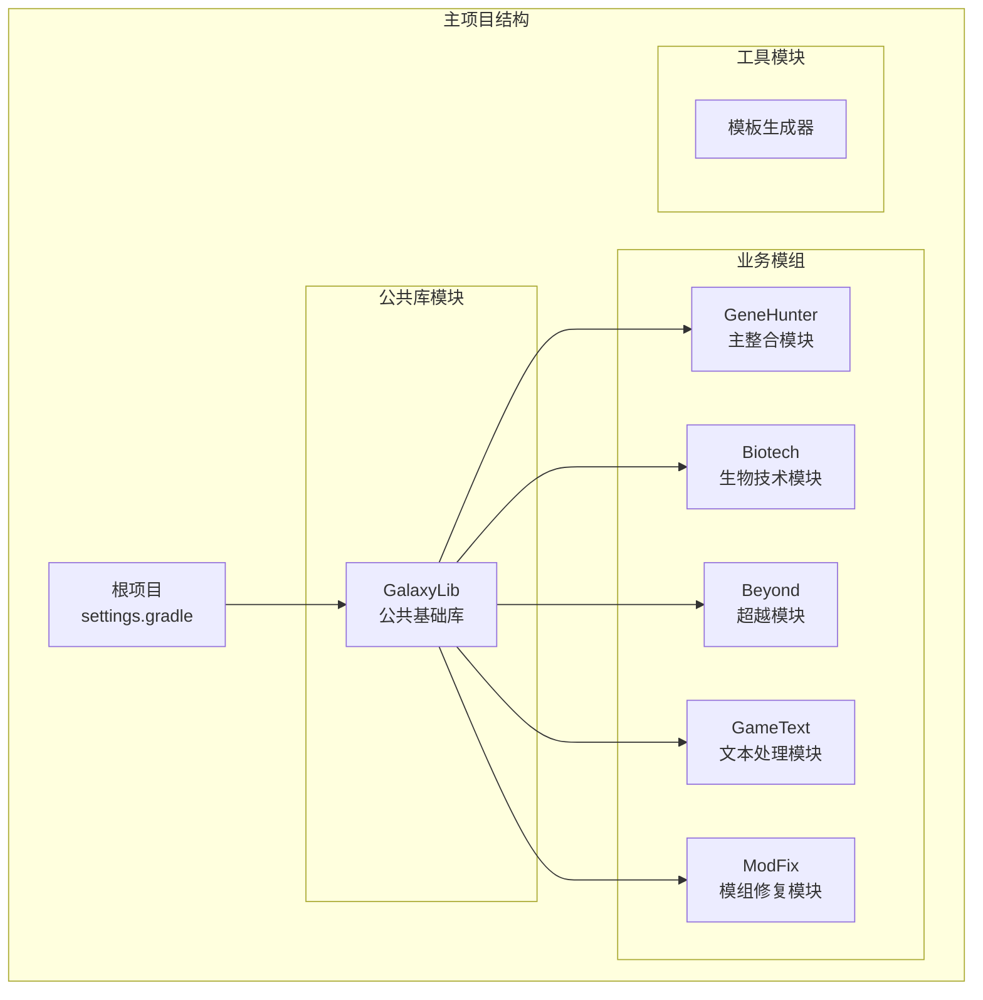
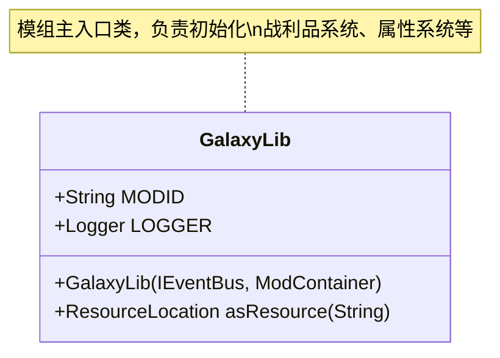
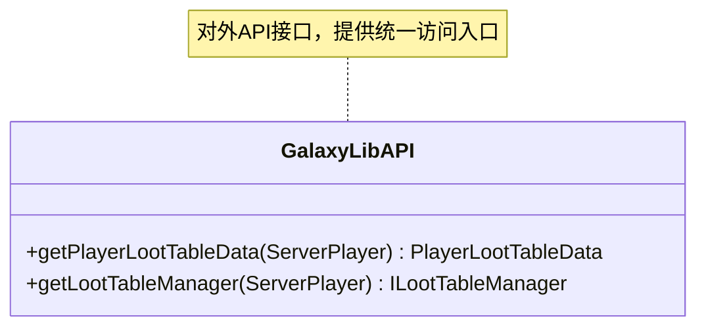
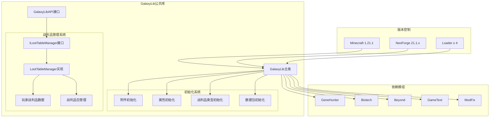
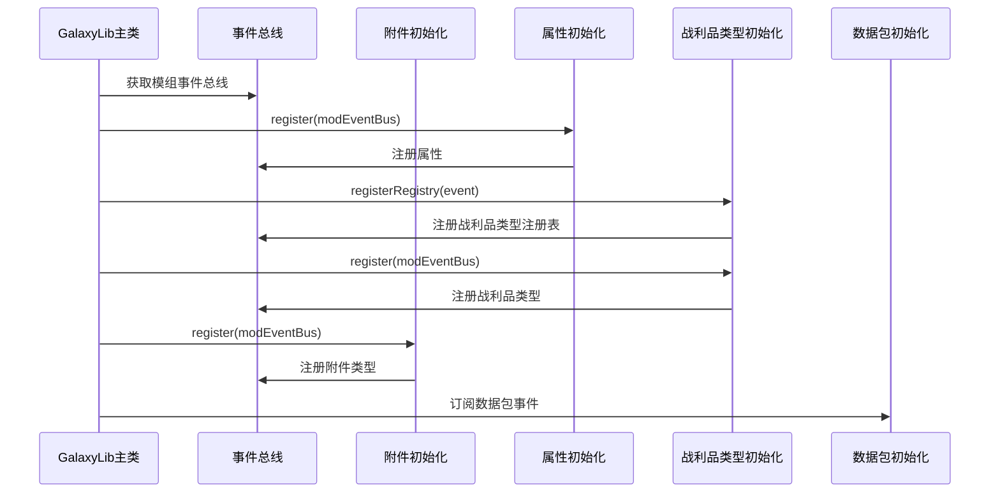
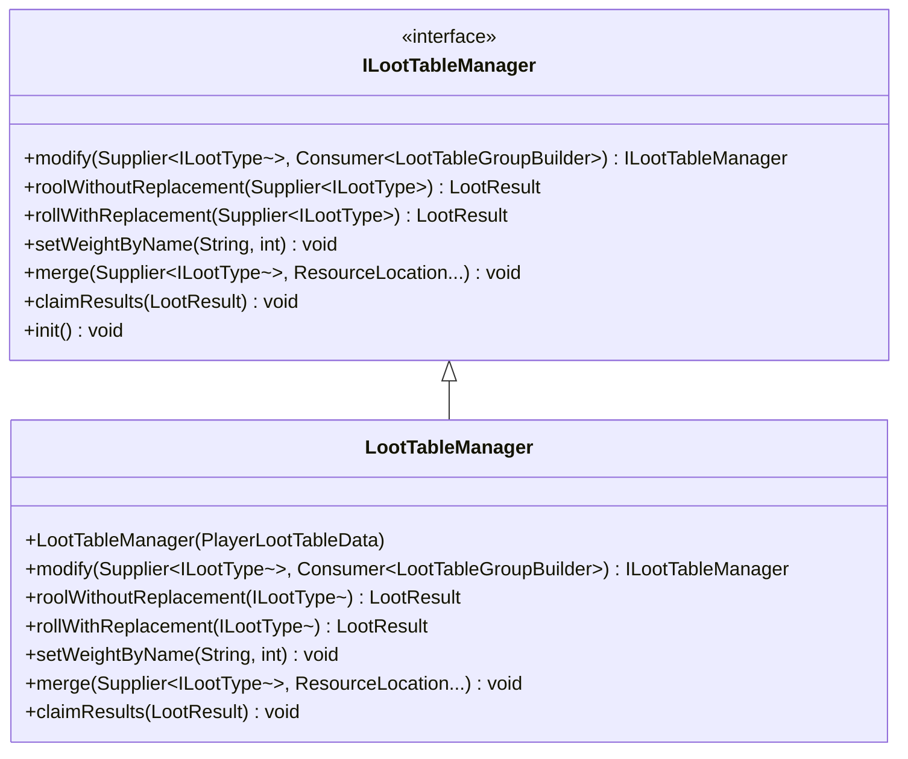
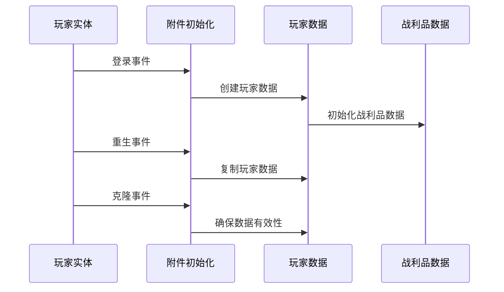
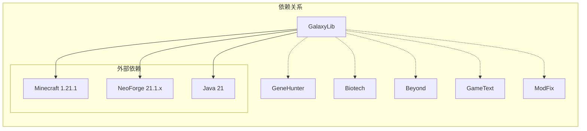

# GalaxyLib公共库模块

<cite>
**本文档引用的文件**
- [GalaxyLib.java](file://GalaxyLib/src/main/java/org/galaxylib/GalaxyLib.java)
- [GalaxyLibAPI.java](file://GalaxyLib/src/main/java/org/galaxylib/api/GalaxyLibAPI.java)
- [GalaxyLibAttachInit.java](file://GalaxyLib/src/main/java/org/galaxylib/api/init/GalaxyLibAttachInit.java)
- [GalaxyLibAttributeInit.java](file://GalaxyLib/src/main/java/org/galaxylib/api/init/GalaxyLibAttributeInit.java)
- [GalaxyLibLootTypeInit.java](file://GalaxyLib/src/main/java/org/galaxylib/api/init/GalaxyLibLootTypeInit.java)
- [GalaxyLibPackInit.java](file://GalaxyLib/src/main/java/org/galaxylib/api/init/GalaxyLibPackInit.java)
- [ILootTableManager.java](file://GalaxyLib/src/main/java/org/galaxylib/api/system/loot/core/ILootTableManager.java)
- [LootTableManager.java](file://GalaxyLib/src/main/java/org/galaxylib/api/system/loot/LootTableManager.java)
- [README.md](file://GalaxyLib/README.md)
- [build.gradle](file://GalaxyLib/build.gradle)
- [build.gradle](file://Biotech/build.gradle)
- [build.gradle](file://Beyond/build.gradle)
- [build.gradle](file://GameText/build.gradle)
- [build.gradle](file://ModFix/build.gradle)
- [settings.gradle](file://settings.gradle)
- [gradle.properties](file://gradle.properties)
</cite>

## 目录
1. [简介](#简介)
2. [项目结构](#项目结构)
3. [核心组件](#核心组件)
4. [架构概览](#架构概览)
5. [详细组件分析](#详细组件分析)
6. [依赖关系分析](#依赖关系分析)
7. [性能考虑](#性能考虑)
8. [故障排除指南](#故障排除指南)
9. [结论](#结论)
10. [附录](#附录)

## 简介

GalaxyLib是VerShift项目中的公共基础库模块，专门设计为跨模组共享的基础库。该模块的核心目标是提供可复用的公共能力和工具代码，避免在各个业务模组中重复实现相同的功能。

### 设计目的

GalaxyLib作为公共库模块，主要承担以下职责：
- 提供跨模组共享的通用工具方法
- 定义接口规范和共享常量
- 作为各业务模组的依赖基础
- 维护版本兼容性和接口稳定性

### 功能定位

根据模块定位文档，GalaxyLib专注于提供"跨模块复用的公共能力与工具代码"，并且明确要求变更时需要关注对GeneHunter、Beyond、Biotech三个核心模组的兼容性。

**章节来源**
- [README.md:1-11](file://GalaxyLib/README.md#L1-L11)

## 项目结构

整个项目采用多模块架构，GalaxyLib位于中央位置，为其他业务模组提供基础支持：

**图表来源**
- [settings.gradle:13-18](file://settings.gradle#L13-L18)
- [build.gradle:1-4](file://build.gradle#L1-L4)

### 模块组织原则

项目遵循清晰的模块分离原则：
- **GalaxyLib**: 公共基础库，提供跨模组共享功能
- **业务模组**: 各自独立的功能模块，依赖公共库
- **工具模块**: 支持性的辅助功能

**章节来源**
- [settings.gradle:1-19](file://settings.gradle#L1-L19)

## 核心组件

### GalaxyLib主类分析

GalaxyLib模块的核心是位于`org.galaxylib`包下的GalaxyLib主类。该类作为模组入口，负责初始化各种系统组件。

**图表来源**
- [GalaxyLib.java:14-32](file://GalaxyLib/src/main/java/org/galaxylib/GalaxyLib.java#L14-L32)

### GalaxyLibAPI分析

GalaxyLibAPI提供了对外的统一访问接口，封装了对内部系统的访问方法。

**图表来源**
- [GalaxyLibAPI.java:9-18](file://GalaxyLib/src/main/java/org/galaxylib/api/GalaxyLibAPI.java#L9-L18)

**章节来源**
- [GalaxyLib.java:1-33](file://GalaxyLib/src/main/java/org/galaxylib/GalaxyLib.java#L1-L33)
- [GalaxyLibAPI.java:1-19](file://GalaxyLib/src/main/java/org/galaxylib/api/GalaxyLibAPI.java#L1-L19)

## 架构概览

GalaxyLib在整个项目架构中扮演着基础设施的角色，为其他模组提供共享功能：

**图表来源**
- [GalaxyLib.java:19-26](file://GalaxyLib/src/main/java/org/galaxylib/GalaxyLib.java#L19-L26)
- [GalaxyLibAPI.java:9-18](file://GalaxyLib/src/main/java/org/galaxylib/api/GalaxyLibAPI.java#L9-L18)

### 版本兼容性

项目严格遵循以下版本约束：
- **Minecraft版本**: 1.21.1（支持1.21.x系列）
- **NeoForge版本**: 21.1.223（支持21.1.x系列）
- **Loader版本**: ≥ 4
- **Java版本**: 21

**章节来源**
- [gradle.properties:9-15](file://gradle.properties#L9-L15)

## 详细组件分析

### 初始化框架

GalaxyLib采用了模块化的初始化框架，每个功能模块都有专门的初始化类：

**图表来源**
- [GalaxyLib.java:19-26](file://GalaxyLib/src/main/java/org/galaxylib/GalaxyLib.java#L19-L26)
- [GalaxyLibAttributeInit.java:21-23](file://GalaxyLib/src/main/java/org/galaxylib/api/init/GalaxyLibAttributeInit.java#L21-L23)
- [GalaxyLibLootTypeInit.java:28-34](file://GalaxyLib/src/main/java/org/galaxylib/api/init/GalaxyLibLootTypeInit.java#L28-L34)
- [GalaxyLibAttachInit.java:19-21](file://GalaxyLib/src/main/java/org/galaxylib/api/init/GalaxyLibAttachInit.java#L19-L21)

### 战利品管理系统

GalaxyLib实现了完整的战利品管理系统，包括战利品类型注册、玩家数据管理和抽取算法：

**图表来源**
- [ILootTableManager.java:22-118](file://GalaxyLib/src/main/java/org/galaxylib/api/system/loot/core/ILootTableManager.java#L22-L118)
- [LootTableManager.java:21-200](file://GalaxyLib/src/main/java/org/galaxylib/api/system/loot/LootTableManager.java#L21-L200)

### 玩家数据管理

GalaxyLib通过附件系统为玩家提供持久化的战利品数据：

**图表来源**
- [GalaxyLibAttachInit.java:34-78](file://GalaxyLib/src/main/java/org/galaxylib/api/init/GalaxyLibAttachInit.java#L34-L78)

**章节来源**
- [GalaxyLib.java:19-32](file://GalaxyLib/src/main/java/org/galaxylib/GalaxyLib.java#L19-L32)
- [GalaxyLibAPI.java:9-18](file://GalaxyLib/src/main/java/org/galaxylib/api/GalaxyLibAPI.java#L9-L18)

## 依赖关系分析

### 模块间依赖图

**图表来源**
- [settings.gradle:13-18](file://settings.gradle#L13-L18)
- [gradle.properties:9-15](file://gradle.properties#L9-L15)

### 依赖管理策略

各业务模组对GalaxyLib的依赖管理体现了不同的使用模式：

1. **标准依赖模式**（Biotech、ModFix）：
   - 直接使用`implementation(project(":GalaxyLib"))`
   - 适用于需要完整功能的模组

2. **条件依赖模式**（Biotech）：
   - 使用`if (common != null) { implementation(common) }`
   - 提供了更好的错误处理和灵活性

3. **简化依赖模式**（GameText）：
   - 直接依赖公共库，无额外条件判断
   - 适合简单的功能集成

**章节来源**
- [build.gradle:74-85](file://Biotech/build.gradle#L74-L85)
- [build.gradle:68-72](file://ModFix/build.gradle#L68-L72)
- [build.gradle:34-41](file://GameText/build.gradle#L34-L41)

## 性能考虑

### 模块加载优化

由于GalaxyLib作为公共库被多个模组共享，其设计需要考虑以下性能因素：

1. **延迟加载**: 可以考虑将部分功能改为按需加载
2. **内存占用**: 避免在公共库中存储大量全局状态
3. **初始化开销**: 减少启动时的初始化复杂度

### 版本兼容性影响

- **向后兼容**: 所有公共接口变更需要保持向后兼容
- **向前兼容**: 新增功能时要考虑未来版本的兼容性
- **测试覆盖**: 确保所有依赖GalaxyLib的模组都能正常工作

## 故障排除指南

### 常见问题及解决方案

1. **依赖解析失败**
   - 检查`settings.gradle`中的模块声明
   - 确认GalaxyLib模块路径正确
   - 验证Gradle版本兼容性

2. **编译错误**
   - 确认Java版本设置为21
   - 检查Minecraft和NeoForge版本匹配
   - 验证Parchment映射版本

3. **运行时异常**
   - 检查模块间的版本兼容性
   - 确认依赖传递正确
   - 验证模组加载顺序

### 调试建议

- 使用`--info`或`--debug`参数进行详细日志输出
- 检查Gradle构建缓存是否需要清理
- 验证IDE中的模块依赖关系

**章节来源**
- [build.gradle:1-4](file://build.gradle#L1-L4)
- [gradle.properties:1-16](file://gradle.properties#L1-L16)

## 结论

GalaxyLib作为VerShift项目的核心公共库模块，成功实现了跨模组共享功能的目标。经过重构，GalaxyLib已经从简单的演示模块发展为功能完整的公共库，包含了战利品管理系统、初始化框架等核心功能。

### 主要优势

1. **模块化设计**: 清晰的模块分离，便于维护和扩展
2. **功能完整性**: 包含了完整的战利品管理系统
3. **版本控制**: 严格的版本约束确保了兼容性
4. **依赖管理**: 灵活的依赖注入机制适应不同使用场景
5. **开发规范**: 明确的开发指导原则保证了代码质量

### 发展方向

GalaxyLib将继续作为VerShift项目的基础库，为各个业务模组提供稳定可靠的公共功能支持。随着项目的演进，GalaxyLib将不断完善其功能和接口设计，更好地服务于整个项目生态系统。

## 附录

### 使用指南

#### 在新模组中集成GalaxyLib

1. **添加模块声明**：在`settings.gradle`中包含GalaxyLib模块
2. **添加依赖**：在模组的`build.gradle`中添加`implementation(project(":GalaxyLib"))`
3. **导入使用**：在Java代码中导入相应的类并使用公共功能

#### 最佳实践

- 仅添加可复用的公共逻辑
- 保持接口稳定，避免破坏性变更
- 编写充分的测试用例
- 文档化所有公共API

**章节来源**
- [README.md:7-10](file://GalaxyLib/README.md#L7-L10)
- [build.gradle:13-18](file://settings.gradle#L13-L18)