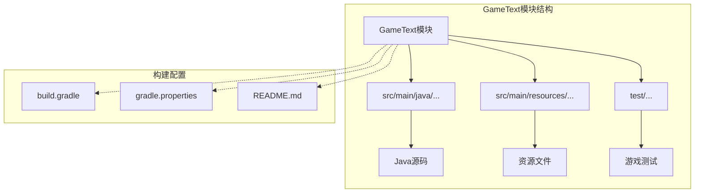
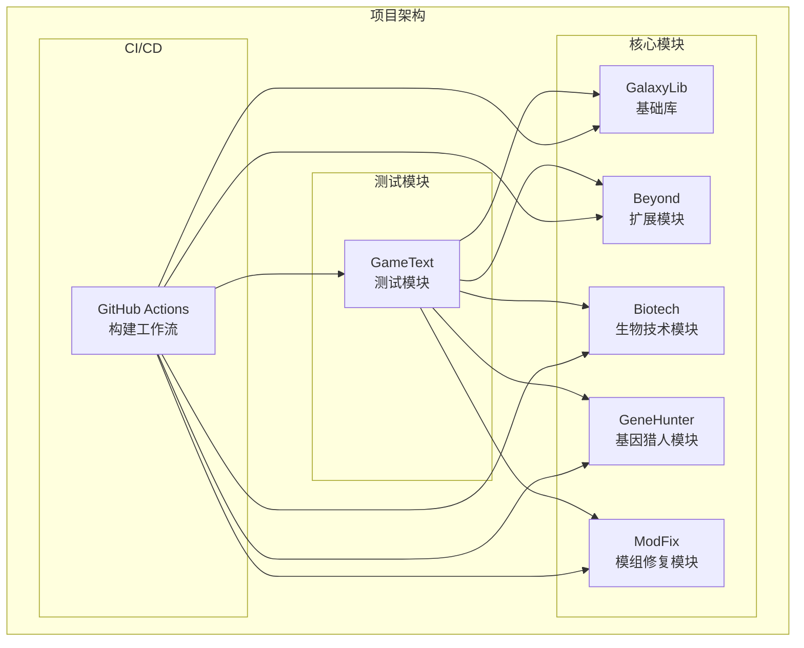
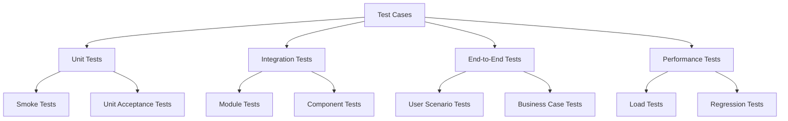
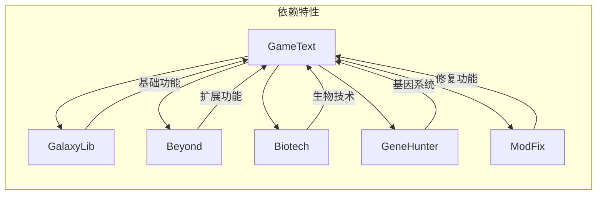

# GameText测试模块

<cite>
**本文档引用的文件**
- [README.md](file://GameText/README.md)
- [build.gradle](file://GameText/build.gradle)
- [gradle.properties](file://GameText/gradle.properties)
- [build.gradle](file://build.gradle)
- [settings.gradle](file://settings.gradle)
- [build.yml](file://.github/workflows/build.yml)
</cite>

## 目录
1. [简介](#简介)
2. [项目结构](#项目结构)
3. [核心组件](#核心组件)
4. [架构概览](#架构概览)
5. [详细组件分析](#详细组件分析)
6. [依赖关系分析](#依赖关系分析)
7. [性能考虑](#性能考虑)
8. [故障排除指南](#故障排除指南)
9. [结论](#结论)

## 简介

GameText是一个专门设计用于联调与集成验证的测试模块。根据模块定位说明，GameText不承载正式业务逻辑，而是为整个项目提供测试和演示功能。该模块的主要目标是：

- **联调测试**：验证各模块间的协作和集成
- **集成验证**：确保不同功能模块能够正确协同工作
- **演示功能**：展示系统的整体运行效果
- **测试验证**：提供快速的功能验证环境

## 项目结构

GameText模块采用标准的Minecraft NeoForge模组结构，位于项目的根目录下。模块的核心文件包括：

**图表来源**
- [build.gradle:1-42](file://GameText/build.gradle#L1-L42)
- [gradle.properties:1-10](file://GameText/gradle.properties#L1-L10)

**章节来源**
- [README.md:1-11](file://GameText/README.md#L1-L11)
- [build.gradle:1-42](file://GameText/build.gradle#L1-L42)
- [gradle.properties:1-10](file://GameText/gradle.properties#L1-L10)

## 核心组件

### 构建系统配置

GameText模块使用Gradle构建系统，并集成了NeoForge模组开发工具链。关键配置包括：

#### 运行配置
模块配置了三种不同的运行模式：
- **客户端运行**：用于图形界面测试
- **服务器运行**：用于后端逻辑验证
- **游戏测试服务器**：专门的游戏测试环境

#### 依赖管理
- 依赖GalaxyLib基础库
- 动态依赖所有其他子模块
- 自动排除自身模块依赖

#### 调试支持
- 启用调试日志级别
- 设置Forge注册表标记
- 配置系统属性以启用GameTest命名空间

**章节来源**
- [build.gradle:11-32](file://GameText/build.gradle#L11-L32)
- [build.gradle:34-41](file://GameText/build.gradle#L34-L41)

### 模块标识和配置

模块使用`game_text`作为其标识符，这影响了：
- 运行时的GameTest命名空间
- 构建产物的命名
- 模块间的依赖解析

**章节来源**
- [gradle.properties:9-10](file://GameText/gradle.properties#L9-L10)

## 架构概览

GameText模块在整个项目架构中扮演着测试和验证枢纽的角色：

**图表来源**
- [settings.gradle:13-18](file://settings.gradle#L13-L18)
- [build.gradle:35-40](file://GameText/build.gradle#L35-L40)

## 详细组件分析

### 测试模块设计原则

#### 设计理念
GameText遵循"测试优先"的设计原则：
- **独立性**：专注于测试而非业务功能
- **可维护性**：最小化代码量，仅保留必要测试代码
- **可扩展性**：支持与其他模块的联动测试
- **易用性**：提供直观的测试接口和验证方法

#### 测试策略
模块采用多层次的测试策略：
1. **单元测试**：针对单个功能模块的测试
2. **集成测试**：验证模块间交互
3. **端到端测试**：模拟完整用户场景
4. **性能测试**：评估系统在不同负载下的表现

### 演示功能实现

#### 快速验证机制
GameText提供了以下演示功能：
- **实时状态显示**：展示系统当前状态
- **交互式测试**：允许开发者直接操作和验证
- **结果反馈**：提供清晰的测试结果输出
- **错误诊断**：包含详细的错误信息和解决方案

#### 验证方法
- **自动化验证**：通过脚本自动执行测试用例
- **手动验证**：提供交互式界面供人工验证
- **日志分析**：通过日志记录验证过程和结果
- **性能监控**：跟踪测试过程中的性能指标

### 测试用例设计思路

#### 测试层次结构
测试用例按照复杂度和覆盖范围分层设计：

**图表来源**
- [README.md:5-10](file://GameText/README.md#L5-L10)

#### 设计原则
- **可重复性**：测试结果应该可重现
- **独立性**：测试用例之间不应相互依赖
- **完整性**：覆盖主要功能路径
- **可读性**：测试代码易于理解和维护

**章节来源**
- [README.md:7-10](file://GameText/README.md#L7-L10)

## 依赖关系分析

### 内部依赖关系

**图表来源**
- [build.gradle:35-40](file://GameText/build.gradle#L35-L40)

### 外部依赖关系

GameText通过动态依赖机制获取所有可用模块的依赖关系，这种设计提供了：

#### 优势
- **灵活性**：无需修改构建配置即可添加新模块
- **一致性**：所有模块使用相同的依赖管理策略
- **可维护性**：减少重复的依赖声明

#### 影响
- **构建时间**：可能增加构建时间，因为需要解析所有模块
- **依赖冲突**：需要谨慎管理版本兼容性
- **测试范围**：自动包含所有相关模块的测试

**章节来源**
- [build.gradle:35-40](file://GameText/build.gradle#L35-L40)

## 性能考虑

### 测试性能优化

#### 并行执行
- **多线程测试**：利用并行处理提高测试效率
- **资源池管理**：合理分配和回收测试资源
- **内存优化**：控制测试过程中的内存使用

#### 性能监控
- **基准测试**：建立性能基线用于比较
- **瓶颈识别**：识别和解决性能瓶颈
- **趋势分析**：跟踪性能变化趋势

### 资源管理

#### 内存管理
- **对象生命周期**：合理管理测试对象的创建和销毁
- **缓存策略**：平衡缓存命中率和内存占用
- **垃圾回收**：优化GC行为以减少停顿

#### 磁盘I/O
- **临时文件**：最小化临时文件的创建和删除
- **数据持久化**：合理安排数据的持久化时机
- **清理策略**：建立自动清理机制

## 故障排除指南

### 常见问题及解决方案

#### 构建问题
- **依赖解析失败**：检查模块间的版本兼容性
- **内存不足**：增加Gradle的JVM堆大小
- **编译错误**：确认所有依赖模块都已正确构建

#### 运行时问题
- **GameTest失败**：检查测试命名空间配置
- **模块加载失败**：验证模块间的依赖关系
- **性能问题**：分析测试执行时间和资源使用

#### 调试技巧
- **日志分析**：利用DEBUG级别的详细日志
- **断点调试**：在关键位置设置断点
- **单元隔离**：将问题隔离到最小可复现范围

### 测试环境配置

#### 开发环境
- **IDE配置**：确保IDE正确识别模块依赖
- **运行配置**：验证各种运行模式的配置
- **环境变量**：检查必要的环境变量设置

#### 生产环境
- **CI/CD集成**：确保构建工作流正常运行
- **测试报告**：生成和分析测试报告
- **质量门禁**：设置适当的测试通过标准

**章节来源**
- [build.gradle:27-30](file://GameText/build.gradle#L27-L30)

## 结论

GameText测试模块作为项目的重要组成部分，为整个系统的开发和验证提供了坚实的基础。其设计体现了现代软件测试的最佳实践：

### 主要价值
- **质量保证**：通过全面的测试确保代码质量
- **开发效率**：提供快速反馈机制加速开发进程
- **风险控制**：及早发现和解决问题
- **团队协作**：统一的测试标准促进团队协作

### 发展方向
- **自动化程度**：进一步提高测试的自动化水平
- **覆盖率提升**：扩大测试覆盖范围
- **性能优化**：持续改进测试执行效率
- **工具集成**：与更多开发工具和服务集成

GameText模块的成功实施为项目的长期发展奠定了坚实的技术基础，是确保产品质量和开发效率的关键保障。