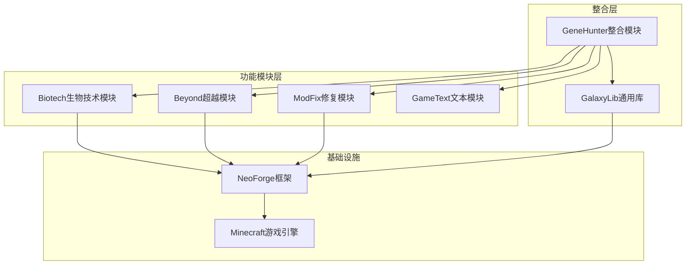
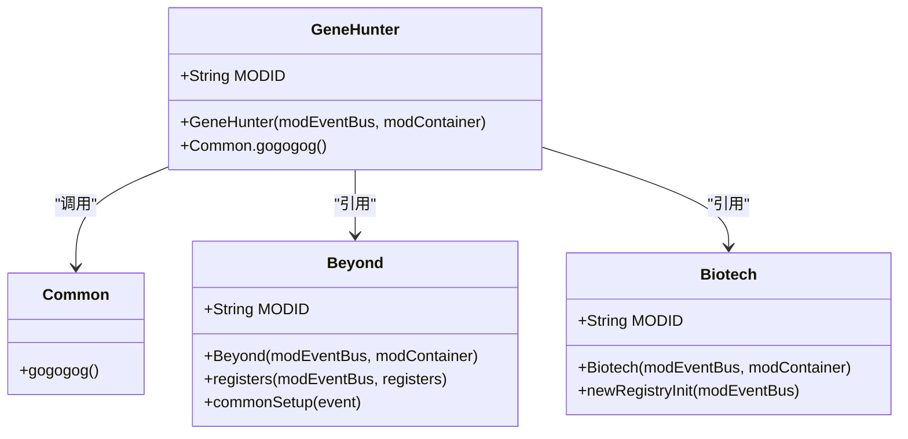
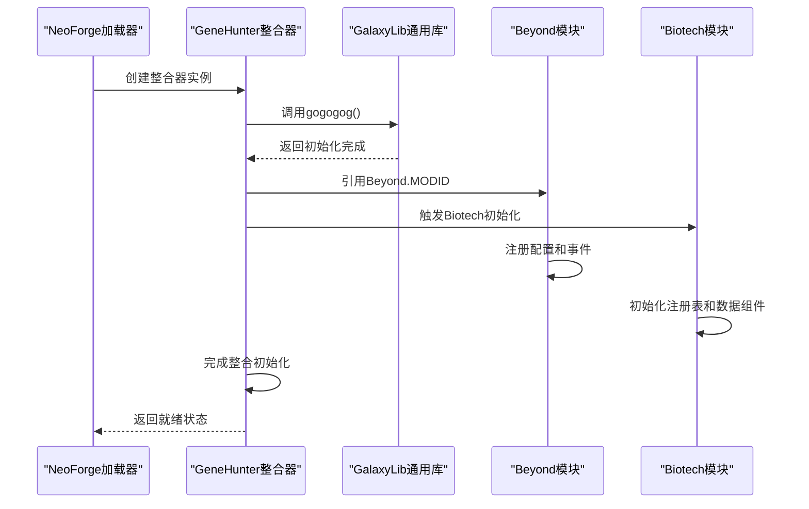
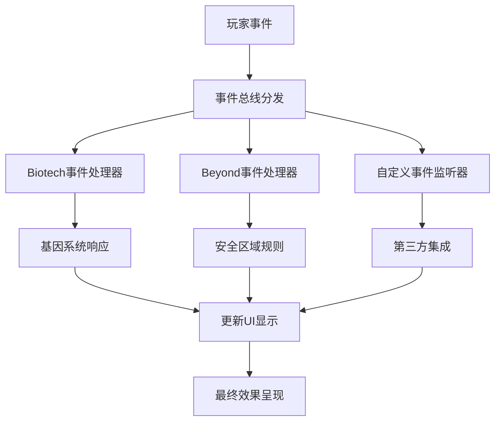
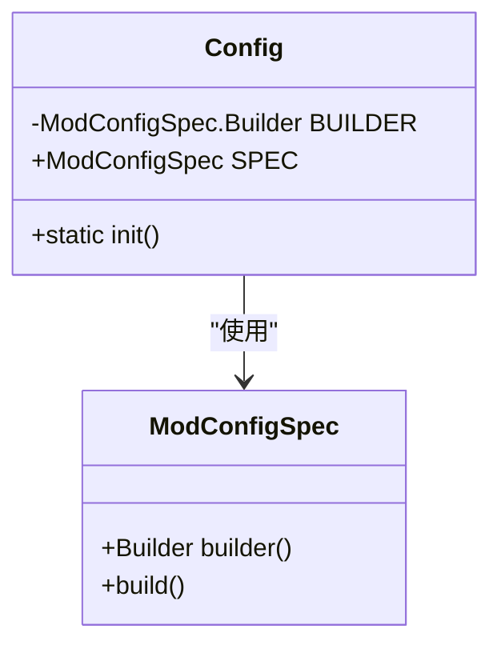
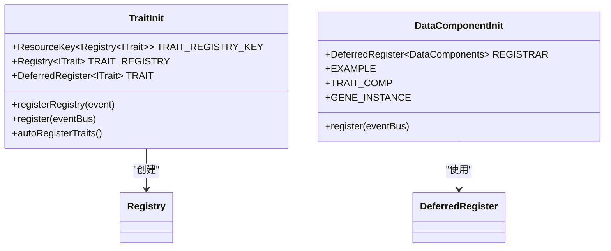
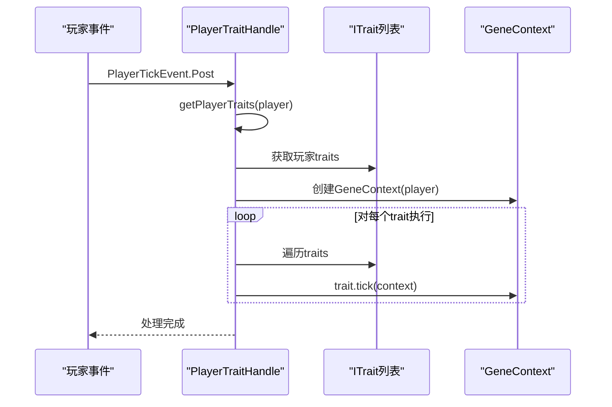
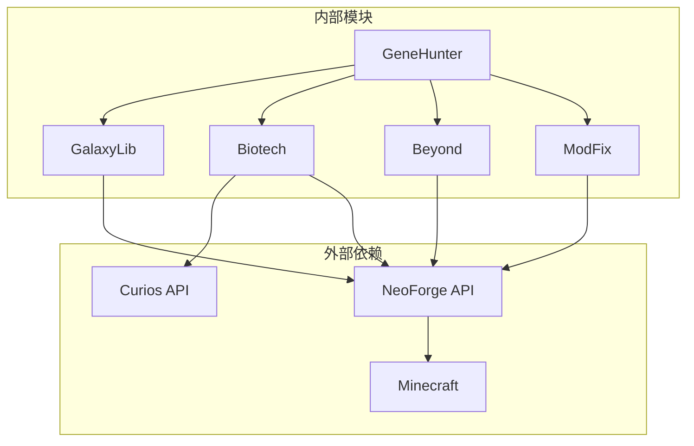

# GeneHunter整合模块

<cite>
**本文档引用的文件**
- [GeneHunter.java](file://GeneHunter/src/main/java/org/galaxy/genehunter/GeneHunter.java)
- [Common.java](file://GalaxyLib/src/main/java/org/galaxy/gene_hunter/Common.java)
- [Beyond.java](file://Beyond/src/main/java/com/pz/beyond/Beyond.java)
- [Config.java](file://Beyond/src/main/java/com/pz/beyond/Config.java)
- [Biotech.java](file://Biotech/src/main/java/org/biotech/Biotech.java)
- [ServerConfig.java](file://Biotech/src/main/java/org/biotech/api/config/ServerConfig.java)
- [neoforge.mods.toml](file://GeneHunter/src/main/templates/META-INF/neoforge.mods.toml)
- [neoforge.mods.toml](file://Beyond/src/main/templates/META-INF/neoforge.mods.toml)
- [neoforge.mods.toml](file://Biotech/src/main/templates/META-INF/neoforge.mods.toml)
- [build.gradle](file://build.gradle)
- [settings.gradle](file://settings.gradle)
- [gradle.properties](file://gradle.properties)
- [TraitInit.java](file://Biotech/src/main/java/org/biotech/api/init/TraitInit.java)
- [DataComponentInit.java](file://Biotech/src/main/java/org/biotech/api/init/DataComponentInit.java)
- [PlayerTraitHandle.java](file://Biotech/src/main/java/org/biotech/api/event/handle/PlayerTraitHandle.java)
- [ModFix.java](file://ModFix/src/main/java/org/galaxy/modfix/ModFix.java)
</cite>

## 目录
1. [简介](#简介)
2. [项目结构](#项目结构)
3. [核心组件](#核心组件)
4. [架构概览](#架构概览)
5. [详细组件分析](#详细组件分析)
6. [依赖分析](#依赖分析)
7. [性能考虑](#性能考虑)
8. [故障排除指南](#故障排除指南)
9. [结论](#结论)

## 简介

GeneHunter整合模块是VerShift模组生态系统中的核心协调器，负责统一管理和调度各个子模块的功能。该模块作为主整合器，承担着以下关键职责：

- **模块初始化协调**：确保各子模块按照正确的顺序进行初始化
- **事件路由管理**：建立跨模块的事件通信机制
- **资源配置统一**：集中管理各模块的配置参数
- **依赖关系处理**：处理模块间的依赖关系和加载顺序
- **扩展点提供**：为新功能模块提供标准化的集成接口

该整合模块在整个模组生态系统中扮演着"总控制器"的角色，通过统一的接口和约定，实现了多个独立功能模块的无缝协作。

## 项目结构

整个项目采用多模块架构设计，每个模块都有明确的职责分工：

**图表来源**
- [settings.gradle:13-18](file://settings.gradle#L13-L18)
- [build.gradle:1-17](file://build.gradle#L1-L17)

**章节来源**
- [settings.gradle:1-19](file://settings.gradle#L1-L19)
- [build.gradle:1-17](file://build.gradle#L1-L17)

## 核心组件

### GeneHunter整合器

GeneHunter整合模块的核心实现位于`GeneHunter.java`文件中，它是一个轻量级的协调器：

**图表来源**
- [GeneHunter.java:10-17](file://GeneHunter/src/main/java/org/galaxy/genehunter/GeneHunter.java#L10-L17)
- [Common.java:3-7](file://GalaxyLib/src/main/java/org/galaxy/gene_hunter/Common.java#L3-L7)
- [Beyond.java:38-78](file://Beyond/src/main/java/com/pz/beyond/Beyond.java#L38-L78)
- [Biotech.java:16-72](file://Biotech/src/main/java/org/biotech/Biotech.java#L16-L72)

### 模块初始化流程

整合模块的启动流程遵循严格的顺序：

1. **系统初始化阶段**
   - GalaxyLib通用库初始化
   - 各功能模块基础设置

2. **配置注册阶段**
   - Beyond模块配置注册
   - Biotech服务器配置注册

3. **注册表初始化阶段**
   - Biotech自定义注册表创建
   - 数据组件注册

4. **事件处理阶段**
   - 事件总线订阅
   - 游戏逻辑初始化

**章节来源**
- [GeneHunter.java:13-17](file://GeneHunter/src/main/java/org/galaxy/genehunter/GeneHunter.java#L13-L17)
- [Beyond.java:46-65](file://Beyond/src/main/java/com/pz/beyond/Beyond.java#L46-L65)
- [Biotech.java:23-39](file://Biotech/src/main/java/org/biotech/Biotech.java#L23-L39)

## 架构概览

### 整体架构设计

**图表来源**
- [GeneHunter.java:13-17](file://GeneHunter/src/main/java/org/galaxy/genehunter/GeneHunter.java#L13-L17)
- [Common.java:5-6](file://GalaxyLib/src/main/java/org/galaxy/gene_hunter/Common.java#L5-L6)
- [Beyond.java:46-65](file://Beyond/src/main/java/com/pz/beyond/Beyond.java#L46-L65)
- [Biotech.java:23-39](file://Biotech/src/main/java/org/biotech/Biotech.java#L23-L39)

### 事件路由机制

整合模块通过事件总线实现模块间的松耦合通信：

**图表来源**
- [PlayerTraitHandle.java:23-36](file://Biotech/src/main/java/org/biotech/api/event/handle/PlayerTraitHandle.java#L23-L36)
- [Beyond.java:25-30](file://Beyond/src/main/java/com/pz/beyond/Beyond.java#L25-L30)

## 详细组件分析

### 配置管理系统

#### Beyond模块配置

Beyond模块提供了基础的配置支持，通过`Config.java`实现：

**图表来源**
- [Config.java:6-19](file://Beyond/src/main/java/com/pz/beyond/Config.java#L6-L19)

#### Biotech服务器配置

Biotech模块实现了更复杂的配置管理：

| 配置项 | 类型 | 默认值 | 范围 | 描述 |
|--------|------|--------|------|------|
| uncommon_gene_trait_roll_count | Double | 1.1 | 0.0-100.0 | 普通基因词条投掷倍数 |
| rare_gene_trait_roll_count | Double | 1.5 | 0.0-100.0 | 稀有基因词条投掷倍数 |
| epic_gene_trait_roll_count | Double | 2.1 | 0.0-100.0 | 史诗基因词条投掷倍数 |

**章节来源**
- [ServerConfig.java:11-47](file://Biotech/src/main/java/org/biotech/api/config/ServerConfig.java#L11-L47)

### 模块注册机制

#### 自定义注册表系统

Biotech模块实现了灵活的注册表系统：

**图表来源**
- [TraitInit.java:19-79](file://Biotech/src/main/java/org/biotech/api/init/TraitInit.java#L19-L79)
- [DataComponentInit.java:14-46](file://Biotech/src/main/java/org/biotech/api/init/DataComponentInit.java#L14-L46)

**章节来源**
- [TraitInit.java:20-28](file://Biotech/src/main/java/org/biotech/api/init/TraitInit.java#L20-L28)
- [DataComponentInit.java:16-44](file://Biotech/src/main/java/org/biotech/api/init/DataComponentInit.java#L16-L44)

### 事件处理系统

#### 玩家属性事件处理

Biotech模块通过`PlayerTraitHandle`实现玩家属性的动态管理：

**图表来源**
- [PlayerTraitHandle.java:26-34](file://Biotech/src/main/java/org/biotech/api/event/handle/PlayerTraitHandle.java#L26-L34)

**章节来源**
- [PlayerTraitHandle.java:23-36](file://Biotech/src/main/java/org/biotech/api/event/handle/PlayerTraitHandle.java#L23-L36)

## 依赖分析

### 模块依赖关系

**图表来源**
- [neoforge.mods.toml:12-18](file://GeneHunter/src/main/templates/META-INF/neoforge.mods.toml#L12-L18)
- [neoforge.mods.toml:49-73](file://Beyond/src/main/templates/META-INF/neoforge.mods.toml#L49-L73)
- [neoforge.mods.toml:49-73](file://Biotech/src/main/templates/META-INF/neoforge.mods.toml#L49-L73)

### 构建配置分析

项目使用Gradle进行多模块构建管理：

| 组件 | 版本 | 用途 |
|------|------|------|
| Minecraft | 1.21.1 | 游戏基座版本 |
| NeoForge | 21.1.223 | 模组开发框架 |
| Parchment | 2024.11.13 | 文档映射 |
| Curios | 9.5.1+1.21.1 | 饰品系统API |

**章节来源**
- [gradle.properties:9-21](file://gradle.properties#L9-L21)
- [build.gradle:9-15](file://build.gradle#L9-L15)

## 性能考虑

### 初始化优化策略

1. **延迟初始化**：非关键功能采用按需初始化
2. **并行注册**：利用事件总线的并行特性加速注册过程
3. **缓存机制**：对频繁访问的数据进行缓存
4. **内存管理**：及时释放不再使用的资源

### 事件处理优化

- 使用高效的事件过滤机制
- 避免在事件处理中进行重型计算
- 实现事件批处理以减少开销

## 故障排除指南

### 常见问题及解决方案

#### 模块加载失败

**症状**：游戏启动时报错，提示模块无法加载

**排查步骤**：
1. 检查`neoforge.mods.toml`文件的依赖声明
2. 验证模块ID是否正确
3. 确认版本范围兼容性

**解决方法**：
- 更新到兼容的NeoForge版本
- 检查依赖模块的加载顺序
- 验证配置文件格式

#### 事件处理异常

**症状**：某些功能不工作或出现异常行为

**排查步骤**：
1. 检查事件订阅是否正确注册
2. 验证事件处理器的可见性
3. 确认事件类型匹配

**解决方法**：
- 重新注册事件处理器
- 检查事件优先级设置
- 添加适当的错误处理

#### 配置问题

**症状**：配置项无效或默认值被使用

**排查步骤**：
1. 检查配置文件是否存在
2. 验证配置项名称拼写
3. 确认配置值在有效范围内

**解决方法**：
- 重新生成配置文件
- 使用正确的配置格式
- 检查配置文件权限

**章节来源**
- [neoforge.mods.toml:1-80](file://Beyond/src/main/templates/META-INF/neoforge.mods.toml#L1-L80)
- [neoforge.mods.toml:1-80](file://Biotech/src/main/templates/META-INF/neoforge.mods.toml#L1-L80)

## 结论

GeneHunter整合模块作为VerShift模组生态系统的核心，成功实现了以下目标：

### 主要成就

1. **统一协调**：通过轻量级设计实现了多个复杂模块的有效协调
2. **扩展性强**：提供了清晰的扩展点，便于添加新功能模块
3. **稳定性高**：通过严格的初始化顺序和事件路由机制确保系统稳定
4. **性能优化**：采用多种优化策略提升整体运行效率

### 设计优势

- **模块化架构**：每个子模块职责明确，便于维护和测试
- **事件驱动**：基于事件总线的松耦合通信机制
- **配置管理**：完善的配置系统支持运行时调整
- **错误处理**：健壮的错误处理和恢复机制

### 未来发展方向

1. **监控系统**：添加模块健康检查和性能监控
2. **热重载支持**：实现部分功能的热重载能力
3. **插件扩展**：进一步开放扩展接口
4. **文档完善**：补充详细的开发者文档和API参考

该整合模块为整个模组生态系统奠定了坚实的基础，通过其精心设计的架构和实现，为玩家提供了丰富而稳定的模组体验。