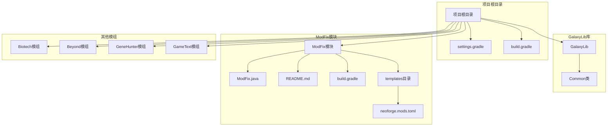
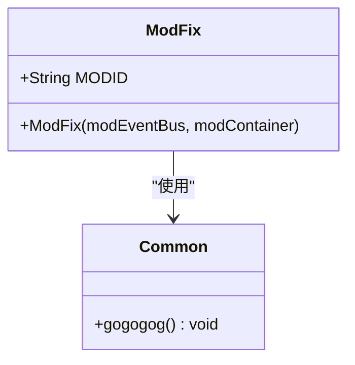
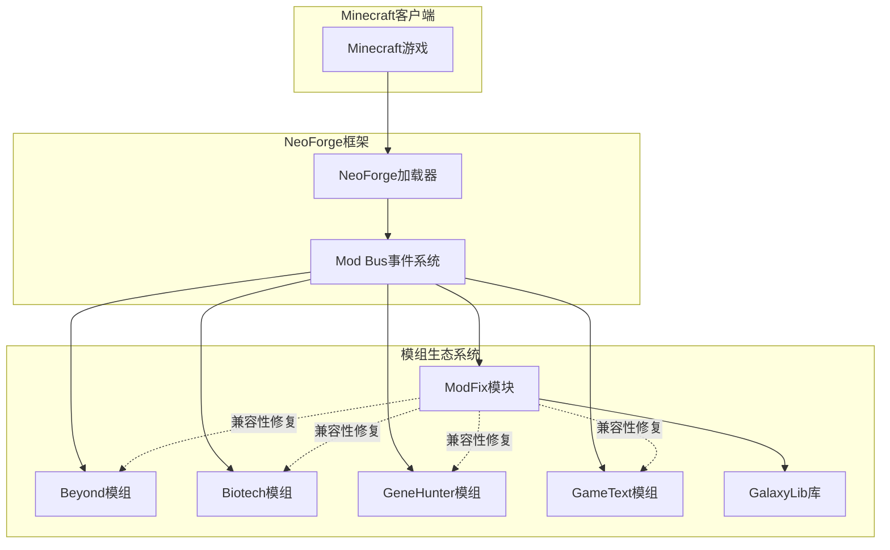
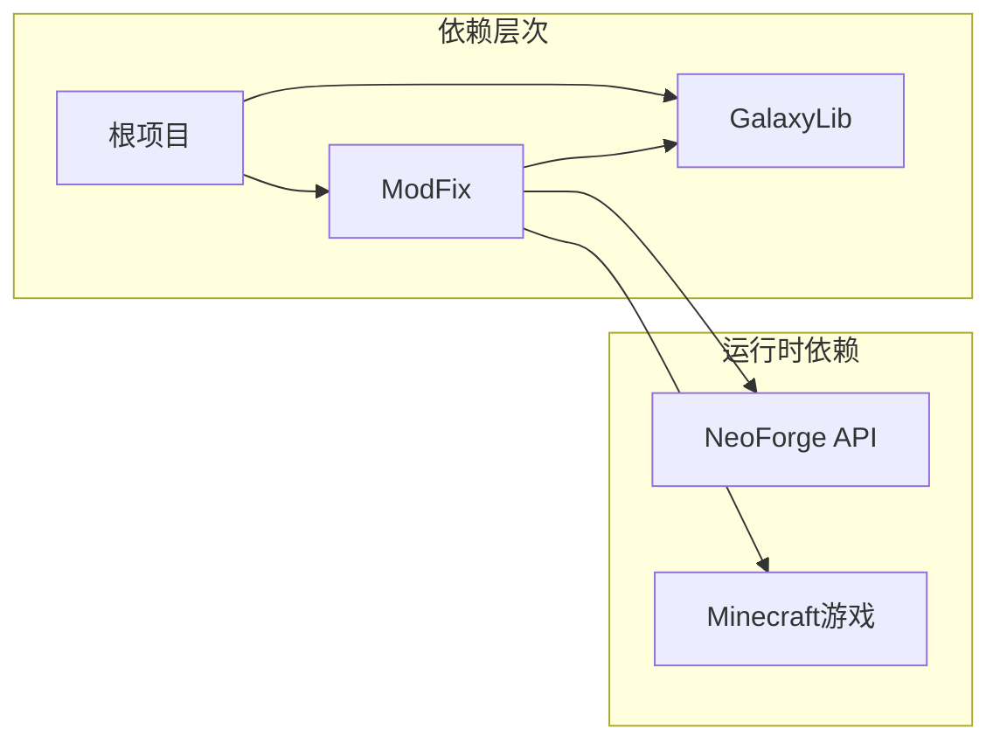
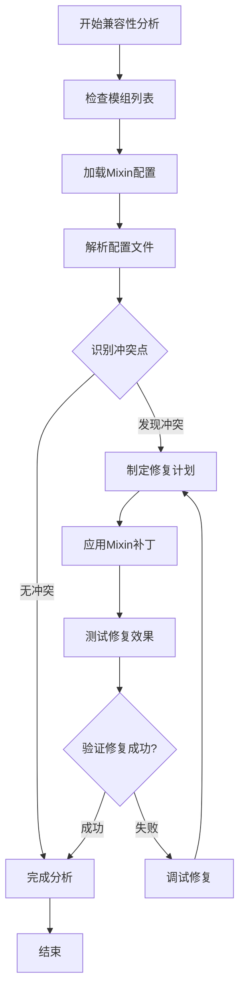
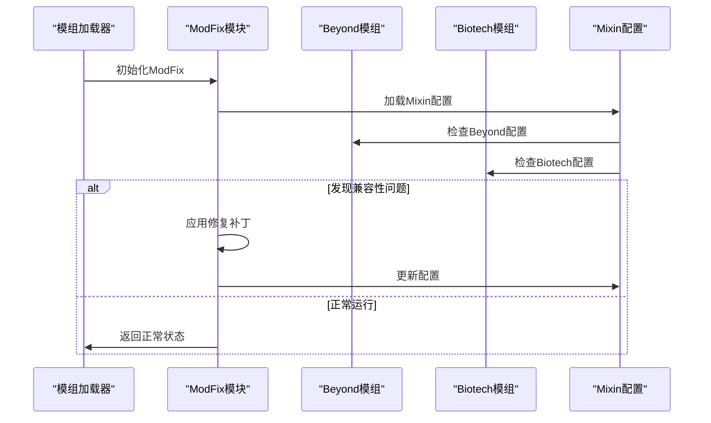
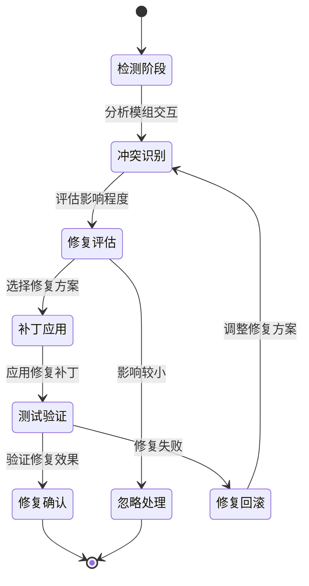
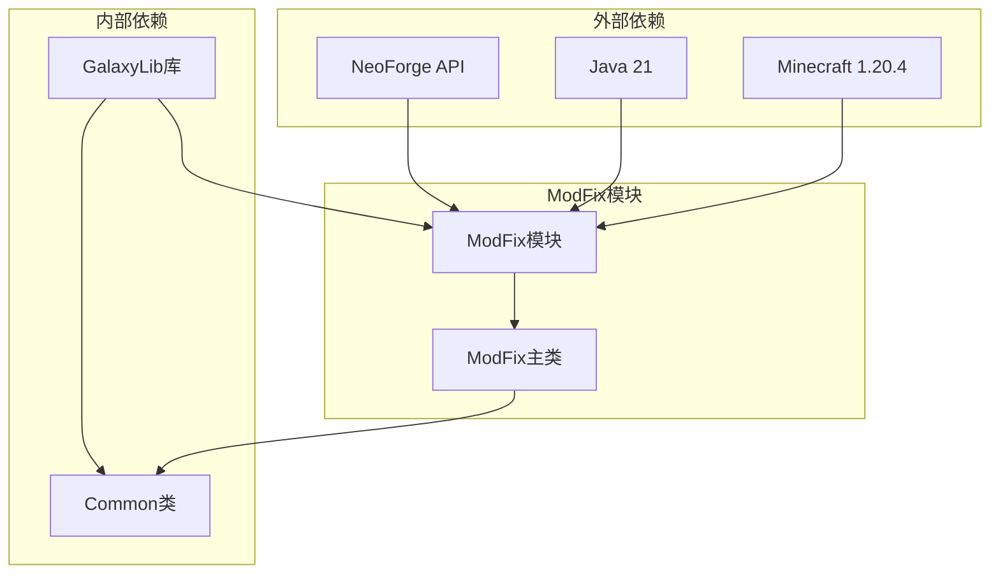
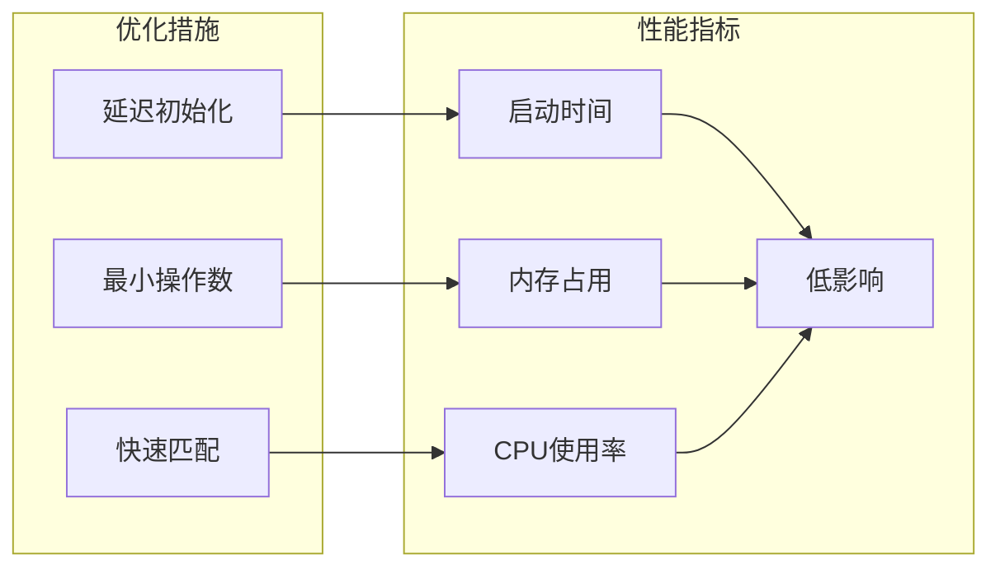
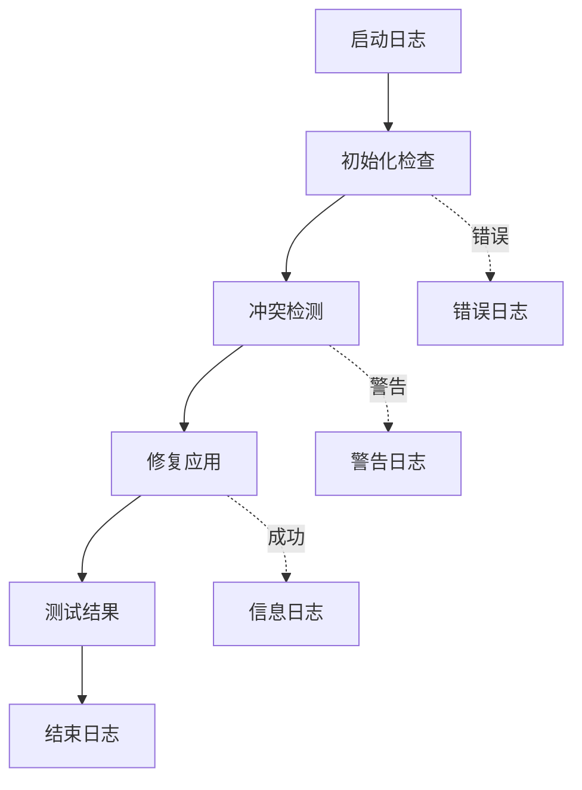

# ModFix兼容性修复模块

<cite>
**本文档引用的文件**
- [ModFix.java](file://ModFix/src/main/java/org/galaxy/modfix/ModFix.java)
- [README.md](file://ModFix/README.md)
- [build.gradle](file://ModFix/build.gradle)
- [neoforge.mods.toml](file://ModFix/src/main/templates/META-INF/neoforge.mods.toml)
- [beyond.mixins.json](file://Beyond/src/main/resources/beyond.mixins.json)
- [biotech.mixins.json](file://Biotech/src/main/resources/biotech.mixins.json)
- [Common.java](file://GalaxyLib/src/main/java/org/galaxy/gene_hunter/Common.java)
- [settings.gradle](file://settings.gradle)
- [build.gradle](file://build.gradle)
</cite>

## 目录
1. [简介](#简介)
2. [项目结构](#项目结构)
3. [核心组件](#核心组件)
4. [架构概览](#架构概览)
5. [详细组件分析](#详细组件分析)
6. [依赖关系分析](#依赖关系分析)
7. [性能考虑](#性能考虑)
8. [故障排除指南](#故障排除指南)
9. [结论](#结论)
10. [附录](#附录)

## 简介

ModFix是一个专门设计用于处理模组间兼容性问题的独立修复模块。该模块的核心目标是提供定向的Mixin补丁和行为修复，确保在复杂的模组生态系统中各个模组能够和谐共存。

### 设计目的

ModFix模块的设计目的是：
- **兼容性修复**：解决与其他模组的冲突问题
- **行为补丁**：提供针对性的功能修复
- **Mixin管理**：统一管理Mixin补丁的应用和冲突处理
- **稳定性保障**：确保模组生态系统的整体稳定性

### 兼容性修复策略

该模块采用以下策略来处理兼容性问题：

1. **定向修复原则**：仅包含修复性质的代码，避免引入新的游戏玩法
2. **最小化影响**：每个补丁都明确标注修复目标和影响范围
3. **模块化设计**：独立的修复模块，便于维护和更新
4. **向后兼容**：确保修复不会破坏现有功能

## 项目结构

ModFix模块采用标准的Gradle多模块项目结构，位于主项目的子目录中。

**图表来源**
- [settings.gradle:1-19](file://settings.gradle#L1-L19)
- [build.gradle:1-17](file://build.gradle#L1-L17)

**章节来源**
- [settings.gradle:1-19](file://settings.gradle#L1-L19)
- [build.gradle:1-17](file://build.gradle#L1-L17)

## 核心组件

### ModFix主类

ModFix模块的核心入口点是一个简单的注解类，负责初始化和集成到NeoForge框架中。

**图表来源**
- [ModFix.java:1-17](file://ModFix/src/main/java/org/galaxy/modfix/ModFix.java#L1-L17)
- [Common.java:1-9](file://GalaxyLib/src/main/java/org/galaxy/gene_hunter/Common.java#L1-L9)

### 构建配置

ModFix模块使用Gradle进行构建管理，配置了完整的开发环境和发布流程。

**章节来源**
- [ModFix.java:1-17](file://ModFix/src/main/java/org/galaxy/modfix/ModFix.java#L1-L17)
- [README.md:1-11](file://ModFix/README.md#L1-L11)

## 架构概览

ModFix模块在整个模组生态系统中的位置和作用如下：

**图表来源**
- [neoforge.mods.toml:1-26](file://ModFix/src/main/templates/META-INF/neoforge.mods.toml#L1-L26)
- [settings.gradle:13-18](file://settings.gradle#L13-L18)

### 模块间依赖关系

**图表来源**
- [build.gradle:68-72](file://ModFix/build.gradle#L68-L72)
- [neoforge.mods.toml:12-24](file://ModFix/src/main/templates/META-INF/neoforge.mods.toml#L12-L24)

## 详细组件分析

### 兼容性问题识别机制

ModFix模块通过以下方式识别和处理兼容性问题：

#### 1. Mixin配置分析

每个相关模组都有独立的Mixin配置文件，用于定义补丁包和兼容性设置：

**图表来源**
- [beyond.mixins.json:1-17](file://Beyond/src/main/resources/beyond.mixins.json#L1-L17)
- [biotech.mixins.json:1-17](file://Biotech/src/main/resources/biotech.mixins.json#L1-L17)

#### 2. 冲突检测流程

**图表来源**
- [ModFix.java:12-14](file://ModFix/src/main/java/org/galaxy/modfix/ModFix.java#L12-L14)

### 兼容性修复实施细节

#### 1. Mixin补丁应用策略

ModFix模块采用渐进式补丁应用策略：

| 策略类型 | 实施方式 | 适用场景 |
|---------|---------|---------|
| 预防性修复 | 在模组加载前应用补丁 | 已知的潜在冲突 |
| 响应式修复 | 捕获错误后动态修复 | 未预见的兼容性问题 |
| 主动修复 | 定期扫描和修复 | 长期维护需求 |

#### 2. 冲突处理机制

**图表来源**
- [README.md:7-10](file://ModFix/README.md#L7-L10)

**章节来源**
- [README.md:1-11](file://ModFix/README.md#L1-L11)

## 依赖关系分析

### 外部依赖关系

ModFix模块的依赖关系相对简单，主要依赖于NeoForge框架和GalaxyLib库：

**图表来源**
- [build.gradle:68-72](file://ModFix/build.gradle#L68-L72)
- [neoforge.mods.toml:12-24](file://ModFix/src/main/templates/META-INF/neoforge.mods.toml#L12-L24)

### 模块间耦合度分析

| 组件 | 耦合度 | 说明 |
|-----|-------|------|
| ModFix主类 | 低 | 仅依赖Common类 |
| Common类 | 低 | 独立的工具类 |
| 构建脚本 | 中等 | 依赖多个外部仓库 |
| Mixin配置 | 低 | 纯配置文件，无代码依赖 |

**章节来源**
- [build.gradle:68-72](file://ModFix/build.gradle#L68-L72)
- [Common.java:1-9](file://GalaxyLib/src/main/java/org/galaxy/gene_hunter/Common.java#L1-L9)

## 性能考虑

### 启动性能优化

ModFix模块在设计时充分考虑了启动性能：

1. **延迟初始化**：只在需要时才加载修复逻辑
2. **最小化内存占用**：避免不必要的对象创建
3. **高效的冲突检测**：使用快速匹配算法识别兼容性问题

### 运行时性能影响

## 故障排除指南

### 常见兼容性问题及解决方案

#### 1. Mixin加载失败

**问题症状**：
- 启动时出现Mixin相关错误
- 模组无法正常加载

**诊断步骤**：
1. 检查Mixin配置文件格式
2. 验证目标类是否存在
3. 确认方法签名匹配

**解决方案**：
- 更新Mixin版本要求
- 调整包路径配置
- 检查依赖版本兼容性

#### 2. 功能冲突

**问题症状**：
- 特定功能无法正常工作
- 游戏出现异常行为

**诊断步骤**：
1. 确定冲突的具体功能
2. 检查相关模组的版本
3. 分析冲突发生的时间点

**解决方案**：
- 应用针对性的修复补丁
- 调整模组加载顺序
- 修改配置参数

### 调试工具和方法

#### 1. 日志分析

ModFix模块提供了基本的日志输出功能：

#### 2. 性能监控

建议使用以下工具监控ModFix模块的性能表现：
- Minecraft内置性能监控
- NeoForge调试工具
- 第三方性能分析工具

**章节来源**
- [ModFix.java:12-14](file://ModFix/src/main/java/org/galaxy/modfix/ModFix.java#L12-L14)

## 结论

ModFix兼容性修复模块为复杂的模组生态系统提供了一个重要的稳定性和兼容性保障。通过采用定向修复策略、严格的代码审查流程和完善的测试机制，该模块有效地解决了模组间的兼容性冲突问题。

### 主要优势

1. **模块化设计**：独立的修复模块便于维护和更新
2. **精确修复**：针对具体问题提供精确的修复方案
3. **低影响**：最小化对原生功能的影响
4. **可维护性**：清晰的代码结构和文档支持长期维护

### 未来发展方向

1. **自动化测试**：建立更完善的自动化测试框架
2. **智能检测**：开发更智能的兼容性问题自动检测机制
3. **社区协作**：加强与其他模组开发者的协作
4. **文档完善**：持续改进文档质量和维护频率

## 附录

### 最佳实践指南

#### 1. 添加新的兼容性修复

**步骤1：问题识别**
- 确定具体的兼容性问题
- 收集相关日志和错误信息
- 分析问题的根本原因

**步骤2：修复设计**
- 制定最小可行的修复方案
- 评估修复的影响范围
- 准备回滚计划

**步骤3：实施和测试**
- 编写修复代码或配置
- 进行单元测试
- 进行集成测试

**步骤4：部署和监控**
- 更新版本号
- 发布修复版本
- 监控修复效果

#### 2. 维护现有修复

**定期检查**：
- 版本升级后的兼容性测试
- 用户反馈的问题收集
- 性能影响的持续监控

**文档更新**：
- 修复历史记录
- 影响范围说明
- 使用注意事项

#### 3. 兼容性测试方法

**测试环境准备**：
- 多版本Minecraft测试
- 不同模组组合测试
- 性能基准测试

**测试用例设计**：
- 基础功能测试
- 边界条件测试
- 回归测试

**自动化测试**：
- CI/CD集成
- 自动化回归测试
- 性能回归检测