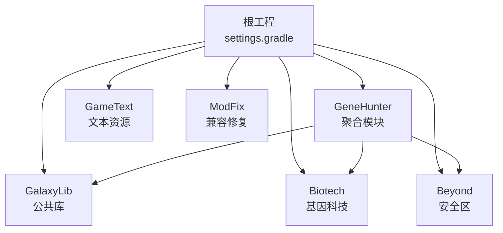
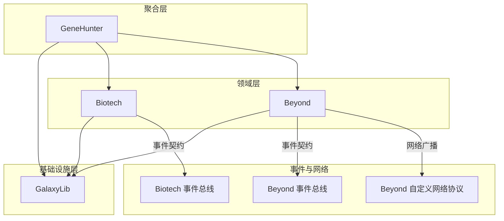
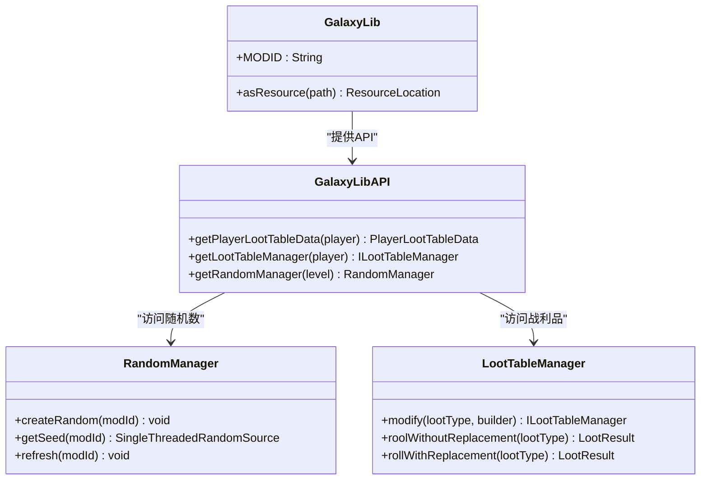
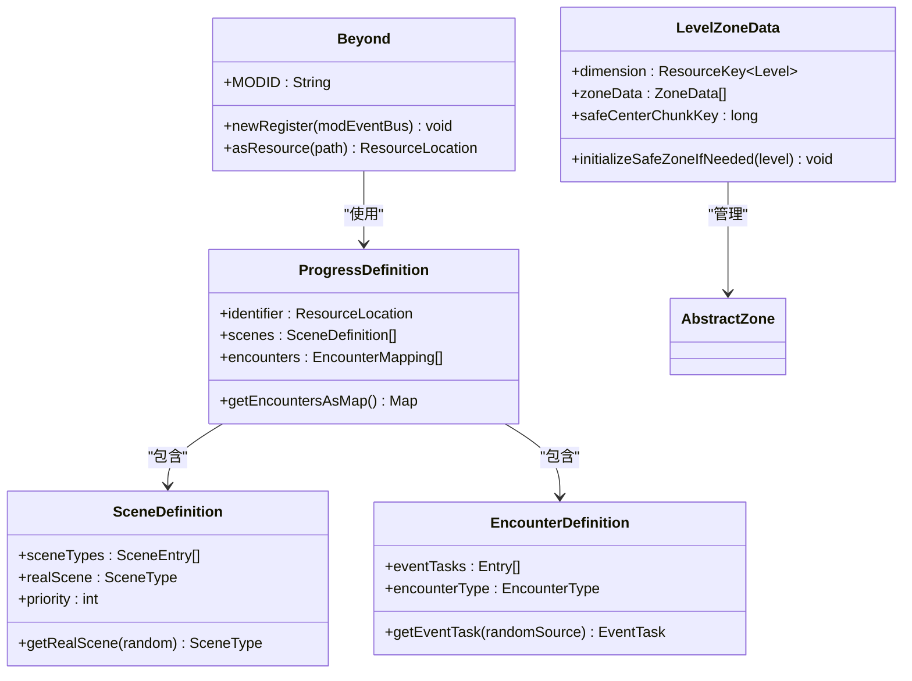
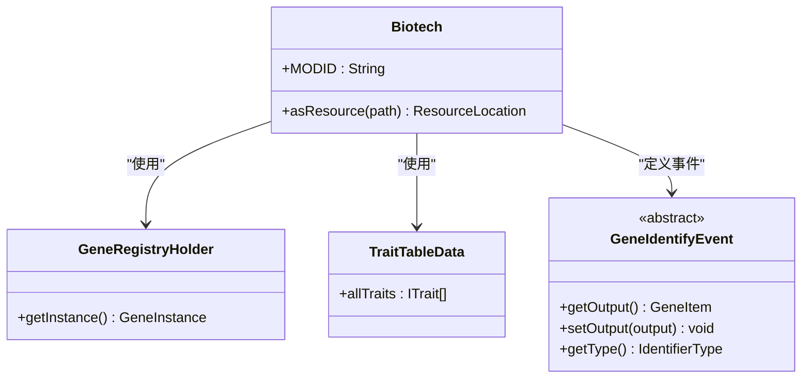
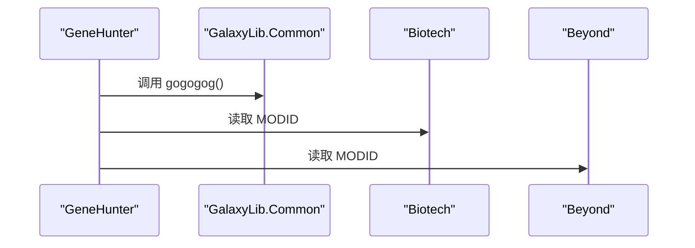
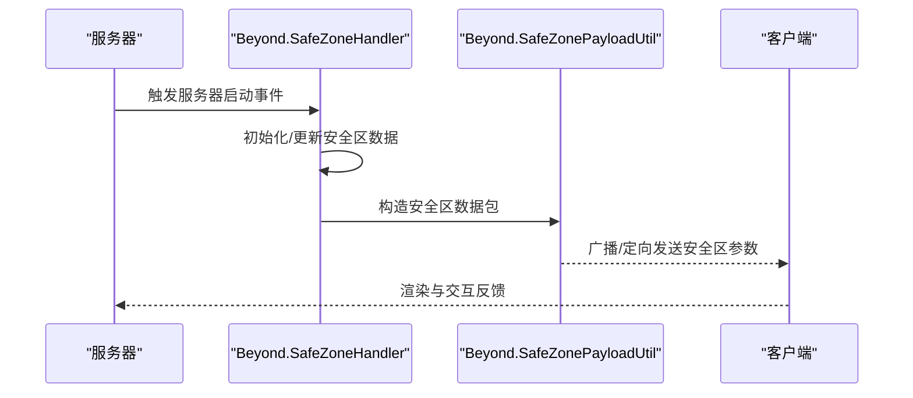
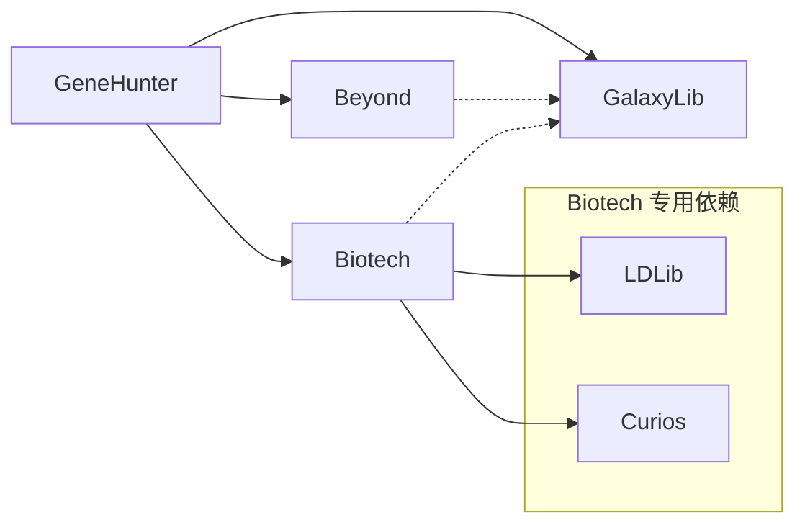

# 模块架构

<cite>
**本文档引用的文件**
- [Beyond.java](file://Beyond/src/main/java/com/pz/beyond/Beyond.java)
- [BeyondAPI.java](file://Beyond/src/main/java/com/pz/beyond/api/BeyondAPI.java)
- [EncounterDefinition.java](file://Beyond/src/main/java/com/pz/beyond/api/system/definition/EncounterDefinition.java)
- [EventTask.java](file://Beyond/src/main/java/com/pz/beyond/api/system/definition/EventTask.java)
- [ProgressDefinition.java](file://Beyond/src/main/java/com/pz/beyond/api/system/definition/ProgressDefinition.java)
- [SceneDefinition.java](file://Beyond/src/main/java/com/pz/beyond/api/system/definition/SceneDefinition.java)
- [AbstractZone.java](file://Beyond/src/main/java/com/pz/beyond/api/system/zone/AbstractZone.java)
- [LevelZoneData.java](file://Beyond/src/main/java/com/pz/beyond/api/system/zone/LevelZoneData.java)
- [ProgressManager.java](file://Beyond/src/main/java/com/pz/beyond/api/system/progress/ProgressManager.java)
- [chapter1.json](file://Beyond/src/main/resources/data/beyond/progress/chapter1.json)
- [GalaxyLib.java](file://GalaxyLib/src/main/java/org/galaxylib/GalaxyLib.java)
- [GalaxyLibAPI.java](file://GalaxyLib/src/main/java/org/galaxylib/api/GalaxyLibAPI.java)
- [RandomManager.java](file://GalaxyLib/src/main/java/org/galaxylib/api/system/random/RandomManager.java)
- [LootTableManager.java](file://GalaxyLib/src/main/java/org/galaxylib/api/system/loot/LootTableManager.java)
- [settings.gradle](file://settings.gradle)
- [build.gradle](file://build.gradle)
- [Beyond/build.gradle](file://Beyond/build.gradle)
- [GalaxyLib/build.gradle](file://GalaxyLib/build.gradle)
- [Biotech/build.gradle](file://Biotech/build.gradle)
- [GeneHunter/build.gradle](file://GeneHunter/build.gradle)
</cite>

## 更新摘要
**所做更改**
- 新增Beyond模块完整数据定义框架的详细分析
- 更新GalaxyLib集成模块化架构说明
- 增强配置驱动系统的架构描述
- 补充构建配置的现代化说明
- 完善模块间通信机制的技术细节

## 目录
1. [引言](#引言)
2. [项目结构](#项目结构)
3. [核心组件](#核心组件)
4. [架构总览](#架构总览)
5. [详细组件分析](#详细组件分析)
6. [依赖分析](#依赖分析)
7. [性能考虑](#性能考虑)
8. [故障排查指南](#故障排查指南)
9. [结论](#结论)
10. [附录](#附录)

## 引言
本文件系统性梳理本项目的模块化架构，重点阐述以下模块的设计理念、职责边界与交互方式：
- GalaxyLib 公共库模块：提供跨模块通用能力与工具类，作为基础支撑层。
- Biotech 基因科技模块：负责基因、词条、战利品等系统的注册、运行时管理与事件处理。
- Beyond 安全区模块：负责安全区规则、玩家状态事件、网络数据包与渲染等。
- GeneHunter 整合模块：作为聚合入口，统一加载 GalaxyLib、Biotech、Beyond，并进行模块间协同。

通过事件总线、自定义网络协议与注册器模式，各模块实现松耦合协作；同时以 Gradle 多模块工程组织，确保构建与发布清晰可控。

## 项目结构
项目采用 Gradle 多模块工程，根目录包含模块清单与全局插件配置，各子模块拥有独立的构建脚本与源码树。

**图表来源**
- [settings.gradle:13-19](file://settings.gradle#L13-L19)
- [build.gradle:1-4](file://build.gradle#L1-L4)

**章节来源**
- [settings.gradle:1-19](file://settings.gradle#L1-L19)
- [build.gradle:1-4](file://build.gradle#L1-L4)

## 核心组件
- GalaxyLib（公共库）
  - 提供通用工具与静态方法，作为其他模块的基础能力来源。
  - 在 GeneHunter 中被显式依赖，用于初始化与跨模块调用。
- Biotech（基因科技）
  - 通过事件总线与注册器完成系统初始化、注册与运行时逻辑。
  - 提供基因、词条、战利品等领域的数据模型与事件契约。
- Beyond（安全区）
  - 以事件驱动的方式处理服务器生命周期、玩家登录、怪物生成等场景。
  - 通过自定义网络协议向客户端广播安全区参数，支持渲染与交互。
- GeneHunter（整合）
  - 作为聚合入口，依赖 GalaxyLib、Biotech、Beyond，协调模块加载顺序与运行时行为。

**章节来源**
- [GalaxyLib.java:19-26](file://GalaxyLib/src/main/java/org/galaxylib/GalaxyLib.java#L19-L26)
- [Biotech.java:16-73](file://Biotech/src/main/java/org/biotech/Biotech.java#L16-L73)
- [Beyond.java:24-48](file://Beyond/src/main/java/com/pz/beyond/Beyond.java#L24-L48)
- [GeneHunter.java:10-21](file://GeneHunter/src/main/java/org/galaxy/genehunter/GeneHunter.java#L10-L21)

## 架构总览
模块间通过事件总线与自定义网络协议进行松耦合通信；Biotech 与 Beyond 分别承担"系统域"和"区域域"的职责；GeneHunter 作为聚合层统一装配。

**图表来源**
- [GeneHunter/build.gradle:71-75](file://GeneHunter/build.gradle#L71-L75)
- [Biotech/build.gradle:74-85](file://Biotech/build.gradle#L74-L85)
- [Beyond/build.gradle:64-67](file://Beyond/build.gradle#L64-L67)

## 详细组件分析

### GalaxyLib（公共库模块）
- 设计理念
  - 作为跨模块共享的"最小可用库"，提供稳定且低耦合的通用能力。
  - 不引入第三方依赖，避免污染其他模块的依赖树。
- 职责分工
  - 提供静态工具方法与通用常量，供 GeneHunter 等上层模块调用。
  - 实现随机数管理与战利品系统的核心接口。
- 接口设计
  - 以简单类与静态方法为主，便于直接调用与测试。
  - 提供统一的 API 访问入口，简化模块间调用。
- 与其他模块的关系
  - GeneHunter 直接依赖 GalaxyLib；Biotech 通过公共库间接受益于其稳定性。

**图表来源**
- [GalaxyLib.java:29-31](file://GalaxyLib/src/main/java/org/galaxylib/GalaxyLib.java#L29-L31)
- [GalaxyLibAPI.java:11-24](file://GalaxyLib/src/main/java/org/galaxylib/api/GalaxyLibAPI.java#L11-L24)
- [RandomManager.java:79-104](file://GalaxyLib/src/main/java/org/galaxylib/api/system/random/RandomManager.java#L79-L104)
- [LootTableManager.java:42-157](file://GalaxyLib/src/main/java/org/galaxylib/api/system/loot/LootTableManager.java#L42-L157)

**章节来源**
- [GalaxyLib.java:14-32](file://GalaxyLib/src/main/java/org/galaxylib/GalaxyLib.java#L14-L32)
- [GalaxyLibAPI.java:1-25](file://GalaxyLib/src/main/java/org/galaxylib/api/GalaxyLibAPI.java#L1-L25)
- [RandomManager.java:1-108](file://GalaxyLib/src/main/java/org/galaxylib/api/system/random/RandomManager.java#L1-L108)
- [LootTableManager.java:1-211](file://GalaxyLib/src/main/java/org/galaxylib/api/system/loot/LootTableManager.java#L1-L211)

### Beyond（安全区模块）
- 设计理念
  - 将"安全区规则"抽象为可插拔的监听器，通过注解标记规则实现类，实现规则的动态发现与执行。
  - 通过事件总线响应服务器生命周期与玩家事件，保证逻辑与平台事件解耦。
  - 采用配置驱动的数据定义框架，支持 JSON 配置文件驱动的游戏进度。
- 职责分工
  - 管理安全区数据与规则，处理服务器启动、玩家登录、怪物生成等事件。
  - 通过自定义网络协议向客户端同步安全区参数，支持客户端渲染与交互。
  - 实现完整的数据定义框架，包括遭遇、场景、进度等核心概念。
- 接口设计
  - 规则接口与注解用于声明式注册规则。
  - 自定义网络协议封装安全区参数，提供序列化与广播能力。
  - 数据定义类提供完整的编码/解码支持，确保跨模块数据一致性。
- 与其他模块的关系
  - 与 Biotech 无直接依赖，但可通过事件总线与通用配置进行协作。
  - 与 GalaxyLib 无直接依赖，但可复用其通用能力。

**图表来源**
- [Beyond.java:36-48](file://Beyond/src/main/java/com/pz/beyond/Beyond.java#L36-L48)
- [ProgressDefinition.java:26-89](file://Beyond/src/main/java/com/pz/beyond/api/system/definition/ProgressDefinition.java#L26-L89)
- [SceneDefinition.java:23-129](file://Beyond/src/main/java/com/pz/beyond/api/system/definition/SceneDefinition.java#L23-L129)
- [EncounterDefinition.java:23-104](file://Beyond/src/main/java/com/pz/beyond/api/system/definition/EncounterDefinition.java#L23-L104)
- [LevelZoneData.java:31-309](file://Beyond/src/main/java/com/pz/beyond/api/system/zone/LevelZoneData.java#L31-L309)

**章节来源**
- [Beyond.java:18-56](file://Beyond/src/main/java/com/pz/beyond/Beyond.java#L18-L56)
- [ProgressDefinition.java:1-89](file://Beyond/src/main/java/com/pz/beyond/api/system/definition/ProgressDefinition.java#L1-L89)
- [SceneDefinition.java:1-129](file://Beyond/src/main/java/com/pz/beyond/api/system/definition/SceneDefinition.java#L1-L129)
- [EncounterDefinition.java:1-104](file://Beyond/src/main/java/com/pz/beyond/api/system/definition/EncounterDefinition.java#L1-L104)
- [LevelZoneData.java:1-309](file://Beyond/src/main/java/com/pz/beyond/api/system/zone/LevelZoneData.java#L1-L309)

### Biotech（基因科技模块）
- 设计理念
  - 以注册器模式与事件总线为核心，将基因、词条、战利品等系统解耦为可插拔组件。
  - 通过数据组件与配置分离，提升可扩展性与可维护性。
- 职责分工
  - 初始化注册器、菜单、属性、附件、数据组件等。
  - 提供基因识别、词条表、战利品表等领域的事件与数据模型。
- 接口设计
  - 使用接口与抽象类定义领域契约（如基因、词条、战利品），便于扩展与替换。
  - 通过事件类暴露运行时钩子（如基因识别事件）。
- 与其他模块的关系
  - 与 GalaxyLib 无直接依赖，但可复用其通用能力。
  - 与 Beyond 的交互通过事件总线与通用配置进行。

**图表来源**
- [Biotech.java:17-43](file://Biotech/src/main/java/org/biotech/Biotech.java#L17-L43)
- [GeneRegistryHolder.java:10-24](file://Biotech/src/main/java/org/biotech/api/system/gene/GeneRegistryHolder.java#L10-L24)
- [TraitTableData.java:18-44](file://Biotech/src/main/java/org/biotech/api/system/trait/TraitTableData.java#L18-L44)
- [GeneIdentifyEvent.java:16-107](file://Biotech/src/main/java/org/biotech/api/event/custom/GeneIdentifyEvent.java#L16-L107)

**章节来源**
- [Biotech.java:16-73](file://Biotech/src/main/java/org/biotech/Biotech.java#L16-L73)
- [GeneRegistryHolder.java:1-25](file://Biotech/src/main/java/org/biotech/api/system/gene/GeneRegistryHolder.java#L1-L25)
- [TraitTableData.java:1-45](file://Biotech/src/main/java/org/biotech/api/system/trait/TraitTableData.java#L1-L45)
- [GeneIdentifyEvent.java:1-108](file://Biotech/src/main/java/org/biotech/api/event/custom/GeneIdentifyEvent.java#L1-L108)

### GeneHunter（整合模块）
- 设计理念
  - 作为聚合入口，统一装配 GalaxyLib、Biotech、Beyond，确保加载顺序与运行时行为一致。
  - 通过直接依赖实现对公共库与子模块的集中管理。
- 职责分工
  - 在构造函数中调用公共库方法，读取各子模块的标识符，作为整合层的初始化步骤。
- 与其他模块的关系
  - 依赖 GalaxyLib、Biotech、Beyond，形成"聚合-基础-领域"的层次结构。

**图表来源**
- [GeneHunter.java:14-18](file://GeneHunter/src/main/java/org/galaxy/genehunter/GeneHunter.java#L14-L18)
- [Common.java:5-7](file://GalaxyLib/src/main/java/org/galaxy/gene_hunter/Common.java#L5-L7)

**章节来源**
- [GeneHunter.java:1-21](file://GeneHunter/src/main/java/org/galaxy/genehunter/GeneHunter.java#L1-L21)

### 模块间通信机制、数据流向与事件传递
- 事件总线
  - Biotech 与 Beyond 均通过事件总线订阅平台事件（如服务器启动、玩家登录、怪物生成），并在处理器中执行业务逻辑。
  - 事件作为模块间通信的主要通道，避免直接依赖，降低耦合度。
- 自定义网络协议
  - Beyond 定义自定义网络协议，封装安全区参数并通过广播或定向发送至客户端，实现数据从服务端到客户端的可靠传递。
- 数据模型
  - Biotech 提供基因、词条、战利品等数据模型与编解码器，确保跨模块的数据一致性与传输效率。
  - Beyond 提供完整的数据定义框架，支持 JSON 配置驱动的游戏进度系统。
- 事件契约
  - Biotech 定义基因识别事件等，监听器可修改输出结果，实现对业务流程的非侵入式扩展。

**图表来源**
- [SafeZoneHandler.java:44-52](file://Beyond/src/main/java/com/pz/beyond/event/SafeZoneHandler.java#L44-L52)
- [SafeZonePayloadUtil.java:26-30](file://Beyond/src/main/java/com/pz/beyond/util/SafeZonePayloadUtil.java#L26-L30)
- [SafeZonePayload.java:15-29](file://Beyond/src/main/java/com/pz/beyond/network/SafeZonePayload.java#L15-L29)

**章节来源**
- [SafeZoneHandler.java:1-77](file://Beyond/src/main/java/com/pz/beyond/event/SafeZoneHandler.java#L1-L77)
- [SafeZonePayloadUtil.java:1-32](file://Beyond/src/main/java/com/pz/beyond/util/SafeZonePayloadUtil.java#L1-L32)
- [SafeZonePayload.java:1-31](file://Beyond/src/main/java/com/pz/beyond/network/SafeZonePayload.java#L1-L31)
- [GeneIdentifyEvent.java:1-108](file://Biotech/src/main/java/org/biotech/api/event/custom/GeneIdentifyEvent.java#L1-L108)

## 依赖分析
- 模块依赖关系
  - GeneHunter 依赖 GalaxyLib、Beyond、Biotech，作为聚合层统一装配。
  - Biotech 依赖 GalaxyLib 作为公共库，同时引入自身专用依赖（如 LDLib、Curios）。
  - Beyond 保持模块内独立，不依赖外部公共库。
- 构建与发布
  - 各模块均使用 NeoForge Gradle 插件与 IDE 同步任务，统一版本与运行配置。
  - 发布配置采用本地仓库，便于本地集成与测试。

**图表来源**
- [GeneHunter/build.gradle:71-75](file://GeneHunter/build.gradle#L71-L75)
- [Biotech/build.gradle:74-85](file://Biotech/build.gradle#L74-L85)
- [Beyond/build.gradle:64-67](file://Beyond/build.gradle#L64-L67)

**章节来源**
- [settings.gradle:13-19](file://settings.gradle#L13-L19)
- [build.gradle:1-4](file://build.gradle#L1-L4)
- [GeneHunter/build.gradle:1-102](file://GeneHunter/build.gradle#L1-L102)
- [Biotech/build.gradle:1-125](file://Biotech/build.gradle#L1-L125)
- [Beyond/build.gradle:1-107](file://Beyond/build.gradle#L1-L107)

## 性能考虑
- 事件驱动与延迟初始化
  - 通过事件总线按需触发模块初始化与处理，减少启动时的阻塞。
- 网络协议优化
  - 自定义网络协议采用流编解码，减少序列化开销；仅在必要时广播数据，避免冗余流量。
- 注册器模式
  - 将注册与初始化拆分为多个阶段，有助于分阶段加载与资源占用控制。
- 依赖隔离
  - 模块间通过事件与协议通信，避免直接耦合，降低热路径上的依赖链长度。
- 数据定义优化
  - Beyond 的数据定义框架采用高效的加权随机算法，支持大规模配置文件的快速解析与执行。

## 故障排查指南
- 事件未触发
  - 检查事件订阅是否正确注册到事件总线，确认事件处理器所在类是否被扫描。
  - 对于注解订阅，确保模块配置允许扫描对应包。
- 网络数据未到达客户端
  - 核对自定义协议的类型与编解码器是否匹配。
  - 确认广播范围与目标维度设置正确。
- 模块加载失败
  - 检查模块构建脚本中的依赖声明与仓库配置。
  - 确认模块 ID 与资源命名空间一致，避免冲突。
- 数据定义错误
  - 检查 JSON 配置文件的语法与字段完整性。
  - 验证资源定位符的格式与存在性。
- 随机数问题
  - 确认随机数管理器的种子映射正确初始化。
  - 检查不同模块间的随机数隔离机制。

## 结论
本项目采用"聚合层 + 基础库 + 领域模块"的分层架构，结合事件总线与自定义网络协议，实现了模块间的松耦合协作。GalaxyLib 提供稳定的通用能力，Biotech 与 Beyond 各司其职地处理基因科技与安全区逻辑，GeneHunter 则作为聚合入口统一装配。新增的 Beyond 数据定义框架和配置驱动系统进一步增强了模块的可扩展性和可维护性。该设计提升了可维护性、可扩展性与可测试性，适合长期演进与团队协作。

## 附录
- 关键接口与数据模型
  - 安全区规则注解与处理器：用于声明式规则注册与执行。
  - 基因识别事件：提供对基因产出的非侵入式扩展点。
  - 自定义网络协议：封装安全区参数，支持广播与定向发送。
  - 数据定义框架：支持 JSON 配置驱动的游戏进度系统。
  - 随机数管理：提供跨模块统一的随机数生成与管理。
- 最佳实践
  - 将通用能力下沉至公共库，避免重复实现。
  - 使用事件总线与协议进行模块间通信，保持接口稳定。
  - 通过注册器模式与配置分离，提升模块的可测试性与可维护性。
  - 采用数据定义框架支持配置驱动的系统扩展。
  - 实现完善的错误处理与日志记录机制。