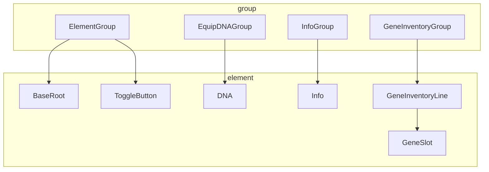
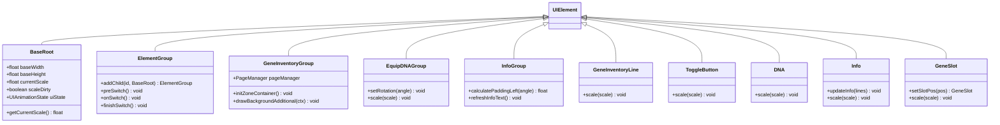
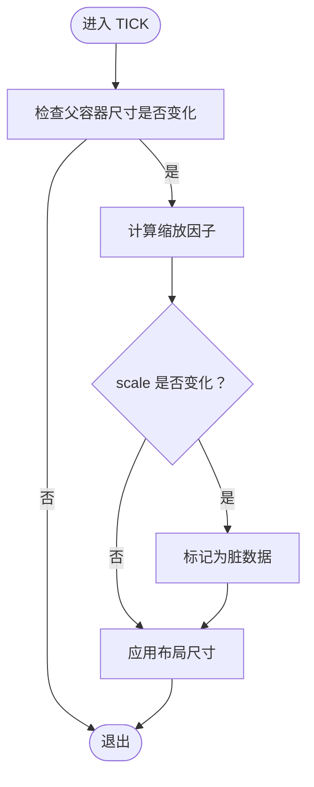
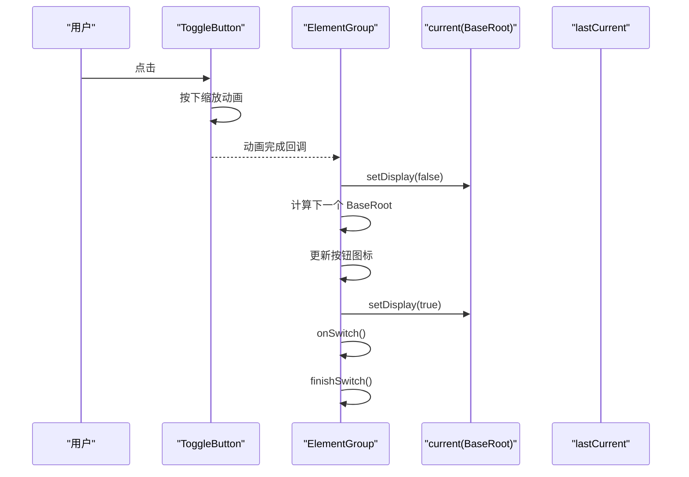
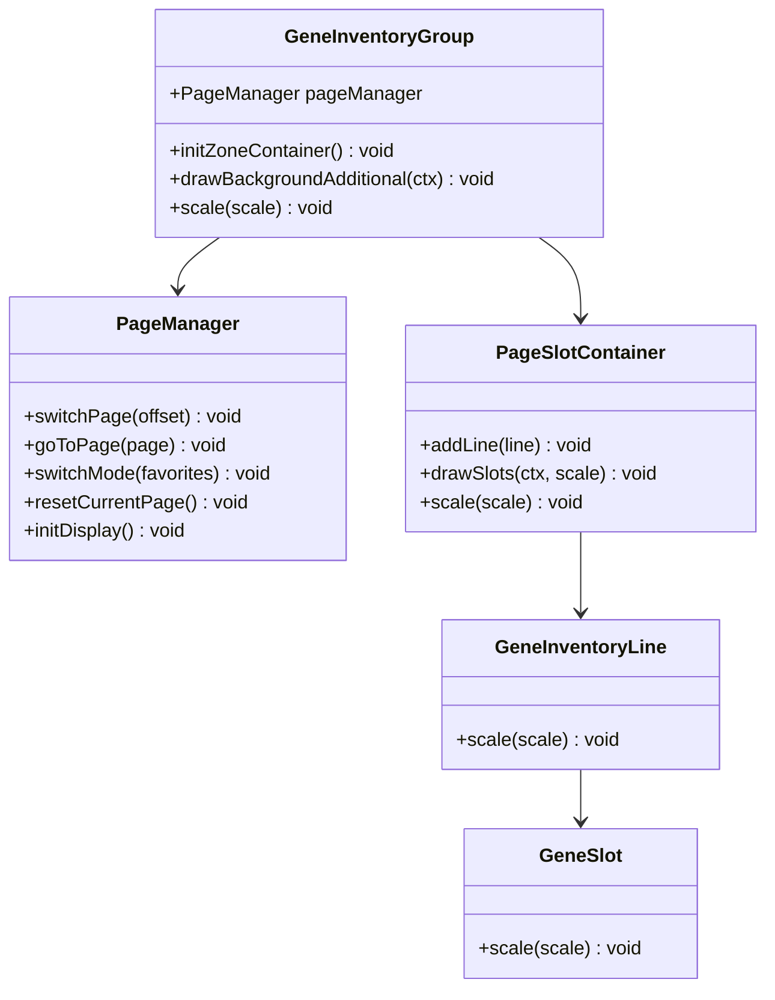
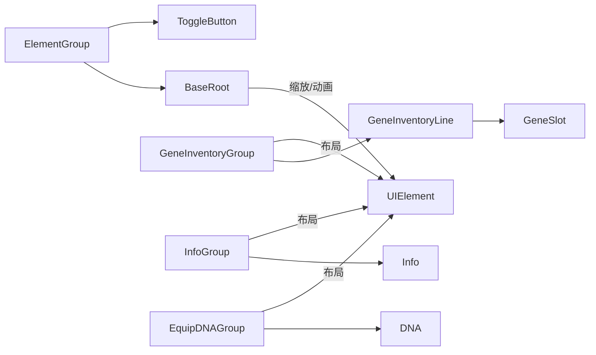

# UI组件架构

<cite>
**本文引用的文件**
- [BaseRoot.java](file://Biotech/src/main/java/org/biotech/ui/gene_inventroy/element/BaseRoot.java)
- [ElementGroup.java](file://Biotech/src/main/java/org/biotech/ui/gene_inventroy/group/ElementGroup.java)
- [GeneInventoryGroup.java](file://Biotech/src/main/java/org/biotech/ui/gene_inventroy/group/GeneInventoryGroup.java)
- [EquipDNAGroup.java](file://Biotech/src/main/java/org/biotech/ui/gene_inventroy/group/EquipDNAGroup.java)
- [InfoGroup.java](file://Biotech/src/main/java/org/biotech/ui/gene_inventroy/group/InfoGroup.java)
- [GeneSlot.java](file://Biotech/src/main/java/org/biotech/ui/gene_inventroy/element/inventory/GeneSlot.java)
- [GeneInventoryLine.java](file://Biotech/src/main/java/org/biotech/ui/gene_inventroy/element/inventory/GeneInventoryLine.java)
- [ToggleButton.java](file://Biotech/src/main/java/org/biotech/ui/gene_inventroy/element/ToggleButton.java)
- [DNA.java](file://Biotech/src/main/java/org/biotech/ui/gene_inventroy/element/DNA.java)
- [Info.java](file://Biotech/src/main/java/org/biotech/ui/gene_inventroy/element/Info.java)
- [IScalable.java](file://Biotech/src/main/java/org/biotech/ui/IScalable.java)
- [BiotechTexture.java](file://Biotech/src/main/java/org/biotech/ui/BiotechTexture.java)
</cite>

## 目录
1. [简介](#简介)
2. [项目结构](#项目结构)
3. [核心组件](#核心组件)
4. [架构总览](#架构总览)
5. [详细组件分析](#详细组件分析)
6. [依赖分析](#依赖分析)
7. [性能考量](#性能考量)
8. [故障排查指南](#故障排查指南)
9. [结论](#结论)
10. [附录](#附录)

## 简介
本文件面向基于 LowDragLib2 的 UI 组件体系，系统性梳理基因界面（Gene Inventory）的 UI 元素层次结构与设计理念。重点覆盖：
- BaseRoot 根组件的设计理念与实现原理
- UI 元素的生命周期管理、事件处理机制与布局系统
- 组件的继承关系、组合模式与状态管理
- UIAnimationState 枚举的作用与动画状态转换逻辑
- UI 组件的创建、配置与销毁最佳实践
- 组件间通信机制与数据绑定方法
- 响应式设计与屏幕适配策略

## 项目结构
UI 层位于 Biotech 模块的 org.biotech.ui.gene_inventroy 包下，按功能划分为 element（原子 UI 元素）与 group（复合 UI 组）两类：
- element：基础 UI 元素（如 BaseRoot、DNA、Info、ToggleButton 等）
- group：复合 UI 组（如 ElementGroup、GeneInventoryGroup、EquipDNAGroup、InfoGroup）

图表来源
- [ElementGroup.java:26-121](file://Biotech/src/main/java/org/biotech/ui/gene_inventroy/group/ElementGroup.java#L26-L121)
- [GeneInventoryGroup.java:48-136](file://Biotech/src/main/java/org/biotech/ui/gene_inventroy/group/GeneInventoryGroup.java#L48-L136)
- [EquipDNAGroup.java:15-98](file://Biotech/src/main/java/org/biotech/ui/gene_inventroy/group/EquipDNAGroup.java#L15-L98)
- [InfoGroup.java:27-132](file://Biotech/src/main/java/org/biotech/ui/gene_inventroy/group/InfoGroup.java#L27-L132)

章节来源
- [ElementGroup.java:26-121](file://Biotech/src/main/java/org/biotech/ui/gene_inventroy/group/ElementGroup.java#L26-L121)
- [GeneInventoryGroup.java:48-136](file://Biotech/src/main/java/org/biotech/ui/gene_inventroy/group/GeneInventoryGroup.java#L48-L136)
- [EquipDNAGroup.java:15-98](file://Biotech/src/main/java/org/biotech/ui/gene_inventroy/group/EquipDNAGroup.java#L15-L98)
- [InfoGroup.java:27-132](file://Biotech/src/main/java/org/biotech/ui/gene_inventroy/group/InfoGroup.java#L27-L132)

## 核心组件
- BaseRoot：根级 UI 容器，负责全屏填充与等比缩放；维护 UIAnimationState 与缩放脏标记，驱动子元素响应式布局。
- ElementGroup：多面板容器，支持切换按钮与面板切换；内部持有 BaseRoot 集合，负责面板切换与动画衔接。
- GeneInventoryGroup：基因背包界面，支持分页与收藏模式；通过 PageManager 管理页面显示与页码状态。
- EquipDNAGroup：装备 DNA 区域，展示 DNA 链条与 6 个装备槽位；支持旋转与统一缩放。
- InfoGroup：信息展示区，聚合顶部与底部装饰条与中间滚动文本；根据角度动态计算倾斜与内边距。
- 原子元素：GeneSlot（基因槽位）、GeneInventoryLine（槽位行）、ToggleButton（切换按钮）、DNA（滚动 DNA）、Info（滚动文本标签）。

章节来源
- [BaseRoot.java:15-144](file://Biotech/src/main/java/org/biotech/ui/gene_inventroy/element/BaseRoot.java#L15-L144)
- [ElementGroup.java:26-219](file://Biotech/src/main/java/org/biotech/ui/gene_inventroy/group/ElementGroup.java#L26-L219)
- [GeneInventoryGroup.java:48-637](file://Biotech/src/main/java/org/biotech/ui/gene_inventroy/group/GeneInventoryGroup.java#L48-L637)
- [EquipDNAGroup.java:15-163](file://Biotech/src/main/java/org/biotech/ui/gene_inventroy/group/EquipDNAGroup.java#L15-L163)
- [InfoGroup.java:27-302](file://Biotech/src/main/java/org/biotech/ui/gene_inventroy/group/InfoGroup.java#L27-L302)
- [GeneSlot.java:15-130](file://Biotech/src/main/java/org/biotech/ui/gene_inventroy/element/inventory/GeneSlot.java#L15-L130)
- [GeneInventoryLine.java:14-87](file://Biotech/src/main/java/org/biotech/ui/gene_inventroy/element/inventory/GeneInventoryLine.java#L14-L87)
- [ToggleButton.java:6-27](file://Biotech/src/main/java/org/biotech/ui/gene_inventroy/element/ToggleButton.java#L6-L27)
- [DNA.java:24-57](file://Biotech/src/main/java/org/biotech/ui/gene_inventroy/element/DNA.java#L24-L57)
- [Info.java:23-200](file://Biotech/src/main/java/org/biotech/ui/gene_inventroy/element/Info.java#L23-L200)

## 架构总览
UI 架构围绕 LowDragLib2 的 UIElement 体系构建，采用组合模式组织层级，通过 Taffy 布局引擎与 Transform2D 实现响应式与动画化交互。BaseRoot 作为根容器，统一管理缩放与动画状态；ElementGroup 作为面板容器协调多个 BaseRoot；具体业务 UI（如基因背包、装备 DNA、信息展示）以 group 形式组合 element。

图表来源
- [BaseRoot.java:15-144](file://Biotech/src/main/java/org/biotech/ui/gene_inventroy/element/BaseRoot.java#L15-L144)
- [ElementGroup.java:26-219](file://Biotech/src/main/java/org/biotech/ui/gene_inventroy/group/ElementGroup.java#L26-L219)
- [GeneInventoryGroup.java:48-637](file://Biotech/src/main/java/org/biotech/ui/gene_inventroy/group/GeneInventoryGroup.java#L48-L637)
- [EquipDNAGroup.java:15-163](file://Biotech/src/main/java/org/biotech/ui/gene_inventroy/group/EquipDNAGroup.java#L15-L163)
- [InfoGroup.java:27-302](file://Biotech/src/main/java/org/biotech/ui/gene_inventroy/group/InfoGroup.java#L27-L302)
- [GeneSlot.java:15-130](file://Biotech/src/main/java/org/biotech/ui/gene_inventroy/element/inventory/GeneSlot.java#L15-L130)
- [GeneInventoryLine.java:14-87](file://Biotech/src/main/java/org/biotech/ui/gene_inventroy/element/inventory/GeneInventoryLine.java#L14-L87)
- [ToggleButton.java:6-27](file://Biotech/src/main/java/org/biotech/ui/gene_inventroy/element/ToggleButton.java#L6-L27)
- [DNA.java:24-57](file://Biotech/src/main/java/org/biotech/ui/gene_inventroy/element/DNA.java#L24-L57)
- [Info.java:23-200](file://Biotech/src/main/java/org/biotech/ui/gene_inventroy/element/Info.java#L23-L200)

## 详细组件分析

### BaseRoot 根组件
- 设计理念：保持内容宽高比不变的前提下，以 contain 方式填充父容器；通过监听父容器尺寸变化，动态计算缩放因子并更新自身尺寸。
- 生命周期：在 TICK 事件中检测父容器尺寸变化，触发缩放更新；提供 getCurrentScale 清除脏标记，供子类消费。
- 状态管理：维护 UIAnimationState（PRE/ON/POST），用于驱动入场、静止与退场动画阶段。
- 最佳实践：子类通过覆盖 scaleTick 提供自定义缩放逻辑；避免在非必要时频繁布局变更。

图表来源
- [BaseRoot.java:27-103](file://Biotech/src/main/java/org/biotech/ui/gene_inventroy/element/BaseRoot.java#L27-L103)

章节来源
- [BaseRoot.java:15-144](file://Biotech/src/main/java/org/biotech/ui/gene_inventroy/element/BaseRoot.java#L15-L144)

### ElementGroup 多面板容器
- 组合模式：持有多个 BaseRoot，通过切换按钮在面板间切换；默认仅显示第一个，其余隐藏。
- 事件处理：Toggle 按钮点击触发动画（按下缩放与还原），随后执行 preSwitch 切换逻辑。
- 动画衔接：预留 onSwitch/finishSwitch 接口，便于扩展入场/退场动画。
- 最佳实践：为每个 BaseRoot 提供独立贴图资源；在切换时同步更新按钮图标。

图表来源
- [ElementGroup.java:88-121](file://Biotech/src/main/java/org/biotech/ui/gene_inventroy/group/ElementGroup.java#L88-L121)
- [ElementGroup.java:179-216](file://Biotech/src/main/java/org/biotech/ui/gene_inventroy/group/ElementGroup.java#L179-L216)

章节来源
- [ElementGroup.java:26-219](file://Biotech/src/main/java/org/biotech/ui/gene_inventroy/group/ElementGroup.java#L26-L219)

### 基因背包 GeneInventoryGroup
- 分页与阶梯偏移：每页包含固定行数的槽位行，使用绝对定位容器承载；通过 PageManager 管理普通与收藏两套页码状态。
- 绘制优化：在 drawBackgroundAdditional 中仅绘制当前可见页的槽位背景与悬停效果，减少无效绘制。
- 数据绑定：槽位绑定至玩家基因背包或收藏背包的 IItemHandlerModifiable；支持快速移动与优先级。
- 最佳实践：在 initDisplay 中初始化显示状态；通过 scale 统一缩放子元素；在切换模式时重置页码。

图表来源
- [GeneInventoryGroup.java:48-136](file://Biotech/src/main/java/org/biotech/ui/gene_inventroy/group/GeneInventoryGroup.java#L48-L136)
- [GeneInventoryGroup.java:295-491](file://Biotech/src/main/java/org/biotech/ui/gene_inventroy/group/GeneInventoryGroup.java#L295-L491)
- [GeneInventoryGroup.java:503-635](file://Biotech/src/main/java/org/biotech/ui/gene_inventroy/group/GeneInventoryGroup.java#L503-L635)
- [GeneInventoryLine.java:14-87](file://Biotech/src/main/java/org/biotech/ui/gene_inventroy/element/inventory/GeneInventoryLine.java#L14-L87)
- [GeneSlot.java:15-130](file://Biotech/src/main/java/org/biotech/ui/gene_inventroy/element/inventory/GeneSlot.java#L15-L130)

章节来源
- [GeneInventoryGroup.java:48-637](file://Biotech/src/main/java/org/biotech/ui/gene_inventroy/group/GeneInventoryGroup.java#L48-L637)

### 装备 DNA EquipDNAGroup
- 结构：左侧若干槽位容器、中间空容器、右侧 DNA 链条容器；支持统一缩放与旋转。
- 旋转联动：设置旋转角度时，对容器与槽位分别施加相反方向的旋转，维持视觉一致性。
- 最佳实践：在 scale 中同步调整容器与子元素尺寸；通过 Transform2D 控制 DNA 的平移与缩放。

章节来源
- [EquipDNAGroup.java:15-163](file://Biotech/src/main/java/org/biotech/ui/gene_inventroy/group/EquipDNAGroup.java#L15-L163)
- [DNA.java:24-57](file://Biotech/src/main/java/org/biotech/ui/gene_inventroy/element/DNA.java#L24-L57)

### 信息展示 InfoGroup
- 动态文本：实时读取玩家装备槽位的基因词条，汇总去重后生成滚动文本；仅在内容变化时重建，避免滚动进度被重置。
- 倾斜布局：根据顶部与底部装饰条的 Y 位置差计算倾斜角度与内边距，使文本呈现视觉平衡。
- 最佳实践：在 UIEvents.LAYOUT_CHANGED 中计算并应用倾斜参数；在 UIEvents.TICK 中刷新文本。

章节来源
- [InfoGroup.java:27-302](file://Biotech/src/main/java/org/biotech/ui/gene_inventroy/group/InfoGroup.java#L27-L302)
- [Info.java:23-200](file://Biotech/src/main/java/org/biotech/ui/gene_inventroy/element/Info.java#L23-L200)

### 原子元素与样式
- GeneSlot：支持 Left/Middle/Right 三种位置样式，悬停时使用自定义纹理覆盖默认背景；提供 getContentX/Y 与 isSlotHovered 辅助绘制。
- GeneInventoryLine：根据位置动态选择 SlotPos，实现阶梯式布局；支持统一缩放。
- ToggleButton：固定尺寸按钮，支持缩放；与 ElementGroup 协同实现面板切换。
- DNA：使用背景纹理实现无缝滚动；支持缩放与平移变换。
- Info：基于 ScrollerView 的垂直滚动文本，仅在 hover 时自动下滚；支持倾斜与缩放。

章节来源
- [GeneSlot.java:15-130](file://Biotech/src/main/java/org/biotech/ui/gene_inventroy/element/inventory/GeneSlot.java#L15-L130)
- [GeneInventoryLine.java:14-87](file://Biotech/src/main/java/org/biotech/ui/gene_inventroy/element/inventory/GeneInventoryLine.java#L14-L87)
- [ToggleButton.java:6-27](file://Biotech/src/main/java/org/biotech/ui/gene_inventroy/element/ToggleButton.java#L6-L27)
- [DNA.java:24-57](file://Biotech/src/main/java/org/biotech/ui/gene_inventroy/element/DNA.java#L24-L57)
- [Info.java:23-200](file://Biotech/src/main/java/org/biotech/ui/gene_inventroy/element/Info.java#L23-L200)

## 依赖分析
- 组件耦合：ElementGroup 依赖 BaseRoot 与 ToggleButton；GeneInventoryGroup 依赖 GeneInventoryLine 与 GeneSlot；InfoGroup 依赖 Info；EquipDNAGroup 依赖 DNA 与槽位。
- 外部依赖：LowDragLib2 的 UIElement、Taffy 布局、Transform2D、AnimationTexture；纹理资源来自 BiotechTexture。
- 循环依赖：未发现直接循环依赖；组合关系清晰，事件与布局解耦。

图表来源
- [ElementGroup.java:26-121](file://Biotech/src/main/java/org/biotech/ui/gene_inventroy/group/ElementGroup.java#L26-L121)
- [GeneInventoryGroup.java:48-136](file://Biotech/src/main/java/org/biotech/ui/gene_inventroy/group/GeneInventoryGroup.java#L48-L136)
- [InfoGroup.java:27-132](file://Biotech/src/main/java/org/biotech/ui/gene_inventroy/group/InfoGroup.java#L27-L132)
- [EquipDNAGroup.java:15-98](file://Biotech/src/main/java/org/biotech/ui/gene_inventroy/group/EquipDNAGroup.java#L15-L98)

章节来源
- [ElementGroup.java:26-219](file://Biotech/src/main/java/org/biotech/ui/gene_inventroy/group/ElementGroup.java#L26-L219)
- [GeneInventoryGroup.java:48-637](file://Biotech/src/main/java/org/biotech/ui/gene_inventroy/group/GeneInventoryGroup.java#L48-L637)
- [InfoGroup.java:27-302](file://Biotech/src/main/java/org/biotech/ui/gene_inventroy/group/InfoGroup.java#L27-L302)
- [EquipDNAGroup.java:15-163](file://Biotech/src/main/java/org/biotech/ui/gene_inventroy/group/EquipDNAGroup.java#L15-L163)

## 性能考量
- 布局与绘制
  - GeneInventoryGroup 在 drawBackgroundAdditional 中仅绘制当前可见页，避免全量绘制开销。
  - InfoGroup 仅在内容变化时重建文本，减少滚动进度重置与重排成本。
- 缩放与变换
  - BaseRoot 通过脏标记避免重复计算缩放；ElementGroup 与各 group 的 scale 方法统一处理子元素缩放。
  - DNA 使用背景纹理与 Transform2D 平移，减少逐帧位置计算。
- 事件与动画
  - ElementGroup 的切换动画采用短时序与缓动函数，保证流畅性同时降低 CPU 开销。
  - Info 的自动滚动仅在 hover 时生效，避免无意义的滚动计算。

## 故障排查指南
- 缩放异常
  - 症状：UI 元素比例失真或尺寸不正确
  - 排查：确认 BaseRoot 的 baseWidth/baseHeight 与父容器尺寸；检查 isScaleDirty 标记是否被正确消费
  - 参考：[BaseRoot.java:79-120](file://Biotech/src/main/java/org/biotech/ui/gene_inventroy/element/BaseRoot.java#L79-L120)
- 切换面板无响应
  - 症状：点击切换按钮无面板切换
  - 排查：确认 ElementGroup 的 children 是否正确添加；检查 preSwitch 与 onSwitch/finishSwitch 的实现
  - 参考：[ElementGroup.java:179-216](file://Biotech/src/main/java/org/biotech/ui/gene_inventroy/group/ElementGroup.java#L179-L216)
- 槽位悬停纹理不显示
  - 症状：悬停无高亮效果
  - 排查：确认 GeneSlot 的 isSlotHovered 返回值；检查 SlotPos 的 hoverOffsetX/Y 与绘制坐标
  - 参考：[GeneSlot.java:69-86](file://Biotech/src/main/java/org/biotech/ui/gene_inventroy/element/inventory/GeneSlot.java#L69-L86)
- 文本滚动不生效
  - 症状：Info 文本无法自动滚动
  - 排查：确认 scrollerView 的 hover 状态；检查 AUTO_SCROLL_PIXEL_PER_TICK 与溢出高度
  - 参考：[Info.java:129-146](file://Biotech/src/main/java/org/biotech/ui/gene_inventroy/element/Info.java#L129-L146)
- 旋转错位
  - 症状：旋转后槽位与容器不匹配
  - 排查：确认 setRotation 对容器与子元素施加了相反方向的旋转
  - 参考：[EquipDNAGroup.java:154-160](file://Biotech/src/main/java/org/biotech/ui/gene_inventroy/group/EquipDNAGroup.java#L154-L160)

## 结论
本 UI 架构以 BaseRoot 为核心，结合 ElementGroup 的面板切换与 LowDragLib2 的布局与动画能力，实现了响应式、可扩展且高性能的基因界面系统。通过明确的状态机与事件驱动模型，组件间职责清晰、耦合度低，便于维护与扩展。

## 附录
- 纹理资源：BiotechTexture 定义了主 UI 纹理、DNA 纹理与按钮切片等资源，供各 UI 组件使用。
- 缩放接口：IScalable 为所有可缩放 UI 元素提供统一的 scale 方法契约。

章节来源
- [BiotechTexture.java:12-39](file://Biotech/src/main/java/org/biotech/ui/BiotechTexture.java#L12-L39)
- [IScalable.java:5-9](file://Biotech/src/main/java/org/biotech/ui/IScalable.java#L5-L9)