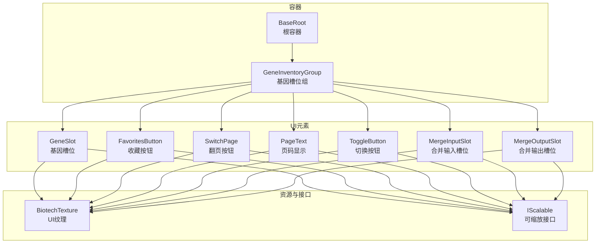
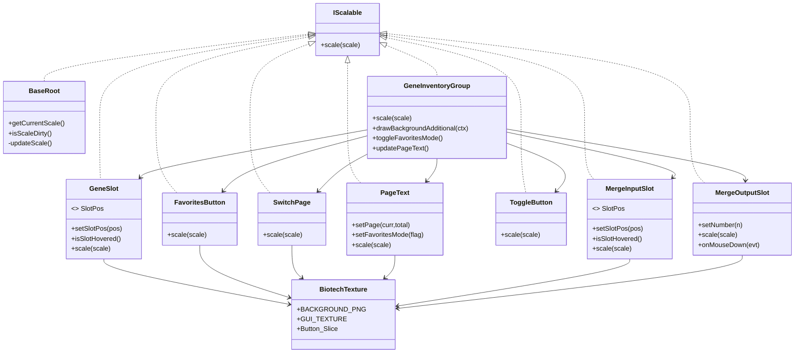
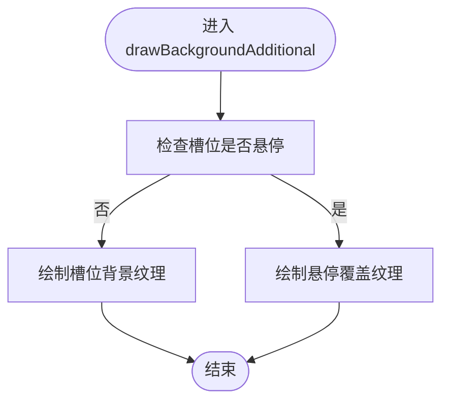
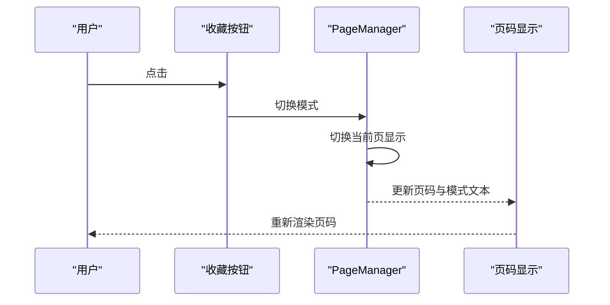
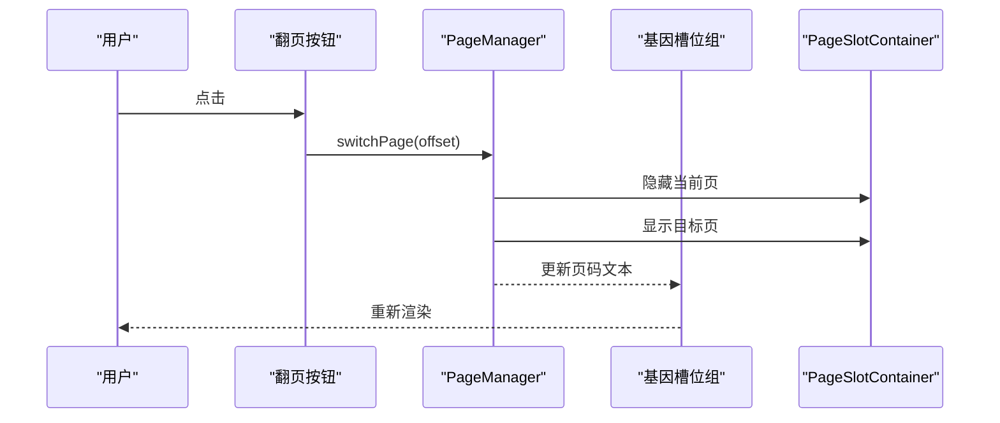
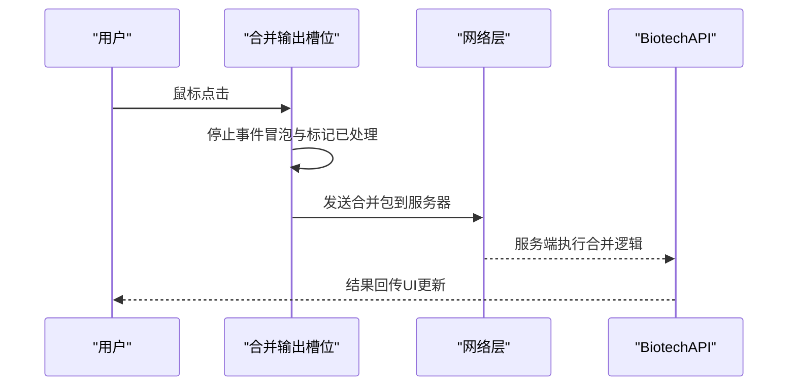
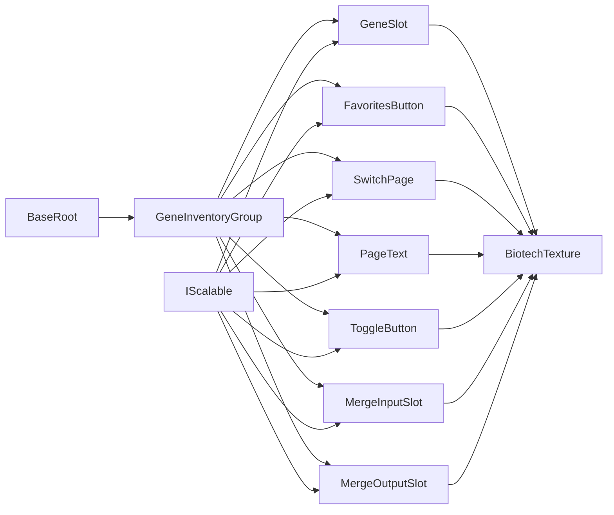

# 交互设计

<cite>
**本文引用的文件**
- [基因槽位组件 GeneSlot.java](file://Biotech/src/main/java/org/biotech/ui/gene_inventroy/element/inventory/GeneSlot.java)
- [收藏按钮 FavoritesButton.java](file://Biotech/src/main/java/org/biotech/ui/gene_inventroy/element/inventory/FavoritesButton.java)
- [翻页按钮 SwitchPage.java](file://Biotech/src/main/java/org/biotech/ui/gene_inventroy/element/inventory/SwitchPage.java)
- [页码显示 PageText.java](file://Biotech/src/main/java/org/biotech/ui/gene_inventroy/element/inventory/PageText.java)
- [切换按钮 ToggleButton.java](file://Biotech/src/main/java/org/biotech/ui/gene_inventroy/element/ToggleButton.java)
- [合并输出槽位 MergeOutputSlot.java](file://Biotech/src/main/java/org/biotech/ui/gene_inventroy/element/merge/MergeOutputSlot.java)
- [合并输入槽位 MergeInputSlot.java](file://Biotech/src/main/java/org/biotech/ui/gene_inventroy/element/merge/MergeInputSlot.java)
- [基因槽位组 GeneInventoryGroup.java](file://Biotech/src/main/java/org/biotech/ui/gene_inventroy/group/GeneInventoryGroup.java)
- [可缩放接口 IScalable.java](file://Biotech/src/main/java/org/biotech/ui/IScalable.java)
- [生物科技UI纹理 BiotechTexture.java](file://Biotech/src/main/java/org/biotech/ui/BiotechTexture.java)
- [根容器 BaseRoot.java](file://Biotech/src/main/java/org/biotech/ui/gene_inventroy/element/BaseRoot.java)
</cite>

## 目录
1. [简介](#简介)
2. [项目结构](#项目结构)
3. [核心组件](#核心组件)
4. [架构总览](#架构总览)
5. [详细组件分析](#详细组件分析)
6. [依赖分析](#依赖分析)
7. [性能考虑](#性能考虑)
8. [故障排查指南](#故障排查指南)
9. [结论](#结论)
10. [附录](#附录)

## 简介
本文件面向交互设计与前端实现，系统梳理基因猎人模块中UI组件的交互模式与用户操作流程，覆盖点击、拖拽、悬停等事件处理，以及键盘导航与触摸支持的实现思路。重点解析基因槽位(GeneSlot)、收藏夹按钮(FavoritesButton)、切换按钮(ToggleButton)、翻页按钮(SwitchPage)、页码显示(PageText)、合并输入/输出槽位(MergeInputSlot/MergeOutputSlot)等核心组件的交互行为与反馈机制。同时给出无障碍访问与键盘快捷键的实现建议、交互冲突处理策略及错误状态提示方案。

## 项目结构
本项目UI层基于低拖拽库2(LowDragLib2)构建，采用分层组织：
- ui.gene_inventroy.element：通用UI元素（按钮、槽位、标签等）
- ui.gene_inventroy.group：复合布局容器（如基因槽位组）
- ui：纹理与可缩放接口
- api.system.gene：与基因系统交互的数据与业务逻辑

图表来源
- [基因槽位组 GeneInventoryGroup.java:30-637](file://Biotech/src/main/java/org/biotech/ui/gene_inventroy/group/GeneInventoryGroup.java#L30-L637)
- [基因槽位组件 GeneSlot.java:11-130](file://Biotech/src/main/java/org/biotech/ui/gene_inventroy/element/inventory/GeneSlot.java#L11-L130)
- [收藏按钮 FavoritesButton.java:9-56](file://Biotech/src/main/java/org/biotech/ui/gene_inventroy/element/inventory/FavoritesButton.java#L9-L56)
- [翻页按钮 SwitchPage.java:11-72](file://Biotech/src/main/java/org/biotech/ui/gene_inventroy/element/inventory/SwitchPage.java#L11-L72)
- [页码显示 PageText.java:14-102](file://Biotech/src/main/java/org/biotech/ui/gene_inventroy/element/inventory/PageText.java#L14-L102)
- [切换按钮 ToggleButton.java:6-27](file://Biotech/src/main/java/org/biotech/ui/gene_inventroy/element/ToggleButton.java#L6-L27)
- [合并输入槽位 MergeInputSlot.java:11-115](file://Biotech/src/main/java/org/biotech/ui/gene_inventroy/element/merge/MergeInputSlot.java#L11-L115)
- [合并输出槽位 MergeOutputSlot.java:30-248](file://Biotech/src/main/java/org/biotech/ui/gene_inventroy/element/merge/MergeOutputSlot.java#L30-L248)
- [根容器 BaseRoot.java:9-144](file://Biotech/src/main/java/org/biotech/ui/gene_inventroy/element/BaseRoot.java#L9-L144)
- [生物科技UI纹理 BiotechTexture.java:7-39](file://Biotech/src/main/java/org/biotech/ui/BiotechTexture.java#L7-L39)
- [可缩放接口 IScalable.java:5-9](file://Biotech/src/main/java/org/biotech/ui/IScalable.java#L5-L9)

章节来源
- [基因槽位组 GeneInventoryGroup.java:30-637](file://Biotech/src/main/java/org/biotech/ui/gene_inventroy/group/GeneInventoryGroup.java#L30-L637)
- [根容器 BaseRoot.java:9-144](file://Biotech/src/main/java/org/biotech/ui/gene_inventroy/element/BaseRoot.java#L9-L144)

## 核心组件
本节聚焦交互组件的职责、事件绑定与反馈机制：
- 基因槽位(GeneSlot)：支持三种位置样式，悬停时绘制自定义悬停纹理，禁用默认背景，按缩放比例调整尺寸与内边距。
- 收藏按钮(FavoritesButton)：纯图标按钮，三态纹理（普通/悬停/按下），隐藏文字，固定尺寸。
- 切换按钮(ToggleButton)：方形按钮，统一基线尺寸，支持缩放。
- 翻页按钮(SwitchPage)：左右翻页，区分纹理与悬停纹理，固定尺寸。
- 页码显示(PageText)：显示“模式+页码”文本，支持9-slice背景与字号随缩放变化。
- 合并输入/输出槽位(MergeInputSlot/MergeOutputSlot)：输入槽位自定义样式与悬停绘制占位；输出槽位内置浮动动画、悬浮覆盖与点击触发合并协议。

章节来源
- [基因槽位组件 GeneSlot.java:11-130](file://Biotech/src/main/java/org/biotech/ui/gene_inventroy/element/inventory/GeneSlot.java#L11-L130)
- [收藏按钮 FavoritesButton.java:9-56](file://Biotech/src/main/java/org/biotech/ui/gene_inventroy/element/inventory/FavoritesButton.java#L9-L56)
- [切换按钮 ToggleButton.java:6-27](file://Biotech/src/main/java/org/biotech/ui/gene_inventroy/element/ToggleButton.java#L6-L27)
- [翻页按钮 SwitchPage.java:11-72](file://Biotech/src/main/java/org/biotech/ui/gene_inventroy/element/inventory/SwitchPage.java#L11-L72)
- [页码显示 PageText.java:14-102](file://Biotech/src/main/java/org/biotech/ui/gene_inventroy/element/inventory/PageText.java#L14-L102)
- [合并输入槽位 MergeInputSlot.java:11-115](file://Biotech/src/main/java/org/biotech/ui/gene_inventroy/element/merge/MergeInputSlot.java#L11-L115)
- [合并输出槽位 MergeOutputSlot.java:30-248](file://Biotech/src/main/java/org/biotech/ui/gene_inventroy/element/merge/MergeOutputSlot.java#L30-L248)

## 架构总览
交互架构围绕“容器-元素-纹理-缩放”的层次展开：
- 容器负责布局与事件分发（如 GeneInventoryGroup、BaseRoot）。
- 元素负责具体交互（按钮、槽位、标签）。
- 纹理资源由 BiotechTexture 提供，支持9-slice与精灵图。
- 缩放通过 IScalable 接口统一实现，保证不同分辨率下的一致体验。

图表来源
- [可缩放接口 IScalable.java:5-9](file://Biotech/src/main/java/org/biotech/ui/IScalable.java#L5-L9)
- [根容器 BaseRoot.java:13-144](file://Biotech/src/main/java/org/biotech/ui/gene_inventroy/element/BaseRoot.java#L13-L144)
- [基因槽位组 GeneInventoryGroup.java:46-637](file://Biotech/src/main/java/org/biotech/ui/gene_inventroy/group/GeneInventoryGroup.java#L46-L637)
- [基因槽位组件 GeneSlot.java:15-130](file://Biotech/src/main/java/org/biotech/ui/gene_inventroy/element/inventory/GeneSlot.java#L15-L130)
- [收藏按钮 FavoritesButton.java:13-56](file://Biotech/src/main/java/org/biotech/ui/gene_inventroy/element/inventory/FavoritesButton.java#L13-L56)
- [翻页按钮 SwitchPage.java:21-72](file://Biotech/src/main/java/org/biotech/ui/gene_inventroy/element/inventory/SwitchPage.java#L21-L72)
- [页码显示 PageText.java:19-102](file://Biotech/src/main/java/org/biotech/ui/gene_inventroy/element/inventory/PageText.java#L19-L102)
- [切换按钮 ToggleButton.java:6-27](file://Biotech/src/main/java/org/biotech/ui/gene_inventroy/element/ToggleButton.java#L6-L27)
- [合并输入槽位 MergeInputSlot.java:15-115](file://Biotech/src/main/java/org/biotech/ui/gene_inventroy/element/merge/MergeInputSlot.java#L15-L115)
- [合并输出槽位 MergeOutputSlot.java:33-248](file://Biotech/src/main/java/org/biotech/ui/gene_inventroy/element/merge/MergeOutputSlot.java#L33-L248)
- [生物科技UI纹理 BiotechTexture.java:12-39](file://Biotech/src/main/java/org/biotech/ui/BiotechTexture.java#L12-L39)

## 详细组件分析

### 基因槽位(GeneSlot)交互与悬停反馈
- 位置样式：支持 Left、Middle、Right 三种位置，对应不同的纹理坐标与悬停偏移。
- 悬停检测：通过 isHover()/isSelfOrChildHover() 判断是否悬停。
- 绘制策略：禁用默认背景，仅在非悬停时绘制槽位纹理；在悬停时绘制 HoverOverlay 纹理，确保层级正确。
- 缩放适配：scale() 方法按比例调整宽度、高度与内边距，保证在不同分辨率下布局一致。

图表来源
- [基因槽位组 GeneInventoryGroup.java:358-418](file://Biotech/src/main/java/org/biotech/ui/gene_inventroy/group/GeneInventoryGroup.java#L358-L418)
- [基因槽位组件 GeneSlot.java:58-86](file://Biotech/src/main/java/org/biotech/ui/gene_inventroy/element/inventory/GeneSlot.java#L58-L86)

章节来源
- [基因槽位组件 GeneSlot.java:11-130](file://Biotech/src/main/java/org/biotech/ui/gene_inventroy/element/inventory/GeneSlot.java#L11-L130)
- [基因槽位组 GeneInventoryGroup.java:358-418](file://Biotech/src/main/java/org/biotech/ui/gene_inventroy/group/GeneInventoryGroup.java#L358-L418)

### 收藏按钮(FavoritesButton)与翻页按钮(SwitchPage)
- 收藏按钮：隐藏文字，设置三态纹理（base/hover/pressed），固定尺寸，点击切换收藏模式。
- 翻页按钮：区分左右按钮，分别设置不同纹理与悬停纹理，点击触发 PageManager 翻页。

图表来源
- [收藏按钮 FavoritesButton.java:28-45](file://Biotech/src/main/java/org/biotech/ui/gene_inventroy/element/inventory/FavoritesButton.java#L28-L45)
- [基因槽位组 GeneInventoryGroup.java:196-218](file://Biotech/src/main/java/org/biotech/ui/gene_inventroy/group/GeneInventoryGroup.java#L196-L218)
- [页码显示 PageText.java:65-92](file://Biotech/src/main/java/org/biotech/ui/gene_inventroy/element/inventory/PageText.java#L65-L92)

章节来源
- [收藏按钮 FavoritesButton.java:9-56](file://Biotech/src/main/java/org/biotech/ui/gene_inventroy/element/inventory/FavoritesButton.java#L9-L56)
- [翻页按钮 SwitchPage.java:11-72](file://Biotech/src/main/java/org/biotech/ui/gene_inventroy/element/inventory/SwitchPage.java#L11-L72)
- [基因槽位组 GeneInventoryGroup.java:196-218](file://Biotech/src/main/java/org/biotech/ui/gene_inventroy/group/GeneInventoryGroup.java#L196-L218)
- [页码显示 PageText.java:14-102](file://Biotech/src/main/java/org/biotech/ui/gene_inventroy/element/inventory/PageText.java#L14-L102)

### 切换按钮(ToggleButton)与页面管理(PageManager)
- ToggleButton：方形按钮，统一基线尺寸，支持缩放。
- PageManager：维护普通与收藏两套页码状态，支持翻页、跳页、模式切换与初始化显示。

图表来源
- [翻页按钮 SwitchPage.java:38-59](file://Biotech/src/main/java/org/biotech/ui/gene_inventroy/element/inventory/SwitchPage.java#L38-L59)
- [基因槽位组 GeneInventoryGroup.java:542-572](file://Biotech/src/main/java/org/biotech/ui/gene_inventroy/group/GeneInventoryGroup.java#L542-L572)
- [基因槽位组 GeneInventoryGroup.java:594-602](file://Biotech/src/main/java/org/biotech/ui/gene_inventroy/group/GeneInventoryGroup.java#L594-L602)

章节来源
- [切换按钮 ToggleButton.java:6-27](file://Biotech/src/main/java/org/biotech/ui/gene_inventroy/element/ToggleButton.java#L6-L27)
- [基因槽位组 GeneInventoryGroup.java:495-637](file://Biotech/src/main/java/org/biotech/ui/gene_inventroy/group/GeneInventoryGroup.java#L495-L637)

### 合并输入/输出槽位交互
- 合并输入槽位(MergeInputSlot)：自定义槽位样式与悬停绘制占位，支持位置枚举与缩放。
- 合并输出槽位(MergeOutputSlot)：内置浮动动画，悬停覆盖与背景叠加；点击直接发送合并请求至服务器，客户端仅负责触发。

图表来源
- [合并输出槽位 MergeOutputSlot.java:169-177](file://Biotech/src/main/java/org/biotech/ui/gene_inventroy/element/merge/MergeOutputSlot.java#L169-L177)
- [合并输出槽位 MergeOutputSlot.java:219-222](file://Biotech/src/main/java/org/biotech/ui/gene_inventroy/element/merge/MergeOutputSlot.java#L219-L222)

章节来源
- [合并输入槽位 MergeInputSlot.java:11-115](file://Biotech/src/main/java/org/biotech/ui/gene_inventroy/element/merge/MergeInputSlot.java#L11-L115)
- [合并输出槽位 MergeOutputSlot.java:30-248](file://Biotech/src/main/java/org/biotech/ui/gene_inventroy/element/merge/MergeOutputSlot.java#L30-L248)

### 页码显示与文本渲染
- PageText：支持“模式+页码”组合文本，使用翻译键动态切换模式文案，9-slice背景与字号随缩放变化。

章节来源
- [页码显示 PageText.java:14-102](file://Biotech/src/main/java/org/biotech/ui/gene_inventroy/element/inventory/PageText.java#L14-L102)

### 缩放与响应式布局
- BaseRoot：计算容器与内容的纵横比，按“contain”策略缩放，保持整体比例不变，提供脏标记避免重复计算。
- IScalable：统一缩放接口，所有UI元素按比例调整尺寸与字体。

章节来源
- [根容器 BaseRoot.java:34-121](file://Biotech/src/main/java/org/biotech/ui/gene_inventroy/element/BaseRoot.java#L34-L121)
- [可缩放接口 IScalable.java:5-9](file://Biotech/src/main/java/org/biotech/ui/IScalable.java#L5-L9)

## 依赖分析
- 组件耦合：GeneInventoryGroup 作为复合容器，聚合多个元素；元素间通过事件回调与数据状态联动。
- 外部依赖：LowDragLib2 提供UI元素、布局与事件模型；BiotechTexture 提供纹理资源；BiotechAPI 提供业务数据。
- 缩放一致性：所有元素实现 IScalable，确保在 BaseRoot 的统一缩放下保持视觉一致性。

图表来源
- [基因槽位组 GeneInventoryGroup.java:46-637](file://Biotech/src/main/java/org/biotech/ui/gene_inventroy/group/GeneInventoryGroup.java#L46-L637)
- [生物科技UI纹理 BiotechTexture.java:12-39](file://Biotech/src/main/java/org/biotech/ui/BiotechTexture.java#L12-L39)
- [根容器 BaseRoot.java:13-144](file://Biotech/src/main/java/org/biotech/ui/gene_inventroy/element/BaseRoot.java#L13-L144)
- [可缩放接口 IScalable.java:5-9](file://Biotech/src/main/java/org/biotech/ui/IScalable.java#L5-L9)

章节来源
- [基因槽位组 GeneInventoryGroup.java:46-637](file://Biotech/src/main/java/org/biotech/ui/gene_inventroy/group/GeneInventoryGroup.java#L46-L637)
- [生物科技UI纹理 BiotechTexture.java:12-39](file://Biotech/src/main/java/org/biotech/ui/BiotechTexture.java#L12-L39)
- [根容器 BaseRoot.java:13-144](file://Biotech/src/main/java/org/biotech/ui/gene_inventroy/element/BaseRoot.java#L13-L144)
- [可缩放接口 IScalable.java:5-9](file://Biotech/src/main/java/org/biotech/ui/IScalable.java#L5-L9)

## 性能考虑
- 绘制优化：仅在非悬停时绘制槽位背景，悬停时绘制悬停覆盖，减少不必要的绘制开销。
- 动画驱动：输出槽位使用 TICK 事件驱动背景与槽位浮动动画，避免每帧重复计算。
- 缩放缓存：BaseRoot 使用脏标记避免重复缩放计算，提高响应速度。
- 字体与层级：页码显示使用百分比尺寸与缩放字体，避免频繁布局重排。

章节来源
- [基因槽位组 GeneInventoryGroup.java:358-418](file://Biotech/src/main/java/org/biotech/ui/gene_inventroy/group/GeneInventoryGroup.java#L358-L418)
- [合并输出槽位 MergeOutputSlot.java:89-94](file://Biotech/src/main/java/org/biotech/ui/gene_inventroy/element/merge/MergeOutputSlot.java#L89-L94)
- [根容器 BaseRoot.java:118-121](file://Biotech/src/main/java/org/biotech/ui/gene_inventroy/element/BaseRoot.java#L118-L121)

## 故障排查指南
- 悬停纹理未显示
  - 检查 isSlotHovered() 返回值与绘制顺序，确认非悬停时绘制背景、悬停时绘制覆盖。
  - 章节来源
    - [基因槽位组 GeneInventoryGroup.java:358-418](file://Biotech/src/main/java/org/biotech/ui/gene_inventroy/group/GeneInventoryGroup.java#L358-L418)
    - [基因槽位组件 GeneSlot.java:70-72](file://Biotech/src/main/java/org/biotech/ui/gene_inventroy/element/inventory/GeneSlot.java#L70-L72)
- 点击无效或事件冒泡
  - 确认按钮 onClick 回调是否正确绑定；输出槽位点击需阻止冒泡并标记事件已处理。
  - 章节来源
    - [翻页按钮 SwitchPage.java:38-59](file://Biotech/src/main/java/org/biotech/ui/gene_inventroy/element/inventory/SwitchPage.java#L38-L59)
    - [合并输出槽位 MergeOutputSlot.java:169-177](file://Biotech/src/main/java/org/biotech/ui/gene_inventroy/element/merge/MergeOutputSlot.java#L169-L177)
- 纹理错位或尺寸异常
  - 检查 SlotPos 纹理坐标与 hoverOffsetX/Y；确认 scale() 正确应用到 width/height/padding。
  - 章节来源
    - [基因槽位组件 GeneSlot.java:103-128](file://Biotech/src/main/java/org/biotech/ui/gene_inventroy/element/inventory/GeneSlot.java#L103-L128)
    - [合并输入槽位 MergeInputSlot.java:88-113](file://Biotech/src/main/java/org/biotech/ui/gene_inventroy/element/merge/MergeInputSlot.java#L88-L113)
- 页面切换不生效
  - 检查 PageManager 的 goToPage() 与 setPageVisible()，确保当前模式与目标页匹配。
  - 章节来源
    - [基因槽位组 GeneInventoryGroup.java:560-589](file://Biotech/src/main/java/org/biotech/ui/gene_inventroy/group/GeneInventoryGroup.java#L560-L589)

## 结论
本UI交互体系通过容器-元素-纹理-缩放的清晰分层，实现了稳定的点击、悬停与翻页交互，并在不同分辨率下保持一致的视觉体验。输出槽位的点击交互采用客户端触发、服务端执行的协议模式，确保交互即时性与逻辑正确性。建议在后续迭代中进一步完善键盘导航与无障碍支持，增强交互反馈与错误提示。

## 附录
- 无障碍访问与键盘导航建议
  - 为按钮与槽位提供焦点可见性与键盘激活（空格/回车）。
  - 为翻页与收藏按钮提供 ARIA 属性与屏幕阅读器友好标签。
  - 为页码显示提供语义化文本，便于读屏器朗读。
- 键盘快捷键
  - 左/右箭头：翻页；F：切换收藏模式；Enter：激活当前按钮。
- 交互反馈最佳实践
  - 视觉反馈：悬停高亮、按下缩放/变色；成功/失败状态使用颜色与图标提示。
  - 声音与震动：在关键动作（合并成功/失败）提供可配置的声音与震动反馈。
- 交互冲突与错误状态提示
  - 冲突处理：输出槽位点击优先级高于容器点击，避免误触发；合并请求需去抖与重复提交保护。
  - 错误提示：通过页码文本或弹窗提示错误原因（如无可用合成结果），并提供重试入口。