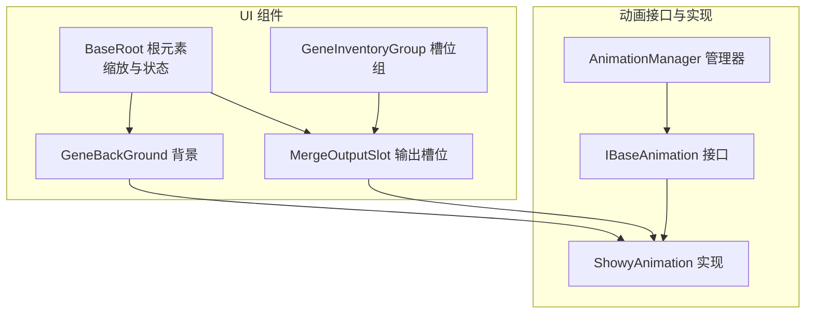
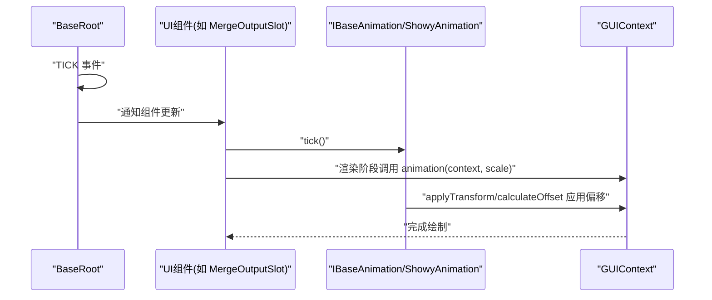
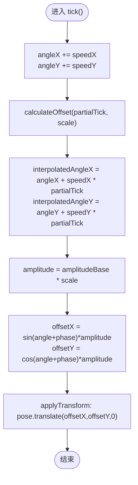
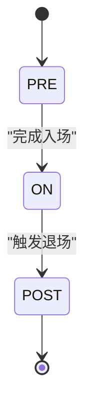
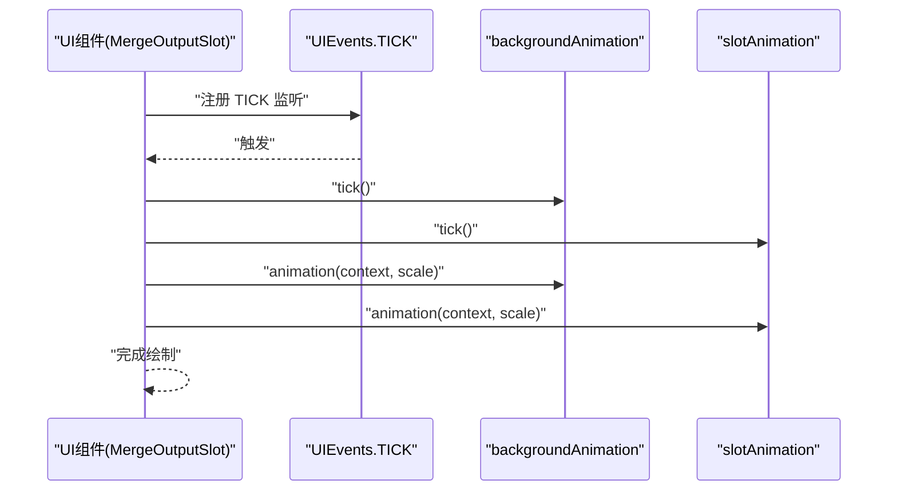
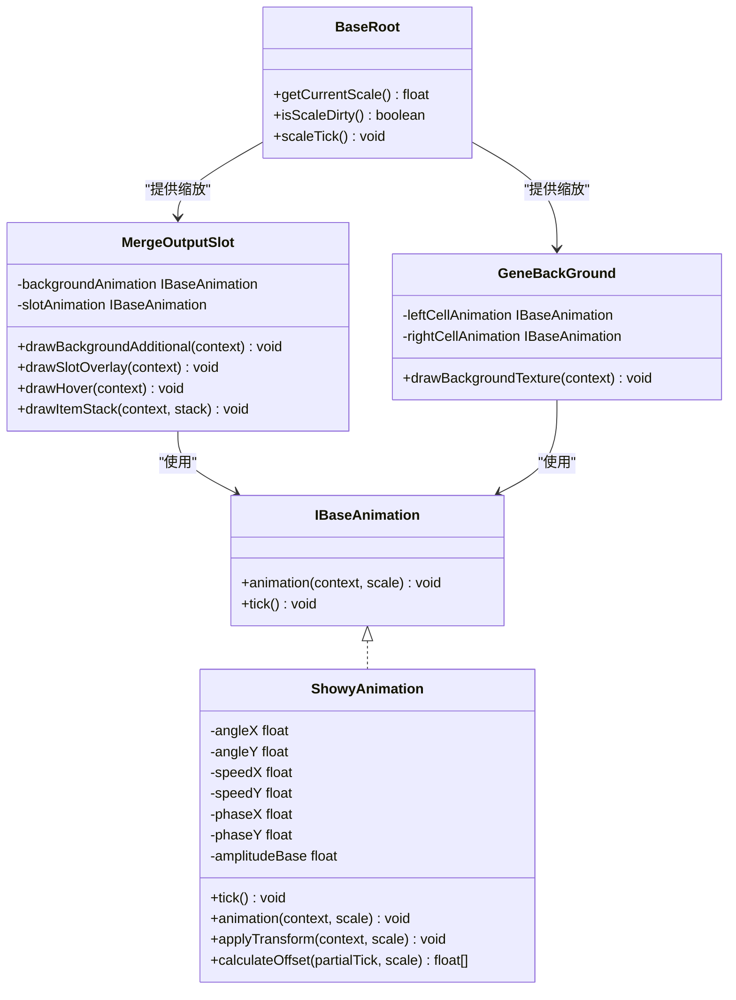

# 动画系统

<cite>
**本文引用的文件**
- [AnimationManager.java](file://Biotech/src/main/java/org/biotech/ui/animation/AnimationManager.java)
- [IBaseAnimation.java](file://Biotech/src/main/java/org/biotech/ui/animation/IBaseAnimation.java)
- [ShowyAnimation.java](file://Biotech/src/main/java/org/biotech/ui/animation/ShowyAnimation.java)
- [BaseRoot.java](file://Biotech/src/main/java/org/biotech/ui/gene_inventroy/element/BaseRoot.java)
- [MergeOutputSlot.java](file://Biotech/src/main/java/org/biotech/ui/gene_inventroy/element/merge/MergeOutputSlot.java)
- [GeneBackGround.java](file://Biotech/src/main/java/org/biotech/ui/gene_inventroy/element/GeneBackGround.java)
- [GeneInventoryGroup.java](file://Biotech/src/main/java/org/biotech/ui/gene_inventroy/group/GeneInventoryGroup.java)
</cite>

## 目录
1. [简介](#简介)
2. [项目结构](#项目结构)
3. [核心组件](#核心组件)
4. [架构总览](#架构总览)
5. [详细组件分析](#详细组件分析)
6. [依赖关系分析](#依赖关系分析)
7. [性能考量](#性能考量)
8. [故障排查指南](#故障排查指南)
9. [结论](#结论)
10. [附录](#附录)

## 简介
本文件系统性阐述基于 ShowyAnimation 的 UI 动画实现机制，覆盖动画状态管理、时间控制与插值算法，生命周期与状态转换，以及创建、播放、暂停与停止等操作。文档还解释 AnimationManager 的动画调度与管理职责、IBaseAnimation 接口的设计原则与实现要求，并提供自定义动画效果的开发指南、性能优化与内存管理策略，以及动画与 UI 组件的集成方式与事件触发机制。

## 项目结构
动画相关代码集中于 Biotech 模块的 UI 层：
- 动画接口与实现：org.biotech.ui.animation
- UI 组件与动画集成：org.biotech.ui.gene_inventroy.element 与 group

图表来源
- [IBaseAnimation.java:1-59](file://Biotech/src/main/java/org/biotech/ui/animation/IBaseAnimation.java#L1-L59)
- [ShowyAnimation.java:1-97](file://Biotech/src/main/java/org/biotech/ui/animation/ShowyAnimation.java#L1-L97)
- [AnimationManager.java:1-7](file://Biotech/src/main/java/org/biotech/ui/animation/AnimationManager.java#L1-L7)
- [BaseRoot.java:1-144](file://Biotech/src/main/java/org/biotech/ui/gene_inventroy/element/BaseRoot.java#L1-L144)
- [MergeOutputSlot.java:1-248](file://Biotech/src/main/java/org/biotech/ui/gene_inventroy/element/merge/MergeOutputSlot.java#L1-L248)
- [GeneBackGround.java:1-367](file://Biotech/src/main/java/org/biotech/ui/gene_inventroy/element/GeneBackGround.java#L1-L367)
- [GeneInventoryGroup.java:1-637](file://Biotech/src/main/java/org/biotech/ui/gene_inventroy/group/GeneInventoryGroup.java#L1-L637)

章节来源
- [IBaseAnimation.java:1-59](file://Biotech/src/main/java/org/biotech/ui/animation/IBaseAnimation.java#L1-L59)
- [ShowyAnimation.java:1-97](file://Biotech/src/main/java/org/biotech/ui/animation/ShowyAnimation.java#L1-L97)
- [AnimationManager.java:1-7](file://Biotech/src/main/java/org/biotech/ui/animation/AnimationManager.java#L1-L7)
- [BaseRoot.java:1-144](file://Biotech/src/main/java/org/biotech/ui/gene_inventroy/element/BaseRoot.java#L1-L144)
- [MergeOutputSlot.java:1-248](file://Biotech/src/main/java/org/biotech/ui/gene_inventroy/element/merge/MergeOutputSlot.java#L1-L248)
- [GeneBackGround.java:1-367](file://Biotech/src/main/java/org/biotech/ui/gene_inventroy/element/GeneBackGround.java#L1-L367)
- [GeneInventoryGroup.java:1-637](file://Biotech/src/main/java/org/biotech/ui/gene_inventroy/group/GeneInventoryGroup.java#L1-L637)

## 核心组件
- IBaseAnimation：定义动画的统一契约，规定动画应用与每 tick 更新的职责。
- ShowyAnimation：基于正弦/余弦的浮动动画实现，支持独立 X/Y 轴参数与幅度缩放。
- AnimationManager：当前为空实现，预留动画调度与管理职责。
- BaseRoot：根 UI 元素，负责整体缩放与 UI 动画状态（PRE/ON/POST），并驱动缩放 tick。
- 各 UI 组件：如 MergeOutputSlot、GeneBackGround 等，通过监听 UIEvents.TICK 驱动动画更新，并在渲染阶段应用动画。

章节来源
- [IBaseAnimation.java:42-58](file://Biotech/src/main/java/org/biotech/ui/animation/IBaseAnimation.java#L42-L58)
- [ShowyAnimation.java:11-97](file://Biotech/src/main/java/org/biotech/ui/animation/ShowyAnimation.java#L11-L97)
- [AnimationManager.java:3-6](file://Biotech/src/main/java/org/biotech/ui/animation/AnimationManager.java#L3-L6)
- [BaseRoot.java:17-142](file://Biotech/src/main/java/org/biotech/ui/gene_inventroy/element/BaseRoot.java#L17-L142)
- [MergeOutputSlot.java:90-94](file://Biotech/src/main/java/org/biotech/ui/gene_inventroy/element/merge/MergeOutputSlot.java#L90-L94)
- [GeneBackGround.java:90-94](file://Biotech/src/main/java/org/biotech/ui/gene_inventroy/element/GeneBackGround.java#L90-L94)

## 架构总览
动画系统围绕“事件驱动 + 插值 + 状态管理”的模式构建：
- 时间控制：通过 UIEvents.TICK 事件驱动，tick() 实现帧率无关更新。
- 插值算法：在计算偏移时使用 partialTick 进行插值，保证画面流畅。
- 状态管理：BaseRoot 提供 UIAnimationState（PRE/ON/POST）与缩放状态，配合 scaleDirty 标记避免重复计算。
- 渲染应用：animation(context, scale) 将变换应用于 PoseStack，实现浮动、视差等效果。

图表来源
- [BaseRoot.java:28-32](file://Biotech/src/main/java/org/biotech/ui/gene_inventroy/element/BaseRoot.java#L28-L32)
- [MergeOutputSlot.java:90-94](file://Biotech/src/main/java/org/biotech/ui/gene_inventroy/element/merge/MergeOutputSlot.java#L90-L94)
- [ShowyAnimation.java:58-67](file://Biotech/src/main/java/org/biotech/ui/animation/ShowyAnimation.java#L58-L67)
- [IBaseAnimation.java:50](file://Biotech/src/main/java/org/biotech/ui/animation/IBaseAnimation.java#L50)

## 详细组件分析

### IBaseAnimation 接口
- 设计原则
  - 抽象化：动画实例以接口类型声明，便于运行时替换实现。
  - 解耦：更新与应用分离，更新通过 TICK 事件驱动，应用在渲染阶段调用。
  - 可扩展：支持按 scale 调整幅度，适配不同 UI 缩放。
- 实现要求
  - tick()：实现帧率无关的状态推进。
  - animation(context, scale)：将变换应用到 GUIContext 的 pose 矩阵。

章节来源
- [IBaseAnimation.java:5-14](file://Biotech/src/main/java/org/biotech/ui/animation/IBaseAnimation.java#L5-L14)
- [IBaseAnimation.java:42-58](file://Biotech/src/main/java/org/biotech/ui/animation/IBaseAnimation.java#L42-L58)

### ShowyAnimation 实现
- 状态与参数
  - 角度状态：angleX、angleY，随速度累加。
  - 参数：speedX/speedY（速度）、phaseX/phaseY（相位）、amplitudeBase（基础幅度）。
- 时间控制与插值
  - tick()：每 tick 累加角度。
  - calculateOffset(partialTick, scale)：使用 partialTick 对角度进行线性插值，得到平滑的浮动偏移。
- 渲染应用
  - applyTransform(context, scale)：将计算出的偏移 translate 到 pose 矩阵。
  - 幅度随 scale 线性缩放，保证在不同缩放下视觉一致。

图表来源
- [ShowyAnimation.java:58-61](file://Biotech/src/main/java/org/biotech/ui/animation/ShowyAnimation.java#L58-L61)
- [ShowyAnimation.java:85-95](file://Biotech/src/main/java/org/biotech/ui/animation/ShowyAnimation.java#L85-L95)
- [ShowyAnimation.java:74-77](file://Biotech/src/main/java/org/biotech/ui/animation/ShowyAnimation.java#L74-L77)

章节来源
- [ShowyAnimation.java:11-52](file://Biotech/src/main/java/org/biotech/ui/animation/ShowyAnimation.java#L11-L52)
- [ShowyAnimation.java:58-95](file://Biotech/src/main/java/org/biotech/ui/animation/ShowyAnimation.java#L58-L95)

### AnimationManager 管理器
- 当前状态：空实现，预留未来承担全局动画调度、生命周期管理与资源回收职责。
- 建议职责
  - 注册/注销动画实例。
  - 统一 TICK 分发与优先级排序。
  - 提供动画暂停/恢复/停止的统一入口。
  - 管理动画池与对象复用，降低 GC 压力。

章节来源
- [AnimationManager.java:3-6](file://Biotech/src/main/java/org/biotech/ui/animation/AnimationManager.java#L3-L6)

### BaseRoot 根元素与 UI 动画状态
- 缩放与状态
  - 监听 TICK，检测父容器尺寸变化，计算缩放因子并更新布局。
  - 提供 UIAnimationState（PRE/ON/POST）枚举，用于控制入场、静止与退场动画阶段。
  - scaleDirty 标记避免重复缩放计算。
- 与动画的关系
  - 通过 getCurrentScale() 提供当前缩放，供动画计算幅度使用。
  - 作为动画更新的统一触发源之一。

图表来源
- [BaseRoot.java:127-142](file://Biotech/src/main/java/org/biotech/ui/gene_inventroy/element/BaseRoot.java#L127-L142)

章节来源
- [BaseRoot.java:28-120](file://Biotech/src/main/java/org/biotech/ui/gene_inventroy/element/BaseRoot.java#L28-L120)

### UI 组件中的动画集成
- MergeOutputSlot
  - 在 TICK 事件中分别驱动背景与槽位动画的 tick()。
  - 在 drawBackgroundAdditional、drawSlotOverlay、drawHover、drawItemStack 中按需应用动画。
  - 使用 scale 控制动画幅度，确保不同缩放下视觉一致。
- GeneBackGround
  - 在 TICK 事件中驱动左右细胞动画与气泡管理器的 tick()。
  - 通过匿名内部类重写 drawBackgroundTexture/drawBackgroundAdditional 应用动画。
  - 背景支持视差效果（基于鼠标位置与背景缩放）。

图表来源
- [MergeOutputSlot.java:90-94](file://Biotech/src/main/java/org/biotech/ui/gene_inventroy/element/merge/MergeOutputSlot.java#L90-L94)
- [MergeOutputSlot.java:118-145](file://Biotech/src/main/java/org/biotech/ui/gene_inventroy/element/merge/MergeOutputSlot.java#L118-L145)
- [GeneBackGround.java:90-94](file://Biotech/src/main/java/org/biotech/ui/gene_inventroy/element/GeneBackGround.java#L90-L94)

章节来源
- [MergeOutputSlot.java:74-178](file://Biotech/src/main/java/org/biotech/ui/gene_inventroy/element/merge/MergeOutputSlot.java#L74-L178)
- [GeneBackGround.java:96-146](file://Biotech/src/main/java/org/biotech/ui/gene_inventroy/element/GeneBackGround.java#L96-L146)

### 槽位组与页面管理中的动画
- GeneInventoryGroup/PageSlotContainer
  - 在 drawBackgroundAdditional 中按页面绘制槽位背景与悬停效果。
  - 通过 scale() 传递缩放，保证动画幅度一致性。
- 与动画的衔接
  - 页面切换与缩放由 BaseRoot 驱动，组件在渲染阶段应用动画，形成统一的时间轴。

章节来源
- [GeneInventoryGroup.java:260-270](file://Biotech/src/main/java/org/biotech/ui/gene_inventroy/group/GeneInventoryGroup.java#L260-L270)
- [GeneInventoryGroup.java:358-377](file://Biotech/src/main/java/org/biotech/ui/gene_inventroy/group/GeneInventoryGroup.java#L358-L377)
- [GeneInventoryGroup.java:224-253](file://Biotech/src/main/java/org/biotech/ui/gene_inventroy/group/GeneInventoryGroup.java#L224-L253)

## 依赖关系分析
- 组件耦合
  - UI 组件依赖 IBaseAnimation 接口，解耦具体实现。
  - ShowyAnimation 依赖 GUIContext 的 pose 矩阵，实现变换应用。
  - BaseRoot 作为根元素，影响所有子组件的缩放与状态。
- 外部依赖
  - 低拖动画库（LowDragLib2）提供 GUIContext、UIElement、事件系统等基础设施。
- 循环依赖
  - 当前结构无明显循环依赖；AnimationManager 为空实现，避免引入额外耦合。

图表来源
- [IBaseAnimation.java:42-58](file://Biotech/src/main/java/org/biotech/ui/animation/IBaseAnimation.java#L42-L58)
- [ShowyAnimation.java:11-97](file://Biotech/src/main/java/org/biotech/ui/animation/ShowyAnimation.java#L11-L97)
- [BaseRoot.java:17-120](file://Biotech/src/main/java/org/biotech/ui/gene_inventroy/element/BaseRoot.java#L17-L120)
- [MergeOutputSlot.java:66-68](file://Biotech/src/main/java/org/biotech/ui/gene_inventroy/element/merge/MergeOutputSlot.java#L66-L68)
- [GeneBackGround.java:65-66](file://Biotech/src/main/java/org/biotech/ui/gene_inventroy/element/GeneBackGround.java#L65-L66)

## 性能考量
- 帧率无关更新
  - 通过 TICK 事件与 partialTick 插值，避免受帧率波动影响，保证动画平滑。
- 对象与内存
  - AnimationManager 建议引入对象池与复用策略，减少频繁创建销毁带来的 GC 压力。
  - 气泡管理器（BubbleManager）已采用对象池与可见性复用，可作为模板。
- 渲染开销
  - 将动画应用集中在 PoseStack 上，尽量减少额外状态切换。
  - 在不需要时跳过动画应用，例如空槽位或隐藏元素。
- 缩放一致性
  - 通过 BaseRoot 的 getCurrentScale() 与 scaleDirty 标记，避免重复计算缩放。

章节来源
- [ShowyAnimation.java:85-95](file://Biotech/src/main/java/org/biotech/ui/animation/ShowyAnimation.java#L85-L95)
- [BaseRoot.java:110-120](file://Biotech/src/main/java/org/biotech/ui/gene_inventroy/element/BaseRoot.java#L110-L120)
- [GeneBackGround.java:251-259](file://Biotech/src/main/java/org/biotech/ui/gene_inventroy/element/GeneBackGround.java#L251-L259)

## 故障排查指南
- 动画不生效
  - 确认组件已注册 TICK 事件监听并调用 tick()。
  - 确认在渲染阶段调用了 animation(context, scale)。
- 动画卡顿或抖动
  - 检查是否正确使用 partialTick 进行插值。
  - 避免在渲染阶段做重型计算，将结果缓存到 tick() 中。
- 缩放异常
  - 检查 BaseRoot 的缩放计算与 scaleDirty 标记是否正确消费。
  - 确保组件 scale() 方法同步更新布局与动画幅度。
- 内存泄漏或 GC 抖动
  - 使用对象池复用 UIElement 与动画实例。
  - 对一次性动画（如气泡）在播放结束后及时 setVisible(false) 并移除事件监听。

章节来源
- [MergeOutputSlot.java:90-94](file://Biotech/src/main/java/org/biotech/ui/gene_inventroy/element/merge/MergeOutputSlot.java#L90-L94)
- [ShowyAnimation.java:85-95](file://Biotech/src/main/java/org/biotech/ui/animation/ShowyAnimation.java#L85-L95)
- [BaseRoot.java:110-120](file://Biotech/src/main/java/org/biotech/ui/gene_inventroy/element/BaseRoot.java#L110-L120)
- [GeneBackGround.java:323-334](file://Biotech/src/main/java/org/biotech/ui/gene_inventroy/element/GeneBackGround.java#L323-L334)

## 结论
本动画系统以 IBaseAnimation 为核心接口，ShowyAnimation 提供可复用的浮动动画实现，结合 UIEvents.TICK 的事件驱动与 partialTick 插值，实现了帧率无关且平滑的动画效果。BaseRoot 提供统一的缩放与状态管理，确保动画在不同 UI 缩放下的一致性。建议后续完善 AnimationManager 的调度与管理能力，并持续优化对象池与内存策略，以获得更佳的性能表现。

## 附录
- 开发自定义动画的步骤
  - 实现 IBaseAnimation 接口，定义状态字段与 tick() 更新逻辑。
  - 在 animation(context, scale) 中将变换应用到 GUIContext.pose。
  - 在 UI 组件中注册 TICK 事件监听并在渲染阶段调用 animation。
  - 使用 BaseRoot 的缩放信息控制动画幅度，确保跨分辨率一致性。
- 最佳实践
  - 将与时间相关的状态推进放在 tick()，渲染阶段只做应用。
  - 使用对象池与可见性复用，避免频繁创建销毁。
  - 对一次性动画在播放完成后清理事件监听与可见性。