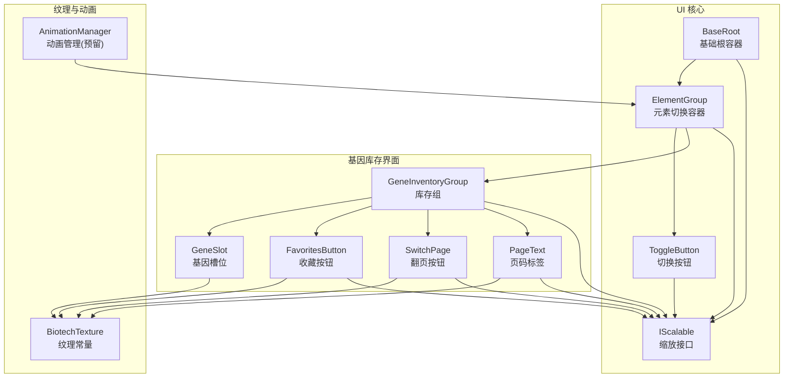
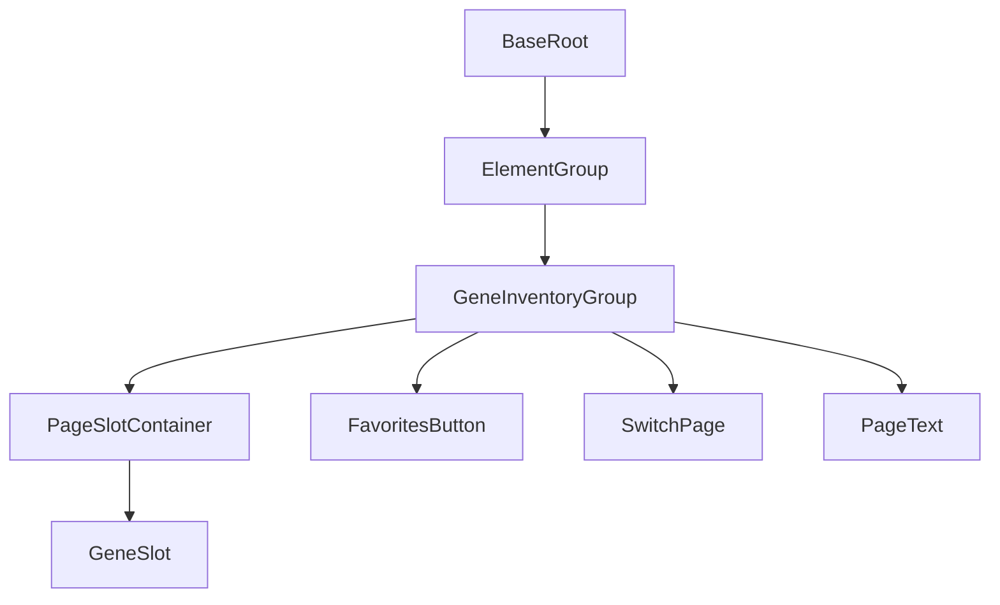
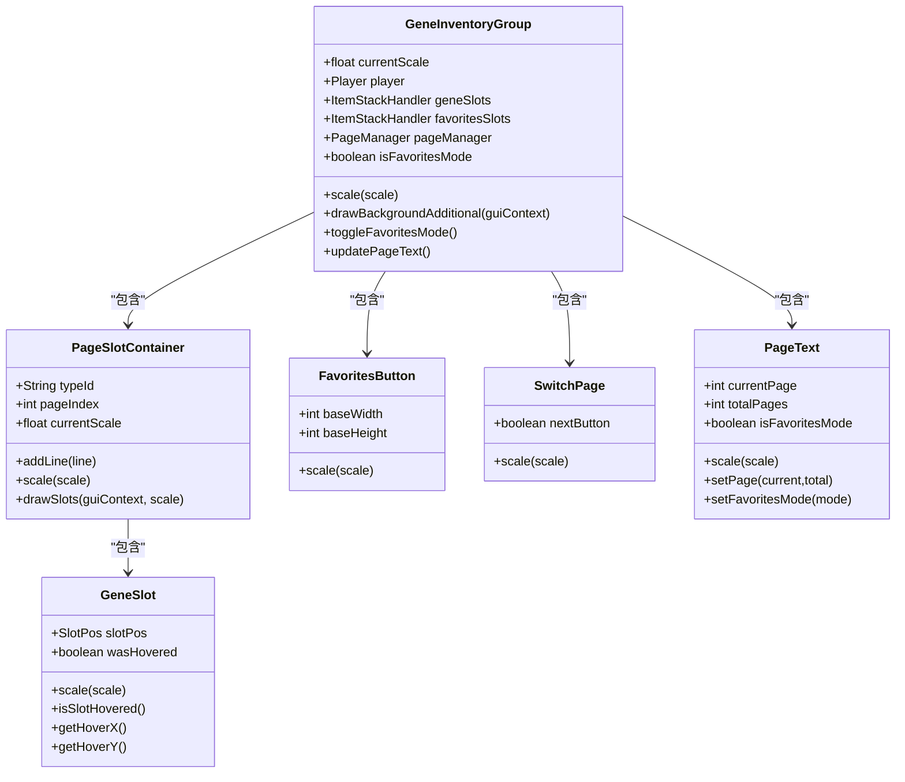
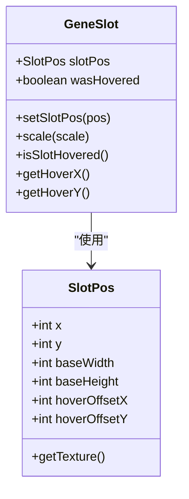
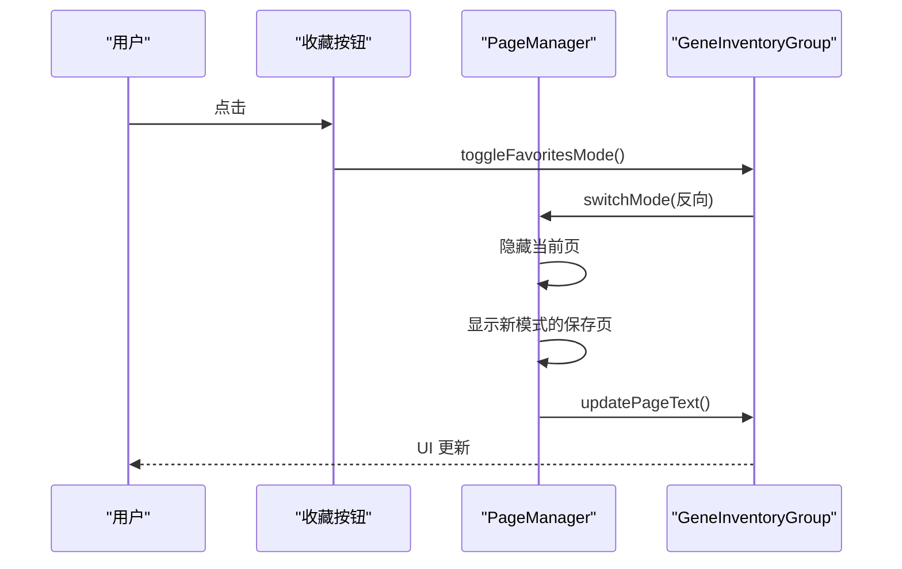
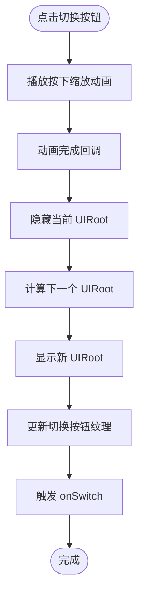
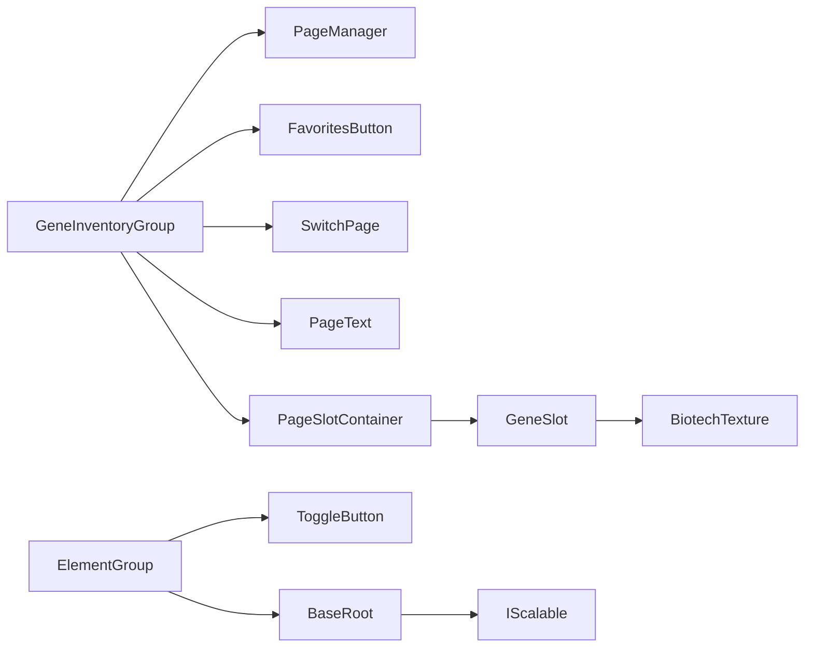

# 用户界面系统

<cite>
**本文引用的文件**
- [BiotechTexture.java](file://Biotech/src/main/java/org/biotech/ui/BiotechTexture.java)
- [IScalable.java](file://Biotech/src/main/java/org/biotech/ui/IScalable.java)
- [AnimationManager.java](file://Biotech/src/main/java/org/biotech/ui/animation/AnimationManager.java)
- [ElementGroup.java](file://Biotech/src/main/java/org/biotech/ui/gene_inventroy/group/ElementGroup.java)
- [BaseRoot.java](file://Biotech/src/main/java/org/biotech/ui/gene_inventroy/element/BaseRoot.java)
- [ToggleButton.java](file://Biotech/src/main/java/org/biotech/ui/gene_inventroy/element/ToggleButton.java)
- [GeneInventoryGroup.java](file://Biotech/src/main/java/org/biotech/ui/gene_inventroy/group/GeneInventoryGroup.java)
- [GeneSlot.java](file://Biotech/src/main/java/org/biotech/ui/gene_inventroy/element/inventory/GeneSlot.java)
- [FavoritesButton.java](file://Biotech/src/main/java/org/biotech/ui/gene_inventroy/element/inventory/FavoritesButton.java)
- [SwitchPage.java](file://Biotech/src/main/java/org/biotech/ui/gene_inventroy/element/inventory/SwitchPage.java)
- [PageText.java](file://Biotech/src/main/java/org/biotech/ui/gene_inventroy/element/inventory/PageText.java)
</cite>

## 目录
1. [简介](#简介)
2. [项目结构](#项目结构)
3. [核心组件](#核心组件)
4. [架构总览](#架构总览)
5. [详细组件分析](#详细组件分析)
6. [依赖分析](#依赖分析)
7. [性能考虑](#性能考虑)
8. [故障排查指南](#故障排查指南)
9. [结论](#结论)
10. [附录](#附录)

## 简介
本文件面向基于 LowDragLib2 的用户界面系统，围绕基因库存界面、合并界面、收藏夹功能展开，系统化阐述 UI 组件架构、动画系统、纹理管理与交互设计。文档覆盖 UI 元素层次结构、事件处理机制、响应式设计与可访问性支持，并提供组件自定义与扩展指南、与游戏引擎的集成方式、渲染优化与性能考量，以及调试工具使用与常见问题解决方案。

## 项目结构
UI 子系统位于 Biotech 模块 org.biotech.ui 包下，采用分层组织：
- 纹理与可缩放接口：BiotechTexture、IScalable
- 动画框架：AnimationManager（预留）
- 通用根容器与切换容器：BaseRoot、ElementGroup
- 基因库存界面：GeneInventoryGroup 及其子元素（槽位、收藏按钮、翻页按钮、页码标签）
- 交互元素：ToggleButton、SwitchPage、PageText、FavoritesButton
- 纹理资源：GUI 图集、背景、DNA、气泡动画等

图表来源
- [BaseRoot.java:13-144](file://Biotech/src/main/java/org/biotech/ui/gene_inventroy/element/BaseRoot.java#L13-L144)
- [ElementGroup.java:26-219](file://Biotech/src/main/java/org/biotech/ui/gene_inventroy/group/ElementGroup.java#L26-L219)
- [ToggleButton.java:6-27](file://Biotech/src/main/java/org/biotech/ui/gene_inventroy/element/ToggleButton.java#L6-L27)
- [GeneInventoryGroup.java:48-637](file://Biotech/src/main/java/org/biotech/ui/gene_inventroy/group/GeneInventoryGroup.java#L48-L637)
- [GeneSlot.java:15-130](file://Biotech/src/main/java/org/biotech/ui/gene_inventroy/element/inventory/GeneSlot.java#L15-L130)
- [FavoritesButton.java:13-56](file://Biotech/src/main/java/org/biotech/ui/gene_inventroy/element/inventory/FavoritesButton.java#L13-L56)
- [SwitchPage.java:23-72](file://Biotech/src/main/java/org/biotech/ui/gene_inventroy/element/inventory/SwitchPage.java#L23-L72)
- [PageText.java:21-102](file://Biotech/src/main/java/org/biotech/ui/gene_inventroy/element/inventory/PageText.java#L21-L102)
- [BiotechTexture.java:12-39](file://Biotech/src/main/java/org/biotech/ui/BiotechTexture.java#L12-L39)
- [AnimationManager.java:3-7](file://Biotech/src/main/java/org/biotech/ui/animation/AnimationManager.java#L3-L7)
- [IScalable.java:5-9](file://Biotech/src/main/java/org/biotech/ui/IScalable.java#L5-L9)

章节来源
- [BiotechTexture.java:12-39](file://Biotech/src/main/java/org/biotech/ui/BiotechTexture.java#L12-L39)
- [IScalable.java:5-9](file://Biotech/src/main/java/org/biotech/ui/IScalable.java#L5-L9)
- [AnimationManager.java:3-7](file://Biotech/src/main/java/org/biotech/ui/animation/AnimationManager.java#L3-L7)
- [ElementGroup.java:26-219](file://Biotech/src/main/java/org/biotech/ui/gene_inventroy/group/ElementGroup.java#L26-L219)
- [BaseRoot.java:13-144](file://Biotech/src/main/java/org/biotech/ui/gene_inventroy/element/BaseRoot.java#L13-L144)
- [ToggleButton.java:6-27](file://Biotech/src/main/java/org/biotech/ui/gene_inventroy/element/ToggleButton.java#L6-L27)
- [GeneInventoryGroup.java:48-637](file://Biotech/src/main/java/org/biotech/ui/gene_inventroy/group/GeneInventoryGroup.java#L48-L637)
- [GeneSlot.java:15-130](file://Biotech/src/main/java/org/biotech/ui/gene_inventroy/element/inventory/GeneSlot.java#L15-L130)
- [FavoritesButton.java:13-56](file://Biotech/src/main/java/org/biotech/ui/gene_inventroy/element/inventory/FavoritesButton.java#L13-L56)
- [SwitchPage.java:23-72](file://Biotech/src/main/java/org/biotech/ui/gene_inventroy/element/inventory/SwitchPage.java#L23-L72)
- [PageText.java:21-102](file://Biotech/src/main/java/org/biotech/ui/gene_inventroy/element/inventory/PageText.java#L21-L102)

## 核心组件
- 基础根容器 BaseRoot：负责按比例缩放与全屏填充，维护 UI 动画阶段状态，提供缩放脏标记与消费机制，确保子 UI 在不同分辨率下保持正确比例。
- 元素切换容器 ElementGroup：管理多个 UIRoot 的切换，内置切换按钮，支持动画过渡与纹理切换；通过监听 Tick 事件同步缩放比例。
- 可缩放接口 IScalable：统一缩放行为，便于按钮、标签、槽位等组件按比例缩放。
- 纹理常量 BiotechTexture：集中管理 UI 图集与切片纹理，提供九宫格拉伸与动画帧资源。
- 动画管理 AnimationManager：预留扩展点，未来可接入具体动画序列与缓动曲线。

章节来源
- [BaseRoot.java:13-144](file://Biotech/src/main/java/org/biotech/ui/gene_inventroy/element/BaseRoot.java#L13-L144)
- [ElementGroup.java:26-219](file://Biotech/src/main/java/org/biotech/ui/gene_inventroy/group/ElementGroup.java#L26-L219)
- [IScalable.java:5-9](file://Biotech/src/main/java/org/biotech/ui/IScalable.java#L5-L9)
- [BiotechTexture.java:12-39](file://Biotech/src/main/java/org/biotech/ui/BiotechTexture.java#L12-L39)
- [AnimationManager.java:3-7](file://Biotech/src/main/java/org/biotech/ui/animation/AnimationManager.java#L3-L7)

## 架构总览
UI 系统以 LowDragLib2 为基础，采用“容器-元素”层级结构：
- 根容器 BaseRoot 负责响应式缩放与动画阶段
- ElementGroup 提供多面板切换能力，内部按钮与内容区域分离，保证交互优先级
- 基因库存界面 GeneInventoryGroup 作为复杂容器，内部包含页容器 PageSlotContainer、行容器 GeneInventoryLine、槽位 GeneSlot 与功能按钮（收藏、翻页、页码）

图表来源
- [BaseRoot.java:13-144](file://Biotech/src/main/java/org/biotech/ui/gene_inventroy/element/BaseRoot.java#L13-L144)
- [ElementGroup.java:26-219](file://Biotech/src/main/java/org/biotech/ui/gene_inventroy/group/ElementGroup.java#L26-L219)
- [GeneInventoryGroup.java:48-637](file://Biotech/src/main/java/org/biotech/ui/gene_inventroy/group/GeneInventoryGroup.java#L48-L637)

## 详细组件分析

### 基因库存界面（GeneInventoryGroup）
- 结构与布局
  - 采用纵向堆叠布局，分为“槽位容器”和“功能区容器”
  - 槽位容器内包含多个 PageSlotContainer，每个容器承载一行或一组槽位
  - 功能区包含收藏按钮、左右翻页按钮与页码标签
- 页面管理
  - PageManager 独立维护普通模式与收藏模式的页码状态，支持循环翻页与跳转
  - 通过 setVisible 控制当前模式下某页的显示，首次初始化时仅显示对应模式的第一页
- 渲染与交互
  - drawBackgroundAdditional 在当前页绘制槽位背景与悬停效果，避免重复绘制
  - 槽位绘制叠加物品图标与特性计数徽章（罗马数字）
- 数据与配置
  - 通过 BiotechAPI 获取玩家基因库存数据，支持普通与收藏两套槽位处理器
  - 布局常量来自 PlayerGeneInventoryData，确保与服务端/配置一致

图表来源
- [GeneInventoryGroup.java:48-637](file://Biotech/src/main/java/org/biotech/ui/gene_inventroy/group/GeneInventoryGroup.java#L48-L637)
- [GeneSlot.java:15-130](file://Biotech/src/main/java/org/biotech/ui/gene_inventroy/element/inventory/GeneSlot.java#L15-L130)
- [FavoritesButton.java:13-56](file://Biotech/src/main/java/org/biotech/ui/gene_inventroy/element/inventory/FavoritesButton.java#L13-L56)
- [SwitchPage.java:23-72](file://Biotech/src/main/java/org/biotech/ui/gene_inventroy/element/inventory/SwitchPage.java#L23-L72)
- [PageText.java:21-102](file://Biotech/src/main/java/org/biotech/ui/gene_inventroy/element/inventory/PageText.java#L21-L102)

章节来源
- [GeneInventoryGroup.java:48-637](file://Biotech/src/main/java/org/biotech/ui/gene_inventroy/group/GeneInventoryGroup.java#L48-L637)

### 槽位系统（GeneSlot）
- 位置样式与纹理映射
  - 支持 Left/Middle/Right 三种位置，分别映射不同纹理坐标与悬停偏移
  - 通过 SlotPos 枚举统一管理纹理切片与偏移
- 交互与缩放
  - 重写 scale 方法，按比例调整布局尺寸与内边距
  - 提供 isSlotHovered 与 hover 坐标计算，便于上层绘制悬停覆盖层

图表来源
- [GeneSlot.java:15-130](file://Biotech/src/main/java/org/biotech/ui/gene_inventroy/element/inventory/GeneSlot.java#L15-L130)

章节来源
- [GeneSlot.java:15-130](file://Biotech/src/main/java/org/biotech/ui/gene_inventroy/element/inventory/GeneSlot.java#L15-L130)

### 收藏与翻页交互
- 收藏按钮 FavoritesButton
  - 三态纹理（普通/悬停/按下），隐藏文字，仅图标展示
  - 实现 IScalable 接口，随根容器缩放
- 翻页按钮 SwitchPage
  - 左右区分，三态纹理，隐藏文字
  - 通过 PageManager 切换页码，支持循环
- 页码标签 PageText
  - 九宫格背景纹理，文本居中，支持模式切换提示
  - 自动根据当前页与总页数更新显示

图表来源
- [FavoritesButton.java:13-56](file://Biotech/src/main/java/org/biotech/ui/gene_inventroy/element/inventory/FavoritesButton.java#L13-L56)
- [GeneInventoryGroup.java:503-637](file://Biotech/src/main/java/org/biotech/ui/gene_inventroy/group/GeneInventoryGroup.java#L503-L637)

章节来源
- [FavoritesButton.java:13-56](file://Biotech/src/main/java/org/biotech/ui/gene_inventroy/element/inventory/FavoritesButton.java#L13-L56)
- [SwitchPage.java:23-72](file://Biotech/src/main/java/org/biotech/ui/gene_inventroy/element/inventory/SwitchPage.java#L23-L72)
- [PageText.java:21-102](file://Biotech/src/main/java/org/biotech/ui/gene_inventroy/element/inventory/PageText.java#L21-L102)
- [GeneInventoryGroup.java:503-637](file://Biotech/src/main/java/org/biotech/ui/gene_inventroy/group/GeneInventoryGroup.java#L503-L637)

### 切换容器与动画（ElementGroup）
- 切换逻辑
  - 内置 ToggleButton，点击时播放缩放动画，随后执行 preSwitch
  - preSwitch 隐藏当前 UIRoot，切换到下一个，更新按钮纹理并触发 onSwitch
- 缩放同步
  - 监听 UIEvents.TICK，读取当前 UIRoot 的缩放值并同步到按钮尺寸

图表来源
- [ElementGroup.java:88-121](file://Biotech/src/main/java/org/biotech/ui/gene_inventroy/group/ElementGroup.java#L88-L121)
- [ElementGroup.java:179-216](file://Biotech/src/main/java/org/biotech/ui/gene_inventroy/group/ElementGroup.java#L179-L216)

章节来源
- [ElementGroup.java:26-219](file://Biotech/src/main/java/org/biotech/ui/gene_inventroy/group/ElementGroup.java#L26-L219)
- [ToggleButton.java:6-27](file://Biotech/src/main/java/org/biotech/ui/gene_inventroy/element/ToggleButton.java#L6-L27)

### 响应式设计与可访问性
- 响应式
  - BaseRoot 通过 calculateScaleFactor 与对象填充策略（contain）保持宽高比
  - IScalable 接口统一缩放，确保按钮、标签、槽位等元素按比例缩放
- 可访问性
  - 交互元素均提供三态纹理，便于视觉识别
  - 文本颜色与背景九宫格纹理提升对比度

章节来源
- [BaseRoot.java:39-103](file://Biotech/src/main/java/org/biotech/ui/gene_inventroy/element/BaseRoot.java#L39-L103)
- [IScalable.java:5-9](file://Biotech/src/main/java/org/biotech/ui/IScalable.java#L5-L9)
- [PageText.java:44-60](file://Biotech/src/main/java/org/biotech/ui/gene_inventroy/element/inventory/PageText.java#L44-L60)

### 纹理管理与渲染优化
- 纹理资源
  - BiotechTexture 统一管理 GUI 图集、背景、DNA、气泡动画等资源
  - 使用 SpriteTexture 与九宫格切片（Button_Slice）实现平铺与拉伸
- 渲染流程
  - PageSlotContainer.drawSlots 分层绘制：先背景、再物品图标、后悬停覆盖
  - 仅在非悬停槽位绘制背景，减少无效绘制
  - 特性计数徽章使用罗马数字，字体缩放与坐标微调保证清晰度

章节来源
- [BiotechTexture.java:12-39](file://Biotech/src/main/java/org/biotech/ui/BiotechTexture.java#L12-L39)
- [GeneInventoryGroup.java:382-491](file://Biotech/src/main/java/org/biotech/ui/gene_inventroy/group/GeneInventoryGroup.java#L382-L491)

### 合并界面（概念说明）
- 当前仓库未提供合并界面的具体实现代码，但可基于现有 UI 架构进行扩展：
  - 参考 GeneInventoryGroup 的页面容器与事件绑定方式，新增合并输入输出槽位组
  - 使用 PageManager 管理合并流程的步骤页
  - 通过 Texture 与九宫格切片实现输入输出槽位的背景与高亮效果

[本节为概念性说明，不直接分析具体文件，故无章节来源]

## 依赖分析
- 组件耦合
  - GeneInventoryGroup 与 PageManager 强耦合，负责页面状态与可见性控制
  - 槽位系统与纹理资源紧密耦合，通过 SlotPos 与 BiotechTexture 协作
- 外部依赖
  - LowDragLib2 提供 UIElement、Button、Label、SpriteTexture、九宫格切片等基础能力
  - Taffy 布局引擎提供 Flex 布局与绝对定位
- 循环依赖
  - 未发现循环导入；组件间通过接口（IScalable）与组合关系解耦

图表来源
- [GeneInventoryGroup.java:48-637](file://Biotech/src/main/java/org/biotech/ui/gene_inventroy/group/GeneInventoryGroup.java#L48-L637)
- [ElementGroup.java:26-219](file://Biotech/src/main/java/org/biotech/ui/gene_inventroy/group/ElementGroup.java#L26-L219)
- [BaseRoot.java:13-144](file://Biotech/src/main/java/org/biotech/ui/gene_inventroy/element/BaseRoot.java#L13-L144)
- [IScalable.java:5-9](file://Biotech/src/main/java/org/biotech/ui/IScalable.java#L5-L9)
- [BiotechTexture.java:12-39](file://Biotech/src/main/java/org/biotech/ui/BiotechTexture.java#L12-L39)

章节来源
- [GeneInventoryGroup.java:48-637](file://Biotech/src/main/java/org/biotech/ui/gene_inventroy/group/GeneInventoryGroup.java#L48-L637)
- [ElementGroup.java:26-219](file://Biotech/src/main/java/org/biotech/ui/gene_inventroy/group/ElementGroup.java#L26-L219)
- [BaseRoot.java:13-144](file://Biotech/src/main/java/org/biotech/ui/gene_inventroy/element/BaseRoot.java#L13-L144)
- [IScalable.java:5-9](file://Biotech/src/main/java/org/biotech/ui/IScalable.java#L5-L9)
- [BiotechTexture.java:12-39](file://Biotech/src/main/java/org/biotech/ui/BiotechTexture.java#L12-L39)

## 性能考虑
- 渲染优化
  - 仅在非悬停槽位绘制背景，避免重复绘制
  - 悬停效果仅在悬停槽位绘制，降低绘制开销
  - 使用九宫格切片纹理减少重复像素数据
- 布局与缩放
  - BaseRoot 仅在父容器尺寸变化时更新缩放，避免频繁重算
  - IScalable 组件批量缩放，减少布局抖动
- 动画
  - ElementGroup 的切换动画采用短时序与缓动函数，保证流畅与低开销
  - 未来可在 AnimationManager 中引入缓动队列与复用机制

[本节为通用性能建议，不直接分析具体文件，故无章节来源]

## 故障排查指南
- 界面比例异常
  - 检查 BaseRoot 的父容器尺寸与 calculateScaleFactor 输入
  - 确认 scaleDirty 标记被正确消费（getCurrentScale）
- 槽位纹理错位
  - 核对 SlotPos 的纹理坐标与 hoverOffset 是否匹配
  - 确保 drawSlotOverlay 与 drawSlotHover 的坐标与缩放一致
- 页面切换无效
  - 检查 PageManager 的当前模式与页码范围
  - 确认 setPageVisible 的 typeId 与 pageIndex 对应关系
- 点击事件未响应
  - 确认按钮层级在最上层（ElementGroup 中先添加容器，后添加按钮）
  - 检查按钮样式与纹理是否正确设置

章节来源
- [BaseRoot.java:39-120](file://Biotech/src/main/java/org/biotech/ui/gene_inventroy/element/BaseRoot.java#L39-L120)
- [GeneSlot.java:103-128](file://Biotech/src/main/java/org/biotech/ui/gene_inventroy/element/inventory/GeneSlot.java#L103-L128)
- [GeneInventoryGroup.java:503-637](file://Biotech/src/main/java/org/biotech/ui/gene_inventroy/group/GeneInventoryGroup.java#L503-L637)
- [ElementGroup.java:73-121](file://Biotech/src/main/java/org/biotech/ui/gene_inventroy/group/ElementGroup.java#L73-L121)

## 结论
本 UI 系统以 LowDragLib2 为核心，构建了可缩放、可扩展且具有良好渲染性能的界面框架。基因库存界面通过 PageManager 实现双模式（普通/收藏）与翻页管理，结合槽位系统与九宫格纹理，提供了直观的交互体验。ElementGroup 提供了灵活的面板切换能力，为合并界面等后续功能预留了良好扩展空间。通过统一的缩放接口与纹理管理，系统在多分辨率环境下具备良好的适应性与可维护性。

## 附录
- 自定义指南
  - 新增 UIRoot：继承 BaseRoot，实现 scaleTick 与 UIAnimationState
  - 新增按钮：实现 IScalable，按 baseWidth/baseHeight 设置初始尺寸
  - 新增页面：参考 PageSlotContainer 与 PageManager，维护 typeId 与 pageIndex
- 扩展方法
  - 合并界面：参考 GeneInventoryGroup 的页面容器与事件绑定，新增输入输出槽位组
  - 动画系统：在 AnimationManager 中注册动画序列，结合 ElementGroup 的切换回调
- 调试工具
  - 使用 UIEvents.TICK 观察缩放与状态变化
  - 通过 drawBackgroundAdditional 的分层绘制定位渲染问题
  - 使用九宫格纹理预览工具检查切片边界

[本节为通用指导，不直接分析具体文件，故无章节来源]