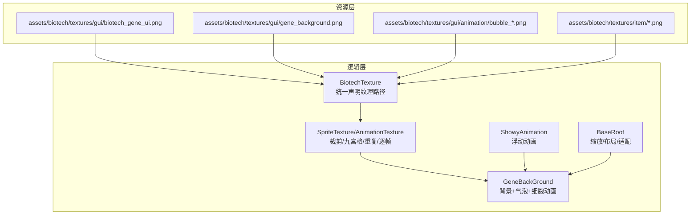
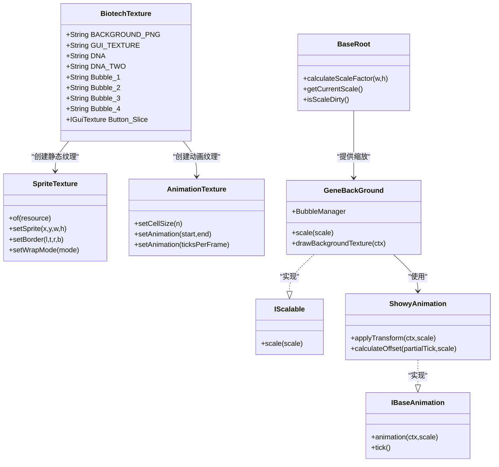
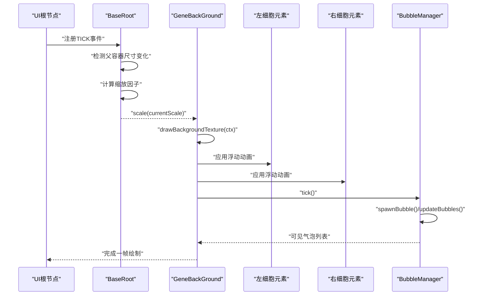
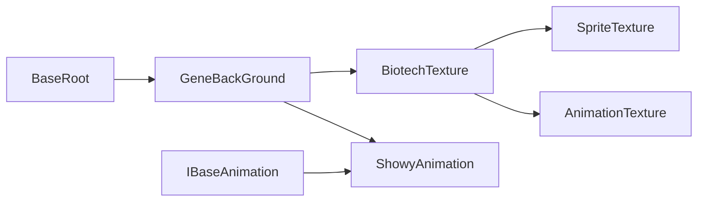

# 纹理管理

<cite>
**本文引用的文件**
- [BiotechTexture.java](file://Biotech/src/main/java/org/biotech/ui/BiotechTexture.java)
- [IScalable.java](file://Biotech/src/main/java/org/biotech/ui/IScalable.java)
- [BaseRoot.java](file://Biotech/src/main/java/org/biotech/ui/gene_inventroy/element/BaseRoot.java)
- [GeneBackGround.java](file://Biotech/src/main/java/org/biotech/ui/gene_inventroy/element/GeneBackGround.java)
- [ShowyAnimation.java](file://Biotech/src/main/java/org/biotech/ui/animation/ShowyAnimation.java)
- [IBaseAnimation.java](file://Biotech/src/main/java/org/biotech/ui/animation/IBaseAnimation.java)
- [biotech_gene_ui.png](file://Biotech/src/main/resources/assets/biotech/textures/gui/biotech_gene_ui.png)
- [gene_background.png](file://Biotech/src/main/resources/assets/biotech/textures/gui/gene_background.png)
- [bubble_1.png](file://Biotech/src/main/resources/assets/biotech/textures/gui/animation/bubble_1.png)
- [bubble_2.png](file://Biotech/src/main/resources/assets/biotech/textures/gui/animation/bubble_2.png)
- [bubble_3.png](file://Biotech/src/main/resources/assets/biotech/textures/gui/animation/bubble_3.png)
- [bubble_4.png](file://Biotech/src/main/resources/assets/biotech/textures/gui/animation/bubble_4.png)
</cite>

## 目录
1. [简介](#简介)
2. [项目结构](#项目结构)
3. [核心组件](#核心组件)
4. [架构总览](#架构总览)
5. [详细组件分析](#详细组件分析)
6. [依赖分析](#依赖分析)
7. [性能考量](#性能考量)
8. [故障排查指南](#故障排查指南)
9. [结论](#结论)
10. [附录](#附录)

## 简介
本文件系统性梳理了“生物科技”模块中的纹理管理系统，重点围绕 BiotechTexture 类的纹理资源组织与使用方式，解释纹理加载、缓存与渲染优化策略；阐述纹理资源在不同 UI 界面（背景图、图标、动画帧）中的应用；给出缩放处理与分辨率适配方案；说明纹理资源的打包与分发机制；提供自定义纹理的添加与替换方法；最后总结纹理性能优化技巧与内存使用建议，并解释纹理与 UI 组件的绑定方式及渲染流程。

## 项目结构
纹理资源主要位于资源包 assets/biotech/textures 下，按功能划分为 gui 与 item 两大类：
- gui：包含主 UI 纹理图集、背景贴图与动画序列帧
- item：包含物品图标等资源

UI 层通过 BiotechTexture 统一声明纹理路径，并结合 SpriteTexture/AnimationTexture 实现裁剪、九宫格拉伸、重复平铺与逐帧动画播放。缩放与适配由 BaseRoot 提供统一的比例计算与布局更新，具体 UI 组件（如 GeneBackGround）负责实际绘制与动画。

图表来源
- [BiotechTexture.java:12-38](file://Biotech/src/main/java/org/biotech/ui/BiotechTexture.java#L12-L38)
- [GeneBackGround.java:34-149](file://Biotech/src/main/java/org/biotech/ui/gene_inventroy/element/GeneBackGround.java#L34-L149)
- [BaseRoot.java:15-103](file://Biotech/src/main/java/org/biotech/ui/gene_inventroy/element/BaseRoot.java#L15-L103)

章节来源
- [BiotechTexture.java:12-38](file://Biotech/src/main/java/org/biotech/ui/BiotechTexture.java#L12-L38)
- [biotech_gene_ui.png](file://Biotech/src/main/resources/assets/biotech/textures/gui/biotech_gene_ui.png)
- [gene_background.png](file://Biotech/src/main/resources/assets/biotech/textures/gui/gene_background.png)
- [bubble_1.png](file://Biotech/src/main/resources/assets/biotech/textures/gui/animation/bubble_1.png)

## 核心组件
- BiotechTexture：集中声明纹理路径与静态纹理对象，便于全局引用与维护
- SpriteTexture/AnimationTexture：封装纹理裁剪、九宫格拉伸、重复平铺与逐帧动画
- BaseRoot：提供基于父容器的等比缩放与布局更新能力
- GeneBackGround：实现全屏背景、视差滚动、浮动动画与气泡对象池
- ShowyAnimation/IBaseAnimation：定义动画接口与浮动动画实现，支持按缩放比例自适应幅度

章节来源
- [BiotechTexture.java:12-38](file://Biotech/src/main/java/org/biotech/ui/BiotechTexture.java#L12-L38)
- [IScalable.java:5-8](file://Biotech/src/main/java/org/biotech/ui/IScalable.java#L5-L8)
- [BaseRoot.java:15-103](file://Biotech/src/main/java/org/biotech/ui/gene_inventroy/element/BaseRoot.java#L15-L103)
- [GeneBackGround.java:34-149](file://Biotech/src/main/java/org/biotech/ui/gene_inventroy/element/GeneBackGround.java#L34-L149)
- [ShowyAnimation.java:11-97](file://Biotech/src/main/java/org/biotech/ui/animation/ShowyAnimation.java#L11-L97)
- [IBaseAnimation.java:42-58](file://Biotech/src/main/java/org/biotech/ui/animation/IBaseAnimation.java#L42-L58)

## 架构总览
纹理管理采用“资源声明 + 渲染封装 + UI适配”的分层架构：
- 资源声明层：BiotechTexture 统一管理纹理路径与静态纹理对象
- 渲染封装层：SpriteTexture/AnimationTexture 封装裁剪、九宫格、重复与逐帧播放
- UI适配层：BaseRoot 提供缩放与布局，具体 UI 组件负责绘制与动画
- 动画契约层：IBaseAnimation 规范动画实现与应用方式

图表来源
- [BiotechTexture.java:12-38](file://Biotech/src/main/java/org/biotech/ui/BiotechTexture.java#L12-L38)
- [IScalable.java:5-8](file://Biotech/src/main/java/org/biotech/ui/IScalable.java#L5-L8)
- [BaseRoot.java:15-103](file://Biotech/src/main/java/org/biotech/ui/gene_inventroy/element/BaseRoot.java#L15-L103)
- [GeneBackGround.java:34-149](file://Biotech/src/main/java/org/biotech/ui/gene_inventroy/element/GeneBackGround.java#L34-L149)
- [ShowyAnimation.java:11-97](file://Biotech/src/main/java/org/biotech/ui/animation/ShowyAnimation.java#L11-L97)
- [IBaseAnimation.java:42-58](file://Biotech/src/main/java/org/biotech/ui/animation/IBaseAnimation.java#L42-L58)

## 详细组件分析

### BiotechTexture：纹理资源声明与封装
- 负责集中声明所有 UI 纹理路径，包括主图集、背景图与动画序列帧
- 通过 SpriteTexture.of(...) + setSprite(...) + setBorder(...) + setWrapMode(...) 构建静态纹理对象，便于全局共享
- 九宫格切片（Button_Slice）用于按钮等控件的可拉伸背景，提升多分辨率适配一致性
- 动画纹理通过 AnimationTexture + setCellSize + setAnimation(...) 实现逐帧播放

章节来源
- [BiotechTexture.java:12-38](file://Biotech/src/main/java/org/biotech/ui/BiotechTexture.java#L12-L38)

### BaseRoot：缩放与布局适配
- 提供 calculateScaleFactor(...) 计算基于内容宽高比与容器宽高比的缩放因子
- 通过监听父容器尺寸变化，动态更新当前缩放比例与自身布局尺寸
- 提供 getCurrentScale()/isScaleDirty() 供子组件消费与检测脏标记，避免重复计算

章节来源
- [BaseRoot.java:15-103](file://Biotech/src/main/java/org/biotech/ui/gene_inventroy/element/BaseRoot.java#L15-L103)

### GeneBackGround：背景、视差与动画
- 全屏覆盖，使用 64x64 纹理平铺作为背景，配合视差滚动增强层次感
- 左下与右上角放置两个浮动的细胞图标，分别绑定 ShowyAnimation 实现正弦波浮动
- 内嵌 BubbleManager：使用对象池管理气泡 UIElement，按固定间隔随机生成，每帧动画由 AnimationTexture 驱动，生命周期结束后自动隐藏复用
- scale(...) 接口实现：根据当前缩放比例同步调整子元素尺寸，保证高分屏一致性

图表来源
- [BaseRoot.java:27-103](file://Biotech/src/main/java/org/biotech/ui/gene_inventroy/element/BaseRoot.java#L27-L103)
- [GeneBackGround.java:73-194](file://Biotech/src/main/java/org/biotech/ui/gene_inventroy/element/GeneBackGround.java#L73-L194)
- [ShowyAnimation.java:57-95](file://Biotech/src/main/java/org/biotech/ui/animation/ShowyAnimation.java#L57-L95)
- [IBaseAnimation.java:50-57](file://Biotech/src/main/java/org/biotech/ui/animation/IBaseAnimation.java#L50-L57)

章节来源
- [GeneBackGround.java:34-149](file://Biotech/src/main/java/org/biotech/ui/gene_inventroy/element/GeneBackGround.java#L34-L149)
- [ShowyAnimation.java:11-97](file://Biotech/src/main/java/org/biotech/ui/animation/ShowyAnimation.java#L11-L97)
- [IBaseAnimation.java:42-58](file://Biotech/src/main/java/org/biotech/ui/animation/IBaseAnimation.java#L42-L58)

### 动画系统：IBaseAnimation 与 ShowyAnimation
- IBaseAnimation 规定统一的动画契约：tick() 更新状态，animation(ctx,scale) 应用变换
- ShowyAnimation 基于正弦/余弦函数实现二维浮动，支持独立的 X/Y 速度与相位，幅度随缩放比例线性变化
- 在 UI 组件中，通常在 UIEvents.TICK 事件中调用 tick()，在绘制阶段调用 animation() 应用变换

章节来源
- [IBaseAnimation.java:42-58](file://Biotech/src/main/java/org/biotech/ui/animation/IBaseAnimation.java#L42-L58)
- [ShowyAnimation.java:11-97](file://Biotech/src/main/java/org/biotech/ui/animation/ShowyAnimation.java#L11-L97)

## 依赖分析
- BiotechTexture 依赖 SpriteTexture/AnimationTexture 进行纹理封装
- GeneBackGround 依赖 BiotechTexture 提供的静态纹理对象，同时依赖 IScalable 接口实现缩放
- BaseRoot 为 UI 树提供缩放与布局能力，被 GeneBackGround 等组件继承使用
- ShowyAnimation 作为 IBaseAnimation 的实现，被 GeneBackGround 的子元素使用

图表来源
- [BiotechTexture.java:12-38](file://Biotech/src/main/java/org/biotech/ui/BiotechTexture.java#L12-L38)
- [GeneBackGround.java:34-149](file://Biotech/src/main/java/org/biotech/ui/gene_inventroy/element/GeneBackGround.java#L34-L149)
- [BaseRoot.java:15-103](file://Biotech/src/main/java/org/biotech/ui/gene_inventroy/element/BaseRoot.java#L15-L103)
- [ShowyAnimation.java:11-97](file://Biotech/src/main/java/org/biotech/ui/animation/ShowyAnimation.java#L11-L97)
- [IBaseAnimation.java:42-58](file://Biotech/src/main/java/org/biotech/ui/animation/IBaseAnimation.java#L42-L58)

章节来源
- [BiotechTexture.java:12-38](file://Biotech/src/main/java/org/biotech/ui/BiotechTexture.java#L12-L38)
- [IScalable.java:5-8](file://Biotech/src/main/java/org/biotech/ui/IScalable.java#L5-L8)
- [BaseRoot.java:15-103](file://Biotech/src/main/java/org/biotech/ui/gene_inventroy/element/BaseRoot.java#L15-L103)
- [GeneBackGround.java:34-149](file://Biotech/src/main/java/org/biotech/ui/gene_inventroy/element/GeneBackGround.java#L34-L149)
- [ShowyAnimation.java:11-97](file://Biotech/src/main/java/org/biotech/ui/animation/ShowyAnimation.java#L11-L97)
- [IBaseAnimation.java:42-58](file://Biotech/src/main/java/org/biotech/ui/animation/IBaseAnimation.java#L42-L58)

## 性能考量
- 纹理加载与缓存
  - 通过 BiotechTexture 统一声明与复用纹理对象，避免重复创建与资源浪费
  - 使用 SpriteTexture 的九宫格与重复模式减少多分辨率下的重复资源需求
- 渲染优化
  - 使用 AnimationTexture 的逐帧播放替代多张独立图片，降低纹理切换开销
  - BubbleManager 采用对象池复用 UIElement，避免频繁创建销毁带来的 GC 抖动
- 缩放与分辨率适配
  - BaseRoot 提供等比缩放与布局更新，确保 UI 在不同分辨率下保持一致比例
  - 动画幅度随 scale 线性变化，保证视觉一致性
- 内存使用建议
  - 控制动画帧数量与纹理尺寸，优先使用图集减少绑定次数
  - 合理设置对象池上限与气泡生命周期，避免长期存活对象占用内存

## 故障排查指南
- 纹理未显示或显示异常
  - 检查 BiotechTexture 中的纹理路径是否与资源包内文件名一致
  - 确认 SpriteTexture.setSprite(...) 的裁剪区域与图集布局匹配
- 动画不播放或卡顿
  - 确认 UIEvents.TICK 事件中正确调用 IBaseAnimation.tick()
  - 检查 AnimationTexture 的 setCellSize/setAnimation 参数是否正确
- 缩放错位或比例异常
  - 确认 BaseRoot 的父容器尺寸变化事件是否触发，currentScale 是否被正确消费
  - 检查 GeneBackGround.scale(...) 是否同步更新子元素尺寸
- 性能问题
  - 检查对象池大小与气泡生命周期，避免过度创建
  - 减少不必要的纹理切换与重复绘制

章节来源
- [BiotechTexture.java:12-38](file://Biotech/src/main/java/org/biotech/ui/BiotechTexture.java#L12-L38)
- [IBaseAnimation.java:50-57](file://Biotech/src/main/java/org/biotech/ui/animation/IBaseAnimation.java#L50-L57)
- [ShowyAnimation.java:57-95](file://Biotech/src/main/java/org/biotech/ui/animation/ShowyAnimation.java#L57-L95)
- [BaseRoot.java:79-103](file://Biotech/src/main/java/org/biotech/ui/gene_inventroy/element/BaseRoot.java#L79-L103)
- [GeneBackGround.java:201-213](file://Biotech/src/main/java/org/biotech/ui/gene_inventroy/element/GeneBackGround.java#L201-L213)

## 结论
该纹理管理系统通过 BiotechTexture 统一声明与封装、SpriteTexture/AnimationTexture 的高效渲染、以及 BaseRoot 的缩放适配，实现了跨分辨率的一致 UI 表现。配合对象池与帧率无关的动画更新机制，系统在保证视觉效果的同时兼顾了性能与可维护性。后续扩展可通过新增纹理路径与动画配置快速集成新 UI 资源。

## 附录

### 纹理资源组织与命名规范
- 资源路径遵循 assets/biotech/textures/<分类>/<名称>.png 的命名约定
- 主 UI 纹理图集：biotech:textures/gui/biotech_gene_ui.png
- 背景贴图：biotech:textures/gui/gene_background.png
- 动画序列帧：biotech:textures/gui/animation/bubble_*.png
- 物品图标：biotech:textures/item/*.png

章节来源
- [BiotechTexture.java:16-24](file://Biotech/src/main/java/org/biotech/ui/BiotechTexture.java#L16-L24)
- [biotech_gene_ui.png](file://Biotech/src/main/resources/assets/biotech/textures/gui/biotech_gene_ui.png)
- [gene_background.png](file://Biotech/src/main/resources/assets/biotech/textures/gui/gene_background.png)
- [bubble_1.png](file://Biotech/src/main/resources/assets/biotech/textures/gui/animation/bubble_1.png)

### 不同 UI 界面使用的纹理资源
- 背景图：全屏覆盖，使用 64x64 纹理平铺，支持视差滚动
- 图标：主图集裁剪出的 UI 元素，如按钮切片、细胞图标等
- 动画帧：气泡序列帧，通过 AnimationTexture 逐帧播放

章节来源
- [GeneBackGround.java:52-56](file://Biotech/src/main/java/org/biotech/ui/gene_inventroy/element/GeneBackGround.java#L52-L56)
- [BiotechTexture.java:26-30](file://Biotech/src/main/java/org/biotech/ui/BiotechTexture.java#L26-L30)
- [BiotechTexture.java:33-36](file://Biotech/src/main/java/org/biotech/ui/BiotechTexture.java#L33-L36)

### 缩放处理与分辨率适配策略
- 通过 BaseRoot.calculateScaleFactor(...) 计算缩放因子，保证内容按比例填充容器
- 子组件实现 IScalable 接口，在 scale(...) 中同步更新尺寸
- 动画幅度随 scale 线性变化，确保高分屏下视觉一致性

章节来源
- [BaseRoot.java:63-74](file://Biotech/src/main/java/org/biotech/ui/gene_inventroy/element/BaseRoot.java#L63-L74)
- [BaseRoot.java:110-113](file://Biotech/src/main/java/org/biotech/ui/gene_inventroy/element/BaseRoot.java#L110-L113)
- [IScalable.java:5-8](file://Biotech/src/main/java/org/biotech/ui/IScalable.java#L5-L8)
- [ShowyAnimation.java:89-95](file://Biotech/src/main/java/org/biotech/ui/animation/ShowyAnimation.java#L89-L95)

### 纹理资源的打包与分发机制
- 资源文件位于 assets/biotech/，构建后随 mod 打包发布
- 纹理路径通过资源域名 biotech 与相对路径组合，确保运行时可定位

章节来源
- [BiotechTexture.java:16-24](file://Biotech/src/main/java/org/biotech/ui/BiotechTexture.java#L16-L24)

### 自定义纹理的添加与替换方法
- 添加新纹理：在 assets/biotech/textures/<分类>/ 新增 PNG 文件
- 替换现有纹理：修改 BiotechTexture 中对应常量的路径或裁剪参数
- 替换动画序列帧：更新 AnimationTexture 的 setCellSize 与帧范围

章节来源
- [BiotechTexture.java:16-38](file://Biotech/src/main/java/org/biotech/ui/BiotechTexture.java#L16-L38)
- [GeneBackGround.java:236-241](file://Biotech/src/main/java/org/biotech/ui/gene_inventroy/element/GeneBackGround.java#L236-L241)

### 纹理与 UI 组件的绑定方式与渲染流程
- 绑定方式：UIElement.style(style -> style.background(texture)) 或直接使用 drawBackgroundTexture
- 渲染流程：父容器先绘制背景，再叠加子元素动画与纹理；动画通过 PoseStack 变换实现浮动与视差

章节来源
- [GeneBackGround.java:159-194](file://Biotech/src/main/java/org/biotech/ui/gene_inventroy/element/GeneBackGround.java#L159-L194)
- [ShowyAnimation.java:74-77](file://Biotech/src/main/java/org/biotech/ui/animation/ShowyAnimation.java#L74-L77)