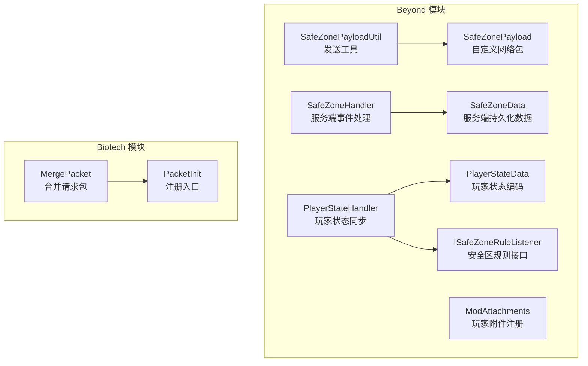
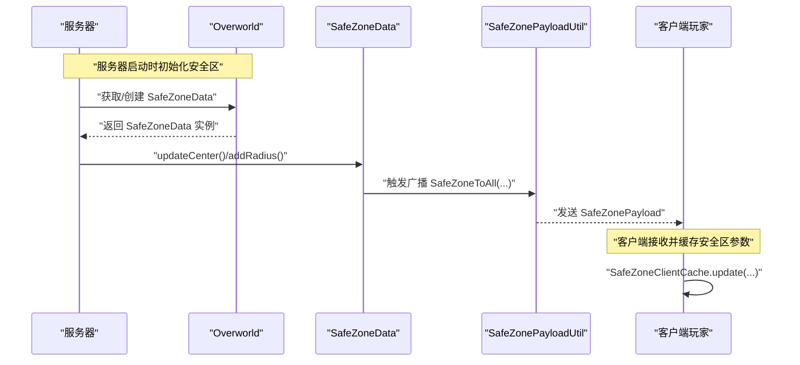
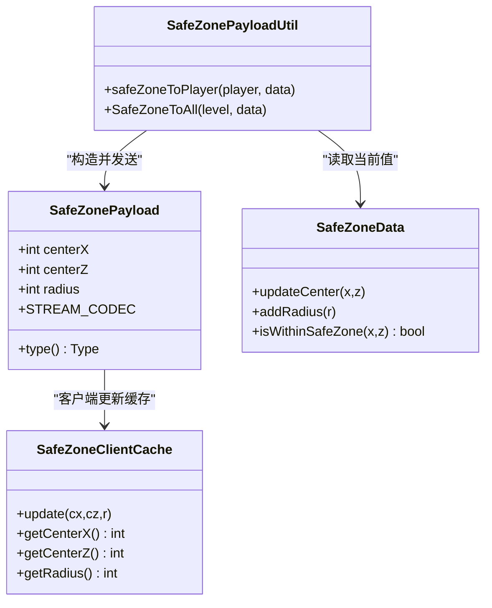
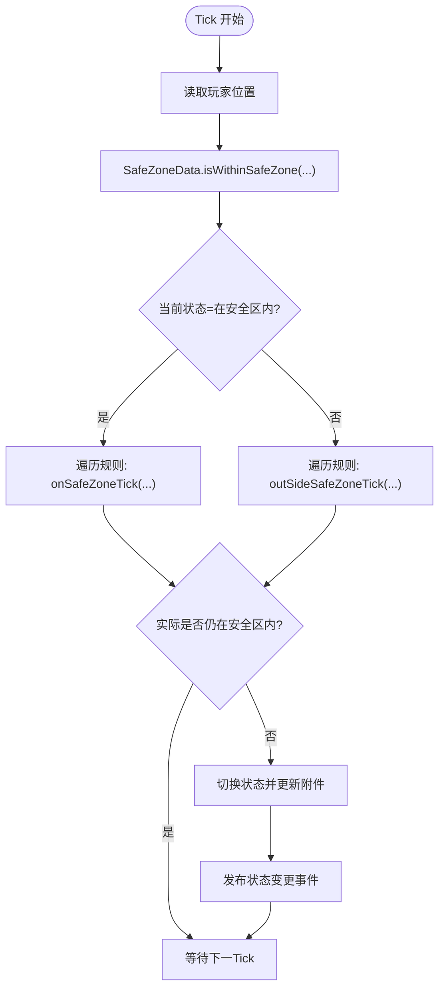
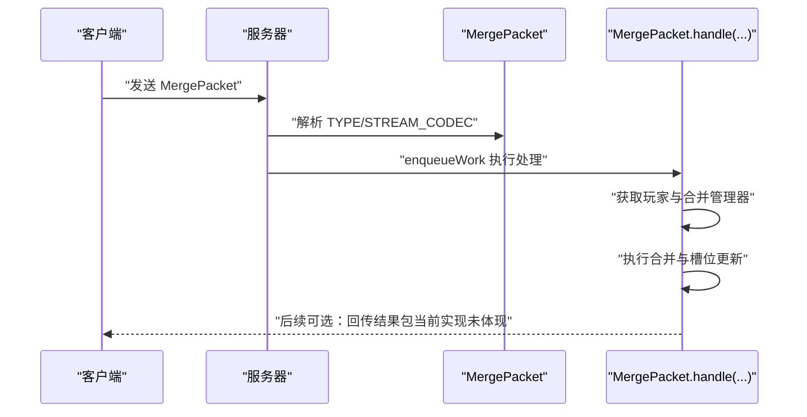
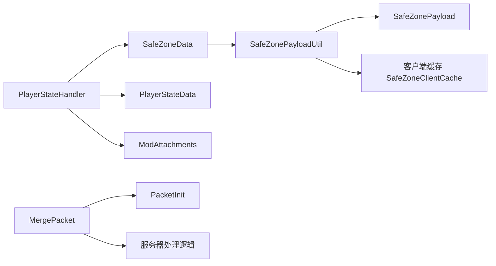

# 网络通信

<cite>
**本文引用的文件**
- [Beyond\src\main\java\com\pz\beyond\network\SafeZonePayload.java](file://Beyond/src/main/java/com/pz/beyond/network/SafeZonePayload.java)
- [Beyond\src\main\java\com\pz\beyond\util\SafeZonePayloadUtil.java](file://Beyond/src/main/java/com/pz/beyond/util/SafeZonePayloadUtil.java)
- [Beyond\src\main\java\com\pz\beyond\data\SafeZoneData.java](file://Beyond/src/main/java/com/pz/beyond/data/SafeZoneData.java)
- [Beyond\src\main\java\com\pz\beyond\data\SafeZoneClientCache.java](file://Beyond/src/main/java/com/pz/beyond/data/SafeZoneClientCache.java)
- [Beyond\src\main\java\com\pz\beyond\event\SafeZoneHandler.java](file://Beyond/src/main/java/com/pz/beyond/event/SafeZoneHandler.java)
- [Beyond\src\main\java\com\pz\beyond\event\PlayerStateHandler.java](file://Beyond/src/main/java/com/pz/beyond/event/PlayerStateHandler.java)
- [Beyond\src\main\java\com\pz\beyond\registry\ModAttachments.java](file://Beyond/src/main/java/com/pz/beyond/registry/ModAttachments.java)
- [Beyond\src\main\java\com\pz\beyond\safeZoneRule\ISafeZoneRuleListener.java](file://Beyond/src/main/java/com/pz/beyond/safeZoneRule/ISafeZoneRuleListener.java)
- [Biotech\src\main\java\org\biotech\network\MergePacket.java](file://Biotech/src/main/java/org/biotech/network/MergePacket.java)
- [Biotech\src\main\java\org\biotech\api\init\PacketInit.java](file://Biotech/src/main/java/org/biotech/api/init/PacketInit.java)
- [Beyond\src\main\java\com\pz\beyond\data\PlayerStateData.java](file://Beyond/src/main/java/com/pz/beyond/data/PlayerStateData.java)
- [Beyond\src\main\java\com\pz\beyond\Beyond.java](file://Beyond/src/main/java/com/pz/beyond/Beyond.java)
- [Biotech\src\main\java\org\biotech\Biotech.java](file://Biotech/src/main/java/org/biotech/Biotech.java)
</cite>

## 目录
1. [引言](#引言)
2. [项目结构](#项目结构)
3. [核心组件](#核心组件)
4. [架构总览](#架构总览)
5. [详细组件分析](#详细组件分析)
6. [依赖分析](#依赖分析)
7. [性能考虑](#性能考虑)
8. [故障排查指南](#故障排查指南)
9. [结论](#结论)
10. [附录](#附录)

## 引言
本文件面向“网络通信”主题，聚焦于客户端与服务器之间的数据同步机制与自定义网络包实现。围绕以下目标展开：基因合并包处理（客户端向服务器发起合并请求）、安全区数据传输（服务器向客户端广播安全区参数）、玩家状态同步（基于附件与事件驱动的状态变更）。文档覆盖网络协议设计、消息格式定义、序列化机制、错误处理策略，并提供网络包的创建、发送与接收的完整示例路径，解释网络延迟处理、数据一致性保证与性能优化方案，同时给出网络调试工具使用与常见问题排查方法。

## 项目结构
本仓库包含两个主要模块：
- Beyond：提供安全区规则、玩家状态管理、自定义网络包与事件总线集成。
- Biotech：提供基因系统与自定义网络包（合并请求）的注册与处理。

图表来源
- [Beyond\src\main\java\com\pz\beyond\network\SafeZonePayload.java:1-31](file://Beyond/src/main/java/com/pz/beyond/network/SafeZonePayload.java#L1-L31)
- [Beyond\src\main\java\com\pz\beyond\util\SafeZonePayloadUtil.java:1-32](file://Beyond/src/main/java/com/pz/beyond/util/SafeZonePayloadUtil.java#L1-L32)
- [Beyond\src\main\java\com\pz\beyond\data\SafeZoneData.java:1-101](file://Beyond/src/main/java/com/pz/beyond/data/SafeZoneData.java#L1-L101)
- [Beyond\src\main\java\com\pz\beyond\event\SafeZoneHandler.java:1-77](file://Beyond/src/main/java/com/pz/beyond/event/SafeZoneHandler.java#L1-L77)
- [Beyond\src\main\java\com\pz\beyond\event\PlayerStateHandler.java:1-80](file://Beyond/src/main/java/com/pz/beyond/event/PlayerStateHandler.java#L1-L80)
- [Beyond\src\main\java\com\pz\beyond\data\PlayerStateData.java:1-65](file://Beyond/src/main/java/com/pz/beyond/data/PlayerStateData.java#L1-L65)
- [Beyond\src\main\java\com\pz\beyond\registry\ModAttachments.java:1-22](file://Beyond/src/main/java/com/pz/beyond/registry/ModAttachments.java#L1-L22)
- [Beyond\src\main\java\com\pz\beyond\safeZoneRule\ISafeZoneRuleListener.java:1-42](file://Beyond/src/main/java/com/pz/beyond/safeZoneRule/ISafeZoneRuleListener.java#L1-L42)
- [Biotech\src\main\java\org\biotech\network\MergePacket.java:1-44](file://Biotech/src/main/java/org/biotech/network/MergePacket.java#L1-L44)
- [Biotech\src\main\java\org\biotech\api\init\PacketInit.java:1-19](file://Biotech/src/main/java/org/biotech/api/init/PacketInit.java#L1-L19)

章节来源
- [Beyond\src\main\java\com\pz\beyond\Beyond.java:1-79](file://Beyond/src/main/java/com/pz/beyond/Beyond.java#L1-L79)
- [Biotech\src\main\java\org\biotech\Biotech.java:1-73](file://Biotech/src/main/java/org/biotech/Biotech.java#L1-L73)

## 核心组件
- 自定义网络包
  - SafeZonePayload：定义安全区参数的自定义包，包含类型标识与流编解码器。
  - MergePacket：定义客户端向服务器发起的合并请求包，包含类型标识、流编解码器与处理回调。
- 数据与状态
  - SafeZoneData：服务端保存的安全区中心与半径，支持序列化与广播更新。
  - SafeZoneClientCache：客户端缓存安全区参数，供渲染或UI使用。
  - PlayerStateData：玩家状态枚举（在安全区内/在游戏中），配合附件进行序列化与复制。
- 事件与规则
  - SafeZoneHandler：服务端事件处理，负责初始化安全区、登录时推送、以及广播更新。
  - PlayerStateHandler：基于每Tick的玩家位置判断状态切换，并广播状态变更事件。
  - ISafeZoneRuleListener：安全区规则接口，统一挂载多种规则（如免伤、禁止刷怪等）。
- 发送与注册
  - SafeZonePayloadUtil：封装对单个玩家与全服广播的发送逻辑。
  - PacketInit：注册Play-to-Server方向的自定义包处理器。

章节来源
- [Beyond\src\main\java\com\pz\beyond\network\SafeZonePayload.java:1-31](file://Beyond/src/main/java/com/pz/beyond/network/SafeZonePayload.java#L1-L31)
- [Biotech\src\main\java\org\biotech\network\MergePacket.java:1-44](file://Biotech/src/main/java/org/biotech/network/MergePacket.java#L1-L44)
- [Beyond\src\main\java\com\pz\beyond\data\SafeZoneData.java:1-101](file://Beyond/src/main/java/com/pz/beyond/data/SafeZoneData.java#L1-L101)
- [Beyond\src\main\java\com\pz\beyond\data\SafeZoneClientCache.java:1-30](file://Beyond/src/main/java/com/pz/beyond/data/SafeZoneClientCache.java#L1-L30)
- [Beyond\src\main\java\com\pz\beyond\event\SafeZoneHandler.java:1-77](file://Beyond/src/main/java/com/pz/beyond/event/SafeZoneHandler.java#L1-L77)
- [Beyond\src\main\java\com\pz\beyond\event\PlayerStateHandler.java:1-80](file://Beyond/src/main/java/com/pz/beyond/event/PlayerStateHandler.java#L1-L80)
- [Beyond\src\main\java\com\pz\beyond\safeZoneRule\ISafeZoneRuleListener.java:1-42](file://Beyond/src/main/java/com/pz/beyond/safeZoneRule/ISafeZoneRuleListener.java#L1-L42)
- [Beyond\src\main\java\com\pz\beyond\util\SafeZonePayloadUtil.java:1-32](file://Beyond/src/main/java/com/pz/beyond/util/SafeZonePayloadUtil.java#L1-L32)
- [Biotech\src\main\java\org\biotech\api\init\PacketInit.java:1-19](file://Biotech/src/main/java/org/biotech/api/init/PacketInit.java#L1-L19)

## 架构总览
下图展示从服务端数据变更到客户端接收更新的整体链路，以及客户端向服务端发起合并请求的交互。

图表来源
- [Beyond\src\main\java\com\pz\beyond\event\SafeZoneHandler.java:44-52](file://Beyond/src/main/java/com/pz/beyond/event/SafeZoneHandler.java#L44-L52)
- [Beyond\src\main\java\com\pz\beyond\data\SafeZoneData.java:60-79](file://Beyond/src/main/java/com/pz/beyond/data/SafeZoneData.java#L60-L79)
- [Beyond\src\main\java\com\pz\beyond\util\SafeZonePayloadUtil.java:26-30](file://Beyond/src/main/java/com/pz/beyond/util/SafeZonePayloadUtil.java#L26-L30)
- [Beyond\src\main\java\com\pz\beyond\network\SafeZonePayload.java:10-29](file://Beyond/src/main/java/com/pz/beyond/network/SafeZonePayload.java#L10-L29)
- [Beyond\src\main\java\com\pz\beyond\data\SafeZoneClientCache.java:12-16](file://Beyond/src/main/java/com/pz/beyond/data/SafeZoneClientCache.java#L12-L16)

## 详细组件分析

### 安全区数据同步（服务端到客户端）
- 协议与消息格式
  - 类型标识：使用资源定位符作为包类型，确保唯一性与版本隔离。
  - 流编解码器：采用组合式流编解码器，按字段顺序读写整数坐标与半径。
- 序列化机制
  - 服务端通过SavedData持久化安全区参数；客户端通过缓存类持有最新值。
- 发送流程
  - 服务端在数据变更后调用广播工具，向维度内所有在线玩家发送包。
- 客户端接收与应用
  - 客户端收到包后更新本地缓存，供渲染或UI使用。

图表来源
- [Beyond\src\main\java\com\pz\beyond\network\SafeZonePayload.java:10-29](file://Beyond/src/main/java/com/pz/beyond/network/SafeZonePayload.java#L10-L29)
- [Beyond\src\main\java\com\pz\beyond\util\SafeZonePayloadUtil.java:16-30](file://Beyond/src/main/java/com/pz/beyond/util/SafeZonePayloadUtil.java#L16-L30)
- [Beyond\src\main\java\com\pz\beyond\data\SafeZoneData.java:16-99](file://Beyond/src/main/java/com/pz/beyond/data/SafeZoneData.java#L16-L99)
- [Beyond\src\main\java\com\pz\beyond\data\SafeZoneClientCache.java:6-29](file://Beyond/src/main/java/com/pz/beyond/data/SafeZoneClientCache.java#L6-L29)

章节来源
- [Beyond\src\main\java\com\pz\beyond\network\SafeZonePayload.java:1-31](file://Beyond/src/main/java/com/pz/beyond/network/SafeZonePayload.java#L1-L31)
- [Beyond\src\main\java\com\pz\beyond\util\SafeZonePayloadUtil.java:1-32](file://Beyond/src/main/java/com/pz/beyond/util/SafeZonePayloadUtil.java#L1-L32)
- [Beyond\src\main\java\com\pz\beyond\data\SafeZoneData.java:1-101](file://Beyond/src/main/java/com/pz/beyond/data/SafeZoneData.java#L1-L101)
- [Beyond\src\main\java\com\pz\beyond\data\SafeZoneClientCache.java:1-30](file://Beyond/src/main/java/com/pz/beyond/data/SafeZoneClientCache.java#L1-L30)

### 玩家状态同步（基于附件与事件）
- 状态模型
  - PlayerStateData 提供“在安全区内/在游戏中”的枚举与序列化编解码器。
  - ModAttachments 将玩家状态作为附件注册，支持序列化与死亡继承。
- 同步机制
  - PlayerStateHandler 基于每Tick检查玩家位置，判定是否进入/离开安全区，触发状态切换并发布事件。
  - 安全区规则通过 ISafeZoneRuleListener 接口统一挂载，实现免伤、禁止刷怪等行为。

图表来源
- [Beyond\src\main\java\com\pz\beyond\event\PlayerStateHandler.java:27-66](file://Beyond/src/main/java/com/pz/beyond/event/PlayerStateHandler.java#L27-L66)
- [Beyond\src\main\java\com\pz\beyond\data\SafeZoneData.java:49-57](file://Beyond/src/main/java/com/pz/beyond/data/SafeZoneData.java#L49-L57)
- [Beyond\src\main\java\com\pz\beyond\safeZoneRule\ISafeZoneRuleListener.java:19-37](file://Beyond/src/main/java/com/pz/beyond/safeZoneRule/ISafeZoneRuleListener.java#L19-L37)
- [Beyond\src\main\java\com\pz\beyond\registry\ModAttachments.java:16-20](file://Beyond/src/main/java/com/pz/beyond/registry/ModAttachments.java#L16-L20)
- [Beyond\src\main\java\com\pz\beyond\data\PlayerStateData.java:46-61](file://Beyond/src/main/java/com/pz/beyond/data/PlayerStateData.java#L46-L61)

章节来源
- [Beyond\src\main\java\com\pz\beyond\event\PlayerStateHandler.java:1-80](file://Beyond/src/main/java/com/pz/beyond/event/PlayerStateHandler.java#L1-L80)
- [Beyond\src\main\java\com\pz\beyond\data\PlayerStateData.java:1-65](file://Beyond/src/main/java/com/pz/beyond/data/PlayerStateData.java#L1-L65)
- [Beyond\src\main\java\com\pz\beyond\registry\ModAttachments.java:1-22](file://Beyond/src/main/java/com/pz/beyond/registry/ModAttachments.java#L1-L22)
- [Beyond\src\main\java\com\pz\beyond\safeZoneRule\ISafeZoneRuleListener.java:1-42](file://Beyond/src/main/java/com/pz/beyond/safeZoneRule/ISafeZoneRuleListener.java#L1-L42)

### 基因合并包处理（客户端到服务器）
- 协议与消息格式
  - MergePacket 为无参包，类型标识与流编解码器均为空载。
- 处理流程
  - PacketInit 在注册阶段绑定 Play-to-Server 的处理器。
  - 服务器端在回调中通过上下文获取玩家，执行合并逻辑并更新槽位数据，随后记录调试日志。

图表来源
- [Biotech\src\main\java\org\biotech\network\MergePacket.java:14-42](file://Biotech/src/main/java/org/biotech/network/MergePacket.java#L14-L42)
- [Biotech\src\main\java\org\biotech\api\init\PacketInit.java:12-17](file://Biotech/src/main/java/org/biotech/api/init/PacketInit.java#L12-L17)

章节来源
- [Biotech\src\main\java\org\biotech\network\MergePacket.java:1-44](file://Biotech/src/main/java/org/biotech/network/MergePacket.java#L1-L44)
- [Biotech\src\main\java\org\biotech\api\init\PacketInit.java:1-19](file://Biotech/src/main/java/org/biotech/api/init/PacketInit.java#L1-L19)

## 依赖分析
- 模块边界
  - Beyond 负责安全区与玩家状态的网络包与事件处理。
  - Biotech 负责基因系统与合并请求的网络包注册与处理。
- 关键耦合点
  - SafeZoneData 与 SafeZonePayloadUtil 之间存在直接调用关系，用于广播更新。
  - PlayerStateHandler 依赖 SafeZoneData 与 ModAttachments，以实现状态同步。
  - MergePacket 通过 PacketInit 注册到网络层，形成客户端到服务器的请求通道。

图表来源
- [Beyond\src\main\java\com\pz\beyond\data\SafeZoneData.java:60-79](file://Beyond/src/main/java/com/pz/beyond/data/SafeZoneData.java#L60-L79)
- [Beyond\src\main\java\com\pz\beyond\util\SafeZonePayloadUtil.java:26-30](file://Beyond/src/main/java/com/pz/beyond/util/SafeZonePayloadUtil.java#L26-L30)
- [Beyond\src\main\java\com\pz\beyond\network\SafeZonePayload.java:10-29](file://Beyond/src/main/java/com/pz/beyond/network/SafeZonePayload.java#L10-L29)
- [Beyond\src\main\java\com\pz\beyond\data\SafeZoneClientCache.java:12-16](file://Beyond/src/main/java/com/pz/beyond/data/SafeZoneClientCache.java#L12-L16)
- [Beyond\src\main\java\com\pz\beyond\event\PlayerStateHandler.java:27-66](file://Beyond/src/main/java/com/pz/beyond/event/PlayerStateHandler.java#L27-L66)
- [Beyond\src\main\java\com\pz\beyond\data\PlayerStateData.java:25-28](file://Beyond/src/main/java/com/pz/beyond/data/PlayerStateData.java#L25-L28)
- [Beyond\src\main\java\com\pz\beyond\registry\ModAttachments.java:16-20](file://Beyond/src/main/java/com/pz/beyond/registry/ModAttachments.java#L16-L20)
- [Biotech\src\main\java\org\biotech\network\MergePacket.java:24-42](file://Biotech/src/main/java/org/biotech/network/MergePacket.java#L24-L42)
- [Biotech\src\main\java\org\biotech\api\init\PacketInit.java:12-17](file://Biotech/src/main/java/org/biotech/api/init/PacketInit.java#L12-L17)

章节来源
- [Beyond\src\main\java\com\pz\beyond\event\SafeZoneHandler.java:1-77](file://Beyond/src/main/java/com/pz/beyond/event/SafeZoneHandler.java#L1-L77)
- [Beyond\src\main\java\com\pz\beyond\event\PlayerStateHandler.java:1-80](file://Beyond/src/main/java/com/pz/beyond/event/PlayerStateHandler.java#L1-L80)
- [Biotech\src\main\java\org\biotech\api\init\PacketInit.java:1-19](file://Biotech/src/main/java/org/biotech/api/init/PacketInit.java#L1-L19)

## 性能考虑
- 广播策略
  - 使用维度级广播减少不必要的单播开销；仅在安全区参数发生显著变化时触发广播，避免频繁更新。
- Tick 驱动
  - 玩家状态切换与规则执行集中在每Tick处理，建议在规则实现中尽量避免重型计算，必要时采用缓存或延迟评估。
- 序列化与编解码
  - 自定义包字段简单（三个整数），编解码成本低；若未来扩展字段，需保持字段顺序与类型稳定，避免破坏兼容性。
- 线程模型
  - 服务器端处理回调通过上下文入队执行，避免阻塞网络线程；合并操作应尽量短小，避免长时间占用工作队列。

## 故障排查指南
- 安全区不生效或不更新
  - 检查服务端是否正确初始化 SafeZoneData，并在数据变更后调用广播方法。
  - 确认客户端已接收并更新 SafeZoneClientCache。
- 玩家状态不切换
  - 检查 PlayerStateHandler 是否正常订阅 Tick 事件，确认 SafeZoneData 的区域判断逻辑。
  - 核查 ModAttachments 是否正确注册与序列化。
- 合并请求无效
  - 确认 PacketInit 已在注册事件中绑定 MergePacket 的 TYPE/STREAM_CODEC。
  - 检查服务器端 handle 回调是否被调用，关注日志输出以定位异常。
- 网络延迟与丢包
  - 使用调试日志记录包发送与接收时间戳，结合客户端缓存更新时机评估延迟。
  - 若存在高频率更新，建议在服务端聚合变更并在固定间隔广播，降低带宽压力。

章节来源
- [Beyond\src\main\java\com\pz\beyond\util\SafeZonePayloadUtil.java:26-30](file://Beyond/src/main/java/com/pz/beyond/util/SafeZonePayloadUtil.java#L26-L30)
- [Beyond\src\main\java\com\pz\beyond\event\SafeZoneHandler.java:44-52](file://Beyond/src/main/java/com/pz/beyond/event/SafeZoneHandler.java#L44-L52)
- [Beyond\src\main\java\com\pz\beyond\event\PlayerStateHandler.java:27-66](file://Beyond/src/main/java/com/pz/beyond/event/PlayerStateHandler.java#L27-L66)
- [Biotech\src\main\java\org\biotech\network\MergePacket.java:24-42](file://Biotech/src/main/java/org/biotech/network/MergePacket.java#L24-L42)
- [Biotech\src\main\java\org\biotech\api\init\PacketInit.java:12-17](file://Biotech/src/main/java/org/biotech/api/init/PacketInit.java#L12-L17)

## 结论
本网络通信体系以自定义网络包为核心，结合事件驱动与附件机制，实现了安全区参数的高效广播与玩家状态的实时同步；同时通过简洁的合并请求包，为后续扩展提供了清晰的协议与处理框架。建议在后续迭代中完善双向确认与重试机制、引入变更聚合与差分更新，以进一步提升稳定性与性能。

## 附录
- 网络包创建与发送示例（路径参考）
  - 安全区包创建与广播：[SafeZonePayloadUtil.java:26-30](file://Beyond/src/main/java/com/pz/beyond/util/SafeZonePayloadUtil.java#L26-L30)，[SafeZonePayload.java:10-29](file://Beyond/src/main/java/com/pz/beyond/network/SafeZonePayload.java#L10-L29)
  - 合并请求包注册与处理：[PacketInit.java:12-17](file://Biotech/src/main/java/org/biotech/api/init/PacketInit.java#L12-L17)，[MergePacket.java:24-42](file://Biotech/src/main/java/org/biotech/network/MergePacket.java#L24-L42)
- 客户端接收与应用示例（路径参考）
  - 客户端缓存更新：[SafeZoneClientCache.java:12-16](file://Beyond/src/main/java/com/pz/beyond/data/SafeZoneClientCache.java#L12-L16)
- 错误处理与调试
  - 日志记录：合并请求处理中包含调试日志输出，便于追踪处理流程与异常。