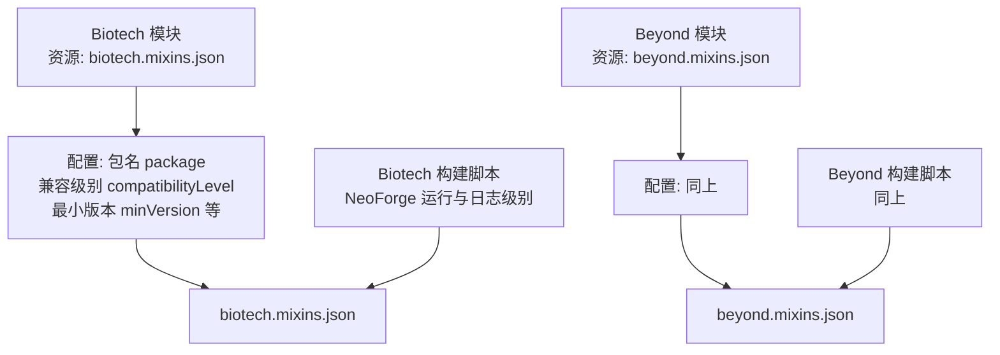
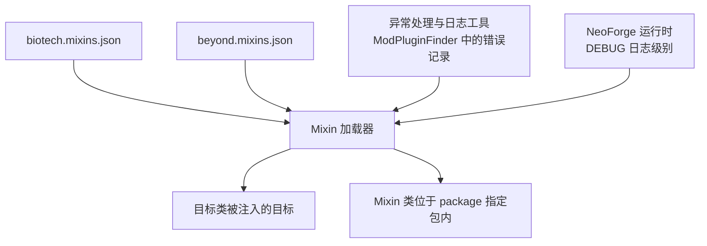
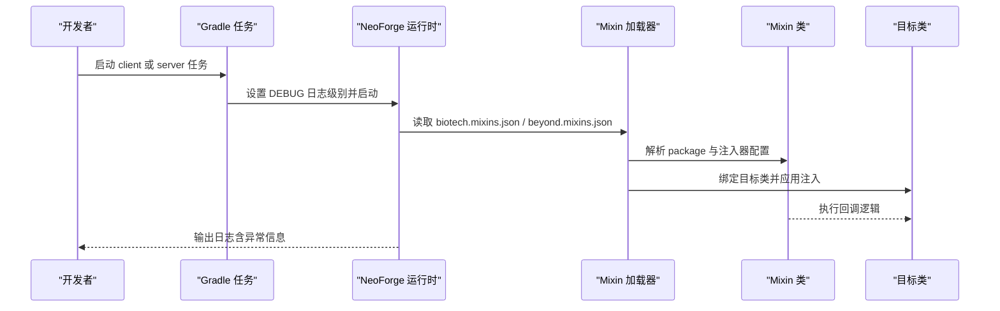
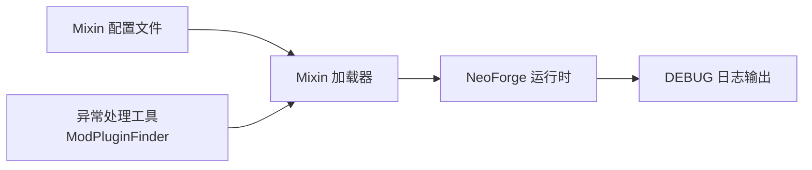

# Mixin配置

<cite>
**本文档引用的文件**
- [biotech.mixins.json](file://Biotech/src/main/resources/biotech.mixins.json)
- [beyond.mixins.json](file://Beyond/src/main/resources/beyond.mixins.json)
- [ModPluginFinder.java](file://Biotech/src/main/java/org/biotech/api/util/ModPluginFinder.java)
- [README.md（ModFix）](file://ModFix/README.md)
- [build.gradle（Biotech）](file://Biotech/build.gradle)
</cite>

## 目录
1. [引言](#引言)
2. [项目结构](#项目结构)
3. [核心组件](#核心组件)
4. [架构总览](#架构总览)
5. [详细组件分析](#详细组件分析)
6. [依赖关系分析](#依赖关系分析)
7. [性能考量](#性能考量)
8. [故障排查指南](#故障排查指南)
9. [结论](#结论)
10. [附录](#附录)

## 引言
本指南聚焦于两个模块的Mixin配置与加载机制，即Biotech与Beyond模块中的biotech.mixins.json与beyond.mixins.json。文档将系统阐述：
- 配置文件的结构与字段语义
- Mixin类的定义位置、目标类绑定与优先级设置
- 注入点选择、回调方法实现与异常处理策略
- 调试方法、性能影响分析与兼容性测试
- 常见问题诊断与与其他Mod的冲突处理

## 项目结构
本仓库包含多个子模块，其中Biotech与Beyond各自维护了独立的Mixin配置文件，并通过Gradle构建任务生成运行时资源。下图展示了与Mixin配置直接相关的文件与模块关系。

图表来源
- [biotech.mixins.json:1-17](file://Biotech/src/main/resources/biotech.mixins.json#L1-L17)
- [beyond.mixins.json:1-17](file://Beyond/src/main/resources/beyond.mixins.json#L1-L17)
- [build.gradle（Biotech）:20-52](file://Biotech/build.gradle#L20-L52)

章节来源
- [biotech.mixins.json:1-17](file://Biotech/src/main/resources/biotech.mixins.json#L1-L17)
- [beyond.mixins.json:1-17](file://Beyond/src/main/resources/beyond.mixins.json#L1-L17)
- [build.gradle（Biotech）:20-52](file://Biotech/build.gradle#L20-L52)

## 核心组件
- 配置文件
  - 必需标志 required：指示该配置是否为必需项
  - 最低版本 minVersion：声明所需的Mixin版本要求
  - 包名 package：声明Mixin类所在的默认包前缀
  - 兼容级别 compatibilityLevel：声明编译/运行的Java语言级别
  - 注入器默认 require 数 injectors.defaultRequire：控制注入器默认强制级别
  - 覆盖注解要求 overwrites.requireAnnotations：启用覆盖注解校验
  - mixins/client 列表：当前为空，表示未显式注册任何Mixin类
- 加载与运行
  - 构建脚本中设置了运行日志级别为DEBUG，便于观察加载过程
  - 通过NeoForge运行任务启动客户端/服务端，加载资源与配置

章节来源
- [biotech.mixins.json:1-17](file://Biotech/src/main/resources/biotech.mixins.json#L1-L17)
- [beyond.mixins.json:1-17](file://Beyond/src/main/resources/beyond.mixins.json#L1-L17)
- [build.gradle（Biotech）:48-51](file://Biotech/build.gradle#L48-L51)

## 架构总览
下图展示了从配置到运行时加载的关键路径，以及与异常处理相关的辅助工具。

图表来源
- [biotech.mixins.json:1-17](file://Biotech/src/main/resources/biotech.mixins.json#L1-L17)
- [beyond.mixins.json:1-17](file://Beyond/src/main/resources/beyond.mixins.json#L1-L17)
- [ModPluginFinder.java:73-82](file://Biotech/src/main/java/org/biotech/api/util/ModPluginFinder.java#L73-L82)
- [build.gradle（Biotech）:48-51](file://Biotech/build.gradle#L48-L51)

## 详细组件分析

### 配置文件结构与字段解析
- 字段说明
  - required：若为true，当配置缺失或不满足条件时，加载会失败
  - minVersion：确保Mixin引擎版本不低于声明值
  - package：Mixin类的默认包前缀，实际类需位于该包下
  - compatibilityLevel：声明编译/运行的Java语言级别
  - injectors.defaultRequire：控制注入器默认强制级别
  - overwrites.requireAnnotations：开启覆盖注解校验，增强安全性
  - mixins/client：当前为空数组，表示未显式注册任何Mixin类
- 影响
  - 若未在mixins/client中显式声明类名，加载器不会自动扫描该包下的所有类
  - 需要通过显式注册或确保类名与包名匹配才能被加载

章节来源
- [biotech.mixins.json:1-17](file://Biotech/src/main/resources/biotech.mixins.json#L1-L17)
- [beyond.mixins.json:1-17](file://Beyond/src/main/resources/beyond.mixins.json#L1-L17)

### Mixin类定义、目标类绑定与优先级
- 定义位置
  - Mixin类应位于配置文件声明的package所指向的包内
  - 当前配置未在mixins/client中显式注册类，因此需要确保类名与包名一致或显式注册
- 目标类绑定
  - 目标类通常通过Mixin注解（如@Mixin、@Inject等）在Mixin类中声明
  - 由于配置文件未显式列出类，目标类绑定主要依赖注解与类名匹配
- 优先级设置
  - 优先级可通过Mixin注解或全局配置项进行设置
  - 当前配置未显示声明优先级，需参考具体Mixin类的注解或外部配置

章节来源
- [biotech.mixins.json:4-12](file://Biotech/src/main/resources/biotech.mixins.json#L4-L12)
- [beyond.mixins.json:4-12](file://Beyond/src/main/resources/beyond.mixins.json#L4-L12)

### 注入点选择、回调方法与异常处理
- 注入点选择
  - 通过Mixin注解选择目标类的方法/字段/构造器等注入点
  - 结合overwrites.requireAnnotations，可对覆盖型注入进行更严格的注解校验
- 回调方法实现
  - 在Mixin类中实现回调逻辑，确保与目标类签名一致
  - 使用injectors.defaultRequire控制注入器默认强制级别，避免遗漏
- 异常处理策略
  - 在加载过程中，若出现反射或链接异常，应在日志中记录错误并进行降级处理
  - 可参考ModPluginFinder中的错误记录模式，统一捕获异常并输出上下文

章节来源
- [biotech.mixins.json:10-15](file://Biotech/src/main/resources/biotech.mixins.json#L10-L15)
- [beyond.mixins.json:10-15](file://Beyond/src/main/resources/beyond.mixins.json#L10-L15)
- [ModPluginFinder.java:73-82](file://Biotech/src/main/java/org/biotech/api/util/ModPluginFinder.java#L73-L82)

### 调试流程与时序
下图展示了从运行任务到加载配置与执行注入的大致时序。

图表来源
- [build.gradle（Biotech）:48-51](file://Biotech/build.gradle#L48-L51)
- [biotech.mixins.json:1-17](file://Biotech/src/main/resources/biotech.mixins.json#L1-L17)
- [beyond.mixins.json:1-17](file://Beyond/src/main/resources/beyond.mixins.json#L1-L17)

## 依赖关系分析
- 配置文件与运行时的关系
  - 配置文件决定加载器如何解析Mixin类与目标类
  - 构建脚本中的DEBUG日志级别有助于定位加载问题
- 与异常处理工具的耦合
  - ModPluginFinder展示了统一的异常处理与日志记录方式，可借鉴到Mixin加载流程中

图表来源
- [biotech.mixins.json:1-17](file://Biotech/src/main/resources/biotech.mixins.json#L1-L17)
- [beyond.mixins.json:1-17](file://Beyond/src/main/resources/beyond.mixins.json#L1-L17)
- [build.gradle（Biotech）:48-51](file://Biotech/build.gradle#L48-L51)
- [ModPluginFinder.java:73-82](file://Biotech/src/main/java/org/biotech/api/util/ModPluginFinder.java#L73-L82)

章节来源
- [biotech.mixins.json:1-17](file://Biotech/src/main/resources/biotech.mixins.json#L1-L17)
- [beyond.mixins.json:1-17](file://Beyond/src/main/resources/beyond.mixins.json#L1-L17)
- [build.gradle（Biotech）:48-51](file://Biotech/build.gradle#L48-L51)
- [ModPluginFinder.java:73-82](file://Biotech/src/main/java/org/biotech/api/util/ModPluginFinder.java#L73-L82)

## 性能考量
- 配置层面
  - injectors.defaultRequire与overwrites.requireAnnotations可提升稳定性，但可能增加少量解析成本
  - 包名限制与显式注册有助于减少不必要的扫描开销
- 运行层面
  - DEBUG日志级别便于排查，但在生产环境建议降低日志级别以减少IO开销
- 实践建议
  - 将Mixin数量控制在必要范围内，避免过度注入
  - 对热点路径的回调方法进行性能评估与优化

[本节为通用指导，无需列出章节来源]

## 故障排查指南
- 常见问题与诊断
  - 配置缺失或不满足：检查required与minVersion是否满足
  - 包名不匹配：确认Mixin类位于package声明的包内
  - 注册列表为空：若未显式注册类，请确保类名与包名一致或显式添加到mixins/client
  - 覆盖注解缺失：启用overwrites.requireAnnotations后，需为覆盖型注入添加相应注解
- 异常处理与日志
  - 参考ModPluginFinder的错误记录模式，在加载阶段捕获异常并输出上下文
  - 在DEBUG日志级别下观察加载过程，定位具体失败点
- 兼容性与冲突
  - 使用ModFix模块进行定向修复，避免引入新玩法实现
  - 为每个补丁注明修复目标与影响范围，便于回溯

章节来源
- [biotech.mixins.json:1-17](file://Biotech/src/main/resources/biotech.mixins.json#L1-L17)
- [beyond.mixins.json:1-17](file://Beyond/src/main/resources/beyond.mixins.json#L1-L17)
- [ModPluginFinder.java:73-82](file://Biotech/src/main/java/org/biotech/api/util/ModPluginFinder.java#L73-L82)
- [README.md（ModFix）:1-11](file://ModFix/README.md#L1-L11)

## 结论
- biotech.mixins.json与beyond.mixins.json提供了基础的Mixin加载配置，当前未显式注册任何类，需通过包名与类名匹配或显式注册来启用
- 通过DEBUG日志与异常处理工具，可有效定位与解决加载与运行期问题
- 建议在保证功能的前提下，尽量精简Mixin数量并明确优先级与覆盖规则，以获得更好的稳定性与性能

[本节为总结性内容，无需列出章节来源]

## 附录
- 关键配置字段速查
  - required：必需标志
  - minVersion：最低版本
  - package：Mixin类包名
  - compatibilityLevel：Java语言级别
  - injectors.defaultRequire：注入器默认强制级别
  - overwrites.requireAnnotations：覆盖注解要求
- 推荐实践
  - 显式注册Mixin类，避免依赖隐式扫描
  - 为覆盖型注入添加注解，确保安全与可维护性
  - 在ModFix模块中进行兼容性修复，保持主模块纯净

[本节为补充性内容，无需列出章节来源]