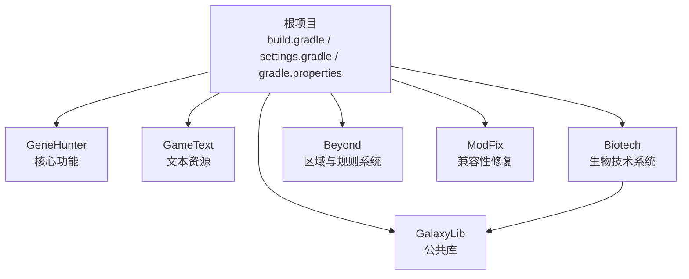
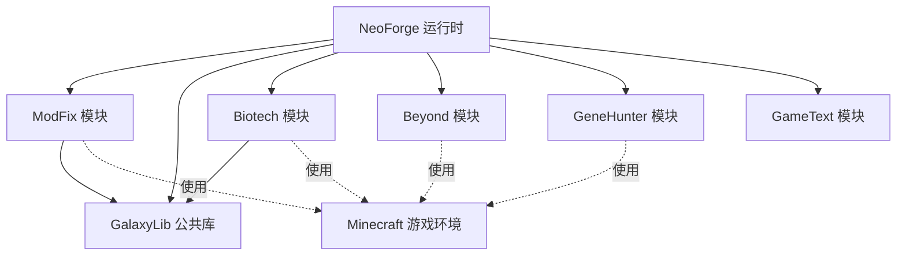
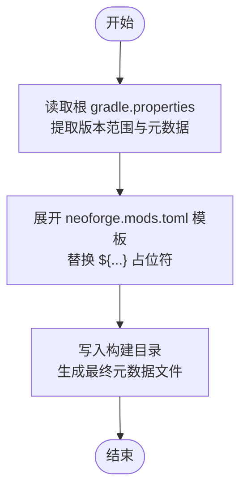
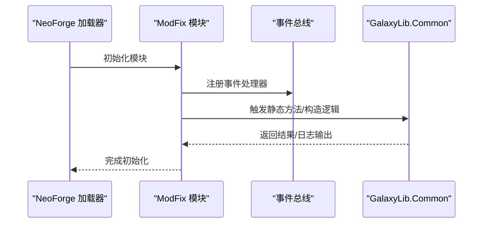
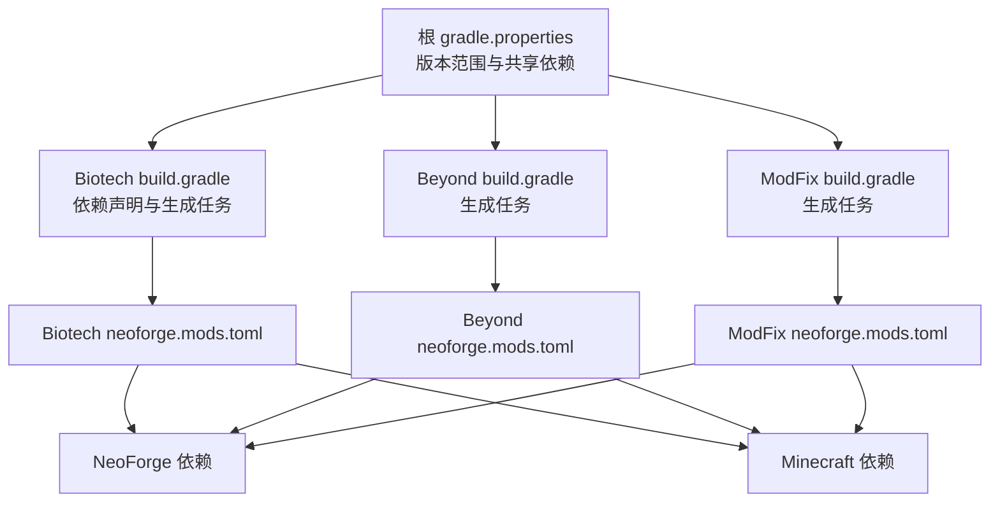

# 兼容性设置

<cite>
**本文档引用的文件**
- [neoforge.mods.toml（Beyond）](file://Beyond/src/main/templates/META-INF/neoforge.mods.toml)
- [neoforge.mods.toml（Biotech）](file://Biotech/src/main/templates/META-INF/neoforge.mods.toml)
- [neoforge.mods.toml（GeneHunter）](file://GeneHunter/src/main/templates/META-INF/neoforge.mods.toml)
- [neoforge.mods.toml（ModFix）](file://ModFix/src/main/templates/META-INF/neoforge.mods.toml)
- [ModFix.java](file://ModFix/src/main/java/org/galaxy/modfix/ModFix.java)
- [Common.java](file://GalaxyLib/src/main/java/org/galaxy/gene_hunter/Common.java)
- [根构建脚本 build.gradle](file://build.gradle)
- [设置文件 settings.gradle](file://settings.gradle)
- [根属性文件 gradle.properties](file://gradle.properties)
- [Beyond 构建脚本 build.gradle](file://Beyond/build.gradle)
- [Beyond 属性文件 gradle.properties](file://Beyond/gradle.properties)
- [Biotech 构建脚本 build.gradle](file://Biotech/build.gradle)
- [Biotech 属性文件 gradle.properties](file://Biotech/gradle.properties)
- [Biotech 混淆配置 biotech.mixins.json](file://Biotech/src/main/resources/biotech.mixins.json)
</cite>

## 目录
1. [简介](#简介)
2. [项目结构](#项目结构)
3. [核心组件](#核心组件)
4. [架构总览](#架构总览)
5. [详细组件分析](#详细组件分析)
6. [依赖关系分析](#依赖关系分析)
7. [性能考虑](#性能考虑)
8. [故障排除指南](#故障排除指南)
9. [结论](#结论)
10. [附录](#附录)

## 简介
本指南聚焦于兼容性设置与Mod修复，围绕neoforge.mods.toml中的依赖声明、版本范围与加载顺序配置展开；同时解析ModFix模块的作用与兼容性修复机制，覆盖与其他Mod的依赖关系管理、版本冲突解决、API兼容性处理、Mod加载顺序优化、启动阶段冲突避免、运行时兼容性测试方法，并提供常见兼容性问题的诊断工具与解决方案，以及面向新版本Minecraft的适配策略。

## 项目结构
该仓库采用多模块结构，包含多个独立的NeoForge Mod模块，每个模块均通过模板化的neoforge.mods.toml进行元数据与依赖声明，构建系统统一在根目录的gradle.properties中集中定义版本范围，确保跨模块一致性与可维护性。

图表来源
- [根构建脚本 build.gradle:1-17](file://build.gradle#L1-L17)
- [设置文件 settings.gradle:1-19](file://settings.gradle#L1-L19)

章节来源
- [根构建脚本 build.gradle:1-17](file://build.gradle#L1-L17)
- [设置文件 settings.gradle:1-19](file://settings.gradle#L1-L19)

## 核心组件
- 依赖声明与版本范围
  - 所有模块均声明对NeoForge与Minecraft的必需依赖，并使用版本范围表达式以支持向后兼容。
  - 版本范围在根gradle.properties中集中定义，确保各模块一致。
- 加载顺序配置
  - 当前模板中依赖项的ordering字段为NONE，表示默认加载顺序；如需强制顺序，可在相应模块的neoforge.mods.toml中调整。
- 混淆与注入
  - Biotech模块提供mixins配置，用于运行时修改与扩展行为，增强兼容性与功能实现。
- 公共库与共享依赖
  - GalaxyLib作为公共库被Biotech模块依赖，减少重复代码与依赖分散。
- ModFix模块
  - 通过最小化入口类与公共库交互，验证跨模块兼容性与类加载稳定性。

章节来源
- [neoforge.mods.toml（Beyond）:48-73](file://Beyond/src/main/templates/META-INF/neoforge.mods.toml#L48-L73)
- [neoforge.mods.toml（Biotech）:48-73](file://Biotech/src/main/templates/META-INF/neoforge.mods.toml#L48-L73)
- [neoforge.mods.toml（GeneHunter）:12-17](file://GeneHunter/src/main/templates/META-INF/neoforge.mods.toml#L12-L17)
- [neoforge.mods.toml（ModFix）:12-24](file://ModFix/src/main/templates/META-INF/neoforge.mods.toml#L12-L24)
- [根属性文件 gradle.properties:9-15](file://gradle.properties#L9-L15)
- [Biotech 构建脚本 build.gradle:65-76](file://Biotech/build.gradle#L65-L76)
- [ModFix.java:1-17](file://ModFix/src/main/java/org/galaxy/modfix/ModFix.java#L1-L17)
- [Common.java:1-9](file://GalaxyLib/src/main/java/org/galaxy/gene_hunter/Common.java#L1-L9)

## 架构总览
下图展示了模块间的依赖关系与兼容性配置如何协同工作，以保证在不同NeoForge与Minecraft版本范围内稳定运行。

图表来源
- [根构建脚本 build.gradle:1-17](file://build.gradle#L1-L17)
- [设置文件 settings.gradle:13-18](file://settings.gradle#L13-L18)
- [neoforge.mods.toml（ModFix）:12-24](file://ModFix/src/main/templates/META-INF/neoforge.mods.toml#L12-L24)
- [neoforge.mods.toml（Biotech）:48-73](file://Biotech/src/main/templates/META-INF/neoforge.mods.toml#L48-L73)
- [neoforge.mods.toml（Beyond）:48-73](file://Beyond/src/main/templates/META-INF/neoforge.mods.toml#L48-L73)
- [neoforge.mods.toml（GeneHunter）:12-17](file://GeneHunter/src/main/templates/META-INF/neoforge.mods.toml#L12-L17)

## 详细组件分析

### 依赖声明与版本范围
- 必需依赖
  - 所有模块均声明对NeoForge与Minecraft的必需依赖，type均为required，versionRange使用模板变量，最终由生成任务替换为具体范围。
- 版本范围策略
  - 根gradle.properties定义了稳定的版本范围，例如NeoForge版本范围从指定主版本开始，Minecraft版本范围覆盖当前主版本到下一个主版本的开区间，确保向后兼容的同时限制破坏性变更。
- 模板生成流程
  - 各模块的generateModMetadata任务读取根gradle.properties中的版本范围与元数据，将模板中的占位符替换为实际值，输出到构建目录，供NeoForge加载器使用。

图表来源
- [根属性文件 gradle.properties:9-15](file://gradle.properties#L9-L15)
- [Biotech 构建脚本 build.gradle:78-96](file://Biotech/build.gradle#L78-L96)
- [Beyond 构建脚本 build.gradle:69-87](file://Beyond/build.gradle#L69-L87)

章节来源
- [neoforge.mods.toml（Beyond）:48-73](file://Beyond/src/main/templates/META-INF/neoforge.mods.toml#L48-L73)
- [neoforge.mods.toml（Biotech）:48-73](file://Biotech/src/main/templates/META-INF/neoforge.mods.toml#L48-L73)
- [neoforge.mods.toml（GeneHunter）:12-17](file://GeneHunter/src/main/templates/META-INF/neoforge.mods.toml#L12-L17)
- [neoforge.mods.toml（ModFix）:12-24](file://ModFix/src/main/templates/META-INF/neoforge.mods.toml#L12-L24)
- [根属性文件 gradle.properties:9-15](file://gradle.properties#L9-L15)
- [Biotech 构建脚本 build.gradle:78-96](file://Biotech/build.gradle#L78-L96)
- [Beyond 构建脚本 build.gradle:69-87](file://Beyond/build.gradle#L69-L87)

### 加载顺序配置
- 当前模板中依赖项的ordering字段为NONE，表示默认加载顺序。
- 若存在明确的加载先后需求（例如某些模块必须先于其他模块初始化），可在相应模块的neoforge.mods.toml中将ordering设为BEFORE或AFTER，并指定目标modId。
- 建议优先在公共依赖较少的模块中保持默认顺序，仅在确有必要时显式声明顺序，以降低耦合度。

章节来源
- [neoforge.mods.toml（Beyond）:60-63](file://Beyond/src/main/templates/META-INF/neoforge.mods.toml#L60-L63)
- [neoforge.mods.toml（Biotech）:60-63](file://Biotech/src/main/templates/META-INF/neoforge.mods.toml#L60-L63)
- [neoforge.mods.toml（GeneHunter）](file://GeneHunter/src/main/templates/META-INF/neoforge.mods.toml#L16)
- [neoforge.mods.toml（ModFix）](file://ModFix/src/main/templates/META-INF/neoforge.mods.toml#L16)

### ModFix模块的作用与兼容性修复机制
- 角色定位
  - ModFix是一个轻量级的兼容性修复模块，通过最小化入口类与公共库交互，验证跨模块类加载与运行时兼容性。
- 实现要点
  - 在构造函数中触发公共库类的实例化与方法调用，有助于在早期发现类路径缺失或版本不匹配问题。
- 适用场景
  - 作为“兼容性探测器”，在集成测试或发布前快速验证核心依赖链是否完整。

图表来源
- [ModFix.java:12-14](file://ModFix/src/main/java/org/galaxy/modfix/ModFix.java#L12-L14)
- [Common.java:5-7](file://GalaxyLib/src/main/java/org/galaxy/gene_hunter/Common.java#L5-L7)

章节来源
- [ModFix.java:1-17](file://ModFix/src/main/java/org/galaxy/modfix/ModFix.java#L1-L17)
- [Common.java:1-9](file://GalaxyLib/src/main/java/org/galaxy/gene_hunter/Common.java#L1-L9)

### 与其他Mod的依赖关系管理
- 对NeoForge与Minecraft的依赖
  - 所有模块均声明对NeoForge与Minecraft的必需依赖，versionRange由根gradle.properties统一提供，确保版本范围一致。
- 对第三方库的依赖
  - Biotech模块显式声明对ldlib2与Curios等第三方库的依赖，并通过根gradle.properties提供的共享版本号避免重复维护。
- 对公共库的依赖
  - Biotech模块依赖GalaxyLib，减少重复代码与依赖分散，提升模块内聚性。

章节来源
- [neoforge.mods.toml（Biotech）:48-73](file://Biotech/src/main/templates/META-INF/neoforge.mods.toml#L48-L73)
- [Biotech 构建脚本 build.gradle:65-76](file://Biotech/build.gradle#L65-L76)
- [根构建脚本 build.gradle:9-14](file://build.gradle#L9-L14)

### 版本冲突解决与API兼容性处理
- 版本冲突解决
  - 通过根gradle.properties集中管理版本范围，避免各模块各自维护导致的版本漂移。
  - 第三方库版本通过共享属性统一管理，Biotech模块可按需覆盖，但建议优先使用共享版本。
- API兼容性处理
  - Biotech模块提供mixins配置，允许在运行时对目标API进行安全的修改与扩展，增强兼容性。
  - 混淆配置中指定了兼容级别与最小版本要求，确保在目标Java版本上稳定运行。

章节来源
- [根属性文件 gradle.properties:17-21](file://gradle.properties#L17-L21)
- [Biotech 构建脚本 build.gradle:65-76](file://Biotech/build.gradle#L65-L76)
- [Biotech 混淆配置 biotech.mixins.json:1-16](file://Biotech/src/main/resources/biotech.mixins.json#L1-L16)

### Mod加载顺序优化与启动阶段冲突避免
- 默认顺序
  - 当前模板未显式声明加载顺序，建议保持默认顺序以降低耦合。
- 显式顺序
  - 若存在强依赖关系，可在相应模块的neoforge.mods.toml中设置BEFORE或AFTER，并指定目标modId，确保初始化顺序可控。
- 冲突避免
  - 将公共逻辑集中在GalaxyLib中，减少各模块对相同外部系统的直接依赖，降低启动阶段的竞争与冲突。

章节来源
- [neoforge.mods.toml（Beyond）:60-63](file://Beyond/src/main/templates/META-INF/neoforge.mods.toml#L60-L63)
- [neoforge.mods.toml（Biotech）:60-63](file://Biotech/src/main/templates/META-INF/neoforge.mods.toml#L60-L63)
- [neoforge.mods.toml（GeneHunter）](file://GeneHunter/src/main/templates/META-INF/neoforge.mods.toml#L16)
- [neoforge.mods.toml（ModFix）](file://ModFix/src/main/templates/META-INF/neoforge.mods.toml#L16)

### 运行时兼容性测试方法
- 类加载验证
  - 通过ModFix模块在构造函数中触发公共库类的方法，验证类路径与依赖完整性。
- 日志与调试
  - 构建脚本中启用了调试日志标记与日志级别，便于在运行时观察注册与加载过程。
- 混淆与注入验证
  - 通过mixins配置与运行时注入，验证目标API的兼容性与修改效果。

章节来源
- [ModFix.java:12-14](file://ModFix/src/main/java/org/galaxy/modfix/ModFix.java#L12-L14)
- [Biotech 构建脚本 build.gradle:48-51](file://Biotech/build.gradle#L48-L51)
- [Beyond 构建脚本 build.gradle:47-50](file://Beyond/build.gradle#L47-L50)
- [Biotech 混淆配置 biotech.mixins.json:1-16](file://Biotech/src/main/resources/biotech.mixins.json#L1-L16)

## 依赖关系分析
下图展示模块间依赖关系与版本范围来源，帮助识别潜在的循环依赖与版本不一致风险。

图表来源
- [根属性文件 gradle.properties:9-15](file://gradle.properties#L9-L15)
- [Biotech 构建脚本 build.gradle:65-76](file://Biotech/build.gradle#L65-L76)
- [Beyond 构建脚本 build.gradle:69-87](file://Beyond/build.gradle#L69-L87)
- [ModFix 构建脚本 build.gradle:74-92](file://ModFix/build.gradle#L74-L92)
- [neoforge.mods.toml（Biotech）:48-73](file://Biotech/src/main/templates/META-INF/neoforge.mods.toml#L48-L73)
- [neoforge.mods.toml（Beyond）:48-73](file://Beyond/src/main/templates/META-INF/neoforge.mods.toml#L48-L73)
- [neoforge.mods.toml（ModFix）:12-24](file://ModFix/src/main/templates/META-INF/neoforge.mods.toml#L12-L24)

章节来源
- [根属性文件 gradle.properties:9-15](file://gradle.properties#L9-L15)
- [Biotech 构建脚本 build.gradle:65-76](file://Biotech/build.gradle#L65-L76)
- [Beyond 构建脚本 build.gradle:69-87](file://Beyond/build.gradle#L69-L87)
- [ModFix 构建脚本 build.gradle:74-92](file://ModFix/build.gradle#L74-L92)
- [neoforge.mods.toml（Biotech）:48-73](file://Biotech/src/main/templates/META-INF/neoforge.mods.toml#L48-L73)
- [neoforge.mods.toml（Beyond）:48-73](file://Beyond/src/main/templates/META-INF/neoforge.mods.toml#L48-L73)
- [neoforge.mods.toml（ModFix）:12-24](file://ModFix/src/main/templates/META-INF/neoforge.mods.toml#L12-L24)

## 性能考虑
- 依赖数量控制
  - 仅引入必要依赖，避免冗余库导致的类加载与内存压力。
- 版本范围设计
  - 合理设置版本范围，避免过宽导致的不稳定，过窄导致的频繁升级成本。
- 混淆与注入
  - mixins应尽量精简，避免对性能产生显著影响；确保注入点准确且必要。

## 故障排除指南
- 依赖缺失或版本不匹配
  - 检查根gradle.properties中的版本范围与模块neoforge.mods.toml中的声明是否一致。
  - 确认第三方库版本与共享属性一致，必要时在模块内临时覆盖。
- 类加载失败
  - 使用ModFix模块进行类加载验证，确认公共库类能够正常初始化。
- 启动阶段冲突
  - 检查是否存在显式加载顺序配置，必要时调整为默认顺序以降低耦合。
- 运行时兼容性问题
  - 通过mixins配置与运行时注入验证目标API的兼容性，逐步排查修改点。

章节来源
- [根属性文件 gradle.properties:9-15](file://gradle.properties#L9-L15)
- [neoforge.mods.toml（Biotech）:48-73](file://Biotech/src/main/templates/META-INF/neoforge.mods.toml#L48-L73)
- [ModFix.java:12-14](file://ModFix/src/main/java/org/galaxy/modfix/ModFix.java#L12-L14)
- [Biotech 混淆配置 biotech.mixins.json:1-16](file://Biotech/src/main/resources/biotech.mixins.json#L1-L16)

## 结论
通过模板化的neoforge.mods.toml与集中式的版本范围管理，本项目实现了跨模块的一致性与可维护性。ModFix模块提供了早期兼容性验证能力，结合mixins与公共库的使用，能够在不牺牲性能的前提下提升运行时兼容性。建议在保持默认加载顺序的基础上，仅在确有必要时显式声明顺序，并持续通过ModFix与调试日志进行兼容性测试。

## 附录
- 新版本Minecraft适配策略
  - 更新根gradle.properties中的parchment与Minecraft版本，确保版本范围覆盖新主版本。
  - 评估第三方库与公共库的兼容性，必要时同步更新共享版本号。
  - 通过ModFix与混入配置进行回归测试，确保核心功能不受影响。