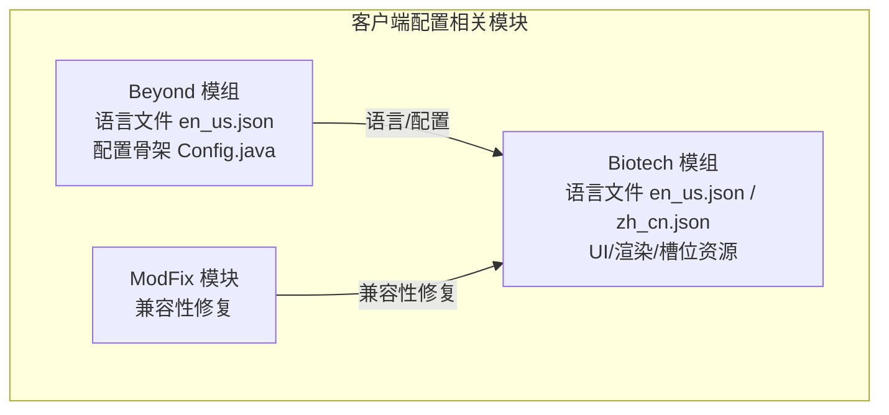
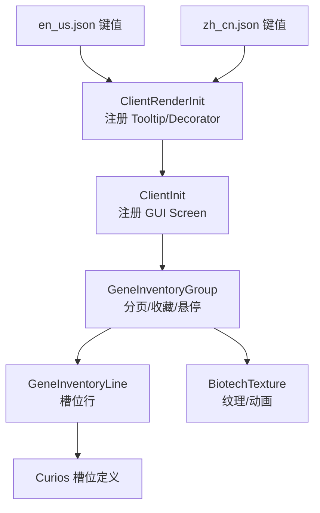
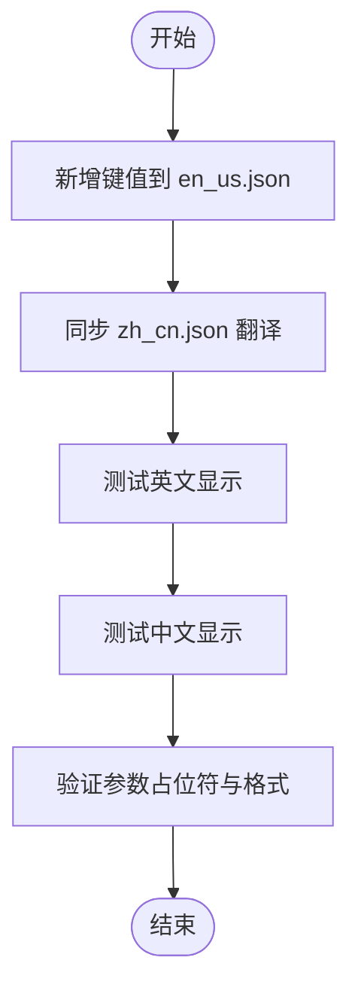
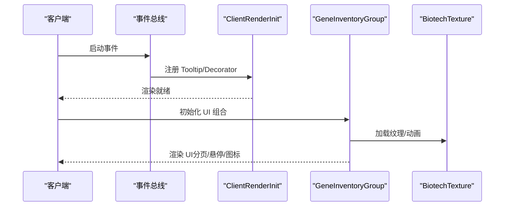
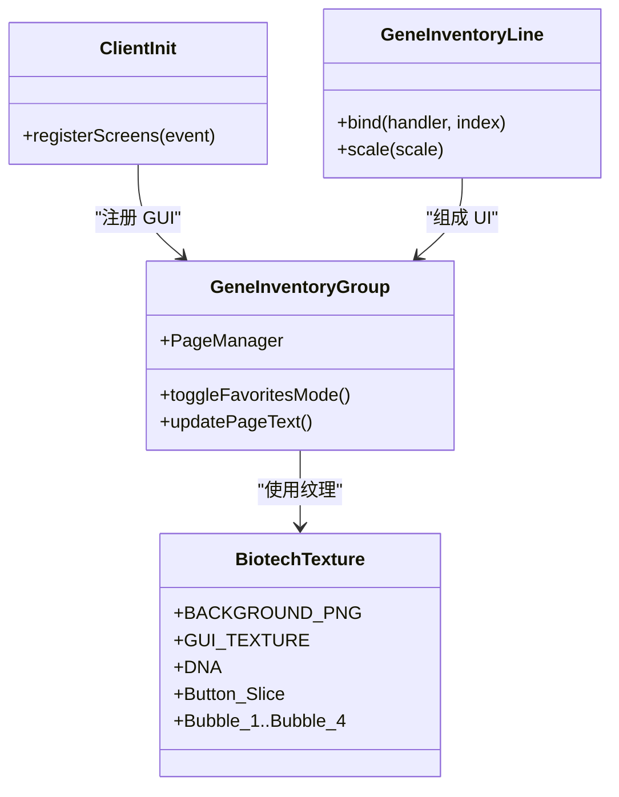
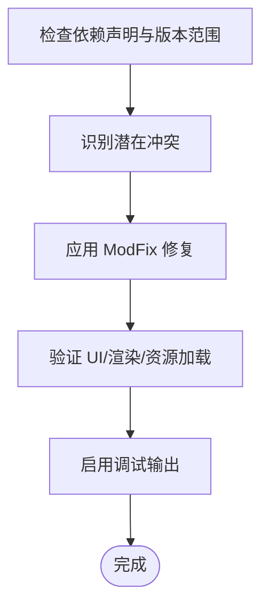
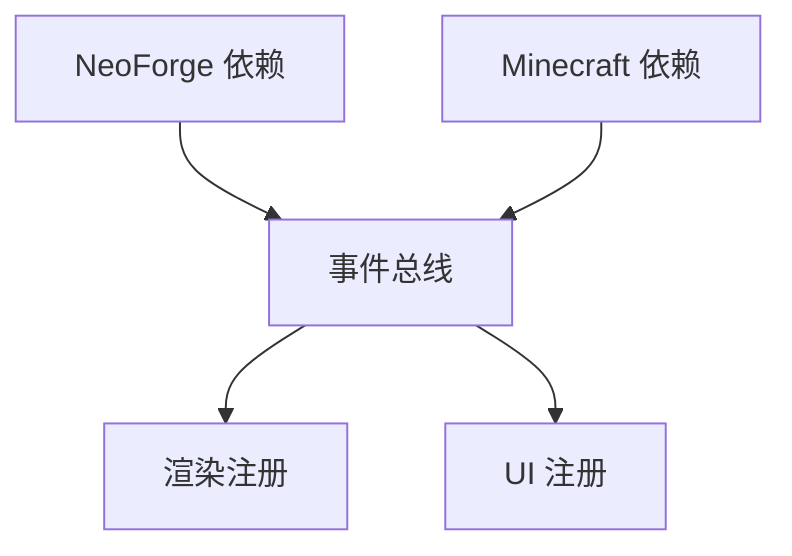

# 客户端配置

<cite>
**本文引用的文件**
- [Beyond 语言文件 en_us.json](file://Beyond/src/main/resources/assets/beyond/lang/en_us.json)
- [Biotech 语言文件 en_us.json](file://Biotech/src/main/resources/assets/biotech/lang/en_us.json)
- [Biotech 语言文件 zh_cn.json](file://Biotech/src/main/resources/assets/biotech/lang/zh_cn.json)
- [Beyond 配置类 Config.java](file://Beyond/src/main/java/com/pz/beyond/Config.java)
- [Biotech 客户端渲染初始化 ClientRenderInit.java](file://Biotech/src/main/java/org/biotech/client/ClientRenderInit.java)
- [Biotech 客户端 UI 注册 ClientInit.java](file://Biotech/src/main/java/org/biotech/api/init/ClientInit.java)
- [Biotech UI 组合 GeneInventoryGroup.java](file://Biotech/src/main/java/org/biotech/ui/gene_inventroy/group/GeneInventoryGroup.java)
- [Biotech UI 行元素 GeneInventoryLine.java](file://Biotech/src/main/java/org/biotech/ui/gene_inventroy/element/inventory/GeneInventoryLine.java)
- [Biotech UI 纹理 BiotechTexture.java](file://Biotech/src/main/java/org/biotech/ui/BiotechTexture.java)
- [Biotech 槽位定义 gene_equip_slot.json](file://Biotech/src/main/resources/data/biotech/curios/slots/gene_equip_slot.json)
- [Biotech 槽位定义 xene_equip_slot.json](file://Biotech/src/main/resources/data/biotech/curios/slots/xene_equip_slot.json)
- [Beyond 模组元数据 neoforge.mods.toml](file://Beyond/src/main/templates/META-INF/neoforge.mods.toml)
- [Biotech 模组元数据 neoforge.mods.toml](file://Biotech/src/main/templates/META-INF/neoforge.mods.toml)
- [ModFix 模块说明 README.md](file://ModFix/README.md)
</cite>

## 目录
1. [简介](#简介)
2. [项目结构](#项目结构)
3. [核心组件](#核心组件)
4. [架构总览](#架构总览)
5. [详细组件分析](#详细组件分析)
6. [依赖关系分析](#依赖关系分析)
7. [性能考虑](#性能考虑)
8. [故障排查指南](#故障排查指南)
9. [结论](#结论)
10. [附录](#附录)

## 简介
本指南聚焦于客户端配置与本地化，覆盖以下主题：
- 语言文件结构与翻译流程（en_us.json、zh_cn.json）
- 客户端渲染设置、UI 显示选项与视觉效果配置
- Mod 菜单配置、图标设置与资源包管理
- 客户端性能优化、帧率调节与图形质量选项
- Mod 兼容性检查、冲突解决与调试工具使用

## 项目结构
本仓库包含多个子模块，其中与客户端配置和本地化直接相关的关键模块如下：
- Beyond：示例模组，包含基础语言文件与配置骨架
- Biotech：核心功能模块，包含完整的 UI、渲染、槽位与本地化资源
- ModFix：兼容性修复模块，用于处理与其他模组的冲突

**图表来源**
- [Beyond 语言文件 en_us.json:1-6](file://Beyond/src/main/resources/assets/beyond/lang/en_us.json#L1-L6)
- [Beyond 配置类 Config.java:1-20](file://Beyond/src/main/java/com/pz/beyond/Config.java#L1-L20)
- [Biotech 语言文件 en_us.json:1-49](file://Biotech/src/main/resources/assets/biotech/lang/en_us.json#L1-L49)
- [Biotech 语言文件 zh_cn.json:1-29](file://Biotech/src/main/resources/assets/biotech/lang/zh_cn.json#L1-L29)
- [ModFix 模块说明 README.md:1-11](file://ModFix/README.md#L1-L11)

**章节来源**
- [Beyond 语言文件 en_us.json:1-6](file://Beyond/src/main/resources/assets/beyond/lang/en_us.json#L1-L6)
- [Beyond 配置类 Config.java:1-20](file://Beyond/src/main/java/com/pz/beyond/Config.java#L1-L20)
- [Biotech 语言文件 en_us.json:1-49](file://Biotech/src/main/resources/assets/biotech/lang/en_us.json#L1-L49)
- [Biotech 语言文件 zh_cn.json:1-29](file://Biotech/src/main/resources/assets/biotech/lang/zh_cn.json#L1-L29)
- [ModFix 模块说明 README.md:1-11](file://ModFix/README.md#L1-L11)

## 核心组件
- 语言文件与本地化键值
  - en_us.json：英文键值映射，用于默认语言显示
  - zh_cn.json：中文键值映射，用于中文本地化
- 客户端渲染与 UI
  - 渲染注册：注册自定义 Tooltip 与 Item Decorator
  - UI 组合：基因背包 UI 的分页、收藏模式、悬停效果与图标叠加
  - 纹理资源：主 UI 纹理图集、动画纹理与按钮切片
- 槽位与菜单
  - Curios 槽位定义：基因装备槽与异种天赋槽的容量与行为
  - 菜单注册：客户端侧注册 GUI Screen

**章节来源**
- [Biotech 客户端渲染初始化 ClientRenderInit.java:1-29](file://Biotech/src/main/java/org/biotech/client/ClientRenderInit.java#L1-L29)
- [Biotech 客户端 UI 注册 ClientInit.java:1-21](file://Biotech/src/main/java/org/biotech/api/init/ClientInit.java#L1-L21)
- [Biotech UI 组合 GeneInventoryGroup.java:1-637](file://Biotech/src/main/java/org/biotech/ui/gene_inventroy/group/GeneInventoryGroup.java#L1-L637)
- [Biotech UI 行元素 GeneInventoryLine.java:1-87](file://Biotech/src/main/java/org/biotech/ui/gene_inventroy/element/inventory/GeneInventoryLine.java#L1-L87)
- [Biotech UI 纹理 BiotechTexture.java:1-39](file://Biotech/src/main/java/org/biotech/ui/BiotechTexture.java#L1-L39)
- [Biotech 槽位定义 gene_equip_slot.json:1-7](file://Biotech/src/main/resources/data/biotech/curios/slots/gene_equip_slot.json#L1-L7)
- [Biotech 槽位定义 xene_equip_slot.json:1-7](file://Biotech/src/main/resources/data/biotech/curios/slots/xene_equip_slot.json#L1-L7)

## 架构总览
客户端配置与本地化涉及以下关键交互：
- 语言文件键值由游戏本地化系统加载，用于文本显示
- 客户端事件总线注册 UI 渲染与菜单
- UI 组合负责布局、分页与视觉效果
- 纹理资源与动画提供界面外观
- 槽位定义控制物品交互与行为

**图表来源**
- [Biotech 语言文件 en_us.json:1-49](file://Biotech/src/main/resources/assets/biotech/lang/en_us.json#L1-L49)
- [Biotech 语言文件 zh_cn.json:1-29](file://Biotech/src/main/resources/assets/biotech/lang/zh_cn.json#L1-L29)
- [Biotech 客户端渲染初始化 ClientRenderInit.java:1-29](file://Biotech/src/main/java/org/biotech/client/ClientRenderInit.java#L1-L29)
- [Biotech 客户端 UI 注册 ClientInit.java:1-21](file://Biotech/src/main/java/org/biotech/api/init/ClientInit.java#L1-L21)
- [Biotech UI 组合 GeneInventoryGroup.java:1-637](file://Biotech/src/main/java/org/biotech/ui/gene_inventroy/group/GeneInventoryGroup.java#L1-L637)
- [Biotech UI 行元素 GeneInventoryLine.java:1-87](file://Biotech/src/main/java/org/biotech/ui/gene_inventroy/element/inventory/GeneInventoryLine.java#L1-L87)
- [Biotech UI 纹理 BiotechTexture.java:1-39](file://Biotech/src/main/java/org/biotech/ui/BiotechTexture.java#L1-L39)
- [Biotech 槽位定义 gene_equip_slot.json:1-7](file://Biotech/src/main/resources/data/biotech/curios/slots/gene_equip_slot.json#L1-L7)
- [Biotech 槽位定义 xene_equip_slot.json:1-7](file://Biotech/src/main/resources/data/biotech/curios/slots/xene_equip_slot.json#L1-L7)

## 详细组件分析

### 语言文件与本地化流程
- 结构与职责
  - en_us.json：提供英文键值映射，作为默认语言
  - zh_cn.json：提供中文键值映射，用于中文本地化
- 维护方法
  - 新增键值时，需在 en_us.json 中添加，并同步在 zh_cn.json 中提供对应翻译
  - 键名应遵循模块命名空间前缀，如 biotech.*、beyond.*
  - 文本中可使用参数占位符，以支持动态内容插入
- 加载与生效
  - 游戏启动时，资源包按优先级加载，本地化键值由系统替换显示

**图表来源**
- [Biotech 语言文件 en_us.json:1-49](file://Biotech/src/main/resources/assets/biotech/lang/en_us.json#L1-L49)
- [Biotech 语言文件 zh_cn.json:1-29](file://Biotech/src/main/resources/assets/biotech/lang/zh_cn.json#L1-L29)

**章节来源**
- [Beyond 语言文件 en_us.json:1-6](file://Beyond/src/main/resources/assets/beyond/lang/en_us.json#L1-L6)
- [Biotech 语言文件 en_us.json:1-49](file://Biotech/src/main/resources/assets/biotech/lang/en_us.json#L1-L49)
- [Biotech 语言文件 zh_cn.json:1-29](file://Biotech/src/main/resources/assets/biotech/lang/zh_cn.json#L1-L29)

### 客户端渲染设置与 UI 显示选项
- 渲染注册
  - 注册自定义 Tooltip 组件工厂与 Item Decorator，以扩展 UI 交互与装饰
- UI 组合与布局
  - 分页容器：支持多页基因槽位展示，阶梯式偏移增强层次感
  - 收藏模式：独立页码与显示状态，便于快速检索
  - 悬停效果：绘制槽位背景与悬停高亮，叠加物品图标与罗马数字计数
- 视觉效果配置
  - 纹理图集与切片：按钮切片采用九宫格拉伸，确保缩放一致性
  - 动画纹理：气泡等动画资源用于增强界面活力

**图表来源**
- [Biotech 客户端渲染初始化 ClientRenderInit.java:1-29](file://Biotech/src/main/java/org/biotech/client/ClientRenderInit.java#L1-L29)
- [Biotech 客户端 UI 注册 ClientInit.java:1-21](file://Biotech/src/main/java/org/biotech/api/init/ClientInit.java#L1-L21)
- [Biotech UI 组合 GeneInventoryGroup.java:1-637](file://Biotech/src/main/java/org/biotech/ui/gene_inventroy/group/GeneInventoryGroup.java#L1-L637)
- [Biotech UI 纹理 BiotechTexture.java:1-39](file://Biotech/src/main/java/org/biotech/ui/BiotechTexture.java#L1-L39)

**章节来源**
- [Biotech 客户端渲染初始化 ClientRenderInit.java:1-29](file://Biotech/src/main/java/org/biotech/client/ClientRenderInit.java#L1-L29)
- [Biotech 客户端 UI 注册 ClientInit.java:1-21](file://Biotech/src/main/java/org/biotech/api/init/ClientInit.java#L1-L21)
- [Biotech UI 组合 GeneInventoryGroup.java:1-637](file://Biotech/src/main/java/org/biotech/ui/gene_inventroy/group/GeneInventoryGroup.java#L1-L637)
- [Biotech UI 行元素 GeneInventoryLine.java:1-87](file://Biotech/src/main/java/org/biotech/ui/gene_inventroy/element/inventory/GeneInventoryLine.java#L1-L87)
- [Biotech UI 纹理 BiotechTexture.java:1-39](file://Biotech/src/main/java/org/biotech/ui/BiotechTexture.java#L1-L39)

### Mod 菜单配置、图标设置与资源包管理
- 菜单注册
  - 客户端侧注册 GUI Screen，绑定容器与屏幕实现
- 图标与资源
  - 纹理图集与动画资源位于 assets 下，通过 ResourceLocation 引用
  - 槽位定义文件控制物品交互与行为（容量、掉落规则、GUI 使用）
- 资源包管理
  - 通过资源包优先级与命名空间组织，确保键值与纹理正确加载

**图表来源**
- [Biotech 客户端 UI 注册 ClientInit.java:1-21](file://Biotech/src/main/java/org/biotech/api/init/ClientInit.java#L1-L21)
- [Biotech UI 组合 GeneInventoryGroup.java:1-637](file://Biotech/src/main/java/org/biotech/ui/gene_inventroy/group/GeneInventoryGroup.java#L1-L637)
- [Biotech UI 行元素 GeneInventoryLine.java:1-87](file://Biotech/src/main/java/org/biotech/ui/gene_inventroy/element/inventory/GeneInventoryLine.java#L1-L87)
- [Biotech UI 纹理 BiotechTexture.java:1-39](file://Biotech/src/main/java/org/biotech/ui/BiotechTexture.java#L1-L39)

**章节来源**
- [Biotech 客户端 UI 注册 ClientInit.java:1-21](file://Biotech/src/main/java/org/biotech/api/init/ClientInit.java#L1-L21)
- [Biotech UI 组合 GeneInventoryGroup.java:1-637](file://Biotech/src/main/java/org/biotech/ui/gene_inventroy/group/GeneInventoryGroup.java#L1-L637)
- [Biotech UI 行元素 GeneInventoryLine.java:1-87](file://Biotech/src/main/java/org/biotech/ui/gene_inventroy/element/inventory/GeneInventoryLine.java#L1-L87)
- [Biotech UI 纹理 BiotechTexture.java:1-39](file://Biotech/src/main/java/org/biotech/ui/BiotechTexture.java#L1-L39)
- [Biotech 槽位定义 gene_equip_slot.json:1-7](file://Biotech/src/main/resources/data/biotech/curios/slots/gene_equip_slot.json#L1-L7)
- [Biotech 槽位定义 xene_equip_slot.json:1-7](file://Biotech/src/main/resources/data/biotech/curios/slots/xene_equip_slot.json#L1-L7)

### 客户端性能优化、帧率调节与图形质量
- 性能优化建议
  - 减少不必要的纹理绘制与层级嵌套，合理使用九宫格切片
  - 控制 UI 动画数量与复杂度，避免高频刷新
  - 使用分页与懒加载策略，降低一次性渲染压力
- 帧率与图形质量
  - 通过资源包与纹理分辨率平衡视觉效果与性能
  - 合理设置缩放与布局，减少过度缩放导致的像素化或模糊

**章节来源**
- [Biotech UI 组合 GeneInventoryGroup.java:1-637](file://Biotech/src/main/java/org/biotech/ui/gene_inventroy/group/GeneInventoryGroup.java#L1-L637)
- [Biotech UI 纹理 BiotechTexture.java:1-39](file://Biotech/src/main/java/org/biotech/ui/BiotechTexture.java#L1-L39)

### Mod 兼容性检查、冲突解决与调试工具
- 兼容性检查
  - 依赖声明：确保 NeoForge 与 Minecraft 版本范围满足要求
  - 模组间依赖与排序：通过 toml 文件声明依赖关系与加载顺序
- 冲突解决
  - 使用 ModFix 模块进行定向修复，避免引入新玩法
  - 通过 Mixin 与事件总线最小化侵入式修改
- 调试工具
  - 启用日志与调试输出，定位 UI 渲染与资源加载异常
  - 使用模组元数据校验依赖与版本匹配

**图表来源**
- [Beyond 模组元数据 neoforge.mods.toml:1-80](file://Beyond/src/main/templates/META-INF/neoforge.mods.toml#L1-L80)
- [Biotech 模组元数据 neoforge.mods.toml:1-80](file://Biotech/src/main/templates/META-INF/neoforge.mods.toml#L1-L80)
- [ModFix 模块说明 README.md:1-11](file://ModFix/README.md#L1-L11)

**章节来源**
- [Beyond 模组元数据 neoforge.mods.toml:1-80](file://Beyond/src/main/templates/META-INF/neoforge.mods.toml#L1-L80)
- [Biotech 模组元数据 neoforge.mods.toml:1-80](file://Biotech/src/main/templates/META-INF/neoforge.mods.toml#L1-L80)
- [ModFix 模块说明 README.md:1-11](file://ModFix/README.md#L1-L11)

## 依赖关系分析
- 模组依赖
  - NeoForge 与 Minecraft 版本范围在 toml 中声明
  - 模组间依赖与加载顺序通过排序字段控制
- 客户端事件
  - 渲染与 UI 注册通过事件总线订阅，确保生命周期正确

**图表来源**
- [Beyond 模组元数据 neoforge.mods.toml:48-73](file://Beyond/src/main/templates/META-INF/neoforge.mods.toml#L48-L73)
- [Biotech 模组元数据 neoforge.mods.toml:48-73](file://Biotech/src/main/templates/META-INF/neoforge.mods.toml#L48-L73)
- [Biotech 客户端渲染初始化 ClientRenderInit.java:1-29](file://Biotech/src/main/java/org/biotech/client/ClientRenderInit.java#L1-L29)
- [Biotech 客户端 UI 注册 ClientInit.java:1-21](file://Biotech/src/main/java/org/biotech/api/init/ClientInit.java#L1-L21)

**章节来源**
- [Beyond 模组元数据 neoforge.mods.toml:1-80](file://Beyond/src/main/templates/META-INF/neoforge.mods.toml#L1-L80)
- [Biotech 模组元数据 neoforge.mods.toml:1-80](file://Biotech/src/main/templates/META-INF/neoforge.mods.toml#L1-L80)
- [Biotech 客户端渲染初始化 ClientRenderInit.java:1-29](file://Biotech/src/main/java/org/biotech/client/ClientRenderInit.java#L1-L29)
- [Biotech 客户端 UI 注册 ClientInit.java:1-21](file://Biotech/src/main/java/org/biotech/api/init/ClientInit.java#L1-L21)

## 性能考虑
- 渲染性能
  - 控制 UI 层级深度，避免过多嵌套
  - 使用九宫格切片与合适的纹理尺寸，减少拉伸开销
- 资源加载
  - 合理拆分资源包，按需加载
  - 避免重复纹理与冗余动画
- 用户体验
  - 提供缩放与布局选项，适配不同分辨率与偏好

## 故障排查指南
- 本地化不生效
  - 检查键名是否与语言文件一致，确认命名空间前缀
  - 验证 zh_cn.json 是否包含缺失的翻译
- UI 渲染异常
  - 确认渲染注册事件是否正确触发
  - 检查纹理路径与资源包加载顺序
- 槽位交互问题
  - 校验槽位定义文件的容量与行为设置
  - 确认 GUI 使用标志与掉落规则符合预期
- 兼容性冲突
  - 查看模组依赖声明与版本范围
  - 使用 ModFix 进行定向修复，避免引入副作用

**章节来源**
- [Biotech 语言文件 en_us.json:1-49](file://Biotech/src/main/resources/assets/biotech/lang/en_us.json#L1-L49)
- [Biotech 语言文件 zh_cn.json:1-29](file://Biotech/src/main/resources/assets/biotech/lang/zh_cn.json#L1-L29)
- [Biotech 客户端渲染初始化 ClientRenderInit.java:1-29](file://Biotech/src/main/java/org/biotech/client/ClientRenderInit.java#L1-L29)
- [Biotech 客户端 UI 注册 ClientInit.java:1-21](file://Biotech/src/main/java/org/biotech/api/init/ClientInit.java#L1-L21)
- [Biotech 槽位定义 gene_equip_slot.json:1-7](file://Biotech/src/main/resources/data/biotech/curios/slots/gene_equip_slot.json#L1-L7)
- [Biotech 槽位定义 xene_equip_slot.json:1-7](file://Biotech/src/main/resources/data/biotech/curios/slots/xene_equip_slot.json#L1-L7)
- [Beyond 模组元数据 neoforge.mods.toml:1-80](file://Beyond/src/main/templates/META-INF/neoforge.mods.toml#L1-L80)
- [Biotech 模组元数据 neoforge.mods.toml:1-80](file://Biotech/src/main/templates/META-INF/neoforge.mods.toml#L1-L80)
- [ModFix 模块说明 README.md:1-11](file://ModFix/README.md#L1-L11)

## 结论
本指南提供了从语言文件维护到客户端渲染、UI 显示、Mod 菜单与资源包管理的完整配置路径，并结合性能优化与兼容性处理建议。通过遵循本文档的流程与最佳实践，可有效提升本地化质量与客户端体验。

## 附录
- 配置骨架
  - Beyond 提供了基础配置骨架，可用于扩展客户端配置项
- 本地化键值参考
  - en_us.json 与 zh_cn.json 中的键值可作为新增翻译的参考模板

**章节来源**
- [Beyond 配置类 Config.java:1-20](file://Beyond/src/main/java/com/pz/beyond/Config.java#L1-L20)
- [Beyond 语言文件 en_us.json:1-6](file://Beyond/src/main/resources/assets/beyond/lang/en_us.json#L1-L6)
- [Biotech 语言文件 en_us.json:1-49](file://Biotech/src/main/resources/assets/biotech/lang/en_us.json#L1-L49)
- [Biotech 语言文件 zh_cn.json:1-29](file://Biotech/src/main/resources/assets/biotech/lang/zh_cn.json#L1-L29)