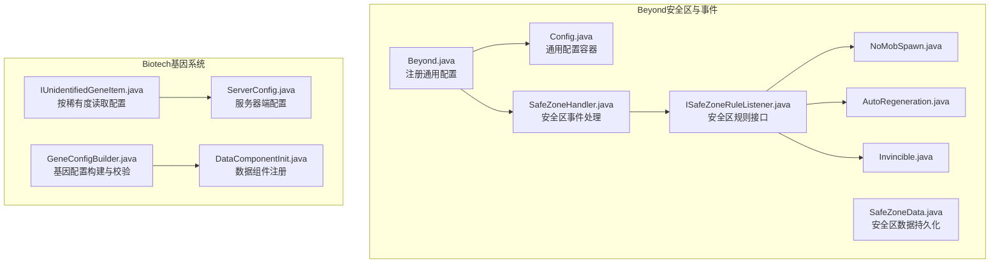
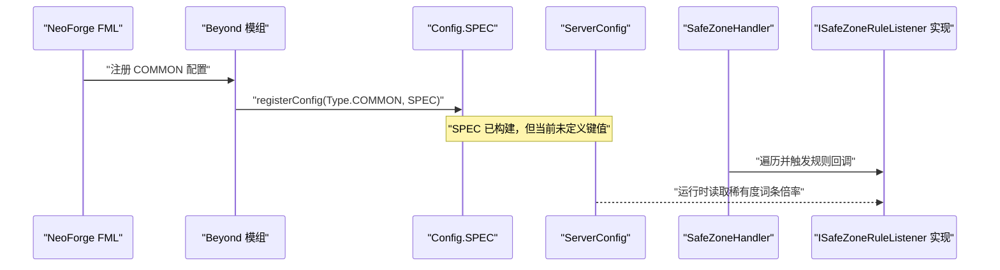
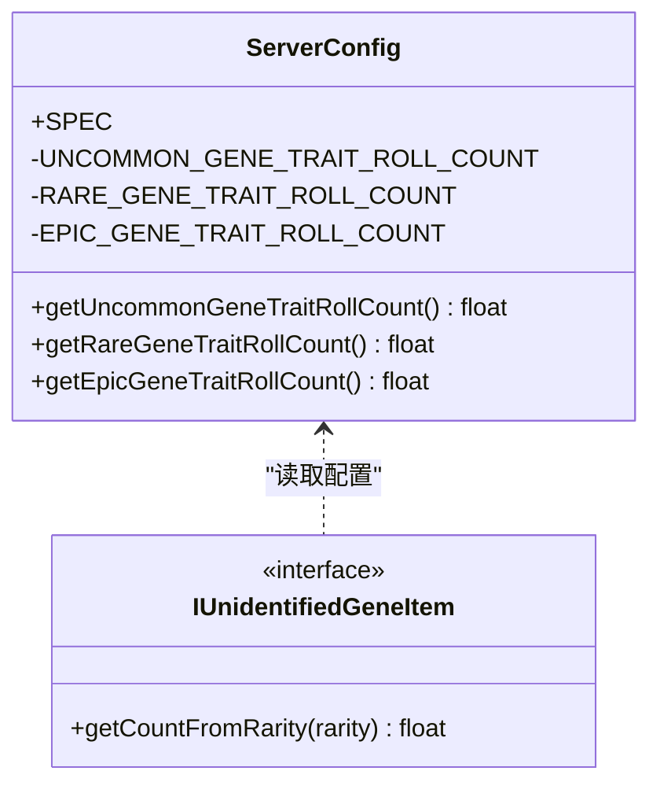
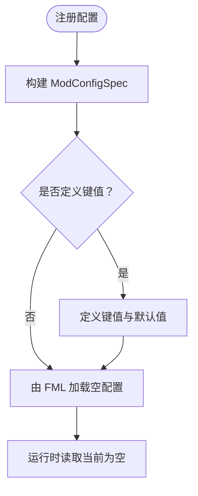
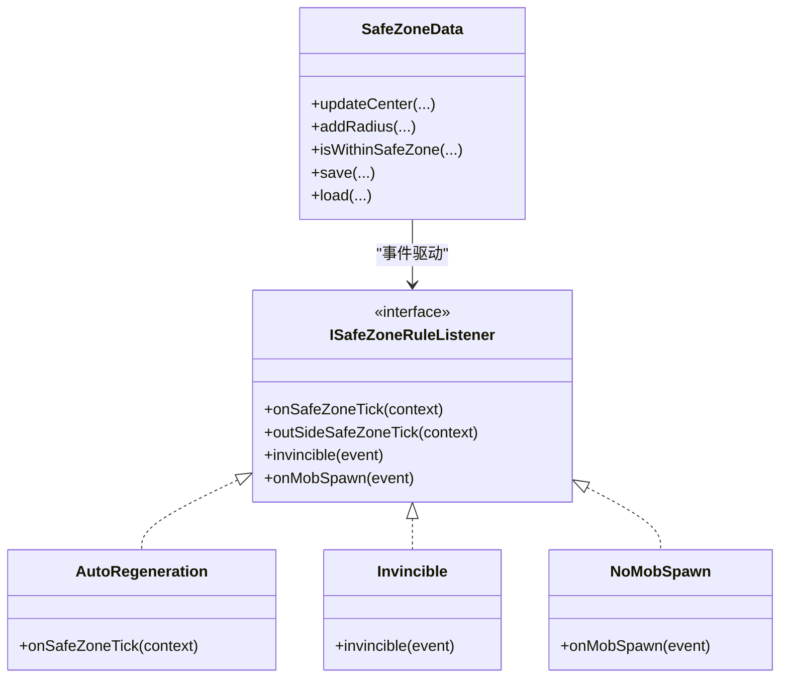
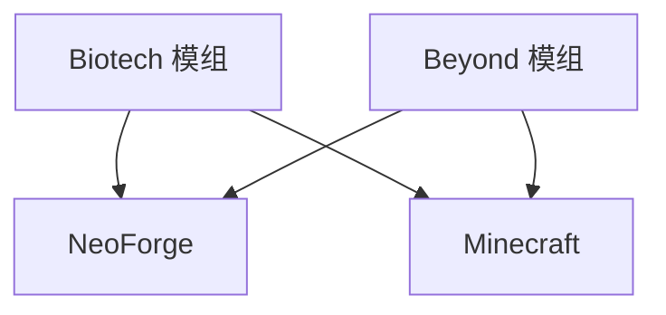

# 服务器配置

<cite>
**本文引用的文件**
- [Beyond.java](file://Beyond/src/main/java/com/pz/beyond/Beyond.java)
- [Config.java](file://Beyond/src/main/java/com/pz/beyond/Config.java)
- [SafeZoneData.java](file://Beyond/src/main/java/com/pz/beyond/data/SafeZoneData.java)
- [ISafeZoneRuleListener.java](file://Beyond/src/main/java/com/pz/beyond/safeZoneRule/ISafeZoneRuleListener.java)
- [NoMobSpawn.java](file://Beyond/src/main/java/com/pz/beyond/safeZoneRule/impl/NoMobSpawn.java)
- [AutoRegeneration.java](file://Beyond/src/main/java/com/pz/beyond/safeZoneRule/impl/AutoRegeneration.java)
- [Invincible.java](file://Beyond/src/main/java/com/pz/beyond/safeZoneRule/impl/Invincible.java)
- [SafeZoneHandler.java](file://Beyond/src/main/java/com/pz/beyond/event/SafeZoneHandler.java)
- [ServerConfig.java](file://Biotech/src/main/java/org/biotech/api/config/ServerConfig.java)
- [IUnidentifiedGeneItem.java](file://Biotech/src/main/java/org/biotech/api/system/gene/core/IUnidentifiedGeneItem.java)
- [GeneConfigBuilder.java](file://Biotech/src/main/java/org/biotech/api/system/gene/GeneConfigBuilder.java)
- [DataComponentInit.java](file://Biotech/src/main/java/org/biotech/api/init/DataComponentInit.java)
- [neoforge.mods.toml（Beyond）](file://Beyond/src/main/templates/META-INF/neoforge.mods.toml)
- [neoforge.mods.toml（Biotech）](file://Biotech/src/main/templates/META-INF/neoforge.mods.toml)
- [build.gradle](file://build.gradle)
</cite>

## 目录
1. [简介](#简介)
2. [项目结构](#项目结构)
3. [核心组件](#核心组件)
4. [架构总览](#架构总览)
5. [详细组件分析](#详细组件分析)
6. [依赖分析](#依赖分析)
7. [性能考虑](#性能考虑)
8. [故障排除指南](#故障排除指南)
9. [结论](#结论)
10. [附录](#附录)

## 简介
本指南聚焦于服务器端配置，围绕以下目标展开：
- 全面梳理 ServerConfig 与 Config 类中的配置项，涵盖基因系统参数、安全区规则设置与性能相关参数。
- 解释配置文件加载机制、默认值来源与运行时读取方式。
- 覆盖服务器启动参数、内存分配优化与并发处理建议。
- 提供单人游戏、多人服务器与高负载环境下的配置最佳实践。
- 包含配置验证、错误处理与故障排除方法。

## 项目结构
本仓库包含三个主要模块：Beyond（安全区与事件）、Biotech（基因系统与配置）、以及若干辅助模块。与服务器配置直接相关的关键位置如下：
- Beyond 模块负责注册与加载通用配置，并实现安全区规则与事件处理。
- Biotech 模块提供 ServerConfig（服务器端配置）与基因系统相关配置项。
- 构建脚本与模组元数据定义了依赖与版本范围。

图表来源
- [Beyond.java:58-60](file://Beyond/src/main/java/com/pz/beyond/Beyond.java#L58-L60)
- [Config.java:1-20](file://Beyond/src/main/java/com/pz/beyond/Config.java#L1-L20)
- [SafeZoneData.java:1-101](file://Beyond/src/main/java/com/pz/beyond/data/SafeZoneData.java#L1-L101)
- [ISafeZoneRuleListener.java:1-41](file://Beyond/src/main/java/com/pz/beyond/safeZoneRule/ISafeZoneRuleListener.java#L1-L41)
- [NoMobSpawn.java:1-28](file://Beyond/src/main/java/com/pz/beyond/safeZoneRule/impl/NoMobSpawn.java#L1-L28)
- [AutoRegeneration.java:1-18](file://Beyond/src/main/java/com/pz/beyond/safeZoneRule/impl/AutoRegeneration.java#L1-L18)
- [Invincible.java:1-23](file://Beyond/src/main/java/com/pz/beyond/safeZoneRule/impl/Invincible.java#L1-L23)
- [SafeZoneHandler.java:58-76](file://Beyond/src/main/java/com/pz/beyond/event/SafeZoneHandler.java#L58-L76)
- [ServerConfig.java:1-49](file://Biotech/src/main/java/org/biotech/api/config/ServerConfig.java#L1-L49)
- [IUnidentifiedGeneItem.java:94-137](file://Biotech/src/main/java/org/biotech/api/system/gene/core/IUnidentifiedGeneItem.java#L94-L137)
- [GeneConfigBuilder.java:1-109](file://Biotech/src/main/java/org/biotech/api/system/gene/GeneConfigBuilder.java#L1-L109)
- [DataComponentInit.java:1-47](file://Biotech/src/main/java/org/biotech/api/init/DataComponentInit.java#L1-L47)

章节来源
- [Beyond.java:58-60](file://Beyond/src/main/java/com/pz/beyond/Beyond.java#L58-L60)
- [Config.java:1-20](file://Beyond/src/main/java/com/pz/beyond/Config.java#L1-L20)
- [ServerConfig.java:1-49](file://Biotech/src/main/java/org/biotech/api/config/ServerConfig.java#L1-L49)
- [IUnidentifiedGeneItem.java:94-137](file://Biotech/src/main/java/org/biotech/api/system/gene/core/IUnidentifiedGeneItem.java#L94-L137)
- [SafeZoneData.java:1-101](file://Beyond/src/main/java/com/pz/beyond/data/SafeZoneData.java#L1-L101)
- [ISafeZoneRuleListener.java:1-41](file://Beyond/src/main/java/com/pz/beyond/safeZoneRule/ISafeZoneRuleListener.java#L1-L41)
- [SafeZoneHandler.java:58-76](file://Beyond/src/main/java/com/pz/beyond/event/SafeZoneHandler.java#L58-L76)

## 核心组件
本节概述与服务器配置直接相关的两类配置容器及其职责：
- Config（Beyond）：通用配置容器，当前未定义具体配置项，但已注册为 COMMON 类型配置，供通用配置使用。
- ServerConfig（Biotech）：服务器端配置，定义了“未鉴定基因”按稀有度的词条点数倍率，支持运行时读取。

章节来源
- [Config.java:1-20](file://Beyond/src/main/java/com/pz/beyond/Config.java#L1-L20)
- [Beyond.java:58-60](file://Beyond/src/main/java/com/pz/beyond/Beyond.java#L58-L60)
- [ServerConfig.java:1-49](file://Biotech/src/main/java/org/biotech/api/config/ServerConfig.java#L1-L49)

## 架构总览
下图展示配置在运行时的加载与使用路径，以及与事件系统的交互：

图表来源
- [Beyond.java:58-60](file://Beyond/src/main/java/com/pz/beyond/Beyond.java#L58-L60)
- [Config.java:1-20](file://Beyond/src/main/java/com/pz/beyond/Config.java#L1-L20)
- [SafeZoneHandler.java:70-76](file://Beyond/src/main/java/com/pz/beyond/event/SafeZoneHandler.java#L70-L76)
- [ServerConfig.java:1-49](file://Biotech/src/main/java/org/biotech/api/config/ServerConfig.java#L1-L49)

## 详细组件分析

### ServerConfig（服务器端配置）
- 配置项
  - 不同稀有度的“未鉴定基因”词条点数倍率：
    - 普通（Uncommon）
    - 稀有（Rare）
    - 史诗（Epic）
- 默认值与范围
  - 所有数值均通过 defineInRange 定义，具备最小值与最大值约束，确保运行时不会越界。
- 运行时读取
  - 通过静态方法以浮点形式返回当前配置值，便于在游戏逻辑中直接使用。
- 与基因系统的耦合
  - IUnidentifiedGeneItem 依据物品稀有度选择对应的倍率，从而影响词条生成数量。

图表来源
- [ServerConfig.java:1-49](file://Biotech/src/main/java/org/biotech/api/config/ServerConfig.java#L1-L49)
- [IUnidentifiedGeneItem.java:94-137](file://Biotech/src/main/java/org/biotech/api/system/gene/core/IUnidentifiedGeneItem.java#L94-L137)

章节来源
- [ServerConfig.java:1-49](file://Biotech/src/main/java/org/biotech/api/config/ServerConfig.java#L1-L49)
- [IUnidentifiedGeneItem.java:94-137](file://Biotech/src/main/java/org/biotech/api/system/gene/core/IUnidentifiedGeneItem.java#L94-L137)

### Config（通用配置容器）
- 当前实现
  - 仅构建了空的 ModConfigSpec，未定义任何键值。
- 加载机制
  - 通过 Beyond 模组在生命周期中注册为 COMMON 类型配置，由 NeoForge 自动创建与加载配置文件。
- 运行时修改
  - 由于未定义键值，当前无法通过配置文件调整行为；如需启用某项功能，可在 Builder 中添加键值并重新构建 SPEC。

图表来源
- [Config.java:1-20](file://Beyond/src/main/java/com/pz/beyond/Config.java#L1-L20)
- [Beyond.java:58-60](file://Beyond/src/main/java/com/pz/beyond/Beyond.java#L58-L60)

章节来源
- [Config.java:1-20](file://Beyond/src/main/java/com/pz/beyond/Config.java#L1-L20)
- [Beyond.java:58-60](file://Beyond/src/main/java/com/pz/beyond/Beyond.java#L58-L60)

### 安全区规则与配置联动
- 规则接口
  - ISafeZoneRuleListener 定义了安全区内/外每 tick 的回调，以及无敌与禁止怪物生成等事件处理入口。
- 规则实现
  - AutoRegeneration：在安全区内每秒回血一次。
  - Invincible：将伤害归零，实现无敌效果。
  - NoMobSpawn：阻止特定标签的生物在安全区内生成。
- 数据持久化
  - SafeZoneData 负责安全区中心坐标、半径与初始化标记的保存与加载，并在变更后广播更新。

图表来源
- [ISafeZoneRuleListener.java:1-41](file://Beyond/src/main/java/com/pz/beyond/safeZoneRule/ISafeZoneRuleListener.java#L1-L41)
- [AutoRegeneration.java:1-18](file://Beyond/src/main/java/com/pz/beyond/safeZoneRule/impl/AutoRegeneration.java#L1-L18)
- [Invincible.java:1-23](file://Beyond/src/main/java/com/pz/beyond/safeZoneRule/impl/Invincible.java#L1-L23)
- [NoMobSpawn.java:1-28](file://Beyond/src/main/java/com/pz/beyond/safeZoneRule/impl/NoMobSpawn.java#L1-L28)
- [SafeZoneData.java:1-101](file://Beyond/src/main/java/com/pz/beyond/data/SafeZoneData.java#L1-L101)

章节来源
- [ISafeZoneRuleListener.java:1-41](file://Beyond/src/main/java/com/pz/beyond/safeZoneRule/ISafeZoneRuleListener.java#L1-L41)
- [AutoRegeneration.java:1-18](file://Beyond/src/main/java/com/pz/beyond/safeZoneRule/impl/AutoRegeneration.java#L1-L18)
- [Invincible.java:1-23](file://Beyond/src/main/java/com/pz/beyond/safeZoneRule/impl/Invincible.java#L1-L23)
- [NoMobSpawn.java:1-28](file://Beyond/src/main/java/com/pz/beyond/safeZoneRule/impl/NoMobSpawn.java#L1-L28)
- [SafeZoneData.java:1-101](file://Beyond/src/main/java/com/pz/beyond/data/SafeZoneData.java#L1-L101)

### 配置加载机制与默认值
- 加载入口
  - Beyond 模组在构造函数中通过 ModContainer.registerConfig 将 Config.SPEC 注册为 COMMON 配置。
- 文件位置
  - NeoForge 会在运行目录的 config 子目录下生成对应模组的配置文件（例如 neoforge-common.toml）。
- 默认值来源
  - Config 当前为空，因此默认值集合为空；若要生效，需在 Builder 中显式定义键值与默认值。
- 运行时读取
  - 通过 ModConfigSpec.Value.get() 获取当前值；对于 ServerConfig，已提供静态方法封装读取。

章节来源
- [Beyond.java:58-60](file://Beyond/src/main/java/com/pz/beyond/Beyond.java#L58-L60)
- [Config.java:1-20](file://Beyond/src/main/java/com/pz/beyond/Config.java#L1-L20)
- [ServerConfig.java:1-49](file://Biotech/src/main/java/org/biotech/api/config/ServerConfig.java#L1-L49)

### 基因系统配置与数据组件
- 配置构建器
  - GeneConfigBuilder 支持设置稀有度、词条集合与自定义数据组件，并在 build() 时进行有效性检查。
- 数据组件
  - DataComponentInit 注册了 TraitComp 与 GeneInstance 等数据组件，用于承载基因与词条的持久化与网络同步。
- 配置验证
  - 构建器在缺少必要组件（如稀有度）时抛出异常，避免无效配置进入运行时。

章节来源
- [GeneConfigBuilder.java:1-109](file://Biotech/src/main/java/org/biotech/api/system/gene/GeneConfigBuilder.java#L1-L109)
- [DataComponentInit.java:1-47](file://Biotech/src/main/java/org/biotech/api/init/DataComponentInit.java#L1-L47)

## 依赖分析
- 模组依赖
  - 两个模组的 neoforge.mods.toml 均声明了对 NeoForge 与 Minecraft 的依赖，版本范围由模板变量控制。
- 构建与仓库
  - 顶层 build.gradle 配置了统一的 Maven 仓库，确保依赖解析稳定。

图表来源
- [neoforge.mods.toml（Biotech）:45-74](file://Biotech/src/main/templates/META-INF/neoforge.mods.toml#L45-L74)
- [neoforge.mods.toml（Beyond）:48-73](file://Beyond/src/main/templates/META-INF/neoforge.mods.toml#L48-L73)
- [build.gradle:1-17](file://build.gradle#L1-L17)

章节来源
- [neoforge.mods.toml（Biotech）:45-74](file://Biotech/src/main/templates/META-INF/neoforge.mods.toml#L45-L74)
- [neoforge.mods.toml（Beyond）:48-73](file://Beyond/src/main/templates/META-INF/neoforge.mods.toml#L48-L73)
- [build.gradle:1-17](file://build.gradle#L1-L17)

## 性能考虑
- 安全区规则
  - AutoRegeneration 每秒回血一次，基于 tick 计数取模，开销极低。
  - Invincible 对每次伤害事件进行判定，建议仅在需要时启用，避免频繁事件处理。
  - NoMobSpawn 通过标签过滤与区域判断，尽量减少不必要的计算。
- 基因系统
  - ServerConfig 的倍率读取为常量时间操作；建议在高频路径中缓存读取结果，避免重复访问。
  - GeneConfigBuilder 的校验在构建阶段完成，有助于提前发现配置问题，降低运行时异常成本。
- 并发与事件
  - 安全区事件在主服务器线程中触发，规则实现应避免阻塞操作；如需复杂逻辑，建议异步处理或延迟执行。

[本节为通用性能建议，无需列出章节来源]

## 故障排除指南
- 配置未生效
  - 检查是否正确注册了 COMMON 配置（Beyond 模组已注册 Config.SPEC）。
  - 若未定义键值，配置文件将为空；请在 Builder 中添加键值并重新构建 SPEC。
- 基因配置异常
  - GeneConfigBuilder 在缺少稀有度等必要组件时会抛出异常；请确保在构建前设置必需组件。
- 安全区事件无效
  - 确认 SafeZoneHandler 正在遍历规则列表并触发回调。
  - 检查 SafeZoneData 是否正确保存与加载，以及广播更新是否生效。
- 日志与调试
  - 使用模组日志输出关键流程（如配置读取、规则触发），以便快速定位问题。

章节来源
- [Beyond.java:58-60](file://Beyond/src/main/java/com/pz/beyond/Beyond.java#L58-L60)
- [Config.java:1-20](file://Beyond/src/main/java/com/pz/beyond/Config.java#L1-L20)
- [GeneConfigBuilder.java:88-104](file://Biotech/src/main/java/org/biotech/api/system/gene/GeneConfigBuilder.java#L88-L104)
- [SafeZoneHandler.java:70-76](file://Beyond/src/main/java/com/pz/beyond/event/SafeZoneHandler.java#L70-L76)
- [SafeZoneData.java:39-46](file://Beyond/src/main/java/com/pz/beyond/data/SafeZoneData.java#L39-L46)

## 结论
- ServerConfig 提供了基因系统的核心服务器端参数，当前未与其他模块强耦合，便于独立维护。
- Config 当前为空，建议根据实际需求扩展键值，以满足通用配置场景。
- 安全区规则通过事件系统与数据持久化协同工作，具备良好的扩展性与可维护性。
- 建议在生产环境中为关键配置提供合理的默认值与边界检查，并结合日志与监控进行持续验证。

[本节为总结性内容，无需列出章节来源]

## 附录

### 不同游戏模式下的配置建议
- 单人游戏
  - 启用 AutoRegeneration 与 Invincible 可提升体验；保持 NoMobSpawn 以减少干扰。
  - ServerConfig 倍率可适度提高，增强探索乐趣。
- 多人服务器
  - 严格限制 Invincible 与 AutoRegeneration 的使用范围，避免破坏平衡。
  - 适当降低 ServerConfig 倍率，控制掉落强度。
- 高负载环境
  - 关闭或简化规则实现（如减少回血频率），降低 tick 开销。
  - 对事件处理进行限流或延迟执行，避免阻塞主服务器线程。

[本节为通用建议，无需列出章节来源]