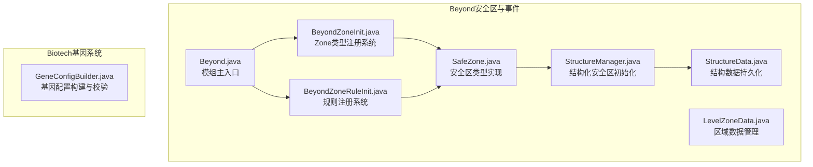
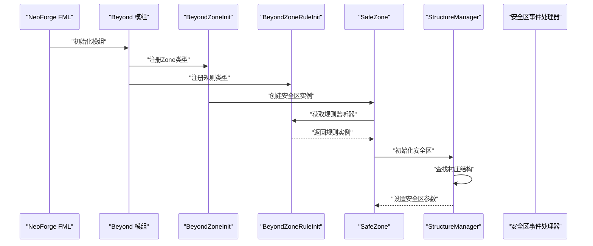
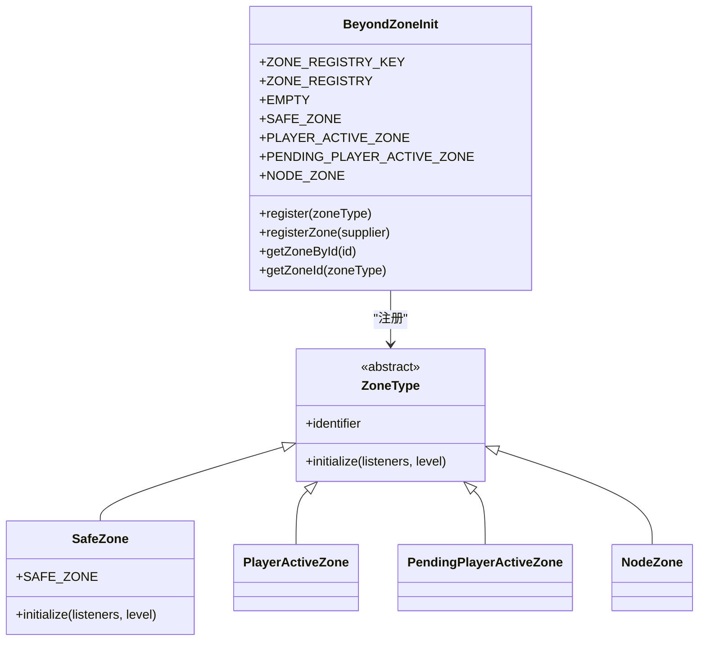
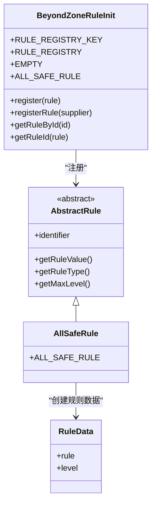
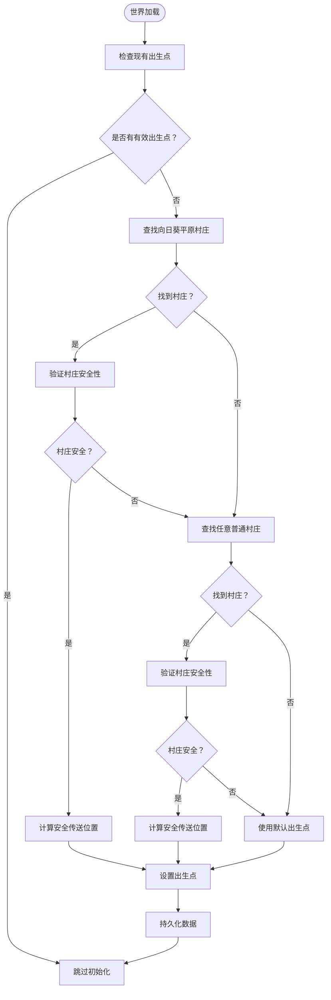
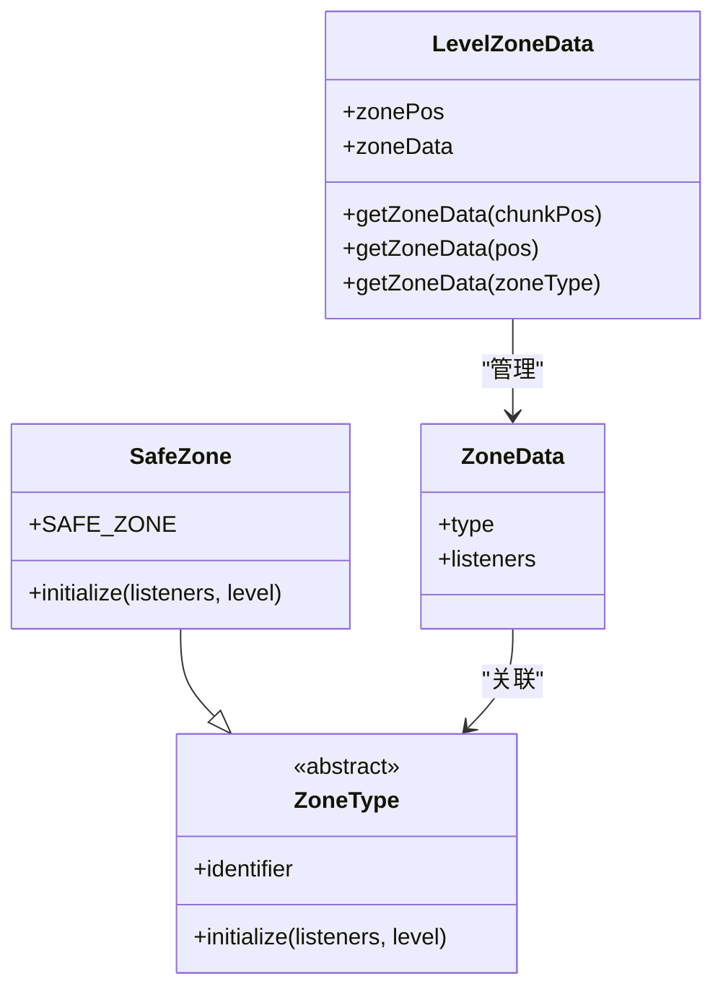
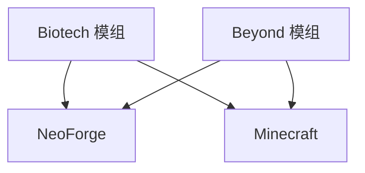

# 服务器配置

<cite>
**本文引用的文件**
- [Beyond.java](file://Beyond/src/main/java/com/pz/beyond/Beyond.java)
- [ServerConfig.java](file://Beyond/src/main/java/com/pz/beyond/api/config/ServerConfig.java)
- [ServerConfig.java](file://Biotech/src/main/java/org/biotech/api/config/ServerConfig.java)
- [BeyondZoneInit.java](file://Beyond/src/main/java/com/pz/beyond/api/init/BeyondZoneInit.java)
- [BeyondZoneRuleInit.java](file://Beyond/src/main/java/com/pz/beyond/api/init/BeyondZoneRuleInit.java)
- [SafeZone.java](file://Beyond/src/main/java/com/pz/beyond/api/system/zone/zones/SafeZone.java)
- [StructureManager.java](file://Beyond/src/main/java/com/pz/beyond/api/system/structure/StructureManager.java)
- [StructureData.java](file://Beyond/src/main/java/com/pz/beyond/api/system/structure/StructureData.java)
- [LevelZoneData.java](file://Beyond/src/main/java/com/pz/beyond/api/system/zone/LevelZoneData.java)
- [GeneConfigBuilder.java](file://Biotech/src/main/java/org/biotech/api/system/gene/GeneConfigBuilder.java)
- [neoforge.mods.toml（Beyond）](file://Beyond/src/main/templates/META-INF/neoforge.mods.toml)
- [neoforge.mods.toml（Biotech）](file://Biotech/src/main/templates/META-INF/neoforge.mods.toml)
- [build.gradle](file://build.gradle)
</cite>

## 更新摘要
**所做更改**
- 移除了关于过时ServerConfig服务器配置系统的描述
- 新增了基于结构化安全区初始化的新架构说明
- 更新了安全区管理系统的实现细节
- 重构了配置加载机制的相关内容
- 增加了新的Zone初始化和规则系统说明

## 目录
1. [简介](#简介)
2. [项目结构](#项目结构)
3. [核心组件](#核心组件)
4. [架构总览](#架构总览)
5. [详细组件分析](#详细组件分析)
6. [依赖分析](#依赖分析)
7. [性能考虑](#性能考虑)
8. [故障排除指南](#故障排除指南)
9. [结论](#结论)
10. [附录](#附录)

## 简介
本指南聚焦于服务器端配置，围绕以下目标展开：
- 全面梳理新的结构化安全区初始化系统，包括Zone类型注册、规则管理和结构化配置。
- 解释配置文件加载机制、默认值来源与运行时读取方式。
- 覆盖服务器启动参数、内存分配优化与并发处理建议。
- 提供单人游戏、多人服务器与高负载环境下的配置最佳实践。
- 包含配置验证、错误处理与故障排除方法。

## 项目结构
本仓库包含三个主要模块：Beyond（安全区与事件）、Biotech（基因系统与配置）、以及若干辅助模块。与服务器配置直接相关的关键位置如下：
- Beyond 模块负责注册与加载通用配置，并实现安全区规则与事件处理。
- Biotech 模块提供基因系统相关配置项和数据组件管理。
- 构建脚本与模组元数据定义了依赖与版本范围。

**图表来源**
- [Beyond.java:27-37](file://Beyond/src/main/java/com/pz/beyond/Beyond.java#L27-L37)
- [BeyondZoneInit.java:22-70](file://Beyond/src/main/java/com/pz/beyond/api/init/BeyondZoneInit.java#L22-L70)
- [BeyondZoneRuleInit.java:16-74](file://Beyond/src/main/java/com/pz/beyond/api/init/BeyondZoneRuleInit.java#L16-L74)
- [SafeZone.java:17-39](file://Beyond/src/main/java/com/pz/beyond/api/system/zone/zones/SafeZone.java#L17-L39)
- [StructureManager.java:26-56](file://Beyond/src/main/java/com/pz/beyond/api/system/structure/StructureManager.java#L26-L56)
- [StructureData.java:24-51](file://Beyond/src/main/java/com/pz/beyond/api/system/structure/StructureData.java#L24-L51)
- [LevelZoneData.java:33-71](file://Beyond/src/main/java/com/pz/beyond/api/system/zone/LevelZoneData.java#L33-L71)

**章节来源**
- [Beyond.java:27-37](file://Beyond/src/main/java/com/pz/beyond/Beyond.java#L27-L37)
- [BeyondZoneInit.java:22-70](file://Beyond/src/main/java/com/pz/beyond/api/init/BeyondZoneInit.java#L22-L70)
- [BeyondZoneRuleInit.java:16-74](file://Beyond/src/main/java/com/pz/beyond/api/init/BeyondZoneRuleInit.java#L16-L74)
- [SafeZone.java:17-39](file://Beyond/src/main/java/com/pz/beyond/api/system/zone/zones/SafeZone.java#L17-L39)
- [StructureManager.java:26-56](file://Beyond/src/main/java/com/pz/beyond/api/system/structure/StructureManager.java#L26-L56)
- [StructureData.java:24-51](file://Beyond/src/main/java/com/pz/beyond/api/system/structure/StructureData.java#L24-L51)
- [LevelZoneData.java:33-71](file://Beyond/src/main/java/com/pz/beyond/api/system/zone/LevelZoneData.java#L33-L71)

## 核心组件
本节概述与服务器配置直接相关的三大核心系统及其职责：
- Zone注册系统：管理Zone类型的注册、查找和实例化。
- 规则注册系统：管理安全区规则的注册、查找和应用。
- 结构化安全区初始化：负责世界加载时的安全区创建和配置。

**章节来源**
- [BeyondZoneInit.java:22-70](file://Beyond/src/main/java/com/pz/beyond/api/init/BeyondZoneInit.java#L22-L70)
- [BeyondZoneRuleInit.java:16-74](file://Beyond/src/main/java/com/pz/beyond/api/init/BeyondZoneRuleInit.java#L16-L74)
- [StructureManager.java:26-56](file://Beyond/src/main/java/com/pz/beyond/api/system/structure/StructureManager.java#L26-L56)

## 架构总览
下图展示新的安全区配置架构，包括Zone类型注册、规则系统和结构化初始化流程：

**图表来源**
- [Beyond.java:39-51](file://Beyond/src/main/java/com/pz/beyond/Beyond.java#L39-L51)
- [BeyondZoneInit.java:47-53](file://Beyond/src/main/java/com/pz/beyond/api/init/BeyondZoneInit.java#L47-L53)
- [BeyondZoneRuleInit.java:49-54](file://Beyond/src/main/java/com/pz/beyond/api/init/BeyondZoneRuleInit.java#L49-L54)
- [SafeZone.java:32-35](file://Beyond/src/main/java/com/pz/beyond/api/system/zone/zones/SafeZone.java#L32-L35)
- [StructureManager.java:36-56](file://Beyond/src/main/java/com/pz/beyond/api/system/structure/StructureManager.java#L36-L56)

## 详细组件分析

### Zone注册系统
- Zone类型注册
  - 使用DeferredRegister创建ZoneType注册表，支持动态注册和查找。
  - 提供EMPTY空区域类型作为默认回退机制。
  - 支持标准ZoneType、PlayerActiveZone、PendingPlayerActiveZone和NodeZone等类型。
- 注册机制
  - 通过registerZone方法动态注册新的ZoneType实现。
  - 提供getZoneById和getZoneId方法进行类型查找和标识符转换。
- 生命周期管理
  - 在模组初始化时注册到IEventBus，确保正确的生命周期管理。

**图表来源**
- [BeyondZoneInit.java:22-70](file://Beyond/src/main/java/com/pz/beyond/api/init/BeyondZoneInit.java#L22-L70)
- [SafeZone.java:17-39](file://Beyond/src/main/java/com/pz/beyond/api/system/zone/zones/SafeZone.java#L17-L39)

**章节来源**
- [BeyondZoneInit.java:22-70](file://Beyond/src/main/java/com/pz/beyond/api/init/BeyondZoneInit.java#L22-L70)
- [SafeZone.java:17-39](file://Beyond/src/main/java/com/pz/beyond/api/system/zone/zones/SafeZone.java#L17-L39)

### 规则注册系统
- 规则类型管理
  - 使用DeferredRegister创建AbstractRule注册表，支持规则的动态注册。
  - 提供EMPTY空规则类型作为默认回退机制。
  - 支持AllSafeRule等规则实现。
- 规则注册机制
  - 通过registerRule方法动态注册新的规则实现。
  - 提供getRuleById和getRuleId方法进行规则查找和标识符转换。
- 规则应用
  - ZoneType.initialize方法负责将规则应用到指定的Zone实例。
  - 支持多规则组合和优先级管理。

**图表来源**
- [BeyondZoneRuleInit.java:16-74](file://Beyond/src/main/java/com/pz/beyond/api/init/BeyondZoneRuleInit.java#L16-L74)
- [BeyondZoneRuleInit.java:46-47](file://Beyond/src/main/java/com/pz/beyond/api/init/BeyondZoneRuleInit.java#L46-L47)

**章节来源**
- [BeyondZoneRuleInit.java:16-74](file://Beyond/src/main/java/com/pz/beyond/api/init/BeyondZoneRuleInit.java#L16-L74)

### 结构化安全区初始化
- 初始化策略
  - 优先查找向日葵平原村庄，然后回退到普通村庄，最后使用默认出生点。
  - 使用findClosestBiome3d和findNearestMapStructure进行高效搜索。
- 安全性验证
  - 通过isZombieVillage方法检测僵尸村庄，确保安全性。
  - 使用TeleportUtil.findSafeTeleportPos确保传送位置的安全性。
- 数据持久化
  - StructureData类负责存储和管理安全出生点坐标。
  - 提供hasValidSpawnPos方法检查数据有效性。
- 性能优化
  - 设置BIOME_SEARCH_RADIUS和STRUCTURE_SEARCH_RADIUS限制搜索范围。
  - 使用MAX_ATTEMPTS控制搜索尝试次数，避免无限循环。

**图表来源**
- [StructureManager.java:36-56](file://Beyond/src/main/java/com/pz/beyond/api/system/structure/StructureManager.java#L36-L56)
- [StructureManager.java:64-97](file://Beyond/src/main/java/com/pz/beyond/api/system/structure/StructureManager.java#L64-L97)
- [StructureManager.java:102-112](file://Beyond/src/main/java/com/pz/beyond/api/system/structure/StructureManager.java#L102-L112)
- [StructureData.java:47-49](file://Beyond/src/main/java/com/pz/beyond/api/system/structure/StructureData.java#L47-L49)

**章节来源**
- [StructureManager.java:26-56](file://Beyond/src/main/java/com/pz/beyond/api/system/structure/StructureManager.java#L26-L56)
- [StructureManager.java:64-97](file://Beyond/src/main/java/com/pz/beyond/api/system/structure/StructureManager.java#L64-L97)
- [StructureManager.java:102-112](file://Beyond/src/main/java/com/pz/beyond/api/system/structure/StructureManager.java#L102-L112)
- [StructureData.java:24-51](file://Beyond/src/main/java/com/pz/beyond/api/system/structure/StructureData.java#L24-L51)

### 安全区规则与配置联动
- 规则接口
  - SafeZone继承ZoneType，重写initialize方法来配置默认规则。
  - 使用BeyondZoneRuleInit.ALL_SAFE_RULE作为默认安全规则。
- 规则应用
  - initialize方法调用addRule方法将规则添加到监听器列表。
  - 支持动态添加和移除规则。
- 数据管理
  - LevelZoneData负责管理每个区块的ZoneType映射。
  - 提供CODEC进行序列化和反序列化。

**图表来源**
- [SafeZone.java:32-35](file://Beyond/src/main/java/com/pz/beyond/api/system/zone/zones/SafeZone.java#L32-L35)
- [LevelZoneData.java:33-71](file://Beyond/src/main/java/com/pz/beyond/api/system/zone/LevelZoneData.java#L33-L71)

**章节来源**
- [SafeZone.java:17-39](file://Beyond/src/main/java/com/pz/beyond/api/system/zone/zones/SafeZone.java#L17-L39)
- [LevelZoneData.java:33-71](file://Beyond/src/main/java/com/pz/beyond/api/system/zone/LevelZoneData.java#L33-L71)

### 基因系统配置与数据组件
- 配置构建器
  - GeneConfigBuilder支持设置稀有度、词条集合与自定义数据组件，并在build()时进行有效性检查。
  - 使用DataComponentMap.builder()进行组件构建和验证。
- 数据组件
  - 支持稀有度、词条等数据组件的设置和管理。
  - 提供set方法支持自定义数据组件类型。
- 配置验证
  - 构建器在缺少必要组件（如稀有度）时抛出异常，避免无效配置进入运行时。

**章节来源**
- [GeneConfigBuilder.java:17-109](file://Biotech/src/main/java/org/biotech/api/system/gene/GeneConfigBuilder.java#L17-L109)

### 配置加载机制与默认值
- 加载入口
  - Beyond模组在构造函数中通过newRegister方法注册各种初始化器。
  - Zone和规则注册通过IEventBus事件总线进行管理。
- 文件位置
  - NeoForge 会在运行目录的config子目录下生成对应模组的配置文件。
- 默认值来源
  - Zone和规则系统通过注册表机制提供默认值。
  - SafeZone提供ALL_SAFE_RULE作为默认规则。
- 运行时读取
  - 通过注册表的get方法获取ZoneType和AbstractRule实例。
  - 支持动态注册和热更新。

**章节来源**
- [Beyond.java:39-51](file://Beyond/src/main/java/com/pz/beyond/Beyond.java#L39-L51)
- [BeyondZoneInit.java:47-53](file://Beyond/src/main/java/com/pz/beyond/api/init/BeyondZoneInit.java#L47-L53)
- [BeyondZoneRuleInit.java:49-54](file://Beyond/src/main/java/com/pz/beyond/api/init/BeyondZoneRuleInit.java#L49-L54)

## 依赖分析
- 模组依赖
  - 两个模组的neoforge.mods.toml均声明了对NeoForge与Minecraft的依赖，版本范围由模板变量控制。
- 构建与仓库
  - 顶层build.gradle配置了统一的Maven仓库，确保依赖解析稳定。

**图表来源**
- [neoforge.mods.toml（Biotech）:45-74](file://Biotech/src/main/templates/META-INF/neoforge.mods.toml#L45-L74)
- [neoforge.mods.toml（Beyond）:48-73](file://Beyond/src/main/templates/META-INF/neoforge.mods.toml#L48-L73)
- [build.gradle:1-17](file://build.gradle#L1-L17)

**章节来源**
- [neoforge.mods.toml（Biotech）:45-74](file://Biotech/src/main/templates/META-INF/neoforge.mods.toml#L45-L74)
- [neoforge.mods.toml（Beyond）:48-73](file://Beyond/src/main/templates/META-INF/neoforge.mods.toml#L48-L73)
- [build.gradle:1-17](file://build.gradle#L1-L17)

## 性能考虑
- Zone注册系统
  - 使用DeferredRegister进行延迟注册，减少初始化开销。
  - 注册表查询通过Registry.get方法进行，具有良好的性能表现。
- 结构化初始化
  - StructureManager使用多阶段搜索策略，避免全地图扫描。
  - 设置合理的搜索半径和尝试次数，平衡性能和准确性。
- 数据持久化
  - LevelZoneData使用long类型的区块坐标作为键，提供高效的查找性能。
  - 支持序列化和反序列化，确保数据一致性。
- 并发与事件
  - Zone初始化在主服务器线程中进行，规则应用应避免阻塞操作。
  - 建议对复杂的初始化逻辑进行异步处理或延迟执行。

## 故障排除指南
- Zone注册失败
  - 检查ZoneType的identifier是否唯一且符合命名规范。
  - 确认注册表已正确注册到IEventBus。
- 规则应用无效
  - 确认ZoneType.initialize方法正确调用了addRule方法。
  - 检查规则注册是否成功，以及规则实例是否正确创建。
- 安全区初始化失败
  - 检查StructureManager的搜索参数是否合理。
  - 确认StructureData的数据完整性，以及持久化机制正常工作。
- 性能问题
  - 优化搜索半径和尝试次数参数。
  - 检查是否有过多的ZoneType或规则注册。
  - 使用日志记录关键性能指标。

**章节来源**
- [BeyondZoneInit.java:47-53](file://Beyond/src/main/java/com/pz/beyond/api/init/BeyondZoneInit.java#L47-L53)
- [BeyondZoneRuleInit.java:49-54](file://Beyond/src/main/java/com/pz/beyond/api/init/BeyondZoneRuleInit.java#L49-L54)
- [StructureManager.java:36-56](file://Beyond/src/main/java/com/pz/beyond/api/system/structure/StructureManager.java#L36-L56)
- [StructureData.java:47-49](file://Beyond/src/main/java/com/pz/beyond/api/system/structure/StructureData.java#L47-L49)

## 结论
- 新的结构化安全区初始化系统提供了更好的可扩展性和维护性。
- Zone注册系统和规则注册系统相互独立，支持灵活的配置组合。
- 结构化初始化机制确保了安全区的可靠创建和配置。
- 建议在生产环境中为关键参数提供合理的默认值与边界检查，并结合日志与监控进行持续验证。

## 附录

### 不同游戏模式下的配置建议
- 单人游戏
  - 启用ALL_SAFE_RULE规则，确保玩家在安全区内获得完整保护。
  - 适当增加StructureManager的搜索半径，提高初始化成功率。
  - 调整ZoneType的默认行为，提供更好的游戏体验。
- 多人服务器
  - 严格控制ZoneType的注册权限，避免恶意配置。
  - 使用更严格的规则验证机制，确保服务器平衡。
  - 调整搜索参数，减少初始化对服务器性能的影响。
- 高负载环境
  - 优化StructureManager的搜索算法，使用更高效的查找策略。
  - 减少ZoneType和规则的数量，降低内存占用。
  - 对初始化过程进行分批处理，避免长时间阻塞。