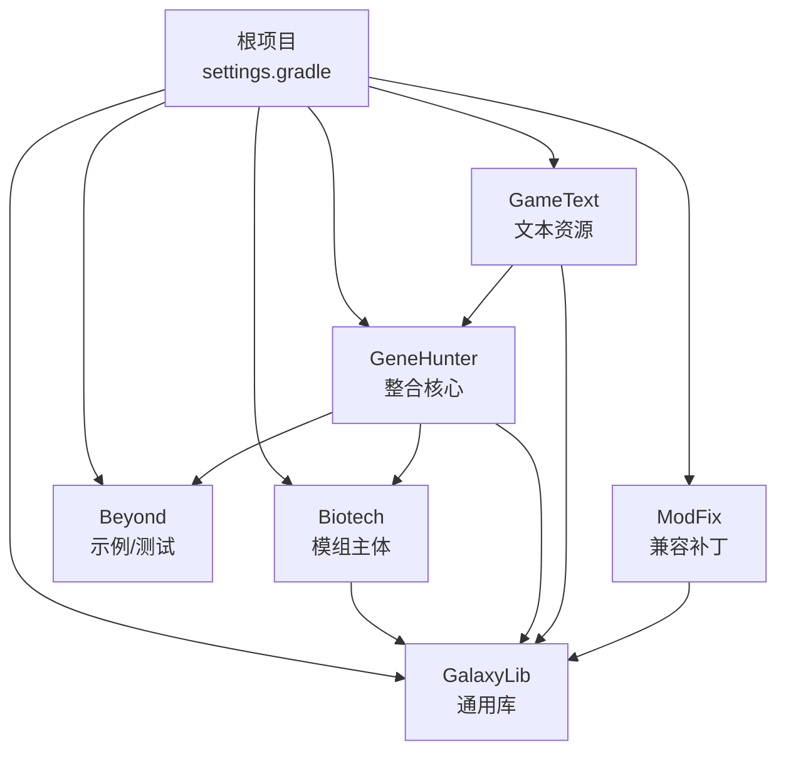
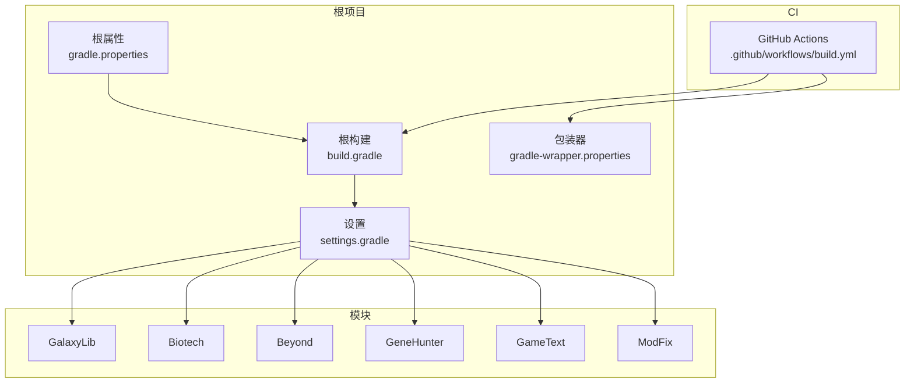
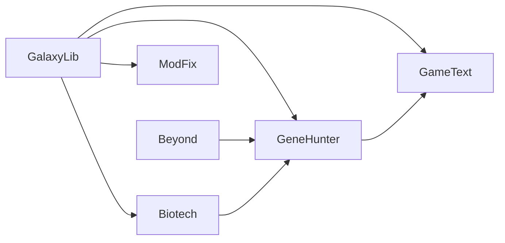

# 构建配置

<cite>
**本文引用的文件**
- [根构建脚本 build.gradle](file://build.gradle)
- [根属性文件 gradle.properties](file://gradle.properties)
- [设置文件 settings.gradle](file://settings.gradle)
- [GitHub Actions 工作流 build.yml](file://.github/workflows/build.yml)
- [Gradle 包装器属性 gradle-wrapper.properties](file://gradle/wrapper/gradle-wrapper.properties)
- [模块 Beyond 构建脚本 Beyond/build.gradle](file://Beyond/build.gradle)
- [模块 Biotech 构建脚本 Biotech/build.gradle](file://Biotech/build.gradle)
- [模块 GalaxyLib 构建脚本 GalaxyLib/build.gradle](file://GalaxyLib/build.gradle)
- [模块 GeneHunter 构建脚本 GeneHunter/build.gradle](file://GeneHunter/build.gradle)
- [模块 GameText 构建脚本 GameText/build.gradle](file://GameText/build.gradle)
- [模块 ModFix 构建脚本 ModFix/build.gradle](file://ModFix/build.gradle)
- [模块 Beyond 属性文件 Beyond/gradle.properties](file://Beyond/gradle.properties)
- [模块 Biotech 属性文件 Biotech/gradle.properties](file://Biotech/gradle.properties)
- [模块 GeneHunter 属性文件 GeneHunter/gradle.properties](file://GeneHunter/gradle.properties)
- [模块 GameText 属性文件 GameText/gradle.properties](file://GameText/gradle.properties)
- [模块 ModFix 属性文件 ModFix/gradle.properties](file://ModFix/gradle.properties)
</cite>

## 目录
1. [简介](#简介)
2. [项目结构](#项目结构)
3. [核心组件](#核心组件)
4. [架构总览](#架构总览)
5. [详细组件分析](#详细组件分析)
6. [依赖分析](#依赖分析)
7. [性能考虑](#性能考虑)
8. [故障排除指南](#故障排除指南)
9. [结论](#结论)
10. [附录](#附录)

## 简介
本指南面向使用 Gradle 的 NeoForge 模组开发者，系统讲解本仓库的构建配置与最佳实践。内容覆盖：
- 根项目与模块化构建结构
- 版本与依赖管理策略
- Java 21 环境与 NeoForge 兼容性设置
- 编译参数与构建优化
- 本地开发、CI/CD 集成与发布打包流程
- 常见构建问题诊断与解决

## 项目结构
本仓库采用多模块 Gradle 结构，通过 settings.gradle 统一纳入模块，并在根级统一管理版本与工具链。各模块按功能拆分，核心模块包括 GalaxyLib（通用库）、Biotech（模组主体）、Beyond（示例/测试）、GeneHunter（整合核心）、GameText（文本资源）、ModFix（兼容补丁）。

图表来源
- [设置文件 settings.gradle:13-18](file://settings.gradle#L13-L18)
- [模块 GalaxyLib 构建脚本 GalaxyLib/build.gradle:1-62](file://GalaxyLib/build.gradle#L1-L62)
- [模块 Biotech 构建脚本 Biotech/build.gradle:10-85](file://Biotech/build.gradle#L10-L85)
- [模块 GeneHunter 构建脚本 GeneHunter/build.gradle:10-75](file://GeneHunter/build.gradle#L10-L75)
- [模块 Beyond 构建脚本 Beyond/build.gradle:52-56](file://Beyond/build.gradle#L52-L56)
- [模块 GameText 构建脚本 GameText/build.gradle:34-41](file://GameText/build.gradle#L34-L41)
- [模块 ModFix 构建脚本 ModFix/build.gradle:68-72](file://ModFix/build.gradle#L68-L72)

章节来源
- [设置文件 settings.gradle:1-19](file://settings.gradle#L1-L19)
- [根构建脚本 build.gradle:1-4](file://build.gradle#L1-L4)
- [根属性文件 gradle.properties:1-16](file://gradle.properties#L1-L16)

## 核心组件
- 根级插件与工具链
  - 使用 NeoForged Mod Dev 插件统一管理模组构建生命周期。
  - 通过 foojay-resolver convention 自动解析 JDK 工具链，确保跨平台一致性。
- 版本与映射
  - 根级 gradle.properties 定义 Minecraft、NeoForge、Parchment 映射版本范围与加载器版本范围。
- 模块化与依赖
  - settings.gradle 统一包含所有子模块。
  - 各模块在 neoForge {} 中声明运行时任务与资源生成，依赖通过 implementation/compileOnly/jarJar 等进行管理。
- 发布与元数据
  - 多个模块启用 maven-publish，生成 neoforge.mods.toml 模板并通过 ProcessResources 动态替换版本信息。

章节来源
- [根构建脚本 build.gradle:1-4](file://build.gradle#L1-L4)
- [根属性文件 gradle.properties:9-16](file://gradle.properties#L9-L16)
- [设置文件 settings.gradle:1-11](file://settings.gradle#L1-L11)
- [模块 Biotech 构建脚本 Biotech/build.gradle:74-85](file://Biotech/build.gradle#L74-L85)
- [模块 GeneHunter 构建脚本 GeneHunter/build.gradle:71-75](file://GeneHunter/build.gradle#L71-L75)
- [模块 Beyond 构建脚本 Beyond/build.gradle:69-88](file://Beyond/build.gradle#L69-L88)

## 架构总览
下图展示构建系统的关键交互：根项目负责版本与工具链，模块负责各自依赖与运行配置，CI 负责自动化构建与验证。

图表来源
- [根属性文件 gradle.properties:9-16](file://gradle.properties#L9-L16)
- [根构建脚本 build.gradle:1-4](file://build.gradle#L1-L4)
- [设置文件 settings.gradle:1-19](file://settings.gradle#L1-L19)
- [GitHub Actions 工作流 build.yml:1-25](file://.github/workflows/build.yml#L1-L25)
- [Gradle 包装器属性 gradle-wrapper.properties:1-8](file://gradle/wrapper/gradle-wrapper.properties#L1-L8)

## 详细组件分析

### 根项目与版本管理
- 工具链与插件
  - 使用 foojay-resolver convention 自动解析 JDK；NeoForged Mod Dev 插件在根级声明以供模块复用。
- 版本与范围
  - 根级定义 Minecraft 1.21.1、NeoForge 21.1.x、Parchment 映射版本及加载器版本范围，确保跨模块一致性。
- 构建优化
  - 开启并行、缓存、配置缓存等优化项，提升本地与 CI 构建效率。

章节来源
- [设置文件 settings.gradle:1-11](file://settings.gradle#L1-L11)
- [根构建脚本 build.gradle:1-4](file://build.gradle#L1-L4)
- [根属性文件 gradle.properties:1-16](file://gradle.properties#L1-L16)

### 模块包含关系与运行配置
- 模块包含
  - settings.gradle 通过 include 引入 GalaxyLib、GeneHunter、GameText、Biotech、Beyond、ModFix。
- 运行任务
  - 各模块在 neoForge.runs 下配置 client、server、gameTestServer、data 任务，统一设置日志级别与调试标记。
- 资源生成
  - 通过 generateModMetadata 任务动态生成 neoforge.mods.toml，替换版本与描述等占位符。

章节来源
- [设置文件 settings.gradle:13-18](file://settings.gradle#L13-L18)
- [模块 Beyond 构建脚本 Beyond/build.gradle:25-51](file://Beyond/build.gradle#L25-L51)
- [模块 Biotech 构建脚本 Biotech/build.gradle:35-61](file://Biotech/build.gradle#L35-L61)
- [模块 GeneHunter 构建脚本 GeneHunter/build.gradle:31-57](file://GeneHunter/build.gradle#L31-L57)
- [模块 ModFix 构建脚本 ModFix/build.gradle:28-54](file://ModFix/build.gradle#L28-L54)
- [模块 GameText 构建脚本 GameText/build.gradle:11-31](file://GameText/build.gradle#L11-L31)
- [模块 Beyond 构建脚本 Beyond/build.gradle:69-88](file://Beyond/build.gradle#L69-L88)
- [模块 Biotech 构建脚本 Biotech/build.gradle:87-105](file://Biotech/build.gradle#L87-L105)
- [模块 GeneHunter 构建脚本 GeneHunter/build.gradle:77-95](file://GeneHunter/build.gradle#L77-L95)
- [模块 ModFix 构建脚本 ModFix/build.gradle:74-92](file://ModFix/build.gradle#L74-L92)

### 依赖管理策略
- 通用库 GalaxyLib
  - 作为其他模块的基础库，提供公共能力；部分模块可选择性 implementation。
- Biotech 独立依赖
  - 在仓库中显式声明 LDLib 与 Curios 依赖，避免集中管理带来的耦合。
- GeneHunter 整合依赖
  - 显式 implementation GalaxyLib、Beyond、Biotech，形成聚合核心。
- GameText 通配依赖
  - 通过遍历 subprojects 实现对除自身与 GalaxyLib 外模块的依赖，便于快速集成。

章节来源
- [模块 GalaxyLib 构建脚本 GalaxyLib/build.gradle:51-53](file://GalaxyLib/build.gradle#L51-L53)
- [模块 Biotech 构建脚本 Biotech/build.gradle:74-85](file://Biotech/build.gradle#L74-L85)
- [模块 GeneHunter 构建脚本 GeneHunter/build.gradle:71-75](file://GeneHunter/build.gradle#L71-L75)
- [模块 GameText 构建脚本 GameText/build.gradle:34-41](file://GameText/build.gradle#L34-L41)

### Java 21 与 NeoForge 兼容性
- Java Toolchain
  - 所有模块在 java.toolchain.languageVersion 设置为 21，确保与当前 JDK 工具链一致。
- NeoForge 版本
  - 根级定义 neo_version 与 neo_version_range，模块在 neoForge.version 中引用，保证版本统一。
- Parchment 映射
  - 通过 parchment.minecraftVersion 与 parchment.mappingsVersion 指定映射版本，确保开发期与运行期符号一致。

章节来源
- [模块 Beyond 构建脚本 Beyond/build.gradle](file://Beyond/build.gradle#L17)
- [模块 Biotech 构建脚本 Biotech/build.gradle](file://Biotech/build.gradle#L27)
- [模块 GeneHunter 构建脚本 GeneHunter/build.gradle](file://GeneHunter/build.gradle#L22)
- [模块 ModFix 构建脚本 ModFix/build.gradle](file://ModFix/build.gradle#L19)
- [模块 GameText 构建脚本 GameText/build.gradle](file://GameText/build.gradle#L5)
- [根属性文件 gradle.properties:11-13](file://gradle.properties#L11-L13)
- [模块 Beyond 构建脚本 Beyond/build.gradle:19-24](file://Beyond/build.gradle#L19-L24)
- [模块 Biotech 构建脚本 Biotech/build.gradle:29-34](file://Biotech/build.gradle#L29-L34)
- [模块 GeneHunter 构建脚本 GeneHunter/build.gradle:24-29](file://GeneHunter/build.gradle#L24-L29)
- [模块 ModFix 构建脚本 ModFix/build.gradle:21-26](file://ModFix/build.gradle#L21-L26)

### 编译参数与构建优化
- 字符集
  - 统一设置 Java 编译编码为 UTF-8，避免资源与注释中的非 ASCII 字符问题。
- 并行与缓存
  - 根级开启 org.gradle.parallel、org.gradle.caching、org.gradle.configuration-cache，显著缩短构建时间。
- 运行参数
  - server 任务默认禁用 GUI，data 任务指定输出目录与现有资源目录，便于数据生成。

章节来源
- [模块 Beyond 构建脚本 Beyond/build.gradle:104-106](file://Beyond/build.gradle#L104-L106)
- [模块 Biotech 构建脚本 Biotech/build.gradle:122-124](file://Biotech/build.gradle#L122-L124)
- [模块 GeneHunter 构建脚本 GeneHunter/build.gradle:99-101](file://GeneHunter/build.gradle#L99-L101)
- [模块 ModFix 构建脚本 ModFix/build.gradle:109-111](file://ModFix/build.gradle#L109-L111)
- [根属性文件 gradle.properties:2-6](file://gradle.properties#L2-L6)
- [模块 Beyond 构建脚本 Beyond/build.gradle:31-45](file://Beyond/build.gradle#L31-L45)
- [模块 Biotech 构建脚本 Biotech/build.gradle:41-55](file://Biotech/build.gradle#L41-L55)
- [模块 GeneHunter 构建脚本 GeneHunter/build.gradle:37-51](file://GeneHunter/build.gradle#L37-L51)
- [模块 ModFix 构建脚本 ModFix/build.gradle:34-48](file://ModFix/build.gradle#L34-L48)

### 本地开发流程
- 环境准备
  - 使用 Gradle 包装器自动下载 Gradle 8.14.4；JDK 由 foojay-resolver convention 解析。
- 构建命令
  - 常用命令：clean、build、:module:build、runClient、runServer、genSources（数据生成）。
- IDE 集成
  - 模块启用 idea 插件（Biotech），便于同步 IDE 项目结构。
- 调试与日志
  - 运行任务统一设置日志级别与调试标记，便于定位问题。

章节来源
- [Gradle 包装器属性 gradle-wrapper.properties:1-8](file://gradle/wrapper/gradle-wrapper.properties#L1-L8)
- [设置文件 settings.gradle:9-11](file://settings.gradle#L9-L11)
- [模块 Biotech 构建脚本 Biotech/build.gradle](file://Biotech/build.gradle#L5)
- [模块 Beyond 构建脚本 Beyond/build.gradle:25-51](file://Beyond/build.gradle#L25-L51)
- [模块 Biotech 构建脚本 Biotech/build.gradle:35-61](file://Biotech/build.gradle#L35-L61)
- [模块 GeneHunter 构建脚本 GeneHunter/build.gradle:31-57](file://GeneHunter/build.gradle#L31-L57)
- [模块 ModFix 构建脚本 ModFix/build.gradle:28-54](file://ModFix/build.gradle#L28-L54)
- [模块 GameText 构建脚本 GameText/build.gradle:11-31](file://GameText/build.gradle#L11-L31)

### CI/CD 集成与发布打包
- GitHub Actions
  - 触发条件：push 与 pull_request。
  - 步骤：检出代码、设置 JDK 17、执行 Gradle build。
- 发布策略
  - 多个模块启用 maven-publish，将制品发布到本地 repo 目录，便于本地集成测试。
- 包装器与版本
  - 使用固定 Gradle 版本，确保 CI 环境一致性。

章节来源
- [GitHub Actions 工作流 build.yml:1-25](file://.github/workflows/build.yml#L1-L25)
- [模块 Beyond 构建脚本 Beyond/build.gradle:91-102](file://Beyond/build.gradle#L91-L102)
- [模块 Biotech 构建脚本 Biotech/build.gradle:109-120](file://Biotech/build.gradle#L109-L120)
- [模块 ModFix 构建脚本 ModFix/build.gradle:96-107](file://ModFix/build.gradle#L96-L107)
- [Gradle 包装器属性 gradle-wrapper.properties](file://gradle/wrapper/gradle-wrapper.properties#L3)

## 依赖分析

图表来源
- [模块 GalaxyLib 构建脚本 GalaxyLib/build.gradle:51-53](file://GalaxyLib/build.gradle#L51-L53)
- [模块 Biotech 构建脚本 Biotech/build.gradle:74-85](file://Biotech/build.gradle#L74-L85)
- [模块 GeneHunter 构建脚本 GeneHunter/build.gradle:71-75](file://GeneHunter/build.gradle#L71-L75)
- [模块 Beyond 构建脚本 Beyond/build.gradle:52-56](file://Beyond/build.gradle#L52-L56)
- [模块 GameText 构建脚本 GameText/build.gradle:34-41](file://GameText/build.gradle#L34-L41)
- [模块 ModFix 构建脚本 ModFix/build.gradle:68-72](file://ModFix/build.gradle#L68-L72)

章节来源
- [模块 Biotech 构建脚本 Biotech/build.gradle:10-21](file://Biotech/build.gradle#L10-L21)
- [模块 GeneHunter 构建脚本 GeneHunter/build.gradle:10-12](file://GeneHunter/build.gradle#L10-L12)
- [模块 GameText 构建脚本 GameText/build.gradle:34-41](file://GameText/build.gradle#L34-L41)

## 性能考虑
- 并行与缓存
  - 并行构建、构建缓存与配置缓存显著降低重复构建时间，建议在本地与 CI 中保持开启。
- 依赖隔离
  - 将独立依赖保留在模块内，减少跨模块耦合，提高增量编译效率。
- 数据生成
  - 使用 data 任务生成资源时，明确输出与现有资源目录，避免不必要的重编译。
- 工具链
  - 使用 foojay-resolver convention 自动解析 JDK，避免手动切换 JDK 导致的构建失败。

章节来源
- [根属性文件 gradle.properties:2-6](file://gradle.properties#L2-L6)
- [模块 Biotech 构建脚本 Biotech/build.gradle:14-21](file://Biotech/build.gradle#L14-L21)
- [模块 Beyond 构建脚本 Beyond/build.gradle:41-45](file://Beyond/build.gradle#L41-L45)
- [模块 GeneHunter 构建脚本 GeneHunter/build.gradle:48-51](file://GeneHunter/build.gradle#L48-L51)
- [模块 ModFix 构建脚本 ModFix/build.gradle:45-48](file://ModFix/build.gradle#L45-L48)

## 故障排除指南
- 版本不匹配
  - 症状：运行时报错或资源缺失。
  - 排查：确认根级 gradle.properties 中的 Minecraft、NeoForge、Parchment 版本与模块引用一致。
- 依赖冲突
  - 症状：编译或运行时类找不到。
  - 排查：检查模块 dependencies 中的仓库地址与坐标是否正确；必要时添加仓库或调整版本。
- Java 版本不一致
  - 症状：编译错误或运行时异常。
  - 排查：确认 java.toolchain.languageVersion 为 21；IDE 项目结构与 Gradle 工具链一致。
- CI 失败
  - 症状：Actions 步骤失败。
  - 排查：检查 JDK 设置为 17 是否满足项目工具链解析；查看构建日志中的具体错误。
- 资源生成失败
  - 症状：neoforge.mods.toml 未生成或版本信息不正确。
  - 排查：确认 generateModMetadata 任务已执行且模板路径正确；检查替换属性是否齐全。

章节来源
- [根属性文件 gradle.properties:9-16](file://gradle.properties#L9-L16)
- [模块 Beyond 构建脚本 Beyond/build.gradle:69-88](file://Beyond/build.gradle#L69-L88)
- [模块 Biotech 构建脚本 Biotech/build.gradle:87-105](file://Biotech/build.gradle#L87-L105)
- [模块 GeneHunter 构建脚本 GeneHunter/build.gradle:77-95](file://GeneHunter/build.gradle#L77-L95)
- [模块 ModFix 构建脚本 ModFix/build.gradle:74-92](file://ModFix/build.gradle#L74-L92)
- [GitHub Actions 工作流 build.yml:15-19](file://.github/workflows/build.yml#L15-L19)

## 结论
本仓库通过根级统一版本与工具链、模块化依赖与运行配置，实现了清晰、可维护且高效的构建体系。结合并行与缓存优化、CI 自动化与本地开发流程，能够稳定支持多模组协同开发与发布。建议在扩展新模块时遵循现有模式，保持版本与依赖的一致性，并充分利用数据生成与发布机制。

## 附录
- 关键文件清单
  - 根级：build.gradle、gradle.properties、settings.gradle、gradle/wrapper/gradle-wrapper.properties
  - 模块：GalaxyLib/build.gradle、Biotech/build.gradle、Beyond/build.gradle、GeneHunter/build.gradle、GameText/build.gradle、ModFix/build.gradle
  - 模块属性：各模块的 gradle.properties 文件
- 常用命令参考
  - 清理与构建：clean、build
  - 运行：runClient、runServer、gameTestServer
  - 数据生成：data（或对应模块的 data 任务）
  - 发布：publish（需先启用 maven-publish）