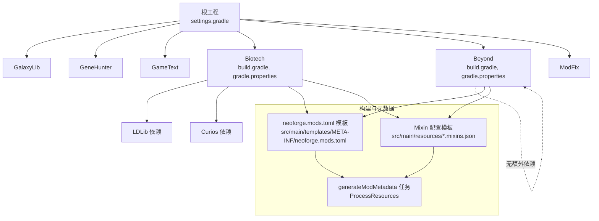
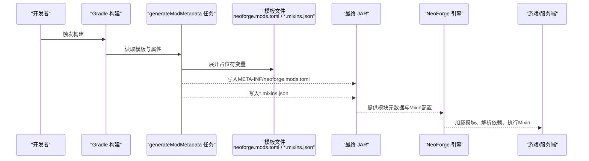
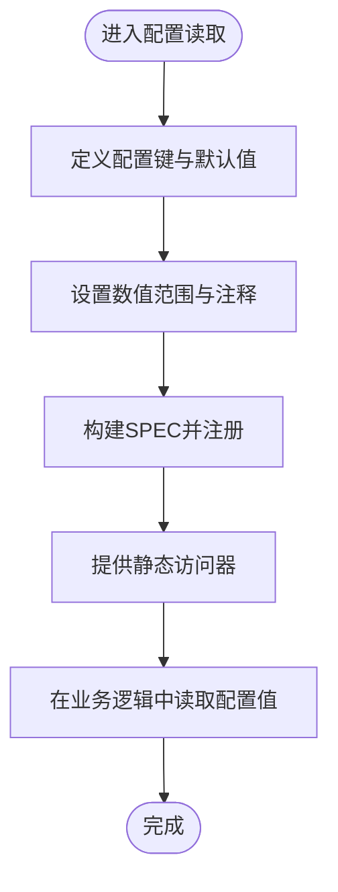
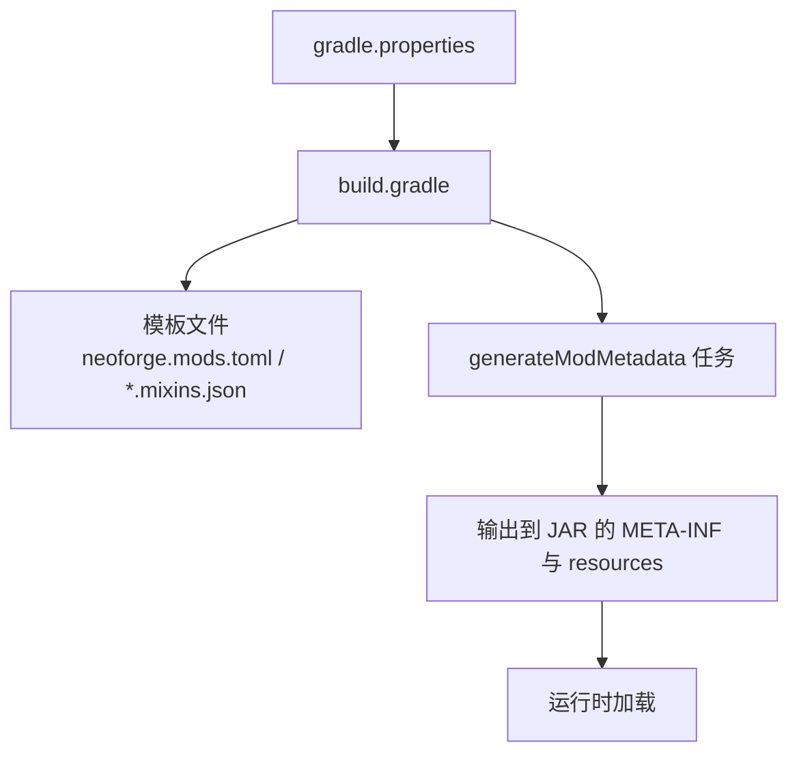
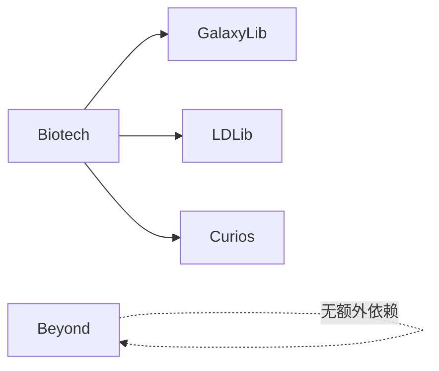

# 部署与配置

<cite>
**本文引用的文件**
- [Beyond\src\main\templates\META-INF\neoforge.mods.toml](file://Beyond/src/main/templates/META-INF/neoforge.mods.toml)
- [Biotech\src\main\templates\META-INF\neoforge.mods.toml](file://Biotech/src/main/templates/META-INF/neoforge.mods.toml)
- [Beyond\src\main\resources\beyond.mixins.json](file://Beyond/src/main/resources/beyond.mixins.json)
- [Biotech\src\main\resources\biotech.mixins.json](file://Biotech/src/main/resources/biotech.mixins.json)
- [Beyond\build.gradle](file://Beyond/build.gradle)
- [Biotech\build.gradle](file://Biotech/build.gradle)
- [Beyond\gradle.properties](file://Beyond/gradle.properties)
- [Biotech\gradle.properties](file://Biotech/gradle.properties)
- [Beyond\src\main\java\com\pz\beyond\Config.java](file://Beyond/src/main/java/com/pz/beyond/Config.java)
- [Biotech\src\main\java\org\biotech\api\config\ServerConfig.java](file://Biotech/src/main/java/org/biotech/api/config/ServerConfig.java)
- [settings.gradle](file://settings.gradle)
- [build.gradle](file://build.gradle)
- [.github\workflows\build.yml](file://.github/workflows/build.yml)
</cite>

## 目录
1. [简介](#简介)
2. [项目结构](#项目结构)
3. [核心组件](#核心组件)
4. [架构总览](#架构总览)
5. [详细组件分析](#详细组件分析)
6. [依赖关系分析](#依赖关系分析)
7. [性能考量](#性能考量)
8. [故障排除指南](#故障排除指南)
9. [结论](#结论)
10. [附录](#附录)

## 简介
本指南面向部署与配置工程师及运维人员，系统阐述该多模块NeoForge项目在构建、服务器与客户端配置、Mixin与兼容性设置方面的最佳实践。内容覆盖neoforge.mods.toml模板字段说明、Mixin配置文件用法、服务器端配置项与客户端显示设置、不同环境的部署策略、性能调优参数、故障排除方法、生产环境部署建议、监控要点以及版本升级与向后兼容注意事项。

## 项目结构
该项目采用Gradle多模块结构，包含以下主要模块：
- GalaxyLib：通用库模块
- GeneHunter：主模块之一
- GameText：文本相关模块
- Biotech：生物技术模块（含独立依赖）
- Beyond：边界/扩展模块（当前无外部依赖）
- ModFix：修正/兼容模块

根级settings.gradle声明了所有子模块；各模块通过各自的build.gradle定义NeoForge版本、运行配置、依赖与资源生成任务；模板化的neoforge.mods.toml与mixins.json位于各模块的src/main/templates与src/main/resources目录中，构建时由generateModMetadata任务注入变量并输出到最终JAR。

图表来源
- [settings.gradle:13-19](file://settings.gradle#L13-L19)
- [Beyond\build.gradle:69-89](file://Beyond/build.gradle#L69-L89)
- [Biotech\build.gradle:87-107](file://Biotech/build.gradle#L87-L107)

章节来源
- [settings.gradle:1-19](file://settings.gradle#L1-L19)
- [Beyond\build.gradle:1-107](file://Beyond/build.gradle#L1-L107)
- [Biotech\build.gradle:1-125](file://Biotech/build.gradle#L1-L125)

## 核心组件
- 构建与打包
  - 使用NeoForged Mod Dev Gradle插件，统一管理NeoForge版本、Parchment映射与运行配置。
  - generateModMetadata任务将模板中的占位符替换为实际值，生成最终META-INF/neoforge.mods.toml。
- 配置系统
  - 服务器端配置：Biotech模块提供ServerConfig，定义未鉴定基因的随机词条投掷倍率等可调参数。
  - 客户端配置：Beyond模块当前仅定义空的配置规范类，实际客户端显示设置需在具体实现中扩展。
- 兼容性与Mixin
  - 每个模块的neoforge.mods.toml通过[[mixins]]声明对应的mixins.json文件。
  - mixins.json定义了包名、兼容级别、注入器默认要求与覆写注解要求等。

章节来源
- [Beyond\build.gradle:69-89](file://Beyond/build.gradle#L69-L89)
- [Biotech\build.gradle:87-107](file://Biotech/build.gradle#L87-L107)
- [Beyond\src\main\java\com\pz\beyond\Config.java:1-20](file://Beyond/src/main/java/com/pz/beyond/Config.java#L1-L20)
- [Biotech\src\main\java\org\biotech\api\config\ServerConfig.java:1-49](file://Biotech/src/main/java/org/biotech/api/config/ServerConfig.java#L1-L49)

## 架构总览
下图展示从源码模板到运行时配置的关键路径：模板文件经Gradle任务处理生成最终JAR内的配置文件；运行时NeoForge加载这些配置以决定模块行为、依赖顺序与加载顺序。

图表来源
- [Beyond\build.gradle:69-89](file://Beyond/build.gradle#L69-L89)
- [Biotech\build.gradle:87-107](file://Biotech/build.gradle#L87-L107)
- [Beyond\src\main\templates\META-INF\neoforge.mods.toml:1-80](file://Beyond/src/main/templates/META-INF/neoforge.mods.toml#L1-L80)
- [Biotech\src\main\templates\META-INF\neoforge.mods.toml:1-80](file://Biotech/src/main/templates/META-INF/neoforge.mods.toml#L1-L80)

## 详细组件分析

### neoforge.mods.toml 模板详解
- 必填字段
  - modLoader/loaderVersion：指定加载器类型与版本范围，确保与NeoForge版本匹配。
  - [[mods]]：声明模块基本信息，包括modId、version、displayName、license、description等。
- 依赖声明
  - 对NeoForge与Minecraft的依赖均为required，并通过versionRange限定版本范围。
  - 可选ordering与side用于控制加载顺序与适用端（BOTH/CLIENT/SERVER）。
- Mixin集成
  - [[mixins]]：声明对应模块的mixins.json文件，使NeoForge在启动时加载Mixin配置。
- 其他
  - 可选issueTrackerURL、displayURL、authors、credits、logoFile等。
  - features段可用于声明运行特性需求（如OpenGL版本），但当前模板未启用。

章节来源
- [Beyond\src\main\templates\META-INF\neoforge.mods.toml:6-80](file://Beyond/src/main/templates/META-INF/neoforge.mods.toml#L6-L80)
- [Biotech\src\main\templates\META-INF\neoforge.mods.toml:6-80](file://Biotech/src/main/templates/META-INF/neoforge.mods.toml#L6-L80)

### Mixin 配置使用
- 包装与兼容性
  - 指定package与compatibilityLevel，确保Mixin目标类与编译工具链一致。
  - injectors.defaultRequire与overwrites.requireAnnotations提升安全性与可控性。
- 声明位置
  - 在neoforge.mods.toml的[[mixins]]中声明对应模块的mixins.json文件。
- 实际应用
  - Beyond与Biotech各自维护独立的mixins.json，分别位于其resources目录，构建时随模板生成任务一并写入最终JAR。

章节来源
- [Beyond\src\main\resources\beyond.mixins.json:1-17](file://Beyond/src/main/resources/beyond.mixins.json#L1-L17)
- [Biotech\src\main\resources\biotech.mixins.json:1-17](file://Biotech/src/main/resources/biotech.mixins.json#L1-L17)
- [Beyond\src\main\templates\META-INF\neoforge.mods.toml:37-39](file://Beyond/src/main/templates/META-INF/neoforge.mods.toml#L37-L39)
- [Biotech\src\main\templates\META-INF\neoforge.mods.toml:37-39](file://Biotech/src/main/templates/META-INF/neoforge.mods.toml#L37-L39)

### 服务器端配置（Biotech）
- 配置项
  - 未鉴定基因按稀有度的词条投掷次数倍率（普通、稀有、史诗）。
- 设计模式
  - 使用ModConfigSpec定义键、注释、范围与默认值，静态访问器提供类型安全的读取接口。
- 部署建议
  - 将生成的neoforge-server.toml放置于服务器config目录，便于玩家与管理员调整。
  - 通过命令或配置热重载机制（如NeoForge提供的配置刷新）生效。

图表来源
- [Biotech\src\main\java\org\biotech\api\config\ServerConfig.java:15-32](file://Biotech/src/main/java/org/biotech/api/config/ServerConfig.java#L15-L32)

章节来源
- [Biotech\src\main\java\org\biotech\api\config\ServerConfig.java:1-49](file://Biotech/src/main/java/org/biotech/api/config/ServerConfig.java#L1-L49)

### 客户端显示设置（Beyond）
- 当前状态
  - Config类已存在，但未定义任何配置项，客户端显示设置需在后续迭代中扩展。
- 建议
  - 参考ServerConfig的设计模式，使用ModConfigSpec定义客户端开关、渲染距离、UI透明度等参数。
  - 将配置写入neoforge-client.toml并在初始化阶段监听变更事件以动态更新。

章节来源
- [Beyond\src\main\java\com\pz\beyond\Config.java:1-20](file://Beyond/src/main/java/com/pz/beyond/Config.java#L1-L20)

### 构建与打包配置
- 版本与工具链
  - Java Toolchain设为21，NeoForge版本由属性文件提供，Parchment映射版本可配置。
- 运行配置
  - 预置client、server、gameTestServer与data运行任务，支持调试与数据生成。
- 资源生成
  - generateModMetadata任务将模板与属性合并，输出至META-INF与资源目录。
- 发布
  - Maven发布到本地repo目录，便于内部分发与集成测试。

图表来源
- [Beyond\gradle.properties:1-20](file://Beyond/gradle.properties#L1-L20)
- [Biotech\gradle.properties:1-25](file://Biotech/gradle.properties#L1-L25)
- [Beyond\build.gradle:69-89](file://Beyond/build.gradle#L69-L89)
- [Biotech\build.gradle:87-107](file://Biotech/build.gradle#L87-L107)

章节来源
- [Beyond\build.gradle:1-107](file://Beyond/build.gradle#L1-L107)
- [Biotech\build.gradle:1-125](file://Biotech/build.gradle#L1-L125)
- [Beyond\gradle.properties:1-20](file://Beyond/gradle.properties#L1-L20)
- [Biotech\gradle.properties:1-25](file://Biotech/gradle.properties#L1-L25)

### CI/CD 与自动化构建
- 工作流
  - 使用GitHub Actions在ubuntu-latest上安装JDK 17，执行Gradle构建。
- 建议
  - 在PR与主分支推送时均触发构建，确保质量门禁。
  - 可增加测试与检查任务（如Spotless、PMD/SpotBugs）以提升代码一致性与稳定性。

章节来源
- [.github\workflows\build.yml:1-25](file://.github/workflows/build.yml#L1-L25)

## 依赖关系分析
- 模块间依赖
  - Biotech显式依赖GalaxyLib（通过project(":GalaxyLib")），并引入LDLib与Curios等第三方依赖。
  - Beyond当前无额外依赖，保持模块内独立管理。
- 外部依赖
  - NeoForge与Minecraft版本通过属性文件集中管理，[[dependencies]]中以versionRange约束。
- 运行时加载顺序
  - 通过[[dependencies]]的ordering与side控制加载顺序与适用端（BOTH/CLIENT/SERVER）。

图表来源
- [Biotech\build.gradle:74-85](file://Biotech/build.gradle#L74-L85)
- [Beyond\build.gradle:64-67](file://Beyond/build.gradle#L64-L67)

章节来源
- [Biotech\build.gradle:1-125](file://Biotech/build.gradle#L1-L125)
- [Beyond\build.gradle:1-107](file://Beyond/build.gradle#L1-L107)

## 性能考量
- 构建性能
  - 使用Gradle缓存与增量编译，避免不必要的全量重建。
  - 合理拆分任务，将数据生成与资源处理分离。
- 运行时性能
  - 服务器端配置项（如词条投掷次数）应结合玩家体验与服务器负载进行调优。
  - 客户端渲染参数（如UI透明度、渲染距离）可通过客户端配置动态调整。
- 日志与诊断
  - 运行时开启DEBUG日志有助于定位问题，但生产环境建议降级到INFO级别。

## 故障排除指南
- 模块无法加载
  - 检查neoforge.mods.toml中的modId、version、[[dependencies]]是否与实际版本匹配。
  - 确认[[mixins]]声明的文件存在于JAR中且路径正确。
- 依赖冲突
  - 核对NeoForge与Minecraft版本范围，确保满足最低要求。
  - 若存在多个版本，优先使用版本范围上限或锁定版本以避免冲突。
- 配置不生效
  - 确认配置文件位于正确的config目录（neoforge-server.toml或neoforge-client.toml）。
  - 检查配置键名与类型是否与代码读取一致。
- 构建失败
  - 检查generateModMetadata任务是否成功展开模板变量。
  - 确保Java Toolchain版本与项目兼容（当前为21）。

## 结论
本指南提供了从构建到部署、从配置到兼容性的完整路径。通过模板化配置与Gradle任务的组合，项目实现了高度可重复的构建流程；通过ModConfigSpec与Mixin配置，项目具备良好的可扩展性与运行时灵活性。建议在生产环境中结合CI/CD、监控与灰度发布策略，持续优化性能与稳定性。

## 附录

### 生产环境部署最佳实践
- 分层部署
  - 开发/测试/预生产/生产四层环境，每层使用独立的配置文件与版本。
- 自动化
  - 使用GitHub Actions或其他CI平台自动构建与发布制品。
- 监控
  - 关注服务器CPU、内存、Tick延迟与日志错误率，建立告警阈值。
- 回滚
  - 保留最近N个版本的制品，快速回滚到稳定版本。

### 版本升级与向后兼容
- 升级步骤
  - 更新gradle.properties中的NeoForge与Minecraft版本号。
  - 在build.gradle中同步NeoForge与Parchment版本。
  - 重新生成neoforge.mods.toml与mixins.json，验证加载。
- 向后兼容
  - 通过ModConfigSpec的默认值与范围保证旧配置仍可读取。
  - 在Mixin中使用兼容级别与覆写注解，减少破坏性修改。