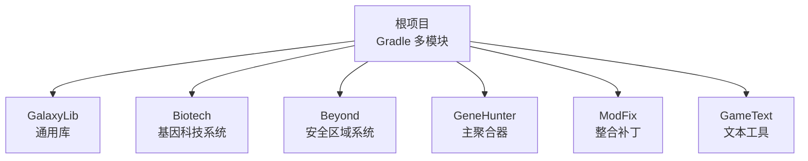
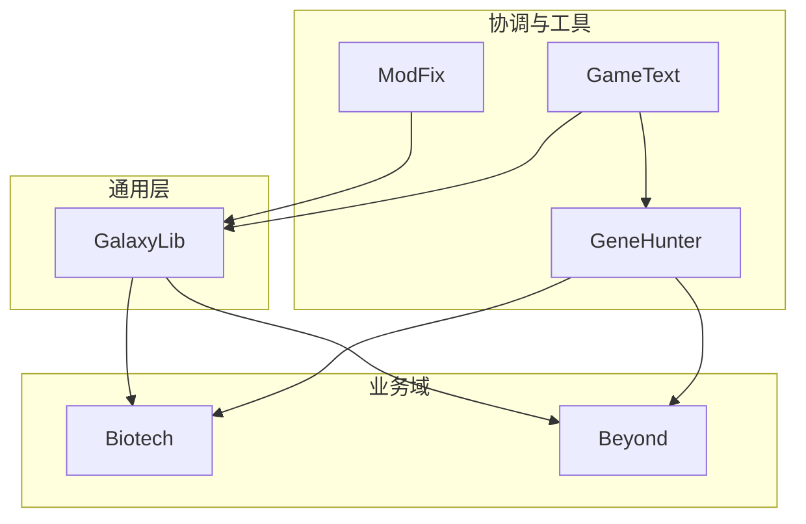
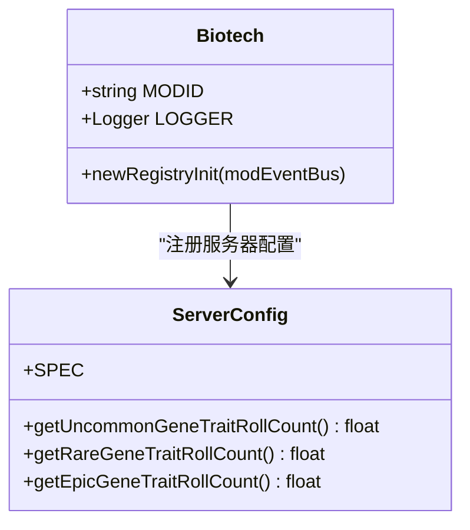
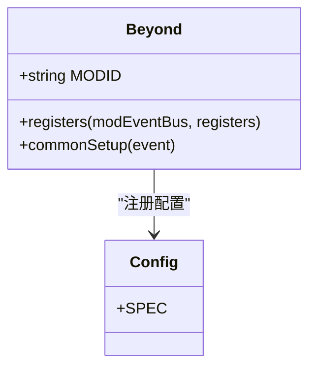
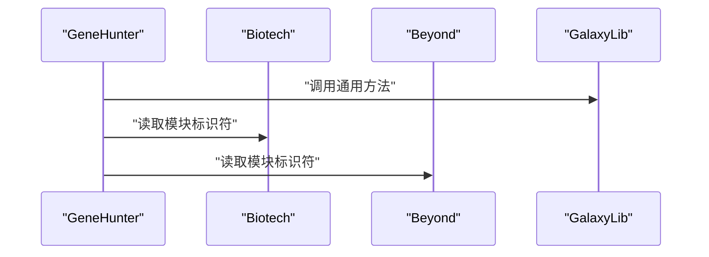
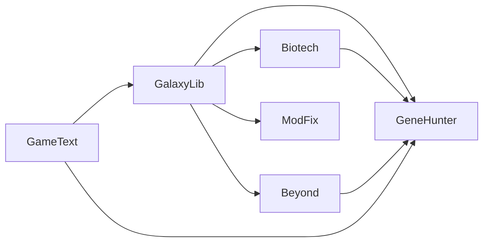
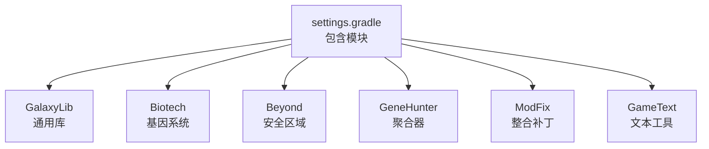

# 项目概述

<cite>
**本文档引用的文件**
- [settings.gradle](file://settings.gradle)
- [build.gradle](file://build.gradle)
- [gradle.properties](file://gradle.properties)
- [GalaxyLib/build.gradle](file://GalaxyLib/build.gradle)
- [Biotech/build.gradle](file://Biotech/build.gradle)
- [Beyond/build.gradle](file://Beyond/build.gradle)
- [GameText/build.gradle](file://GameText/build.gradle)
- [GeneHunter/src/main/java/org/galaxy/genehunter/GeneHunter.java](file://GeneHunter/src/main/java/org/galaxy/genehunter/GeneHunter.java)
- [ModFix/src/main/java/org/galaxy/modfix/ModFix.java](file://ModFix/src/main/java/org/galaxy/modfix/ModFix.java)
- [Beyond/src/main/java/com/pz/beyond/Beyond.java](file://Beyond/src/main/java/com/pz/beyond/Beyond.java)
- [Biotech/src/main/java/org/biotech/Biotech.java](file://Biotech/src/main/java/org/biotech/Biotech.java)
- [Beyond/src/main/java/com/pz/beyond/Config.java](file://Beyond/src/main/java/com/pz/beyond/Config.java)
- [Biotech/src/main/java/org/biotech/api/config/ServerConfig.java](file://Biotech/src/main/java/org/biotech/api/config/ServerConfig.java)
- [Beyond/src/main/templates/META-INF/neoforge.mods.toml](file://Beyond/src/main/templates/META-INF/neoforge.mods.toml)
- [Biotech/src/main/templates/META-INF/neoforge.mods.toml](file://Biotech/src/main/templates/META-INF/neoforge.mods.toml)
- [GalaxyLib/src/main/java/org/galaxy/gene_hunter/Common.java](file://GalaxyLib/src/main/java/org/galaxy/gene_hunter/Common.java)
</cite>

## 目录
1. [引言](#引言)
2. [项目结构](#项目结构)
3. [核心组件](#核心组件)
4. [架构总览](#架构总览)
5. [详细组件分析](#详细组件分析)
6. [依赖关系分析](#依赖关系分析)
7. [性能考虑](#性能考虑)
8. [故障排除指南](#故障排除指南)
9. [结论](#结论)
10. [附录](#附录)

## 引言
本项目是一个基于 NeoForge 的 Minecraft 多模块项目，采用 Gradle 多模块构建体系，目标是通过模块化设计实现功能解耦与可维护性提升。项目围绕基因科技（Biotech）与安全区域（Beyond）两大核心玩法展开，同时包含通用库（GalaxyLib）、整合补丁（ModFix）、主聚合器（GeneHunter）与文本工具（GameText）等辅助模块。技术栈采用 NeoForge 21.1.223、Java 21 与 Gradle，配合 Parchment 文档映射，确保与 Minecraft 1.21.1 生态的兼容性。

项目采用模块化架构的优势：
- 独立开发与测试：各模块可独立编译、运行与调试，降低联调成本。
- 职责分离：通用能力集中在 GalaxyLib，业务功能分布在 Biotech、Beyond 等模块，便于职责划分。
- 可扩展性：新增模块或功能可在不影响现有模块的前提下引入。
- 配置与资源隔离：每个模块拥有独立的配置、资源与元数据生成流程。

## 项目结构
项目采用 Gradle 多模块结构，根目录包含统一的版本与工具链配置，各子模块按功能域划分，遵循“模块即功能域”的组织方式。

**图表来源**
- [settings.gradle:13-18](file://settings.gradle#L13-L18)

**章节来源**
- [settings.gradle:1-19](file://settings.gradle#L1-L19)
- [build.gradle:1-4](file://build.gradle#L1-L4)
- [gradle.properties:9-16](file://gradle.properties#L9-L16)

## 核心组件
- GalaxyLib：提供跨模块共享的基础能力与常量定义，作为其他模块的依赖基础。
- Biotech：实现基因系统、特性系统、战利品系统、物品与 UI 等完整功能域。
- Beyond：实现安全区域规则、玩家状态与网络同步等核心机制。
- GeneHunter：作为主聚合器，协调多个模块的加载顺序与依赖关系。
- ModFix：用于修复或适配其他模组的兼容性问题。
- GameText：提供游戏文本相关的工具与资源。

**章节来源**
- [GalaxyLib/build.gradle:1-62](file://GalaxyLib/build.gradle#L1-L62)
- [Biotech/build.gradle:1-125](file://Biotech/build.gradle#L1-L125)
- [Beyond/build.gradle:1-107](file://Beyond/build.gradle#L1-L107)
- [GameText/build.gradle:1-42](file://GameText/build.gradle#L1-L42)
- [GeneHunter/src/main/java/org/galaxy/genehunter/GeneHunter.java:1-21](file://GeneHunter/src/main/java/org/galaxy/genehunter/GeneHunter.java#L1-L21)
- [ModFix/src/main/java/org/galaxy/modfix/ModFix.java:1-17](file://ModFix/src/main/java/org/galaxy/modfix/ModFix.java#L1-L17)

## 架构总览
项目采用“通用库 + 业务域模块 + 聚合器 + 工具模块”的分层架构。GalaxyLib 提供通用能力；Biotech 与 Beyond 分别承载基因与安全区域两大业务域；GeneHunter 作为入口协调模块加载；ModFix 与 GameText 提供辅助能力。

**图表来源**
- [GalaxyLib/build.gradle:11](file://GalaxyLib/build.gradle#L11)
- [Biotech/build.gradle:75-84](file://Biotech/build.gradle#L75-L84)
- [Beyond/build.gradle:64-67](file://Beyond/build.gradle#L64-L67)
- [GameText/build.gradle:34-41](file://GameText/build.gradle#L34-L41)
- [GeneHunter/src/main/java/org/galaxy/genehunter/GeneHunter.java:14-18](file://GeneHunter/src/main/java/org/galaxy/genehunter/GeneHunter.java#L14-L18)

## 详细组件分析

### GalaxyLib（通用库）
- 角色：提供跨模块共享的通用类与常量，作为其他模块的依赖基础。
- 关键点：声明为通用库类型，不直接暴露运行时行为，主要承担“共享契约”与“基础工具”的职责。
- 依赖：被 Biotech、Beyond、ModFix、GameText 等模块依赖。

**章节来源**
- [GalaxyLib/build.gradle:55-61](file://GalaxyLib/build.gradle#L55-L61)
- [GalaxyLib/src/main/java/org/galaxy/gene_hunter/Common.java:1-9](file://GalaxyLib/src/main/java/org/galaxy/gene_hunter/Common.java#L1-L9)

### Biotech（基因科技系统）
- 角色：实现完整的基因、特性、战利品与 UI 系统，包含注册表初始化、数据生成、网络包、客户端渲染与 UI 元素。
- 关键点：
  - 使用 NeoForge 事件总线进行注册与生命周期管理。
  - 通过 ServerConfig 提供服务器端配置项。
  - 依赖 LDLib 与 Curios 等第三方库。
  - 通过 Data Generators 自动生成模型与资源。
- 依赖：GalaxyLib、LDLib、Curios。

**图表来源**
- [Biotech/src/main/java/org/biotech/Biotech.java:16-72](file://Biotech/src/main/java/org/biotech/Biotech.java#L16-L72)
- [Biotech/src/main/java/org/biotech/api/config/ServerConfig.java:1-49](file://Biotech/src/main/java/org/biotech/api/config/ServerConfig.java#L1-L49)

**章节来源**
- [Biotech/build.gradle:74-85](file://Biotech/build.gradle#L74-L85)
- [Biotech/src/main/java/org/biotech/Biotech.java:23-39](file://Biotech/src/main/java/org/biotech/Biotech.java#L23-L39)
- [Biotech/src/main/java/org/biotech/api/config/ServerConfig.java:15-32](file://Biotech/src/main/java/org/biotech/api/config/ServerConfig.java#L15-L32)

### Beyond（安全区域系统）
- 角色：实现安全区域规则、玩家状态与网络同步，提供安全区域渲染与事件处理。
- 关键点：
  - 通过 ModConfig 注册配置规范。
  - 在通用阶段初始化自动规则。
  - 使用 DeferredRegister 进行注册。
- 依赖：无外部模块依赖，保持模块内独立管理。

**图表来源**
- [Beyond/src/main/java/com/pz/beyond/Beyond.java:38-78](file://Beyond/src/main/java/com/pz/beyond/Beyond.java#L38-L78)
- [Beyond/src/main/java/com/pz/beyond/Config.java:6-19](file://Beyond/src/main/java/com/pz/beyond/Config.java#L6-L19)

**章节来源**
- [Beyond/build.gradle:64-67](file://Beyond/build.gradle#L64-L67)
- [Beyond/src/main/java/com/pz/beyond/Beyond.java:46-65](file://Beyond/src/main/java/com/pz/beyond/Beyond.java#L46-L65)
- [Beyond/src/main/java/com/pz/beyond/Config.java:13-18](file://Beyond/src/main/java/com/pz/beyond/Config.java#L13-L18)

### GeneHunter（主聚合器）
- 角色：协调多个模块的加载，作为入口聚合器，打印通用信息并读取其他模块的标识符。
- 关键点：依赖 GalaxyLib、Biotech、Beyond，体现“聚合器”职责。

**图表来源**
- [GeneHunter/src/main/java/org/galaxy/genehunter/GeneHunter.java:14-18](file://GeneHunter/src/main/java/org/galaxy/genehunter/GeneHunter.java#L14-L18)
- [GalaxyLib/src/main/java/org/galaxy/gene_hunter/Common.java:5-7](file://GalaxyLib/src/main/java/org/galaxy/gene_hunter/Common.java#L5-L7)

**章节来源**
- [GeneHunter/src/main/java/org/galaxy/genehunter/GeneHunter.java:14-18](file://GeneHunter/src/main/java/org/galaxy/genehunter/GeneHunter.java#L14-L18)

### ModFix（整合补丁）
- 角色：对其他模组进行兼容性修复或适配，依赖 GalaxyLib 提供的通用能力。
- 关键点：通过构造函数打印通用对象，体现对通用库的使用。

**章节来源**
- [ModFix/src/main/java/org/galaxy/modfix/ModFix.java:12-14](file://ModFix/src/main/java/org/galaxy/modfix/ModFix.java#L12-L14)

### GameText（文本工具）
- 角色：提供文本相关工具与资源，依赖 GalaxyLib 并对所有子模块进行实现依赖。
- 关键点：在依赖中显式实现除 GalaxyLib 与自身外的所有子模块，形成“全量依赖”布局。

**章节来源**
- [GameText/build.gradle:34-41](file://GameText/build.gradle#L34-L41)

## 依赖关系分析
- 模块依赖：
  - Biotech 依赖 GalaxyLib，并引入 LDLib 与 Curios。
  - Beyond 不引入额外三方依赖，保持模块内独立。
  - GeneHunter 依赖 GalaxyLib、Biotech、Beyond。
  - ModFix 依赖 GalaxyLib。
  - GameText 依赖 GalaxyLib，并对所有子模块进行实现依赖。
- 版本与工具链：
  - Gradle 插件：使用 NeoForged Mod Dev 插件与工具链解析器。
  - Java：21。
  - NeoForge：21.1.223。
  - Parchment：1.21.1 映射。

**图表来源**
- [Biotech/build.gradle:75-84](file://Biotech/build.gradle#L75-L84)
- [Beyond/build.gradle:64-67](file://Beyond/build.gradle#L64-L67)
- [GameText/build.gradle:34-41](file://GameText/build.gradle#L34-L41)
- [settings.gradle:13-18](file://settings.gradle#L13-L18)

**章节来源**
- [settings.gradle:1-19](file://settings.gradle#L1-L19)
- [build.gradle:1-4](file://build.gradle#L1-L4)
- [gradle.properties:9-16](file://gradle.properties#L9-L16)

## 性能考虑
- 并行与缓存：启用 Gradle 并行、构建缓存与配置缓存，提升构建效率。
- 编译编码：统一使用 UTF-8，避免资源与本地化问题。
- 运行时日志：设置日志级别为 DEBUG，便于开发调试。
- 模块化收益：通过模块拆分减少单模块编译与打包体积，缩短迭代周期。

**章节来源**
- [gradle.properties:2-6](file://gradle.properties#L2-L6)
- [Beyond/build.gradle:49](file://Beyond/build.gradle#L49)
- [Biotech/build.gradle:59](file://Biotech/build.gradle#L59)
- [GameText/build.gradle:27-30](file://GameText/build.gradle#L27-L30)

## 故障排除指南
- 构建失败（依赖解析）：检查仓库源与版本范围，确保 Parchment 与 NeoForge 版本匹配。
- 运行时异常（配置未注册）：确认模块已在 ModContainer 中注册对应配置（如 Biotech 的服务器配置、Beyond 的通用配置）。
- 客户端/服务端差异：关注 side="BOTH" 的依赖声明，避免仅在单侧生效导致的空指针或反射异常。
- 资源生成：确保 Data Run 正确输出到 src/generated/resources，并在 sourceSets 中正确指向。

**章节来源**
- [Biotech/build.gradle:29-66](file://Biotech/build.gradle#L29-L66)
- [Beyond/build.gradle:19-56](file://Beyond/build.gradle#L19-L56)
- [Beyond/src/main/templates/META-INF/neoforge.mods.toml:48-73](file://Beyond/src/main/templates/META-INF/neoforge.mods.toml#L48-L73)
- [Biotech/src/main/templates/META-INF/neoforge.mods.toml:48-73](file://Biotech/src/main/templates/META-INF/neoforge.mods.toml#L48-L73)

## 结论
本项目以模块化为核心设计理念，通过 GalaxyLib 提供通用能力，Biotech 与 Beyond 承载核心业务域，GeneHunter 协调加载，ModFix 与 GameText 提供辅助支持。结合 NeoForge 21.1.223、Java 21 与 Gradle 的现代化工具链，项目在可维护性、可扩展性与开发效率方面具备良好基础。建议后续持续完善模块边界、统一事件与配置规范，并加强自动化测试与 CI 流程。

## 附录
- 技术栈
  - NeoForge：21.1.223
  - Java：21
  - Gradle：多模块 + NeoForged Mod Dev 插件
  - Parchment：1.21.1 映射
- 项目结构图（概念示意）

[此图为概念示意，不对应具体源码结构，故无图表来源]