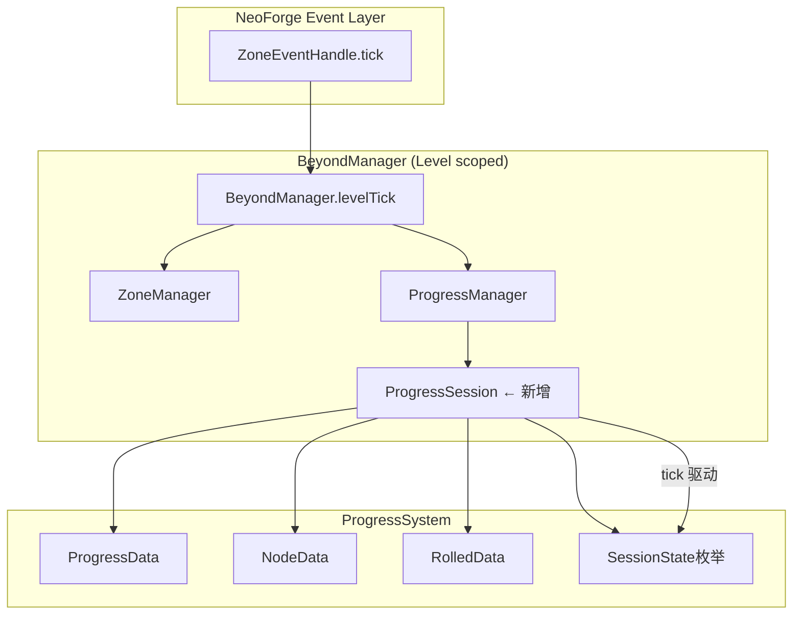

# ProgressSession 生命周期管理重构需求文档

> **版本**: v2.0
> **日期**: 2026-04-30
> **目标**: 引入 tick 驱动的 ProgressSession 统一关卡会话生命周期，替代纯事件驱动的 ProgressManager
> 
> **v2.0 变更**（2026-04-30）:
> - SessionState 简化为4状态：INACTIVE → WARMUP → IN_PROGRESS → COMPLETED
> - 移除 BETWEEN_SCENES / SCENE_READY（场景过渡由 sceneIndex 自然推进，无需显式阶段）
> - NodeState 保持4状态，"finish" 由事件列表最后一个 NodeEventType 处理（奖励发放）
> - 新增战利品袋物品：右键使用触发 INACTIVE→WARMUP→IN_PROGRESS
> - 行动路线 = 当前的 ProgressDefinition（不新建 ActionRoute 模型）
> - 暂不处理关键进度（Key Progress）
> - 防止反复出入边界：SessionState 守卫 + 战利品袋一次性消费

---

## 1. 背景与动机

### 1.1 当前架构

```
BeyondManager.levelTick() ──→ ZoneManager.handleZoneRule()   ← 唯一的 tick 消费
                             (ProgressManager 无 tick)

ProgressManager ──→ 纯事件驱动:
  ├── playerEnterNode()   → NodeState: LOCKED → READY
  ├── rightClickCenter()  → NodeState: READY → ON_EVENT → COMPLETED (逐步)
  ├── playerLeaveNode()   → 释放 READY 节点
  └── resetActiveNode()   → 强制 LOCKED
```

**两套割裂的状态机：**

| 状态机            | 级别   | 枚举值                                                         | 谁在使用        |
| ----------------- | ------ | -------------------------------------------------------------- | --------------- |
| `ProgressState` | 玩家级 | SAFE / WAITING / IN_PROGRESS_GROUND / IN_PROGRESS_NODE / EMPTY | 无人使用        |
| `NodeState`     | 节点级 | LOCKED / READY / ON_EVENT / COMPLETED                          | ProgressManager |

### 1.2 核心问题

1. **无 tick 驱动**: 不支持倒计时、超时、自动推进、阶段切换
2. **无"关卡会话"概念**: 没有 CSGameMap 那种 WARMUP → ROUND → END → NEW_ROUND 宏观周期
3. **两套状态机割裂**: `ProgressState` 定义了但无人维护，`NodeState` 只管单节点
4. **事件步进原始**: 每次右击推进一个事件，无等待/超时/中断
5. **tick 入口就绪但未使用**: `BeyondManager.levelTick()` 在 `ZoneEventHandle.tick()` 中每 tick 被调用，但只处理 zone，进度系统完全没接

### 1.3 参照模型: CSGameMap

```
CSGameMap.tick() 逐 tick 判断:
  isPause          → currentPauseTime 倒计时 → 恢复
  isWarmTime       → warmUpTime 倒计时 → startNewRound()
  isWaiting        → waitingTime 倒计时 → start()
  roundStarted     → currentRoundTime 累计
    ├── closeShopTime 阈值 → isShopLocked = true
    └── roundTimeLimit 阈值 → 超时处理
  isWaitingWinner  → winnerWaitingTime 倒计时 → startNewRound()
  isOvertime       → 加时特殊规则
```

**关键设计**: 每个阶段 = 一个 boolean flag + 一个 int 计时器 + tick() 中阈值检查 + 状态切换函数

---

## 2. 目标架构

### 2.1 新增 SessionLayer



### 2.2 SessionState 生命周期（简化版）

```
              ┌──────────┐
              │ INACTIVE  │  ← 关卡未初始化 / 玩家在安全区
              └─────┬────┘
                    │ 玩家右键战利品袋 → startSession()
                    ▼
              ┌──────────┐
              │  WARMUP   │  ← 倒计时（warmUpTicks），准备阶段
              └─────┬────┘
                    │ timer <= 0
                    ▼
         ┌──────────────────┐
    ┌───→│  IN_PROGRESS      │  ← 节点可交互，场景索引由完成节点数驱动
    │    └───────┬───────────┘
    │            │ 当前场景所有节点 COMPLETED
    │            │ → sceneIndex++（自然推进下一场景）
    │            │
    │            │ 全部场景完成
    │            ▼
    │    ┌──────────────────┐
    └────│    COMPLETED     │  ← 关卡结束，玩家传送回安全区
         └──────────────────┘
```

**状态说明：**

| 状态            | 含义                     | 节点可交互 | tick 行为                                                     |
| --------------- | ------------------------ | ---------- | ------------------------------------------------------------- |
| `INACTIVE`      | 无活动关卡               | ❌          | 跳过                                                          |
| `WARMUP`        | 热身倒计时，战利品袋后   | ❌          | 计时器递减，到0切 IN_PROGRESS，发放正式开始的标题文字             |
| `IN_PROGRESS`   | 关卡进行中               | ✅          | 检查场景完成度；每个节点COMPLETED推进进度；全部场景完成切 COMPLETED |
| `COMPLETED`     | 全部完成                 | ❌          | 停留或触发结算传送回安全区                                      |

### 2.3 战利品袋（LootBag）物品

**物品ID**: `beyond:loot_bag`

**交互逻辑**:
1. 玩家右键战利品袋 → 检查 SessionState 是否为 INACTIVE
2. 若 INACTIVE → `startSession()` → INACTIVE → WARMUP
3. 若已在 IN_PROGRESS → 拒绝，提示"游戏已在进行中"
4. WARMUP 倒计时结束 → IN_PROGRESS，广播标题"游戏开始"
5. 物品右键后消耗（一次性）

**防止反复出入边界**:
- SessionState.IN_PROGRESS 时，战利品袋右键被拒绝
- SessionState.IN_PROGRESS 时，再次跨出边界不触发新游戏
- 游戏进行中通过传送/死亡等方式回到安全区 → 触发 COMPLETED（TODO：后续实现）

**物品注册**: 通过 NeoForge DeferredRegister 注册简单 Item

### 2.4 ProgressState 重构（后续版本）

**首版策略**: `ProgressState` 枚举保持不动，由 `ProgressSession` 后续动态导出。

---

## 3. 文件变更清单

### 3.1 新增文件

| # | 文件                                            | 说明                                        |
| - | ----------------------------------------------- | ------------------------------------------- |
| 1 | `.../progress/core/SessionState.java`           | 会话阶段枚举，4个状态（INACTIVE/WARMUP/IN_PROGRESS/COMPLETED） |
| 2 | `.../progress/core/ProgressSession.java`        | tick 驱动的会话管理器，持有所有配置和计时器        |
| 3 | `.../init/BeyondItems.java`                     | 物品注册类，含战利品袋                        |
| 4 | `.../event/handle/LootBagHandler.java`          | 战利品袋右键事件处理                          |

### 3.2 修改文件

| # | 文件                      | 改动                                                                                                                                                                   |
| - | ------------------------- | ---------------------------------------------------------------------------------------------------------------------------------------------------------------------- |
| 5 | `Beyond.java`             | `newRegister()` 中新增 `BeyondItems.register(modEventBus)`                                                                                                            |
| 6 | `ProgressManager.java`    | 新增 `getSession()` / `tick()` 委托给 `ProgressSession`；`initProgress()` 初始化 session；`rightClickCenter()` / `playerEnterNode()` 通过 session 检查阶段              |
| 7 | `BeyondManager.java`      | `levelTick()` 中增加 `progressManager.tick(serverLevel)` 调用                                                                                                          |
| 8 | `ZoneEventHandle.java`    | 新增战利品袋右键事件订阅（或内联到 LootBagHandler）                                                                                                                       |

---

## 4. 详细设计

### 4.1 SessionState.java

```java
package com.pz.beyond.api.system.progress.core;

import com.mojang.serialization.Codec;
import net.minecraft.util.StringRepresentable;

/**
 * 关卡会话生命周期阶段（简化版）。
 * <p>
 * 完整流程：INACTIVE → WARMUP → IN_PROGRESS → COMPLETED
 */
public enum SessionState implements StringRepresentable {
    /** 无活动关卡，或关卡未初始化 */
    INACTIVE("inactive"),
    /** 热身倒计时，战利品袋右键后进入 */
    WARMUP("warmup"),
    /** 关卡进行中，节点可交互 */
    IN_PROGRESS("in_progress"),
    /** 全部场景完成，关卡结束 */
    COMPLETED("completed");

    private final String name;

    SessionState(String name) { this.name = name; }

    @Override
    public String getSerializedName() { return name; }

    public boolean canInteractWithNode() {
        return this == IN_PROGRESS;
    }

    public static final Codec<SessionState> CODEC = StringRepresentable.fromEnum(SessionState::values);
}
```

### 4.2 ProgressSession.java

**核心字段：**

```java
public class ProgressSession {
    // === 状态 ===
    private SessionState sessionState = SessionState.INACTIVE;

    // === 计时器（单位：tick）===
    private int sessionTimer = 0;          // 通用倒计时（WARMUP 用）

    // === 配置（tick 单位） ===
    private int warmUpTicks = 200;          // 热身 10s

    // === 场景进度 ===
    private int currentSceneIndex = 0;     // 当前场景索引
    private int totalScenes = 0;           // 总场景数

    // === 关联 ===
    private final ProgressManager progressManager;
    private ProgressData progressData;     // 从 BeyondLevelData 延迟获取
}
```

**tick() 逻辑（简化版）：**

```java
public void tick(ServerLevel level) {
    switch (sessionState) {
        case INACTIVE, COMPLETED -> { /* 不处理 */ }

        case WARMUP -> {
            sessionTimer--;
            if (sessionTimer <= 0) {
                transitionTo(SessionState.IN_PROGRESS, level);
            }
        }

        case IN_PROGRESS -> {
            // 检查当前场景是否所有节点完成 → sceneIndex++
            if (isCurrentSceneComplete()) {
                if (currentSceneIndex + 1 >= totalScenes) {
                    transitionTo(SessionState.COMPLETED, level);
                } else {
                    currentSceneIndex++;
                }
            }
        }
    }
}
```

**startSession() 入口：**

```java
/** 由战利品袋右键调用，只能从 INACTIVE 启动 */
public boolean startSession(ResourceLocation progressId, ServerLevel level) {
    if (this.sessionState != SessionState.INACTIVE) {
        return false;
    }
    // 委托 ProgressManager.initProgress 初始化关卡数据
    progressManager.initProgress(progressId);
    // 延迟获取 ProgressData
    this.progressData = BeyondAPI.getBeyondLevelData(level).getProgressData();
    this.totalScenes = progressData.getSceneTypes().size();
    this.currentSceneIndex = 0;

    transitionTo(SessionState.WARMUP, level);
    return true;
}
```

**阶段转换函数（简化版）：**

```java
private void transitionTo(SessionState target, ServerLevel level) {
    this.sessionState = target;

    switch (target) {
        case WARMUP -> {
            this.sessionTimer = this.warmUpTicks;
            // 可广播"准备开始"消息
        }
        case IN_PROGRESS -> {
            // 广播正式开始的标题文字
            for (ServerPlayer player : level.players()) {
                player.displayClientMessage(Component.translatable("beyond.game.start"), true);
            }
        }
        case COMPLETED -> {
            // 广播关卡完成
            for (ServerPlayer player : level.players()) {
                player.displayClientMessage(Component.translatable("beyond.game.complete"), false);
            }
        }
    }
}
```

**节点交互守卫：**

```java
public boolean canInteractWithNode() {
    return sessionState == SessionState.IN_PROGRESS;
}
```

### 4.3 ProgressManager 变更

```java
public class ProgressManager implements IProgressManager {

    // 新增：会话管理器，构造时初始化
    private final ProgressSession session = new ProgressSession(this);

    public ProgressSession getSession() {
        return session;
    }

    // 新增：tick 入口（由 BeyondManager.levelTick 调用）
    public void tick(ServerLevel level) {
        session.tick(level);
    }

    @Override
    public void initProgress(ResourceLocation progressID) {
        // 现有逻辑保持不变...
        // 注意：Session 启动不在此处，由战利品袋触发 startSession() 统一入口
    }

    @Override
    public void rightClickCenter(ServerPlayer player) {
        // 新增：Session 阶段检查
        if (!session.canInteractWithNode()) {
            return;
        }
        // 现有逻辑保持不变...
    }

    @Override
    public void playerEnterNode(ServerPlayer player) {
        // 新增：Session 阶段检查
        if (!session.canInteractWithNode()) {
            return;
        }
        // 现有逻辑保持不变...
    }
}
```

### 4.4 BeyondManager 变更

```java
@Override
public void levelTick(Level level) {
    if (level instanceof ServerLevel serverLevel && BeyondAttachInit.isAllowedDimension(serverLevel)) {
        zoneManager.handleZoneRule(serverLevel);
        progressManager.tick(serverLevel);  // 新增
    }
}
```

### 4.5 BeyondItems.java（新增）

```java
public class BeyondItems {
    public static final DeferredRegister.Items ITEMS =
            DeferredRegister.createItems(Beyond.MODID);

    public static final DeferredItem<Item> LOOT_BAG =
            ITEMS.register("loot_bag", () -> new Item(new Item.Properties().stacksTo(1)));

    public static void register(IEventBus bus) {
        ITEMS.register(bus);
    }
}
```

### 4.6 LootBagHandler（新增）

战利品袋右键事件处理，在现有 `ZoneEventHandle` 中新增订阅：

```java
@SubscribeEvent
public static void onLootBagUse(PlayerInteractEvent.RightClickItem event) {
    if (!(event.getEntity() instanceof ServerPlayer player)) return;
    if (!(player.level() instanceof ServerLevel serverLevel)) return;
    if (!BeyondAttachInit.isAllowedDimension(serverLevel)) return;

    ItemStack stack = event.getItemStack();
    if (!stack.is(BeyondItems.LOOT_BAG.get())) return;

    ProgressSession session = BeyondAPI.getBeyondManager().getProgressManager().getSession();
    
    // 守卫：只能从 INACTIVE 启动
    if (session.getSessionState() != SessionState.INACTIVE) {
        player.displayClientMessage(Component.translatable("beyond.loot_bag.already_active"), false);
        return;
    }

    // 获取当前选中的 Progress ID（从 BeyondLevelData 的 progressDefinitions 第一个）
    BeyondLevelData levelData = BeyondAPI.getBeyondLevelData(serverLevel);
    if (levelData.getProgressDefinitions().isEmpty()) {
        player.displayClientMessage(Component.translatable("beyond.loot_bag.no_progress"), false);
        return;
    }
    ResourceLocation progressId = levelData.getProgressDefinitions().keySet().iterator().next();

    // 启动 Session
    boolean started = session.startSession(progressId, serverLevel);
    if (started) {
        stack.shrink(1); // 消耗物品
        player.displayClientMessage(Component.translatable("beyond.loot_bag.start"), false);
    }
}
```

---

## 5. 执行任务清单

### Task 1: 新增 SessionState 枚举
- 文件: `.../progress/core/SessionState.java`
- 内容: 4个状态值（INACTIVE/WARMUP/IN_PROGRESS/COMPLETED），`canInteractWithNode()`，Codec

### Task 2: 新增 ProgressSession 核心类
- 文件: `.../progress/core/ProgressSession.java`
- 内容: 状态机字段、`tick()` 方法、`startSession()`、`transitionTo()`、场景完成判定

### Task 3: 重构 ProgressManager 集成 Session
- 文件: `ProgressManager.java`
- 改动:
  - 新增 `final ProgressSession session` 字段和 `getSession()`
  - 新增 `tick(ServerLevel)` 方法
  - `rightClickCenter()` / `playerEnterNode()` 添加 `session.canInteractWithNode()` 守卫
  - `initProgress()` 不再启动 Session（由战利品袋触发）

### Task 4: 修改 BeyondManager.levelTick 接入 Progress
- 文件: `BeyondManager.java`
- 改动: `levelTick()` 中增加一行 `progressManager.tick(serverLevel)`

### Task 5: 创建 BeyondItems + 战利品袋
- 文件: `.../init/BeyondItems.java`（新增）
- 内容: DeferredRegister.Items，注册 `loot_bag` 物品
- 文件: `Beyond.java`
- 改动: `newRegister()` 中新增 `BeyondItems.register(modEventBus)`

### Task 6: 添加战利品袋右键事件
- 文件: `ZoneEventHandle.java`
- 改动: 新增 `onLootBagUse` 订阅方法
- 文件: `assets/beyond/lang/en_us.json`（新增翻译键）

### Task 7: 验证编译通过
- 运行 Gradle 编译，修复所有错误
- 确认无遗漏的引用更新

---

## 6. 验收标准

1. ✅ `SessionState` 4状态枚举编译通过
2. ✅ `ProgressSession.tick()` 能正确驱动 INACTIVE → WARMUP → IN_PROGRESS → COMPLETED
3. ✅ `ProgressManager` 的节点操作受 Session IN_PROGRESS 阶段管控
4. ✅ `BeyondManager.levelTick()` 中 Progress tick 正常执行
5. ✅ 战利品袋右键能从 INACTIVE 启动 WARMUP，消耗后不能复用
6. ✅ 游戏进行中再次右键战利品袋被拒绝
7. ✅ 不影响现有的 Zone 系统正常运行
8. ✅ 编译无错误、无警告

---

## 7. 后续扩展（暂不实现）

- [ ] SessionState 序列化到 BeyondLevelData
- [ ] 进度事件广播（SessionPhaseChangeEvent）
- [ ] 客户端 HUD 显示当前阶段/倒计时
- [ ] 从 ProgressDefinition 读取 warmUpTicks 等配置
- [ ] sceneTimeoutTicks 可覆盖的节点超时处理（fallback 逻辑）
- [ ] ProgressState 动态导出（基于 SessionState + 玩家位置）
- [ ] 多玩家并发 session（当前为单例全局 session）
